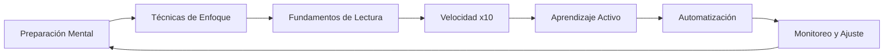
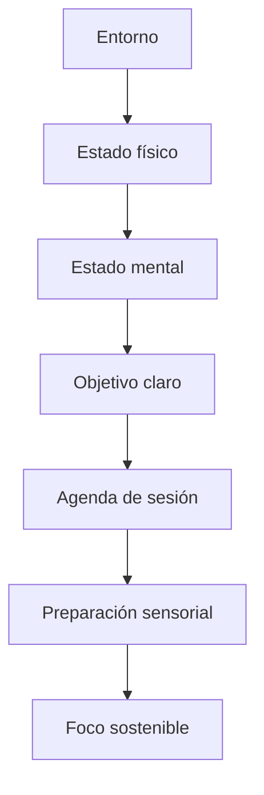
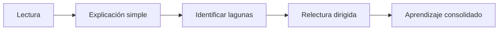

# Guía Definitiva: Concentración y Lectura x10

## INTRODUCCIÓN: ¿POR QUÉ ESTA GUÍA ES DIFERENTE?

La mayoría de las guías de productividad ofrecen trucos aislados. Esta guía propone un **sistema integrado** que combina neurociencia, psicología cognitiva y práctica deliberada para desarrollar dos habilidades fundamentales: mantener la concentración y leer más rápido sin sacrificar comprensión.

> **Objetivo de Aprendizaje** — Al final de esta guía, podrás diseñar una rutina personalizada de estudio que te permita leer x10 tus materiales técnicos, mantener foco por sesiones largas, y aplicar técnicas de aprendizaje activo mientras lees.

---

## MAPA DEL SISTEMA



---

## PARTE 1: PREPARACIÓN MENTAL — EL ESTADO ANTEROCEPTIVO

### 1.1 Principio Central

Tu cerebro no está diseñado para concentración sostenida. Está diseñado para detectar cambios y alertas. Antes de leer rápido, debes crear condiciones que reduzcan la fatiga atencional.



### 1.2 Checklist de preparación previa a leer

| Elemento | Acción | Tiempo |
|----------|--------|--------|
| **Entorno** | Elimina distracciones visuales y auditivas | 2 min |
| **Físico** | Hidratación, postura, luz adecuada | 3 min |
| **Mental** | 5 minutos de respiración consciente | 5 min |
| **Objetivo** | Define qué debes extraer del texto | 1 min |
| **Agenda** | Bloque de 25-45 min sin interrupciones | 1 min |

### 1.3 Rutina de activación sensorial

```text
Técnica: Preparación de 5-4-3-2-1
- 5 objetos que ves
- 4 que puedes tocar
- 3 que escuchas
- 2 que hueles
- 1 que saboreas
```

> **📌 Idea clave** — Estar presente no es un concepto abstracto; es una preparación sensorial concreta que reduce la carga cognitiva de atención.

---

## PARTE 2: TÉCNICAS DE ENFOQUE — SOSTENER LA ATENCIÓN

### 2.1 La regla de Pomodoro adaptada

Para lectura técnica y concentración sostenida:

| Técnica | Duración | Descanso | Uso |
|---------|----------|----------|-----|
| **Foco intenso** | 25 min | 5 min | Lectura ligera |
| **Deep work** | 45-60 min | 15 min | Textos complejos |
| **Flow state** | 90 min | 30 min | Práctica avanzada |

### 2.2 Anclaje de atención

```python
def attention_anchor(anchor_word="ancla"):
    """
    Técnica: Cada vez que notes que tu mente divaga,
    vuelve a la palabra ancla. No la busques, solo recuerda.
    """
    return f"Vuelve a {anchor_word} suavemente"
```

### 2.3 Señales de pérdida de foco

| Señal | Acción correctiva |
|-------|-------------------|
| Relectura automática | Usa ruler/finger guide |
| Pensamientos intrusivos | Ancla + regresa al texto |
| Fatiga visual | Descanso de 20 seg |
| Dificultad para entender | Divide párrafo en oraciones |

---

## PARTE 3: FUNDAMENTOS DE LECTURA — EL SISTEMA VISUAL

### 3.1 La física de la lectura

Tu ojo no lee palabra por palabra. Realiza registros saccádicos. La técnica x10 imita esto naturalmente.

| Registro | Tamaño típico | Palabras |
|----------|---------------|----------|
| Saccádico corto | 7-10 caracteres | 1-2 palabras |
| Saccádico medio | 15-20 caracteres | 3-4 palabras |
| Saccádico amplio | 30-40 caracteres | 6-8 palabras |

### 3.2 Código base: Técnica Pointer

```python
class PointerTechnique:
    def __init__(self, words_per_gaze=4):
        self.gaze_width = words_per_gaze
        self.speed = 200  # ppm objetivo
        
    def practice_session(self, text, duration_minutes=10):
        # Guía visual con dedo/ruler
        # Evita subvocalización
        pass
```

> **📌 Idea clave** — La velocidad de lectura no se incrementa con esfuerzo, se optimiza eliminando movimientos innecesarios.

---

## PARTE 4: VELOCIDAD X10 — MÉTODOS PROGRESIVOS

### 4.1 Método incremental

| Nivel | Técnica | Velocidad objetivo |
|-------|---------|---------------------|
| 1 | Subrayado activo | Baseline |
| 2 | Pointer + sin regresión | +20% |
| 3 | Mini-span (3-4 palabras) | +50% |
| 4 | Chunking visual | +100% |
| 5 | Skimming + scanning | +200% |
| 6 | Preview + metalectura | +500% |
| 7 | Lectura x10 combinada | +1000% |

### 4.2 Tabla de técnicas x10

| Técnica | Mecánica | Cuándo usar |
|---------|----------|-------------|
| **Preview** | 3 lecturas previas: portada, índices, summary | Textos técnicos largos |
| **Metalectura** | Preguntas antes de leer | Material complejo |
| **Skimming** | Lectura diagonal de encabezados | Búsqueda rápida |
| **Chunking** | Bloques de 5-7 palabras | Texto denso |
| **Visual span** | Ampliar registros oculares | Practica diaria |

### 4.3 Ejercicio de chunking

```text
Texto original:
"La neuroplasticidad es la capacidad del cerebro para modificar su estructura y función en respuesta a la experiencia."

Chunking:
"La neuroplasticidad | es la capacidad | del cerebro para | modificar su estructura | y función en respuesta | a la experiencia."
```

> **📌 Idea clave** — Cada bloque debe ser una sola visualización mental. No te detengas en cada palabra.

---

## PARTE 5: APRENDIZAJE ACTIVO — LEER PARA RECORDAR

### 5.1 Técnica Feynman en 3 pasos



### 5.2 Tabla de interacción lectura-ejercicio

| Momento | Acción | Herramienta |
|---------|--------|-------------|
| 1 | Preguntas previas | Hoja de mapa mental |
| 2 | Lectura activa | Subrayado con propósito |
| 3 | Parada cada 10 min | Ejercicio de recall |
| 4 | Conexión conceptos | Analogías personales |
| 5 | Resumen final | Explicación en voz alta |

### 5.3 Micro-práctica durante lectura

```python
def micro_practice(text_block, questions):
    """
    Cada bloque de texto (400-500 palabras):
    1. Lee pregunta
    2. Busca respuesta
    3. Resume en 1 oración
    4. Conecta con conocimiento previo
    """
    return "Respuesta + conexión + acción"
```

---

## PARTE 6: AUTOMATIZACIÓN — RUTINAS QUE FUNCIONAN

### 6.1 Rutina matutina de foco

```text
5:30 - Despertar + agua
5:35 - Respiración 4-7-8 (3 ciclos)
5:40 - Revisión objetivos día
5:45 - Lectura técnica bloque 1
6:00 - Recall ejercicio
6:05 - Descanso activo
```

### 6.2 Rutina pre-lectura (5 pasos)

| Paso | Acción | Duración |
|------|--------|----------|
| 1 | Hidratación consciente | 30 seg |
| 2 | Postura optimal | 30 seg |
| 3 | Ancla atencional | 1 min |
| 4 | Preview del texto | 2 min |
| 5 | Intención de aprendizaje | 30 seg |

### 6.3 Checklist de hábitos

| Hábito | Frecuencia | Medición |
|--------|------------|----------|
| Sesión sin distracciones | Diario | Tiempo bloqueado |
| Practica técnica lectura | Diario | ppm logrado |
| Recall post-lectura | Cada sesión | Calidad respuesta |
| Revisión notas | Semanal | Conexiones nuevas |
| Ajuste rutina | Mensual | Mejora % |

> **📌 Idea clave** — La automatización no elimina la intención; la prepara para cuando más la necesitas.

---

## PARTE 7: MONITOREO Y AJUSTE — EL BUCLE DE MEJORA

### 7.1 Métricas de progreso

| Métrica | Fórmula | Meta |
|---------|---------|------|
| **PPM efectivo** | Palabras leídas / tiempo | +10% semanal |
| **Comprensión %** | Conceptos recordados / total | >80% |
| **Retención 24h** | Recordado 24h después | >70% |
| **Fatiga visual** | Escal 1-10 | <4 promedio |

### 7.2 Señales de alerta

| Señal | Acción |
|-------|--------|
| PPM baja + fatiga alta | Descanso + ajuste técnica |
| Comprensión < 70% | Menos ppm, más interactividad |
| Retención < 50% | Más ejercicios de recall |
| Postura deteriorada | Recordatorio cada 20 min |

### 7.3 Prueba de diagnóstico semanal

```python
def weekly_check():
    return {
        "ppm_baseline": measure_reading_speed(),
        "comprehension": quick_quiz(),
        "retention": recall_test(),
        "energy": fatigue_scale(),
        "adjustment_needed": ppm_improvement_rate() < 0.1
    }
```

---

## PARTE 8: I DO / WE DO / YOU DO — EJERCICIOS PROGRESIVOS

### 8.1 I Do — Lectura guiada con Pointer

**Objetivo:** usar guía visual sin regresión.

| Paso | Acción | Resultado |
|------|--------|-----------|
| 1 | Usar ruler/finger | Guía visible |
| 2 | Evitar relectura | Contar veces relectura |
| 3 | Mantener 200 ppm | Cronómetro |
| 4 | Recall inmediato | 3 conceptos clave |

```python
pointer_session = PointerTechnique()
pointer_session.gaze_width = 3
```

### 8.2 We Do — Técnica de preguntas activas

**Ejercicio colaborativo:** mientras lees un texto técnico, formula preguntas.

| Pregunta tipo | Ejemplo |
|---------------|---------|
| ¿Qué problema resuelve? | "¿Este patrón de diseño resuelve qué problema?" |
| ¿Cómo funciona? | "¿Cuál es el flujo de datos?" |
| ¿Por qué importa? | "¿Qué consecuencia tiene?" |
| ¿Qué falta? | "¿Qué caso no considera?" |

### 8.3 You Do — Rutina personalizada de 7 días

**Tarea:** diseña tu rutina basada en tus metas.

| Día | Técnica | Objetivo |
|-----|---------|----------|
| 1 | Baseline + preview | Medir punto inicio |
| 2 | Pointer + recall | +20% velocidad |
| 3 | Chunking + ejemplos | +50% comprensión |
| 4 | Skimming + objetivos | +30% eficiencia |
| 5 | Lectura x10 parcial | +50% velocidad |
| 6 | Full x10 + Feynman | +100% aprendizaje |
| 7 | Monitoreo + ajuste | Consolidar rutina |

> **📌 Idea clave** — La práctica intensiva de 7 días crea hábito más que meses de esfuerzo inconsistente.

---

## PARTE 9: HERRAMIENTAS Y RECURSOS

### 9.1 Herramientas digitales

| Herramienta | Uso | Plataforma |
|-------------|-----|------------|
| **Spreeder** | Entrenamiento visual | Web |
| **Acceleread** | Técnicas guiadas | iOS |
| **BeeLine Reader** | Mejora tracking | Extensión |
| **Readlang** | Lectura + vocabulario | Web |
| **Anki** | Recall espaciado | Multiplataforma |

### 9.2 Configuración visual ideal

```css
.article-content {
  font-size: 18px;
  line-height: 1.75;
  max-width: 65ch;
}

.speed-reading {
  column-width: 40ch;
  column-gap: 2rem;
}
```

---

## CHECKLIST FINAL DE CONCENTRACIÓN Y LECTURA X10

| Bloque | Check |
|--------|-------|
| Preparación | Checklist previa completado |
| Técnica | Método pointer dominado |
| Velocidad | +50% sin perder comprensión |
| Aprendizaje | Ejercicios de recall activos |
| Rutina | Automatizada y seguimiento |
| Monitoreo | Métricas semanales |
| Ajuste | Mejora continua basada en datos |

---

## Preguntas de Verificación

1. **Aplica**: Si tu PPM actual es 200 y tu meta es 400, ¿qué técnica probarías primero y por qué?

2. **Analiza**: ¿Cómo afecta la subvocalización a tu velocidad de lectura? Propones un método para reducirla?

3. **Diseña**: Crea una rutina de 30 minutos para estudiar un manual técnico usando las técnicas de esta guía.

4. **Reflexiona**: ¿Qué es más importante: velocidad o retención? Justifica tu respuesta.

5. **Conecta**: Explica cómo la técnica de anclaje de atención puede combinarse con el método x10.

---

## GLOSARIO RÁPIDO

| Término | Definición |
|---------|------------|
| **PPM** | Palabras por minuto leídas |
| **Saccádico** | Registro ocular de un movimiento |
| **Subvocalización** | Pronunciar mentalmente cada palabra |
| **Chunking** | Agrupar palabras en bloques visuales |
| **Preview** | Lectura previa para mapear contenido |
| **Recall** | Recuperar información sin mirar el texto |
| **Ancla** | Punto de retorno cuando la mente divaga |
| **Metalectura** | Preguntas antes de leer para preparar la mente |