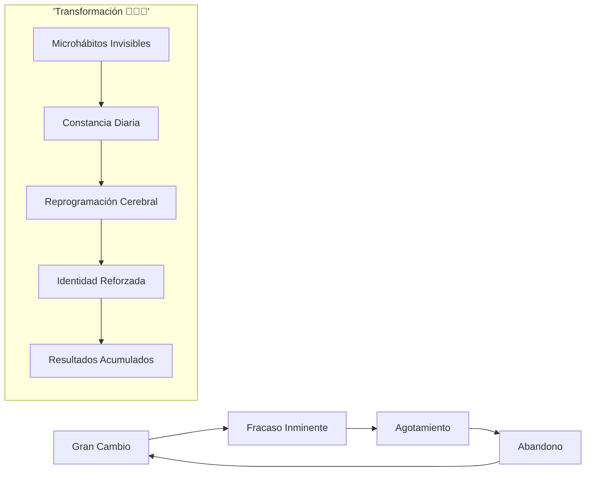
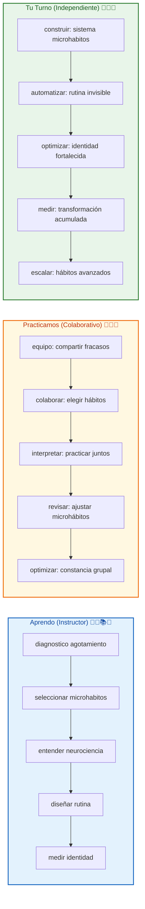

# 🚀 MASTERCLASS: 20 Microhábitos Transformadores — La Revolución Invisible 🔥🧠⚡🎯💎

## 🎯 INTRODUCCIÓN: POR QUÉ ESTE MASTERCLASS ES DIFERENTE 💡⚡🌟🚀💥

La mayoría busca grandes cambios. Pero la ciencia revela una verdad poderosa: **los resultados provienen de microhábitos invisibles y constantes**. Cada hábito de menos de 5 minutos reprograma tu cerebro, fortalece tu identidad y acumula transformación.

Este masterclass te entrega los **20 microhábitos científicamente validados** que Jaime Higuera comparte para transformar tu vida sin agotarte.

> **🎯 Objetivo de Aprendizaje** — Al final de esta guía, implementarás microhábitos diarios, entenderás su efecto neuroquímico y tendrás un sistema de identidad basado en constancia.

> **⚠️ Advertencia** — Este contenido es formativo. No implementes los 20 a la vez. Elige 2-3 para comenzar. La constancia vence a la intensidad.

---

## 🗺️ MAPA DEL WORKFLOW DE MICROHÁBITOS TRANSFORMADORES 🗺️🚀🧠⚡🎯



| Fase 🌍 | Pregunta clave ❓ | Output principal 🎯 |
|--------|------------------|------------------|
| **Gran Cambio** 🏋️ | ¿Qué intento masivo? | Identificación de agotamiento |
| **Fracaso Inminente** ⚠️ | ¿Qué no dura? | Reconocimiento de error estructural |
| **Agotamiento** 💔 | ¿Qué te consume? | Mapeo de energía mal usada |
| **Abandono** 🚪 | ¿Qué dejas a medias? | Motivación para microhábitos |
| **Transformación** 🌟 | ¿Qué hábito invisible? | Primer microhábito seleccionado |

---



---

## 🌅🌞 PARTE 1: RUTINA MATUTINA Y MENTALIDAD 🌅✨🧠⚡🎯💥

### 1.1 🌞☀️ Los primeros 5 microhábitos para arrancar tu día

Los primeros minutos definen tu energía. Estos microhábitos no toman más de 3 minutos combinados pero generan un efecto dominó:

### 1.2 📊📋 Los 5 Microhábitos Matutinos

| #️⃣ | Microhábito 🎯 | Duración ⏱️ | Beneficio 🧠 | Estrategia ⚡ |
|----|----------------|-------------|-------------|--------------|
| 1️⃣ | 10 segundos de luz solar ☀️ | 10 segundos | Regula ritmo circadiano 🕐 | Ventana abierta o luz artificial |
| 2️⃣ | Regla de dos vasos de agua 💧 | 30 segundos | Combate deshidratación 💪 | Botellas preparadas la noche |
| 3️⃣ | Escribir una línea ✍️ | 1 minuto | Reduce estrés 🧘 | Diario o app de notas |
| 4️⃣ | Minuto de visualización 🎯 | 1 minuto | Mejora rendimiento 🚀 | Antes de levantarte |
| 5️⃣ | Declaración de intención 🎤 | 30 segundos | Aumenta probabilidad de éxito 📈 | En voz alta frente al espejo |

### 1.3 🛠️⚡ Rutina de los 5 minutos matutinos

```
🌅 Protocolo mañanero 🌞🧠⚡:
1. Abrir cortinas o luz solar ☀️👁️ (10 seg)
2. Beber 2 vasos de agua 💧� liquido (30 seg)
3. Escribir 1 línea del día ✍️📝 (1 min)
4. Visualizar meta del día 🎯🧠 (1 min)
5. Declarar intención en voz alta 🎤🎯 (30 seg)

⏱️ Total: Menos de 3 minutos = Día transformado 🚀
```

---

## 🎯💼 PARTE 2: PRODUCTIVIDAD Y ENFOQUE — MICROHÁBITOS PROFESIONALES 🎯✨📱🧠⚡🚀

### 2.1 🎯🚀 Los hábitos que multiplican tu rendimiento

Tu cerebro necesita micro-pausas para mantener claridad. Estos hábitos te mantienen en estado de flujo sin agotarte.

### 2.2 📊📈 Los 5 Microhábitos de Productividad

| #️⃣ | Microhábito 🎯 | Duración ⏱️ | Beneficio 🧠 | Estrategia ⚡ |
|----|----------------|-------------|-------------|--------------|
| 6️⃣ | Arranque de 2 minutos ⏱️ | 2 minutos | Vence procrastinación 🚫 | Usar Pomodoro 25 min |
| 7️⃣ | Ventanas de tarea única 📱 | 25 minutos | Evita residuo cognitivo 🧠 | Cerrar apps al iniciar |
| 8️⃣ | Buffer de 2 respiraciones 🌬️ | 30 segundos | Optimiza reacciones 😊 | Antes de cada notificación |
| 9️⃣ | Cadena del "¿y después qué?" 🔗 | 1 minuto | Anticipa consecuencias 🎯 | Preguntar 3 veces al día |
| 🔟 | Snacks de movimiento 💪 | 1 minuto | Rompe sedentarismo 🚶 | Cada 60 min de trabajo |

### 2.3 🛠️🔧 Protocolo de enfoque profundo

```
🎯 Sistema de productividad 🧠⚡🚀:
1. Mini-compromiso: 2 minutos mínimos ⏱️🎯
2. Bloque único: 25 min sin distracciones 📱🚫
3. Pausa respirando: 2 respiraciones antes de reaccionar 🌬️⏸️
4. Cadena lógica: "¿Y después qué?" 3 veces al día 🔗❓
5. Movimiento micro: 1 minuto cada hora 💪🚶

⏱️ Total: 29 minutos = 4 horas ganadas 🚀
```

---

## 👥💖 PARTE 3: RELACIONES Y BIENESTAR — CONEXIÓN AUTÉNTICA 👥✨🧠💪🌟🤝

### 3.1 👥🌟 Los microhábitos que fortalecen tu vida social

Tus relaciones definen tu éxito. Estos hábitos te convierten en alguien memorable sin esfuerzo.

### 3.2 📊📋 Los 5 Microhábitos de Relaciones

| #️⃣ | Microhábito 👥 | Duración ⏱️ | Beneficio 🧠 | Estrategia ⚡ |
|----|----------------|-------------|-------------|--------------|
| 1️⃣1️⃣ | Cumplido sincero 👍 | 10 segundos | Mejora vínculos 🧡 | Observación + reconocimiento |
| 1️⃣2️⃣ | Usar su nombre 🗣️ | Instantáneo | Crea conexión 🤝 | Escuchar nombre 2 veces |
| 1️⃣3️⃣ | Evitar suposiciones ❓ | 30 segundos | Evita conflictos 🕊️ | Preguntar: "¿cómo estás?" |
| 1️⃣4️⃣ | Ancla de gratitud 🙏 | 1 minuto | Estado positivo 🧠 | Asociar a rutina existente |
| 1️⃣5️⃣ | Microamabilidad ✨ | Variable | Aumenta felicidad 😊 | Mirar por oportunidades |

### 3.3 🛠️🤝 Protocolo de relaciones auténticas

```
👥 Sistema de conexión 👥🤝✨:
1. Cumplido diario: 1 reconocimiento sincero 👍🗣️
2. Nombre activo: Usar nombre en conversaciones 🗣️🎯
3. Preguntar real: "¿Cómo estás?" sin juzgar ❓🧡
4. Gratitud anclada: 1 agradecimiento post-comida 🙏🍽️
5. Amabilidad alerta: Buscar 1 forma de ayudar ✨🤝

⏱️ Total: Menos de 2 minutos = Relaciones transformadas 💞
```

---

## 🌙💤 PARTE 4: CIERRE Y CONSISTENCIA — EL CIERRE PODEROSO 🌙✨🧠⚡🛡️

### 4.1 🌙🔄 Los microhábitos que consolidan tu transformación

Tu día no termina cuando apagas la luz. Estos hábitos cierran con broche de oro y preparan el éxito del día siguiente.

### 4.2 📊📈 Los 5 Microhábitos de Cierre

| #️⃣ | Microhábito 🌙 | Duración ⏱️ | Beneficio 🧠 | Estrategia ⚡ |
|----|----------------|-------------|-------------|--------------|
| 1️⃣6️⃣ | 30 segundos de ducha fría 🚿 | 30 segundos | Incomodad voluntaria 💪 | Fin de ducha caliente |
| 1️⃣7️⃣ | Leer 5 páginas 📖 | 5 minutos | Mejora memoria y empatía 🧠 | Antes de dormir |
| 1️⃣8️⃣ | Reinicio semanal 🔄 | 20 minutos | Reduce carga mental 📉 | Domingo por la mañana |
| 1️⃣9️⃣ | Señal para dormir 😴 | 5 minutos | Mejora sueño profundo 💤 | Rutina constante |
| 2️⃣0️⃣ | Nunca llegar a cero 🛡️ | Instantáneo | Mantiene identidad 🌟 | Hacer algo mínimo siempre |

### 4.3 🛠️🔧 Protocolo de cierre poderoso

```
🌙 Rutina nocturna 🌙💤🛡️✨:
1. Ducha fría: 30 seg al final 🚿❄️ (30 seg)
2. Lectura: 5 páginas mínimo 📖🧠 (5 min)
3. Señal dormir: Misma hora siempre 😴⏰
4. Gratitud: 3 agradecimientos del día 🙏🌟
5. Metahábito: Hacer algo mínimo mañana 🎯🔄

⏱️ Total: 10 minutos = Sueño reparador 🛌
```

---

## 🧠⚡ PARTE 5: LA NEUROCIENCIA DE LOS MICROHÁBITOS 🧠✨🔬💡🚀

### 5.1 🧠🔬 Cómo reprograman tu cerebro sin agotarte

Los microhábitos funcionan porque:
- **Activan la dopamina sin estrés** ⚡🧠
- **Refuerzan circuitos neuronales** 🔁🧠
- **Construyen identidad progresiva** 🎯🧠
- **Evitan la resistencia al cambio** 🚫🧠

### 5.2 📊🔬 Tabla: neuroquímica de cada microhábito

| Microhábito 🎯 | Neurotransmisor ⚡ | Efecto 🧠 |
|---------------|-------------------|----------|
| Luz solar ☀️ | Serotonina 🌟 | Mejora humor |
| Agua 💧 | Dopamina ⚡ | Energía inmediata |
| Escritura ✍️ | Cortisol reducido 🧘 | Reduce estrés |
| Visualización 🎯 | Dopamina anticipada 🌟 | Motiva acción |
| Intención 🎤 | Noradrenalina ⚡ | Claridad mental |
| 2 minutos ⏱️ | Dopamina inmediata 🌟 | Vence resistencia |
| Tarea única 📱 | Adrenalina controlada ⚡ | Enfoque profundo |
| Respiración 🌬️ | GABA balanza 🧘 | Calma activa |
| "¿Y después qué?" 🔗 | Corte prefrontal 🧠 | Decisión acertada |
| Movimiento 💪 | Endorfinas 🌟 | Energía sostenida |

### 5.3 🛠️🧪 Protocolo neuroquímico diario

```
🧠 Sistema cerebral 🧠⚡🌟:
1. Activar serotonina: luz solar o luz azul ☀️⚡
2. Dopamina mínima: agua + movimiento 💧💪
3. Calmar cortisol: escritura + respiración ✍️🌬️
4. An anticipar: visualización + ancla 🎯🙏
5. Refuerzo identidad: 1 microhábito completado ✅🌟
```

---

## 🎓🏫 PARTE 6: I DO / WE DO / YOU DO — IMPLEMENTACIÓN PRÁCTICA 🎓✨🏫👥🎯🚀

### 6.1 🏫📝 I Do — Diagnosticar tu punto de partida

| Paso 🚶 | Acción ⚡ | Resultado esperado ✅ |
|------|--------|--------------------|
| 1️⃣ 🧠 | Identificar 3 microhábitos que puedes hacer | Clarity inmediato 🌟 |
| 2️⃣ ⏱️ | Cronometrar cada microhábito | Tiempo real identificado |
| 3️⃣ 📅 | Programar 1 microhábito mañana | Primer compromiso ⚡ |
| 4️⃣ 🎯 | Definir señal de constancia | Sistema de seguimiento 📊 |

### 6.2 👥🤝 We Do — Elegir juntos tu arsenal de microhábitos

**Tarea colaborativa en grupo:**

```
👥 Selección grupal 👥🤝🎯:
1. Comparamos hábitos fracasados 🔄😞
2. Elegimos 3 microhábitos combinados 🎯⚡
3. Practicamos juntos esta semana 🏫🤝
4. Medimos constancia diaria 📊📅
5. Compartimos transformaciones 🌟🎉
```

### 6.3 🎯🚀 You Do — Sistema de 20 días transformadores

**Tarea personal:**

| Día 📅 | Microhábitos 🎯 | Acción ⚡ |
|-------|-----------------|---------|
| Días 1-7 | 2 microhábitos matutinos | Constancia confirmada |
| Días 8-14 | 2 microhábitos productivos | Enfoque activado |
| Días 15-21 | 2 microhábitos sociales | Relaciones mejoradas |
| Días 22-28 | 2 microhábitos nocturnos | Sueño optimizado |
| Día 29-30 | Metahábito "nunca cero" | Identidad consolidada |

---

## ✅🏆 PARTE 7: CHECKLIST FINAL — TUS 20 MICROHÁBITOS ✅🎯🌟💪🚀🛡️

| Bloque 🧩 | Check ✅ |
|--------|-------|
| **Luz solar completada** | ☀️ Ritmo regulado |
| **Hidratación mañanera** | 💧 Energía inicial |
| **Expresión escrita** | ✍️ Estrés reducido |
| **Visualización activada** | 🎯 Meta clara |
| **Intención declarada** | 🎤 Propósito afirmado |
| **Arranque de 2 min** | ⏱️ Procrastinación vencida |
| **Tarea única profunda** | 🧠 Enfoque máximo |
| **Buffer respirado** | 🌬️ Reacción consciente |
| **Cadena lógica** | 🔗 Decisión acertada |
| **Movimiento activo** | 💪 Sedentarismo roto |
| **Cumplido sincero** | 👍 Vínculo fortalecido |
| **Nombre usado** | 🗣️ Conexión profunda |
| **Suposiciones evitadas** | ❓ Comunicación real |
| **Gratitud anclada** | 🙏 Positividad diaria |
| **Amabilidad activa** | ✨ Felicidad generada |
| **Ducha fría** | 🚿 Incomodad ganada |
| **Lectura diaria** | 📚 Mente activada |
| **Reinicio semanal** | 🔄 Carga mental reducida |
| **Señal dormir** | 😴 Sueño optimizado |
| **Metahábito cero** | 🛡️ Identidad intacta |

---

## 📝❓ PARTE 8: PREGUNTAS DE VERIFICACIÓN 📝✨🤔💭🎯

Responde cada pregunta basándote en los conceptos. Escribe o comparte para profundizar. 📝

### Preguntas sobre Rutina Matutina

1. **🌅 Aplica**: ¿Qué 2 microhábitos matutinos puedes implementar mañana? ¿Qué te prepara para el día?

2. **☀️ Analiza**: ¿Has notado cómo empezar mal el día afecta todo? ¿Qué rutina salvaría tu mañana?

### Preguntas sobre Productividad

3. **⏱️ Diseña**: ¿Qué microhábito vencería tu procrastinación hoy? ¿Cómo lo medirías en 7 días?

4. **🧠 Evalúa**: ¿Qué tarea podrías hacer en 2 minutos que de otra forma evadirías?

### Preguntas sobre Relaciones

5. **👍 Reflexiona**: ¿Qué cumplido sincero puedes dar hoy? ¿Qué microamabilidad practicarías?

6. **🗣️ Calcula**: Si das 1 cumplido diario, ¿cuántas relaciones fortalecerías en 1 año?

### Preguntas Integradoras

7. **🔗 Conecta**: ¿Cómo se relaciona tu identidad con la constancia de microhábitos?

8. **💡 Propón un sistema**: Diseña tu sistema de 21 días con 3 microhábitos rotativos.

---

## 📚📖 PARTE 9: GLOSARIO RÁPIDO 📚✨📖🧠💡🚀

| Término 📝 | Definición 📋 | Icono |
|---------|------------|-------|
| **Microhábito** ⏱️ | Acción menor a 5 minutos | ⏱️🌱 |
| **Identidad progresiva** 🎯 | Ser quien actúas | 🎯🔄 |
| **Constancia** 🔁 | Repetir sin fallar | 🔁💪 |
| **Dopamina mínima** ⚡ | Recompensa sin sobreestimulación | ⚡🧠 |
| **Neuroplasticidad** 🧠 | Cerebro que se renueva | 🧠🌱 |
| **Metahábito** 🛡️ | Hábito protector de todos | 🛡️🌟 |
| **Incomodad positiva** 🚿 | Estrés productivo | 🚿💪 |
| **Enfoque profundo** 📱 | Trabajo sin distracciones | 📱🧠 |

---

## 📐📏 ANEXO: FORMATO IDEAL PARA MASTERCLASS EDUCATIVAS 📐✨📏🎨

### 📏🎨 Estructura visual recomendada

El ancho óptimo 📏 para masterclasses educativas es **60–75 caracteres por línea** 📐.

```css
.article-content {
  🎨 font-size: 18px;
  📏 line-height: 1.75;
  📐 max-width: 65ch;
}
```

### 🎯🔥 CIERRE PRÁCTICO

| Nivel 📊 | Debes poder hacer ✨ |
|-------|------------------|
| **🏫 I Do** | ✅ Diagnosticar y elegir 3 microhábitos |
| **👥 We Do** | 🤝 Practicar juntos los hábitos |
| **🎯 You Do** | 🚀 Tener sistema de 21 días activo |

---

## 🎁🚀 RECURSOS ADICIONALES 🎁✨📚🎥💻📱

- 📖 [📚 Jaime Higuera - Hábitos](https://www.jaimehiguera.com)
- 🎥 [🎬 Video original: "20 Microhábitos Transformadores"]
- 💻 [💻 Apps: Streaks, Habitica, Loop Habit Tracker]
- 🛠️ [🛠️ Libros: "Atomic Habits", "The Power of Moments"]

---

**🎉 Felicitaciones! Has completado la masterclass de los 20 microhábitos transformadores. 🧠 Ahora tienes el arsenal para cambiar tu vida sin agotarte, usando constancia invisible y resultados visibles.**

> **💡 Próximo paso:** Elige SOLO 2 microhábitos de esta lista. Hazlos sin fallar 21 días. Luego agrega 1 más. La identidad se construye microhábito por microhábito. 🌱🔁🌟