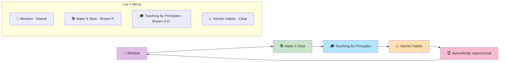

# Masterclass: Los 4 Libros que Transforman tu Aprendizaje 📚🧠📈

> **La premisa central de esta guía** — Cuatro libros, cuatro pilares. *Mindset* te cambia la cabeza, *Make It Stick* te cambia la memoria, *Teaching by Principles* te cambia la forma de aprender y *Atomic Habits* te cambia la rutina. Juntos, forman el sistema de aprendizaje más potente basado en evidencia.

## Antes de empezar: 🎯 ¿qué vas a poder hacer al terminar esta guía?

Al terminar de leer y **aplicar** esta guía vas a poder:

- Entender los conceptos fundamentales de 4 libros científicos sobre aprendizaje.
- Aplicar la mentalidad de crecimiento de Dweck para persistir en dificultades.
- Usar las técnicas de memoria de Brown para retener información por meses.
- Aplicar los principios de enseñanza de H. Douglas Brown para aprender cualquier idioma.
- Construir hábitos inquebrantables con el sistema de James Clear.
- Combinar los 4 pilares en un sistema personal de aprendizaje exponencial.

---

## MAPA DEL WORKFLOW 🔄



---

## PARTE 1 — 🧠 Libro 1: *Mindset* (Carol Dweck)

### Concepto central: Mentalidad de crecimiento vs. mentalidad fija

Carol Dweck, profesora de Stanford, descubrió que las personas se dividen en dos grupos:

| Mentalidad fija | Mentalidad de crecimiento |
|-----------------|---------------------------|
| "Soy malo para los idiomas" | "Todavía no soy bueno para los idiomas" |
| "Si me equivoco, soy un fracaso" | "Si me equivoco, aprendo" |
| "El talento es innato" | "El talento se construye con esfuerzo" |
| Evito los desafíos | Busco los desafíos |
| Me rindo rápido | Persisto ante la dificultad |

### Los 3 principios fundamentales

#### 1.1 La creencia lo es todo

> *"La forma en que pensamos sobre nuestras habilidades determina si las desarrollamos o las abandonamos."*

**Aplicación al aprendizaje de inglés:**
- ❌ "No tengo talento para los idiomas" → abandonás después de 2 semanas.
- ✅ "Puedo aprender inglés si practico todos los días" → persistís hasta lograrlo.

#### 1.2 El error es información, no un juicio

> *"Los errores no dicen nada sobre tu inteligencia; dicen algo sobre lo que estás practicando."*

**Aplicación al aprendizaje de inglés:**
- Si te equivocás en una frase, no significa que "seas malo".
- Significa que necesitás practicar esa estructura específica.

#### 1.3 El elogio del proceso, no del resultado

> *"Elogiá el esfuerzo y la estrategia, no la inteligencia o el resultado."*

**Aplicación al aprendizaje de inglés:**
- ❌ "Sos inteligente porque hablás inglés fluido."
- ✅ "Hablas inglés fluido porque practicaste todos los días durante 6 meses."

### Ejercicio práctico de Mindset

1. **Identificá 3 frases de mentalidad fija que usás:**
   - "Soy malo para..."
   - "No puedo..."
   - "Esto es muy difícil para mí..."
2. **Transformalas en mentalidad de crecimiento:**
   - "Todavía no soy bueno para..."
   - "Todavía no puedo..."
   - "Esto es un desafío que puedo superar..."
3. **Escribí 1 aprendizaje reciente de un error:**
   - "La semana pasada me equivoqué en X. Aprendí que Y. Ahora puedo hacer Z mejor."

---

## PARTE 2 — 📚 Libro 2: *Make It Stick* (Peter Brown)

### Concepto central: La ciencia de la memoria aplicada al aprendizaje

Peter Brown resume décadas de investigación cognitiva sobre cómo funciona la memoria y cómo aprender de forma efectiva. Los principios clave:

### 2.1 La curva del olvido (Ebbinghaus)

```
Día 0: aprendés 100% → retención 100%
Día 1: sin repasar → retención 58%
Día 7: sin repasar → retención 23%
Día 30: sin repasar → retención 5%
```

**La solución:** spaced repetition (repaso en intervalos crecientes).

### 2.2 Retrieval Practice (práctica de recuperación)

> *"Intentar recordar información sin ayuda es más efectivo que volver a leer."*

**Ejemplo:**
- ❌ Volver a leer el vocabulario en la app.
- ✅ Cerrar la app e intentar escribir las palabras de memoria.

### 2.3 El efecto de espaciado

> *"Practicar en múltiples sesiones cortas es más efectivo que una sesión larga."*

**Ejemplo:**
- ❌ Estudiar 4 horas un domingo.
- ✅ Estudiar 20 minutos todos los días.

### 2.4 El efecto de intercalación

> *"Intercalar temas diferentes en una misma sesión mejora la retención."*

**Ejemplo:**
- ❌ Practicar solo listening durante una semana.
- ✅ Practicar listening + speaking + reading en la misma semana.

### 2.5 El aprendizaje deseable (desirable difficulties)

> *"Las dificultades que generan esfuerzo son buenas para el aprendizaje."*

**Ejemplo:**
- ❌ Usar subtítulos en español (fácil, pero no aprendés).
- ✅ Usar subtítulos en inglés o ninguna (difícil, pero aprendés más).

### Los 5 pilares de *Make It Stick*

| Pilar | Qué es | Cómo aplicarlo |
|-------|--------|----------------|
| **Retrieval practice** | Intentar recordar sin ayuda | Cerrá el libro e intentá escribir lo que aprendiste. |
| **Spaced repetition** | Repasar en intervalos crecientes | Repasá al día 1, 3, 7, 14, 30. |
| **Interleaving** | Intercalar temas | No practiques solo una habilidad por semana. |
| **Desirable difficulties** | Esfuerzo que genera aprendizaje | Usá contenido que te desafíe, no que te sea fácil. |
| **Feedback** | Corrección inmediata | Hablá con IA o un compañero que te corrija. |

### Ejercicio práctico de *Make It Stick*

1. **Elegí 10 palabras nuevas esta semana.**
2. **Día 1:** aprendelas con contexto.
3. **Día 3:** cerrá el listado e intentá escribirlas de memoria (retrieval).
4. **Día 7:** volvé a escribirlas de memoria (spaced repetition).
5. **Día 14:** volvé a escribirlas de memoria.
6. **Día 30:** volvé a escribirlas de memoria.

---

## PARTE 3 — 🎓 Libro 3: *Teaching by Principles* (H. Douglas Brown)

### Concepto central: Los fundamentos científicos de la enseñanza de idiomas

H. Douglas Brown sintetiza décadas de investigación en adquisición de segundas lenguas (SLA) y propone principios pedagógicos que cualquier aprendiz puede aplicar.

### 3.1 Los principios clave para aprender idiomas

#### Principio 1: Comprehensible Input (Krashen)

> *"Aprendés cuando el input está un poquito por encima de tu nivel (i+1)."*

**Aplicación:**
- Si estás en A1, escuchá podcasts A1-A2 (no B2).
- Si estás en A2, leé graded readers A2 (no novelas nativas).

#### Principio 2: Input + Interaction = Adquisición

> *"No basta con escuchar: necesitás interactuar con el lenguaje."*

**Aplicación:**
- Escuchá un podcast (input).
- Después, hablá con un tutor de IA sobre el tema (interacción).

#### Principio 3: La producción es necesaria pero no suficiente

> *"Hablar y escribir son necesarios, pero solo después de haber recibido suficiente input."*

**Aplicación:**
- No empieces a hablar desde el día 1 sin base.
- Primero escuchá y leés (input), después hablá (output).

#### Principio 4: La motivación es el motor del aprendizaje

> *"Sin motivación, no hay aprendizaje sostenible."*

**Aplicación:**
- Aprendé inglés con temas que te gusten (tu hobby, tu trabajo).
- Si te gusta el fútbol, aprendé inglés con contenido de fútbol.

#### Principio 5: El error es parte del proceso

> *"Los errores no son fracasos; son evidencia de que estás intentando."*

**Aplicación:**
- No tengas miedo de equivocarte.
- Cada error te dice qué ajustar.

#### Principio 6: La transferencia positiva y negativa

> *"Tu lengua materna puede ayudar (transferencia positiva) o interferir (transferencia negativa) en el aprendizaje."*

**Aplicación:**
- Español → inglés: cognados (similar words) ayudan (transferencia positiva).
- Español → inglés: artículos, género, orden de palabras pueden interferir (transferencia negativa).

#### Principio 7: La edad y el contexto importan

> *"Los adultos aprenden diferente a los niños. El contexto de aprendizaje cambia la efectividad."*

**Aplicación:**
- Los adultos aprenden mejor con reglas explícitas y práctica deliberada.
- Los niños aprenden mejor con inmersión y juego.

### Los 6 estadios del aprendizaje de idiomas (según Brown)

| Estadio | Característica | Ejemplo |
|---------|----------------|---------|
| **1. Preproducción** | Entiendo, pero no hablo | Reconozco palabras, pero no las uso. |
| **2. Producción temprana** | Palabras y frases cortas | "My name is..." "I like..." |
| **3. Habla emergente** | Frases completas cortas | "I went to the park yesterday." |
| **4. Fluidez intermedia** | Párrafos y conversaciones | Narro experiencias, hago predicciones. |
| **5. Fluidez avanzada** | Conversaciones complejas | Discuto temas abstractos, debato. |
| **6. Maestría** | Uso natural y nativo | Uso modismos, matices, registros. |

### Ejercicio práctico de *Teaching by Principles*

1. **Diagnosticá tu estadio actual:**
   - ¿Podés entender pero no hablar? → estadio 1.
   - ¿Podés decir frases cortas? → estadio 2.
   - ¿Podés narrar experiencias? → estadio 3.
   - ¿Podés mantener conversaciones? → estadio 4.
   - ¿Podés discutir temas complejos? → estadio 5.
2. **Elegí el estadio siguiente y diseñá actividades para llegar ahí:**
   - Si estás en estadio 1: empezá con output guiado (frases memorizadas).
   - Si estás en estadio 2: sumá producción de frases completas.
   - Si estás en estadio 3: sumá narración de experiencias.
3. **Aplicá los principios de Brown:**
   - Input comprensible (i+1).
   - Interacción (hablá con IA o compañeros).
   - Producción gradual (no te saltes estadios).
   - Motivación (temas que te gusten).
   - Aceptación del error.

---

## PARTE 4 — 📈 Libro 4: *Atomic Habits* (James Clear)

### Concepto central: Los pequeños hábitos generan resultados exponenciales

James Clear propone que el éxito no viene de grandes cambios, sino de pequeños hábitos acumulados. Un 1% mejor cada día = 37x mejor en un año.

### 4.1 La fórmula del cambio

```
Resultado = (Hábitos + Sistema) x Tiempo
```

**No te enfoques en el resultado. Enfocate en el sistema.**

### 4.2 Los 4 pilares de Atomic Habits

#### Pilar 1: Hacerlo obvio (Cue)

> *"El ambiente es el motor del hábito."*

**Aplicación al aprendizaje de inglés:**
- Poné stickers en inglés en tu casa.
- Cambiá el idioma de tu celular a inglés.
- Dejá el libro de inglés en tu mesa de luz.

#### Pilar 2: Hacerlo atractivo (Craving)

> *"Asociá el hábito con algo que te guste."*

**Aplicación al aprendizaje de inglés:**
- Si te gusta el fútbol, aprendé inglés con contenido de fútbol.
- Si te gusta la cocina, aprendé inglés con recetas en inglés.

#### Pilar 3: Hacerlo fácil (Response)

> *"Reducí la fricción. Si el hábito es fácil, lo vas a hacer."*

**Aplicación al aprendizaje de inglés:**
- Dejá la app de inglés en la pantalla principal de tu celular.
- Tené flashcards a mano en todo momento.
- Practicá mientras cocinás o te bañás (self-narration).

#### Pilar 4: Hacerlo satisfactorio (Reward)

> *"El refuerzo inmediato genera adherencia."*

**Aplicación al aprendizaje de inglés:**
- Marcá en un calendario los días que cumpliste.
- Después de cada sesión, date una recompensa pequeña (un café, un postre).
- Medí tu progreso semanalmente y celebrá los avances.

### 4.3 El sistema de los 2 minutos

> *"El hábito más efectivo es el que podés hacer incluso en tus peores días."*

**Aplicación:**
- Compromiso mínimo: 2 minutos de inglés por día.
- Incluso en días malos, podés hacer 2 minutos.
- El hábito se mantiene, y la mayoría de las veces harás más.

### 4.4 La regla de no romper la cadena

> *"No rompas la cadena de hábitos. Después de 7 días, no querrás romper la racha."*

**Aplicación:**
- Usá un tracker (calendario, app, hoja).
- Marcá cada día que cumpliste.
- Después de 7 días, la presión de no romper la cadena te motiva a seguir.

### Ejercicio práctico de *Atomic Habits*

1. **Diseñá tu ambiente:**
   - ¿Dónde estudiás inglés? → Tu escritorio, tu cama, el colectivo.
   - ¿Qué necesitás ahí? → Libro, app, auriculares.
   - ¿Cómo podés hacer que el inglés sea visible? → Stickers, notas, recordatorios.
2. **Asociá el hábito con algo que te guste:**
   - ¿Qué te gusta hacer mientras aprendés inglés? → Escuchar música, comer, tomar café.
   - ¿Cómo podés combinar ambos? → Escuchá podcasts en inglés mientras cocinás.
3. **Reducí la fricción:**
   - ¿Qué te impide estudiar inglés? → "No tengo tiempo", "no sé por dónde empezar".
   - ¿Cómo podés resolverlo? → 2 minutos por día, app en la pantalla principal, rutina fija.
4. **Hacelo satisfactorio:**
   - ¿Cómo podés medir tu progreso? → Tracker, test semanal, grabaciones.
   - ¿Cómo podés celebrar? → Recompensa pequeña, descanso, algo que te guste.

---

## PARTE 5 — 🔗 Los 4 libros en un sistema integrado

### Cómo combinar los 4 pilares en una rutina diaria

```
Rutina diaria de 20 minutos:
├── 🧠 Mindset (2 min): recordá tu por qué, celebrá un error reciente como aprendizaje
├── 📚 Make It Stick (5 min): retrieval practice de vocabulario (recordar sin ayuda)
├── 🎓 Teaching by Principles (5 min): input comprensible (escuchar/leer i+1)
├── 📈 Atomic Habits (5 min): output deliberado (hablar/escribir)
├── 🤖 Feedback (3 min): corregí errores con IA o autograbación
└── 🏆 Revisión (2 min): marcá tu tracker, celebrá el hábito completado
```

### Cómo medir el progreso exponencial

| Métrica | Cómo medirla | Frecuencia | Herramienta |
|---------|--------------|------------|-------------|
| **Vocabulario activo** | Escribí 50 palabras en 2 minutos | Semanal | Anki, Quizlet |
| **Listening** | Escuchá un audio A2 y contá ideas | Semanal | Podcast, BBC Learning English |
| **Speaking** | Grabate hablando 1 minuto | Semanal | Celular, Speechling |
| **Hábitos** | Marcá los días que cumpliste | Diaria | Calendario, app de hábitos |
| **Mentalidad** | Anotá 1 error y 1 aprendizaje | Diaria | Cuaderno, journal |

---

## PARTE 6 — 🚨 Los errores fatales que evitan estos 4 libros

| Error | Qué libro lo soluciona | Cómo solucionarlo |
|-------|------------------------|-------------------|
| ❌ "No tengo talento" | *Mindset* | Cambiá la frase: "todavía no soy bueno, pero puedo aprender." |
| ❌ "Estudio 4 horas un domingo" | *Make It Stick* | Cambiá a 20 minutos todos los días (spaced repetition). |
| ❌ "Escucho podcasts que no entiendo" | *Teaching by Principles* | Bajá el nivel: input comprensible (i+1). |
| ❌ "No hablo por miedo a equivocarme" | *Mindset* + *Teaching by Principles* | El error es información. Hablá desde el día 1. |
| ❌ "Memorizo listas de palabras" | *Make It Stick* | Usá retrieval practice: cerrá el listado e intentá recordar. |
| ❌ "No tengo tiempo" | *Atomic Habits* | 2 minutos por día. El hábito se mantiene. |
| ❌ "Abandono después de 2 semanas" | *Mindset* + *Atomic Habits* | El progreso es invisible al principio. Medí mensualmente. |

---

## PARTE 7 — 🛠️ El sistema completo: 4 libros, 4 pilares, 1 sistema

### El flujo de aprendizaje exponencial

```
Mindset → Te prepara mentalmente para el esfuerzo
    ↓
Make It Stick → Te da las técnicas de memoria para retener información
    ↓
Teaching by Principles → Te da el método pedagógico para aprender eficientemente
    ↓
Atomic Habits → Te da el sistema de hábitos para mantener el aprendizaje a largo plazo
    ↓
Resultado: Aprendizaje exponencial
```

### Cómo implementar el sistema en tu vida

1. **Semana 1:** Leé los 4 libros (o sus resúmenes) y tomá notas de los conceptos que más resuenan.
2. **Semana 2:** Diseñá tu sistema de aprendizaje basado en los 4 pilares.
3. **Semana 3-12:** Implementá el sistema y medí tu progreso semanalmente.
4. **Mes 3+:** Ajustá el sistema según tu progreso y agregá nuevas técnicas.

---

## PARTE 8 — 📚 Glosario de conceptos clave

### De *Mindset* (Dweck)
- 🧠 **Mentalidad de crecimiento:** creencia de que la habilidad se desarrolla con esfuerzo.
- 🧠 **Mentalidad fija:** creencia de que la habilidad es innata y no cambia.
- 🎯 **Elogio del proceso:** reconocer el esfuerzo y la estrategia, no el resultado.
- 📈 **Aprendizaje como proceso:** el progreso no es lineal; los altibajos son normales.

### De *Make It Stick* (Brown)
- 📅 **Spaced repetition:** repasar en intervalos crecientes para maximizar la retención.
- 🔍 **Retrieval practice:** intentar recordar sin ayuda; más efectivo que volver a leer.
- 🔗 **Interleaving:** intercalar temas diferentes en una misma sesión.
- 🎯 **Desirable difficulties:** dificultades que generan esfuerzo y mejoran el aprendizaje.
- 📊 **Curva del olvido:** gráfico que muestra cómo olvidamos información sin repaso.

### De *Teaching by Principles* (Brown)
- 📥 **Comprehensible Input:** input que entendés entre el 70-90% (i+1).
- 🤝 **Interacción:** aprender mediante intercambio con otros, no solo consumo.
- 🎯 **Output deliberado:** producir lenguaje con un objetivo específico.
- 🚀 **Motivación intrínseca:** aprender por interés propio, no por obligación.
- 📊 **Transferencia:** influencia de la lengua materna en el aprendizaje (positiva o negativa).

### De *Atomic Habits* (Clear)
- 📈 **Hábitos atómicos:** pequeños hábitos que generan resultados exponenciales.
- 🎯 **Sistema > Resultado:** enfócate en el proceso, no en el resultado final.
- ⚡ **Hacerlo obvio/atractivo/fácil/satisfactorio:** los 4 pilares del cambio de hábitos.
- 🧱 **Regla de los 2 minutos:** el hábito más efectivo es el que podés hacer en 2 minutos.
- 🔥 **No romper la cadena:** la presión de mantener la racha genera adherencia.

---

## PARTE 9 — 🧠 Resumen mental (para fijar el conocimiento)

Si tuvieras que recordar solo 3 ideas de esta masterclass:

1. 🧠 **Tu mentalidad determina tu resultado.** Si creés que podés aprender, persistirás. Si creés que no, abandonarás. *Mindset* es el cimiento de todo.
2. 📚 **La memoria se entrena, no se fuerza.** Usá retrieval practice y spaced repetition para retener información por meses. *Make It Stick* es tu manual de memoria.
3. 📈 **Los hábitos pequeños generan resultados exponenciales.** 2 minutos por día, todos los días, cambian tu vida. *Atomic Habits* es tu sistema de adherencia.

---

## PARTE 10 — 🌐 Recursos para profundizar

### Libros originales
- 📖 *"Mindset: The New Psychology of Success"* — Carol Dweck
- 📖 *"Make It Stick: The Science of Successful Learning"* — Peter Brown
- 📖 *"Teaching by Principles: An Interactive Approach to Language Pedagogy"* — H. Douglas Brown
- 📖 *"Atomic Habits: An Easy & Proven Way to Build Good Habits & Break Bad Ones"* — James Clear

### Guías complementarias
- 📚 **`cimientos-ingles-exponencial-masterclass.md`** — aplicación de estos 4 libros al aprendizaje de inglés.
- 📚 **`ingles-a1-cientifico-masterclass.md`** — sistema práctico de A1 con métodos científicos.
- 📚 **`ingles-a2-cientifico-masterclass.md`** — sistema práctico de A2 con métodos científicos.
- 📚 **`listening-a1-a2-cientifico-masterclass.md`** — listening con métodos científicos.
- 📚 **`speaking-a1-a2-cientifico-masterclass.md`** — speaking con métodos científicos.
- 📚 **`vocabulario-a1-a2-cientifico-masterclass.md`** — vocabulario con SRS y retrieval practice.

### Herramientas recomendadas
- 📱 **Anki** o **Quizlet** — spaced repetition para vocabulario.
- 🤖 **ChatGPT / Claude** — tutor conversacional para speaking y writing.
- 🌐 **Reverso Context** — collocations en contexto real.
- 📊 **Habit tracker** (app o calendario) — para medir tu consistencia.

---

*Guía elaborada como síntesis de 4 libros científicos sobre aprendizaje: Mindset (Dweck), Make It Stick (Brown), Teaching by Principles (Brown) y Atomic Habits (Clear). Aplicados al inglés y a cualquier habilidad.*
