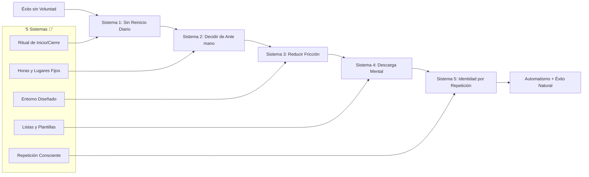
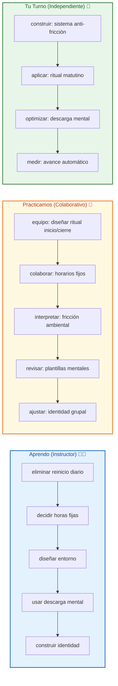

# 🎯 MASTERCLASS: 5 Sistemas para el Éxito sin Fuerza de Voluntad — Diseñando el Entorno Ganador 🔥

## 🎯 INTRODUCCIÓN: POR QUÉ ESTE MASTERCLASS ES DIFERENTE 💡

La motivación es volátil. La fuerza de voluntad se agota. Pero los **sistemas bien diseñados** operan sin depender de cómo te sientas hoy. Jaime Higuera propone una revolución: dejar de depender de la disciplina y empezar a diseñar entornos donde el éxito fluya naturalmente.

> **🎯 Objetivo de Aprendizaje** — Al final de esta guía, implementarás 5 sistemas para eliminar fricción, diseñarás tu entorno para el éxito automático y tendrás un proceso para convertir cualquier hábito en parte de tu identidad.

> **⚠️ Advertencia estratégica** — Este contenido es formativo. Los sistemas requieren práctica constante. Nunca intentes implementar todos a la vez; elige uno, repite hasta automatizar, luego avanza.

---

## 🗺️ MAPA DE LOS 5 SISTEMAS 🔧✨



| Sistema 🎯 | Pregunta que responde ❓ | Resultado principal 🎯 |
|----------|-----------------------|------------------|
| **Sin Reinicio Diario** 🔄 | ¿Por qué empiezo lento cada día? | Ritual automático |
| **Decidir de Antes** ⏰ | ¿Cómo evito el sesgo del presente? | Compromiso ineludible |
| **Reducir Fricción** 🛤️ | ¿Por qué los buenos hábitos fallan? | Acciones fáciles |
| **Descarga Mental** 🧠 | ¿Por qué mi mente está sobrecargada? | Claridad operativa |
| **Identidad por Repetición** 🆔 | ¿Cómo se vuelve natural el éxito? | Hábito automático |

---



---

## 🔁 PARTE 1: ELIMINAR EL REINICI​O DIARIO (2:43 - 4:00) 🔁✨

### 1.1 🔄 La grande wasted mental energy

Cada mañana, tu cerebro gasta energía decidiendo: ¿qué hago primero? ¿dónde empiezo? ¿qué priorizo? Esta "decision fatigue" consume la misma energía que necesitas para ejecutar.

### 1.2 🎯 El ritual de inicio y cierre

Un ritual elimina la decisión matutina. No depende de motivación, es una **cadena de acciones predecibles**:

```
🌅 Ritual Mañana (5 minutos):
1. Agua + estiramiento (30 seg)
2. Revisar lista priorizada (1 min)
3. Primer bloque de trabajo (3 min)
```

### 1.3 🛠️ Plantilla de ritual

```
🔁 Plantilla de Ritual:
INICIO:
- [ ] Acción 1 (ej: agua + respiración)
- [ ] Acción 2 (ej: revisar prioridades)
- [ ] Acción 3 (ej: primer bloque)

CIERRE:
- [ ] Acción 1 (ej: revisar logros)
- [ ] Acción 2 (ej: planificar mañana)
- [ ] Acción 3 (ej: desconectar consciente)
```

---

## ⏰ PARTE 2: DECIDIR DE ANTESMANO (4:12 - 7:16) ⏰✨

### 2.1 🎯 El sesgo del presente

Cuando estás cansado y tienes hambre, tu cerebro prioriza el placer inmediato. El "sesgo del presente" hace que abandones lo importante por lo urgente.

### 2.2 🛠️ Compromiso previo como salvavidas

Si decides de antemano **horas, lugares y tareas**, no hay espacio para negociar contigo mismo:

| Elemento | Decisión Antes | Anfitrión del Presente |
|----------|----------------|----------------------|
| **Hora** | 8:00 AM fijo | "Estoy cansado, lo hago después" |
| **Lugar** | Escritorio específico | "Prefiero la cama" |
| **Tarea** | Lista priorizada | "Hago lo más fácil" |

### 2.3 📊 Tabla de compromisos efectivos

| Tipo Compromiso | Ejemplo | Fuerza Antisesto |
|-----------------|---------|------------------|
| Horario fijo | "Trabajo 8-10 AM" | El cuerpo se adapta |
| Lugar único | "Solo en escritorio A" | Contexto = enfoque |
| Tarea predefinida | "Primero X, después Y" | Elimina la negociación |

---

## 🛤️ PARTE 3: REDUCIR LA FRICCIÓN AMBIENTAL (7:20 - 13:06) 🛤️✨

### 3.1 🎯 Diseño de entorno como sistema invisible

La fricción es la resistencia entre tú y la acción deseada. Un entorno bien diseñado hace que lo bueno sea **más fácil que lo malo**.

### 3.2 📊 Ejemplos de reducción de fricción

| Buen Hábito | Fricción Original | Fricción Reducida |
|-------------|-------------------|-------------------|
| Ejercicio | Buscar ropa, ir al gimnasio | Ropa preparada, rutina 5 min |
| Lectura | Buscar libro, apagar notificaciones | Libro abierto, modo focus |
| Escritura | Buscar documento, pensar estructura | Plantilla abierta, outline listo |
| Meditación | Recordar postura, encontrar tiempo | Alarma + app + 3 minutos |

### 3.3 🛠️ Check de fricción ambiental

```
🔍 Auditoría de entorno:
[ ] La ropa del gym está lista?
[ ] Tu herramienta principal está abierta?
[ ] Las distracciones están bloqueadas?
[ ] Las referencias están visibles?
[ ] El mobiliario apoya la acción?
```

---

## 🧠 PARTE 4: DESCARGA MENTAL Y CLARIDAD (13:11 - 18:24) 🧠✨

### 4.1 🎯 La sobrecarga mental mata la ejecución

Cuando tu mente está llena de "cosas por hacer", gastas energía recordando en lugar de ejecutando. La descarga mental libera ese espacio.

### 4.2 📋 Herramientas de descarga

| Herramienta | Uso | Beneficio |
|-------------|-----|-----------|
| **Lista externa** | Capturar todo | Mente libre para ejecutar |
| **Plantillas** | Formatos prehechos | Eliminan decisión de estructura |
| **IA asistente** | Organizar tareas | Claridad operativa |
| **Calendario bloqueando** | Hora + tarea unidos | Elimina negociación |

### 4.3 🛠️ Protocolo de descarga

```
🧠 Rutina de descarga nocturna:
1. Capturar todas las ideas (5 min)
2. Categorizar: Hoy / Esta semana / Ideas
3. Seleccionar 3 prioridades para mañana
4. Preparar todo lo necesario
5. Desconectar consciente
```

---

## 🆔 PARTE 5: LA IDENTIDAD A TRAVÉS DE LA REPETICIÓN (18:27 - 26:50) 🆔✨

### 5.1 🎯 El progreso es temporal, la identidad es permanente

"El progreso inicial es difícil y temporal. A medida que repites, el comportamiento deja de ser esfuerzo y pasa a formar parte de tu identidad."

### 5.2 📊 Transformación de comportamiento a identidad

| Etapa | Característica | Señal |
|-------|----------------|--------|
| **Esfuerzo** | Requiere fuerza | "Hoy no tengo ganas" |
| **Hábito** | Automático parcial | "Lo hago sin pensar" |
| **Identidad** | Automático total | "Soy de esas personas" |

### 5.3 🛠️ Estrategia de repetición consciente

```
🆔 Sistema de identidad:
REPETIR:
- Acción ridícula diaria (2-5 min)
- Mismo momento exacto
- Mismo contexto

REFORZAR:
- Pequeña celebración
- Registro de consistencia
- Testimonio externo
```

---

## 🎓 PARTE 6: I DO / WE DO / YOU DO — EJERCICIOS PRÁCTICOS 🎓✨

### 6.1 🏫 I Do — Implementar ritual de inicio/cierre

| Paso 🚶 | Acción ⚡ | Resultado esperado ✅ |
|------|--------|--------------------|
| 1️⃣ 🎯 | Definir ritual mañana (3 acciones) | Lista escrita |
| 2️⃣ ⏰ | Fijar hora exacta de inicio | Calendario bloqueado |
| 3️⃣ 🛠️ | Preparar todo la noche anterior | Entorno listo |
| 4️⃣ 📊 | Ejecutar 5 días seguidos | Consistencia |

### 6.2 👥 We Do — Diseñar sistema grupal

**Tarea colaborativa:**

```
👥 Sistema grupal:
1. ¿Qué ritual compartimos?
2. ¿Qué horas fijamos?
3. ¿Qué fricción eliminamos juntos?
4. ¿Cómo nos descargamos?
5. ¿Cómo medimos identidad?
```

### 6.3 🎯 You Do — Construir sistema personal

**Tarea:** elige UN sistema para implementar esta semana:

| Sistema 🛠️ | Acción ⚡ | Alerta 🔔 |
|------------|---------|----------|
| 🔁 Sin reinicio | Ritual matutino | Sin ritual 3 días |
| ⏰ Decidir antes | Horario fijo | Negociar 2 veces |
| 🛤️ Fricción | Preparar todo | Olvidar 3 veces |
| 🧠 Descarga | Lista nocturna | Mente sobrecargada |
| 🆔 Identidad | Acción ridícula | Sin ejecución 7 días |

---

## ✅ PARTE 7: CHECKLIST FINAL 🏁✨

| Sistema 🛠️ | Check ✅ |
|-----------|-------|
| **Ritual sin reinicio** | 🔁 Rutina automática establecida |
| **Decisión previa** | ⏰ Compromisos no negociables |
| **Fricción reducida** | 🛤️ Buenas acciones fáciles |
| **Descarga mental** | 🧠 Mente libre para ejecutar |
| **Identidad construida** | 🆔 Hábito automático logrado |

---

## 📝 PARTE 8: PREGUNTAS DE VERIFICACIÓN 📝✨

Responde cada pregunta basándote en los conceptos de esta master class.

### Preguntas sobre fricción

1. **🛤️ Aplica**: ¿Qué hábito quieres adoptar? ¿Qué fricción existe ahora? ¿Cómo la reduces?

2. **🔍 Analiza**: ¿Qué mal hábito fluye con facilidad? ¿Qué harías para hacerlo difícil?

### Preguntas sobre identidad

3. **🆔 Diseña**: Toma una acción que quieras convertir en identidad. ¿Qué versión ridícula harías hoy?

4. **✅ Evalúa**: ¿Qué sistema has intentado implementar sin éxito? ¿Aplicaste repetición consciente?

### Preguntas integradoras

5. **🎯 Propón**: ¿Qué sistema escogerías primero? ¿Por qué? ¿Cómo lo automatizarías?

6. **📈 Calcula**: Si haces una micro-acción de 2 minutos 7 días seguidos, ¿qué tan automática será?

---

## 📚 GLOSARIO RÁPIDO 📖✨

| Término 📝 | Definición 📋 |
|---------|------------|
| **Fricción ambiental** 🛤️ | Resistencia entre tú y la acción |
| **Ritual de inicio/cierre** 🔁 | Cadena de acciones predecibles |
| **Sesgo del presente** ⏰ | Priorizar placer inmediato sobre metas |
| **Descarga mental** 🧠 | Liberar mente de recordatorios |
| **Identidad por repetición** 🆔 | Comportamiento automático como parte de ti |
| **Sistema invisible** 🔧 | Entorno que guía sin esfuerzo consciente |
| **Compromiso previo** 🎯 | Decidir antes para eliminar negociación |

---

## 📐 ANEXO: FORMATO IDEAL PARA MASTERCLASS EDUCATIVAS 📐✨

### 📏 Estructura visual recomendada 📏✨

El ancho óptimo 📏 para masterclasses educativas es **60–75 caracteres por línea** 📐.

```css
.article-content {
  font-size: 18px;
  line-height: 1.75;
  max-width: 65ch;
}
```

---

### 🎯 CIERRE PRÁCTICO 🎯✨

| Nivel 📊 | Debes poder hacer ✨ |
|-------|------------------|
| **🏫 I Do** | ✅ Implementar ritual sin reinicio |
| **👥 We Do** | 🤝 Diseñar sistema grupal |
| **🎯 You Do** | 🚀 Construir identidad por repetición |

---

## 🎁 RECURSOS ADICIONALES 🎁✨

- 📖 [📚 Jaime Higuera - Productividad](https://www.jaimehiguera.com)
- 🎥 [🎬 Video original: "El Éxito sin Fuerza de Voluntad"]
- 💻 [💻 Herramientas: Notion, Todoist, Freedom]
- 🛠️ [🛠️ Libros: "Atomic Habits", "The Power of Habit"]

---

**🎉 Felicitaciones! Has completado la masterclass de los 5 sistemas para el éxito sin fuerza de voluntad. 🚀 Ahora tienes el marco para diseñar entornos que hagan el éxito natural a través de rituales, compromisos previos, reducción de fricción, descarga mental e identidad por repetición.**