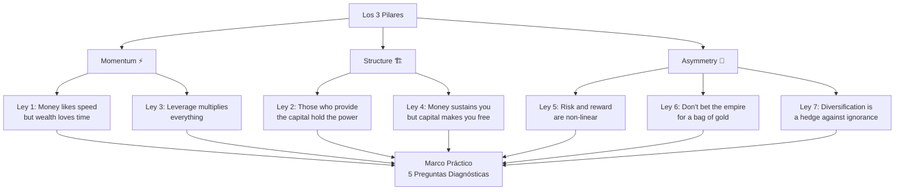
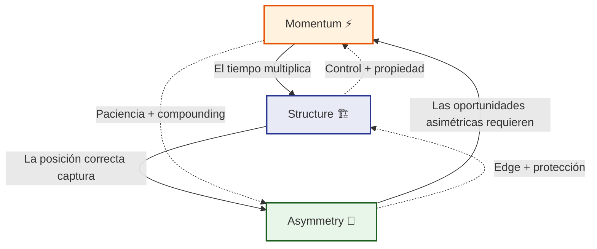

# 🏛️ MASTERCLASS: The 7 Laws of Money — El Sistema Para Construir Riqueza

## 🔑 INTRODUCCIÓN: POR QUÉ ESTE MASTERCLASS EXISTE

El dinero no es un accidente. Es un sistema con reglas predecibles, y la mayoría de las personas nunca las aprende. Se nos enseña a trabajar duro, ahorrar lo que queda y esperar que el tiempo nos premie. Pero ese no es el sistema real.

Este masterclass desvela las **siete leyes fundamentales del dinero** basadas en el trabajo de Jaime Higuera, organizadas bajo tres pilares estructurales:

| Pilar | Símbolo | Idea Central |
|-------|---------|--------------|
| 🚀 **Momentum** | ⚡ | El dinero se acelera con el tiempo y la paciencia |
| 🏗️ **Structure** | 🏛️ | La posición que ocupas en el sistema determina cuánto capturas |
| 🎯 **Asymmetry** | ⚖️ | Las mejores oportunidades tienen un riesgo limitado y un upside ilimitado |

> **Objetivo de Aprendizaje** — Al final de esta guía, podrás identificar las leyes que gobiernan cualquier decisión financiera, diagnosticar si una oportunidad respeta el sistema, y tomar decisiones que construyan riqueza real en lugar de solo ingresos.

> **Advertencia educativa** — Este contenido es formativo. Ninguna ley, principio o estrategia debe interpretarse como asesoramiento financiero. La educación financiera requiere disciplina, contexto personal y, cuando sea necesario, la guía de un profesional certificado.

---

## 🗺️ MAPA DEL SISTEMA: LAS 7 LEYES



---

## ⚡ PILAR 1: MOMENTUM — La Fuerza del Tiempo

El momentum es la idea de que las acciones pequeñas y consistentes, sostenidas en el tiempo, generan resultados desproporcionadamente grandes. Es la física del dinero: un pequeño empujón sostenido produce velocidad creciente.

---

### 📜 Ley 1: "Money likes speed, but wealth loves time"
> *El dinero aprecia la velocidad, pero la riqueza ama el tiempo*

| Concepto | Explicación |
|----------|-------------|
| ⏱️ **Velocidad temprana** | Las acciones rápidas ayudan en las primeras etapas: generar ingresos, pagar deudas, construir un colchón |
| 🐢 **Paciencia a largo plazo** | La verdadera riqueza se construye con decisiones de compounding sostenidas durante años o décadas |
| 🔄 **Compounding** | Los rendimientos generan rendimientos que generan rendimientos — es la fuerza más poderosa del universo financiero |
| 📈 **La trampa de la velocidad** | Perseguir ganancias rápidas sin estructura suele destruir capital a largo plazo |

#### 💡 Cómo aplicar esta ley

1. **Distingue entre velocidad y paciencia** — La velocidad es para empezar; la paciencia es para llegar lejos
2. **Busca el compounding** — Cualquier decisión que reinvierta rendimientos está trabajando a tu favor
3. **Evita el ruido** — Las oportunidades que prometen resultados instantáneos rara vez son las que construyen riqueza
4. **Piensa en décadas** — El horizonte temporal correcto para la riqueza no es un trimestre, es una vida

```text
Velocidad  ──→  Ingresos iniciales  ──→  Colchón financiero
Paciencia  ──→  Compounding           ──→  Riqueza real
```

---

### 📜 Ley 3: "Leverage multiplies everything"
> *El apalancamiento multiplica todo — tanto ganancias como pérdidas*

| Concepto | Explicación |
|----------|-------------|
| 🔧 **Herramientas de apalancamiento** | Crédito, activos empresariales, tecnología, equipos, IP — cualquier cosa que amplifique tu esfuerzo |
| 📐 **Multiplicación lineal** | Si apuntas bien, el apalancamiento convierte un 10% de esfuerzo en un 100% de resultado |
| ⚠️ **La misma multiplicación aplica para lo negativo** | Un error apalancado se multiplica igual de rápido |
| 📚 **Educación como requisito previo** | Nunca uses apalancamiento sin entender profundamente lo que estás apalancando |

#### 💡 Cómo aplicar esta ley

1. **Empieza con apalancamiento bajo** — Usa herramientas que amplifiquen sin exponerte a la ruina
2. **Educación primero, apalancamiento después** — Nunca apalances lo que no entiendes
3. **Distingue apalancamiento financiero de apalancamiento operativo** — El operativo (sistemas, equipos, procesos) suele ser más seguro y sostenible
4. **Mide el ratio riesgo/rendimiento del apalancamiento** — Si el downside es desproporcionado al upside, no es apalancamiento, es apuesta

---

## 🏗️ PILAR 2: STRUCTURE — La Arquitectura del Poder

Structure se refiere a la posición que ocupas dentro del sistema financiero. Quienes controlan el flujo de capital tienen el poder. Quienes solo intercambian tiempo por dinero están en la posición más débil de la cadena.

---

### 📜 Ley 2: "Those who provide the capital hold the power"
> *Quienes proporcionan el capital tienen el poder*

| Concepto | Explicación |
|----------|-------------|
| 💰 **Capital vs. Trabajo** | El capital trabaja para ti las 24 horas; el trabajo solo funciona mientras estás despierto |
| 🏢 **Propiedad de sistemas** | La verdadera riqueza viene de construir o poseer sistemas que escalan — no de vender tu tiempo |
| 📊 **Growth Partner** | Posicionarte como alguien que aporta capital y crecimiento a un negocio, en lugar de solo ser un empleado |
| 🔑 **Control = Poder** | Quien controla el capital controla las decisiones, los plazos y los términos |

#### 💡 Cómo aplicar esta ley

1. **Mueve tu posición en la cadena** — De intercambiar tiempo por dinero, a poseer activos que generan dinero
2. **Construye o adquiere sistemas** — Un negocio, una cartera de inversiones, propiedad intelectual — cualquier cosa que funcione sin tu presencia diaria
3. **Aprende a hablar el idioma del capital** — Entiende términos como equity, returns, cap tables, valuation
4. **Piensa como inversor, no como consumidor** — Cada gasto es una decisión: ¿esto es consumo o es inversión en mi futuro?

---

### 📜 Ley 4: "Money sustains you, but capital makes you free"
> *El dinero te sostiene, pero el capital te hace libre*

| Concepto | Explicación |
|----------|-------------|
| 💵 **Dinero (Cash)** | Efectivo para gastos diarios: comida, alquiler, servicios, necesidades inmediatas |
| 🏦 **Capital** | Activos que trabajan independientemente: negocios, equity, propiedades, inversiones productivas |
| 🔗 **La trampa del salario** | Confundir ingreso con riqueza es el error más común — un alto salario no es riqueza si todo se gasta |
| 🕊️ **Libertad financiera** | Se alcanza cuando tus activos generan suficiente ingreso pasivo para cubrir tus gastos sin trabajar |

#### 💡 Cómo aplicar esta ley

1. **Audita tu relación con el dinero** — ¿Cuánto de tus ingresos se destina a consumo vs. acumulación de capital?
2. **Convierte dinero en capital** — Cada decisión financiera debe preguntarse: ¿esto me da un activo o me da un gasto?
3. **Construye un colchón de capital** — Antes de buscar rendimientos altos, asegúrate de tener una base estable
4. **Mide tu independencia** — ¿Cuántos meses podrías sobrevivir sin trabajar? Ese es tu verdadero indicador de libertad

```text
Dinero  ──→  Cubre necesidades diarias  ──→  Sobrevivencia
Capital  ──→  Genera ingresos pasivos    ──→  Libertad
```

---

## 🎯 PILAR 3: ASYMMETRY — La Geometría de la Oportunidad

Asymmetry es la ley más poderosa y la más malentendida. Se trata de buscar situaciones donde el upside potencial es enormemente desproporcionado frente al downside limitado. Es la estructura de las mejores oportunidades de la vida.

---

### 📜 Ley 5: "Risk and reward are non-linear"
> *El riesgo y la recompensa no son lineales — busca la asimetría*

| Concepto | Explicación |
|----------|-------------|
| 📈 **Upside asimétrico** | La mejor oportunidad es aquella donde puedes ganar 100x pero solo puedes perder 1x |
| 📉 **Downside definido** | Toda asimetría requiere que sepas exactamente cuál es tu peor escenario antes de entrar |
| ⚖️ **No todo riesgo es asimetría** | Una apuesta donde puedes ganar o perder lo mismo NO es asimetría — es juego puro |
| 🎯 **Edge + Asimetría = Oportunidad** | Necesitas ambas cosas: una ventaja estadística Y una estructura de payoff favorable |

#### 💡 Cómo aplicar esta ley

1. **Siempre pregunta: ¿cuál es mi peor escenario?** — Si no puedes definirlo, no entiendes el riesgo
2. **Busca situaciones donde el downside esté acotado** — Pierdes X, ganas potencialmente 10X o más
3. **Evita la simetría** — No entres en apuestas donde el riesgo y la recompensa son iguales
4. **Acumula asimetrías pequeñas** — No necesitas una sola apuesta enorme; muchas asimetrías pequeñas compuestas crecen enormemente

---

### 📜 Ley 6: "Don't bet the empire for a bag of gold"
> *No apuestes el imperio por un saco de oro*

| Concepto | Explicación |
|----------|-------------|
| 🏰 **El imperio** | Tu motor principal de generación de riqueza: tu negocio, tu fuente de ingresos primaria, tu capital base |
| 🪙 **Un saco de oro** | Una oportunidad puntual, tentadora pero que pone en riesgo tu fuente principal de ingresos |
| 🛡️ **Protege el núcleo** | Nunca arriesgues lo que genera tu riqueza diaria en una apuesta de alto riesgo |
| 🔥 **El fuego que te calienta** | Tu fuente de ingresos principal es el fuego — no lo apagues por una chispa brillante |

#### 💡 Cómo aplicar esta ley

1. **Separa el núcleo de las oportunidades** — Tu ingreso principal y tus activos base son sagrados
2. **Usa capital de riesgo, no capital de supervivencia** — Solo apuesta lo que puedes perder completamente sin afectar tu vida
3. **Escalona tus apuestas** — Empieza pequeño, valida, y luego aumenta la exposición gradualmente
4. **Nunca apuestes más del 5% de tu capital total** en cualquier oportunidad individual de alto riesgo

---

### 📜 Ley 7: "Diversification is a hedge against ignorance"
> *La diversificación es una cobertura contra la ignorancia*

| Concepto | Explicación |
|----------|-------------|
| 🧠 **La diversificación por defecto** | Cuando no sabes lo suficiente sobre algo, diversificar reduce el daño — pero también reduce el potencial |
| 🎯 **La concentración informada** | Si entiendes profundamente un negocio o inversión, concentrar tu capital es más poderoso que diversificar |
| ⚠️ **Diversificación sin conocimiento** | Es una estrategia de debilidad, no de fortaleza — diluye tanto el riesgo como el retorno |
| 📊 **Concentración con control** | Cuando tienes control profundo y entendimiento, la concentración es superior a la diversificación |

#### 💡 Cómo aplicar esta ley

1. **Evalúa tu nivel de conocimiento** — ¿Entiendes realmente esta inversión o la estás diversificando por miedo?
2. **Si entiendes poco, diversifica** — Es la cobertura inteligente contra la ignorancia
3. **Si entiendes mucho, concentra** — Pon tu capital donde tu ventaja es mayor
4. **Re-evalúa constantemente** — Lo que hoy es concentración informada mañana puede ser ignorancia si el contexto cambió

```text
Poco conocimiento  ──→  Diversificar  ──→  Protección contra la ignorancia
Mucho conocimiento  ──→  Concentrar    ──→  Maximización del edge
```

---

## 🧩 LOS 3 PILARES EN CONEXIÓN

Los tres pilares no funcionan aislados. Se retroalimentan entre sí:



| Combinación | Resultado |
|-------------|-----------|
| ⚡ Momentum + 🏗️ Structure | Construyes un sistema que crece en la posición correcta |
| ⚡ Momentum + 🎯 Asymmetry | Aprovechas el tiempo para maximizar oportunidades desproporcionadas |
| 🏗️ Structure + 🎯 Asymmetry | Controlas las condiciones para que las asimetrías trabajen a tu favor |
| ⚡ + 🏗️ + 🎯 | **El sistema completo de construcción de riqueza** |

---

## 🔍 MARCO PRÁCTICO: LAS 5 PREGUNTAS DIAGNÓSTICAS

Antes de cualquier decisión financiera — inversión, negocio, gasto importante, cambio de carrera — aplica estas cinco preguntas:

### 📋 La Checklist de las 5 Preguntas

| # | Pregunta | Icono | Qué evalúa |
|---|----------|-------|------------|
| 1 | **¿Tiene un efecto de compounding?** | 🔄 | Si la decisión genera rendimientos que se reinvierten y crecen exponencialmente |
| 2 | **¿Quién tiene el control?** | 🎮 | Si tú controlas el resultado o dependes de factores externos que no puedes manejar |
| 3 | **¿Cuál es el peor escenario?** | ⚠️ | Si puedes definir con precisión cuál es tu máxima pérdida antes de entrar |
| 4 | **¿El upside es asimétrico?** | ⚖️ | Si el potencial de ganancia es desproporcionadamente mayor que el riesgo |
| 5 | **¿Realmente entiendes los riesgos?** | 📚 | Si conoces profundamente lo que puede salir mal y por qué |

### 🛠️ Cómo usar el marco

```text
Paso 1: Escribe la decisión que estás considerando
Paso 2: Responde cada una de las 5 preguntas con honestidad
Paso 3: Asigna una puntuación del 1 al 5 a cada respuesta
Paso 4: Si 3 o más preguntas obtienen un 1 o 2, reconsidera o descarta
Paso 5: Si todas obtienen 4 o 5, procede con confianza
Paso 6: Si hay dudas, busca más información antes de decidir
```

### 📊 Tabla de decisión rápida

| Puntuación total | Interpretación | Acción |
|------------------|----------------|--------|
| 🟢 **20-25** | Oportunidad sólida con asimetría clara | ✅ Procede con confianza |
| 🟡 **15-19** | Oportunidad razonable con some riesgos | ⚠️ Proceede con precaución, reduce tamaño |
| 🟠 **10-14** | Señales de alerta presentes | 🔍 Investiga más antes de decidir |
| 🔴 **5-9** | Múltiples debilidades estructurales | ❌ Descarta o reformula completamente |

---

## 🎓 EJERCICIOS PRÁCTICOS

### Ejercicio 1: Diagnóstico de tu situación actual 🔍

Responde honestamente:

| Pregunta | Tu respuesta |
|----------|--------------|
| ¿Tienes un flujo de dinero que compone? | ☐ Sí ☐ No |
| ¿Tienes control sobre tus principales fuentes de ingreso? | ☐ Sí ☐ No |
| ¿Conoces tu peor escenario financiero actual? | ☐ Sí ☐ No |
| ¿Tienes al menos una inversión con asimetría favorable? | ☐ Sí ☐ No |
| ¿Entiendes los riesgos de tus decisiones financieras actuales? | ☐ Sí ☐ No |

**Resultado:** Cuenta tus "Sí". Si tienes 4 o más, estás en buena posición. Si tienes 2 o menos, hay áreas fundamentales que necesitas trabajar.

### Ejercicio 2: Clasifica tus decisiones financieras pasadas 📊

Piensa en las últimas 5 decisiones financieras importantes que tomaste y clasifícalas:

| Decisión | ¿Compounding? | ¿Control? | ¿Peor escenario claro? | ¿Asimetría? | ¿Entiendes riesgos? | Veredicto |
|----------|----------------|------------|------------------------|--------------|----------------------|-----------|
| | | | | | | |
| | | | | | | |
| | | | | | | |
| | | | | | | |
| | | | | | | |

### Ejercicio 3: Diseña tu próxima decisión asimétrica ⚖️

Usa el marco de las 5 preguntas para evaluar una oportunidad específica que estés considerando actualmente:

```text
Oportunidad: [describe la decisión]

1. ¿Compounding?    → [Sí/No + explicación]
2. ¿Control?        → [Sí/No + explicación]
3. ¿Peor escenario?  → [describe la pérdida máxima]
4. ¿Asimetría?      → [describe el ratio riesgo/recompensa]
5. ¿Entiendes?      → [Sí/No + nivel de confianza 1-5]

Veredicto final: [✅ Proceder / ⚠️ Precaución / ❌ Descartar]
```

---

## 📚 RESUMEN DE LAS 7 LEYES

| # | Ley | Emoji | Pilar | Idea clave |
|---|-----|-------|-------|------------|
| 1 | Money likes speed, but wealth loves time | ⏱️ | ⚡ Momentum | La paciencia y el compounding construyen riqueza |
| 2 | Those who provide the capital hold the power | 💰 | 🏗️ Structure | Controla el capital, controla el resultado |
| 3 | Leverage multiplies everything | 🔧 | ⚡ Momentum | Amplifica tanto ganancias como pérdidas — úsalo con educación |
| 4 | Money sustains you, but capital makes you free | 🕊️ | 🏗️ Structure | Distingue entre ingreso y riqueza real |
| 5 | Risk and reward are non-linear | ⚖️ | 🎯 Asymmetry | Busca oportunidades donde ganas mucho más de lo que puedes perder |
| 6 | Don't bet the empire for a bag of gold | 🏰 | 🎯 Asymmetry | Protege tu fuente principal de ingresos |
| 7 | Diversification is a hedge against ignorance | 🧠 | 🎯 Asymmetry | Concentra donde entiendes, diversifica donde no |

---

## 🧠 GLOSARIO RÁPIDO

| Término | Definición |
|---------|------------|
| **Compounding** | Proceso donde los rendimientos generan rendimientos adicionales sobre el capital inicial y acumulado |
| **Capital** | Activos que generan ingresos o valor de forma independiente, sin requerir tu trabajo diario |
| **Dinero (Cash)** | Efectivo y equivalentes líquidos usados para gastos cotidianos |
| **Asimetría** | Estructura de payoff donde el upside potencial es desproporcionadamente mayor que el downside |
| **Momentum** | La fuerza de aceleración que el tiempo y la consistencia le dan a las decisiones financieras |
| **Structure** | La posición y el rol que ocupas en el sistema financiero, determinando cuánto capturas |
| **Leverage** | Cualquier herramienta que amplifica tu esfuerzo, desde crédito hasta tecnología |
| **Edge** | Una ventaja estadística o de posición que te da probabilidad favorable en una decisión |
| **Downside** | La pérdida potencial máxima de una decisión |
| **Upside** | La ganancia potencial máxima de una decisión |
| **Growth Partner** | Rol donde aportas capital y capacidad de crecimiento a un negocio o proyecto |
| **Diversification** | Distribución del capital entre múltiples inversiones para reducir riesgo |
| **Concentration** | Concentración del capital en pocas posiciones donde tienes ventaja comprobada |

---

## 📝 Preguntas de Verificación

Responde cada pregunta basándote en los conceptos de este masterclass. Escribe tus respuestas o compártelas para profundizar tu aprendizaje.

### Preguntas sobre Momentum

1. **Aplica**: Si tienes dos opciones de inversión — una que genera un 5% anual compuesto durante 30 años, y otra que genera un 20% anual durante 3 años — ¿cuál produce más riqueza a largo plazo y por qué?

2. **Analiza**: ¿Por qué perseguir "velocidad" en las finanzas personales suele ser contraproducente? ¿En qué momento la velocidad deja de ser útil?

### Preguntas sobre Structure

3. **Diseña**: Si actualmente intercambias tiempo por dinero, ¿qué primer paso podrías dar para moverte hacia una posición de "capital provider"? Describe un plan concreto.

4. **Reflexiona**: ¿Qué significa realmente "tener el control" del capital? ¿Es lo mismo tener dinero que tener control financiero?

### Preguntas sobre Asymmetry

5. **Calcula**: Tienes una oportunidad donde puedes ganar $10,000 con un 30% de probabilidad, o perder $1,000 con un 70% de probabilidad. ¿Es esta una asimetría favorable? Justifica tu respuesta.

6. **Evalúa**: ¿Por qué "no apostar el imperio" es más importante que buscar el máximo retorno? ¿Qué pasa si rompes tu motor principal de ingresos?

### Preguntas Integradoras

7. **Conecta**: ¿Cómo se relacionan los tres pilares entre sí? ¿Puedes tener asimetría sin momentum? ¿Puedes tener estructura sin asimetría?

8. **Propón un sistema**: Diseña un plan financiero personal de 5 años usando las 7 leyes y las 5 preguntas diagnósticas. ¿Qué decisiones tomarías y por qué?

9. **Síntesis**: Toma una decisión financiera importante que hayas tomado en el pasado y aplícale el marco de las 5 preguntas. ¿Habrías tomado la misma decisión con este conocimiento?

10. **Reflexión final**: De las 7 leyes, ¿cuál consideras la más poderosa para construir riqueza a largo plazo? ¿Por qué?

---

## ✅ CHECKLIST FINAL DEL SISTEMA DEL DINERO

| Ley | Check | Pregunta clave |
|-----|-------|----------------|
| ⏱️ Ley 1 | ☐ | ¿Estoy pensando en el largo plazo o en la velocidad rápida? |
| 💰 Ley 2 | ☐ | ¿Estoy en una posición de control o de dependencia? |
| 🔧 Ley 3 | ☐ | ¿Estoy usando apalancamiento con educación o con ignorancia? |
| 🕊️ Ley 4 | ☐ | ¿Estoy confundiendo ingresos con riqueza? |
| ⚖️ Ley 5 | ☐ | ¿Estoy buscando asimetría o simetría en mis decisiones? |
| 🏰 Ley 6 | ☐ | ¿Estoy protegiendo mi fuente principal de ingresos? |
| 🧠 Ley 7 | ☐ | ¿Estoy diversificando por miedo o concentrando por conocimiento? |

---

## 🔗 RECURSOS ADICIONALES

| Recurso | Tipo | Descripción |
|---------|------|-------------|
| 📖 Libro del autor | Referencia | Profundiza en los principios de asimetría y toma de decisiones |
| 🎥 Video original | Video | La fuente original de las 7 leyes de Jaime Higuera |
| 📊 Herramientas de compounding | Calculadora | Simuladores de crecimiento compuesto para validar escenarios |
| 🧠 Journal financiero | Práctica | Registro diario de decisiones financieras y su alineación con las leyes |

---

## 🏁 CIERRE

El dinero no se trata de trabajar más duro. Se trata de trabajar dentro del sistema correcto. Las siete leyes no son consejos motivacionales — son descripciones de cómo funciona el dinero en la realidad. Quien las entiende y las aplica sistemáticamente tiene una ventaja estructural sobre quien las ignora.

> *"La riqueza no se construye con esfuerzo alone. Se construye con la comprensión de las reglas del juego."*

Comienza hoy. Aplica las 5 preguntas diagnósticas a tu próxima decisión financiera. Y recuerda: **el tiempo es tu mayor aliado cuando entiendes el sistema**. 🚀

---