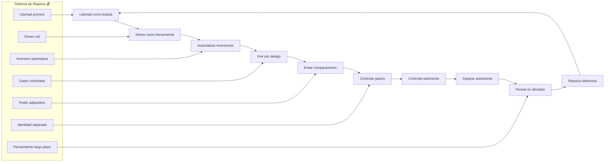
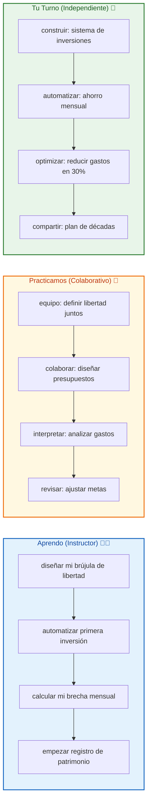

# 🚀 MASTERCLASS: 9 Hábitos para la Riqueza Silenciosa 💰✨

## 🎯 INTRODUCCIÓN: POR QUÉ ESTE MASTERCLASS ES DIFERENTE 💡

La gente típica juega al "gana más, gasta más". 🏦💸 Sube el sueldo y sube las gastas. Compra un nuevo teléfono y busca la app más cara. Piensa que el dinero es para consumir, no para liberar.

Este masterclass propone otro camino: **9 hábitos silenciosos que construyen riqueza mientras duermes**. 🌙💰 No se trata de ganar más. Se trata de alargar la brecha entre lo que entras y lo que sales. De ahí la libertad.

> **🎯 Objetivo de Aprendizaje** — Al final de esta guía, diseñarás un sistema de riqueza silenciosa, automatizarás inversiones, controlarás gastos y patrimonio, evitarás comparaciones tóxicas y construirás un plan de décadas.

> **⚠️ Advertencia** — Este contenido es formativo. La riqueza requiere acción consistente durante años. Ningún hábito sustituye la paciencia y la constancia.

---

## 🗺️ MAPA DEL WORKFLOW DE RIQUEZA SILENCIOSA 🗺️💰



| Fase 🌍 | Pregunta que responde ❓ | Output principal 🎯 |
|--------|-----------------------|------------------|
| **Libertad como brújula** 🕊️ | ¿Qué estilo de vida quiero construir? | Visión de libertad |
| **Dinero como herramienta** 🔧 | ¿Para qué sirve mi dinero? | Autoimagen de riqueza |
| **Automatizar inversiones** 🤖 | ¿Cómo invierto sin fuerza de voluntad? | Sistema automático |
| **Vivir por debajo** 📉 | ¿Qué tan poco gasto con mi sueldo? | Brecha positiva |
| **Evitar comparaciones** 🙅 | ¿Me dejo engañar por redes sociales? | Enfoque interno |
| **Controlar gastos** 📊 | ¿Adónde va cada euro? | Presupuesto real |
| **Controlar patrimonio** 📈 | ¿Qué tengo menos lo que debo? | Neta claro |
| **Separar autoestima** 🧠 | ¿Mi identidad depende del sueldo? | Paz interior |
| **Pensar en décadas** ⏳ | ¿Qué decisión tomo hoy para dentro de 10 años? | Estrategia |
| **Riqueza silenciosa** 🏦 | ¿Estoy construyendo mientras duermo? | Progreso |

---




---

## 🕊️ PARTE 1: CONSTRUYE TU VIDA ALREDEDOR DE LA LIBERTAD 🕊️✨

### 1.1 🕊️ Por qué la libertad es la verdadera meta

El dinero no es para acumular objetos. 🏦 El dinero es para ganar tiempo. ⏳ Cuando ganas libertad, puedes dejar de hacer cosas que no te gustan. Esa es la riqueza real.

**Ejemplos de libertad:**

| Forma de libertad 🎯 | Qué permite ✨ | Presupuesto estimado 💰 |
|---------------------|---------------|------------------------|
| **Libertad de tiempo** ⏰ | Trabajar cuando quieras, no cuando te lo impongan | 50.000€/mes pasivos |
| **Libertad de lugar** 🌍 | Vivir donde quieras, no donde te paguen | 100.000€/año de ingresos |
| **Libertad de decisión** 🤔 | Decir "no" sin miedo económico | 25.000€/mes de margen |
| **Libertad de crecimiento** 📈 | Poder fallar sin pérdida total | 10.000€/mes netos |

### 1.2 💭 Diseña tu brújula de libertad

**Preguntas clave:**

1. ¿Qué harías si no necesitaras responder a un jefe? 🎯
2. ¿Qué lugar del mundo te gustaría visitar sin preguntarte el costo? 🌍
3. ¿Qué actividad te daría satisfacción sin un pago? 💝
4. ¿Qué persona admiras por su estilo de vida, no por su trabajo? 🌟

### 1.3 🛠️ Ejercicio: define tu libertad

```
🕊️ Mi definición de libertad:
- Escribe 3 formas de libertad que más anhelas
- Asigna un costo estimado a cada una
- Suma total: esa es tu meta mínima

📋 Mis primeros pasos:
- Enumera 3 acciones que puedes hacer esta semana
- Asigna presupuesto semanal para libertad
- Bloquea 1 hora para planear la brecha
```

---

## 🔧 PARTE 2: TRATA EL DINERO COMO HERRAMIENTA 🔧✨

### 2.1 🔧 El error de adorar el dinero

Cuando el dinero es tu meta, nunca estás satisfecho. 🎰 El consumo genera vacío. El dinero no compra significado. El dinero compra opciones.

| Dinero como meta 🚫 | Dinero como herramienta ✅ |
|-------------------|---------------------------|
| Compra para felicidad | Compra para libertad |
| Comparación con otros | Comparación contigo mismo |
| Consumo constante | Inversión constante |
| Identidad enlazada | Identidad separada |
| Estrés por ausencia | Paz por margen |

### 2.2 🛠️ Reenmarca tu relación con el dinero

```
🔧 Preguntas para redefinir:
1. Si el dinero fuera un personaje, ¿cómo lo trato?
2. ¿Qué haría si mi suelda se duplicara mañana?
3. ¿Qué gastos puedo eliminar sin perder calidad de vida?
4. ¿Qué activo puedo comprar con 100€ mensuales?
```

### 2.3 📊 Tabla de objetos vs libertad

| Compra tentadora 🛍️ | Alternativa de libertad 💰 |
|---------------------|--------------------------|
| Teléfono nuevo (800€) | 800€ en fondos indexados |
| Viaje lujoso (3000€) | 3000€ en ingresos pasivos |
| Ropa mensual (200€) | 200€ en educación digital |
| Coche nuevo (25000€) | 25000€ en bienes raíces |

---

## 🤖 PARTE 3: AUTOMATIZA TUS INVERSIONES 🤖✨

### 3.1 🤖 Por qué la automatización es revolucionaria

"La fuerza de voluntad es un recurso finito que se agota al final del día. 🧠 La automatización elimina esa dependencia y construye riqueza mientras duermes." — Jaime Higuera

### 3.2 ⚙️ Sistema de automatización paso a paso

| Paso 🚶 | Acción ⚡ | Herramienta 🛠️ |
|------|--------|---------------|
| 1️⃣ | Abrir cuenta de inversión | Indexa, Degiro, Interactive Brokers |
| 2️⃣ | Configurar transferencia automática | 100-500€/mes según posibilidad |
| 3️⃣ | Elegir fondos indexados | S&P 500, MSCI World, Total Stock Market |
| 4️⃣ | Activar reinversión de dividendos | Compound interest activado |
| 5️⃣ | Revisar solo 1 vez al trimestre | No tocar durante 3 meses |

### 3.3 📊 Ejemplo de automatización real

| Mes 📅 | Ahorro automático 💰 | Interés compuesto 📈 | Total acumulado 📊 |
|--------|---------------------|-------------------|-------------------|
| 1 | 200€ | 0€ | 200€ |
| 6 | 1200€ | 12€ | 1212€ |
| 12 | 2400€ | 65€ | 2465€ |
| 24 | 4800€ | 310€ | 5110€ |
| 36 | 7200€ | 780€ | 7980€ |
| 60 | 12000€ | 3200€ | 15200€ |
| 120 | 24000€ | 28000€ | 52000€ |

### 3.4 🛠️ Plantilla de configuración

```yaml
# config-inversion.yaml
nombre: "Mi Riqueza Silenciosa"
monto_mensual: 250
cuenta_origen: "Cuenta corriente"
cuenta_destino: "Broker internacional"
fondos:
  - "VWCE (Mundo)" # 60%
  - "VUSA (S&P 500)" # 30%
  - "VNQI (REITs)" # 10%
fecha_debito: "01 de cada mes"
notificacion: "Solo cuando falla"
reinversion_dividendos: true
```

---

## 📉 PARTE 4: VIVE POR DEBAJO DE TUS POSIBILIDADES 📉✨

### 4.1 📉 La regla del 50% como punto de partida

"Cuando ganas más, no subas tus gastos. Esa es la única diferencia entre acumular y estancarte." — Jaime Higuera

### 4.2 📊 Tabla de reglas de gasto

| Regla 💡 | Aplicación práctica ⚡ | Beneficio 💰 |
|---------|------------------------|-------------|
| **50% regla** | Gasta menos de la mitad de lo que puedes | Brecha constante |
| **Regla del 10%** | Destina siempre 10% a inversión antes que nada | Prioridad clara |
| **Regla del 48h** | Espera 48h antes de compras >100€ | Evita impulsividad |
| **Regla del 100€** | Cada 100€ gastados = 1 hora de trabajo | Conciencia real |

### 4.3 🛠️ Ejercicio: calcula tu verdadero gasto

```
📊 Calculadora de libertad:
1. Ingreso mensual neto: ______€
2. Gasto fijo mensual: ______€
3. Gasto variable mensual: ______€
4. Total gastado: ______€
5. Brecha mensual: ______€
6. Brecha anual: ______€
7. Meta de inversión: ______€
```

### 4.4 ⚠️ Señales de inflación del estilo de vida

| Señal de alerta 🚨 | Acción correctiva ⚡ |
|-------------------|---------------------|
| Subir sueldo = subir gastos | Mantener gastos + aumentar inversión |
| Comparar compras con amigos | Comparar patrimonio neto |
| Comprar para sentirme bien | Comprar para ganar libertad |
| Gastar para impresionar | Invertir para liberar tiempo |

---

## 🙅 PARTE 5: EVITA COMPARARTE CON OTROS 🙅✨

### 5.1 🙅 La trampa de las redes sociales

"En redes sociales la gente muestra sus gastos, no su patrimonio real." — Jaime Higuera

### 5.2 📊 Tabla de lo que muestran vs lo que tienen

| Lo que muestra 👁️ | Lo que probablemente tiene 💔 |
|------------------|----------------------------|
| Viaje lujoso ✈️ | Tarjeta de crédito al límite 💳 |
| Regalo caro 🎁 | Sin margen de emergencia 🚨 |
| Trabajo "genial" 💼 | Sin libertad real ⛓️ |
| Coche nuevo 🚗 | Sin activos productivos ❌ |

### 5.3 🛠️ Técnica de desintoxiación

```
🍃 Desintoxiación social:
1. Bloquear 2 cuentas que generan celos
2. Unfollow compras innecesarias
3. Sigue cuentas de riqueza real (fondos, inversiones)
4. Cronometrar tiempo en redes: máximo 30 min/día
5. Reemplazar scroll con lectura financiera
```

---

## 📊 PARTE 6: CONTROLA TUS GASTOS 📊✨

### 6.1 📊 Por qué conocer cada euro es poder

"Los gastos hormiga parecen pequeños, pero devoran tu futuro ministro a ministro." — Jaime Higuera

### 6.2 🛠️ Método 50/30/20/0

| Categoría 📋 | Porcentaje 📊 | Ejemplo 🎯 |
|-------------|--------------|-----------|
| **Necesidades** | 50% | Vivienda, comida, transporte |
| **Gustos** | 30% | Ocio, restaurantes, viajes |
| **Inversión** | 20% | Fondos, bienes raíces, educación |
| **Exceso cero** | 0% | Deudas, compras innecesarias |

### 6.3 📊 Tabla de gastos hormiga

| Gasto pequeño 🐜 | Costo mensual 💸 | Costo anual 💰 | Alternativa libre 🕊️ |
|------------------|-----------------|---------------|---------------------|
| Café diario (3€) | 90€/mes | 1.080€/año | Café en casa (0.30€) |
| Suscripciones (Varias) | 45€/mes | 540€/año | Auditar y cancelar |
| Delivery semanal (20€) | 80€/mes | 960€/año | Cocinar en lote |
| Compras impulsivas | 150€/mes | 1.800€/año | Lista de necesidades |

### 6.4 🛠️ App recomendada para tracking

```
📱 Mi sistema de tracking:
- App: Wallet, Fintonic o hoja de cálculo
- Registrar cada gasto >5€
- Revisar cada domingo para identificar patrones
- Ajustar la próxima semana según insights
```

---

## 📈 PARTE 7: CONTROLA TU PATRIMONIO NETO 📈✨

### 7.1 📈 Por qué la neta es lo único que importa

"Tus ingresos no definen tu riqueza. Tu patrimonio neto sí." — Jaime Higuera

### 7.2 🛠️ Fórmula de patrimonio neto

```
📊 Patrimonio Neto = Activos - Pasivos
Activos:
- Cuentas e inversión
- Bienes raíces
- Negocio/propiedad intelectual
- Otros activos productivos

Pasivos:
- Préstamos pendientes
- Tarjetas de crédito
- Hipotecas pendientes
```

### 7.3 📊 Tabla de ejemplo

| Año 📅 | Activos 💰 | Pasivos 💸 | Patrimonio Neto 🌟 |
|--------|-----------|-----------|-------------------|
| 2024 | 15.000€ | 8.000€ | 7.000€ |
| 2025 | 25.000€ | 7.500€ | 17.500€ |
| 2026 | 40.000€ | 7.000€ | 33.000€ |
| 2027 | 65.000€ | 6.000€ | 59.000€ |
| 2030 | 120.000€ | 0€ | 120.000€ |

---

## 🧠 PARTE 8: SEPARA TU AUTOESTIMA DEL DINERO 🧠✨

### 8.1 🧠 El error de identificar el valor contigo mismo

"Tu sueldo no define quién eres como persona." — Jaime Higuera

### 8.2 📊 Tabla de identidad separada

| Enmarcado tóxico 🚫 | Enmarcado saludable ✅ |
|---------------------|------------------------|
| "Soy lo que gano" 💼 | "Soy lo que construyo" 🏗️ |
| "Más gasto = más éxito" 🛍️ | "Más libertad = más éxito" 🕊️ |
| "Comparar compras" 👀 | "Comparar crecimiento" 📈 |
| "Dinero = felicidad" 🎰 | "Dinero = opciones" 🔑 |

### 8.3 🛠️ Ejercicio de desvinculación

```
🧠 Reflexión semanal:
1. ¿Qué haría si mi sueldo se redujera a la mitad?
2. ¿Qué actividades me hacen feliz sin dinero?
3. ¿Qué persona admirada no es rica pero inspira?
4. ¿Qué habilidad podría generar valor sin estar vinculada a un salario?
```

---

## ⏳ PARTE 9: PIENSA EN DÉCADAS, NO EN DÍAS ⏳✨

### 9.1 ⏳ Por qué la paciencia genera riqueza real

"La riqueza silenciosa se construye con decisiones pequeñas repetidas durante años." — Jaime Higuera

### 9.2 📊 Tabla de decisión de hoy vs mañana

| Decisión hoy 🎯 | Beneficio hoy 🍫 | Beneficio dentro de 10 años 🏦 |
|----------------|-----------------|------------------------------|
| Invertir 200€ | Sin ese gasto | 5.000€ + intereses |
| Comprar 200€ en ropa | +1 outfit | 0€, sin libertad extra |
| Aprender una habilidad digital | +1 curso | +50.000€ de ingresos |
| Comprar el último teléfono | +1 gadget | 0€, financiamiento |

### 9.3 🛠️ Regla de las décadas

```
⏳ Ejercicio década:
1. Cada decisión: preguntar "¿Qué habrá dentro de 10 años?"
2. Priorizar lo que compuesta en décadas.
3. Eliminar lo que desaparece rápido.
4. Registrar en diario: "Hoy elegí décadas".
```

---

## 🎓 PARTE 10: I DO / WE DO / YOU DO — EJERCICIOS PROGRESIVOS 🎓✨

### 10.1 🏫 I Do — Diseñar tu brújula de libertad

| Paso 🚶 | Acción ⚡ | Resultado esperado ✅ |
|------|--------|--------------------|
| 1️⃣ 📝 | Escribir 3 formas de libertad que anhelas | Vision clara |
| 2️⃣ 💰 | Asignar costo estimado a cada libertad | Meta numerica |
| 3️⃣ 📊 | Calcular tu brecha mensual actual | Punto de partida |
| 4️⃣ 🎯 | Definir primera acción para semana | Calendario bloqueado |

### 10.2 👥 We Do — Automatizar en equipo

| Decision 🎯 | Opcion recomendada ✅ | Justificacion 💡 |
|----------|--------------------|---------------|
| 🤖 Sistema comun | "Automatizamos juntos" | Apoyo mutuo |
| 💰 Monto simbólico | 50€/mes cada uno | Accion inmediata |
| 📅 Fecha inicio | "01 del próximo mes" | Compromiso real |
| 📊 Seguimiento | Grupo mensual | Responsabilidad |

### 10.3 🎯 You Do — Construir tu sistema mayor

| Widget 🧩 | Accion ⚡ | Alerta 🔔 |
|--------|--------|--------|
| 💰 Inversión automática | Configurar transferencia mensual | Sin transferencia en 30 días |
| 📊 Tracking gasto | Registro diario activo | 3 días sin registrar |
| 📈 Patrimonio neto | Cálculo semanal | Sin cálculo en 14 días |
| ⏳ Pensamiento década | Pregunta diaria | 7 días sin reflexionar |

---

## ✅ PARTE 11: CHECKLIST FINAL DE RIQUEZA SILENCIOSA ✅✨

### 11.1 🕊️ Checklist de libertad

| Bloque 🧩 | Check ✅ |
|--------|-------|
| Vision de libertad | Definida con costos |
| Hábitos que la generan | 3 acciones esta semana |
| Margen actual | Calculado y registrado |
| Primera transferencia | Programada |

### 11.2 🔧 Checklist de dinero como herramienta

| Bloque 🧩 | Check ✅ |
|--------|-------|
| Identidad separada | Lenguaje sin "soy lo que gano" |
| Uso funcional | 3 decisiones hoy sin adorar consumo |
| Inversión prioritaria | 20% antes que ocio |
| Enfoque interno | Sin comparar compras |

### 11.3 🤖 Checklist de automatización

| Bloque 🧩 | Check ✅ |
|--------|-------|
| Cuenta abierta | Registro verificado |
| Transferencia programada | Activa este mes |
| Fondos elegidos | Indexados y diversificados |
| Revisión trimestral | Calendario bloqueado |

### 11.4 📉 Checklist de vivir por debajo

| Bloque 🧩 | Check ✅ |
|--------|-------|
| Regla 50% aplicada | Sin gastar más de la mitad |
| Inflación controlada | Sin subir gastos con sueldo |
| Lista de necesidades | Sin compras impulsivas |
| Brecha positiva | Gastos < ingresos |

### 11.5 🙅 Checklist de evitar comparaciones

| Bloque 🧩 | Check ✅ |
|--------|-------|
| Cuentas bloqueadas | Sin scroll tóxico |
| Enfoque interno | Sin celos por redes |
| Métricas reales | Patrimonio vs gastos |
| Mentor real | Alguien con libertad real |

### 11.6 📊 Checklist de control de gastos

| Bloque 🧩 | Check ✅ |
|--------|-------|
| Tracking activo | Más de 3 días seguidos |
| Gastos hormiga eliminados | 3 gastos eliminados |
| Regla 50/30/20/0 | Aplicada esta semana |
| Revisión domingos | Costos identificados |

### 11.7 📈 Checklist de patrimonio neto

| Bloque 🧩 | Check ✅ |
|--------|-------|
| Cálculo semanal | Patrimonio actual |
| Tendencia positiva | Neto creciendo |
| Activos productivos | Al menos 1 activo |
| Deudas reduciendo | Sin nuevas deudas |

### 11.8 🧠 Checklist de autoestima separada

| Bloque 🧩 | Check ✅ |
|--------|-------|
| Identidad sin dinero | "Soy lo que construyo" |
| Actividades sin gasto | 2 actividades este fin de semana |
| Persona admirada | No basada en sueldo |
| Habilidad digital | En construcción |

### 11.9 ⏳ Checklist de pensar en décadas

| Bloque 🧩 | Check ✅ |
|--------|-------|
| Decisión de hoy | "¿Qué habrá dentro de 10 años?" |
| Inversión priorizada | Sin compras innecesarias |
| Habilidad digital | En desarrollo |
| Registro de décadas | Más de 3 entradas |

---

## 📝 PARTE 12: PREGUNTAS DE VERIFICACIÓN 📝✨

Responde cada pregunta basándote en los conceptos de esta master class. Escribe tus respuestas o compártelas para profundizar tu aprendizaje. 📝

### Preguntas sobre Libertad

1. **✏️ Aplica**: ¿Qué 3 formas de libertad quieres? Asigna un costo estimado a cada una. ¿Cuál es tu meta mínima?

2. **🔍 Analiza**: ¿Qué decisión de los últimos 30 días favoreció la inflación del estilo de vida? ¿Cómo lo evitarías?

### Preguntas sobre Automatización

3. **✏️ Diseña**: Configura una transferencia automática de 50€/mes. ¿Qué app usarías y por qué?

4. **✅ Evalúa**: ¿Qué porcentaje de tu sueldo actual destinas a inversión? ¿Cómo lo aumentarías sin subir gastos?

### Preguntas sobre Gastos y Patrimonio

5. **🧠 Reflexiona**: ¿Cuántos gastos hormiga tienes mensuales? Elimina al menos 2 en los próximos 7 días.

6. **📅 Calcula**: ¿Cuál es tu patrimonio neto actual? ¿Qué tendencia tienes (positiva o negativa)?

### Preguntas sobre Identidad

7. **🔗 Conecta**: ¿Cómo te identificas hoy con tu trabajo/ingreso? Reescribe tu identidad sin mencionar dinero.

8. **💡 Propón un sistema**: Diseña una rutina semanal de 15 minutos para revisar patrimonio y gastos.

### Preguntas Integradoras

9. **🧠 Sintetiza**: ¿Por qué la regla de pensar en décadas es más poderosa que buscar atajos?

10. **💭 Reflexión final**: ¿Cuál de los 9 hábitos es más difícil para ti y qué harás esta semana para implementarlo?

---

## 📚 GLOSARIO RÁPIDO 📖✨

| Término 📝 | Definición 📋 |
|---------|------------|
| **Riqueza silenciosa** 🤫 | Crecimiento constante sin ostentación |
| **Libertad financiera** 🕊️ | Opciones reales sin dependencia de un trabajo |
| **Patrimonio neto** 📈 | Activos menos pasivos |
| **Inflación del estilo de vida** 📉 | Aumento de gastos con ingresos |
| **Gasto hormiga** 🐜 | Pequeños gastos que acumulan grandes costos |
| **Interés compuesto** 📊 | "El ochavo de la ricete duerme" |
| **Opciones reales** 🔑 | Capacidad de elegir sin restricciones económicas |
| **Activo productivo** 🏭 | Genera ingresos sin trabajo directo |
| **Fuerza de voluntad limitada** 💪 | Recurso mental que se agota |
| **Automatización** 🤖 | Sistema que actúa sin tu intervención |
| **Enfoque interno** 🎯 | Medición contra ti mismo, no contra otros |
| **Pensamiento de décadas** ⏳ | Decisiones con horizonte de 10+ años |

---

## 📐 ANEXO: FORMATO IDEAL PARA MASTERCLASS EDUCATIVAS 📐✨

### 📏 Estructura visual recomendada 📏✨

El ancho óptimo 📏 para masterclasses educativas es **60–75 caracteres por línea** 📐.

```css
.article-content {
  🎨 font-size: 18px;
  📏 line-height: 1.75;
  📐 max-width: 65ch;
}
```

### 🎯 CIERRE PRACTICO 🎯✨

| Nivel 📊 | Debes poder hacer ✨ |
|-------|------------------|
| **🏫 I Do** | ✅ Definir tu brújula de libertad y calcular patrimonio neto |
| **👥 We Do** | 🤝 Automatizar inversiones en grupo y evitar comparaciones tóxicas |
| **🎯 You Do** | 🚀 Construir tu sistema de riqueza silenciosa con hábitos de décadas |

---

## 🎁 RECURSOS ADICIONALES 🎁✨

- 📖 [📚 Jaime Higuera - Finanzas](https://www.jaimehiguera.com/finanzas)
- 🎥 [🎬 Video original: "9 Hábitos para la Riqueza"]
- 💻 [💻 Calculadoras: FIRECalc, Patrimonio Neto]
- 🛠️ [🛠️ Apps: Indexa, Degiro, Wallet, Notion]

---

**🎉 Felicitaciones! Has completado la masterclass de los 9 hábitos para la riqueza silenciosa. 🏦 Ahora tienes el sistema completo para construir libertad financiera.**

> **💡 Próximo paso:** Abre hoy una cuenta de inversión. Configura 20€ automáticos. Bloquea 3 cuentas que generan celos. Calcula tu patrimonio neto. La riqueza silenciosa empieza con una sola decisión.