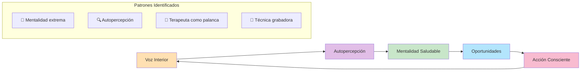
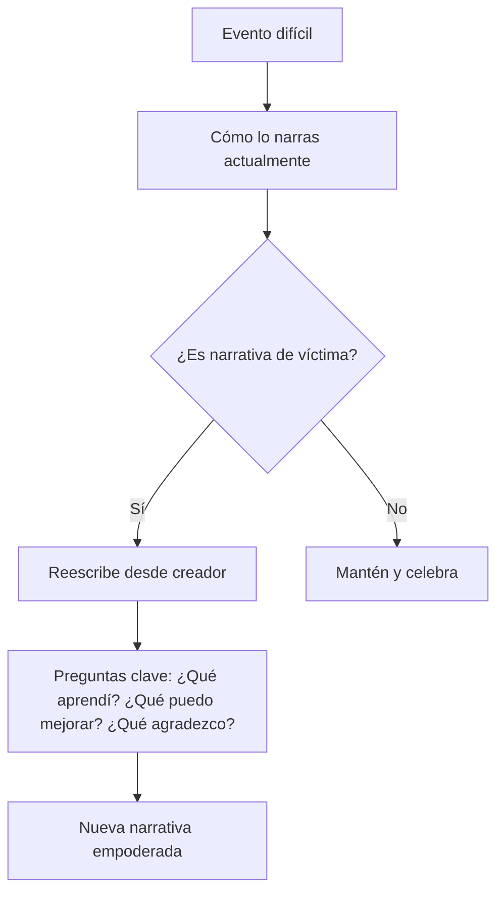
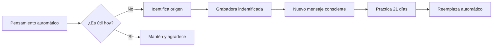
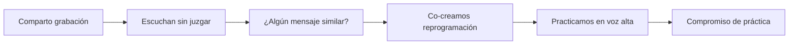
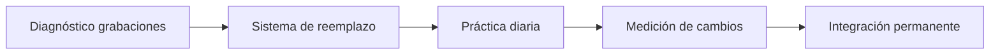

# MASTERCLASS: Actitud y Voz Interior - Reprogramando tu Mente 🧠🎙️

## INTRODUCCIÓN: POR QUÉ ESTA MASTERCLASS ES DIFERENTE 🎯

> **🎯 Objetivo de Aprendizaje** — Al final de esta guía, podrás identificar patrones mentales limitantes, reprogramar tu voz interior, construir una narrativa personal saludable y reconocer cuándo necesitas apoyo profesional.

> **⚠️ Advertencia educativa** — Este contenido es formativo. La salud mental requiere atención profesional en casos complejos. Si tienes bloqueos profundos, busca ayuda especializada.

---

## MAPA DEL WORKFLOW 🔄



---

## PARTE 1: EL PELIGRO DE LA MENTALIDAD EXTREMA - CUANDO "SIEMPRE" MATARÁ 🌪️

### 1.1 Principio Central: La Mentalidad Extrema es una Trampa 🚩

> **⚡ Alerta de Marian Rojas (1:14-2:47)**: Frases como "si quieres, puedes" o "nunca te rindas" pueden generar culpabilidad cuando los objetivos no se alcanzan a pesar del esfuerzo.

### 1.2 Señales de la Mentalidad Tóxica ⚠️

| Señal | Manifestación | Consecuencia |
|-------|---------------|--------------|
| **"Siempre"** | "Siempre positivo, siempre motivado" | Agotamiento emocional |
| **"Nunca"** | "Nunca fracasaré, nunca pararé" | Presión extrema |
| **"Debería"** | "Debería poder con esto" | Culpabilidad por limitaciones |
| **"Perfecto"** | "Todo debe ser perfecto" | Parálisis por perfección |

### 1.3 El Antídoto: Mentalidad Realista 💊

```python
# Protocolo anti-mentalidad extrema
def realistic_mindset(goal, effort, result):
    return {
        'acknowledge': f"He dado lo mejor con {effort}",
        'accept': f"Resultado: {result}. No es fracaso, es información",
        'adjust': "Ajusto estrategia, no autoestima",
        'progress': f"Avance: {calculate_growth(goal, result)}"
    }

def calculate_growth(goal, result):
    if result == "no alcanzado":
        return "aprendí +1 sobre mí"
    return "completé + resiliencia ganada"
```

---

## PARTE 2: AUTOPERCEPCIÓN - LA NARRATIVA QUE TE DEFINE 📖

### 2.1 La Historia que cuentas de ti 🧬

> **🧠 Verdad de Marian (3:02-3:26)**: Cómo te narras tu pasado, presente y futuro impacta directamente tu salud física y psicológica.

### 2.2 Los 3 Tipos de Narrativa 🗣️

| Tipo | Característica | Ejemplo | Impacto |
|------|----------------|---------|---------|
| **Víctima** | "A mí me pasan cosas" | "El jefe siempre me presiona" | Desempoderamiento |
| **Guerrero** | "Lucho contra todo" | "Nunca me rindo, aunque duela" | Agotamiento preventivo |
| **Creador** | "Elijo mi respuesta" | "Tengo herramientas para esto" | Empoderamiento real |

### 2.3 Ejercicio de Reescritura Narrativa ✍️



---

## PARTE 3: EL TERAPEUTA COMO PALANCA - CUANDO NECESITAS UN ESPEJO EXTERNO 🔍

### 3.1 El cerebro "anestesiado" 🧊

> **🤝 Insight de Marian (4:24-5:10)**: En bloqueos profundos, depresión o adicciones, el cerebro agota su capacidad de ver oportunidades. El terapeuta actúa como palanca.

### 3.2 Señales de necesidad profesional 🚑

| Señal | Indicador | Acción |
|-------|-----------|--------|
| **Bloqueo persistente** | Sin avance en 3+ meses | Busca terapeuta |
| **Emociones anuladas** | Nada te mueve | Evaluación necesaria |
| **Conductas repetitivas** | Mismo error eternamente | Intervención externa |
| **Físico colapsado** | Insomnio, dolores crónicos | Apoyo multidisciplinario |

### 3.3 El proceso de la palanca 🛠️

```python
# Protocolo de terapia como palanca
def therapy_leverage(current_state, blind_spots):
    return {
        'blind_spot_identified': [spot for spot in blind_spots if spot not in self_awareness()],
        'new_perspective': "El terapeuta ve lo que tu cerebro no puede",
        'action_plan': f"{len(blinds_spots)} áreas de oportunidad detectadas",
        'integration': "Incorporo aprendizajes sin perder mi esencia"
    }
```

---

## PARTE 4: LA TÉCNICA DE LA GRADADORA - IDENTIFICANDO LA VOZ PROGRAMADA 📼

### 4.1 Origen de los pensamientos automáticos 🎞️

> **📼 Revelación de Marian (7:42-8:31)**: Muchos pensamientos negativos vienen de grabaciones infantiles. Identificar el origen es el primer paso para reprogramar.

### 4.2 Menú de grabaciones comunes 🎧

| Grabadora | Mensaje tóxico | Efecto actual | Reprogramación |
|-----------|----------------|--------------|----------------|
| **Crítica constante** | "Nunca haces nada bien" | Perfeccionismo paralizante | "Estoy aprendiendo, no perfecto" |
| **Comparación social** | "Los demás siempre mejor" | Baja autoestima | "Mi camino es único" |
| **Miedo al error** | "Equivocarte duele" | Evitación de riesgos | "Error = información valiosa" |
| **Control extrema** | "Todo depende de ti" | Agotamiento por sobre-responsabilidad | "Hago mi parte, confío en vivir" |

### 4.3 Protocolo de Reprogramación 🔄



### 4.4 Ejercicio diario de grabación 🗓️

```python
# Diario de grabaciones
def daily_recording_journal():
    return {
        'automatic_thought': "Captura pensamientos sin filtro",
        'trigger': "¿Qué los activó?",
        'origin': "¿Sonido familiar de la infancia?",
        'replacement': "¿Qué mensaje más amoroso?",
        'practice': "Repite nuevo mensaje 10 veces"
    }
```

---

## PARTE 5: CONSTRUYENDO TU ACTITUD CONSCIENTE - EL PUENTE A LAS OPORTUNIDADES 🌉

### 5.1 Actitud = Voz Interior × Entorno 🌱

> **🔑 Conclusión clave**: La actitud no es abstracta. Está ligada a cómo te hablas. Transformar la voz interna revela oportunidades ocultas.

### 5.2 Matriz de Actitud Consciente 🧭

| Estado interno | Estado externo | Actitud saludable | Actitud tóxica |
|----------------|----------------|-------------------|----------------|
| **Calma** | Ambiente caótico | "Observo sin unirme al caos" | "Me estreso por controlarlo todo" |
| **Miedo** | Oportunidad visible | "Con los miedos, puedo avanzar" | "No merezco esta oportunidad" |
| **Cansancio** | Demanda alta | "Hago lo esencial hoy" | "Soy flojo si no doy más" |
| **Alegría** | Momento positivo | "Comparto y disfruto" | "No puedo soportar la euforia" |

### 5.3 Ritual de actitud consciente 🌅

```python
# Protocolo de actitud diaria
def conscious_attitude_morning():
    return {
        'step_1': "¿Qué voz interior quiero practicar hoy?",
        'step_2': "¿Qué entorno apoyo o desafía mi actitud?",
        'step_3': "3 afirmaciones basadas en hechos",
        'step_4': "1 intención concreta (no meta abstracta)",
        'step_5': "¿Cómo agradeceré al final del día?"
    }
```

---

## PARTE 6: I DO / WE DO / YOU DO - EJERCICIOS PROGRESIVOS 🎓

### 6.1 I Do — Identificación guiada de grabaciones 🧭

**Objetivo**: Detectar una voz interior limitante y su origen

| Paso | Acción | Tiempo |
|------|--------|--------|
| 1 | Cierra los ojos y escuchas tu voz interior | 2 min 👂 |
| 2 | Anotas pensamientos automáticos del día | 3 min ✍️ |
| 3 | Identifica el tono (crítico, miedoso, controlador) | 1 min 🔍 |
| 4 | Preguntas: ¿De dónde viene este mensaje? | 2 min 🤔 |
| 5 | Escribe el mensaje más amoroso alternativo | 2 min 💖 |

### 6.2 We Do — Análisis en comunidad 🧑‍🤝‍🧑

**Ejercicio grupal**: Compartan una grabación identificada



### 6.3 You Do — Sistema personal de actitud 🚀

**Tarea**: Diseña tu sistema de actitud consciente



**Checklist de implementación**:

- [ ] Identifica 3 grabaciones dominantes esta semana
- [ ] Escribe mensajes reemplazantes a cada una
- [ ] Practica 5 minutos diarios el nuevo diálogo
- [ ] Evalúa cambios en tu actitud semanalmente
- [ ] Busca apoyo externo si persisten bloqueos

---

## PREGUNTAS DE VERIFICACIÓN 📝

1. **Aplica**: ¿Qué grabación de infancia identificaste esta semana y cómo la transformarías?

2. **Analiza**: ¿Tienes tendencia a la mentalidad extrema? ¿Qué frases te gustaría reemplazar?

3. **Diseña**: Crea un ritual matutino que te conecte con una actitud más compasiva hacia ti.

4. **Reflexiona**: ¿En qué momento necesitarías una "palanca externa" para ver oportunidades?

---

## GLOSARIO RÁPIDO 📚

| Término | Definición | Emoji |
|---------|------------|-------|
| **Voz interior** | Diálogo interno que guía decisiones | 🎙️ |
| **Grabadora** | Mensaje automático de la infancia | 📼 |
| **Mentalidad extrema** | Pensamiento binario todo/nada | 🌪️ |
| **Narrativa** | Historia que te cuentas de ti | 📖 |
| **Palanca** | Apoyo externo para ver a otro lado | 🔧 |
| **Actitud consciente** | Respuesta elegida vs reactiva | 🌉 |

---

## RECURSOS ADICIONALES 📦

### Apps de autoconocimiento 📱
- **Diario**: Day One, Journey, Reflectly
- **Mindfulness**: Headspace, Calm
- **Terapia**: BetterHelp, Psychology Tools

### Libros esenciales 📚
- "Volver a empezar" - Marian Rojas Estapé
- "La psiquiatra de la familia" - Marian Rojas Estapé
- "La mente consciente" - Ellen Langer
- "Poder de los hábitos" - Charles Duhigg

### Podcasts de referencia 🎙️
- "La psiquiatra de la familia" - Podcast de Marian Rojas
- The Tony Robbins Podcast
- The School of Greatness