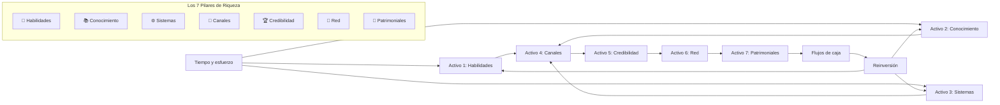
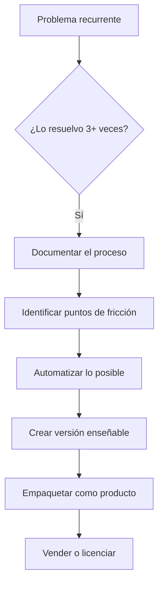
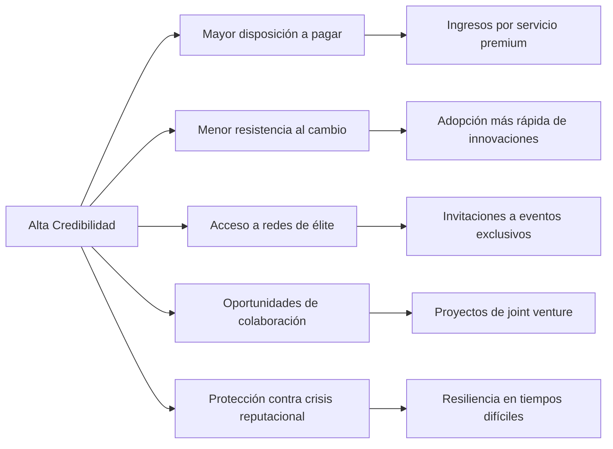
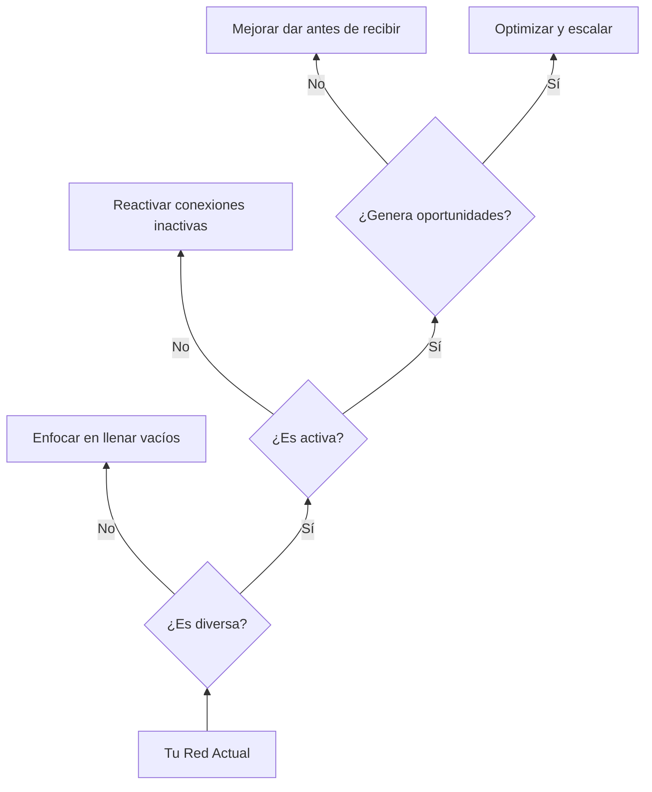
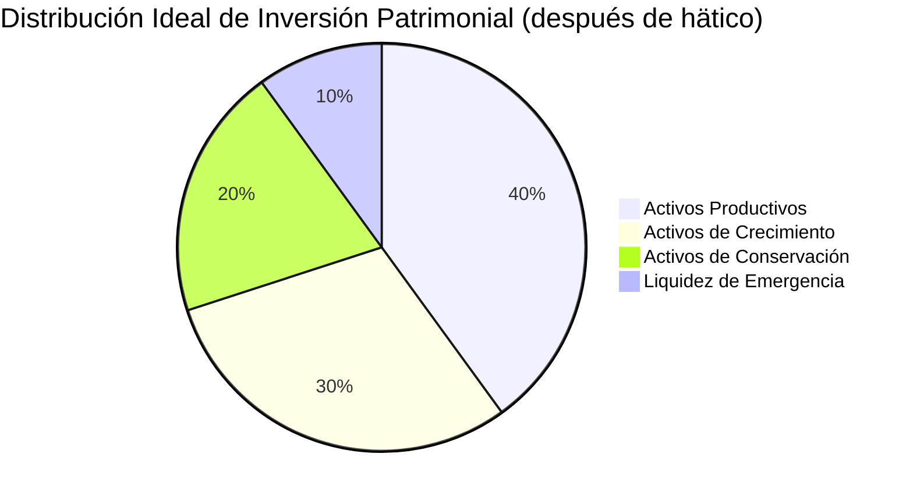
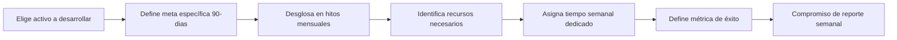
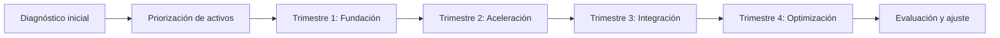

# MASTERCLASS: Los 7 Activos para la Libertad Financiera - Más Alla del Ingreso Pasivo 💰🚀

## INTRODUCCIÓN: POR QUÉ ESTA MASTERCLASS ES DIFERENTE 🎯

> **🎯 Objetivo de Aprendizaje** — Al final de esta guía, podrás identificar y construir los 7 activos estratégicos que generan riqueza real, comprender por qué el "ingreso pasivo" es un mito peligroso y crear tu plan personal de acumulación de activos.

> **⚠️ Advertencia educativa** — Este contenido es formativo. La construcción de patrimonio requiere tiempo, disciplina y educación financiera. No constituye asesoría de inversión personalizada.

---

## MAPA DEL WORKFLA RUTA HACIA LA LIBERTAD FINANCIERA 🔄



---

## PARTE 1: EL MITO DEL INGRESO PASIVO - POR QUÉ FALLA 🚫

### 1.1 La Verdad Incómoda 💥

> **📉 Dato de Dimitri**: El 92% de quienes persiguen "ingresos pasivos" fracasan porque ignoran que **todos los activos requieren mantenimiento activo inicial**.

### 1.2 Mitos vs Realidad ⚖️

| Mito | Realidad | Consecuencia |
|------|----------|--------------|
| "Dinero mientras duermes" | "Capital mientras construyes" | Frustración y abandono |
| "Un activo = ingresos para siempre" | "Todos los activos necesitan upgrades" | Obsolescencia financiera |
| "Enfócate en uno solo" | "Sinergia entre los 7" | Crecimiento limitado |
| "El dinero genera más dinero" | "Tus habilidades generan el dinero inicial" | Esperanza pasiva |

### 1.3 La Ecuación de la Riqueza Real 🧮

```
Riqueza = (Habilidades × Conocimiento) × Sistemas × Canales × Credibilidad × Red × Patrimoniales
```

> **🔑 Clave**: Si cualquiera es cero, el resultado es cero. Todos son multiplicadores, no sumandos.

---

## PARTE 2: ACTIVO 1 - HABILIDADES (SKILLS) - LA FUENTE DE TODO 💪

### 2.1 Por qué es el Primero 🌱

> **💡 Insight (5:33-7:46)**: Tus habilidades determinan tu valor de mercado. Sin ellas, no hay capital inicial para construir otros activos.

### 2.2 Tipos de Habilidades que Generan Valor 📊

| Tipo | Ejemplo | ROI Típico | Tiempo de Desarrollo |
|------|---------|------------|----------------------|
| **Técnicas** | Programación, diseño, análisis | 30-50% incremento salarial | 6-12 meses |
| **Blandas** | Negociación, liderazgo, comunicación | 20-40% más oportunidades | 3-6 meses |
| **Híbridas** | Marketing digital, data analytics | 40-70% más ingresos | 4-8 meses |
| **Especializadas** | Ley médica, impuestos internacionales | 2x-5x tarifa base | 1-2 años |

### 2.3 Tu Sistema de Desarrollo de Habilidades 🛠️

```python
# Plan de desarrollo de habilidades de alto valor
def skill_development_plan(skill_target, horas_semanales):
    return {
        'fase_1': {
            'duracion': '4 semanas',
            'enfoque': 'Fundamentos + práctica guiada',
            'horas': horas_semanales * 0.6,
            'recurso': 'Curso estructurado + mentoría'
        },
        'fase_2': {
            'duracion': '8 semanas',
            'enfoque': 'Proyectos reales + retroalimentación',
            'horas': horas_semanales * 0.8,
            'recurso': 'Freelance parcial + proyectos personales'
        },
        'fase_3': {
            'duracion': 'Ongoing',
            'enfoque': 'Especialización + enseñanza',
            'horas': horas_semanales * 0.4,
            'recurso': 'Crear contenido + consultoría'
        }
    }

# Ejemplo: Desarrollar habilidad en Finanzas Personales
skill_development_plan("Asesoría Financiera", 10)
```

### 2.4 Métricas de Progreso 📈

- **Ingreso por hora**: ¿Cuánto ganas por cada hora de trabajo?
- **Precio de mercado**: ¿Qué cobran otros por tu misma habilidad?
- **Tiempo de entrega**: ¿Cuánto tardas en completar un proyecto estándar?
- **Tasa de retención de clientes**: ¿Qué % vuelve o te refiere?

---

## PARTE 3: ACTIVO 2 - CONOCIMIENTO ESTRUCTURADO - TU METODOLOGÍA ÚNICA 📚

### 3.1 De la Información al Know-How 🔬

> **🔑 Revelación (7:46-12:36)**: El conocimiento común es un commodity. El conocimiento **sistemático, reproducible y enseñable** tiene valor de mercado.

### 3.2 Tipos de Conocimiento Monetizable 🧩

| Tipo | Característica | Ejemplo | Formato de Salida |
|------|----------------|---------|-------------------|
| **Procesos** | Pasos repetibles | Método para cerrar ventas | Checklist + plantilla |
| **Frameworks** | Modelos de decisión | Matriz de priorización de tareas | Visual + guía |
| **Diagnósticos** | Identificación de problemas | Auditoría financiera personal | Informe + acción |
| **Sistemas de Medición** | KPIs personalizados | Dashboard de hábitos | Spreadsheet + alertas |

### 3.3 Creando Tu Propio Sistema 🏭



### 3.4 Plantario de Extracción de Conocimiento 📝

```python
# Sistema para convertir experiencia en conocimiento estructurado
def extract_knowledge(experiencia, frecuencia):
    return {
        'problema_resuelto': f"Describe el problema específico que solucionaste",
        'pasos_seguidos': ["Paso 1: ...", "Paso 2: ...", "Paso 3: ..."],
        'herramientas_usadas': ["Herramienta A", "Herramienta B"],
        'errores_evitados': ["Error común 1", "Error común 2"],
        'resultado_obtenido': "Resultado cuantitativo + cualitativo",
        'plantilla_aplicable': "¿Puede otra persona seguir esto y obtener similares resultados?",
        'valor_mercado': f"Basado en {frecuencia} aplicaciones mensuales"
    }

# Ejemplo: Tu método para ahorrar el 30% de ingresos
extract_knowledge("Método de ahorro automático", 12)
```

### 3.5 Formas de Monetizar tu Conocimiento 💰

- **Digital**: Cursos online, ebooks, plantillas premium
- **Servicios**: Consultoría, auditorías, mentorías
- **Licencias**: Franquiciar tu método a otros profesionales
- **Memberhip**: Comunidad privada con acceso continuo

---

## PARTE 4: ACTIVO 3 - PRODUCTOS Y SISTEMAS - ESCALAR SIN LINEALIDAD ⚙️

### 4.1 La Ley de Escalabilidad 📈

> **⚙️ Principio (12:36-16:29)**: Un producto o sistema bien diseñado genera valor **múltiples veces** con el mismo esfuerzo inicial.

### 4.2 Tipos de Activos Escalables 🏭

| Tipo | Esfuerzo Inicial | Mantenimiento | Ejemplo de Escalabilidad |
|------|------------------|---------------|--------------------------|
| **Digital** | Alto (creación) | Mínimo (actualizaciones) | App, curso, software SaaS |
| **Físico estandarizado** | Medio (prototipo) | Bajo (control calidad) | Producto manufacturado |
| **Sistema de entrega** | Alto (diseño) | Very bajo (proceso) | Franquicia, red de distribución |
| **Contenido evergreen** | Medio (producción) | Cero (alojamiento) | YouTube, blog, podcast |

### 4.3 El Ciclo de Vida del Producto 🔄

```mermaid
flowchart LR
    A[Idea validada] --> B[MVP (Producto Mínimo Viable)]
    B --> C[Primeros 10 usuarios]
    C --> D[Feedback + iteración]
    D --> E[Especialización de nicho]
    E --> F[Automatización de entrega]
    F --> G[Escalado vía canales]
    G --> H[Mantenimiento + mejora continua]
```

### 4.4 Tu Framework de Validación Rápida 🚀

```python
# Método para validar si tu idea merece convertirse en sistema
def validar_producto_idea(problema, solucion, mercado):
    puntuacion = 0
    
    # 1. Dolor real (0-30 puntos)
    if problema_afecta_vida_diaria(problema):
        puntuacion += 30
    elif problema_afecta_trabajo(problema):
        puntuacion += 20
    else:
        puntuacion += 10
    
    # 2. Disponibilidad a pagar (0-25 puntos)
    if hay_testimonios_de_pago(solucion):
        puntuacion += 25
    elif hay_interes_expresado(solucion):
        puntuacion += 15
    else:
        puntuacion += 5
    
    # 3. Escalabilidad inherente (0-20 puntos)
    if es_digital_o_automatizable(solucion):
        puntuacion += 20
    elif requiere_personal_especializado(solucion):
        puntuacion += 10
    else:
        puntuacion += 5
    
    # 4. Barreras de entrada (0-15 puntos)
    if tiene_propiedad_intelectual(solucion):
        puntuacion += 15
    elif es_dificil_de_copiar(solucion):
        puntuacion += 10
    else:
        puntuacion += 5
    
    # 5. Tamaño del mercado (0-10 puntos)
    if mercado > 10000_personas:
        puntuacion += 10
    elif mercado > 1000_personas:
        puntuacion += 5
    else:
        puntuacion += 2
    
    return {
        'puntuacion_total': puntuacion,
        'recomendacion': "Adelante" if puntuacion >= 80 else "Reconsiderar o pivotar" if puntuacion >= 60 else "Descartar"
    }

# Ejemplo: Evaluando un planner financiero personalizado
validar_producto_idea(
    "Personas que no logran ahorrar nonostante ingresos estables",
    "Plantilla de presupuestos con triggers de comportamiento",
    50000  # Mercado estimado en hispanohablantes interesados en finanzas
)
```

### 4.5 Principios de Diseño para Bajo Mantenimiento 🔧

- **Modularidad**: Partes independientes que pueden actualizarse sin afectar el todo
- **Automatización**: Máximo 20% de intervención humana requerida
- **Auto-limpieza**: Sistemas que se corrigen o se actualizan solos
- **Métricas incorporadas**: Datos de uso y rendimiento integrados
- **Feedback cerrado**: Los usuarios mejoran el producto con su uso

---

## PARTE 5: ACTIVO 4 - CANALES DE DISTRIBUCIÓN E INFLUENCIA - TU AUDIENCIA PROPIA 📣

### 5.1 Por qué los Canales son Oro 💎

> **📣 Dato (16:29-19:20)**: Un canal propio te da control total sobre tu distribución. Sin él, estás sujeto a algoritmos, políticas y costos de terceros.

### 5.2 Tipos de Canales y su Valor 📊

| Tipo de Canal | Costo de Adquisición | Control | Valor de Vida del Suscete de Vida (LTV) |
|---------------|----------------------|---------|------------------------|
| **Propietario** (lista email, comunidad propia) | Bajo (una vez) | Total | Alto (5-10x inversión) |
| **Social propio** (YouTube, blog propio) | Medio (contenido) | Alto | Medio-Alto (3-7x) |
| **Alquilado** (ads, influencers) | Alto (continuo) | Bajo | Bajo (0.5-2x) |
| **Orgánico tercero** (SEO, viral) | Variable | Muy bajo | Variable (riesgo alto) |

### 5.3 La Escalera de Valor del Suscriptor 🪜

```mermaid
funnel
    Seguidor casual --> Interesado ocasional
    Interesado ocasional --> Suscriptor activo
    Suscriptor activo --> Miembro comprometido
    Miembro comprometido --> Defensor de marca
    Defensor de marca --> Inversor/colaborador
```

### 5.4 Tu Sistema de Atracción y Retención 🎣

```python
# Estrategia de crecimiento de canales orgánicos
def canal_estrategia(tipo_contenido, frecuencia, valor_entregado):
    return {
        'adn_de_contenido': {
            'educativo': 40,  # % que enseña algo útil
            'inspirador': 30,  # % que motiva acción
            'entretenido': 20,  # % que mantiene engagement
            'promocional**: 10   # % que ofrece algo concreto
        },
        'ritmo_publicacion': frecuencia,
        'valor_por_interaction': valor_entregado,
        'tasa_retencion_esperada': min(70, 20 + (valor_entregado * 2)),  # %)
        'costo_por_adquisicion_estimado': max(0, 5 - (frecuencia * 2))  # $, asume contenido bueno
    }

# Ejemplo: Tu canal de finanzas personales en YouTube
canal_estrategia(
    "Tutoriales prácticos + casos reales",
    "2 videos/semana",
    "Plantilla descargable + plan de acción personalizado"
)
```

### 5.5 Métricas que Realmente Importan 📈

- **Costo de Adquisición por Suscriptor (CAC)**: Cuanto gastas para conseguir un suscriptor
- **Valor de Vida del Suscriptor (LTV)**: Cuanto genera ese suscriptor a lo largo del tiempo
- **Ratio LTV/CAC**: Objetivo > 3:1 para sostenibilidad
- **Tasa de Retención Mensual (MRR)**: % de suscriptores que se quedan cada mes
- **Tasa de Viralidad (K-factor)**: Cuantos nuevos usuarios trae cada usuario existente

---

## PARTE 6: ACTIVO 5 - CREDIBILIDAD - TU IMBÁN DE OPORTUNIDADES 🏆

### 6.1 La Credibilidad como Multiplicador 🔋

> **🏆 Revelación (19:20-21:12)**: La credibilidad no te genera dinero directamente, pero **multiplica el valor de todos tus otros activos**.

### 6.2 Componentes de la Credibilidad Profesional 🧱

| Componente | Señal de Fortaleza | Cómo Construirlo | Tiempo para Establecer |
|------------|-------------------|------------------|------------------------|
| **Autoridad** | Ser citado como fuente | Publicar investigaciones originales | 12-24 meses |
| **Consistencia** | Histórico de cumplimiento | Publicar contenido regular | 3-6 meses |
| **Transparencia** | Mostrar procesos y errores | Compartir fracasos y aprendizajes | 6-12 meses |
| **Especialización** | Ser el "go-to" en nicho | Dominar un sub-tema específico | 6-18 meses |
| **Prueba Social** | Testimonios verificables | Casos de estudio con resultados | 4-8 meses |

### 6.3 El Efecto Halo de la Credibilidad ✨



### 6.4 Tu Auditoría de Credibilidad Trimestral 🔍

```python
# Evaluar tu posición de credibilidad en tu nicho
def auditoria_credibilidad():
    return {
        'presencia_digital': {
            'busqueda_nombre': "¿Apareces en primera página al buscar tu nombre + especialidad?",
            'contenido_calidad': "¿Tu contenido es referenced por otros expertos?",
            'participacion_eventos': "¿Te invitan como ponente o panelista?"
        },
        'reconocimiento_pares**: {
            'menciones_organicas**: "¿Te mencionan sin que se lo pidas?",
            'colaboraciones_invitadas**: "¿Te buscan para trabajar juntos?",
            'referencias_directas**: "¿Clientes llegan por recomendación específica?"
        },
        'autoridad_percibida**: {
            'precio_relativo**: "¿Cobras 1.5-2x el promedio del mercado?",
            'tasa_conversion_alta**: "¿Más del 50% de consultas se convierten?",
            'clientes_ideal**: "¿Atraes a tu cliente ideal sin esfuerzo extra?"
        }
    }

# Acción basada en resultados
def plan_mejora_credibilidad(resultados):
    areas_debil = [k for k, v in resultados.items() if any(not v2 for v2 in v.values() if isinstance(v2, bool))]
    return {
        'enfoque_inmediato': areas_debil[0] if areas_debil else 'mantener_y_optimizar',
        'accion_especifica': f"Mejorar {area_debil[0]} mediante [acción concreta]",
        'metrica_seguimiento': f"Metrica clave para {area_debil[0]}"
    }
```

### 6.5 Tactics Diarios para Construir Credibilidad 📅

- **Mañana**: Compartir un insight específico basado en experiencia real
- **Tarde**: Responder una pregunta técnica en foro o comunidad
- **Noche**: Documentar un aprendizaje del día para futuro contenido
- **Semanal**: Publicar un caso de estudio detallado
- **Mensual**: Organizar un workshop gratuito o AMA (Ask Me Anything)

---

## PARTE 6: ACTIVO 6 - RED DE CONTACTOS - TU CAPITAL SOCIAL 🤝

### 6.1 La Red como Multiplicador de Oportunidades 🌐

> **🤝 Insight (21:12-23:18)**: Tu red no es cuántas personas conoces, sino **cuántas puertas puede abrirte y cuán rápido**.

### 6.2 Tipos de Conexiones y su Valor 📊

| Tipo de Conexión | Característica | Valor de Acceso | Mantenimiento Requerido |
|------------------|----------------|-----------------|-------------------------|
| **Tomadores de Decisión** | Pueden decir "sí" directamente | Alto (acceso a recursos) | Alto (confianza + valor mutuo) |
| **Conectores** | Conocen a muchos decisivos | Medio-Alto (puertas múltiples) | Medio (dar valor antes de pedir) |
| **Pares de Nivel** | En tu misma etapa | Medio (colaboración) | Bajo-Medio (intercambio) |
| **Mentores** | 5-10 años adelante | Alto (guía + puertas) | Alto (gratitud + aplicación) |
| **Aprendices** | Buscan tu guía | Bajo-Medio (legado) | Bajo (dar sin esperar inmediato) |

### 6.3 La Matriz de Valor de la Red 🔄



### 6.4 Tu Sistema de Construcción de Relaciones Estratégicas 🤝

```python
# Estrategia para construir conexiones de alto valor
def relacion_estrategica(persona_tipo, objetivo_mutuo):
    return {
        'fase_descubrimiento': {
            'accion': 'Investigar 3 logros recientes + 1 desafío actual',
            'canal': 'LinkedIn comentario específico o referencia mutua',
            'mensaje': f"Felicité su logro X y noté su desafío Y - tengo idea para Z"
        },
        'fase_valor_inicial**: {
            'accion': 'Ofrecer algo concreto sin pedir nada a cambio',
            'ejemplos': [
                'Introducir a alguien que resuelva su desafío',
                'Compartir recurso exclusivo relevante',
                'Ofrecer 30 min de consulta gratuita en tu especialidad'
            ],
            'duracion': '2-4 semanas'
        },
        'fase_intercambio_continuo**: {
            'acuerdo_base**: 'Dar 2 veces antes de pedir 1 vez',
            'check_in_mensual**: '¿Cómo puedo ayudarte este mes?',
            'celebracion_logros**: 'Reconocer públicamente sus éxitos'
        }
    }

# Ejemplo: Conectar con un posible inversion ángel
relacion_estrategica(
    "Inversion ángel en fintech",
    "Obtener asesoría estratégica + posible inversión semilla"
)
```

### 6.5 Rituales de Networking de Alto Impacto 📅

- **Semanal**: 1 conversación significativa de 20+ min con alguien de tu red objetivo
- **Mensual**: 1 evento de industria donde des valore antes de recolectar
- **Trimestral**: 1 proyecto colaborativo con un contacto de red
- **Anual**: 1 reunión de retiro o aprendizaje profundo con tu círculo íntimo

### 6.6 Métricas de Salud de tu Red 📊

- **Diversidad**: % de contactos de diferentes industrias/niveles/geografías
- **Reciprocidad**: Ratio de veces que ayudas vs. pides ayuda
- **Activación**: % de contactos con los que interactúaste en últimos 90 días
- **Valor generado**: Oportunidades, ingresos o conocimiento obtenido vía red
- **Densidad**: Que tan conectados están tus contactos entre sí (red fuerte vs disperas)

---

## PARTE 7: ACTIVO 7 - ACTIVOS PATRIMONIALES - EL FRUTO DE TU TRABAJO 🏦

### 7.1 La Culminación del Sistema 🌳

> **🏦 Insight (23:18-25:08)**: Los activos patrimoniales son la **cosecha**, no la siembra. Requieren los otros 6 activos para generar el superávit que los alimenta.

### 7.2 La Pirámide de Inversión Inteligente 📐



### 7.3 Tipos de Activos Patrimoniales por Objetivo 📊

| Tipo | Objetivo | Riesgo | Tiempo de Retorno | Ejemplo |
|------|----------|--------|-------------------|---------|
| **Productivos** | Generar flujo de caja medio | Bajo-Medio | Mensual/Trimestral | Inmuebles renta, negocios en operación, regalías |
| **Crecimiento** | Apreciación de capital alto | Medio-Alto | Anual+ | Acciones de crecimiento, startups, tierras en desarrollo |
| **Conservación** | Preservar valor vs inflación | Bajo | Inmediato | Oro, bonos gobierno, divisas fuertes |
| **Liquidez** | Oportunidades y emergencias | Muy bajo | Diario | Efectivo, fondos mercado dinero, líneas de crédito |

### 7.4 Tu Sistema de Asignación de Capital 💰

```python
# Algoritmo para asignar excedentes mensuales
def asignar_excedente(ingreso_neto, gastos_esenciales, deuda_alta_interes):
    libre_disponible = ingreso_neto - gastos_esenciales - deuda_alta_interes
    
    if libre_disponible <= 0:
        return {
            'prioridad_1': 'Eliminar deuda de alto interés (>12%)',
            'prioridad_2': 'Aumentar ingresos o reducir gastos',
            'accion_inmediata': 'Revisar presupuesto esencial'
        }
    
    # Fondo de emergencia primero (si no existe)
    fondo_emergencia_meta = gastos_esenciales * 6
    fondo_emergencia_actual = obtener_saldo_fondo_emergencia()
    
    if fondo_emergencia_actual < fondo_emergencia_actual:
        return {
            'fondo_emergencia': libre_disponible * 0.7,
            'educacion_financiera': libre_disponible * 0.2,
            'seguro_gastos': libre_disponible * 0.1  # Seguro de vida/incapacidad
        }
    
    # Después de fondo de emergencia:分配 según perfil
    perfil = evaluar_perfil_inversionista(edad, tolerance_riesgo, horizonte)
    
    asignaciones = {
        'conservador': {'productivos': 0.3, 'crecimiento': 0.2, 'conservacion': 0.4, 'liquidez': 0.1},
        'moderado': {'productivos': 0.35, 'crecimiento': 0.3, 'conservacion': 0.25, 'liquidez': 0.1},
        'agresivo': {'productivos': 0.25, 'crecimiento': 0.45, 'conservacion': 0.2, 'liquidez': 0.1}
    }
    
    return {k: v * libre_disponible for k, v in asignaciones[perfil].items()}

# Ejemplo: Profesional de 35 años, moderado
asignar_excedente(45000, 25000, 0)  # $20,000 libre mensual
```

### 7.5 La Regla del 50/30/20 para Construcción de Patrimonio 📊

| Categoría | Porcentaje del Ingreso Neto | Propósito |
|-----------|-----------------------------|-----------|
| **Necesidades** | 50% | Vivienda, comida, transporte básico, seguros esenciales |
| **Deseos Inteligentes** | 30% | Actividades que desarrollan tus 6 primeros activos (cursos, herramientas, networking, experiencias de crecimiento) |
| **Construcción de Patrimonio** | 20% | Ahorro e inversión en los 7 activos (incluyendo los patrimoniales) |

> **🔑 Adaptación**: Si estás en fase de acumulación agresiva, invierte 30-40% en construcción de patrimonio y reduzca "deseos inteligentes" temporalmente.

### 7.6 Método de Inversión Escalonada para Principiantes 🪜

```python
# Plan de entrada al mundo de inversiones para quienes empiezan desde cero
def plan_inversion_progresivo(mes):
    etapas = {
        1: {
            'enfoque': 'Educación + hábito',
            'accion': 'Ahorrar 5% ingreso + leer 1 libro finanzas/mes',
            'instrumento': 'Cuenta de alto rendimiento',
            'meta': 'Crear fondo de emergencia inicial ($1000)'
        },
        2: {
            'enfoque': 'Fundamentos + diversificación básica',
            'accion': 'Ahorrar 10% + invertir en fondo índice global',
            'instrumento': 'ETF VT (Vanguard Total World Stock)',
            'meta': 'Fondo de emergencia completo (6 meses gastos)'
        },
        3: {
            'enfoque': 'Optimización fiscal + primeros activos',
            'accion': 'Ahorrar 15% + maxear cuentas ventajas fiscales',
            'instrumento': 'IRA/Roth IRA o equivalente local',
            'meta': 'Primera propiedad o negocio side-hustle que genere flujo'
        },
        4: {
            'enfoque': 'Escalado + reinversión de utilidades',
            'accion': 'Ahorrar 20%+ + reinvertir 80% de utilidades',
            'instrumento': 'Mixto: inmuebles + negocios + acciones de dividendo',
            'meta': 'Ingresos pasivos > 30% gastos básicos'
        }
    }
    return etapas.get(mes, etapas[4])  # Después del mes 4, usar etapa avanzada

# Seguimiento trimestral
def revisar_trimestral():
    return {
        'net_worth_change': 'Cambio en patrimonio neto vs trimestre anterior',
        'activo_crecimiento': 'Cual de tus 7 activos creció más y por qué',
        'aprendizaje_clave': 'Lección financiera más valiosa del trimestre',
        'ajuste_proximo': 'Un cambio en tu estrategia para próximos 3 meses'
    }
```

---

## PARTE 8: I DO / WE DO / YOU DO - EJERCICIOS PROGRESIVOS 🎓

### 8.1 I Do — Inventario de tus 7 Activos Actuales 📋

**Objetivo**: Diagnosticar tu posición actual en cada activo

| Activo | Pregunta de diagnóstico | Tu Respuesta | Nivel Actual (1-5) |
|--------|------------------------|--------------|-------------------|
| **1. Habilidades** | ¿Qué habilidad te paga más por hora? |  |  |
| **2. Conocimiento** | ¿Qué proceso** | ¿Qué método único has creado y documentado? |  |
| **3. Sistemas** | ¿Qué creaste una vez que se vende/repite? |  |  |
| **4. Canales** | ¿Qué audiencia propia tienes y cuánto engagement? |  |  |
| **5. Credibilidad** | ¿Por qué te eligen sobre otros en tu campo? |  |  |
| **6. Red** | ¿Quién en tu red puede abrirte una puerta importante esta semana? |  |  |
| **7. Patrimoniales** | ¿Qué porcentaje de tu net worth genera ingreso pasivo? |  |  |

### 8.2 We Do — Diseño de Tu Próximo Activo Estratégico 🧑‍🤝‍🧑

**Ejercicio grupal**: Cada persona elige un activo para desarrollar en los próximos 90 días



### 8.3 You Do — Tu Sistema de Construcción de Activos 🚀

**Tarea**: Crea tu plan personal de 12 meses para desarrollar los 7 activos



**Checklist de Implementación de 90 Días**:

**Mes 1 - Fundación**:
- [ ] Completa el inventario de tus 7 activos (sección 8.1)
- [ ] Identifica tu activo #1 más débil y crea plan de 30 días para mejorarlo
- [ ] Establece rutina diaria de 30 minutos para desarrollo de habilidades
- [ ] Abre cuenta específica para ahorro de inversión (etiquetada "Activos Futuros")
- [ ] Publica tu primer contenido de conocimiento estructurado (artículo, video, plantilla)

**Mes 2 - Construcción**:
- [ ] Implementa tu primer sistema/producto mínimo viable
- [ ] Lanza tu canal de distribución elegido (newsletter, YouTube, podcast)
- [ ] Programa 3 reuniones estratégicas con contactos de red potencial
- [ ] Invierte tu primer 5% de ingresos en activo patrimonial de entrada
- [ ] Documenta tu proceso de trabajo para crear tu conocimiento estructurado

**Mes 3 - Integración y Escalado**:
- [ ] Automatiza una tarea repetitiva usando tu sistema/knowledge
- [ ] Lanza una versión mejorada de tu producto/servicio basado en feedback
- [ ] Consigue tu primer testimonio o caso de estudio para credibilidad
- [ ] Aumenta tu inversión mensual al 10-15% de ingresos
- [ ] Crea tu sistema de recompensas para mantener la consistencia

### 8.4 Tu Tablero de Control Mensual de Activos 📊

```python
# Dashboard para seguimiento de tus 7 activos
def tablero_activos_mensual(mes):
    return {
        'activo_1_habilidades': {
            'metrica': 'Ingreso por hora efectivo',
            'valor': f'${valor_actual}/hora',
            'variacion': f'{porcentaje_cambio}% vs mes pasado',
            'accion': 'Próximo skill a desarrollar: ________'
        },
        'activo_2_conocimiento**: {
            'metrica': 'Horas de conocimiento estructurado creado',
            'valor': f'{horas_creadas} horas',
            'producto': f'Nombre del activo creado: ________',
            'monetizacion': f'Ingresos generados: ${ingresos}'
        },
        'activo_3_sistemas**: {
            'metrica': 'Veces usado/replicado sin tu intervención directa',
            'valor': f'{veces_usado} veces',
            'escalabilidad': f'Potencial de {potencial}x aumento sin esfuerzo adicional',
            'proximo_paso': 'Próxima automatización: ________'
        },
        'activo_4_canales**: {
            'metrica': 'Suscriptores activos + tasa de engagement',
            'valor': f'{suscriptores} suscriptores ({engagement}% engagement)',
            'valor_por_suscriptor**: f'Estimado ${lvt} LTV',
            'próximo_objetivo': f'+{meta_crecimiento}% este mes'
        },
        'activo_5_credibilidad**: {
            'metrica': 'Oportunidades inesperadas recibidas',
            'valor': f'{oportunidades} oportunidades de alto valor',
            'fuente': f'Principales fuentes: {fuentes}',
            'nivel_percibido**: f'Autoevaluacion: {nivel}/10'
        },
        'activo_6_red**: {
            'metrica': 'Valor generado por conexiones',
            'valor': f'Oportunidades/ingresos: ${valor_generado}',
            'nuevas_conexiones**: f'{count} conexiones de alto valor añadidas',
            'inversion_tiempo**: f'{horas_invertidas} horas en relacionamiento'
        },
        'activo_7_patrimoniales**: {
            'metrica': 'Ingreso pasivo mensual',
            'valor': f'${ingreso_pasivo}/mes',
            'porcentaje_gastos**: f'{porcentaje}% de gastos básicos cubiertos',
            'proximo_nivel**: f'Objetivo próximo: ${meta_ingreso}/mes'
        }
    }

# Ejemplo de salida para mes 3
tablero_activos_mensual("Marzo 2026")
```

---

## PREGUNTAS DE VERIFICACIÓN 📝

1. **Aplica**: ¿Cuál de tus 7 activos actualmente tiene el mayor potencial de apalancamiento (menos esfuerzo para más resultado) y qué harás esta semana para desarrollarlo?

2. **Analiza**: Si tuvieras que elegir solo 2 activos para enfocarte los próximos 6 meses, ¿cuáles serían y por qué crearían el mayor efecto compuesto?

3. **Diseña**: Crea tu "stack de activos" diario: ¿Qué micro-acción realizarás hoy para cada uno de los 7 activos?

4. **Reflexiona**: ¿Qué creencia limitante sobre dinero o riqueza necesitas dejar atrás para construir estos activos de manera efectiva?

---

## GLOSARIO RÁPIDO 📚

| Término | Definición | Emoji |
|---------|------------|-------|
| **Activo Estratégico** | Recurso que genera valor compuesto con tiempo | 🌱💰 |
| **Apalancamiento** | Usar recursos existentes para multiplicar resultados | ⚖️📈 |
| **Flujo de Caja Pasivo** | Ingreso que requiere menos de 4h/semana de mantenimiento | 💸😴 |
| **Capital Social** | Valor derivado de tus relaciones de calidad | 🤝🌐 |
| **Knowledge Product** | Conocimiento empaquetado para venta o licencia | 📦🧠 |
| **Valor de Vida del Cliente (LTV)** | Ingreso total esperado de un cliente/seguidor | 💞📊 |
| **Ratio Deuda/Ingreso** | Porcentaje del ingreso destinado a pagos de deuda | 📉⚖️ |

---

## RECURSOS ADICIONALES 📦

### Herramientas de Seguimiento 📱
- **Patrimonio Neto**: Personal Capital, Monarch Money, Excel/Google Sheets template
- **Habilidades**: Pluralsight, Coursoera, Skillshare con planes de aprendizaje
- **Conocimiento**: Notion, Obsidian, ClickUp para sistemas y procesos
- **Canales**: ConvertKit (email), Circle.so (comunidades), Riverside.fm (podcast)
- **Credibilidad**: Google Alerts, Mention.com, Awardtracking.com
- **Red**: LinkedIn Sales Navigator, Hunter.io, CrystalKnows.com
- **Patrimoniales**: M1 Finance, Vanguard, REITs platforms, criptocasregulated exchanges

### Lecturas Esenciales 📚
- "El Almanaque del Naval Ravikant" - Eric Jorgenson
- "El Millonario Automatico" - David Bach
- "Tu Dinero o Tu Vida" - Vicki Robin & Joe Dominguez
- "El Inversor Intelligente" - Benjamin Graham (capítulos seleccionados)
- "Uno de los Nuestros" - T. Harv Eker (sobre mentalidad de riqueza)

### Plantillas y Marcos de Trabajo 📄
- Calculadora de Independencia Financiera (FIRE)
- Mapa de Competencias para Identificar Habilidades de Alto Valor
- Template de Documentación de Procesos y Sistemas
- Hoja de Seguimiento de Relaciones de Alto Valor (CRM simple)
- Plan de 12 Pasos para Construir tu Primer Activo Sistemático

### Comunidades de Práctica 👥
- Grupos locales de inversionistas ángel
- Foros de emprendedores en industria específica
- Masterminds de desarrollo de habilidades blandas técnicas
- Clubs de lectura de finanzas conductuales y conducta de inversionista
```

Este mapa se actualizará cada trimestre basándose en tu progreso real en cada activo.

**¡Tu viaje hacia la libertad financiera comienza cuando dejas de esperar ingresos pasivos y empiezas a construir activos activos!**