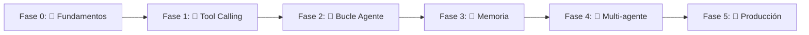
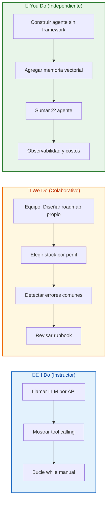
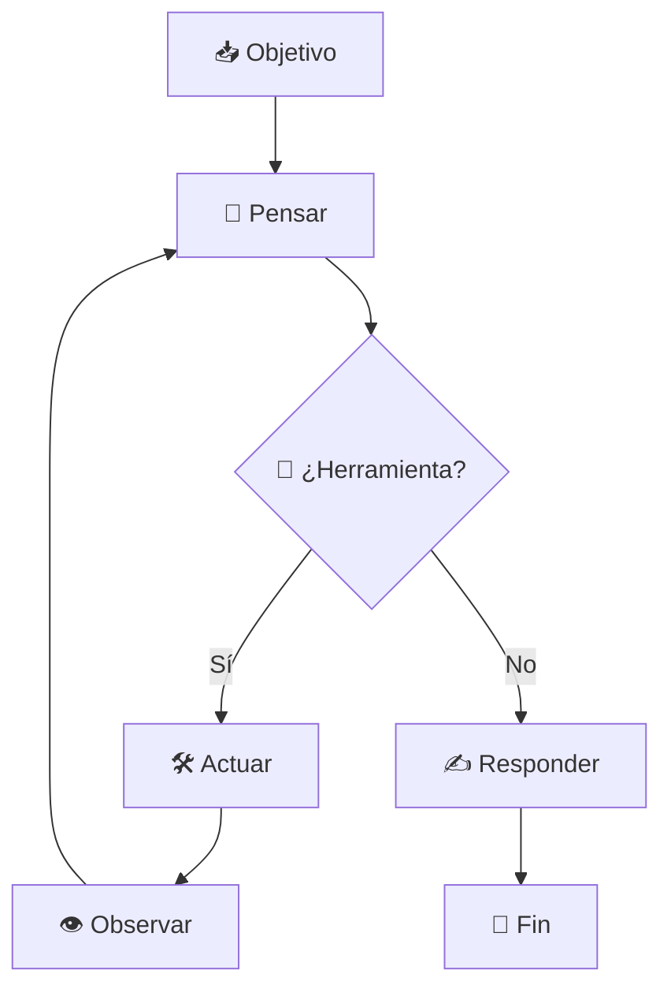
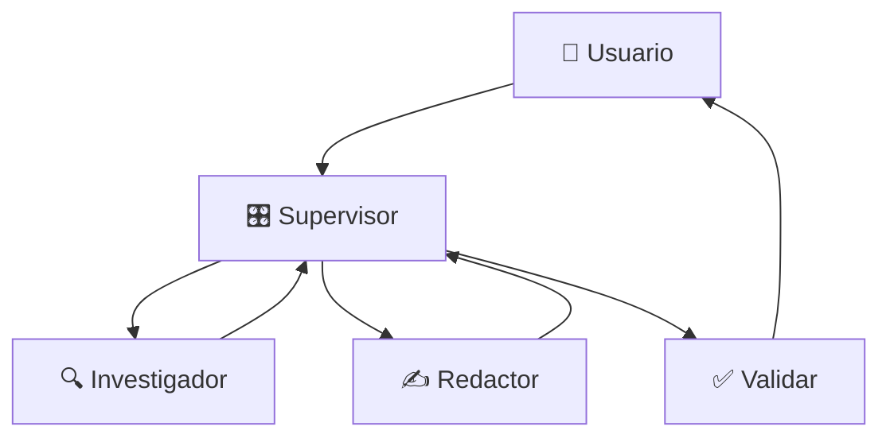

# 🤖 MASTERCLASS: Roadmap para Crear Agentes de IA — De Cero a Producción

> 🧭 Guía práctica de aprendizaje: qué estudiar primero, qué conceptos son innegociables, qué stacks usar en cada etapa y qué errores evitar.

## 📋 INTRODUCCIÓN

Crear un agente de IA no es aprender un framework.

Es construir, paso a paso, la capacidad de que un modelo **piense, actúe y observe** para resolver una tarea real.

La mayoría salta directo a LangGraph o CrewAI sin entender el bucle por dentro. Esta masterclass propone el camino inverso: ** empezar sin magia, entender cada capa y recién después adoptar herramientas**.

> 🎯 **Objetivo de Aprendizaje** — Al final de esta guía podrás trazar tu propio roadmap de aprendizaje, dominar los conceptos innegociables, elegir el stack correcto por perfil y evitar los errores que frustran al 90% de quienes empiezan.

> ⚠️ **Advertencia educativa** — Este contenido es formativo. Ningún stack o framework debe interpretarse como recomendación cerrada. La mejor herramienta depende de tu perfil y objetivo.

---

## 🗺️ MAPA DEL ROADMAP



| 🧩 Fase | ❓ Qué lográs | ⏱️ Duración |
|---------|--------------|-------------|
| **Fase 0** | Llamar a un LLM por API | 1–2 semanas |
| **Fase 1** | Conectar una herramienta real | 1–2 semanas |
| **Fase 2** | Agente de varios pasos | 2–3 semanas |
| **Fase 3** | Memoria entre sesiones | 2 semanas |
| **Fase 4** | Varios agentes coordinados | 2–3 semanas |
| **Fase 5** | Confianza en producción | Continuo |



---

## 🧱 PARTE 1: ROADMAP POR FASES

### 1.1 🟦 Fase 0 — Fundamentos (1–2 semanas)

Antes de tocar cualquier framework, necesitás entender qué es un LLM y cómo se lo usa por API.

- 🔑 Aprender a llamar a un LLM por API (OpenAI, Anthropic o el proveedor que elijas) y entender parámetros: `system prompt`, `temperature`, `max_tokens`.
- 🪙 Entender qué es un **token** y por qué importa (costo, límites de contexto).
- ✍️ Practicar **prompt engineering** básico: instrucciones claras, few-shot, formato de salida.
- 🐍 Python intermedio (funciones, clases, JSON, async básico) si vas a llegar a código completo.

> 📌 **Idea clave** — Meta de la fase: poder mandar un prompt por código y parsear la respuesta. Sin esto, los frameworks son caja negra.

### 1.2 🟩 Fase 1 — Tool Calling (1–2 semanas)

- 🔧 Entender cómo el modelo genera **llamadas a funciones** en JSON estructurado.
- 📐 Definir un schema de herramienta (nombre, descripción, parámetros).
- 🌐 Conectar una herramienta real y simple: búsqueda web, calculadora, API pública.
- 🔄 Practicar el ciclo manual: el modelo pide → vos ejecutás → le devolvés el resultado.

> 📌 **Idea clave** — Meta de la fase: un script que reciba una pregunta, decida si necesita una herramienta, la ejecute y devuelva respuesta final.

### 1.3 🟨 Fase 2 — El Bucle del Agente (2–3 semanas)



- 🔁 Implementar el ciclo completo: **pensar → actuar → observar → iterar**.
- 🪟 Gestionar la **ventana de contexto**: qué guardar, resumir o descartar.
- 🛑 Incorporar condiciones de parada (máximo de iteraciones, "tarea completada").
- 🧪 Probar con framework liviano o un bucle `while` propio.

> 📌 **Idea clave** — Meta de la fase: un agente que resuelva una tarea de varios pasos sin intervención humana en el medio.

### 1.4 🟪 Fase 3 — Memoria y Estado (2 semanas)

- 🧠 Diferenciar **memoria de corto plazo** (contexto) de **memoria de largo plazo** (persistente).
- 🗄️ Introducción a bases de datos vectoriales para RAG.
- 💾 Guardar y recuperar estado (qué hizo, qué decidió).

> 📌 **Idea clave** — Meta de la fase: un agente que recuerde información relevante entre sesiones distintas.

### 1.5 🟥 Fase 4 — Multi-agente y Orquestación (2–3 semanas)



- 👥 Cuándo conviene un solo agente vs. varios especializados.
- 🔀 Patrones: supervisor/worker, pipeline secuencial, debate.
- 📡 Observabilidad: tracing y logging de cada paso.

> 📌 **Idea clave** — Meta de la fase: un sistema con al menos dos agentes que colaboren en una tarea.

### 1.6 🟫 Fase 5 — Producción (continuo)

- 🔁 Manejo de errores y reintentos.
- 💰 Control de costos (cachear, limitar tokens, modelos más chicos).
- 🔒 Seguridad: sanitizar entradas, limitar acciones, confirmación humana.
- 📊 Evaluación: tests, métricas y revisión humana.

> 📌 **Idea clave** — Meta de la fase: un agente en el que podés confiar para correr sin supervisión constante.

---

## 💡 PARTE 2: CONCEPTOS FUNDAMENTALES

Estos conceptos, si no los entendés, generan confusión constante:

| 🔤 Concepto | 📝 Por qué es innegociable |
|-------------|----------------------------|
| **LLM como predictor** | No es un "cerebro"; predice texto. |
| **Prompt engineering** | La forma de pedir cambia radicalmente el resultado. |
| **Tool calling** | Es el mecanismo real por el cual el modelo "actúa". |
| **Ventana de contexto** | Explica por qué el agente "se olvida". |
| **Agent loop** | Pensar-actuar-observar-iterar con condición de parada. |
| **RAG** | Dar información que el modelo no tiene entrenada. |
| **Embeddings** | Base técnica de memoria y búsqueda semántica. |
| **Orquestación** | Cuándo y cómo dividir trabajo entre agentes. |
| **Costos y latencia** | Cada llamada cuesta dinero y tiempo. |
| **Seguridad** | Qué puede y no puede hacer sin supervisión. |

---

## 📖 PARTE 3: GLOSARIO ESENCIAL

| 🔤 Término | 📝 Definición |
|------------|---------------|
| **LLM** | Modelo de lenguaje grande; predice texto dado un contexto. |
| **Token** | Unidad mínima de texto que procesa el modelo. |
| **Prompt** | Entrada de texto para obtener una respuesta. |
| **System prompt** | Instrucciones persistentes de toda la sesión. |
| **Tool calling** | Salida estructurada que indica qué herramienta ejecutar. |
| **Context window** | Máximo de tokens que el modelo "ve" por llamada. |
| **Agent loop** | Ciclo de pensar, actuar y observar hasta un objetivo. |
| **RAG** | Recupera información externa y la inyecta en el prompt. |
| **Embedding** | Vector numérico que representa texto (similitud semántica). |
| **Vector DB** | Base optimizada para embeddings (Chroma, Pinecone, Weaviate). |
| **Fine-tuning** | Reentrenar con datos específicos para especializar. |
| **Hallucination** | Información falsa con apariencia de certeza. |
| **Orchestration** | Coordinación de agentes/pasos para tareas complejas. |
| **Guardrails** | Restricciones que limitan qué puede hacer un agente. |
| **Latency** | Tiempo de respuesta; crítico en bucles multi-iteración. |

---

## 🧰 PARTE 4: STACKS MÁS CONOCIDOS

### 4.1 🔧 Frameworks de orquestación (código)

| 🛠️ Stack | 📝 Cuándo usarlo |
|----------|------------------|
| **LangGraph** | Control fino del bucle con grafos de estados. |
| **LangChain** | Prototipar rápido; puede sentirse pesado en grande. |
| **LlamaIndex** | Fuerte en RAG y fuentes de datos/documentos. |
| **CrewAI** | Sistemas multi-agente con roles definidos. |
| **AutoGen** | Conversaciones entre múltiples agentes (Microsoft). |
| **Pydantic AI** | Liviano y tipado; menos "magia". |

### 4.2 🧩 Low-code / No-code

- 🔌 **N8N** — automatización visual open-source.
- 🎨 **Flowise** — constructor visual basado en LangChain.
- 🏭 **Make** — integraciones empresariales.
- 🤖 **OpenAI Agent Builder / GenSpark** — no-code para empezar sin código.

### 4.3 🗄️ Bases vectoriales

- **Chroma** — liviana, ideal para prototipar local.
- **Pinecone** — gestionada en la nube, escala producción.
- **Weaviate** — open-source con búsqueda híbrida.
- **pgvector** — extensión de Postgres si ya lo usás.

### 4.4 📡 Observabilidad

- **LangSmith** — tracing para LangChain/LangGraph.
- **Langfuse** — alternativa open-source para tracing y evaluación.

---

## 👤 PARTE 5: MEJORES OPCIONES SEGÚN TU PERFIL

| 👤 Perfil | 🚀 Mejor punto de partida |
|-----------|---------------------------|
| Sin programar, validar idea | OpenAI Agent Builder o GenSpark |
| Lógica pero sin código pesado | N8N o Flowise |
| Python y control total | LangGraph o Pydantic AI |
| Agente que lea documentos (RAG) | LlamaIndex + Chroma/pgvector |
| Varios agentes en equipo | CrewAI o AutoGen |
| Producción real | LangGraph + Langfuse/LangSmith |

---

## ✅ PARTE 6: CONSEJOS PRÁCTICOS

- 🚫 **Empezá sin framework.** Escribí un bucle `while` a mano antes de LangGraph.
- 🔢 **Limitá las iteraciones desde el principio** (10–15) con fallback si se alcanza.
- 📝 **Loguea cada paso** del bucle: qué pensó, qué tool llamó, qué resultado.
- 🪙 **Empezá con una sola herramienta**; sumá de a una para no confundir al modelo.
- 🧪 **No confíes en el modelo para todo**; validá salidas críticas con código.
- 📄 **El system prompt es documentación**: objetivo, herramientas, cuándo parar.
- 💸 **Medí costo por tarea**, no solo por llamada; simulá antes de escalar.
- 🖥️ **Empezá local, escalá después** (Chroma, modelos baratos).
- 🙋 **Human-in-the-loop** en acciones irreversibles (borrar, enviar, comunicar).

---

## ❌ PARTE 7: ERRORES COMUNES A EVITAR

| ❌ Error | 💥 Consecuencia |
|----------|-----------------|
| Saltar al framework sin entender el bucle | Dependés de magia que no controlás |
| Sin límite de iteración ni costo | Bucles infinitos y facturas inesperadas |
| Demasiadas herramientas al inicio | El modelo se confunde eligiendo |
| Mezclar memoria corta y larga sin criterio | Contexto ruidoso o inconsistente |
| No loguear ni trazar | Imposible debuggear fallas |
| Asumir que "entiende" como humano | Resultados ambiguos o incorrectos |
| Prototipo directo a producción | Riesgo sin seguridad ni validación |

---

## 🛠️ PARTE 8: PROYECTO GUÍA SUGERIDO

Un solo proyecto para recorrer todo el roadmap:

1. 🟦 **Semana 1–2:** agente con una herramienta (búsqueda web) por API, sin framework.
2. 🟩 **Semana 3–4:** reescrito con bucle completo y logging de cada paso.
3. 🟨 **Semana 5–6:** memoria persistente con Chroma (recuerda sesiones previas).
4. 🟪 **Semana 7–8:** migrar a LangGraph y agregar una segunda herramienta.
5. 🟥 **Semana 9–10:** segundo agente especializado, coordinado con CrewAI/AutoGen.
6. 🟫 **Semana 11–12:** observabilidad (Langfuse), límites de costo y confirmación humana.

> 📌 **Idea clave** — Al final tenés un agente funcional **y** la comprensión de qué resuelve cada capa: mucho más valioso que saber usar un framework.

---

## 💻 APÉNDICE: CÓDIGO MÍNIMO (SIN FRAMEWORK)

```python
import os, json, requests


def call_llm(messages, tools=None, max_tokens=500):
    payload = {
        "model": "gpt-4o-mini",
        "messages": messages,
        "max_tokens": max_tokens,
        "tools": tools or [],
    }
    r = requests.post(
        "https://api.openai.com/v1/chat/completions",
        headers={"Authorization": f"Bearer {os.environ['OPENAI_API_KEY']}"},
        json=payload,
    )
    return r.json()["choices"][0]["message"]


def agent_loop(objective: str, max_steps: int = 10):
    messages = [{"role": "system", "content": "Sos un agente. Usá herramientas si hacen falta."},
                {"role": "user", "content": objective}]
    for _ in range(max_steps):
        msg = call_llm(messages)
        if msg.get("tool_calls"):
            for tc in msg["tool_calls"]:
                args = json.loads(tc["function"]["arguments"])
                result = f"Resultado de {tc['function']['name']}: {args}"
                messages.append(msg)
                messages.append({"role": "tool", "content": result})
            continue
        return msg["content"]
    return "⚠️ Límite de pasos alcanzado"
```

> 📌 **Idea clave** — Este bucle de ~20 líneas contiene todo: pensar, actuar, observar y la condición de parada.

---

## 👥 PARTE 9: I DO / WE DO / YOU DO

### 🧑‍🏫 I Do — Llamar un LLM por API

**Objetivo:** ver la pieza más pequeña funcionando.

```python
print(call_llm([{"role": "user", "content": "¿Qué es un token?"}])["content"])
```

### 👥 We Do — Elegir stack por perfil

**Escenario:** un equipo sin experiencia en código quiere automatizar soporte.

| 🧩 Decisión | ✅ Opción | 📝 Justificación |
|-------------|-----------|------------------|
| Plataforma | N8N | Visual y sin código pesado |
| Memoria | pgvector | Ya usan Postgres |
| Evaluación | Langfuse | Open-source |
| Confirmación | Humana | Acciones externas |

### 🚀 You Do — Tu primer agente

**Tarea:** construí un agente sin framework que use una herramienta y recuerde la sesión.

Debes incluir:
- 🔁 bucle con condición de parada
- 🛠️ al menos 1 herramienta real
- 📝 logging por paso
- 🧠 memoria de corto plazo
- 💰 conteo de tokens

| 📋 Criterio | ⚖️ Peso |
|-------------|---------|
| Sin framework | 30% |
| Manejo de errores | 25% |
| Logging | 25% |
| Claridad | 20% |

---

## ✅ CHECKLIST FINAL DEL ROADMAP

| 🧩 Bloque | ✔️ Check |
|----------|----------|
| Fundamentos | LLM por API y parseo de respuesta |
| Tool calling | Schema y herramienta real conectada |
| Bucle | Pensar-actuar-observar con límite |
| Memoria | Corto y largo plazo funcionando |
| Multi-agente | Al menos 2 agentes coordinados |
| Producción | Errores, costos y seguridad |
| Observabilidad | Tracing y métricas |
| Retiro | Criterios de pausa o mejora |

---

## 📝 PREGUNTAS DE VERIFICACIÓN

1. **Aplica:** Si tu agente entra en bucle infinito, ¿qué control falló y cómo lo arreglás?
2. **Analiza:** ¿Por qué conviene empezar sin framework aunque sea más lento?
3. **Diseña:** Un agente RAG para tu empresa. ¿Qué stack elegís y por qué?
4. **Reflexiona:** ¿Cuándo un agente único es mejor que uno multi-agente?
5. **Conecta:** Explica cómo la memoria de largo plazo cambia la experiencia del usuario.
6. **Propón:** Diseña un dashboard mínimo de observabilidad. ¿Qué alertas pondrías?
7. **Síntesis:** Tomá el proyecto guía y aplicalo a tu caso real.
8. **Reflexión final:** De las 6 fases, ¿cuál es más crítica para evitar costos descontrolados?

---

## 📐 ANEXO: FORMATO IDEAL PARA GUÍAS EDUCATIVAS

### 📏 Ancho de lectura

El ancho óptimo para contenido largo es **60–75 caracteres por línea**.

```css
.article-content {
  max-width: 65ch;
  font-size: 18px;
  line-height: 1.75;
}
```

### 🎨 Jerarquía visual

| 🔠 Elemento | 📐 Tamaño |
|-------------|-----------|
| H1 | 40–56 px |
| H2 | 28–36 px |
| H3 | 22–28 px |
| Párrafo | 18–20 px |

> 📌 **Idea clave** — El cerebro escanea, no lee. Íconos, tablas y cajas de resumen convierten una pared de texto en una guía que se recorre.
