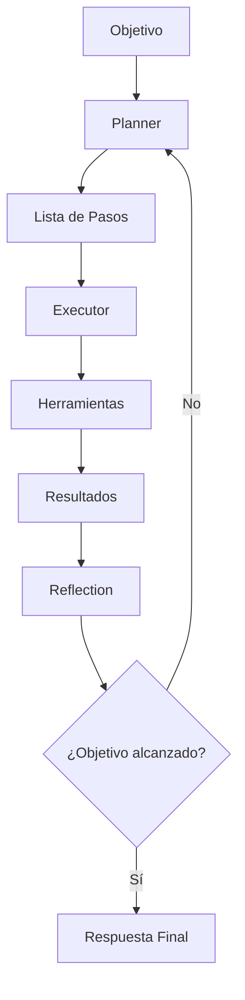
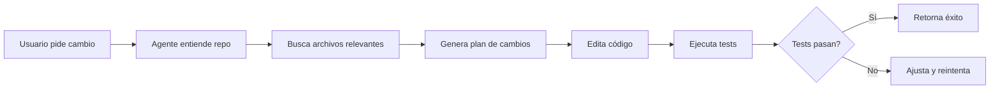
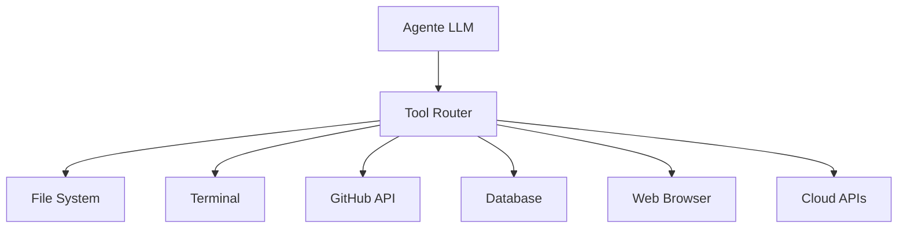
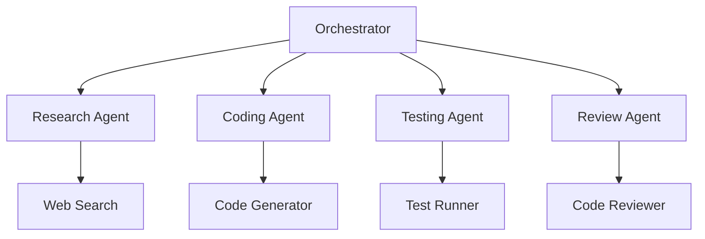
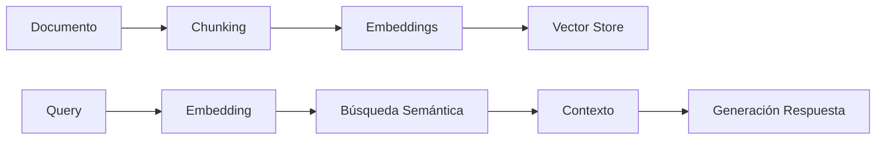
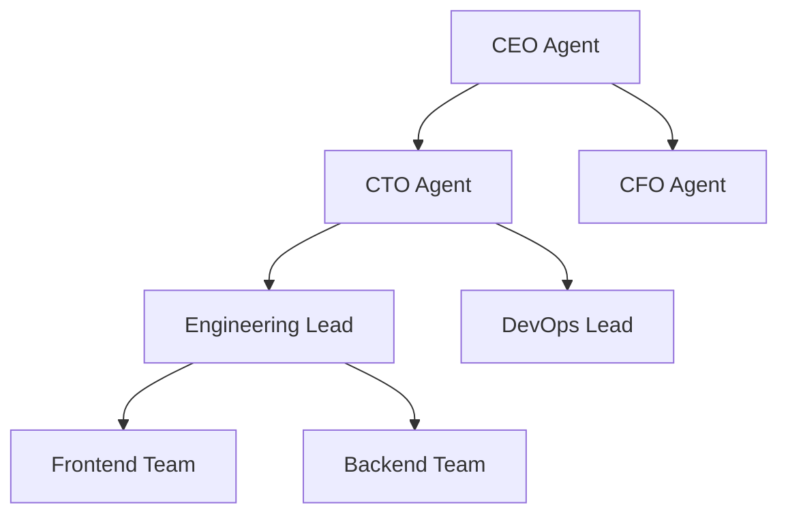
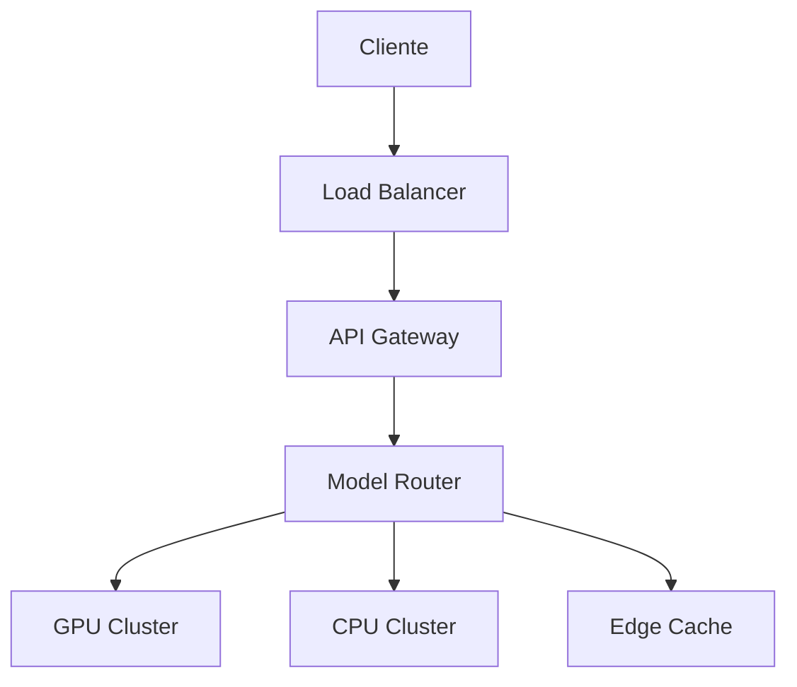
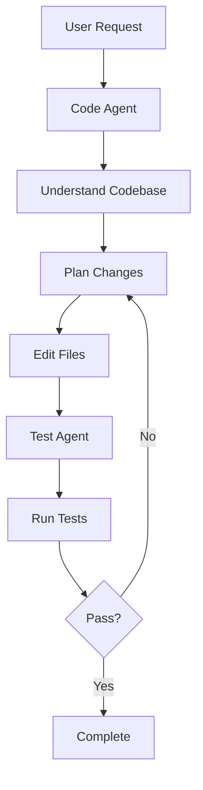

## ¿Qué vas a aprender

En este contenido explorarás los conceptos clave y su aplicación práctica:

- Fundamentos teóricos y contexto necesario para entender el tema
- Aplicaciones prácticas y casos de uso reales
- Herramientas, técnicas y mejores prácticas recomendadas
- Ejemplos guiados paso a paso
- Errores comunes, anti-patrones y cómo evitarlos


# Masterclass: AI Agents & Autonomous Engineering Systems

## Introducción: De Chatbots a Sistemas Autónomos

Imagina que un chatbot es como un conductor que solo responde a radio llamadas. Un **sistema autónomo de ingeniería** es como un equipo completo de ingenieros que recibe un problema, lo analiza, diseña soluciones, escribe código, prueba y despliega - todo sin intervención humana.

Este es el futuro de la ingeniería de software. Y tú puedes construirlo.

## 1. Fundamentos de Sistemas AI Modernos

### ¿Qué es un LLM realmente?

Un LLM no es "inteligente", es un **predector de tokens** entrenado en 100+ GB de texto. Piensa en él como un escritor que ha leído todo internet y ahora puede continuar cualquier historia con sorprendente coherencia.

```
Prompt: "La función fibonacci en Python es..."
LLM ve: "La función fibonacci en Python es..."
Predice: "def fibonacci(n):" (porque es lo más probable)
```

### Los Componentes Clave

| Componente | Qué hace | Analogía |
|------------|----------|----------|
| **Tokens** | Unidades de texto | Como palabras o partes de palabras |
| **Context Window** | Memoria del LLM | Como el espacio en una hoja de papel |
| **Embeddings** | Vector numérico de significado | Como un "mapa de significado" |
| **Tool Calling** | Función para usar herramientas | Como un robot que puede usar herramientas |
| **Function Calling** | Llamar funciones específicas | Como un programador que llama APIs |

### Por qué los Agents son Diferentes

Un chatbot responde a **una pregunta a la vez**. Un agente:
1. Recibe un objetivo
2. Planifica pasos
3. Ejecuta acciones
4. Evalúa resultados
5. Ajusta e intenta de nuevo

Es la diferencia entre **responder** y **actuar**.

## 2. Arquitectura de AI Agents

### El Patrón Planner/Executor



**Ejemplo Real:**
```
Objetivo: "Crea un dashboard de ventas"
1. Planner: ["Investigar datos", "Diseñar UI", "Implementar", "Probar"]
2. Executor: Ejecuta cada paso
3. Reflection: Evalúa si el dashboard funciona
```

### Tipos de Agents

| Tipo | Característica | Cuándo usar |
|------|---------------|-------------|
| **Reactivo** | Responde a estímulos | Chatbots simples |
| **Planificador** | Planifica antes de actuar | Tareas complejas |
| **Reflexivo** | Piensa antes de actuar | Sistemas críticos |
| **Multi-Agente** | Múltiples agents colaboran | Sistemas empresariales |

## 3. Agentic Engineering Workflows

### Cómo funciona Cursor internamente



### El Patrón de Trabajo

1. **Understanding**: El agente lee todo el codebase
2. **Planning**: Decide qué archivos cambiar
3. **Execution**: Escribe el código
4. **Validation**: Ejecuta tests
5. **Iteration**: Corrige si falla

### Caso de Estudio: Claude Code

```
Usuario: "Agrega autenticación JWT a esta API"
Claude Code:
1. Lee toda la API existente
2. Identifica puntos de entrada
3. Diseña sistema de auth
4. Escribe middleware JWT
5. Actualiza rutas protegidas
6. Escribe tests de autenticación
7. Ejecuta tests → Todos pasan
```

## 4. Tool Calling & Integraciones

### Cómo los Agents Usan Herramientas

```python
# El LLM genera esto:
{
  "tool": "file_editor",
  "params": {
    "path": "/src/app.ts",
    "operation": "edit",
    "content": "nuevo código"
  }
}

# El sistema ejecuta la herramienta
result = file_editor.edit(params)
```

### Integraciones Críticas

| Herramienta | Uso | Ejemplo |
|-------------|-----|---------|
| **Terminal** | Ejecutar comandos | `npm test` |
| **GitHub** | Leer PRs, crear issues | API de GitHub |
| **Database** | Consultar datos | PostgreSQL, MongoDB |
| **Browser** | Scraping, navegación | Playwright, Puppeteer |
| **Cloud** | Deploy, escalado | AWS, Vercel, Railway |

### Arquitectura de Integración



## 5. Arquitecturas de Agentes

### Planner/Executor Pattern

```typescript
class Agent {
  async execute(objective: string) {
    const plan = await this.planner.createPlan(objective);
    
    for (const step of plan.steps) {
      const result = await this.executor.run(step);
      await this.reflect(result);
    }
  }
}
```

### Multi-Agent System



### Caso Real: Sistema de DevOps

```
Agent Orchestrator:
├── Build Agent: Compila código
├── Test Agent: Ejecuta suites
├── Deploy Agent: Despliega a staging
├── Monitor Agent: Supervisa logs
└── Alert Agent: Notifica problemas
```

## 6. Sistemas de Memoria

### Memoria a Largo Plazo

```typescript
class MemorySystem {
  private vectorDB: VectorDatabase;
  
  async store(knowledge: string) {
    const embedding = await this.createEmbedding(knowledge);
    await this.vectorDB.upsert({
      id: uuid(),
      vector: embedding,
      metadata: { content: knowledge }
    });
  }
  
  async retrieve(query: string): Promise<string[]> {
    const embedding = await this.createEmbedding(query);
    const results = await this.vectorDB.query(embedding, 5);
    return results.map(r => r.metadata.content);
  }
}
```

### Vector Databases Comparadas

| Database | Velocidad | Escalabilidad | Caso de uso |
|----------|-----------|---------------|-------------|
| **Pinecone** | ⚡⚡⚡ | ⚡⚡ | Prototipos rápidos |
| **Weaviate** | ⚡⚡ | ⚡⚡⚡ | Producción |
| **Chroma** | ⚡ | ⚡ | Local/dev |
| **pgvector** | ⚡⚡ | ⚡⚡⚡ | SQL-native |

## 7. Retrieval-Augmented Generation (RAG)

### Pipeline Completo



### Chunking Strategy

```python
def chunk_document(text, chunk_size=1000, overlap=100):
    chunks = []
    for i in range(0, len(text), chunk_size - overlap):
        chunks.append(text[i:i + chunk_size])
    return chunks
```

### Mejores Prácticas

- **Chunking**: 512-2048 tokens por chunk
- **Overlap**: 10-20% para contexto continuo
- **Reranking**: Usar modelo para reordenar resultados
- **Hybride Search**: Palabras clave + semántico

## 8. Sistemas Multi-Agente

### Arquitectura Jerárquica



### Coordinación de Agents

```typescript
class MultiAgentOrchestrator {
  private agents: Map<string, Agent>;
  
  async coordinate(task: Task) {
    const assignments = this.decompose(task);
    
    const results = await Promise.all(
      assignments.map(a => this.agents.get(a.agent).execute(a.subtask))
    );
    
    return this.synthesize(results);
  }
}
```

## 9. Infraestructura AI

### Stack de Inferencia



### Proveedores Comparados

| Proveedor | Velocidad | Costo | Caso de uso |
|-----------|-----------|-------|-------------|
| **OpenAI** | ⚡⚡⚡ | $$$ | Prototipos |
| **Anthropic** | ⚡⚡ | $$$ | Production |
| **Together AI** | ⚡⚡⚡ | $$ | Alta carga |
| **Modal** | ⚡ | $ | Batch jobs |
| **Replicate** | ⚡ | $$ | Variedad |

## 10. Automatización con AI

### Workflow Engine

```typescript
class AIWorkflow {
  async run(definition: WorkflowDefinition) {
    for (const step of definition.steps) {
      const result = await this.executeStep(step);
      
      if (!result.success) {
        await this.handleFailure(step, result.error);
        continue;
      }
      
      await this.updateState(step.name, result.data);
    }
  }
}
```

### Ejemplo: CI/CD con AI

```yaml
name: AI Deploy
on: [push]
jobs:
  deploy:
    steps:
    - name: AI Code Review
      uses: ai-review/agent@v1
    - name: Smart Testing
      uses: ai-test/generator@v1
    - name: Auto Deploy
      if: all_tests_pass
      uses: deploy/manager@v1
```

## 11. Proyectos Prácticos

### Proyecto 1: AI Coding Assistant

```bash
# Estructura del proyecto
ai-coding-assistant/
├── agents/
│   ├── code-agent.ts
│   ├── test-agent.ts
│   └── review-agent.ts
├── tools/
│   ├── file-system.ts
│   ├── terminal.ts
│   └── github.ts
├── memory/
│   └── vector-store.ts
└── workflows/
    └── refactor-workflow.ts
```

### Arquitectura del Sistema



## 12. Errores Comunes

### Anti-Patrones

❌ **Context Explosion**: Meter todo el código en el prompt
✅ **Estrategia**: Usar memoria vectorial y herramientas

❌ **Over-engineering**: Crear 10 agents para una tarea simple
✅ **Regla**: Un agente = una responsabilidad clara

❌ **Sin validación**: No verificar resultados
✅ **Práctica**: Siempre ejecutar tests y validar

### Checklist de Calidad

- [ ] El agente tiene un propósito claro
- [ ] Usa herramientas apropiadas
- [ ] Tiene mecanismo de fallo/retry
- [ ] Valida resultados
- [ ] Es observable (logs/trazas)

## 13. El Futuro

### Tendencias 2026

1. **Agent Operating Systems**: SO dedicado a agents
2. **Autonomous Teams**: Equipos completos de agents
3. **AI-First Development**: IDE que es agente
4. **Agent Marketplace**: Agents reutilizables como paquetes

### Tu Próximo Paso

Construye un agente simple esta semana. No un chatbot. Un agente que:
1. Reciba un objetivo
2. Use herramientas
3. Ejecute pasos
4. Reporte resultados

## Conclusión

Los sistemas autónomos no reemplazarán al programador. **Lo harán más poderoso**.

Dominar estos conceptos te pondrá en la vanguardia de la ingeniería de software. El futuro es colaborativo: humanos + agents trabajando juntos.

---

## Recursos Adicionales

- [Documentación de LangGraph](https://langchain.com/docs/langgraph)
- [Cursor Architecture](https://cursor.com)
- [Claude Code Docs](https://docs.anthropic.com)
- [MCP Specification](https://modelcontextprotocol.io)

## Checklist Final

Antes de construir tu primer agente:

- [ ] Entiendes qué es un LLM
- [ ] Sabes usar tool calling
- [ ] Puedes diseñar un workflow
- [ ] Conoces las herramientas básicas
- [ ] Tienes un plan de acción

---

## Reflexión Final: La Era de los Sistemas Autónomos

> **"No estás leyendo esto por casualidad. Estás en el umbral de una transformación."**

La ingeniería de software está cambiando más en los próximos 5 años de lo que ha cambiado en las últimas 20. Los sistemas que construías como aplicaciones monolíticas hoy serán **ecosistemas de agents** mañana.

### Los 3 Mandamientos del Ingeniero de Agents

1. **Piensa en sistemas, no en código**
   - Un agente no es un script
   - Es un organismo que toma decisiones
   - Diseña para la incertidumbre

2. **Valida todo, siempre**
   - Los agents cometerán errores
   - Tu trabajo es detectar y corregir
   - La confiabilidad es más importante que la capacidad

3. **Itera rápido, aprende más rápido**
   - Construye, prueba, ajusta
   - Cada fallo es una lección
   - La velocidad de aprendizaje es tu ventaja

### Consejos para tu Primer Agente

**Empieza pequeño:**
```
Objetivo: "Lista los archivos de esta carpeta"
No: "Construye un sistema de gestión empresarial"
```

**Usa el principio de responsabilidad única:**
- Un agente = una tarea
- Multiple agents = coordinación
- Menos es más

**Implementa observabilidad desde el día 1:**
```typescript
console.log(`[Agent] Step: ${step.name}`);
console.log(`[Agent] Result: ${JSON.stringify(result)}`);
```

**Planifica para el fracaso:**
```typescript
try {
  await agent.execute(task);
} catch (error) {
  await agent.reportError(error);
  await agent.requestHelp();
}
```

### La Próxima Generación de Ingenieros

Los ingenieros del futuro no escribirán más código. **Dirigirán orquestas de agents**. Serás tú quien diseñe:
- Qué agents existen
- Cómo interactúan
- Qué resultados esperan
- Cómo medir el éxito

### Tu Misión

No esperes a que esto pase. **Empieza hoy.**

Construye un agente simple. Luego otro. Y otro más. Cada uno te acercará un paso más al futuro que estás leyendo sobre.

> **"Los mejores ingenieros no son los que escriben más código, sino los que saben qué no escribir."**

El código del futuro será escrito por agents. El tuyo será el diseño que los haga funcionar.

---

**Recuerda**: Estás leyendo esto en 2026. En 2030, esta guía será historia. Pero tú puedes ser parte de quien la escribe.

¡Construye algo increíble!

---

## Preguntas de Verificación 📝

Responde cada pregunta basándote en los conceptos de esta master class. Escribe tus respuestas o compártelas para profundizar tu aprendizaje.

### Preguntas sobre Arquitectura de AI Agents

1. **Diseña**: Crea un agente Planner/Executor para una tarea de investigación de mercado. Define los componentes principales y su flujo de datos.

2. **Compara**: ¿Cuál sería la diferencia entre implementar un agente reactivo vs. un agente planificador para una tarea de análisis financiero?

3. **Evalúa**: Un agente multi-agente tiene 5 especialistas trabajando en paralelo. ¿Qué riesgos de comunicación emergence y cómo los mitigarías?

### Preguntas sobre Tool Calling e Integraciones

4. **Propón**: Diseña un sistema de tool routing para que un agente pueda usar: filesystem, terminal, base de datos y API web. ¿Qué consideraciones de seguridad tendrías?

5. **Aplica**: Si un agente necesita acceder a datos de bolsa en tiempo real, ¿qué herramientas elegirías y por qué? Considera latencia, costo y confiabilidad.

6. **Analiza**: ¿Cómo implementarías un mecanismo de fallback cuando una herramienta falla? Ejemplo: base de datos caída durante ejecución.

### Preguntas sobre RAG y Memoria

7. **Calcula**: Un documento tiene 10,000 palabras. Con un chunk size de 512 tokens y overlap del 10%, ¿cuántos chunks generarás? ¿Cómo afecta esto la calidad de recuperación?

8. **Propón**: Diseña un sistema de memoria vectorial para un asistente que recuerde preferencias de usuarios. ¿Qué metadata almacenarías?

### Preguntas Integradoras

9. **Conecta**: Explica cómo el patrón Reflection se relaciona con el concepto de "validar resultados". ¿Qué tan importante es este paso en la autorregulación?

10. **Diseña**: Crea un workflow para automatizar el análisis de reportes financieros trimestrales. Incluye: research agent, data agent, y reporting agent.

11. **Síntesis**: Toma una tarea manual que hagas regularmente (ej: crear informes, responder emails, planificar) y diseña un agente que la automatice. Identifica los puntos de fricción.

12. **Reflexión final**: El código del futuro será escrito por agents. ¿Tú qué papel jugarás en esta transición? ¿Qué habilidades desarrollarás primero?

---

## Glosario Rápido

| Término | Definición |
|---------|------------|
| **Agent** | Sistema que percibe, razona y actúa para alcanzar objetivos |
| **Tool Calling** | Capacidad de un LLM para invocar funciones externas |
| **RAG** | Retrieval-Augmented Generation: mejora respuestas con contexto externo |
| **Reflection** | Bucle de autoevaluación y ajuste de resultados |
| **Multi-Agent** | Sistema con múltiples agentes especializados que colaboran |