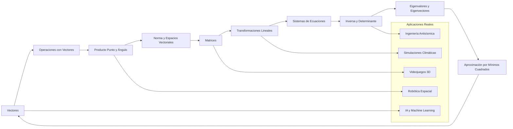
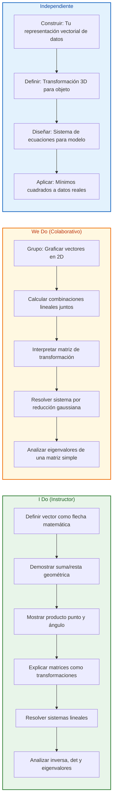
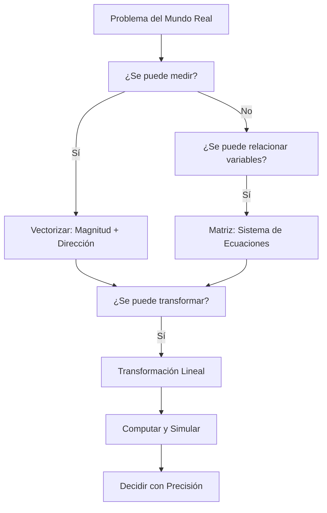

# MASTERCLASS: Álgebra Lineal — El Lenguaje Universal de la IA, las Simulaciones y la Ingeniería Moderna

## INTRODUCCIÓN: POR QUÉ ESTE MASTERCLASS ES DIFERENTE

La base matemática que sostiene la inteligencia artificial, las simulaciones del clima, los robots que llegan a Marte, los videojuegos hiperrealistas y la ingeniería antisísmica es clara: álgebra lineal. Esta disciplina ofrece el lenguaje universal para modelar fuerzas, procesar datos masivos y transformar objetos en espacios n-dimensionales con precisión y eficiencia.

La mayoría de las personas aprenden álgebra lineal como un conjunto de reglas abstractas sin ver cómo esas mismas herramientas impulsan las tecnologías que usan todos los días. Este masterclass propone un cambio: **entender la teoría a través de sus aplicaciones reales**, conectando cada concepto matemático con el mundo físico y digital que modela.

> **Objetivo de Aprendizaje** — Al final de esta guía, podrás leer, interpretar y construir modelos con vectores, matrices y transformaciones lineales; resolver sistemas de ecuaciones; y entender cómo estas herramientas son el motor detrás de la IA, los videojuegos 3D, las simulaciones climáticas y la ingeniería estructural.

> **Advertencia educativa** — Este contenido es formativo. Las aplicaciones mostradas son versiones simplificadas de sistemas reales usados en producción.

---

## MAPA DEL SISTEMA DE ÁLGEBRA LINEAL



| Fase | Pregunta que responde | Output principal |
|------|-----------------------|------------------|
| **Vectores** | ¿Cómo representar magnitudes con dirección? | Flechas matemáticas en ℝⁿ |
| **Operaciones** | ¿Cómo sumar, escalar y combinar vectores? | Combinaciones lineales y span |
| **Producto Punto** | ¿Cómo medir alineación y ángulo? | Proyección ortogonal y coseno del ángulo |
| **Norma** | ¿Cómo medir longitud y distancia? | Magnitud del vector con Pitágoras |
| **Matrices** | ¿Cómo organizar datos en bloques? | Tablas numéricas como transformaciones |
| **Transformaciones** | ¿Cómo modificar el espacio? | Escalar, rotar, sesgar y proyectar |
| **Sistemas** | ¿Cómo resolver múltiples ecuaciones? | Solución única, infinita o inexistente |
| **Inversa** | ¿Cuándo se puede deshacer una transformación? | Matriz inversa y determinante |
| **Eigenvalores** | ¿Cuáles son los ejes naturales? | Direcciones privilegiadas de deformación |
| **Aproximación** | ¿Qué hacer sin solución exacta? | Mínimos cuadrados y regresión |



---

## PARTE 1: ¿POR QUÉ EL ÁLGEBRA LINEAL IMPULSA LA TECNOLOGÍA MODERNA?

### 1.1 El Lenguaje Universal de lo Computable

El álgebra lineal es la disciplina matemática que conecta problemas complejos con soluciones concretas. Sus **vectores**, **matrices** y **transformaciones lineales** permiten pasar de lo abstracto a lo computable, ya sea al rotar un objeto en 3D o al resolver miles de ecuaciones a la vez.

> **Principio Fundamental** — Todo lo que en el mundo real puede representarse como magnitud con dirección, como relación entre variables o como transformación de un estado a otro, es modelable con álgebra lineal.

### 1.2 Las 5 Tecnologías que Dependen de Álgebra Lineal

| Tecnología | Aplicación del Álgebra Lineal | Ejemplo Concreto |
|------------|------------------------------|------------------|
| **Inteligencia Artificial** | Representaciones vectoriales (embeddings), redes neuronales como composición de matrices, backpropagation como derivadas matriciales | GPT procesa texto como vectores en espacios de alta dimensión |
| **Simulaciones Climáticas** | Sistemas de ecuaciones lineales a gran escala para modelar atmósfera, océanos y terreno | Modelos GCM (General Circulation Models) con millones de variables |
| **Robótica Espacial** | Transformaciones en espacios tridimensionales para navegación, control de brazos robóticos y planificación de trayectoria | Perseverance en Marte usa SLAM basado en álgebra lineal |
| **Videojuegos Hiperrealistas** | Gráficos 3D, rotaciones de objetos, cámaras, iluminación y física | Motor Unreal/Unity usa matrices 4x4 para transformaciones homogéneas |
| **Ingeniería Antisísmica** | Análisis estructural en términos de fuerzas (vectores) y rigidez (matrices) | Diseño de edificios que absorben energía sísmica mediante matrices de flexibilidad |

### 1.3 La Estructura Oculta de lo Real



### 1.4 Código: Detección de la Presencia de Álgebra Lineal

```python
import numpy as np

def detectar_algebra_lineal(problema):
    """
    Analiza si un problema del mundo real puede modelarse con álgebra lineal.
    """
    analisis = {
        'tiene_magnitud': False,
        'tiene_direccion': False,
        'tiene_multiples_variables': False,
        'tiene_transformaciones': False,
        'modelable': False,
        'herramienta': []
    }

    if any(palabra in problema.lower() for palabra in
           ['fuerza', 'velocidad', 'desplazamiento', 'flujo', 'campo', 'direccion']):
        analisis['tiene_magnitud'] = True
        analisis['tiene_direccion'] = True
        analisis['herramienta'].append('Vectores')

    if any(palabra in problema.lower() for palabra in
           ['sistema', 'ecuaciones', 'red', 'datos', 'imagen', 'modelo']):
        analisis['tiene_multiples_variables'] = True
        analisis['herramienta'].append('Matrices')

    if any(palabra in problema.lower() for palabra in
           ['rotar', 'escalar', 'transformar', 'proyectar', 'cambiar']):
        analisis['tiene_transformaciones'] = True
        analisis['herramienta'].append('Transformaciones Lineales')

    analisis['modelable'] = (
        analisis['tiene_magnitud'] or
        analisis['tiene_multiples_variables'] or
        analisis['tiene_transformaciones']
    )

    return analisis

problemas = [
    "Diseñar edificio resistente a terremotos con fuerzas sísmicas",
    "Rotar personaje 3D en videojuego con cámara",
    "Predecir clima con millones de datos atmosféricos",
    "Navegación de robot en Marte con sensores",
    "Clasificar imágenes con red neuronal"
]

for p in problemas:
    resultado = detectar_algebra_lineal(p)
    print(f"Problema: {p}")
    print(f"  Modelable: {resultado['modelable']}")
    print(f"  Herramientas: {', '.join(resultado['herramienta'])}")
    print()
```

### 1.5 Tabla de Traducción Mundo Real → Álgebra Lineal

| Concepto del Mundo Real | Representación Matemática | Aplicación |
|-------------------------|---------------------------|-------------|
| Fuerza en una dirección | Vector en ℝ³ | Ingeniería estructural |
| Imagen en escala de grises | Matriz (píxeles) | Procesamiento de imágenes |
| Red social (usuarios × posts) | Matriz de adyacencia | Análisis de redes |
| Rotación de objeto 3D | Matriz de rotación 3×3 | Videojuegos, CAD |
| Punto de dato en estadística | Vector en ℝⁿ | Machine Learning |
| Sistema de ecuaciones lineales | Matriz aumentada | Optimización, economía |
| Nube de puntos 3D | Matriz de puntos | Escaneo 3D, realidad aumentada |
| Flujo de datos en red | Vector de cantidades | Simulaciones climáticas |

---

## PARTE 2: VECTORES — LA FLECHA QUE LO EXPLICA TODO

### 2.1 ¿Qué es un Vector y Cómo Graficarlo?

Un **vector** es una flecha matemática definida por su **magnitud** (longitud) y su **dirección**. En álgebra lineal, un vector no solo es una flecha geométrica: es un **elemento de un espacio vectorial**, capaz de representar datos, fuerzas, posiciones o cualquier magnitud direccional.

> **Definición Formal** — Un vector **v** en ℝⁿ es una lista ordenada de n números reales: **v** = [v₁, v₂, ..., vₙ]. En ℝ² y ℝ³ podemos visualizarlo como una flecha en el plano o en el espacio.

### 2.2 Componentes de un Vector

| Componente | Notación | Significado Geométrico | Ejemplo en ℝ² |
|------------|----------|------------------------|---------------|
| **Componente x** | v₁, vₓ | Desplazamiento horizontal | 3 |
| **Componente y** | v₂, vᵧ | Desplazamiento vertical | 4 |
| **Magnitud** | \|\|**v**\|\| | Longitud de la flecha | √(3² + 4²) = 5 |
| **Dirección** | θ = arctan(vᵧ/vₓ) | Ángulo respecto al eje x | arctan(4/3) ≈ 53.13° |

### 2.3 Código: Vectores en Python con NumPy

```python
import numpy as np

class Vector:
    """Clase para representar y operar con vectores en ℝⁿ"""

    def __init__(self, *components):
        self.components = np.array(components, dtype=float)
        self.dimension = len(self.components)

    def magnitude(self):
        """Calcula la magnitud (longitud) del vector."""
        return np.linalg.norm(self.components)

    def direction(self):
        """Devuelve el vector unitario (dirección)."""
        mag = self.magnitude()
        if mag == 0:
            raise ValueError("El vector nulo no tiene dirección definida")
        return self.components / mag

    def angle_with(self, other):
        """Calcula el ángulo en radianes con otro vector."""
        dot = np.dot(self.components, other.components)
        mag_product = self.magnitude() * other.magnitude()
        return np.arccos(np.clip(dot / mag_product, -1.0, 1.0))

# Ejemplo de uso
v1 = Vector(3, 4)
v2 = Vector(1, 2)

print("=== VECTORES ===")
print(f"v1 = {v1.components}, magnitud = {v1.magnitude():.2f}")
print(f"v2 = {v2.components}, magnitud = {v2.magnitude():.2f}")
print(f"Dirección de v1 = {v1.direction()}")
print(f"Ángulo entre v1 y v2 = {np.degrees(v1.angle_with(v2)):.2f}°")
```

### 2.4 ¿Cómo Funcionan la Suma, Resta y Escala de Vectores Geométricamente?

| Operación | Regla | Interpretación Geométrica | Ejemplo |
|-----------|-------|---------------------------|---------|
| **Suma** | **u** + **v** = (u₁+v₁, u₂+v₂, ...) | Regla del paralelogramo o punta-cola | (3,4) + (1,2) = (4,6) |
| **Resta** | **u** − **v** = **u** + (−**v**) | Vector desde la punta de **v** a la punta de **u** | (3,4) − (1,2) = (2,2) |
| **Escala** | c**v** = (c·v₁, c·v₂, ...) | Alargar (c>1) o acortar (0<c<1) manteniendo dirección | 2·(3,4) = (6,8) |
| **Negación** | −**v** = (−1)**v** | Igual magnitud, dirección opuesta | −(3,4) = (−3,−4) |

```python
def suma_vectores_geometrica(u, v):
    """
    Visualiza la suma de vectores usando la regla del paralelogramo.
    """
    import matplotlib.pyplot as plt

    u = np.array(u, dtype=float)
    v = np.array(v, dtype=float)
    suma = u + v

    fig, ax = plt.subplots(figsize=(7, 7))

    ax.quiver(0, 0, u[0], u[1], angles='xy', scale_units='xy', scale=1,
              color='blue', width=0.008, label=f'u = {tuple(u)}')
    ax.quiver(0, 0, v[0], v[1], angles='xy', scale_units='xy', scale=1,
              color='green', width=0.008, label=f'v = {tuple(v)}')
    ax.quiver(0, 0, suma[0], suma[1], angles='xy', scale_units='xy', scale=1,
              color='red', width=0.008, label=f'u+v = {tuple(suma)}')

    ax.quiver(v[0], v[1], u[0], u[1], angles='xy', scale_units='xy', scale=1,
              color='blue', width=0.003, alpha=0.5, linestyle='--')
    ax.quiver(u[0], u[1], v[0], v[1], angles='xy', scale_units='xy', scale=1,
              color='green', width=0.003, alpha=0.5, linestyle='--')

    limite = max(np.abs(u).max(), np.abs(v).max(), np.abs(suma).max()) + 2
    ax.set_xlim(-1, limite)
    ax.set_ylim(-1, limite)
    ax.axhline(y=0, color='k', linewidth=0.5)
    ax.axvline(x=0, color='k', linewidth=0.5)
    ax.set_aspect('equal')
    ax.grid(True, alpha=0.3)
    ax.legend()
    ax.set_title('Suma de Vectores: Regla del Paralelogramo')

    return fig, ax

fig, ax = suma_vectores_geometrica([3, 4], [2, 1])
```

### 2.5 Combinaciones Lineales y Span de Vectores

Una **combinación lineal** de vectores es cualquier vector que se obtiene al escalar y sumar esos vectores:

**w** = c₁**v₁** + c₂**v₂** + ... + cₙ**vₙ**

El **span** de un conjunto de vectores es el conjunto de TODAS las combinaciones lineales posibles.

| Concepto | Definición | Interpretación Geométrica |
|----------|------------|---------------------------|
| **Combinación Lineal** | c₁**v₁** + ... + cₙ**vₙ** | Mezcla ponderada de vectores base |
| **Span** | Todos los puntos alcanzables | El espacio que cubren los vectores |
| **Vectores LI** | Ninguno es combinación de otros | Base de un espacio |
| **Vectores LD** | Al menos uno es combinación de otros | Redundante, no aporta nueva dirección |

```python
def detectar_redundancia(vectores):
    """
    Detecta vectores redundantes en un conjunto.
    """
    A = np.array(vectores, dtype=float).T
    rango = np.linalg.matrix_rank(A)
    num_vectores = len(vectores)

    print(f"Vectores: {num_vectores}")
    print(f"Rango de la matriz: {rango}")
    print(f"Dimensión del espacio: {A.shape[0]}")

    if rango < num_vectores:
        print(f"Hay {num_vectores - rango} vector(es) redundante(s)")
    else:
        print("Todos los vectores son linealmente independientes")

detectar_redundancia([[1, 0], [0, 1], [2, 3]])
detectar_redundancia([[1, 1], [2, 2]])
```

### 2.6 ¿Qué Hace un Vector Redundante en Álgebra Lineal?

Un vector es **redundante** cuando puede escribirse como combinación lineal de los demás. No aporta una nueva dirección al espacio.

| Situación | Vectores | ¿Hay redundancia? | Span resultante |
|-----------|----------|-------------------|-----------------|
| Base de ℝ² | (1,0), (0,1) | No | Todo el plano ℝ² |
| Redundante | (1,0), (0,1), (2,3) | Sí: (2,3) = 2·(1,0) + 3·(0,1) | Todo el plano ℝ² |
| Redundante | (1,1), (2,2) | Sí: (2,2) = 2·(1,1) | Solo la línea y = x |
| Base de ℝ³ | (1,0,0), (0,1,0), (0,0,1) | No | Todo el espacio ℝ³ |

---

## PARTE 3: PRODUCTO PUNTO Y NORMAS — MIDIENDO ALINEACIÓN Y DISTANCIA

### 3.1 Producto Punto: ¿Cómo Medir Alineación Vectorial?

El **producto punto** es una operación que devuelve un número escalar midiendo qué tan alineados están dos vectores.

**Definición algebraica:**
```
**u** · **v** = u₁·v₁ + u₂·v₂ + ... + uₙ·vₙ
```

**Interpretación geométrica:**
```
**u** · **v** = \|\|**u**\|\| · \|\|**v**\|\| · cos(θ)
```

| Caso | Producto Punto | Interpretación | Ejemplo |
|------|----------------|----------------|---------|
| **Vectores paralelos** (θ = 0°) | Positivo máximo | Misma dirección | (1,0)·(1,0) = 1 |
| **Vectores ortogonales** (θ = 90°) | Cero | Perpendiculares | (1,0)·(0,1) = 0 |
| **Vectores opuestos** (θ = 180°) | Negativo máximo | Dirección contraria | (1,0)·(-1,0) = -1 |

### 3.2 Norma de un Vector con Pitágoras

La **norma** es la longitud del vector, calculada con el teorema de Pitágoras generalizado:

```
\|\|**v**\|\| = √(v₁² + v₂² + ... + vₙ²)
```

| Norma | Fórmula | Nombre | Uso |
|-------|---------|--------|-----|
| **L²** | √(Σvᵢ²) | Euclídea | Distancia común |
| **L¹** | Σ\|vᵢ\| | Manhattan | Robótica, compresión |
| **L∞** | max(\|vᵢ\|) | Chebyshev | Optimización, juegos |

```python
def calcular_normas(vector):
    v = np.array(vector)
    l2 = np.linalg.norm(v, ord=2)
    l1 = np.linalg.norm(v, ord=1)
    linf = np.linalg.norm(v, ord=np.inf)

    print(f"Vector: {v}")
    print(f"Norma L² (Euclídea): {l2:.4f}")
    print(f"Norma L¹ (Manhattan): {l1:.4f}")
    print(f"Norma L∞ (Chebyshev): {linf:.4f}")

    return {'L2': l2, 'L1': l1, 'Linf': linf}

calcular_normas([3, 4])
calcular_normas([1, 1, 1, 1])
```

### 3.3 Ángulo entre Vectores con Producto Punto

El producto punto permite calcular el ángulo entre dos vectores:

```
cos(θ) = (**u** · **v**) / (\|\|**u**\|\| · \|\|**v**\|\|)
θ = arccos((**u** · **v**) / (\|\|**u**\|\| · \|\|**v**\|\|))
```

```python
def angulo_entre_vectores(u, v, grados=True):
    u = np.array(u, dtype=float)
    v = np.array(v, dtype=float)

    dot_product = np.dot(u, v)
    mag_u = np.linalg.norm(u)
    mag_v = np.linalg.norm(v)
    cos_theta = np.clip(dot_product / (mag_u * mag_v), -1.0, 1.0)
    theta = np.arccos(cos_theta)

    if grados:
        theta = np.degrees(theta)

    print(f"Vector u: {u}")
    print(f"Vector v: {v}")
    print(f"Producto punto: {dot_product:.4f}")
    print(f"Ángulo: {theta:.2f}°")

    return theta

angulo_entre_vectores([1, 0], [0, 1])
angulo_entre_vectores([1, 2], [-1, -2])
```

### 3.4 Proyección Ortogonal: El Sombra de un Vector sobre Otro

La **proyección** de **v** sobre **u** es el vector en la dirección de **u** que representa cuánto de **v** está en la dirección de **u**:

```
proy**u**(**v**) = ((**u** · **v**) / (\|\|**u**\|\|²)) · **u**
```

```python
def proyectar_vector(v, u):
    v = np.array(v, dtype=float)
    u = np.array(u, dtype=float)

    dot_uv = np.dot(u, v)
    u_sq = np.dot(u, u)
    escalar = dot_uv / u_sq
    proyeccion = escalar * u
    perpendicular = v - proyeccion

    print(f"Vector a proyectar: {v}")
    print(f"Vector base: {u}")
    print(f"Escalar de proyección: {escalar:.4f}")
    print(f"Vector proyectado: {proyeccion}")
    print(f"Componente perpendicular: {perpendicular}")
    print(f"Error de proyección: {np.linalg.norm(perpendicular):.4f}")

    return proyeccion, perpendicular

proyectar_vector([3, 4], [1, 0])
```

---

## PARTE 4: MATRICES — EL LENGUAJE DE LAS TRANSFORMACIONES

### 4.1 ¿Qué es una Matriz y Cómo Leerla?

Una **matriz** es una tabla rectangular de números organizados en filas y columnas. En álgebra lineal, una matriz no es solo un conjunto de números: es un **operador que transforma vectores**.

```
A = [[a₁₁, a₁₂, ..., a₁ₙ],
     [a₂₁, a₂₂, ..., a₂ₙ],
     [  ⋮ ,  ⋮ ,     ⋮  ],
     [aₘ₁, aₘ₂, ..., aₘₙ]]
```

| Elemento | Notación | Significado |
|----------|----------|-------------|
| **Filas** | m | Número de salidas o ecuaciones |
| **Columnas** | n | Número de entradas o variables |
| **aᵢⱼ** | Elemento en fila i, columna j | Coeficiente de la variable j en la ecuación i |

### 4.2 Suma y Resta de Matrices Elemento por Elemento

La suma de matrices se realiza **elemento por elemento**, siempre que tengan las mismas dimensiones:

```
C = A + B ⟹ cᵢⱼ = aᵢⱼ + bᵢⱼ
```

| Operación | Condición | Resultado | Interpretación |
|-----------|-----------|-----------|----------------|
| **Suma** | Mismas dimensiones (m×n) | Matriz m×n | Composición de transformaciones |
| **Resta** | Mismas dimensiones (m×n) | Matriz m×n | Diferencia de efectos |
| **Escalar × Matriz** | Cualquier matriz | Matriz escalada | Intensificar transformación |

```python
A = np.array([[1, 2], [3, 4]], dtype=float)
B = np.array([[5, 6], [7, 8]], dtype=float)

print("Matriz A:\n", A)
print("\nMatriz B:\n", B)
print("\nSuma A + B:\n", A + B)
```

### 4.3 Matrices como Transformaciones del Espacio

Una matriz **A** de tamaño m×n define una **transformación lineal** que mapea vectores de ℝⁿ a ℝᵐ:

```
T(**x**) = A**x**
```

| Transformación | Matriz (2D) | Efecto Geométrico | Ejemplo de Uso |
|----------------|-------------|-------------------|----------------|
| **Escala** | [[sₓ, 0], [0, sᵧ]] | Estirar/comprimir en x e y | Zoom en videojuegos |
| **Rotación** | [[cos θ, −sin θ], [sin θ, cos θ]] | Girar alrededor del origen | Rotar personaje 3D |
| **Cizallamiento** | [[1, k], [0, 1]] | Desplazar horizontalmente según y | Efectos de distorsión |
| **Reflexión** | [[1, 0], [0, -1]] | Reflejar sobre un eje | Espejos, simetrías |
| **Proyección** | [[1, 0], [0, 0]] | Aplanar sobre el eje x | Renderizado 2D desde 3D |

```python
import matplotlib.pyplot as plt

def aplicar_transformacion(A, puntos, titulo=""):
    A = np.array(A, dtype=float)
    puntos = np.array(puntos, dtype=float)
    puntos_transformados = (A @ puntos.T).T

    fig, (ax1, ax2) = plt.subplots(1, 2, figsize=(12, 5))

    ax1.scatter(puntos[:, 0], puntos[:, 1], color='blue', s=100)
    ax1.axhline(y=0, color='k', linewidth=0.5)
    ax1.axvline(x=0, color='k', linewidth=0.5)
    ax1.set_aspect('equal')
    ax1.set_title('Espacio Original')
    ax1.grid(True, alpha=0.3)

    ax2.scatter(puntos_transformados[:, 0], puntos_transformados[:, 1], color='red', s=100)
    ax2.axhline(y=0, color='k', linewidth=0.5)
    ax2.axvline(x=0, color='k', linewidth=0.5)
    ax2.set_aspect('equal')
    ax2.set_title(f'Transformado por A\n{titulo}')
    ax2.grid(True, alpha=0.3)

    for i in range(len(puntos)):
        ax1.plot([puntos[i, 0], puntos_transformados[i, 0]],
                 [puntos[i, 1], puntos_transformados[i, 1]],
                 'gray', linestyle='--', alpha=0.5)

    return fig, (ax1, ax2)

theta = np.radians(45)
R = np.array([[np.cos(theta), -np.sin(theta)],
              [np.sin(theta),  np.cos(theta)]])

cuadrado = np.array([[0, 0], [1, 0], [1, 1], [0, 1], [0, 0]])
fig, axes = aplicar_transformacion(R, cuadrado, "Rotación 45°")
```

### 4.4 Multiplicación de Matrices como Composición

La multiplicación de matrices representa la **composición de transformaciones**:

```
C = BA ⟹ cᵢⱼ = Σₖ bᵢₖ · aₖⱼ
```

```python
def composicion_transformaciones(A, B):
    A = np.array(A, dtype=float)
    B = np.array(B, dtype=float)

    print(f"Transformación A:\n{A}")
    print(f"\nTransformación B:\n{B}")

    C = B @ A

    print(f"\nComposición B ∘ A = B * A:\n{C}")
    print("Interpretación: Aplica A primero, luego B")

    return C

R = np.array([[0, -1], [1, 0]])  # Rotación 90°
S = np.array([[2, 0], [0, 2]])   # Escala 2x
composicion_transformaciones(R, S)
```

---

## PARTE 5: SISTEMAS DE ECUACIONES LINEALES — RESOLVIENDO LO IRRESOLUBLE

### 5.1 Forma Matricial de un Sistema

Un sistema de m ecuaciones con n incógnitas:

```
a₁₁x₁ + a₁₂x₂ + ... + a₁ₙxₙ = b₁
a₂₁x₁ + a₂₂x₂ + ... + a₂ₙxₙ = b₂
  ⋮
aₘ₁x₁ + aₘ₂x₂ + ... + aₘₙxₙ = bₘ
```

Se escribe compactamente como:

```
A**x** = **b**
```

### 5.2 Tipos de Solución

| Tipo de Sistema | Condición | Número de Soluciones | Ejemplo |
|-----------------|-----------|----------------------|---------|
| **Compatible Determinado** | rango(A) = rango(A\|b) = n | Única solución | 2×2 con det(A) ≠ 0 |
| **Compatible Indeterminado** | rango(A) = rango(A\|b) < n | Infinitas soluciones | 2×3 con rango 2 |
| **Incompatible** | rango(A) < rango(A\|b) | Ninguna solución | 2×2 con filas proporcionales |

```python
def analizar_sistema(A, b):
    A = np.array(A, dtype=float)
    b = np.array(b, dtype=float)
    A_aum = np.column_stack([A, b])

    rango_A = np.linalg.matrix_rank(A)
    rango_aum = np.linalg.matrix_rank(A_aum)
    n = A.shape[1]

    print(f"Matriz A ({A.shape[0]}x{A.shape[1]}):\n{A}")
    print(f"Rango de A: {rango_A}")
    print(f"Rango de A|b: {rango_aum}")
    print(f"Número de incógnitas: {n}")

    if rango_A == rango_aum == n:
        print("Sistema COMPATIBLE DETERMINADO: Solución única")
        try:
            x = np.linalg.solve(A, b)
            print(f"Solución: x = {x}")
        except:
            print("No se pudo calcular la solución numérica")
    elif rango_A == rango_aum < n:
        print("Sistema COMPATIBLE INDETERMINADO: Infinitas soluciones")
    else:
        print("Sistema INCOMPATIBLE: No tiene solución")

    return rango_A, rango_aum

analizar_sistema([[2, 1], [1, 3]], [5, 7])
analizar_sistema([[1, 1], [2, 2]], [3, 5])
```

---

## PARTE 6: INVERSA, DETERMINANTE Y EIGENVALORES — ENTENDIENDO LA ESTRUCTURA PROFUNDA

### 6.1 Matriz Inversa: Deshacer una Transformación

La **matriz inversa** A⁻¹ es aquella que devuelve la matriz identidad al multiplicarla por A:

```
A⁻¹A = AA⁻¹ = I
```

| Condición | Interpretación | Ejemplo |
|-----------|----------------|---------|
| det(A) ≠ 0 | A es invertible | Transformación reversible |
| det(A) = 0 | A no es invertible | Transformación con pérdida de información |

```python
def analizar_inversa(A):
    A = np.array(A, dtype=float)

    print(f"Matriz A:\n{A}")

    if A.shape[0] != A.shape[1]:
        print("No es cuadrada, no tiene inversa")
        return None

    det = np.linalg.det(A)
    print(f"\nDeterminante: {det:.4f}")

    if abs(det) < 1e-10:
        print("Determinante ≈ 0: La matriz NO es invertible")
        return None
    else:
        print("Determinante ≠ 0: La matriz ES invertible")

        try:
            A_inv = np.linalg.inv(A)
            print(f"\nMatriz Inversa A⁻¹:\n{A_inv.round(6)}")
            return A_inv
        except:
            print("Error al calcular la inversa")
            return None

analizar_inversa([[1, 2], [3, 4]])
analizar_inversa([[1, 2], [2, 4]])
```

### 6.2 Determinante: Midiendo el Impacto sobre el Volumen

El **determinante** mide cómo la transformación escala el volumen del espacio:

| Valor del Determinante | Interpretación Geométrica | Significado |
|------------------------|---------------------------|-------------|
| det(A) > 1 | Expansión | Estiramiento |
| 0 < det(A) < 1 | Contracción | Compresión |
| det(A) = 0 | Colapso a dimensión inferior | Pérdida de información |
| det(A) < 0 | Cambio de orientación | Reflexión |

```python
def analizar_determinante(A):
    A = np.array(A, dtype=float)
    det = np.linalg.det(A)

    print(f"Matriz A ({A.shape[0]}x{A.shape[1]}):\n{A}")
    print(f"\nDeterminante: {det:.4f}")

    if A.shape[0] == 2:
        print("\nInterpretación en ℝ²:")
        print(f"  - La transformación escala áreas por factor {det:.4f}")
        if det > 1:
            print("  - Expande el área (estira)")
        elif 0 < det < 1:
            print("  - Contra el área (comprime)")
        elif det < 0:
            print("  - Invierte la orientación (reflexión)")
        else:
            print("  - Colapsa el área a 0 (pérdida de información)")

    return det

analizar_determinante([[0, -1], [1, 0]])
analizar_determinante([[2, 0], [0, 2]])
analizar_determinante([[1, 0], [0, 0]])
```

### 6.3 Eigenvalores y Eigenvectores: Los Ejes Naturales de una Transformación

Un **eigenvector** de una matriz A es un vector que, al ser transformado por A, solo se escala:

```
A**v** = λ**v**
```

| Eigenvalor λ | Interpretación | Efecto en esa Dirección |
|--------------|----------------|-------------------------|
| λ > 1 | Estiramiento | El vector se alarga λ veces |
| 0 < λ < 1 | Compresión | El vector se acorta |
| λ = 0 | Colapso | El vector se aplasta al origen |
| λ < 0 | Inversión | El vector cambia de sentido |

```python
def analizar_eigen(A):
    A = np.array(A, dtype=float)

    print(f"Matriz A:\n{A}")

    eigenvals, eigenvecs = np.linalg.eig(A)

    print("\n=== EIGENVALORES ===")
    for i, val in enumerate(eigenvals):
        print(f"λ{i+1} = {val:.4f}")
        if np.isreal(val):
            val_real = np.real(val)
            if val_real > 1:
                print(f"   → Estiramiento por factor {val_real:.2f}")
            elif 0 < val_real < 1:
                print(f"   → Compresión por factor {val_real:.2f}")
            elif val_real < 0:
                print(f"   → Inversión y estiramiento por {abs(val_real):.2f}")

    print("\n=== EIGENVECTORES (columnas) ===")
    for i in range(len(eigenvals)):
        vec = eigenvecs[:, i]
        print(f"v{i+1} = {vec.round(4)}")

    return eigenvals, eigenvecs

analizar_eigen([[2, 1], [1, 2]])
analizar_eigen([[3, 0], [0, 1]])
```

---

## PARTE 7: APROXIMACIÓN POR MÍNIMOS CUADRADOS — CUANDO NO HAY SOLUCIÓN EXACTA

### 7.1 El Problema de los Sistemas Incompatibles

En el mundo real, los sistemas de ecuaciones casi nunca tienen solución exacta porque:
- Los datos tienen ruido
- Hay más ecuaciones que incógnitas
- El modelo es una simplificación de la realidad

### 7.2 Mínimos Cuadrados: La Mejor Aproximación

Cuando no hay solución exacta para A**x** = **b**, buscamos **x** que minimice el error cuadrático:

```
min \|\|A**x** − **b**\|\|²
```

La solución es:
```
**x** = (AᵀA)⁻¹Aᵀ**b**
```

```python
def minimos_cuadrados(A, b):
    A = np.array(A, dtype=float)
    b = np.array(b, dtype=float)

    print(f"Matriz A ({A.shape[0]}x{A.shape[1]}):\n{A}")
    print(f"\nVector b: {b}")

    try:
        x_exacta = np.linalg.solve(A, b)
        print("\nHay solución exacta:")
        print(f"x = {x_exacta}")
        return x_exacta
    except np.linalg.LinAlgError:
        print("\nNo hay solución exacta (sistema incompatible o sobredeterminado)")

    x_mc, residuals, rank, s = np.linalg.lstsq(A, b, rcond=None)

    print(f"\nSolución por Mínimos Cuadrados:")
    print(f"x = {x_mc}")
    print(f"Error residual: {residuals}")

    b_aproximado = A @ x_mc
    error = np.linalg.norm(b - b_aproximado)
    print(f"\nVerificación:")
    print(f"A·x = {b_aproximado.round(4)}")
    print(f"b   = {b}")
    print(f"Error total: {error:.4f}")

    return x_mc

# Ajuste de línea a puntos (regresión lineal)
A = np.array([[1, 1], [2, 1], [3, 1], [4, 1]])
b = np.array([2, 3, 5, 4])

x_mc = minimos_cuadrados(A, b)
m, c = x_mc
print(f"\nEcuación de la línea: y = {m:.2f}x + {c:.2f}")
```

---

## PARTE 8: APLICACIONES AVANZADAS — DE LA TEORÍA A LA REALIDAD

### 8.1 IA y Machine Learning

| Concepto de IA | Representación en Álgebra Lineal |
|----------------|-----------------------------------|
| **Embedding de palabras** | Vector en ℝⁿ |
| **Capa de red neuronal** | Matriz de pesos W: ℝⁿ → ℝᵐ |
| **Forward pass** | **y** = σ(W**x** + **b**) |
| **Atención (Transformer)** | Matrices Q, K, V; scores con producto punto |
| **PCA** | Eigenvectores de la matriz de covarianza |

```python
def ejemplo_embedding():
    np.random.seed(42)
    palabras = ['gato', 'perro', 'casa', 'árbol', 'feliz', 'triste']
    embedding_dim = 5
    embeddings = {palabra: np.random.randn(embedding_dim) for palabra in palabras}

    print("=== EMBEDDINGS DE PALABRAS ===")
    for palabra, vec in embeddings.items():
        print(f"{palabra}: {vec.round(3)}")

    print("\n=== SIMILITUD (Producto Punto) ===")
    pares = [('gato', 'perro'), ('gato', 'casa'), ('feliz', 'triste')]
    for p1, p2 in pares:
        sim = np.dot(embeddings[p1], embeddings[p2])
        print(f"{p1} ↔ {p2}: {sim:.3f}")

    return embeddings

ejemplo_embedding()
```

### 8.2 Simulaciones Climáticas

```python
def ejemplo_simulacion_clima():
    A = np.array([
        [-0.3,  0.1,  0.1,  0.1],
        [ 0.1, -0.3,  0.1,  0.1],
        [ 0.1,  0.1, -0.3,  0.1],
        [ 0.1,  0.1,  0.1, -0.3]
    ])

    T = np.array([20, 22, 18, 25])

    print("Matriz de acoplamiento térmico A:")
    print(A)
    print(f"\nTemperatura inicial: {T}°C")

    dT_dt = A @ T
    print(f"\nTasa de cambio dT/dt: {dT_dt.round(3)} °C/unidad de tiempo")

    print("\n=== SIMULACIÓN PASO A PASO ===")
    dt = 0.1
    T_sim = T.copy()

    for paso in range(5):
        dT = A @ T_sim * dt
        T_sim = T_sim + dT
        print(f"Paso {paso+1}: T = {T_sim.round(2)}°C")

    return A, T

ejemplo_simulacion_clima()
```

### 8.3 Robótica Espacial

```python
def ejemplo_robot_espacial():
    posicion = np.array([10, 5, -3])

    theta = np.radians(30)
    R_z = np.array([
        [np.cos(theta), -np.sin(theta), 0],
        [np.sin(theta),  np.cos(theta), 0],
        [0,             0,             1]
    ])

    desplazamiento = np.array([1, 0, 0])

    print(f"Posición inicial: {posicion}")
    direccion_rotada = R_z @ desplazamiento
    print(f"Desplazamiento rotado: {direccion_rotada.round(3)}")

    nueva_posicion = posicion + direccion_rotada
    print(f"Nueva posición: {nueva_posicion.round(3)}")

    T_hom = np.array([
        [np.cos(theta), -np.sin(theta), 0, 1],
        [np.sin(theta),  np.cos(theta), 0, 2],
        [0,             0,             1, 0],
        [0,             0,             0, 1]
    ])

    print(f"\nMatriz homogénea (rotación + traslación):\n{T_hom.round(3)}")

    return R_z, T_hom

ejemplo_robot_espacial()
```

### 8.4 Videojuegos 3D

```python
def ejemplo_videojuego_3d():
    vertices = np.array([
        [0, 0, 0], [1, 0, 0], [1, 1, 0], [0, 1, 0],
        [0, 0, 1], [1, 0, 1], [1, 1, 1], [0, 1, 1]
    ])

    theta = np.radians(45)
    R_y = np.array([
        [np.cos(theta),  0, np.sin(theta)],
        [0,              1, 0],
        [-np.sin(theta), 0, np.cos(theta)]
    ])

    S = np.array([[2, 0, 0], [0, 2, 0], [0, 0, 2]])
    M = S @ R_y

    print("Matriz de transformación M = S * R_y:")
    print(M.round(3))

    vertices_T = (M @ vertices.T).T

    print("\nVértices originales → Transformados:")
    for i, (orig, trans) in enumerate(zip(vertices, vertices_T)):
        print(f"V{i+1}: {orig} → {trans.round(2)}")

    return M, vertices_T

ejemplo_videojuego_3d()
```

### 8.5 Ingeniería Antisísmica

```python
def ejemplo_ingenieria_sismica():
    m = 1000
    k = 5000

    K = np.array([
        [2*k, -k,   0],
        [-k,  2*k, -k],
        [0,  -k,   k]
    ])

    M = m * np.eye(3)

    print("Matriz de Rigidez K:")
    print(K)
    print(f"\nMatriz de Masa M:\n{M}")

    F = np.array([1000, 2000, 1500])
    print(f"\nFuerza sísmica F: {F} N")

    try:
        x = np.linalg.solve(K, F)
        print(f"\nDesplazamientos x = {x.round(4)} m")

        energia = 0.5 * x @ (K @ x)
        print(f"Energía de deformación: {energia:.2f} J")
    except np.linalg.LinAlgError:
        print("Error al resolver el sistema")

    return K, M, x

ejemplo_ingenieria_sismica()
```

---

## PARTE 9: PROGRESIÓN DIDÁCTICA I DO / WE DO / YOU DO

### 9.1 I Do — Demostración Guiada

**Objetivo**: El instructor resuelve problemas completos mostrando el razonamiento.

| Paso | Acción | Resultado esperado |
|------|--------|-------------------|
| 1 | Definir vector y graficarlo en ℝ² | Visualización de magnitud y dirección |
| 2 | Realizar suma/resta/escala geométricamente | Regla del paralelogramo |
| 3 | Calcular combinaciones lineales | Span de vectores |
| 4 | Producto punto y ángulo entre vectores | Alineación medida |
| 5 | Norma de vector con Pitágoras | Longitud calculada |
| 6 | Definir matriz y leerla | Estructura m×n |
| 7 | Suma/resta elemento por elemento | Operación matricial |
| 8 | Matriz como transformación del espacio | Escala, rotación, proyección |
| 9 | Multiplicación como composición | Cadena de transformaciones |
| 10 | Resolver sistema por Gauss-Jordan | Solución paso a paso |
| 11 | Calcular inversa y determinante | Invertibilidad |
| 12 | Eigenvalores y eigenvectores | Ejes naturales |

### 9.2 We Do — Práctica Guiada Colaborativa

**Escenario**: Un equipo de desarrolladores de videojuegos necesita implementar un sistema de rotación 3D para un personaje.

| Decisión | Opción recomendada | Justificación |
|----------|--------------------|---------------|
| **Representación de posición** | Vector columna ℝ³ | [x, y, z]ᵀ |
| **Rotación alrededor de Y** | Matriz de rotación 3×3 | R_y(θ) estándar |
| **Rotación compuesta** | Multiplicación de matrices | R_total = R_z @ R_y @ R_x |
| **Proyección a pantalla 2D** | Matriz de proyección 4×4 (homogénea) | Pipeline gráfico estándar |
| **Traslación** | Vector de traslación en coordenadas homogéneas | Última columna de matriz 4×4 |

### 9.3 You Do — Aplicación Independiente

**Tarea**: Diseña un sistema completo de recomendación de películas usando álgebra lineal.

**Debes incluir:**

| Componente | Acción | Herramienta de Álgebra Lineal |
|------------|--------|-------------------------------|
| **Representación de usuarios** | Vector de preferencias en ℝⁿ | Vectores |
| **Representación de películas** | Vector de características | Vectores |
| **Similitud usuario-película** | Producto punto | Producto punto |
| **Matriz de ratings** | Usuarios × Películas | Matriz |
| **Factorización** | Descomposición en valores singulares | SVD (eigenvalores) |
| **Predicción** | Mínimos cuadrados | Aproximación |

**Criterios de evaluación:**

| Criterio | Peso |
|----------|------|
| Uso correcto de vectores para representar datos | 20% |
| Cálculo de similitud con producto punto | 20% |
| Aplicación de transformaciones matriciales | 20% |
| Uso de eigenvalores/SVD para factorización | 20% |
| Implementación de mínimos cuadrados para predicción | 20% |

---

## PARTE 10: TABLA DE REFERENCIA RÁPIDA

### 10.1 Operaciones con Vectores

| Operación | Fórmula | Python (NumPy) |
|-----------|---------|----------------|
| **Suma** | **u** + **v** = (u₁+v₁, ...) | `u + v` |
| **Escala** | c**v** = (c·v₁, ...) | `c * v` |
| **Producto punto** | **u**·**v** = Σuᵢvᵢ | `np.dot(u, v)` |
| **Magnitud** | \|\|**v**\|\| = √(Σvᵢ²) | `np.linalg.norm(v)` |
| **Vector unitario** | **v**/\|\|**v**\|\| | `v / np.linalg.norm(v)` |
| **Ángulo** | cos⁻¹((**u**·**v**)/(\|\|**u**\|\|\|\|**v**\|\|)) | `np.arccos(np.dot(u,v)/(np.linalg.norm(u)*np.linalg.norm(v)))` |
| **Proyección** | ((**u**·**v**)/(**u**·**u**))**u** | `(np.dot(u,v)/np.dot(u,u)) * u` |

### 10.2 Operaciones con Matrices

| Operación | Fórmula | Python (NumPy) |
|-----------|---------|----------------|
| **Suma** | C = A + B | `A + B` |
| **Multiplicación escalar** | cA = (c·aᵢⱼ) | `c * A` |
| **Multiplicación** | C = AB | `A @ B` |
| **Transpuesta** | Aᵀ | `A.T` |
| **Determinante** | det(A) | `np.linalg.det(A)` |
| **Inversa** | A⁻¹ | `np.linalg.inv(A)` |
| **Rango** | rank(A) | `np.linalg.matrix_rank(A)` |
| **Solución Ax=b** | x = A⁻¹b | `np.linalg.solve(A, b)` |
| **Mínimos cuadrados** | x = (AᵀA)⁻¹Aᵀb | `np.linalg.lstsq(A, b)` |
| **Eigenvalores** | Av = λv | `np.linalg.eig(A)` |

### 10.3 Transformaciones Comunes

| Transformación | Matriz 2D | Matriz 3D homogénea 4×4 |
|----------------|-----------|---------------------------|
| **Identidad** | [[1,0],[0,1]] | Matriz identidad 4×4 |
| **Escala** | [[sₓ,0],[0,sᵧ]] | Diag(sₓ, sᵧ, s₂, 1) |
| **Rotación θ (Z)** | [[cos θ,−sin θ],[sin θ,cos θ]] | Rotación estándar en XY |
| **Rotación θ (Y)** | — | Rotación en XZ |
| **Rotación θ (X)** | — | Rotación en YZ |
| **Traslación (tₓ, tᵧ, t₂)** | No representable en 2D | Última columna = [tₓ, tᵧ, t₂, 1]ᵀ |
| **Cizallamiento** | [[1,k],[0,1]] | Generalización 3D |

---

## PARTE 11: EJERCICIOS PROGRESIVOS

### 11.1 Nivel 1: Fundamentos

| # | Ejercicio | Concepto | Herramienta |
|---|-----------|----------|-------------|
| 1 | Graficar vector (3,4) y calcular su magnitud | Vectores en ℝ² | Norma |
| 2 | Sumar (1,2) + (3,4) geométricamente | Suma de vectores | Regla del paralelogramo |
| 3 | Escalar (2,3) por factor 0.5 | Escalado | Multiplicación escalar |
| 4 | Calcular ángulo entre (1,0) y (1,1) | Producto punto | arccos |
| 5 | Producto punto de (1,2,3) y (4,5,6) | Producto punto en ℝ³ | np.dot |
| 6 | Norma L¹ y L∞ de (−3,4) | Normas | np.linalg.norm |
| 7 | Proyectar (3,4) sobre (1,0) | Proyección | Fórmula de proyección |

### 11.2 Nivel 2: Matrices y Transformaciones

| # | Ejercicio | Concepto | Herramienta |
|---|-----------|----------|-------------|
| 8 | Sumar [[1,2],[3,4]] + [[5,6],[7,8]] | Suma de matrices | + |
| 9 | Multiplicar [[1,2],[3,4]] × [[5,6],[7,8]] | Multiplicación | @ |
| 10 | Aplicar [[2,0],[0,3]] a (1,1) | Transformación | @ |
| 11 | Rotar (1,0) 90° antihorario | Rotación | Matriz de rotación |
| 12 | Calcular det([[1,2],[3,4]]) | Determinante | np.linalg.det |
| 13 | Inversa de [[1,2],[3,4]] | Inversa | np.linalg.inv |
| 14 | Eigenvalores de [[2,1],[1,2]] | Eigenvalores | np.linalg.eig |

### 11.3 Nivel 3: Sistemas y Aplicaciones

| # | Ejercicio | Concepto | Herramienta |
|---|-----------|----------|-------------|
| 15 | Resolver 2x+3y=5, 4x+y=6 | Sistema 2×2 | np.linalg.solve |
| 16 | Ajustar recta a (1,2),(2,4),(3,5) | Mínimos cuadrados | np.linalg.lstsq |
| 17 | Analizar rigidez de edificio 3 pisos | Ingeniería | Kx=F |
| 18 | Rotar cubo 3D 45° alrededor de Y | Videojuegos | R_y |
| 19 | Embedding de palabras: similitud gato-perro | IA | Producto punto |
| 20 | Simulación climática: temperatura 4 regiones | Simulación | A@x |

---

## PARTE 12: RECURSOS Y PRÓXIMOS PASOS

### 12.1 Para Aprender Más

| Recurso | Tipo | Enfoque |
|---------|------|---------|
| **"Introduction to Linear Algebra"** — Gilbert Strang | Libro | Teoría + aplicaciones |
| **"Linear Algebra and Its Applications"** — Lay | Libro | Introductorio, claro |
| **Khan Academy: Linear Algebra** | Curso online | Gratuito, visual |
| **3Blue1Brown: Essence of Linear Algebra** | Video series | Visual, intuitivo |
| **MIT OpenCourseWare 18.06** | Curso universitario | Profundo, completo |
| **NumPy Documentation** | Referencia | Implementación en Python |

### 12.2 Próximos Temas a Dominar

```
Álgebra Lineal →
    ├── Álgebra Lineal Numérica (condicionamiento, estabilidad)
    ├── Descomposición SVD (Singular Value Decomposition)
    ├── PCA (Principal Component Analysis)
    ├── Descomposición QR
    ├── Métodos Iterativos (Jacobi, Gauss-Seidel)
    └── Aplicaciones específicas:
        ├── Machine Learning (redes neuronales, embeddings)
        ├── Procesamiento de Señales (FFT, filtros)
        ├── Gráficos por Computadora (ray tracing, shaders)
        └── Optimización (programación lineal, convexa)
```

### 12.3 Proyectos para Practicar

| Proyecto | Dificultad | Conceptos de Álgebra Lineal |
|-----------|------------|-----------------------------|
| **Visualizador de transformaciones 2D** | Básico | Matrices 2×2, determinante |
| **Sistema de recomendación simple** | Intermedio | Producto punto, SVD |
| **Motor de físicas 2D para juego** | Intermedio | Matrices de transformación, sistemas |
| **Análisis de datos con PCA** | Avanzado | Eigenvalores, matriz de covarianza |
| **Red neuronal desde cero** | Avanzado | Multiplicación matricial, backprop |
| **Simulador climático simplificado** | Avanzado | Sistemas de ecuaciones, eigenvalores |

---

## CONCLUSIÓN

El álgebra lineal no es solo matemática abstracta. Es el **lenguaje universal** que permite:

- A las **IA** procesar lenguaje, imágenes y decisiones mediante representaciones vectoriales.
- A las **simulaciones climáticas** predecir el comportamiento de sistemas planetarios a gran escala.
- A los **robots espaciales** navegar y operar en entornos hostiles mediante transformaciones precisas.
- A los **videojuegos** crear mundos 3D inmersivos con renders en tiempo real.
- A los **ingenieros** diseñar estructuras que resisten fuerzas extremas.

La ruta de aprendizaje es clara: de los **vectores** como flechas direccionales, pasando por las **matrices** como transformaciones del espacio, hasta los **eigenvalores** como los ejes naturales del cambio. Cada concepto es un bloque de construcción para modelar, calcular y decidir con precisión.

> **Frase para recordar**: "El álgebra lineal convierte lo complejo en computable, lo abstracto en transformable, y lo imposible en aproximable."

---

*Guía generada como recurso educativo. Para profundizar en cada tema, se recomienda combinar esta guía con ejercicios prácticos en Python/NumPy y visualizaciones interactivas.*
