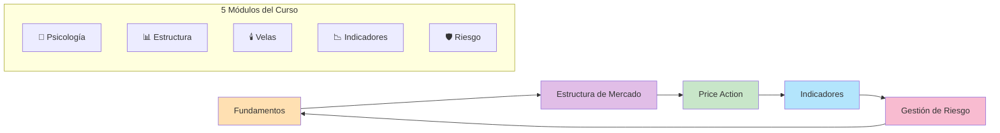
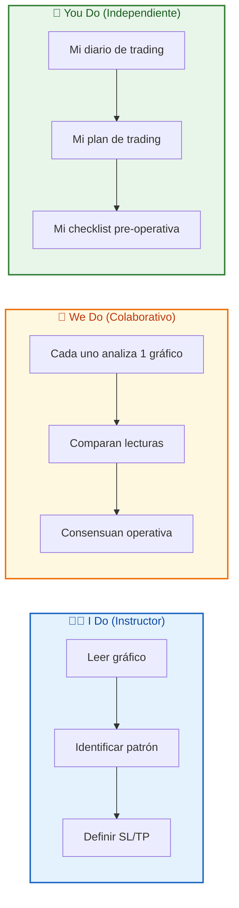

# MASTERCLASS: Análisis Técnico de Mercados Financieros - Curso Práctico Completo 📈

## INTRODUCCIÓN: POR QUÉ ESTA MASTERCLASS ES DIFERENTE 🎯

El análisis técnico no es adivinación: es la interpretación del precio, el volumen y la psicología de masas para tomar decisiones objetivas. Esta guía cubre desde los fundamentos hasta la construcción de un plan de trading profesional, combinando teoría, patrones visuales y gestión de riesgo cuantitativa.

El objetivo no es "acertar siempre", sino **operar con probabilidades**, gestionando el riesgo antes de buscar la ganancia.

> **🎯 Objetivo de Aprendizaje** — Al final de esta guía, podrás leer un gráfico, identificar tendencias y patrones, aplicar indicadores, construir un plan de trading y registrar tu desempeño con un diario de trading.

> **⚠️ Advertencia profesional** — Este contenido es formativo. El trading conlleva riesgo financiero. Nunca operes con dinero que no estés dispuesto a perder. Practica primero en demo.

---

## 🗺️ MAPA DE LA MASTERCLASS 🧭

| 🧩 Fase | ❓ Pregunta que responde | 📤 Resultado principal |
|---------|------------------------|------------------------|
| **🧠 Psicología** | ¿Cómo controlar emociones y sesgos? | Disciplina operativa |
| **📊 Estructura** | ¿Cómo identificar tendencias y niveles clave? | Soportes, resistencias, canales |
| **🕯️ Price Action** | ¿Qué dicen las velas sobre el mercado? | Patrones de reversión/continuación |
| **📉 Indicadores** | ¿Cómo confirmar señales con datos? | RSI, MACD, medias, Fibonacci |
| **🛡️ Riesgo** | ¿Cómo sobrevivir a sequías y errores? | Plan de trading y gestión monetaria |

---

## 🧠 PARTE 1: FUNDAMENTOS Y PSICOLOGÍA OPERATIVA 🧠

### 1.1 ❓ PRETEST

¿Qué diferencia fundamental hay entre análisis técnico y análisis fundamental?

> Respuesta esperada: El técnico analiza precio/volumen/patrones; el fundamental analiza datos económicos/empresariales.
> Si acertás: camino rápido → andá al punto 7.

### 1.2 🎯 POR QUÉ + LOGRO

Importa porque **el análisis técnico es la herramienta para tomar decisiones objetivas en el corto/mediano plazo**. Sin fundamentos técnicos, operás por intuición o noticias. Vas a lograr **leer la acción del precio** y detectar oportunidades con criterio.

### 1.3 ⚡ VICTORIA RÁPIDA (<5 min)

Abrí cualquier gráfico (acciones, forex, cripto). Identificá: 1 tendencia, 1 soporte, 1 resistencia. Esa es tu primera lectura técnica.

### 1.4 💡 CONCEPTO

Analogía: El análisis técnico es como **leer el clima** — no necesitás saber la física de las nubes, solo observar patrones (nubes oscuras = lluvia, cielo despejado = sol). El precio es el clima, los patrones son las señales.

Definición: El análisis técnico estudia el comportamiento del mercado a través de gráficos de precio y volumen. Se basa en 3 premisas: 1) El precio lo descuenta todo, 2) El precio se mueve en tendencias, 3) La historia se repite.

### 1.5 👀 EJEMPLO RESUELTO

| Premisa | Interpretación | Aplicación |
|---------|----------------|------------|
| **Precio lo descuenta todo** | Toda la información disponible está en el precio | No necesitás noticias para operar |
| **Precio se mueve en tendencias** | Los movimientos tienen dirección | Comprar en tendencias alcistas, vender en bajistas |
| **Historia se repite** | Los patrones vuelven a aparecer | Identificar HCH, doble techo, etc. |

### 1.6 ⚠️ CONTRA-EJEMPLO / Error Típico

Error: Operar por noticias o "sensaciones" sin mirar el gráfico.

Corrección: Las noticias ya están descontadas en el precio. Si el gráfico no confirma la noticia, no operes. El precio es la última verdad del mercado.

### 1.7 🧪 PRÁCTICA

Elegí 1 activo (BTC, EUR/USD, AAPL). Mirá el gráfico en 1D y 4H. Identificá: tendencia, soporte más cercano, resistencia más cercana. Escribí 1 párrafo.

> Respuesta esperada / criterio: Deben mencionar dirección de la tendencia, niveles clave y volumen si es relevante. No necesitan acertar, solo leer el gráfico.

### 1.8 🔁 RECALL — Nivel Bloom: Comprender

¿Por qué el análisis técnico funciona si el precio "ya lo descuenta todo"?

### 1.9 📌 IDEA CLAVE

El precio es la suma de todas las opiniones del mercado: si aprendés a leerlo, no necesitás más información.

### 1.10 ✅ AUTO-CHEQUEO + SIGUIENTE

- [ ] Entiendo las 3 premisas del análisis técnico
- [ ] Leí 1 gráfico y identifiqué tendencia y niveles
- [ ] Sé por qué las noticias ya están en el precio

Siguiente: Psicología de trading y sesgos cognitivos.

---

## 🧠 PARTE 2: PSICOLOGÍA DE TRADING Y SESGOS 🧠

### 2.1 ❓ PRETEST

¿Qué sesgo cognitivo hace que un trader mantenga una posición perdedora esperando que "revise"?

> Respuesta esperada: Sesgo de confirmación o aversión a la pérdida.
> Si acertás: camino rápido → andá al punto 7.

### 2.2 🎯 POR QUÉ + LOGRO

Importa porque **el 90% del éxito en trading es psicológico**. La misma estrategia genera resultados completamente distintos según la disciplina del operador. Vas a lograr **identificar tus sesgos** y tomar decisiones basadas en reglas, no en emociones.

### 2.3 ⚡ VICTORIA RÁPIDA (<5 min)

Escribí 1 emoción que sentiste en tu última operación (miedo, euforia, frustración). Esa es tu primer paso para gestionarla.

### 2.4 💡 CONCEPTO

Analogía: La psicología de trading es como **manejar un auto de carrera** — el auto es tu estrategia, pero si te ponés nervioso y pisás el freno en la curva, chocas. No importa qué tan buen auto tengas, si no controlás tus emociones, no llegás a la meta.

Definición: La psicología de trading estudia cómo las emociones (miedo, euforia, avaricia) y los sesgos cognitivos (confirmación, disponibilidad, anclaje) afectan las decisiones. Los traders exitosos no son los que "sienten menos", sino los que tienen reglas y un diario para auditar sus decisiones.

### 2.5 👀 EJEMPLO RESUELTO

| Sesgo | Manifestación en Trading | Consecuencia | Solución |
|-------|--------------------------|--------------|----------|
| **Aversión a la pérdida** | Mantener posición perdedora "hasta que revierta" | Pérdida mayor | Stop loss obligatorio |
| **Sesgo de confirmación** | Buscar solo análisis que confirme mi posición | Ignorar señales contrarias | Diario de trading objetivo |
| **Efecto disposición** | Vender ganadores muy rápido, mantener perdedores | Ratio R:R invertido | Reglas claras de TP y SL |
| **FOMO (miedo a perder)** | Entrar en una operación después de que ya subió mucho | Entrada en resistencia | Paciencia y checklist |

### 2.6 ⚠️ CONTRA-EJEMPLO / Error Típico

Error: "Hoy me siento con suerte, voy a aumentar la posición".

Corrección: La suerte no es una estrategia. Si tu plan dice riesgo 1%, no lo cambies por una "corazonada". Las emociones son enemigas de la consistencia.

### 2.7 🧪 PRÁCTICA

Escribí tu diario de trading de la última semana: 3 operaciones, qué sentiste antes, durante y después. Identificá 1 sesgo que hayas sufrido.

> Respuesta esperada / criterio: Deben identificar al menos 1 sesgo con nombre. Ejemplo: "Entré en BTC porque todo el mundo hablaba de él → FOMO."

### 2.8 🔁 RECALL — Nivel Bloom: Analizar

¿Por qué un diario de trading es la herramienta más efectiva para combatir sesgos?

### 2.9 📌 IDEA CLAVE

No podés controlar el mercado, pero podés controlar tus decisiones. Un diario te muestra tus patrones emocionales para romperlos.

### 2.10 ✅ AUTO-CHEQUEO + SIGUIENTE

- [ ] Identifiqué 1 sesgo en mi trading pasado
- [ ] Escribí mi diario de la última semana
- [ ] Entiendo por qué la gestión emocional es más importante que la estrategia

Siguiente: Cómo estructurar un diario de trading profesional.

---

## 📓 PARTE 3: EL DIARIO DE TRADING 📓

### 3.1 ❓ PRETEST

¿Qué información mínima debe registrar un diario de trading para ser útil?

> Respuesta esperada: Fecha, activo, entrada, salida, SL, TP, resultado, lección.
> Si acertás: camino rápido → andá al punto 7.

### 3.2 🎯 POR QUÉ + LOGRO

Importa porque **lo que no se mide, no mejora**. Un diario de trading transforma operaciones aisladas en datos accionables. Vas a lograr **identificar tus fortalezas y debilidades** y ajustar tu estrategia con evidencia, no con intuiciones.

### 3.3 ⚡ VICTORIA RÁPIDA (<5 min)

Abrí una hoja de cálculo o bloc de notas. Escribí los encabezados: Fecha, Activo, Entrada, Salida, SL, TP, Resultado, Lección. Esa es la estructura mínima.

### 3.4 💡 CONCEPTO

Analogía: El diario de trading es como **el espejo del gimnasio** — te muestra cómo te movés, qué músculos usás y dónde tenés fallos. Sin espejo, entrenás a ciegas. Con espejo, corregís cada repetición.

Definición: El diario de trading es un registro estructurado de todas las operaciones, incluyendo: contexto de mercado, razones de entrada, gestión de riesgo, resultado y lección aprendida. Sirve para auditar el desempeño y mejorar la estrategia de forma continua.

### 3.5 👀 EJEMPLO RESUELTO

| Campo | Ejemplo |
|-------|---------|
| **Fecha** | 2026-10-05 |
| **Activo** | BTC/USDT |
| **Temporalidad** | 4H |
| **Entrada** | $62,000 |
| **SL** | $60,000 |
| **TP** | $68,000 |
| **Resultado** | Ganancia $300 (+6%) |
| **Lección** | Entrada en soporte confirmado por volumen. El retest dio seguridad. |
| **Emoción** | Confianza, sin FOMO |

### 3.6 ⚠️ CONTRA-EJEMPLO / Error Típico

Error: Registrar solo las operaciones ganadoras para "sentirse bien".

Corrección: Las operaciones perdedoras son las que más enseñan. Si solo registrás ganancias, tenés una visión distorsionada de tu desempeño. Registrá TODAS las operaciones, ganadoras y perdedoras.

### 3.7 🧪 PRÁCTICA

Creá tu diario de trading para las próximas 10 operaciones. Definí los campos que vas a registrar y comprometete a completarlo después de cada operación.

> Respuesta esperada / criterio: Debe incluir al menos: fecha, activo, entrada, SL, TP, resultado, lección. Ejemplo: "Campo 'Lección' es obligatorio: qué salió bien, qué salió mal."

### 3.8 🔁 RECALL — Nivel Bloom: Aplicar

¿Por qué el diario de trading es más útil que la experiencia "en bruto"?

### 3.9 📌 IDEA CLAVE

La experiencia sin registro es solo repetición. Con diario, cada operación se convierte en datos para mejorar.

### 3.10 ✅ AUTO-CHEQUEO + SIGUIENTE

- [ ] Creé la estructura de mi diario de trading
- [ ] Registré mis últimas 3 operaciones
- [ ] Entiendo por qué las pérdidas son más valiosas que las ganancias

Siguiente: Estructura de mercado y tendencias.

---

## 📊 PARTE 4: ESTRUCTURA DE MERCADO Y TENDENCIAS 📊

### 4.1 ❓ PRETEST

¿Cuáles son las 3 fases de una tendencia?

> Respuesta esperada: Acumulación, avance/distribución, reversión.
> Si acertás: camino rápido → andá al punto 7.

### 4.2 🎯 POR QUÉ + LOGRO

Importa porque **todo análisis técnico comienza por identificar la tendencia**. En una tendencia alcista, comprar es más probable que gane. En una bajista, vender. Operar contra la tendencia es como remar contra la corriente: posible, pero agotador. Vas a lograr **detectar la dirección del mercado** antes de buscar entradas.

### 4.3 ⚡ VICTORIA RÁPIDA (<5 min)

Abrí BTC/USDT en 1D. Dibujá una línea desde un mínimo relevante hasta un máximo. Esa es tu línea de tendencia. Si el precio está por encima, es alcista.

### 4.4 💡 CONCEPTO

Analogía: La tendencia es como **la corriente de un río** — si nadás a favor, avanzás rápido. Si nadás en contra, gastás energía y avanzás poco. Si nadás perpendicular, no avanzás ni retrocedés.

Definición: Una tendencia es la dirección general del precio durante un período. Alcista = máximos y mínimos ascendentes. Bajista = máximos y mínimos descendentes. Lateral = rango definido entre soporte y resistencia. Las líneas de tendencia conectan mínimos (alcista) o máximos (bajista) para trazar la dirección.

### 4.5 👀 EJEMPLO RESUELTO

| Tipo | Característica | Acción |
|------|----------------|--------|
| **Alcista** | Mínimos y máximos ascendentes | Comprar en retrocesos |
| **Bajista** | Mínimos y máximos descendentes | Vender en rebotes |
| **Lateral** | Rango entre soporte y resistencia | Comprar en bajo, vender en alto |
| **Cambio de tendencia** | Ruptura de línea de tendencia con volumen | Cerrar posición, buscar entrada opuesta |

### 4.6 ⚠️ CONTRA-EJEMPLO / Error Típico

Error: Comprar en una tendencia bajista "porque está barato".

Corrección: "Barato" puede volverse "más barato". En tendencia bajista, los rebotes son para vender, no para comprar. Esperá confirmación de cambio de tendencia.

### 4.7 🧪 PRÁCTICA

En un gráfico de tu activo preferido, trazá: 1 línea de tendencia alcista o bajista, 1 canal paralelo. Identificá la fase actual de la tendencia.

> Respuesta esperada / criterio: Deben conectar al menos 2-3 puntos. El canal debe tener 2 líneas paralelas. Ejemplo: "BTC en tendencia alcista, línea desde mínimo de junio, canal entre $58k y $70k."

### 4.8 🔁 RECALL — Nivel Bloom: Aplicar

¿Por qué operar a favor de la tendencia aumenta la probabilidad de éxito?

### 4.9 📌 IDEA CLAVE

La tendencia es tu aliada: si la respetás, el mercado te paga. Si la combatís, el mercado te cobra.

### 4.10 ✅ AUTO-CHEQUEO + SIGUIENTE

- [ ] Trazé 1 línea de tendencia en un gráfico real
- [ ] Identifiqué la fase actual de la tendencia
- [ ] Entiendo por qué operar a favor de la tendencia

Siguiente: Soportes y resistencias como zonas de oferta/demanda.

---

## 📐 PARTE 5: SOPORTES Y RESISTENCIAS COMO ZONAS 📐

### 5.1 ❓ PRETEST

¿Por qué es mejor marcar soportes y resistencias como zonas (rectángulos) y no como líneas finas?

> Respuesta esperada: Porque el precio se mueve dentro de zonas, no de niveles exactos. Una línea fina genera fakeouts.
> Si acertás: camino rápido → andá al punto 7.

### 5.2 🎯 POR QUÉ + LOGRO

Importa porque **los soportes y resistencias son los niveles donde se toman decisiones de entrada y salida**. Marcarlos como zonas evita entradas falsas por fakeouts. Vas a lograr **identificar zonas de alta probabilidad** con mayor precisión.

### 5.3 ⚡ VICTORIA RÁPIDA (<5 min)

En BTC/USDT 4H, marcá el último soporte donde el precio rebotó 3 veces. Dibujalo como un rectángulo de 100-200 pips de ancho. Esa es tu zona de soporte.

### 5.4 💡 CONCEPTO

Analogía: Un soporte es como **una zona de parada de autobús** — no es un punto exacto, es un área donde varios autobuses (órdenes de compra) se detienen. Si marcás solo un punto, el autobús puede pasarse de largo. Si marcás la zona, lo agarrás.

Definición: Un soporte es una zona de demanda donde la presión compradora supera a la vendedora. Una resistencia es una zona de oferta donde la presión vendedora supera a la compradora. Se trazan como rectángulos porque el precio opera dentro de rangos, no en niveles exactos. El cambio de rol (soporte roto → resistencia, y viceversa) confirma rupturas.

### 5.5 👀 EJEMPLO RESUELTO

| Tipo de Zona | Característica | Ejemplo en BTC |
|---------------|----------------|----------------|
| **Soporte fuerte** | Múltiples rebotes, alto volumen | $60,000 - $60,200 (3 rebotes confirmados) |
| **Resistencia fuerte** | Múltiples rechazos, alto volumen | $70,000 - $70,200 (3 rechazos con volumen) |
| **Zona débil** | 1 solo toque, bajo volumen | $65,000 (nivel psicológico sin historia) |
| **Cambio de rol** | Soporte roto → nueva resistencia | $70,000 resistido → roto → ahora resistencia en pullback |

### 5.6 ⚠️ CONTRA-EJEMPLO / Error Típico

Error: Trazar una línea fina y esperar que el precio la respete exactamente.

Corrección: El precio se mueve dentro de zonas. Usá rectángulos de 100-200 pips de ancho. Si la zona es muy delgada, expone a fakeouts.

### 5.7 🧪 PRÁCTICA

En un gráfico de ETH/USDT 4H, marcá 2 zonas: 1 soporte (rectángulo verde), 1 resistencia (rectángulo rojo). Definí el ancho de cada zona.

> Respuesta esperada / criterio: Deben ser rectángulos, no líneas. Ancho entre 100-200 pips. Ejemplo: "Soporte en $2,200-$2,250 (3 rebotes), resistencia en $2,500-$2,550 (2 rechazos)."

### 5.8 🔁 RECALL — Nivel Bloom: Aplicar

¿Por qué una zona de soporte es más confiable que un nivel de precio exacto?

### 5.9 📌 IDEA CLAVE

Una zona captura la intención del mercado; una línea fina captura solo un precio que probablemente nunca se toque.

### 5.10 ✅ AUTO-CHEQUEO + SIGUIENTE

- [ ] Marqué 2 zonas de soporte/resistencia como rectángulos
- [ ] Entiendo la regla de 2-3 toques para validar
- [ ] Entiendo el cambio de rol tras ruptura

Siguiente: Patrones chartistas de continuación y reversión.

---

## 📉 PARTE 6: PATRONES CHARTISTAS - CAMBIO Y CONTINUACIÓN 📉

### 6.1 ❓ PRETEST

¿Qué patrón chartista de reversión tiene 3 máximos, con el central más alto?

> Respuesta esperada: Hombro-Cabeza-Hombro (HCH).
> Si acertás: camino rápido → andá al punto 7.

### 6.2 🎯 POR QUÉ + LOGRO

Importa porque **los patrones chartistas son señales visuales de cambio o continuación de tendencia**. Identificarlos te permite anticipar movimientos con una relación riesgo/beneficio favorable. Vas a lograr **reconocer figuras clave** y operar con confirmación.

### 6.3 ⚡ VICTORIA RÁPIDA (<5 min)

Abrí un gráfico en TradingView. Activá la herramienta de Hombro-Cabeza-Hombro. Buscá 3 máximos con el central más alto. Esa es tu primera figura de reversión.

### 6.4 💡 CONCEPTO

Analogía: Los patrones chartistas son como **señales de tránsito** — algunos te dicen "alto, la tendencia cambia" (HCH, doble techo), otros te dican "seguí por este carril" (banderas, triángulos). Si aprendés a leer las señales, evitás accidentes.

Definición: Los patrones chartistas son figuras geométricas que se repiten en los gráficos. Los de reversión (HCH, doble techo, triple techo, doble suelo) indican cambio de tendencia. Los de continuación (banderas, banderines, triángulos, cuñas) indican que la tendencia actual seguirá después de una pausa.

### 6.5 👀 EJEMPLO RESUELTO

| Patrón | Tipo | Señal | Confirmación |
|--------|------|-------|--------------|
| **HCH** | Reversión bajista | Ruptura de línea de cuello | Volumen alto en ruptura |
| **Doble Techo** | Reversión bajista | Ruptura del mínimo entre los dos techos | Volumen creciente |
| **Triángulo Ascendente** | Continuación alcista | Ruptura de la resistencia horizontal | Volumen alto |
| **Bandera** | Continuación | Ruptura en dirección de la tendencia | Volumen confirma |

### 6.6 ⚠️ CONTRA-EJEMPLO / Error Típico

Error: Entrar en un patrón "porque se ve como HCH" sin esperar la ruptura de la línea de cuello.

Corrección: Un patrón no es válido hasta que el precio rompe la línea clave con volumen. Esperá la confirmación antes de operar.

### 6.7 🧪 PRÁCTICA

En un gráfico de 4H de tu activo, buscá 1 patrón de reversión y 1 de continuación. Dibujalos y definí: línea de ruptura, confirmación y objetivo.

> Respuesta esperada / criterio: Deben identificar el patrón correctamente y marcar la línea de ruptura. Ejemplo: "HCH con línea de cuello en $65,000, objetivo $60,000."

### 6.8 🔁 RECALL — Nivel Bloom: Aplicar

¿Por qué los patrones de continuación son más confiables que los de reversión?

### 6.9 📌 IDEA CLAVE

Un patrón sin confirmación es solo una forma: esperá la ruptura con volumen para operar.

### 6.10 ✅ AUTO-CHEQUEO + SIGUIENTE

- [ ] Identifiqué 1 HCH y 1 bandera en gráficos reales
- [ ] Entiendo la línea de ruptura y confirmación
- [ ] Sé diferenciar continuación de reversión

Siguiente: Rupturas (breakouts) y fakeouts.

---

## ✅ PARTE 7: RUPTURAS Y CONFIRMACIONES - BREAKOUT VS FAKEOUT ✅

### 7.1 ❓ PRETEST

¿Qué diferencia un breakout real de un fakeout?

> Respuesta esperada: El breakout real se confirma con volumen alto y cierre fuera del nivel; el fakeout se revierte rápidamente.
> Si acertás: camino rápido → andá al punto 7.

### 7.2 🎯 POR QUÉ + LOGRO

Importa porque **las rupturas son las señales más poderosas del análisis técnico**, pero también las más peligrosas si no se confirman. Un fakeout atrapa traders que entran apresuradamente. Vas a lograr **distinguir rupturas reales de falsas** y evitar entradas en momentos de alta volatilidad.

### 7.3 ⚡ VICTORIA RÁPIDA (<5 min)

Mirá el último intento de ruptura de resistencia en BTC. ¿El volumen fue alto? ¿El cierre del candle estuvo fuera del nivel? Esos son los 2 criterios clave.

### 7.4 💡 CONCEPTO

Analogía: Un breakout es como **saltar una valla** — si saltás con impulso (volumen alto), pasás del otro lado. Si saltás sin impulso (volumen bajo), tropezás y volvés a caer (fakeout).

Definición: Un breakout es la ruptura de un nivel de resistencia o soporte con volumen significativo y cierre confirmado. Un fakeout es una ruptura que se revierte rápidamente, atrapando traders que entraron en el movimiento. La confirmación requiere: volumen > 1.5x promedio, cierre fuera del nivel, y retest del nivel roto.

### 7.5 👀 EJEMPLO RESUELTO

| Escenario | Volumen | Candle | Confirmación | Interpretación |
|-----------|---------|--------|--------------|----------------|
| Breakout real | Alto (>1.5x) | Cierre por encima | Retest del nivel | Entrada posible |
| Fakeout | Bajo | Mecha arriba, cierre abajo | No hay retest | No entrar |
| Rebote en soporte | Alto | Candle verde largo | Cierre arriba | Entrada en largo |
| Perforación débil | Bajo | Mecha abajo, cierre arriba | Esperar | No entrar aún |

### 7.6 ⚠️ CONTRA-EJEMPLO / Error Típico

Error: Entrar en una ruptura "porque está subiendo" sin ver volumen ni esperar el cierre del candle.

Corrección: En mercados financieros, las rupturas falsas son comunes. Esperá un cierre confirmado por encima de la resistencia con volumen alto antes de entrar.

### 7.7 🧪 PRÁCTICA

Buscá una ruptura reciente en cualquier activo. Verificá: 1) Volumen, 2) Tipo de candle, 3) ¿Hubo retest? Clasificá como breakout real o fakeout.

> Respuesta esperada / criterio: Deben analizar volumen y cierre. Ejemplo: "Volumen 2x, cierre por encima de $70k → breakout real. Retest en $70,100 → confirmación."

### 7.8 🔁 RECALL — Nivel Bloom: Evaluar

¿Por qué el volumen es el mejor confirmador de un breakout?

### 7.9 📌 IDEA CLAVE

Un breakout sin volumen es solo un suspiro: no tiene fuerza para sostener el movimiento.

### 7.10 ✅ AUTO-CHEQUEO + SIGUIENTE

- [ ] Verifiqué 1 breakout reciente
- [ ] Confirmé con volumen y cierre
- [ ] Entiendo la diferencia breakout vs fakeout

Siguiente: Velas japonesas y price action.

---

## 🕯️ PARTE 8: VELAS JAPONESAS - PRICE ACTION PURO 🕯️

### 8.1 ❓ PRETEST

¿Qué representa el cuerpo de una vela japonesa?

> Respuesta esperada: La diferencia entre precio de apertura y cierre.
> Si acertás: camino rápido → andá al punto 7.

### 8.2 🎯 POR QUÉ + LOGRO

Importa porque **las velas japonesas son la representación gráfica de la lucha entre compradores y vendedores**. Cada vela cuenta una historia de fuerza, debilidad o indecisión. Vas a lograr **leer el price action** sin necesidad de indicadores.

### 8.3 ⚡ VICTORIA RÁPIDA (<5 min)

Abrí cualquier gráfico. Identificá: 1 vela con cuerpo verde grande, 1 vela con cuerpo rojo grande, 1 vela con mechas largas y cuerpo pequeño. Esa es la base de la lectura.

### 8.4 💡 CONCEPTO

Analogía: Una vela japonesa es como **una batalla entre dos ejércitos** — el cuerpo es el territorio ganado (apertura vs cierre), las mechas son los ataques fallidos. Si el cuerpo es verde, los compradores ganaron. Si es rojo, los vendedores ganaron. Si tiene mechas largas, hubo mucha pelea pero pocos cambios.

Definición: Cada vela japonesa tiene cuerpo (apertura y cierre), mecha superior (máximo) y mecha inferior (mínimo). Los patrones de una vela (doji, martillo, hombre colgado, estrella fugaz) indican indecisión o reversión. Los patrones de dos velas (envolvente, estrella de la mañana/atardecer, pauta penetrante) confirmán cambios de sentimiento.

### 8.5 👀 EJEMPLO RESUELTO

| Patrón | Estructura | Interpretación | Contexto |
|--------|------------|----------------|----------|
| **Doji** | Cuerpo mínimo, mechas largas | Indecisión, posible reversión | Después de tendencia alcista/bajista |
| **Martillo** | Cuerpo verde pequeño, mecha inferior larga | Reversión alcista en soporte | En zona de soporte confirmada |
| **Hombre colgado** | Cuerpo rojo pequeño, mecha superior larga | Reversión bajista en resistencia | En zona de resistencia confirmada |
| **Estrella fugaz** | Cuerpo pequeño, mecha superior larga | Reversión bajista en resistencia | Después de movimiento alcista |
| **Envolvente alcista** | Vela roja + vela verde que la envuelve | Fuerza compradora | En zona de soporte |
| **Estrella de la mañana** | Vela bajista + doji + vela alcista | Reversión alcista | En fondo de tendencia bajista |

### 8.6 ⚠️ CONTRA-EJEMPLO / Error Típico

Error: Interpretar un martillo en cualquier lado como señal de compra.

Corrección: Un martillo en una resistencia no es señal de compra, es señal de que los vendedores no pudieron mantener el control. El contexto (soporte/resistencia, tendencia) es obligatorio.

### 8.7 🧪 PRÁCTICA

En un gráfico de 4H, encontrá: 1 doji, 1 martillo, 1 envolvente alcista. Definí el contexto de cada uno (soporte, resistencia, tendencia).

> Respuesta esperada / criterio: Deben interpretar el patrón dentro del contexto. Ejemplo: "Martillo en soporte de $60k → probable rebote alcista."

### 8.8 🔁 RECALL — Nivel Bloom: Aplicar

¿Por qué una vela con cuerpo grande y mechas pequeñas indica fuerza direccional?

### 8.9 📌 IDEA CLAVE

Una vela es una foto de la batalla: el cuerpo muestra quién ganó, las mechas muestran quién peleó.

### 8.10 ✅ AUTO-CHEQUEO + SIGUIENTE

- [ ] Identifiqué 3 patrones de velas en un gráfico real
- [ ] Entiendo el contexto obligatorio para cada patrón
- [ ] Sé leer cuerpo, mechas y significado

Siguiente: RSI y divergencias.

---

## 📊 PARTE 10: RSI - SOBRECOMPRA, SOBREVENTA Y DIVERGENCIAS 📊

### 10.1 ❓ PRETEST

¿Qué niveles de RSI indican sobrecompra y sobreventa?

> Respuesta esperada: Sobrecompra >70, sobreventa <30.
> Si acertás: camino rápido → andá al punto 7.

### 10.2 🎯 POR QUÉ + LOGRO

Importa porque **el RSI mide la fuerza de un movimiento y detecta agotamiento**. Cuando el precio hace un máximo más alto pero el RSI hace un máximo más bajo, hay divergencia bajista: la tendencia se está debilitando. Vas a lograr **detectar reversiones antes de que el precio gire**.

### 10.3 ⚡ VICTORIA RÁPIDA (<5 min)

Abrí BTC/USDT en 4H. Activá RSI(14). Buscá un máximo del precio y comparalo con el máximo del RSI. Si el precio subió pero el RSI bajó, hay divergencia bajista.

### 10.4 💡 CONCEPTO

Analogía: El RSI es como **el velocímetro de un auto** — no te dice hacia dónde va, pero sí si está acelerando o frenando. Si el auto sube una colina (precio sube) pero el velocímetro baja (RSI baja), el motor se está agotando.

Definición: El RSI (Relative Strength Index) es un oscilador que mide la velocidad y magnitud de los cambios de precio. Valores >70 indican sobrecompra (posible reversión bajista), <30 sobreventa (posible reversión alcista). Las divergencias (precio y RSI en direcciones opuestas) son señales de cambio de tendencia más confiables que los niveles absolutos.

### 10.5 👀 EJEMPLO RESUELTO

| Señal | Precio | RSI | Interpretación |
|-------|--------|-----|----------------|
| Divergencia bajista | Máximo más alto | Máximo más bajo | Tendencia se debilita, posible venta |
| Divergencia alcista | Mínimo más bajo | Mínimo más alto | Tendencia se debilita, posible compra |
| Sobrecompra + divergencia bajista | Máximo más alto | >70 y bajando | Venta con confirmación |
| Sobreventa + divergencia alcista | Mínimo más bajo | <30 y subiendo | Compra con confirmación |

### 10.6 ⚠️ CONTRA-EJEMPLO / Error Típico

Error: Vender solo porque RSI > 70 sin confirmación de divergencia o patrón de vela.

Corrección: En tendencias alcistas fuertes, el RSI puede estar >70 por semanas sin revertir. La divergencia es más confiable que el nivel absoluto.

### 10.7 🧪 PRÁCTICA

En un gráfico de 4H, encontrá 1 divergencia bajista y 1 divergencia alcista. Definí: precios, niveles de RSI y qué señal daría.

> Respuesta esperada / criterio: Deben conectar precio y RSI en direcciones opuestas. Ejemplo: "Precio hizo máximo $70k, RSI hizo máximo más bajo → divergencia bajista → posible venta."

### 10.8 🔁 RECALL — Nivel Bloom: Analizar

¿Por qué una divergencia bajista es más confiable que RSI > 70 para predecir una reversión?

### 10.9 📌 IDEA CLAVE

El precio es el qué, el RSI es el cómo: si el precio sube pero el RSI baja, el movimiento está perdiendo fuerza.

### 10.10 ✅ AUTO-CHEQUEO + SIGUIENTE

- [ ] Identifiqué 1 divergencia bajista y 1 alcista
- [ ] Entiendo por qué la divergencia > nivel absoluto
- [ ] Sé usar RSI como confirmación, no como única señal

---

## 📉 PARTE 9: MEDIAS MÓVILES - FILTROS DE TENDENCIA 📉

### 9.1 ❓ PRETEST

¿Qué diferencia hay entre SMA y EMA?

> Respuesta esperada: SMA promedia todos los precios por igual; EMA da más peso a los precios recientes.
> Si acertás: camino rápido → andá al punto 7.

### 9.2 🎯 POR QUÉ + LOGRO

Importa porque **las medias móviles son los filtros de tendencia más usados en análisis técnico**. Eliminan el ruido del precio y te dicen si el mercado está alcista o bajista. Vas a lograr **usar medias móviles como soportes/resistencias dinámicas** y detectar cambios de tendencia con cruces.

### 9.3 ⚡ VICTORIA RÁPIDA (<5 min)

Abrí cualquier gráfico. Trazá EMA 20 y EMA 50. Si la EMA 20 está por encima de la EMA 50, la tendencia es alcista. Si está abajo, bajista.

### 9.4 💡 CONCEPTO

Analogía: Las medias móviles son como **la velocidad promedio de un auto** — no te dicen hacia dónde va, pero sí si está acelerando o frenando. Si la EMA 20 sube, el precio está acelerando al alza.

Definición: Una media móvil suaviza el precio para mostrar la tendencia. SMA (Simple Moving Average) promedia todos los precios por igual. EMA (Exponential Moving Average) da más peso a los precios recientes. Golden Cross (EMA 50 cruza hacia arriba EMA 200) = señal alcista. Death Cross (EMA 50 cruza hacia abajo EMA 200) = señal bajista.

### 9.5 👀 EJEMPLO RESUELTO

| Configuración | Interpretación | Acción |
|---------------|----------------|--------|
| Precio > EMA 20 > EMA 50 | Tendencia alcista fuerte | Comprar en retrocesos |
| Precio < EMA 20 < EMA 50 | Tendencia bajista fuerte | Vender en rebotes |
| EMA 20 cruza arriba EMA 50 | Golden Cross, posible cambio | Confirmar con volumen |
| EMA 20 cruza abajo EMA 50 | Death Cross, posible cambio | Confirmar con volumen |
| Precio rebota en EMA 20 | Soporte dinámico | Entrada en largo si hay confirmación |

### 9.6 ⚠️ CONTRA-EJEMPLO / Error Típico

Error: Usar medias móviles como único filtro para entrar.

Corrección: Las medias son filtros de tendencia, no señales de entrada. Combinalas con soportes/resistencias, volumen y patrones de velas para confirmar.

### 9.7 🧪 PRÁCTICA

En un gráfico de 4H, trazá EMA 20, EMA 50 y EMA 200. Definí: tendencia actual, soporte dinámico más cercano, y si hay cruce reciente.

> Respuesta esperada / criterio: Deben interpretar la posición relativa de las medias. Ejemplo: "EMA 20 > EMA 50 > EMA 200 → tendencia alcista fuerte. Precio rebota en EMA 20."

### 9.8 🔁 RECALL — Nivel Bloom: Aplicar

¿Por qué la EMA es más reactiva que la SMA para trading de corto plazo?

### 9.9 📌 IDEA CLAVE

Las medias móviles no predicen el futuro: filtran el ruido y te muestran la dirección del viento. No entres en contra de la corriente.

### 9.10 ✅ AUTO-CHEQUEO + SIGUIENTE

- [ ] Trazé EMA 20, 50 y 200 en un gráfico real
- [ ] Identifiqué tendencia por posición de medias
- [ ] Entiendo Golden Cross y Death Cross

Siguiente: RSI y divergencias.

---

## 📊 PARTE 10: RSI - SOBRECOMPRA, SOBREVENTA Y DIVERGENCIAS 📊

### 10.1 ❓ PRETEST

¿Qué niveles de RSI indican sobrecompra y sobreventa?

> Respuesta esperada: Sobrecompra >70, sobreventa <30.
> Si acertás: camino rápido → andá al punto 7.

### 10.2 🎯 POR QUÉ + LOGRO

Importa porque **el RSI mide la fuerza de un movimiento y detecta agotamiento**. Cuando el precio hace un máximo más alto pero el RSI hace un máximo más bajo, hay divergencia bajista: la tendencia se está debilitando. Vas a lograr **detectar reversiones antes de que el precio gire**.

### 10.3 ⚡ VICTORIA RÁPIDA (<5 min)

Abrí BTC/USDT en 4H. Activá RSI(14). Buscá un máximo del precio y comparalo con el máximo del RSI. Si el precio subió pero el RSI bajó, hay divergencia bajista.

### 10.4 💡 CONCEPTO

Analogía: El RSI es como **el velocímetro de un auto** — no te dice hacia dónde va, pero sí si está acelerando o frenando. Si el auto sube una colina (precio sube) pero el velocímetro baja (RSI baja), el motor se está agotando.

Definición: El RSI (Relative Strength Index) es un oscilador que mide la velocidad y magnitud de los cambios de precio. Valores >70 indican sobrecompra (posible reversión bajista), <30 sobreventa (posible reversión alcista). Las divergencias (precio y RSI en direcciones opuestas) son señales de cambio de tendencia más confiables que los niveles absolutos.

### 10.5 👀 EJEMPLO RESUELTO

| Señal | Precio | RSI | Interpretación |
|-------|--------|-----|----------------|
| Divergencia bajista | Máximo más alto | Máximo más bajo | Tendencia se debilita, posible venta |
| Divergencia alcista | Mínimo más bajo | Mínimo más alto | Tendencia se debilita, posible compra |
| Sobrecompra + divergencia bajista | Máximo más alto | >70 y bajando | Venta con confirmación |
| Sobreventa + divergencia alcista | Mínimo más bajo | <30 y subiendo | Compra con confirmación |

### 10.6 ⚠️ CONTRA-EJEMPLO / Error Típico

Error: Vender solo porque RSI > 70 sin confirmación de divergencia o patrón de vela.

Corrección: En tendencias alcistas fuertes, el RSI puede estar >70 por semanas sin revertir. La divergencia es más confiable que el nivel absoluto.

### 10.7 🧪 PRÁCTICA

En un gráfico de 4H, encontrá 1 divergencia bajista y 1 divergencia alcista. Definí: precios, niveles de RSI y qué señal daría.

> Respuesta esperada / criterio: Deben conectar precio y RSI en direcciones opuestas. Ejemplo: "Precio hizo máximo $70k, RSI hizo máximo más bajo → divergencia bajista → posible venta."

### 10.8 🔁 RECALL — Nivel Bloom: Analizar

¿Por qué una divergencia bajista es más confiable que RSI > 70 para predecir una reversión?

### 10.9 📌 IDEA CLAVE

El precio es el qué, el RSI es el cómo: si el precio sube pero el RSI baja, el movimiento está perdiendo fuerza.

### 10.10 ✅ AUTO-CHEQUEO + SIGUIENTE

- [ ] Identifiqué 1 divergencia bajista y 1 alcista
- [ ] Entiendo por qué la divergencia > nivel absoluto
- [ ] Sé usar RSI como confirmación, no como única señal

Siguiente: MACD y confirmación de impulso.

---

## 📉 PARTE 11: MACD - CONFIRMACIÓN DE IMPULSO 📉

### 11.1 ❓ PRETEST

¿Qué indica un cruce alcista de la línea MACD sobre la línea de señal?

> Respuesta esperada: Posible inicio de impulso alcista.
> Si acertás: camino rápido → andá al punto 7.

### 11.2 🎯 POR QUÉ + LOGRO

Importa porque **el MACD confirma la fuerza y dirección de una tendencia**. A diferencia del RSI, el MACD se basa en medias móviles y muestra el momentum con mayor claridad en tendencias fuertes. Vas a lograr **confirmar señales de entrada y salida** con un indicador que sigue el precio.

### 11.3 ⚡ VICTORIA RÁPIDA (<5 min)

Abrí cualquier gráfico. Activá MACD(12,26,9). Buscá un cruce de la línea MACD por encima de la línea de señal. Esa es una señal de posible impulso alcista.

### 11.4 💡 CONCEPTO

Analogía: El MACD es como **el tacómetro de un auto** — te muestra las revoluciones del motor. Si el tacómetro sube (MACD cruza hacia arriba), el auto está acelerando. Si baja (MACD cruza hacia abajo), está frenando. El histograma muestra la diferencia: si se hace más alto, la aceleración aumenta.

Definición: El MACD (Moving Average Convergence Divergence) muestra la relación entre dos medias móviles exponenciales (12 y 26). La línea MACD es la diferencia entre ambas. La línea de señal es una EMA de 9 períodos del MACD. Un cruce alcista (MACD > señal) indica posible impulso alcista. Un cruce bajista (MACD < señal) indica posible impulso bajista. El histograma muestra la divergencia entre ambas líneas.

### 11.5 👀 EJEMPLO RESUELTO

| Señal | Interpretación | Confirmación |
|-------|----------------|--------------|
| MACD cruza arriba de señal | Impulso alcista | Volumen alto, precio > EMA 20 |
| MACD cruza abajo de señal | Impulso bajista | Volumen alto, precio < EMA 20 |
| Histograma aumenta | Fuerza del movimiento aumenta | No vender en tendencia alcista |
| Histograma disminuye | Fuerza del movimiento disminuye | Posible agotamiento |
| Divergencia MACD/precio | Cambio de tendencia | Confirmar con patrón de vela |

### 11.6 ⚠️ CONTRA-EJEMPLO / Error Típico

Error: Vender solo porque el MACD cruzó abajo, sin confirmación de precio ni volumen.

Corrección: El MACD es un indicador de confirmación, no una señal aislada. Combiná con precio, volumen y soportes/resistencias.

### 11.7 🧪 PRÁCTICA

En un gráfico de 4H, encontrá 1 cruce alcista y 1 cruce bajista del MACD. Definí el contexto: tendencia, volumen y resultado posterior.

> Respuesta esperada / criterio: Deben describir el cruce y el contexto. Ejemplo: "Cruce alcista en soporte de $60k con volumen alto → impulso alcista confirmado."

### 11.8 🔁 RECALL — Nivel Bloom: Aplicar

¿Por qué el histograma del MACD es más útil que el cruce solo para medir la fuerza de una tendencia?

### 11.9 📌 IDEA CLAVE

El MACD no predice el futuro: confirma si el precio tiene fuerza detrás. Sin fuerza, cualquier movimiento es sospechoso.

### 11.10 ✅ AUTO-CHEQUEO + SIGUIENTE

- [ ] Identifiqué 1 cruce alcista y 1 bajista
- [ ] Entiendo el histograma como medidor de fuerza
- [ ] Sé combinar MACD con precio y volumen

Siguiente: Retrocesos de Fibonacci.

---

## 📐 PARTE 12: FIBONACCI - ZONAS DE CORRECCIÓN Y PROYECCIÓN 📐

### 12.1 ❓ PRETEST

¿Qué nivel de Fibonacci se usa habitualmente para buscar retrocesos de tendencia?

> Respuesta esperada: 61.8%.
> Si acertás: camino rápido → andá al punto 7.

### 12.2 🎯 POR QUÉ + LOGRO

Importa porque **los retrocesos de Fibonacci coinciden con zonas psicológicas de compra/venta**. En una tendencia alcista, el precio retrocede hasta el 38.2%, 50% o 61.8% y rebota. Esos niveles te dan entradas con mejor riesgo/beneficio. Vas a lograr **ubicar zonas de entrada objetivas** sin adivinar.

### 12.3 ⚡ VICTORIA RÁPIDA (<5 min)

En BTC/USDT 4H, medí desde el mínimo reciente hasta el máximo. Dibujá los niveles 38.2%, 50% y 61.8%. Esa es tu primera retracement de Fibonacci.

### 12.4 💡 CONCEPTO

Analogía: Fibonacci es como **medir la elasticidad de una goma** — sabés hasta dónde se estira antes de volver. Si la goma se estira hasta el 61.8%, ahí es donde más traders entran nuevamente.

Definición: Los retrocesos de Fibonacci son niveles horizontales que marcan zonas de corrección dentro de una tendencia. Se calculan desde un mínimo a un máximo (tendencia alcista) o desde un máximo a un mínimo (tendencia bajista). Los niveles clave son 38.2%, 50% y 61.8%. Las extensiones (127.2%, 161.8%, 261.8%) proyectan objetivos tras ruptura.

### 12.5 👀 EJEMPLO RESUELTO

| Nivel | Uso | Acción |
|-------|-----|--------|
| 38.2% | Retroceso conservador | Entrada alcista con SL debajo |
| 50% | Retroceso neutral | Entrada alcista con SL debajo |
| 61.8% | Retroceso agresivo | Entrada alcista con SL debajo |
| 161.8% | Extensión | Objetivo de take profit tras breakout |

### 12.6 ⚠️ CONTRA-EJEMPLO / Error Típico

Error: Usar Fibonacci en gráficos sin tendencia clara.

Corrección: Fibonacci funciona en tendencias, no en rangos laterales. Si no hay dirección clara, no hay retroceso que medir.

### 12.7 🧪 PRÁCTICA

En un gráfico de 4H con tendencia alcista, medí el retroceso de Fibonacci desde mínimo a máximo. Definí: entrada en 61.8%, SL debajo del mínimo, TP en 161.8%.

> Respuesta esperada / criterio: Deben calcular correctamente los niveles. Ejemplo: "Mínimo $60k, máximo $70k. Retroceso 61.8% = $64,000. Entrada en $64k, SL en $59k, TP en $81k."

### 12.8 🔁 RECALL — Nivel Bloom: Aplicar

¿Por qué el retroceso al 61.8% es más confiable que el 38.2% en tendencias fuertes?

### 12.9 📌 IDEA CLAVE

Fibonacci no predice el futuro: marca zonas donde el precio tiene mayor probabilidad de rebotar. Combiná con volumen y velas para confirmar.

### 12.10 ✅ AUTO-CHEQUEO + SIGUIENTE

- [ ] Medí retroceso de Fibonacci en 1 gráfico real
- [ ] Entiendo los niveles 38.2%, 50%, 61.8%
- [ ] Sé proyectar objetivos con extensiones

Siguiente: Volumen operativo.

---

## 📦 PARTE 13: VOLUMEN OPERATIVO - EL CONFIRMADOR FINAL 📦

### 13.1 ❓ PRETEST

¿Qué indica un breakout de resistencia con volumen muy alto?

> Respuesta esperada: Que la presión compradora es fuerte y el movimiento probablemente continúe.
> Si acertás: camino rápido → andá al punto 7.

### 13.2 🎯 POR QUÉ + LOGRO

Importa porque **el volumen es el combustible del precio**. Sin volumen, los movimientos son débiles y reversan fácilmente. El volumen confirma tendencias, rupturas y divergencias. Vas a lograr **usar el volumen como filtro definitivo** antes de entrar o salir.

### 13.3 ⚡ VICTORIA RÁPIDA (<5 min)

Abrí BTC/USDT en 4H. Activá el indicador de volumen. Compará el volumen del último breakout con el promedio de los últimos 20 candles. Si es 2x o más, es una señal fuerte.

### 13.4 💡 CONCEPTO

Analogía: El volumen es como **el viento que impulsa un barco** — si hay viento fuerte (volumen alto), el barco (precio) avanza rápido y en la dirección correcta. Si no hay viento (volumen bajo), el barco se queda quieto o se desvía.

Definición: El volumen operativo mide la cantidad de activos negociados en un período. En una tendencia alcista, el volumen aumenta en los movimientos alcistas y disminuye en los bajistas (confirmación). En una ruptura, volumen alto confirma el breakout; volumen bajo indica fakeout. Las divergencias de volumen (precio sube, volumen baja) advierten de agotamiento.

### 13.5 👀 EJEMPLO RESUELTO

| Escenario | Volumen | Interpretación |
|-----------|---------|----------------|
| Breakout + volumen alto | >1.5x promedio | Breakout real, entrada posible |
| Breakout + volumen bajo | <0.5x promedio | Fakeout probable, no entrar |
| Tendencia alcista + volumen creciente | Aumenta en verdes | Tendencia saludable |
| Tendencia alcista + volumen decreciente | Disminuye en verdes | Agotamiento, posible reversión |
| Divergencia: precio sube, volumen baja | Máximo precio, volumen mínimo | Venta con confirmación |

### 13.6 ⚠️ CONTRA-EJEMPLO / Error Típico

Error: Ignorar el volumen y operar solo por el precio.

Corrección: Un breakout sin volumen es como un auto sin nafta: se mueve un poco y se apaga. Esperá volumen alto para confirmar.

### 13.7 🧪 PRÁCTICA

En un gráfico de 4H, encontrá 1 breakout y 1 divergencia de volumen. Definí: volumen relativo (comparado con promedio) y qué señal da.

> Respuesta esperada / criterio: Deben comparar el volumen con el promedio de 20 candles. Ejemplo: "Breakout con volumen 2.5x promedio → confirmación. Divergencia: precio máximo, volumen mínimo → agotamiento."

### 13.8 🔁 RECALL — Nivel Bloom: Analizar

¿Por qué una divergencia de volumen (precio sube, volumen baja) es señal de agotamiento?

### 13.9 📌 IDEA CLAVE

El volumen es la voz del mercado: si habla fuerte, el precio se mueve. Si habla bajo, el precio dudará.

### 13.10 ✅ AUTO-CHEQUEO + SIGUIENTE

- [ ] Verifiqué volumen en 1 breakout reciente
- [ ] Identifiqué 1 divergencia de volumen
- [ ] Entiendo por qué volumen > precio en importancia

Siguiente: Gestión monetaria y position sizing.

---

## 🛡️ PARTE 14: GESTIÓN MONETARIA - PRESERVACIÓN DE CAPITAL 🛡️

### 14.1 ❓ PRETEST

¿Qué porcentaje de tu cuenta debés arriesgar como máximo por operación?

> Respuesta esperada: 1-2%.
> Si acertás: camino rápido → andá al punto 7.

### 14.2 🎯 POR QUÉ + LOGRO

Importa porque **el trading no se gana por acertar más, sino por perder menos cuando te equivocás**. Una mala gestión monetaria destruye cuentas incluso con estrategias ganadoras. Vas a lograr **diseñar un sistema de riesgo** que sobreviva meses de volatilidad extrema.

### 14.3 ⚡ VICTORIA RÁPIDA (<5 min)

Calculá: cuenta de $10,000, riesgo 1% por operación, stop loss a 2%. ¿Cuánto es tu riesgo máximo? → $100. ¿Qué tamaño de posición podés comprar? → $5,000.

### 14.4 💡 CONCEPTO

Analogía: La gestión monetaria es como **llevar un paracaídas** — no evita que te lances, pero define si sobrevivís al aterrizaje. Sin paracaídas, un pequeño error es fatal. Con paracaídas, podés equivocarte varias veces y seguir volando.

Definición: La gestión monetaria incluye: 1) Position sizing (qué % de la cuenta arriesgar por operación, típicamente 1-2%), 2) Control de apalancamiento (no usar más del 3-5x en trading), 3) Preservación de capital (no arriesgar más de lo permitido en una sola operación), 4) Drawdown máximo (límite de pérdida mensual aceptable, típicamente 5-10%).

### 14.5 👀 EJEMPLO RESUELTO

| Parámetro | Valor | Cálculo |
|-----------|-------|---------|
| Cuenta | $10,000 | — |
| Riesgo por operación | 1% = $100 | $10,000 × 0.01 |
| Stop loss | 2% del precio de entrada | Si entrás en $50, SL en $49 |
| Tamaño de posición | $5,000 | $100 / 0.02 = $5,000 |
| Apalancamiento máximo | 3x | No usar más de $15,000 en posición |
| Drawdown máximo mensual | 5% = $500 | Si llegás a -$500, parás de operar |

### 14.6 ⚠️ CONTRA-EJEMPLO / Error Típico

Error: "Pongo stop loss muy lejos porque no quiero que me saque" o usar apalancamiento 10x para "ganar más rápido".

Corrección: Un stop loss lejos aumenta la pérdida real. Si entrás en $50 y ponés SL en $45 (10%), arriesgás más de lo permitido. El apalancamiento amplifica ganancias y pérdidas: 10x significa que una caída del 10% te liquida la cuenta.

### 14.7 🧪 PRÁCTICA

Diseñá tu sistema de gestión monetaria: cuenta de $5,000, riesgo 1.5% por operación, SL 2%, apalancamiento máximo 3x. Calculá: riesgo por operación, tamaño de posición máximo y drawdown máximo mensual.

> Respuesta esperada / criterio: Deben calcular correctamente: riesgo $75, posición $3,750, drawdown $500. No deben usar apalancamiento excesivo.

### 14.8 🔁 RECALL — Nivel Bloom: Aplicar

¿Por qué el position sizing es más importante que la estrategia de entrada?

### 14.9 📌 IDEA CLAVE

Podés tener la mejor estrategia del mundo, pero si arriesgás 10% por operación, una racha de 10 pérdidas te liquida. Gestioná el riesgo primero, las ganancias llegan solas.

### 14.10 ✅ AUTO-CHEQUEO + SIGUIENTE

- [ ] Calculé mi riesgo por operación (1-2%)
- [ ] Entiendo el cálculo de position sizing
- [ ] Establecí mi límite de apalancamiento y drawdown

Siguiente: Ratio Riesgo/Beneficio.

---

## 📐 PARTE 15: RATIO RIESGO/BENEFICIO - LA MATEMÁTICA DEL TRADING 📐

### 15.1 ❓ PRETEST

¿Qué significa un ratio R:R de 1:3?

> Respuesta esperada: Arriesgar $1 para ganar $3.
> Si acertás: camino rápido → andá al punto 7.

### 15.2 🎯 POR QUÉ + LOGRO

Importa porque **el ratio R:R determina si tu estrategia es rentable incluso con baja tasa de acierto**. Con R:R 1:3, podés equivocarte 7 de 10 veces y still ganar dinero. Con R:R 1:1, necesitás acertar más del 50% para no perder. Vas a lograr **diseñar operaciones con probabilidades positivas**.

### 15.3 ⚡ VICTORIA RÁPIDA (<5 min)

Calculá: entrada $100, SL $98 (riesgo $2), TP $106 (beneficio $6). R:R = 2:6 = 1:3. Esa es una operación matemáticamente rentable.

### 15.4 💡 CONCEPTO

Analogía: El ratio R:R es como **jugar a cara o cruz** — si ganás $3 cuando sale cara y perdés $1 cuando sale cruz, podés perder 7 de 10 veces y still ganar dinero. El mercado no es azar, pero la lógica es la misma: necesitás que el premio sea mayor que el riesgo.

Definición: El ratio Riesgo/Beneficio (R:R) compara la cantidad que arriesgás (stop loss) con la cantidad que esperás ganar (take profit). Un R:R de 1:2 significa arriesgar $1 para ganar $2. Para que una estrategia sea rentable, el R:R mínimo recomendado es 1:1.5, idealmente 1:2 o 1:3.

### 15.5 👀 EJEMPLO RESUELTO

| R:R | Acierto necesario para no perder | Rentable con |
|-----|----------------------------------|--------------|
| 1:1 | 50% | 51% |
| 1:1.5 | 40% | 41% |
| 1:2 | 33% | 34% |
| 1:3 | 25% | 26% |

### 15.6 ⚠️ CONTRA-EJEMPLO / Error Típico

Error: Poner take profit muy cerca "para asegurar ganancia" y stop loss muy lejos "por si acaso".

Corrección: Si tu R:R es 1:0.5, necesitás acertar el 66% de las operaciones para no perder. Eso es muy difícil incluso para traders experimentados. Buscá R:R mínimo 1:2.

### 15.7 🧪 PRÁCTICA

Diseñá 1 operación: entrada $50, SL $49 (riesgo $1), TP $54 (beneficio $4). Calculá el R:R y el acierto mínimo para no perder.

> Respuesta esperada / criterio: R:R = 1:4. Acierto mínimo = 20%. Cualquier estrategia con R:R 1:4 y 40% de acierto es extremadamente rentable.

### 15.8 🔁 RECALL — Nivel Bloom: Aplicar

¿Por qué un R:R de 1:3 es mejor que 1:1 incluso con menor tasa de acierto?

### 15.9 📌 IDEA CLAVE

No necesitás acertar siempre: necesitás que el premio sea mayor que el riesgo. El R:R es la matemática que hace sostenible tu estrategia.

### 15.10 ✅ AUTO-CHEQUEO + SIGUIENTE

- [ ] Calculé R:R de 1 operación real
- [ ] Entiendo la relación R:R vs tasa de acierto
- [ ] Establecí mi R:R mínimo (1:2)

Siguiente: Plan de trading.

---

## 📋 PARTE 16: PLAN DE TRADING - REGLAS PARA OPERAR CON CONSISTENCIA 📋

### 16.1 ❓ PRETEST

¿Qué 3 elementos debe tener un plan de trading para ser ejecutable?

> Respuesta esperada: Reglas de entrada, reglas de gestión, reglas de salida.
> Si acertás: camino rápido → andá al punto 7.

### 16.2 🎯 POR QUÉ + LOGRO

Importa porque **un plan de trading elimina la discrecionalidad y las emociones**. Si tenés reglas escritas, no operás por FOMO, no mantenés pérdidas por esperanza y no cerrás ganancias antes de tiempo por miedo. Vas a lograr **ejecutar tu estrategia sin desviaciones**.

### 16.3 ⚡ VICTORIA RÁPIDA (<5 min)

Escribí 1 regla de entrada: "Entro en largo cuando: 1) tendencia 1D alcista, 2) precio retrocede a soporte en 4H, 3) RSI < 40, 4) volumen de compra aumenta." Esa es la base de tu plan.

### 16.4 💡 CONCEPTO

Analogía: El plan de trading es como **el menú de un restaurante** — si el menú dice "hamburguesa = pan, carne, queso", el cocinero no puede ponerle sushi. Tu plan define exactamente qué es una operación válida y qué no.

Definición: Un plan de trading es un documento escrito que define: 1) Reglas de entrada (condiciones exactas para entrar), 2) Reglas de gestión (stop loss, take profit, trailing stop), 3) Reglas de salida (cuándo cerrar una operación ganadora o perdedora), 4) Gestión de riesgo (%, apalancamiento, drawdown máximo), 5) Horario y activos a operar.

### 16.5 👀 EJEMPLO RESUELTO

| Regla | Condición |
|-------|-----------|
| **Entrada en largo** | Tendencia 1D alcista + precio en soporte 4H + RSI < 40 + volumen creciente |
| **Entrada en corto** | Tendencia 1D bajista + precio en resistencia 4H + RSI > 60 + volumen creciente |
| **Stop loss** | Debajo del soporte inmediato (largo) o encima de la resistencia (corto) |
| **Take profit** | Ratio R:R 1:3 o siguiente nivel de resistencia/soporte |
| **No operar** | Si drawdown mensual > 5%, si no hay confirmación de volumen |

### 16.6 ⚠️ CONTRA-EJEMPLO / Error Típico

Error: "Entro cuando siento que el precio va a subir".

Corrección: Las sensaciones no son estrategias. Si tu plan no está escrito, no existe. Escribilo y seguilo sin excepciones.

### 16.7 🧪 PRÁCTICA

Escribí tu plan de trading: 3 reglas de entrada, 1 regla de SL, 1 regla de TP, 1 regla de "no operar". Comprometete a seguirlo por 2 semanas.

> Respuesta esperada / criterio: Deben ser reglas concretas y medibles. Ejemplo: "No opero si el volumen es menor al 50% del promedio" es medible; "no opero si el mercado está raro" es subjetivo.

### 16.8 🔁 RECALL — Nivel Bloom: Crear

¿Por qué un plan de trading escrito es más efectivo que una estrategia mental?

### 16.9 📌 IDEA CLAVE

Un plan de trading no limita tu libertad: te libera de la tiranía de las emociones. Seguilo y el mercado te recompensa.

### 16.10 ✅ AUTO-CHEQUEO + SIGUIENTE

- [ ] Escribí mi plan de trading (entrada, gestión, salida)
- [ ] Definí mis reglas de "no operar"
- [ ] Comprometido a seguirlo 2 semanas sin excepciones

Siguiente: Preguntas de verificación y glosario.

---

## 🧩 PREGUNTAS DE VERIFICACIÓN 📝✅

1. **📊 Aplica**: En un gráfico de 4H, identificá: tendencia, línea de tendencia, soporte, resistencia, canal, patrón chartista, divergencia de RSI y volumen. Definí una operación con SL, TP y R:R.

2. **🔍 Analiza**: ¿Por qué el análisis técnico funciona si el precio "ya lo descuenta todo"? ¿Qué papel juega la psicología de masas?

3. **🛠️ Diseña**: Calculá una operación: cuenta $5,000, riesgo 1.5%, SL 2%, R:R 1:3. Definí: tamaño de posición, SL, TP y ganancia/pérdida.

4. **💭 Reflexiona**: ¿Por qué un plan de trading escrito es más efectivo que una estrategia mental? ¿Cómo influye el diario de trading en tu mejora continua?

5. **📅 Crea**: Diseñá tu rutina semanal: cuándo analizas 1D, cuándo buscas entradas en 4H, cuándo revisas posiciones y ajustás stops.

---

## 📖 GLOSARIO RÁPIDO 📚

| Término | Definición |
|---------|------------|
| **Análisis Técnico** | Estudio del precio y volumen para predecir movimientos futuros |
| **Price Action** | Lectura del precio sin indicadores adicionales |
| **Soporte** | Zona donde la demanda supera la oferta y el precio rebota |
| **Resistencia** | Zona donde la oferta supera la demanda y el precio es rechazado |
| **Breakout** | Ruptura de nivel con volumen significativo y cierre confirmado |
| **Fakeout** | Ruptura falsa que se revierte rápidamente |
| **Canal alcista** | Línea inferior por mínimos ascendentes, superior paralela |
| **Hombro-Cabeza-Hombro** | Patrón de reversión bajista con 3 máximos |
| **Martillo** | Vela de reversión alcista en soporte con mecha inferior larga |
| **Doji** | Vela de indecisión con cuerpo mínimo |
| **SMA** | Media móvil simple: promedio de precios |
| **EMA** | Media móvil exponencial: más peso a precios recientes |
| **Golden Cross** | EMA corta cruza arriba de EMA larga → señal alcista |
| **Death Cross** | EMA corta cruza abajo de EMA larga → señal bajista |
| **RSI** | Oscilador de fuerza relativa: >70 sobrecompra, <30 sobreventa |
| **MACD** | Convergencia/divergencia de medias: cruces indican impulso |
| **Fibonacci** | Retrocesos 38.2%, 50%, 61.8% y extensiones 161.8% |
| **Volumen** | Cantidad de activos negociados: confirma movimientos |
| **R:R** | Ratio Riesgo/Beneficio: relación entre lo arriesgado y lo ganado |
| **Position Sizing** | Cálculo del tamaño de posición según % de riesgo |
| **Stop Loss** | Nivel donde se cierra la operación para limitar pérdidas |
| **Take Profit** | Nivel donde se toma ganancia |
| **Plan de Trading** | Reglas escritas de entrada, gestión y salida |
| **Diario de Trading** | Registro estructurado de operaciones para auditoría |
| **Sesgo de confirmación** | Buscar solo información que confirme mi posición |
| **FOMO** | Miedo a perder: entrar apresuradamente en movimientos ya avanzados |

---

## 🎓 NOTAS FINALES 🎓✨

El análisis técnico no es una ciencia exacta, es una **metodología probabilística**. No existen garantías, pero existes reglas que aumentan tus probabilidades de éxito. La clave no es acertar siempre, es gestionar el riesgo cuando te equivocás y maximizar la ganancia cuando acertás.

Recuerda:
1. **🧠 Psicología primero** — el 90% del éxito es disciplina emocional
2. **📊 Estructura antes que indicadores** — sin tendencia y niveles, los indicadores son ruido
3. **✅ Confirma siempre** — volumen + patrón + indicador = señal válida
4. **🛡️ Gestioná riesgo** — 1-2% por operación, R:R mínimo 1:2
5. **📓 Registrá todo** — el diario de trading es tu mejor maestro
6. **📋 Seguí tu plan** — sin excepciones, sin emociones
7. **📈 Aprendé de los errores** — cada pérdida es un dato para mejorar

> **🌟 Mensaje final**: El mercado siempre está ahí. No tenés que correr detrás de cada movimiento. Esperá tu setup, confirmá con volumen y criterios, ejecutá con disciplina y dejá que el R:R haga el trabajo. La consistencia viene del proceso, no de la operación individual.

---

**Creado con propósito educativo. El trading conlleva riesgo financiero. Nunca operes con dinero que no estés dispuesto a perder. Practica primero en demo.**

📈✨