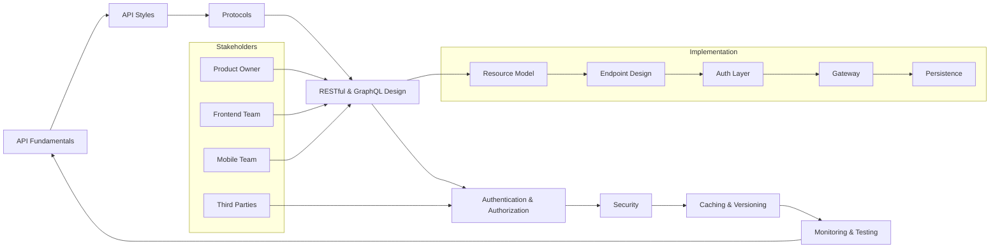
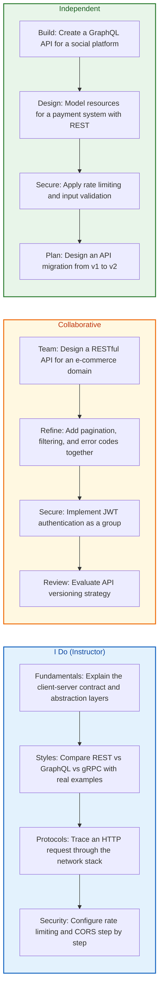
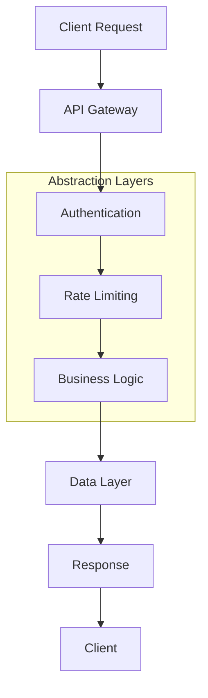
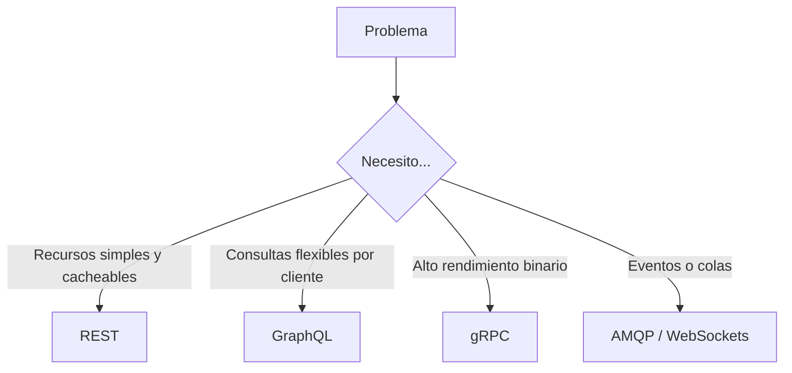
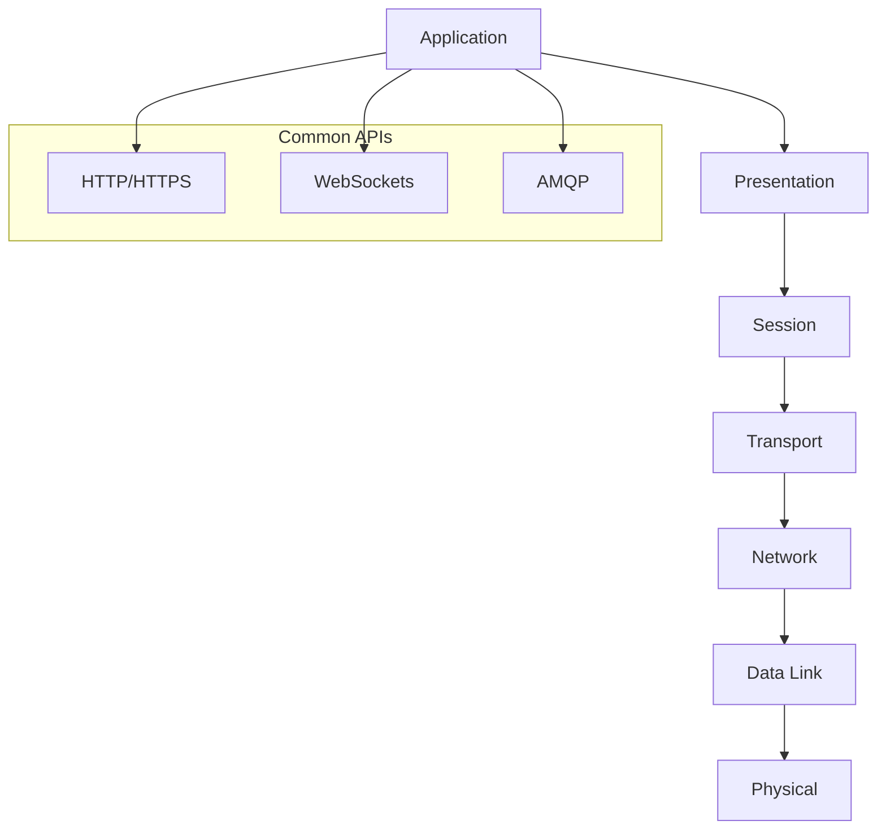
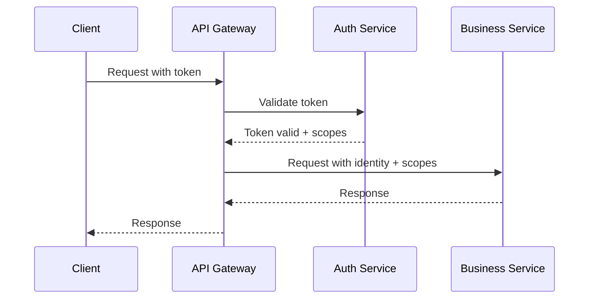

## ¿Qué vas a aprender

En este contenido desarrollarás una visión integral de la seguridad informática:

- Los vectores de ataque más comunes y cómo prevenirlos
- Autenticación, autorización y gestión de sesiones seguras
- Seguridad en APIs, validación de entradas y protección contra inyecciones
- Cifrado, gestión de secretos y cumplimiento normativo
- Monitorización, respuesta a incidentes y cultura de seguridad


# MASTERCLASS: Diseño de APIs - De Junior a Senior Engineer

## INTRODUCCIÓN: POR QUÉ ESTE MASTERCLASS ES DIFERENTE

La mayoría de los desarrolladores junior aprenden a crear endpoints, pero pocos aprenden a diseñar sistemas de comunicación que escalen, se mantengan y protejan los datos correctamente. Un endpoint es una función. Una API es un contrato. La diferencia entre un junior y un senior no está en escribir código; está en pensar en los consumidores, en la evolución del sistema, en la seguridad y en la eficiencia del protocolo.

Este masterclass propone un camino sistemático para diseñar APIs que sobrevivan a múltiples versiones, clientes heterogéneos y cambios de régimen de tráfico. Verás estilos arquitectónicos, protocolos de red, técnicas de modelado, autenticación, autorización y protección contra amenazas comunes.

> **Objetivo de Aprendizaje** — Al final de esta guía, podrás elegir el estilo de API correcto para cada problema, diseñar recursos limpios, implementar seguridad robusta y explicar tus decisiones con criterio arquitectónico.

> **Advertencia** — Este contenido es educativo. Las implementaciones mostradas son patrones que debes adaptar a tu contexto, proveedor y normativa.

---

## MAPA DEL WORKFLOW DE DISEÑO DE APIs



| Fase | Pregunta que responde | Output principal |
|------|-----------------------|------------------|
| **API Fundamentals** | ¿Qué es una API y por qué importa el contrato? | Límites, abstracción y responsabilidades |
| **API Styles** | ¿Qué estilo se adapta a mi problema? | Decisión: REST, GraphQL, gRPC |
| **Protocols** | ¿Por dónde viaja la información? | HTTP, WebSockets, AMQP, TCP/UDP |
| **RESTful & GraphQL Design** | ¿Cómo organizo recursos, filtros y errores? | Especificación de endpoints |
| **Authentication & Authorization** | ¿Quién entra y qué puede hacer? | Modelo de acceso y tokens |
| **Security** | ¿Cómo protejo la API contra amenazas? | Rate limiting, CORS, validación |
| **Caching & Versioning** | ¿Cómo evoluciono sin romper clientes? | Estrategias de evolución |
| **Monitoring & Testing** | ¿Cómo sé que la API funciona? | Métricas, logs y contratos |



---

## PARTE 1: API FUNDAMENTALS — EL CONTRATO CLIENTE-SERVIDOR

### 1.1 Principio Central

Una API es un contrato explícito entre un cliente y un servidor. El servidor promete exponer cierta funcionalidad bajo ciertas reglas, y el cliente promete usarla respetando esas reglas. Cuando ese contrato se rompe, ambos sistemas fallan.

El error más común del desarrollador junior es diseñar APIs alrededor de la implementación interna. El hábito del senior es diseñarlas alrededor de la experiencia del consumidor y la evolución futura.



### 1.2 Qué significa diseñar una API

| Principio | Definición | Implicación en diseño |
|-----------|------------|----------------------|
| **Abstracción** | Ocultar detalles internos del servidor | El cliente no conoce la base de datos ni la lógica de negocio |
| **Contrato explícito** | Documentar entradas, salidas y errores | OpenAPI, GraphQL schema o protobuf |
| **Statelessness** | Cada petición contiene toda la información necesaria | No hay sesión stored en el servidor |
| **Idempotencia** | Mismo input produce mismo output | `GET`, `PUT`, `DELETE` son seguros de reintentar |
| **Cacheabilidad** | Respuestas pueden almacenarse temporalmente | Headers `Cache-Control`, `ETag` |
| **Uniform interface** | Interfaz consistente y predecible | URLs limpias, verbos HTTP correctos, formatos estandarizados |

### 1.3 Criterios de un buen diseño de API

| Pregunta de diseño | Criterio senior |
|---------------------|-----------------|
| ¿Consume mi API desde un navegador? | HTTP, HTTPS, CORS, cookies o tokens |
| ¿Necesita tiempo real? | WebSockets, Server-Sent Events |
| ¿Es móvil? | Latencia, payload pequeño, offline support |
| ¿Hay múltiples consumidores? | Versionado, documentación, SDKs |
| ¿Debe ser pública? | OAuth2, rate limiting estricto, plan de monetización |
| ¿Es interna de la empresa? | Autenticación corporativa, logs estructurados |

---

## PARTE 2: API STYLES — REST, GRAPHQL Y GRPC

### 2.1 Por qué el estilo importa

No existe un estilo ganador universal. Cada estilo modela el problema de forma diferente y produce compensaciones distintas en rendimiento, flexibilidad y complejidad.

El rol senior es diagnosticar el problema antes de elegir la herramienta.



### 2.2 REST — Arquitectura basada en recursos

REST (Representational State Transfer) organiza la API alrededor de recursos identificables por URLs y manipulados mediante verbos HTTP.

| Característica | Detalle |
|----------------|---------|
| **Modelo** | Recursos con identificadores únicos |
| **Verbos** | `GET`, `POST`, `PUT`, `PATCH`, `DELETE` |
| **Formato** | JSON predominante, XML posible |
| **Stateless** | Cada petición es autónoma |
| **Cache** | HTTP cache nativo |

**Ejemplo de endpoints REST bien diseñados:**

```
GET    /api/v1/users              Lista paginada de usuarios
POST   /api/v1/users              Crea un usuario nuevo
GET    /api/v1/users/{id}         Obtiene un usuario específico
PATCH  /api/v1/users/{id}         Actualiza campos parciales
DELETE /api/v1/users/{id}         Elimina un usuario
GET    /api/v1/users?role=admin   Filtra por rol (query param)
GET    /api/v1/users?limit=20&offset=40  Paginación offset
```

### 2.3 GraphQL — Consultas especificadas por el cliente

GraphQL permite al cliente definir exactamente qué datos necesita en una sola petición, eliminando over-fetching y under-fetching.

| Característica | Detalle |
|----------------|---------|
| **Modelo** | Grafo de objetos y relaciones |
| **Operaciones** | `query`, `mutation`, `subscription` |
| **Payload** | Único endpoint, generalmente `/graphql` |
| **Tipado** | Schema estricto con tipos GraphQL |
| **Flexibilidad** | El cliente controla la forma del response |

**Ejemplo de query GraphQL:**

```graphql
query GetUserWithOrders($userId: ID!) {
  user(id: $userId) {
    id
    name
    email
    orders(limit: 5, status: ACTIVE) {
      id
      total
      createdAt
      items {
        product {
          name
          price
        }
        quantity
      }
    }
  }
}
```

### 2.4 gRPC — RPC de alto rendimiento

gRPC usa Protocol Buffers como formato binario y HTTP/2 como transporte. Ideal para comunicación interna entre microservicios.

| Característica | Detalle |
|----------------|---------|
| **Modelo** | Procedimientos remotos definidos en `.proto` |
| **Contrato** | Interface Definition Language (IDL) |
| **Serialización** | Protocol Buffers (binario) |
| **Transporte** | HTTP/2 |
| **Streaming** | Bidireccional |

**Ejemplo de servicio gRPC:**

```protobuf
service UserService {
  rpc GetUser (GetUserRequest) returns (UserResponse);
  rpc ListUsers (ListUsersRequest) returns (stream UserResponse);
}

message GetUserRequest {
  string id = 1;
}

message UserResponse {
  string id = 1;
  string name = 2;
  string email = 3;
  repeated Order orders = 4;
}
```

### 2.5 Tabla comparativa de estilos

| Criterio | REST | GraphQL | gRPC |
|----------|------|---------|------|
| **Curva de aprendizaje** | Baja | Media | Alta |
| **Cacheabilidad** | Excelente | Compleja | Limitada |
| **Flexibilidad de consulta** | Media | Alta | Baja |
| **Rendimiento** | Bueno | Medio | Excelente |
| **Tooling** | Amplio | Medio | Especializado |
| **Mejor para** | APIs públicas, móviles, integraciones | Clientes web complejos, múltiples entidades | Microservicios internos, streaming |

---

## PARTE 3: PROTOCOLS — LA CAPA DE TRANSPORTE Y APLICACIÓN

### 3.1 Por qué los protocolos importan

Un desarrollador junior elige un framework y funciona. Un senior entiende qué sucede en cada capa de red y elige protocolos según las necesidades de latencia, confiabilidad y throughput.



### 3.2 HTTP/HTTPS — El protocolo de la web

HTTP es el lenguaje universal de las APIs web. HTTPS añade cifrado TLS, autenticación del servidor e integridad de datos.

| Característica | HTTP | HTTPS |
|----------------|------|-------|
| **Transporte** | TCP | TCP + TLS |
| **Cifrado** | Ninguno | TLS 1.2 o 1.3 |
| **Puerto** | 80 | 443 |
| **Certificado** | No requerido | Requerido (CA confiable) |

**Códigos de estado esenciales:**

| Código | Significado | Uso en API |
|--------|-------------|------------|
| `200 OK` | Éxito | GET exitoso, actualización |
| `201 Created` | Recurso creado | POST exitoso |
| `204 No Content` | Sin cuerpo | DELETE exitoso |
| `400 Bad Request` | Error del cliente | Validación fallida |
| `401 Unauthorized` | No autenticado | Token faltante o inválido |
| `403 Forbidden` | Autenticado pero sin permiso | RBAC denegando acceso |
| `404 Not Found` | Recurso inexistente | ID incorrecto o eliminado |
| `429 Too Many Requests` | Rate limit excedido | Demasiadas peticiones |
| `500 Internal Server Error` | Error del servidor | Excepción no manejada |
| `503 Service Unavailable` | Servidor no disponible | Mantenimiento o sobrecarga |

### 3.3 WebSockets — Comunicación en tiempo real

WebSockets establecen un canal bidireccional persistente sobre una conexión TCP, ideal para actualizaciones en vivo, chat, notificaciones y trading.

| Característica | Detalle |
|----------------|---------|
| **Handshake** | HTTP Upgrade a `Upgrade: websocket` |
| **Persistencia** | Conexión mantenida mientras ambos extremos lo deseen |
| **Dirección** | Full-duplex: cliente y servidor pueden enviar en cualquier momento |
| **Latencia** | Muy baja después del establecimiento |
| **Uso típico** | chats, dashboards, juegos, trading |

**Ejemplo de flujo WebSocket:**

```
Cliente                      Servidor
  |                            |
  |-- GET /ws HTTP/1.1 ------->|  (Request con Upgrade)
  |   Upgrade: websocket        |
  |                            |
  |<-- 101 Switching Protocols -|  (Aceptación)
  |                            |
  |<-- Mensaje inicial ---------|
  |                            |
  |-- Mensaje de usuario ------>|
  |                            |
  |<-- Broadcast a todos -------|
  |                            |
```

### 3.4 AMQP — Mensajería asíncrona

AMQP (Advanced Message Queuing Protocol) es un protocolo de colas para desacoplar productores de consumidores. No es un protocolo de API directa, pero es fundamental en arquitecturas orientadas a eventos.

| Característica | Detalle |
|----------------|---------|
| **Modelo** | Colas, exchanges, bindings, routing keys |
| **Patrón** | Pub/Sub, colas de trabajo, RPC asíncrono |
| **Desacople** | Productor no conoce al consumidor |
| **Garantías** | At-least-once, at-most-once, exactly-once (depende del broker) |

**Componentes clave:**

| Componente | Función |
|------------|---------|
| **Exchange** | Recibe mensajes del productor y los enruta |
| **Queue** | Buffer donde esperan los mensajes |
| **Binding** | Regla que conecta exchange con queue |
| **Consumer** | Toma mensajes de la queue y los procesa |

### 3.5 TCP vs UDP — Capa de transporte

| Característica | TCP | UDP |
|----------------|-----|-----|
| **Confiabilidad** | Garantizada (acks, retransmisiones) | Best-effort |
| **Orden** | Sí | No |
| **Overhead** | Alto | Bajo |
| **Latencia** | Mayor | Menor |
| **Uso típico** | HTTP, bases de datos, APIs | Streaming, DNS, gaming |
| **APIs sobre UDP** | QUIC, WebRTC | APIs de baja latencia |

> **📌 Idea clave** — La elección entre TCP y UDP depende de si prefieres asegurar que cada byte llegue (TCP) o minimizar la latencia aunque algo se pierda (UDP).

---

## PARTE 4: RESTFUL & GRAPHQL DESIGN — MODELADO Y BUENAS PRÁCTICAS

### 4.1 El modelo de recursos REST

El diseño REST exitoso depende de identificar correctamente los recursos y sus relaciones. Un recurso es cualquier cosa que pueda ser nombrada y direccionada.

**Jerarquía típica:**

```
/api/v1/organizations/{orgId}/projects/{projectId}/tasks/{taskId}
```

Cada nivel es un recurso con su propio identificador, endpoints y operaciones.

### 4.2 Naming conventions para URLs

| Regla | Correcto | Incorrecto |
|-------|----------|------------|
| Sustantivos plurales | `/users`, `/orders` | `/user`, `/order` |
| Minúsculas y guiones | `/shopping-carts` | `/ShoppingCarts` |
| Sin extensiones | `/users/123` | `/users/123.json` |
| Profundidad máxima | Máximo 3 niveles | `/a/b/c/d/e/f` |
| Query params para filtros | `/orders?status=pending` | `/orders/pending` |
| Verbos en métodos HTTP | `POST /orders` | `POST /orders/create` |

### 4.3 Filtrado, paginación y sorting

**Filtrado:**

```
GET /api/v1/products?category=electronics&price_min=100&price_max=500&in_stock=true
```

| Query param | Tipo | Uso |
|-------------|------|-----|
| `category` | String | Filtrar por categoría |
| `price_min`, `price_max` | Number | Rango de precios |
| `in_stock` | Boolean | Disponibilidad |
| `created_after` | Date | Fecha de corte |
| `search` | String | Búsqueda full-text |

**Paginación:**

| Estrategia | Ejemplo | Ventaja |
|------------|---------|---------|
| **Offset** | `?limit=20&offset=40` | Simple, funciona siempre |
| **Cursor** | `?cursor=eyJpZCI6MTIzfQ` | Estable con datos dinámicos |
| **Seek method** | `?after_id=100` | Eficiente para índices autoincrementales |

**Sorting:**

```
GET /api/v1/products?sort=-created_at,name
```

El prefijo `-` indica descendente. Sin prefijo es ascendente.

### 4.4 Manejo de errores estandarizado

Un API senior responde a errores con formato consistente y mensajes accionables.

```json
{
  "error": {
    "code": "VALIDATION_ERROR",
    "message": "Input validation failed",
    "details": [
      {
        "field": "email",
        "rule": "email_format",
        "message": "Invalid email format",
        "value": "not-an-email"
      },
      {
        "field": "age",
        "rule": "min_value",
        "message": "Must be at least 18",
        "value": 15
      }
    ],
    "request_id": "req_8a9c3f2e1b4d",
    "timestamp": "2026-06-26T13:00:00Z"
  }
}
```

**Códigos de error internos:**

| Código | Significado |
|--------|-------------|
| `VALIDATION_ERROR` | Datos de entrada inválidos |
| `NOT_FOUND` | Recurso no existe |
| `CONFLICT` | Estado inconsistente (ej: email duplicado) |
| `UNAUTHORIZED` | Token ausente o inválido |
| `FORBIDDEN` | Permisos insuficientes |
| `RATE_LIMIT_EXCEEDED` | Demasiadas peticiones |
| `INTERNAL_ERROR` | Error del servidor |

### 4.5 Versionado de APIs

| Estrategia | Ejemplo | Ventaja | Desventaja |
|------------|---------|---------|------------|
| **URI path** | `/api/v2/users` | Visible, simple | Rompe URLs |
| **Header** | `Accept: application/vnd.api+json; version=2` | No rompe URLs | Menos visible |
| **Query param** | `/users?version=2` | Flexible | Mezclable con otros params |

> **📌 Idea clave** — La versión debe ser una decisión empresarial, no técnica. Si un cambio rompe clientes existentes, es una nueva versión.

### 4.6 GraphQL: modelado de schemas

El schema GraphQL es el contrato. Define tipos, queries, mutations y subscriptions.

```graphql
type User {
  id: ID!
  name: String!
  email: String!
  role: Role!
  orders(filter: OrderFilter, pagination: Pagination): OrderConnection!
}

type Order {
  id: ID!
  total: Float!
  status: OrderStatus!
  items: [OrderItem!]!
}

enum Role {
  ADMIN
  USER
  GUEST
}

input OrderFilter {
  status: OrderStatus
  createdAfter: DateTime
}

type Pagination {
  first: Int
  after: String
}
```

**Buenas prácticas:**

| Regla | Justificación |
|-------|---------------|
| Nunca retornar `null` sin razón explícita | Tipo estricto obliga a manejar ausencia |
| Usar campos paginados para listas | Evita payloads masivos |
| Agrupar datos relacionados | Reduce peticiones HTTP |
| Versionar el schema cuando hay breaking changes | Permite migración progresiva |

---

## PARTE 5: AUTHENTICATION & AUTHORIZATION — QUIÉN ENTRA Y QUÉ PUEDE HACER

### 5.1 La transición: de Basic Auth a OAuth2

El error de diseño más caro en una API es mezclar autenticación (quién eres) con autorización (qué puedes hacer). Ambos conceptos deben resolverse en capas distintas.



### 5.2 Evolución de esquemas de autenticación

| Método | Cómo funciona | Cuándo usarlo | Limitaciones |
|--------|---------------|---------------|--------------|
| **Basic Auth** | Usuario y contraseña en Base64 | Prototipos internos | Credenciales en cada request |
| **API Keys** | Token estático | Servicios backend, scripts | No expiran, difícil revocar |
| **JWT** | Token firmado con claims | SPAs, móviles, servicios | Revocación compleja |
| **OAuth2** | Flujo de autorización delegada | Apps de terceros, SSO | Complejo de implementar |
| **mTLS** | Certificados mutuos | Microservicios internos | Gestión de certificados |

### 5.3 JWT en profundidad

Un JWT (JSON Web Token) es un objeto firmado que contiene claims sobre la identidad y los permisos del portador.

```json
{
  "header": {
    "alg": "RS256",
    "typ": "JWT"
  },
  "payload": {
    "sub": "user_123e4567",
    "name": "Ana Gómez",
    "role": "admin",
    "scope": ["read:orders", "write:products"],
    "iat": 1719475200,
    "exp": 1719561600,
    "iss": "https://auth.midominio.com"
  },
  "signature": "firmado-con-clave-privada..."
}
```

**Validación obligatoria:**

| Check | Razón |
|-------|-------|
| `exp` no ha expirado | Evitar tokens viejos |
| `iss` confiable | Evitar tokens de otros emisores |
| `aud` coincide | Evitar tokens replayed entre servicios |
| Firma válida | Evitar tokens alterados |
| `sub` presente | Identificar al usuario |

### 5.4 Modelos de autorización

| Modelo | Qué evalúa | Complejidad | Mejor para |
|---------|------------|-------------|------------|
| **RBAC** | Rol del usuario (admin, editor, viewer) | Baja | Equipos con roles bien definidos |
| **ABAC** | Atributos del usuario, recurso y contexto | Alta | Sistemas con reglas complejas (ej: "solo en horario laboral") |
| **ACL** | Lista explícita de qué usuario puede hacer qué recurso | Media | Sistemas pequeños o específicos |

### 5.5 Implementación de RBAC

```python
from enum import Enum
from functools import wraps

class Role(Enum):
    ADMIN = "admin"
    EDITOR = "editor"
    VIEWER = "viewer"

PERMISSIONS = {
    Role.ADMIN: {"read", "write", "delete", "manage_users"},
    Role.EDITOR: {"read", "write"},
    Role.VIEWER: {"read"},
}

def require_permission(permission: str):
    def decorator(func):
        @wraps(func)
        def wrapper(user, *args, **kwargs):
            user_perms = PERMISSIONS.get(user.role, set())
            if permission not in user_perms:
                raise PermissionError(f"Permission '{permission}' required")
            return func(user, *args, **kwargs)
        return wrapper
    return decorator

@require_permission("write")
def update_product(user, product_id, data):
    ...
```

### 5.6 Token refresh y sesiones

| Patrón | Descripción | Cuándo usarlo |
|--------|-------------|---------------|
| **Access token corto + Refresh token largo** | Access expira en minutos, refresh en días | SPAs y móviles |
| **Rotación de refresh tokens** | Cada uso genera uno nuevo | Aplicaciones de alta seguridad |
| **Storage seguro** | Cookies `HttpOnly` preferidas | Prevenir XSS |

---

## PARTE 6: SECURITY — PROTECCIÓN CONTRA AMENAZAS COMUNES

### 6.1 La mentalidad de seguridad por defecto

El desarrollador junior confía en el cliente. El senior asume que todo input es malicioso hasta demostrar lo contrario.

> **Ley de seguridad:** Nunca confíes en datos que cruzan la red.

### 6.2 Rate Limiting — Control de flujo

El rate limiting protege contra abuso, consumo excesivo de recursos y denial-of-service.

| Estrategia | Algoritmo | Característica |
|------------|-----------|----------------|
| **Token bucket** | Permite ráfagas y luego limita | Flexible, permite picos |
| **Leaky bucket** | Trata requests como líquido | Flujo constante |
| **Fixed window** | Conteo por intervalo fijo | Simple pero con边界效应 |
| **Sliding window** | Ventana móvil | Más preciso |

**Ejemplo de headers de respuesta:**

```
HTTP/1.1 429 Too Many Requests
RateLimit-Limit: 100
RateLimit-Remaining: 0
RateLimit-Reset: 1719475260
Retry-After: 60
```

### 6.3 CORS — Cross-Origin Resource Sharing

CORS es un mecanismo del navegador para permitir o denegar peticiones desde orígenes distintos.

**Configuración segura:**

```python
CORS(app, resources={
    r"/api/*": {
        "origins": ["https://app.midominio.com", "https://admin.midominio.com"],
        "methods": ["GET", "POST", "PATCH", "DELETE"],
        "allow_headers": ["Content-Type", "Authorization"],
        "expose_headers": ["RateLimit-Limit", "RateLimit-Remaining"],
        "max_age": 3600,
        "supports_credentials": True
    }
})
```

| Configuración | Riesgo |
|---------------|--------|
| `origins: *` | Permite cualquier sitio, peligroso con credenciales |
| `supports_credentials: true` + `origins: *` | **NUNCA** combinarlos |
| Orígenes específicos | Práctica recomendada |

### 6.4 Prevención de injection attacks

| Ataque | Vector | Mitigación |
|--------|--------|------------|
| **SQL Injection** | Input en queries SQL | ORMs, prepared statements |
| **NoSQL Injection** | Input en queries NoSQL | Validación estricta de tipado |
| **Command Injection** | Input en shell commands | Evitar exec, usar librerías seguras |
| **XSS** | Scripts en responses renderizados | Sanitización, CSP headers |
| **Path Traversal** | Rutas en file system | Normalizar y validar rutas absolutas |

**Protección contra SQL Injection:**

```python
# MAL: concatenación directa
query = f"SELECT * FROM users WHERE email = '{email}'"

# BIEN: parámetros preparados
query = "SELECT * FROM users WHERE email = %s"
cursor.execute(query, (email,))

# MEJOR: ORM
user = session.query(User).filter(User.email == email).first()
```

### 6.5 Validación de entrada

| Validación | Regla |
|------------|-------|
| Tipos estrictos | No confiar en coerción automática |
| Longitud máxima | Strings, arrays, payloads |
| Rango numérico | Mínimos y máximos razonables |
| Formato | Emails, URLs, fechas con esquemas |
| Listas permitidas | Enums para valores cerrados |
| Nulos y vacíos | Distinguir entre ausente y vacío |

### 6.6 Seguridad en APIs públicas

| Medida | Implementación |
|--------|---------------|
| HTTPS obligatorio | Redirigir HTTP a HTTPS |
| HSTS header | Fuerza HTTPS en navegadores |
| CSP header | Limita fuentes de scripts, estilos, imágenes |
| Content-Type estricto | Evitar sniffing de MIME types |
| Sin stack traces en responses | Errores genéricos al cliente |
| Logs estructurados | Registrar intentos fallidos |

---

## PARTE 7: CACHING Y VERSIONING — EVOLUCIÓN SIN DOLOR

### 7.1 Estrategias de cacheo

El cacheo correcto reduce carga de servidor y latencia. El cacheo incorrecto produce datos obsoletos.

| Estrategia | Nivel | Ejemplo |
|------------|-------|---------|
| **CDN** | Cercano al usuario | Archivos estáticos, imágenes |
| **Reverse proxy** | Servidor | Nginx, Varnish |
| **Application cache** | Backend | Redis, Memcached |
| **Client cache** | Navegador | `Cache-Control` headers |
| **HTTP conditional** | Intermedio | `ETag`, `If-None-Match` |

### 7.2 Headers de cacheo HTTP

| Header | Uso |
|--------|-----|
| `Cache-Control: no-store` | Datos sensibles, nunca cachear |
| `Cache-Control: private` | Solo cache del cliente |
| `Cache-Control: public` | Cache compartida permitida |
| `Cache-Control: max-age=3600` | Tiempo de vida en segundos |
| `ETag: "abc123"` | Validador de contenido |
| `Last-Modified` | Fecha de última modificación |
| `Vary: Accept-Encoding, Authorization` | Variantes diferenciadas |

---

## APPENDIX A — MATRIZ DE DECISIONES

```
Necesito una API...
├─ Para navegador con datos complejos ──► GraphQL o REST + overfetch controlado
├─ Para microservicios internos ────────► gRPC
├─ Para tiempo real (chat, gaming) ──────► WebSockets
├─ Para eventos desacoplados ────────────► AMQP o Kafka
├─ Para móvil con ancho limitado ────────► REST + GraphQL ligero
└─ Para terceros integradores ────────────► REST + OAuth2
```

---

## APPENDIX B — CHECKLIST DE CALIDAD DE API

| Bloque | Check |
|--------|-------|
| **Contrato** | Especificación documentada (OpenAPI, GraphQL schema, proto) |
| **Recursos** | Nombres en plural, URLs limpias, profundidad ≤ 3 |
| **Verbos HTTP** | `GET` lectura, `POST` creación, `PUT` reemplazo, `PATCH` actualización parcial, `DELETE` eliminación |
| **Paginación** | Implementada para listas grandes |
| **Filtrado** | Query params para filtros, sorting y búsqueda |
| **Errores** | Formato consistente con código, mensaje, detalles y request_id |
| **Versionado** | Estrategia definida desde el día 1 |
| **Autenticación** | JWT con expiración, refresh tokens, validación estricta |
| **Autorización** | RBAC, ABAC o ACL documentada |
| **Rate limiting** | Configurado con headers informativos |
| **CORS** | Orígenes explícitos, nunca `*` con credenciales |
| **Validación** | Esquemas estrictos en entrada |
| **Logs** | request_id, latencia, status code, usuario |
| **Métricas** | Latencia P50/P95/P99, tasa de error, throughput |

---

## PARTE 8: MONITORING Y TESTING — MEDICIÓN CONTINUA

### 8.1 Métricas clave de API

| Métrica | Objetivo | Alerta |
|---------|----------|--------|
| **Latencia P95** | Mayor al SLA | > 500ms |
| **Tasa de error** | Requests que retornan 4xx/5xx | > 1% |
| **Throughput** | Requests por segundo | Cambio > 50% |
| **Cache hit ratio** | Efectividad del cacheo | < 80% en endpoints cacheados |
| **Rate limit hits** | Consumidores al límite | Pico inusual |

### 8.2 Contrato testing

```python
# Esquema de validación de response
from pydantic import BaseModel

class UserResponse(BaseModel):
    id: str
    name: str
    email: str
    role: str

def test_get_user_returns_valid_schema():
    response = client.get("/api/v1/users/123", headers=auth_header)
    assert response.status_code == 200
    data = response.json()
    assert UserResponse.model_validate(data)
    assert data["role"] in ["admin", "user", "guest"]
```

### 8.3 Load testing conceptual

| Escenario | Objetivo |
|-----------|----------|
| **Spike test** | ¿La API sobrevive a una avalancha de tráfico? |
| **Stress test** | ¿Cuál es el punto de quiebre? |
| **Endurance test** | ¿Hay memory leaks en ejecución prolongada? |
| **Soak test** | ¿El rendimiento se degrada después de horas? |

---

## APPENDIX C — GLOSARIO RÁPIDO

| Término | Definición |
|---------|------------|
| **API** | Interfaz que define cómo un software se comunica con otro |
| **REST** | Arquitectura basada en recursos y verbos HTTP |
| **GraphQL** | Lenguaje de consultas especificadas por el cliente |
| **gRPC** | RPC de alto rendimiento sobre HTTP/2 con Protocol Buffers |
| **Endpoint** | URL que expone una operación específica de la API |
| **Payload** | Cuerpo de la petición o respuesta |
| **Stateless** | Sin estado almacenado en el servidor entre peticiones |
| **Idempotente** | Mismo input produce mismo output sin efectos secundarios adicionales |
| **Rate limiting** | Límite de peticiones por unidad de tiempo |
| **CORS** | Mecanismo para permitir peticiones desde otros orígenes |
| **JWT** | Token firmado que transporta claims de identidad |
| **RBAC** | Control de acceso basado en roles |
| **ABAC** | Control de acceso basado en atributos |
| **ACL** | Lista de control de acceso explícita |
| **WebSocket** | Canal bidireccional persistente sobre HTTP |
| **AMQP** | Protocolo de mensajería asíncrona con colas |
| **Caching** | Almacenamiento temporal de respuestas para reducir latencia |
| **OpenAPI** | Especificación estandarizada para documentar APIs REST |
| **SDK** | Kit de desarrollo que simplifica el uso de la API |

---

## PARTE 9: I DO / WE DO / YOU DO — EJERCICIOS PROGRESIVOS

### 9.1 I Do — Fundamentos de API

**Objetivo:** explicar por qué una URL como `/getUserById?id=123` es un diseño deficiente y cómo transformarla.

| Paso | Acción | Resultado esperado |
|------|--------|--------------------|
| 1 | Identificar el recurso | `User` es el recurso |
| 2 | Aplicar sustantivo plural | `/users` |
| 3 | Usar parámetro de path | `/users/{id}` |
| 4 | Seleccionar verbo HTTP | `GET` |
| 5 | Definir respuesta | 200 con cuerpo JSON del usuario |

### 9.2 We Do — Diseño de API REST para e-commerce

**Escenario:** necesitas exponer productos, carritos y órdenes.

| Recurso | Endpoints |
|---------|-----------|
| **Products** | `GET /products`, `GET /products/{id}`, `POST /products`, `PATCH /products/{id}` |
| **Cart** | `GET /cart`, `POST /cart/items`, `PATCH /cart/items/{id}`, `DELETE /cart/items/{id}` |
| **Orders** | `GET /orders`, `GET /orders/{id}`, `POST /orders` |
| **Search** | `GET /products?q=keyword&category=electronics&sort=-price` |

**Tarea colaborativa:** agrega filtrado, paginación y manejo de errores a cada endpoint.

### 9.3 You Do — Diseño de GraphQL API para red social

**Tarea:** crea el schema para una red social con usuarios, publicaciones, comentarios y likes.

Debes incluir:

- Tipos `User`, `Post`, `Comment`, `Like`
- Query para obtener un usuario con sus publicaciones
- Mutation para crear una publicación
- Paginación en listas de publicaciones
- Relaciones: usuario → publicaciones → comentarios → autor

| Criterio | Peso |
|----------|------|
| Normalización del schema | 25% |
| Uso de paginación | 20% |
| Manejo de nullabilidad | 20% |
| Query efficiency | 20% |
| Documentación del schema | 15% |

### 9.4 I Do — Configuración de seguridad

**Objetivo:** implementar rate limiting y CORS correctamente.

```python
from flask import Flask
from flask_limiter import Limiter
from flask_cors import CORS
from flask_jwt_extended import JWTManager

app = Flask(__name__)
app.config["JWT_SECRET_KEY"] = "supersecret"

limiter = Limiter(app, default_limits=["200 per day", "50 per hour"])
CORS(app, resources={r"/api/*": {"origins": ["https://app.midominio.com"]}})
JWTManager(app)

@app.route("/api/v1/data", methods=["GET"])
@limiter.limit("10 per minute")
@jwt_required()
def get_data():
    return {"data": "protegido"}
```

### 9.5 We Do — Diseño de sistema de permisos

**Escenario:** sistema de gestión de proyectos con roles Admin, Manager, Developer y Viewer.

| Rol | Puede |
|-----|-------|
| Admin | Todo |
| Manager | Crear proyectos, asignar desarrolladores, ver reports |
| Developer | Ver sus tareas, actualizar estado, comentar |
| Viewer | Solo lectura de proyectos asignados |

**Tarea colaborativa:** diseñar la capa de autorización usando RBAC y mapear cada endpoint a los permisos.

### 9.6 You Do — API versioning y migración

**Tarea:** diseña un plan de migración de una API v1 a v2.

- v1: `/api/v1/users` (obsoleto)
- v2: `/api/v2/users` (nuevo)

| Paso | Acción |
|------|--------|
| 1 | Lanzar v2 paralela a v1 |
| 2 | Mantener v1 con `Deprecation` header |
| 3 | Notificar a consumidores con adelanto |
| 4 | Ofrecer SDK actualizado |
| 5 | Medir adopción de v2 |
| 6 | Apagar v1 tras período de gracia |

---

## PARTE 10: CHECKLIST FINAL DEL DISEÑO DE APIs

| Bloque | Check |
|--------|-------|
| **Fundamentos** | Contrato documentado, boundaries claros, stateless |
| **Estilo** | REST, GraphQL o gRPC elegido según el problema |
| **Protocolo** | HTTP/HTTPS, WebSockets o AMQP seleccionado correctamente |
| **Recursos** | URLs limpias, sustantivos plurales, profundidad ≤ 3 |
| **Filtrado** | Query params documentados, paginación implementada |
| **Errores** | Formato consistente con código, mensaje y request_id |
| **Versionado** | Estrategia desde el día 1 |
| **Autenticación** | JWT o OAuth2 con validación estricta |
| **Autorización** | RBAC/ABAC/ACL implementada y probada |
| **Rate limiting** | Configurado con headers informativos |
| **CORS** | Orígenes explícitos, nunca `*` con credenciales |
| **Validación** | Esquemas estrictos en toda entrada |
| **Cache** | Headers apropiados por endpoint |
| **Monitoring** | Latencia, errores, throughput medidos |
| **Testing** | Contratos validados, integración y carga |

---

## PREGUNTAS DE VERIFICACIÓN

### Preguntas sobre Fundamentals

1. **Analiza**: ¿Por qué el statelessness es crítico en APIs escalables? ¿Qué sucede si almacenas sesión en el servidor?

2. **Compara**: REST y GraphQL resuelven el mismo problema de forma distinta. ¿Cuándo elegirías uno sobre el otro para un sistema de e-commerce?

### Preguntas sobre Diseño

3. **Diseña**: Crea la especificación de endpoints REST para un sistema de gestión de biblioteca (libros, autores, préstamos). Define URLs, verbos, filtros y códigos de error.

4. **Evalúa**: ¿Por qué `/api/getUser?id=1` es un mal diseño? Explica los tres errores principales.

### Preguntas sobre Protocolos

5. **Diagnostica**: Tu API de dashboard en tiempo actual muestra latencia alta. ¿Cómo determinas si el problema es HTTP, WebSockets o la base de datos?

6. **Compara**: TCP vs UDP para una API de trading de alta frecuencia. ¿Qué protocolo eliges y por qué?

### Preguntas sobre Seguridad

7. **Implementa**: Diseña la estrategia de JWT para una API móvil. Define expiración, refresh tokens y validación de claims.

8. **Evalúa**: ¿Por qué `Access-Control-Allow-Origin: *` combinado con `Access-Control-Allow-Credentials: true` es una vulnerabilidad crítica?

### Preguntas Integradoras

9. **Conecta**: Explica cómo el versionado de API se relaciona con el caching. ¿Qué headers cambian cuando versionas un endpoint?

10. **Diseña un sistema**: Arquitectura completa para una API de fintech que maneja transferencias. Define estilos por dominio, autenticación, rate limiting, monitoreo y estrategia de migración de versión.
