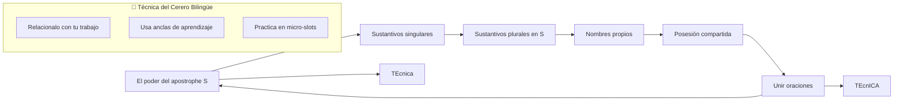
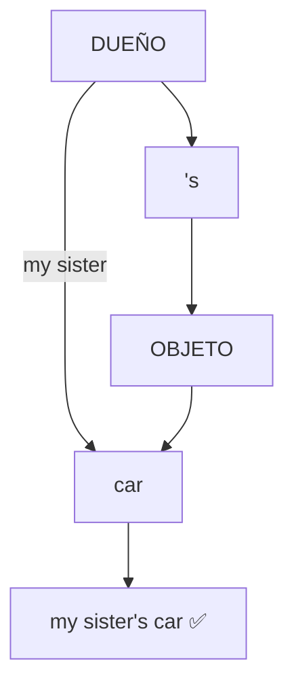
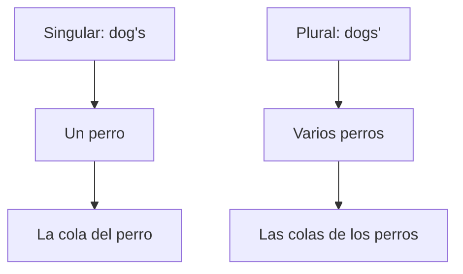
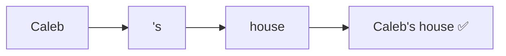
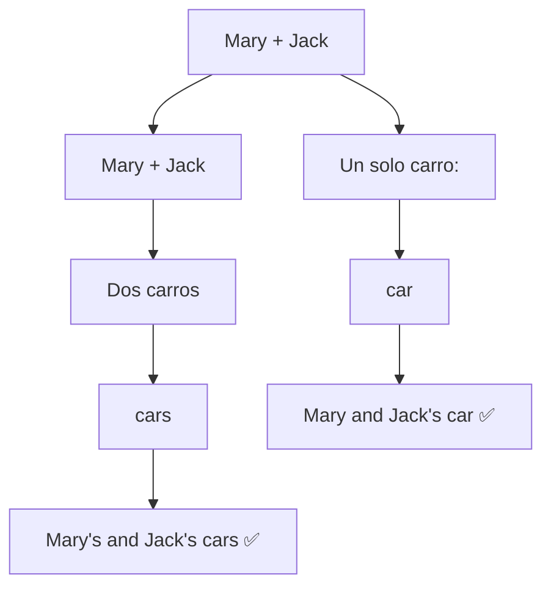

# MASTERCLASS: Apostrophe S en Inglés — Domina la Posesión desde Hoy 🔤🔗🥖🇬🇧

## INTRODUCCIÓN: POR QUÉ ESTE MASTERCLASS ES DIFERENTE 🎯🔥

> **🎯 Objetivo de Aprendizaje** — Al final de esta guía, sabrás usar el apostrophe S en inglés de forma natural: sustantivos singulares, plurales, nombres propios, posesión compartida y cómo unir oraciones simples. La diferencia entre "the car of my sister" y "my sister's car" cambia por completo tu fluidez.

> **⚠️ Advertencia educativa** — Este contenido es formativo. La gramática se aprende con práctica constante. No esperes perfección desde el día 1.

---

## MAPA DEL MASTERCLASS 🗺️🧭



| Paso | Pregunta | Herramienta |
|------|----------|-------------|
| **🔍 Entender** | ¿Por qué el apostrophe S es clave? | Comparación con español |
| **📋 Aprender** | ¿Cómo se aplica en cada caso? | Tablas + ejemplos |
| **⚡ Practicar** | ¿Cómo lo usas desde hoy? | I Do / We Do / You Do |
| **🔄 Repetir** | ¿Cómo la mente lo retiene? | Rutinas micro + anclas |

---

## PARTE 1: EL PODER DEL APOSTROPHE S — TU PASAPORTE A LA POSECIÓN 🚀🔗

### 1.1 El problema que te hace sonar "extranjero" 🤖🇪🇸

En español decís: *"el auto de mi hermana"*. En inglés, una traducción literal como *"the car of my sister"* suena **forzado** y **poco natural**. 🚗❌

Tu cerebro busca patrones. El patrón natural en inglés es:

```
[ Dueño ] + [ 's ] + [ Objeto ]
my sister + 's + car = my sister's car
```

> **⚡ La Verdad de PNL para el Aprendizaje** — La mente prefiere **patrones cortos y consistentes**. El apostrophe S es el patrón que tu cerebro necesita para sonar nativo.

### 1.2 El "momento cero" — la regla de oro 🔑🧠

| Estructura | Ejemplo | Traducción |
|-----------|---------|------------|
| **sustantivo + 's + sustantivo** | my sister's car | el auto de mi hermana |
| **NO usar "of"** | ❌ the car of my sister | Suena raro, como un turista |
| **El dueño va primero** | ✅ my sister's car | Orden natural en inglés |

> **🎯 La frase del profe** 🌟 — *"El apostrophe S no es una regla de gramática. Es un patrón de fluidez. Dominarlo es sonar inglés, no traducirlo."*

---

## PARTE 2: SUSTANTIVOS SINGULARES — LA BASE QUE TODO CERERO DEBE SABER 🥐📏

### 2.1 La fórmula mágica: un dueño, un objeto ✨🔮

Cuando un objeto pertenece a una sola persona o cosa, **agregás apostrophe + s** al sustantivo. 🧠✨

> **💡 Tip del cerero** — Piensa en tu horno: "el horno de la panadería". En inglés: "the bakery's oven". El horno pertenece a la panadería, un solo dueño.

| Ejemplo | Estructura | Traducción |
|---------|------------|------------|
| **My sister's car** | my sister + 's + car | El auto de mi hermana |
| **My teacher's house** | my teacher + 's + house | La casa de mi maestro |
| **The dog's tail** | the dog + 's + tail | La cola del perro |
| **The bakery's oven** | the bakery + 's + oven | El horno de la panadería |
| **The chef's knife** | the chef + 's + knife | El cuchillo del chef |



### 2.2 El error número 1 que todo cerero comete (y cómo evitarlo) 🚨🚫

> **❌ ERROR:** "The car of my sister is black" → **NO es natural** en inglés. Suena como si tradujeras del español.

> **✅ CORRECTO:** "My sister's car is black" → **Suena nativo**. El patrón dueño + 's + objeto es el orden natural.

> **⚡ Hack PNL #1** — Cada vez que veas "of my" o "of the", preguntate: "¿puedo usar apostrophe S?". Si el dueño es un sustantivo simple, la respuesta es casi siempre sí. 🔄

### 2.3 La pronunciación perfecta 🗣️🔊

El apostrophe S se pronuncia como una "ess" suave. 🧋

| Escrito | Pronunciación | Ejemplo auditivo |
|---------|---------------|------------------|
| sister's | **sister-ess** | "my sister-ess car" |
| dog's | **dog-ess** | "the dog-ess tail" |
| teacher's | **teacher-ess** | "my teacher-ess house" |

> **🎯 Tip del cerero** — Cuando amas la masa, decís: "the dough's texture". La "ess" suave al final. Practica diciendo: *"my sister's car"* = *"my sister-ess car"*. La "ess" es breve, como el sonido del horno al cerrarse la puerta. 🔥

---

## PARTE 3: SUSTANTIVOS PLURALES TERMINADOS EN S — LA EXCEPCIÓN INTELIGENTE 👥🔗

### 3.1 La regla de los plurales en S 📏👥

Cuando el sustantivo ya está en **plural y termina en S**, no agregues otra S. Solo el **apostrophe** después de la S. 🤯✨

> **⚡ Hack PNL #2** — La mente confunde "one dog" y "two dogs" cuando se usa el apostrophe S. La solución: **usa el contexto visual**. Imagina un perro, imagine dos perros. La imagen mantiene la distinción.

| Singular | Plural | Con apostrophe S | Traducción |
|----------|--------|------------------|------------|
| the dog's tail | 🔄 | the dog's tail | La cola **del** perro (uno) |
| the dogs' tails | 🔄 | the dogs' tails | Las colas **de los** perros (varios) |
| the teacher's desk | 🔄 | the teacher's desk | El escritorio **del** maestro (uno) |
| the teachers' desks | 🔄 | the teachers' desks | Los escritorios **de los** maestros (varios) |



### 3.2 Cómo distinguir "perro" de "perros" al hablar 🗣️👂

> **🎯 La Verdad de PNL** — Al oído, el singular y plural suenan similares. **La oración completa** es tu brújula. Prestá atención al verbo:

| Frase | Significado |
|-------|-------------|
| **The dog's tail is wagging** | Un perro — *cola* **es** movida |
| **The dogs' tails are wagging** | Varios perros — *colas* **son** movidas |

> **💡 Tip del cerero** — Cuando ves **one** (uno) piensa "apostrophe + s". Cuando ves **many** o una palabra plural, piensa "apostrophe después de la s". 🧠📊

---

## PARTE 4: NOMBRES PROPIOS — LA REGLA DE LOS JAMES Y CHARLES 🧔🔗

### 4.1 Nombres que no terminan en S ✅

Con nombres como **Caleb**, **Alex** o **María**, la regla es simple: agregás apostrophe + s. 🇪🇸🧋

| Nombre | Frase | Significado |
|--------|-------|-------------|
| **Caleb** | Caleb's house is big | La casa de Caleb es grande |
| **Alex** | Alex's dog is loyal | El perro de Alex es leal |
| **María** | María's bakery is famous | La panadería de María es famosa |



### 4.2 Nombres que terminan en S: dos caminos válidos 🛤️➡️🛣️

Con nombres como **James**, **Charles**, **Jess** o **Lucas**, tenés **dos opciones**: 🛤️ o 🛣️

| Nombre | Opción 1 | Opción 2 | Ambas válidas |
|--------|----------|----------|---------------|
| **James** | James' office | James's office | ✅ ✅ |
| **Charles** | Charles' car | Charles's car | ✅ ✅ |
| **Jess** | Jess' cat | Jess's cat | ✅ ✅ |
| **Lucas** | Lucas' store | Lucas's store | ✅ ✅ |

> **🧠 La Verdad de PNL** — Lo **escrito** puede variar. Lo **pronunciado** es lo que importa. Aunque escribás *James'*, **debés pronunciar la "ess" final**. 🔉

| Escrito | Pronunciación |
|---------|---------------|
| James' 📝 | James-ess 🗣️ |
| James's 📝 | James-ess 🗣️ |

> **🎯 Frase del profe** 🌟 — *"La escritura puede tener dos formas. La boca siempre pronuncia las dos 'ess'. Eso es lo que tu oyente entiende."*

### 4.3 El consejo del cerero 👨‍🍳🗣️

> **💡 Tip del cerero** — Cuando trabajes con nombres que terminan en S, **escribí siempre la "s" adicional**. Es más fácil de recordar: *James's* que *James'*. La consistencia vence la confusión. 🔄

---

## PARTE 5: POSECIÓN COMPARTIDA VS INDIVIDUAL — UN APOSTROPHE CAMBIA TODO 🔄👥

### 5.1 La diferencia que un "s" cambia por completo 🎯🔀

Cuando hay **dos o más personas** y un objeto, el lugar del apostrophe S **cambia el significado**. 🧠⚡

| Estructura | Ejemplo | Significado | Traducción |
|------------|---------|-------------|------------|
| **Dos nombres + 's + solo un objeto** | **Mary and Jack's** car is new | Un carro, **comparten** Mary y Jack | El auto que comparten Mary y Jack |
| **Dos nombres + 's + 's + varios objetos** | **Mary's and Jack's** cars are new | **Cada uno** tiene su auto | Los autos de Mary y Jack (separados) |



> **🚨 ¡OJO!** — La diferencia entre un "s" y dos "s" puede **transformar tu mensaje**. Un error cambia "comparten un auto" por "cada uno tiene su auto".

### 5.2 Ejemplos cotidianos para un cerero bilingüe 🥐🏠

| Situación | Compartido (uno) | Individual (cada uno) |
|-----------|------------------|----------------------|
| **Dos panaderos** | **Caleb and Lucas'** bakery is small | **Caleb's and Lucas's** bakeries are small |
| **Familia** | **Mom and Dad's** house is big | **Mom's and Dad's** houses are big |
| **Colegas** | **Anna and Tom's** project is due | **Anna's and Tom's** projects are due |

> **🧠 Hack PNL #3** — Asociá esto con tu panadería: si **dos cereros usan un solo horno**, decís "Caleb and Lucas' oven". Si **cada uno tiene su horno**, decís "Caleb's and Lucas's ovens". La lógica del horno te guía. 🍞🔥

---

## PARTE 6: UNIR ORACIONES CON APOSTROPHE S — TU SUPERPODER DE FLUENCIA 🌉🔗

### 6.1 La técnica: convivir dos frases con elegance 🎩🎭

La técnica PNL del "pattern matching" funciona igual: buscá el **patrón** y aplicá el mismo formato. 🔄

| Frase 1 | Frase 2 | Frase unida con 's |
|--------|--------|------------------|
| My mom has a dog | The dog is big | **My mom's dog** is big ✅ |
| Lucas has a car | The car is new | **Lucas's car** is new ✅ |
| Steve has a daughter | Ana has a daughter | **Steve's and Ana's daughters** are smart ✅ |

> **🎯 La Verdad de PNL** — Cada vez que veas "X has a Y" y "Y is Z", preguntate: "¿puedo unir con 's?". La respuesta es casi siempre sí, a menos que el dueño ya termine en S.

### 6.2 Los 3 patrones que debes memorizar 📋🔁

**Patrón 1: Un sujeto + 's + objeto** 🔄

```
My mom has a cat. The cat is black.
↓ Transformación ↓
My mom's cat is black. ✅
```

**Patrón 2: Nombre terminado en S + 's + objeto** 🔄

```
James has a car. The car is blue.
↓ Transformación ↓
James's car is blue. ✅  (o James' car is blue)
```

**Patrón 3: Dos sujetos + 's + 's + objeto + objeto** 🔄

```
Steve has a daughter. Ana has a daughter. The daughters are smart.
↓ Transformación ↓
Steve's and Ana's daughters are smart. ✅
```

> **⚡ Hack PNL #4** — La mente aprende por **repetición con variación**. Practica el mismo patrón con diferentes dueños cada vez:
> 1. "The bakery's bread is fresh"
> 2. "The chef's knife is sharp"
> 3. "The oven's temperature is 180°C"

---

## PARTE 7: EJERCICIOS PROGRESIVOS — I DO / WE DO / YOU DO 📈📚

### 7.1 I Do — El profe corrige 👨‍🏫✅

> **💡 Observá estos errores comunes y por qué son wrong:**

1. ❌ "The car of my sister is new" → ✅ "My sister's car is new"
2. ❌ "The dogs's tails are wagging" → ✅ "The dogs' tails are wagging"
3. ❌ "James' office" (sin pronunciar "ess") → ✅ "James's office" (pronunciar la "ess")
4. ❌ "Mary and Jack's cars are new" (cuando es un solo carro) → ✅ "Mary and Jack's car is new"

### 7.2 We Do — Trabajamos juntos 🤝

Transformá estas frases pasando de "of" a apostrophe S. Las respuestas las viste al final de esta sección. ✍️

| Nº | Frase original | Transformada |
|----|----------------|--------------|
| 1 | The recipe book of my grandmother | → ??? |
| 2 | The tail of the dogs | → ??? |
| 3 | The office of James | → ??? |
| 4 | The house of my parents | → ??? |
| 5 | The project of Anna and Tom (individual) | → ??? |

### 7.3 You Do — Te toca a vos 💪

**Tarea:** Escribí 5 frases usando apostrophe S. Usala para: una persona, un objeto que posee, un nombre propio, un nombre terminado en S, y una posesión compartida.

| Criterio | Frase que escribiste |
|----------|---------------------|
| 👤 Persona + posesión | |
| 📦 Objeto poseído | |
| 🧔 Nombre propio | |
| 🏷️ Nombre terminado en S | |
| 👥 Posesión compartida | |

| Criterio de evaluación | Peso |
|------------------------|------|
| ✅ Regla aplicada correctamente | 40% |
| ✅ Contexto adecuado | 30% |
| ✅ Pronunciación natural (si lo leés en voz alta) | 30% |

#### Soluciones del ejercicio We Do 🧐✅

1. **My grandmother's recipe book** ✅
2. **The dogs' tails** ✅
3. **James's office** (o James' office) ✅
4. **My parents' house** ✅
5. **Anna's and Tom's projects** ✅

---

## CHECKLIST FINAL: APOSTROPHE S DOMINADO ✅🎯📋

| Paso | Estado |
|------|--------|
| ✅ Entendiste la diferencia: "of" vs "'s" | ☐ |
| ✅ Aplicaste apostrophe + s a singular | ☐ |
| ✅ Usaste solo apostrophe en plural con S | ☐ |
| ✅ Manejaste nombres terminados en S | ☐ |
| ✅ Distinguiste posesión compartida de individual | ☐ |
| ✅ Uniste frases simples con "s | ☐ |
| ✅ Practicaste con 5 frases nuevas | ☐ |

---

## PREGUNTAS DE VERIFICACIÓN 📝❓✨

1. **📏 Define:** ¿Por qué "the car of my sister" suena raro en inglés? ¿Cuál es la estructura natural?
2. **🔍 Identifica:** En "the dogs' tails" vs "the dog's tail", ¿qué cambia? ¿Cómo lo sabés al oír?
3. **🔄 Reencuadra:** Si escribiste "James' office", ¿sonó como deberías al hablar? ¿Qué debés recordar?
4. **🧠 Aplica:** Transformá "The bakery of my friend" usando apostrophe S.
5. **🎯 Diseña:** Escriba una frase con posesión compartida (ej: dos cereros, un horno que comparten).
6. **🔗 Conecta:** Uní estas frases: "Lucas has a cat. The cat is white."
7. **💡 Creativa:** Inventá una frase usando tu panadería favorita + apostrophe S + un objeto.
8. **🗣️ Pronuncia:** Dite en voz alta "Mary's and Jack's daughters" tres veces. ¿Sentís la diferencia?

---

## GLOSARIO RÁPIDO 📚📖

| Término | Definición | Ejemplo |
|---------|------------|---------|
| **Apostrophe S** | ' + s para posesión | sister's |
| **Posesión individual** | Un dueño, un objeto | my sister's car |
| **Posesión compartida** | Múltiples dueños, un objeto | Mary and Jack's car |
| **Sustantivo plural en S** | Palabra que ya termina en s al plural | dogs |
| **Nombre propio** | Nombre de persona | Caleb, James |
| **Pattern matching** | Técnica PNL: buscar y aplicar patrones | Reconoce "of" → convierte a 's |

---

## ANEXO: FORMATO IDEAL PARA DOMAR EL APOSTROPHE S 🧠📄

### Recomendaciones de legibilidad 💼📏

```css
.article-content {
  font-size: 18px;
  line-height: 1.75;
  max-width: 65ch;
}
```

### Lo que hace agradable una guía de gramática al cerebro 🧠✨

- 🎯 **Comparaciones visuales** anclan conceptos abstractos a ejemplos concretos.
- 🔄 **Ejercicios progresivos** (I Do / We Do / You Do) construyen confianza escalonada.
- 📊 **Tablas comparativas** facilitan el contraste rápido entre casos.
- ⚡ **Micro-ejemplos del día a día** (panadería) conectan con tu contexto.
- 📋 **Checklist y glosario** permiten repaso rápido sin saturación.
- 🗣️ **Frases del profe** y tips de PNL mantienen la motivación activa.

> **🗣️ La frase del profe** 🌟 — *"El apostrophe S no es una regla de gramática. Es un patrón de fluidez. Dominarlo es sonar inglés, no traducirlo."*


