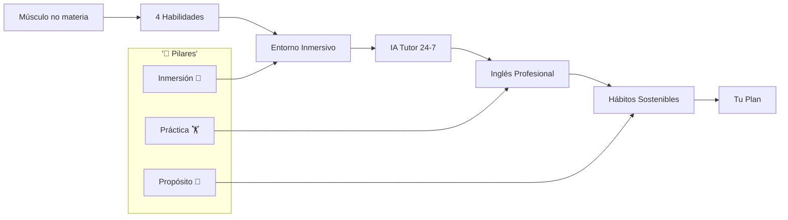
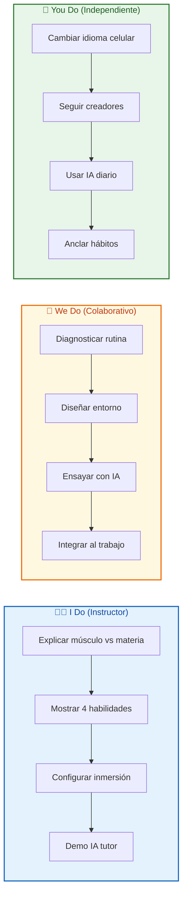
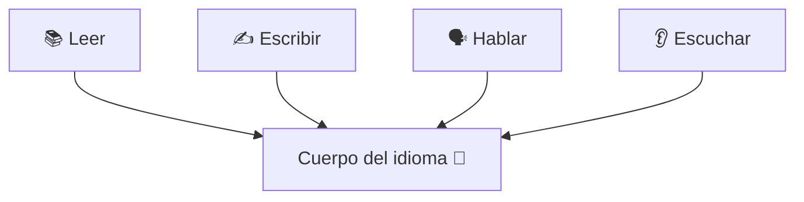
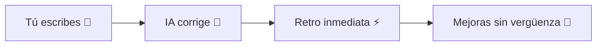
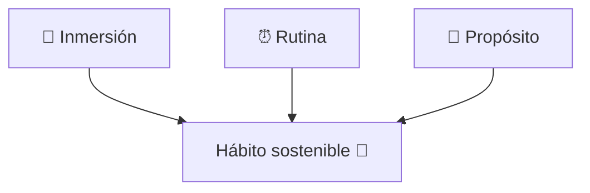

# MASTERCLASS: Aprender Inglés con Estrategia 🧠💪 — Músculo, no Materia ✨

## 📌 INTRODUCCIÓN: POR QUÉ ESTA MASTERCLASS ES DIFERENTE 🚀

Aprender inglés con estrategia significa **cambiar la perfección por el progreso** 🔄, integrando el idioma en tu rutina diaria, tu trabajo y tus metas personales. 🌟

Esta guía es para quienes quieren **dejar de estudiar para un examen** 📝 y empezar a usar el inglés como **herramienta real de vida** 🛠️.

La idea central es simple: tu nivel no lo define un título 🎓, lo define **qué tan bien te comunicas** 💬. Y para llegar ahí, necesitas un plan que combine **inmersión, práctica y propósito** 🎯.

> **🎯 Objetivo de Aprendizaje** — Al final de esta guía, podrás diseñar un entorno inmersivo, usar la IA como tutor 24/7, integrar el inglés a tu trabajo y sostener el progreso con hábitos claros.

> **⚠️ Nota educativa** — Este contenido es formativo. El inglés se entrena como habilidad; la constancia y el uso real importan más que la nota de un examen.

---

## 🗺️ MAPA DE LA MASTERCLASS 🧭



| 🧩 Fase | ❓ Pregunta que responde | 📤 Resultado principal |
|------|-----------------------|------------------|
| **Músculo no materia** | ¿Cómo se aprende? | Entrenamiento continuo |
| **4 Habilidades** | ¿Qué desarrollar? | Leer, escribir, hablar, escuchar |
| **Entorno inmersivo** | ¿Cómo exponerse? | Celular, podcasts, series, redes |
| **IA Tutor** | ¿Quién corrige? | Feedback 24/7 sin juicio |
| **Inglés pro** | ¿Dónde usarlo? | Ventas, código, CV, liderazgo |
| **Hábitos** | ¿Qué sostiene? | 3 anclas claras |



---

## 💡 PARTE 1: MÚSCULO, NO MATERIA 🏋️

### 1.1 🧠 Principio Central

Aprender inglés es como entrenar en el gimnasio 💪: cada sesión refuerza algo distinto, pero todo hace parte del **mismo cuerpo** 🧍. No es estudiar una materia para un examen, es desarrollar una capacidad viva.



### 1.2 ✅ Regla de Oro

> **✨ Idea clave** — Tu nivel lo define tu capacidad de **comunicarte**, no un certificado. Progreso > perfección. 📈

| 🎓 Mentalidad de examen | 🚀 Mentalidad de músculo |
|------------------------|--------------------------|
| Estudia para la prueba | Usa todos los días |
| Miedo al error ❌ | Error = repetición ✅ |
| Nota final | Comunicación real 💬 |

---

## 🔤 PARTE 2: LAS 4 HABILIDADES EN PARALELO 🧩

### 2.1 📊 No funcionan por separado

Leer, escribir, hablar y escuchar **se desarrollan en conjunto** 🔗. Cuando lees un artículo, entrenas vocabulario para hablar 🗣️. Cuando escuchas un podcast, afinas pronunciación 🎧.

| 🧩 Habilidad | 🔧 Entrena también | 🌰 Ejemplo |
|--------------|--------------------|-----------|
| 📚 Leer | Vocabulario para hablar | Artículo → palabras nuevas |
| 🎧 Escuchar | Pronunciación | Podcast → acento |
| ✍️ Escribir | Gramática y claridad | Correo → estructura |
| 🗣️ Hablar | Fluidez | Conversa → soltura |

### 2.2 🧪 Ejemplo de la clase

> Cuando lees un artículo en inglés 📄, también entrenas tu vocabulario para hablar. Cuando escuchas un podcast 🎧, afinas tu pronunciación.

> **✨ Idea clave** — La estrategia ganadora es exponerte a las **cuatro habilidades en paralelo**, no una por una. ⚡

---

## 🌊 PARTE 3: ENTORNO INMERSIVO SIN VIAJAR ✈️

### 3.1 📱 La inmersión está en tu celular

La inmersión ya no depende de mudarte a otro país 🌍. Hoy puedes construirla desde tu celular y computador con recursos gratuitos 🆓.

### 3.2 📋 Checklist de inmersión

| 🔢 Acción | 🛠️ Cómo | ✅ Resultado |
|-----------|----------|-------------|
| 📱 Idioma del teléfono | Ajustes → English | Vocabulario diario |
| 🤖 IA para practicar | Chat, corrección, entrevistas | Feedback inmediato |
| 🎧 Podcasts | Temas que te gustan | Escucha activa |
| 🎬 Series con subtítulos | Subtítulos EN, no ES | Comprensión visual |
| 📲 Creadores EN | Sigue cuentas en inglés | Contexto real |

> **✨ Idea clave** — Mezcla herramientas hasta que el inglés deje de sentirse como clase y se vuelva parte de tu día. 🔁

---

## 🤖 PARTE 4: LA IA COMO TUTOR 24/7 🕒

### 4.1 📊 Tu profesor disponible siempre

La IA funciona como un tutor disponible **24/7** ⏰. Puedes pedirle que te corrija un correo ✉️, que simule una entrevista de trabajo 💼 o que explique una expresión idiomática 💬.

| 🎯 Tarea con IA | 🌰 Prompt sugerido |
|-----------------|--------------------|
| Corregir texto | "Corrige este correo y explica los errores." ✉️ |
| Entrevista | "Simula una entrevista de trabajo en inglés." 💼 |
| Expresión | "Explícame esta frase hecha con ejemplos." 💬 |

### 4.2 🧪 Por qué acelera

> Aprovecharla acelera tu progreso porque obtienes **retroalimentación inmediata sin miedo al juicio** 🚫⚖️.



---

## 💼 PARTE 5: INGLÉS PROFESIONAL 🛠️

### 5.1 📊 Hazlo parte de lo que ya haces

Usar el idioma en tu trabajo es la forma más rápida de volverlo útil ⚡. No se trata de aprenderlo aparte, sino de hacerlo parte de tu labor.

| 🧑‍💼 Rol | 🎯 Acción concreta |
|----------|--------------------|
| 📈 Ventas | Practica tus **pitches** en inglés antes de cada reunión |
| 💻 Programación | Configura entorno y documentación en inglés |
| 🔍 Búsqueda de empleo | Escribe tu **CV en inglés** y ensaya entrevistas con IA |
| 👥 Liderazgo | Prepara presentaciones cortas en el idioma |

### 5.2 🧪 Ejemplo

> Cada una de estas acciones convierte el aprendizaje en una **herramienta concreta**, no en una tarea pendiente. ✅

> **✨ Idea clave** — El inglés real se mide por tu capacidad de comunicarte, no por un certificado. 🎓❌

---

## 🔗 PARTE 6: HÁBITOS QUE SOSTIENEN EL PROGRESO 🧱

### 6.1 📊 Tres anclas claras

La motivación inicial se agota 🔋; los hábitos no. Necesitas **tres anclas** desde el principio:

| ⚓ Ancla | 🔍 Qué aporta |
|---------|---------------|
| 🌊 Entorno inmersivo | Reduce la fricción para practicar |
| ⏰ Rutina fija | Aunque sean pocos minutos al día |
| 🎯 Motivación clara | Responde por qué quieres aprender |

### 6.2 🧪 Cierre

> Si haces algo todos los días, aunque sea pequeño, ya estás ganando 🏆. El inglés no es el destino, es el **medio** para alcanzar tus sueños profesionales y personales. 🌟



---

## 🏋️ PARTE 7: EJERCICIOS DE LA CLASE PARA PRACTICAR ✍️

### 7.1 🎯 Audita tu rutina

| 🔢 Pregunta | ✍️ Tu respuesta |
|-------------|-----------------|
| ¿Tu celular está en inglés? | Sí / No 📱 |
| ¿Escuchas 1 podcast EN/semana? | Sí / No 🎧 |
| ¿Usas IA para corregir? | Sí / No 🤖 |
| ¿Escribes algo EN al día? | Sí / No ✍️ |

### 7.2 🎯 Mini plan de 3 anclas

| ⚓ Ancla | 📋 Mi acción esta semana |
|---------|--------------------------|
| 🌊 Inmersión | _______________________ |
| ⏰ Rutina | _______________________ |
| 🎯 Propósito | _______________________ |

---

## 🧑‍🏫 PARTE 8: I DO / WE DO / YOU DO — EJERCICIOS PROGRESIVOS 🪜

### 8.1 🧑‍🏫 I Do — Diseño de entorno guiado

**🎯 Objetivo:** construir inmersión desde el celular.

| 🔢 Paso | 🔍 Acción | ✅ Resultado |
|------|--------|-------------|
| 1 | 📱 Cambiar idioma del teléfono | Menú en inglés |
| 2 | 🎧 Elegir 1 podcast EN | Escucha semanal |
| 3 | 🤖 Configurar IA tutor | Corrección diaria |
| 4 | 📲 Seguir 3 creadores EN | Feed en inglés |
| 5 | 🎬 Serie con subtítulos EN | Comprensión |
| 6 | 🔁 Revisar mezcla | Parte de tu día |

**📝 Ejemplo:** teléfono en EN + podcast de tech + IA para corregir correos = inmersión diaria. ✅

### 8.2 🤝 We Do — Diagnosticar en equipo

**🎯 Escenario:** compañero quiere usarlo en ventas.

| 🧩 Decisión | ✅ Recomendado | 💬 Por qué |
|----------|---------------|-----------|
| Habilidad clave | 🗣️ Hablar | Pitches en reuniones |
| IA | Simular cliente | Entrevista en frío |
| Rutina | 10 min/día | Sostenible |

### 8.3 💪 You Do — Tu plan personal

**📋 Tarea:** diseña tu sistema con las 3 anclas.

1. 🌊 Entorno: _______________________
2. ⏰ Rutina: _______________________
3. 🎯 Propósito: _______________________

| 🧩 Criterio | 🏅 Peso |
|----------|------|
| Inmersión real | 30% |
| Rutina fija | 25% |
| Propósito claro | 25% |
| Uso de IA | 10% |
| Viabilidad | 10% |

### 8.4 🧑‍🏫 I Do — IA en acción

**🎯 Objetivo:** corregir un correo con IA.

| 📝 Paso | 🔧 Acción |
|------|--------|
| 1 | Escribir borrador en inglés ✉️ |
| 2 | Pedir corrección a la IA 🤖 |
| 3 | Leer explicación de errores 💬 |
| 4 | Reescribir 🔄 |
| 5 | Guardar patrón 📌 |

### 8.5 🤝 We Do — Integrar al trabajo

**⚠️ Caso:** programador quiere documentación en inglés.

| 🔢 Paso | 🔧 Acción |
|------|--------|
| 1 | Cambiar comentarios a EN 💻 |
| 2 | Leer docs oficiales EN 📄 |
| 3 | Escribir README en inglés 📘 |
| 4 | Usar IA para pulir ✨ |
| 5 | Practicar daily standup EN 🗣️ |

### 8.6 💪 You Do — Hábitos de largo plazo

**📋 Tarea:** define tu ancla de rutina (mínimo diario).

| 🧩 Criterio | 🏅 Peso |
|----------|------|
| Pequeña y diaria | 40% |
| Sin fricción | 30% |
| Medible | 30% |

### 8.7 🧑‍🏫 I Do — Verificación rápida

**🎯 Objetivo:** confirmar progreso real.

| 🔢 Paso | 🔍 Pregunta |
|------|-----------|
| 1 | ¿Usé inglés hoy? 📅 |
| 2 | ¿Las 4 habilidades? 🧩 |
| 3 | ¿IA ayudó? 🤖 |
| 4 | ¿Lo usé en trabajo? 💼 |
| 5 | ¿Hábito anclado? ⚓ |

### 8.8 🤝 We Do — Revisar motivación

**⚠️ Escenario:** la motivación baja a la semana 3.

| 🔢 Paso | 🔧 Acción |
|------|--------|
| 1 | Recordar propósito 🎯 |
| 2 | Reducir rutina, no borrarla ⏬ |
| 3 | Cambiar recurso aburrido 🔁 |
| 4 | Celebrar pequeña victoria 🏆 |
| 5 | Reanclar hábito ⚓ |

### 8.9 💪 You Do — Monitorea tu progreso

**📋 Tarea:** registra exposición diaria.

| 📊 Widget | 🔤 Métrica | 🚨 Alerta |
|--------|---------|--------|
| Inmersión | Minutos EN/día | 0 un día |
| 4 habilidades | Cuántas tocaste | Solo 1 |
| IA | Correcciones | Olvidar usarla |
| Propósito | Por qué hoy | Desconectado |

### 8.10 🏁 Cierre práctico

| 🏆 Nivel | ✅ Debes poder hacer |
|-------|-------------------|
| **🧑‍🏫 I Do** | Seguir un ejemplo de inmersión e IA |
| **🤝 We Do** | Diagnosticar y diseñar con otro |
| **💪 You Do** | Armar tu plan con 3 anclas y usarlo |

---

## ✅ CHECKLIST FINAL DE ESTRATEGIA 📋

| 🧩 Bloque | ✔️ Check |
|--------|-------|
| 💡 Mentalidad | Progreso > perfección, músculo no materia |
| 🧩 4 habilidades | Expuesto en paralelo cada semana |
| 🌊 Inmersión | Celular, podcasts, series, redes en EN |
| 🤖 IA | Usada como tutor 24/7 |
| 💼 Pro | Integrada a tu trabajo real |
| ⚓ Hábitos | 3 anclas claras y sostenibles |

---

## ❓ PREGUNTAS DE VERIFICACIÓN 📝

Responde cada pregunta basándote en los conceptos de esta master class. ✍️

### 🧠 Preguntas sobre mentalidad

1. **🔎 Aplica**: Explica con tus palabras por qué el inglés es un músculo y no una materia.

2. **🔍 Analiza**: ¿Por qué tu nivel real se mide por comunicación y no por un certificado?

### 🌊 Preguntas sobre inmersión

3. **🪞 Diseña**: Describe tu entorno inmersivo sin viajar, con 3 recursos gratuitos.

4. **💭 Reflexiona**: ¿Cuál de las 4 habilidades descuidas más y cómo la integrarías?

### 🤖 Preguntas sobre IA

5. **🚀 Crea**: Escribe un prompt para que la IA simule una entrevista de tu campo.

6. **⚖️ Evalúa**: ¿Por qué la retroalimentación sin juicio acelera el progreso?

### 🧩 Preguntas Integradoras

7. **🔗 Conecta**: Relaciona inmersión + IA + trabajo en un ejemplo de tu día.

8. **🛠️ Propón**: Diseña una rutina de 15 min diarios que toque las 4 habilidades.

9. **🧪 Síntesis**: Toma tu rol actual y explica cómo harías el inglés parte de lo que ya haces.

10. **🌟 Reflexión final**: De las 3 anclas (inmersión, rutina, propósito), ¿cuál es tu punto más débil hoy? Plan para reforzarla.

---

## 📖 GLOSARIO RÁPIDO ⚡

| 🔤 Término | 📚 Definición |
|---------|------------|
| **Músculo** | Habilidad que se entrena, no se estudia para examen |
| **Inmersión** | Rodearse del idioma en el día a día |
| **4 habilidades** | Leer, escribir, hablar, escuchar |
| **IA tutor** | Asistente 24/7 para corregir y practicar |
| **Inglés pro** | Uso del idioma dentro de tu trabajo |
| **Ancla** | Hábito que sostiene el progreso |
| **Propósito** | Motivo claro por el que aprendes |

---

## 🎁 ANEXO: FORMATO IDEAL PARA ARTÍCULOS EDUCATIVOS 📐

### 📏 Recomendaciones de ancho para lectura larga

El ancho óptimo para artículos educativos es **60–75 caracteres por línea** (incluyendo espacios). Equivale aproximadamente a:

- `max-width: 65ch` en CSS. 💻
- 550–750 px de ancho de contenido.

```css
.article-content {
  max-width: 65ch;
}
```

### 🧠 Lo que hace agradable una guía al cerebro 💚

1. **🏗️ Jerarquía visual clara** — Escaneable sin leer todo.
2. **📝 Párrafos cortos** — Bloques pequeños se perciben como avance.
3. **⬜ Espacio en blanco abundante** — Menos fatiga visual.
4. **🧩 Secciones cortas** — 200–400 palabras y un nuevo subtítulo.
5. **🔁 Alternar patrones** — Lista, diagrama, tabla, ejemplo, resumen.
6. **📌 Resúmenes frecuentes** — Cierres visuales con "Idea clave".
7. **🔤 Tipografía cómoda** — 18px, `line-height: 1.75`, `max-width: 65ch`.

```css
.article-content {
  font-size: 18px;
  line-height: 1.75;
  max-width: 65ch;
}
```

Con estos ajustes, una guía de aprendizaje se siente cómoda, ligera y fácil de repasar. 🚀
