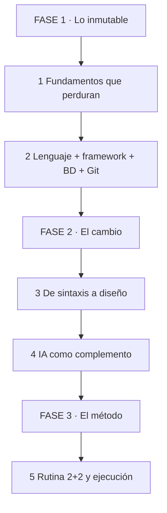
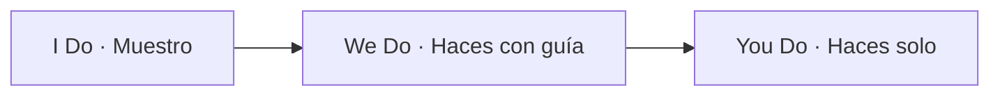
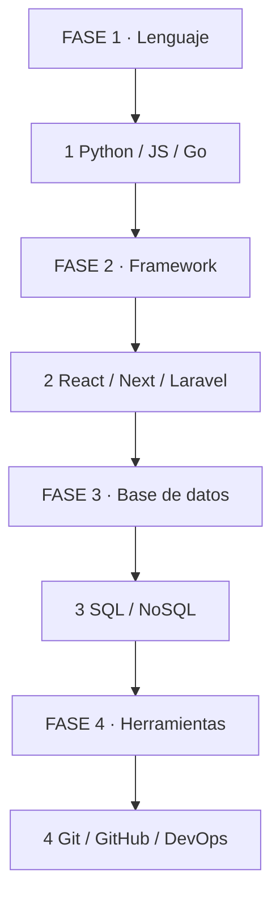
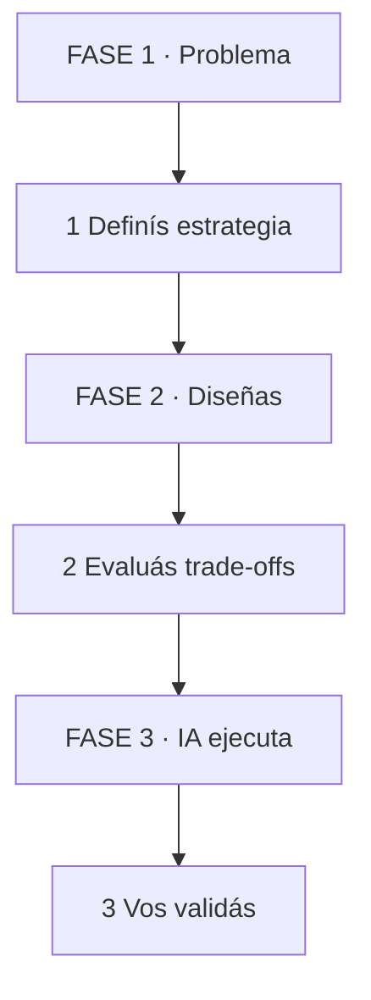
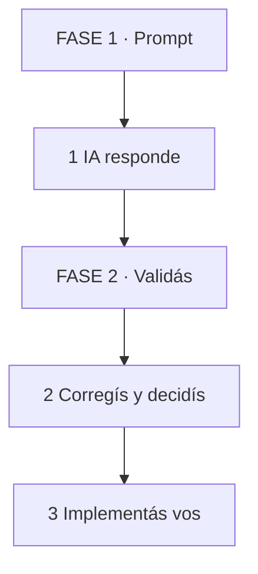
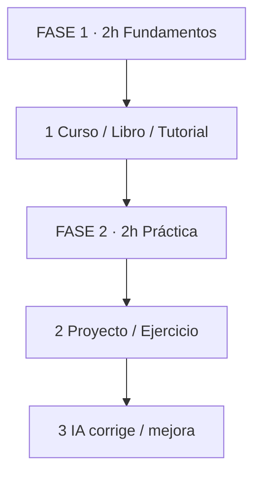

# 🧭 Cómo Aprender a Programar en 2026: Lo que No Cambia, lo que Sí Cambia y el Método con IA

## 🗺️ MAPA DE LA GUÍA

*Se lee de arriba hacia abajo. Empiezas por lo que no cambia, pasas por lo que sí cambia, y terminás en el método.*

| 🧩 Fase | ❓ Pregunta que responde | 📤 Resultado principal |
|---------|------------------------|------------------------|
| **FASE 1 · Lo inmutable** | ¿Qué sigue siendo indispensable? | Base sólida |
| **FASE 2 · El cambio** | ¿Qué rol tiene la IA en el aprendizaje? | Complemento, no reemplazo |
| **FASE 3 · El método** | ¿Cómo organizo mi estudio semanal? | Rutina ejecutable |

*Se lee de izquierda a derecha. Muestro la base, la practicamos juntos, la hacés solo con checklist.*

> **🎯 Objetivo** — Al final tendrás un mapa mental claro de qué estudiar, qué delegar a la IA y cómo organizar tu semana para aprender a programar en 2026 sin dependencia ciega.
> **⚠️ Advertencia** — La IA acelera, pero no reemplaza el criterio. Si no sabés evaluar la respuesta, no sabés usarla.

---

## 🧩 PARTE 1: LO QUE NO CAMBIA — LOS FUNDAMENTOS 🧩

### 1.1 ❓ PRETEST

Si la IA puede generar código, ¿por qué todavía necesito aprender fundamentos?

> Respuesta esperada: Porque la IA no decide el diseño del sistema, no valida si la solución es la correcta para el problema y no detecta errores de arquitectura. Los fundamentos te dan el criterio para elegir y revisar.
> Si acertás: camino rápido → andá al punto 7.

### 1.2 🎯 POR QUÉ + LOGRO

Importa porque **el ruido sobre IA hace creer que los fundamentos son obsoletos, y es falso**. Un lenguaje, un framework, una base de datos y Git siguen siendo el piso mínimo. Vas a lograr **distinguir qué debes dominar de lo que la IA puede辅助**.

### 1.3 ⚡ VICTORIA RÁPIDA (<5 min)

Escribí una lista de 4 pilares que aparecen en cualquier vacante de programación. Si los tenés, ya sabés qué no cambia.

### 1.4 💡 CONCEPTO

Analogía: Los fundamentos son como **las reglas del fútbol** — no importa cuántos bots de entrenamiento tengas, si no sabés qué es fuera de juego, nunca jugás un partido real.

Definición: Lo que no cambia en 2026 es el conjunto base: lenguaje de programación (Python, JavaScript, Go), framework o librería principal (React, Next.js, Laravel), base de datos (SQL o NoSQL), y herramientas de colaboración (Git, GitHub, DevOps). Estos 4 bloques son el piso técnico que toda entrevista evalúa.

### 1.5 👀 EJEMPLO RESUELTO

| Paso | Tú ves | Qué pasa dentro | Ejemplo |
|------|--------|-----------------|---------|
| 1 Lenguaje | Python, JavaScript, Go | Elegís 1 y lo dominás | Sintaxis + ecosistema |
| 2 Framework | React, Next.js, Laravel | Te especializás en 1 | Componentes + routing |
| 3 Base de datos | PostgreSQL, MongoDB | Entendés cuándo usar cada uno | Queries + índices |
| 4 Herramientas | Git, GitHub, CI/CD | Flujo colaborativo | Commits + deploys |

*Se lee de arriba hacia abajo. Empezás por un lenguaje, agregás framework, luego datos, luego herramientas.*

### 1.6 ⚠️ CONTRA-EJEMPLO / Error Típico

Error: Cambiar de lenguaje cada mes porque "IA me genera el código igual". Sin dominio de uno, tenés conocimientos superficiales de 5.

Corrección: Elegí 1 lenguaje y 1 framework. Dominá su ecosistema, sus errores comunes y sus patrones. La IA multiplica lo que ya sabés, no reemplaza la base.

### 1.7 🧪 PRÁCTICA

Dibujá tu mapa de fundamentos actual: 1 lenguaje, 1 framework, 1 base de datos, 1 herramienta de control de versiones. Marcá cuál dominás y cuál solo tocaste.

> Respuesta esperada / criterio: Lenguaje con proyectos reales, framework con componentes o rutas armadas, base de datos con queries escritas a mano, Git con al menos 1 repo colaborativo.

### 1.8 🔁 RECALL — Nivel Bloom: Aplicar

¿Por qué saber un lenguaje ayuda incluso si la IA genera el código diario? Respondé en 1 línea.

### 1.9 📌 IDEA CLAVE

Los fundamentos no cambian porque son el criterio con el que evaluás lo que la IA te devuelve.

### 1.10 ✅ AUTO-CHEQUEO + SIGUIENTE

- [ ] Tengo 1 lenguaje principal con proyectos reales
- [ ] Tengo 1 framework que puedo explicar sin documentación
- [ ] Tengo 1 base de datos con la que escribí queries sin ayuda
- [ ] Tengo repos en GitHub con historial de commits real

Siguiente: Lo que sí cambió en 2026.

---

## 🧩 PARTE 2: LO QUE HA CAMBIADO — DE LA SINTAXIS AL DISEÑO 🧩

### 2.1 ❓ PRETEST

Antes de 2026, ¿cuál era la habilidad principal para conseguir un puesto como programador?

> Respuesta esperada: Memorizar sintaxis, librerías y comandos. Hoy eso lo hace la IA. La habilidad principal ahora es diseñar soluciones, evaluar trade-offs y comunicar decisiones técnicas.
> Si acertás: camino rápido → andá al punto 7.

### 2.2 🎯 POR QUÉ + LOGRO

Importa porque **cambiar el foco mental es el diferenciador entre un junior y un ingeniero usable en 2026**. No se trata de recordar cómo se escribe un `for`, sino de decidir si ese `for` es la herramienta correcta. Vas a lograr **pensar en diseño antes que en sintaxis**.

### 2.3 ⚡ VICTORIA RÁPIDA (<5 min)

Abrí un problema simple: "Necesito listar usuarios y sus pedidos". Antes de escribir código, dibujá 2 opciones: 1 consulta con JOIN vs 2 consultas separadas. Esa es la nueva habilidad.

### 2.4 💡 CONCEPTO

Analogía: Antes, saber programar era como **saber escribir a máquina** — la velocidad de escritura importaba. Ahora, saber programar es como **ser director de orquesta** — importa saber qué instrumento entra y cuándo.

Definición: El cambio central es pasar de "conocer la sintaxis" a "entender el diseño del sistema". La IA maneja la sintaxis. Vos manejás el diseño: estructuras de datos, patrones arquitectónicos, escalabilidad, mantenibilidad y seguridad. Eso es lo que no se delega.

### 2.5 👀 EJEMPLO RESUELTO

| Paso | Tú ves | Qué pasa dentro | Ejemplo |
|------|--------|-----------------|---------|
| 1 Problema | "Listar usuarios + pedidos" | Definís estrategia | JOIN o 2 consultas |
| 2 Diseñas | 1 query vs N+1 | Evaluás trade-offs | Rendimiento vs simplicidad |
| 3 IA ejecuta | Te genera el código | Vos validás la estructura | Tú decides el patrón |

*Se lee de izquierda a derecha. Definís el qué y el cómo, la IA escribe el código, vos revisás.*

### 2.6 ⚠️ CONTRA-EJEMPLO / Error Típico

Error: Pedirle a la IA "hacé un sistema de ventas" y subir el resultado sin revisar. Si el sistema no escala o tiene fallas de seguridad, la responsabilidad es tuya, no de la IA.

Corrección: Usá IA para prototipar, pero definí vos el schema, las relaciones, las validaciones y los casos borde. La IA acelera la escritura, no reemplaza el diseño.

### 2.7 🧪 PRÁCTICA

Agarrá un problema simple ("lista de tareas con usuarios"). Sin escribir código, definí: 1) qué tablas necesitás, 2) qué relaciones hay, 3) qué endpoint principal debería existir. Luego compará con la respuesta de una IA.

> Respuesta esperada / criterio: Tablas identificadas, relaciones claras (1 a muchos o muchos a muchos), endpoint principal con método HTTP y path definidos.

### 2.8 🔁 RECALL — Nivel Bloom: Analizar

¿Por qué la IA no puede decidir si tu sistema debe usar SQL o NoSQL? Explicá en 1 línea.

### 2.9 📌 IDEA CLAVE

La IA escribe código, pero no decide arquitectura. Ese es tu nuevo valor como ingeniero.

### 2.10 ✅ AUTO-CHEQUEO + SIGUIENTE

- [ ] Puedo explicar el diseño de mi último proyecto sin mencionar código
- [ ] Puedo evaluar 1 trade-off (cache vs consistencia) en 1 línea
- [ ] Uso IA para prototipar, no para decidir

Siguiente: Cómo usar IA sin depender de ella.

---

## 🧩 PARTE 3: IA COMO COMPLEMENTO — SIN DEPENDENCIA 🧩

### 3.1 ❓ PRETEST

¿Cuál es el riesgo de generar todo el código con IA sin entenderlo?

> Respuesta esperada: No podés debuggear errores sutiles, no validás si la solución es óptima y generas deuda técnica invisible que luego no podés mantener ni explicar.
> Si acertás: camino rápido → andá al punto 7.

### 3.2 🎯 POR QUÉ + LOGRO

Importa porque **las herramientas actuales (ChatGPT, Claude Code, Gemini, Cursor) son poderosas pero no infalibles**. Un ingeniero que valida, revisa y decide construye reputación. Uno que solo genera, construye deuda. Vas a lograr **usar IA como multiplicador de productividad sin perder autonomía**.

### 3.3 ⚡ VICTORIA RÁPIDA (<5 min)

Instalá Claude Code o similar. Pedí una explicación de un concepto que no entendés bien, por ejemplo "middleware en Laravel". Revisá la respuesta, corregí 1 cosa y escribí tu propia versión más corta. Ese es el ciclo correcto.

### 3.4 💡 CONCEPTO

Analogía: Usar IA es como **tener un ayudante junior muy rápido que lee mucho pero no entiende el contexto del negocio**. Tu trabajo es revisar, corregir y decidir.

Definición: Usar IA bien significa: pedir explicaciones de documentación, resolver dudas específicas, generar boilerplate y depurar errores. No significa pedir "hacé todo el proyecto". La calidad de la respuesta depende de la calidad de tu prompt y de tu capacidad para validarla.

### 3.5 👀 EJEMPLO RESUELTO

| Paso | Tú ves | Qué pasa dentro | Ejemplo |
|------|--------|-----------------|---------|
| 1 Prompt | "Explicá validación en Laravel" | IA genera respuesta | Revisión humana |
| 2 Validás | "¿Y si el usuario no envía el campo?" | IA sugiere nullable | Decisión tuya |
| 3 Implementás | Escribís el Form Request | IA辅助, no autor | Criterio tuyo |

*Se lee de izquierda a derecha. IA propone, humano valida, humano ejecuta lo importante.*

### 3.6 ⚠️ CONTRA-EJEMPLO / Error Típico

Error: Subir un proyecto a GitHub generado 100% por IA. Un recruiter o technical lead detecta patrones repetitivos, errores sutiles o falta de comprensión real.

Corrección: Usá IA para prototipar. Escribí el código core, agregá tests, documentá decisiones. El repositorio debe mostrar tu criterio, no solo el output de un modelo.

### 3.7 🧪 PRÁCTICA

Usá IA para generar un esquema de base de datos para un blog. Luego escribí las migraciones manualmente y explicá por qué elegiste esos tipos y relaciones.

> Respuesta esperada / criterio: Esquema con tablas, columnas y relaciones. Migraciones escritas a mano con tipos correctos. Explicación de decisiones sin mencionar IA.

### 3.8 🔁 RECALL — Nivel Bloom: Evaluar

¿Cuándo NO deberías pedirle código a la IA? Mencionalo en 1 línea.

### 3.9 📌 IDEA CLAVE

IA como copiloto, no como piloto automático. Tu criterio es el activo diferenciador.

### 3.10 ✅ AUTO-CHEQUEO + SIGUIENTE

- [ ] Tengo 1 proyecto donde usé IA pero el código core es mío
- [ ] Puedo explicar cada decisión de arquitectura sin mencionar IA
- [ ] Configuré al menos 1 automatización o skill propia

Siguiente: El método de estudio sugerido.

---

## 🧩 PARTE 4: EL MÉTODO — RUTINA 2+2 PARA APRENDER EN 2026 🧩

### 4.1 ❓ PRETEST

¿Qué significa estudiar 2 horas de fundamentos y 2 horas de práctica?

> Respuesta esperada: No es ver 2 horas de curso y luego 2 horas de codificar sin rumbo. Es 2 horas de estudio dirigido (sintaxis, teoría, repetición deliberada) y 2 horas de proyectos experimentales donde usás la IA como guía para corregir o mejorar.
> Si acertás: camino rápido → andá al punto 7.

### 4.2 🎯 POR QUÉ + LOGRO

Importa porque **el error más común es la pasividad: ver tutoriales sin hacer, o hacer sin reflexión**. La rutina 2+2 separa la absorción de la aplicación. Vas a lograr **una semana de estudio sostenible, medible y sin estancamiento**.

### 4.3 ⚡ VICTORIA RÁPIDA (<5 min)

Bloqueá 2 bloques de 2 horas en tu calendario esta semana. Llamalos "Fundamentos" y "Práctica". Esa estructura ya es más avanzada que el estudio informal.

### 4.4 💡 CONCEPTO

Analogía: La rutina 2+2 es como **entrenar un deporte** — tenés hora de teoría (reglas, técnica) y hora de juego (aplicar, equivocarse, ajustar). Solo una no alcanza.

Definición: Bloque 1 — Fundamentos: curso, libro o tutorial con foco en retención deliberada. Repetís sintaxis, escribís ejemplos sin ayuda, explicás conceptos en voz alta. Bloque 2 — Práctica: proyectos reales o ejercicios donde la IA solo corrige o sugiere mejoras. Vos dirigís, IA辅助.

### 4.5 👀 EJEMPLO RESUELTO

| Paso | Tú ves | Qué pasa dentro | Ejemplo |
|------|--------|-----------------|---------|
| 1 Bloque 1 | 2 hs curso/tutorial | Absorbés teoría + sintaxis | Curso + apuntes propios |
| 2 Bloque 2 | 2 hs proyecto | Aplicás sin ayuda primero | CRUD desde cero |
| 3 IA guía | Pedís mejoras | IA sugiere, vos decidís | Refactor con criterio |

*Se lee de arriba hacia abajo. Estudiás teoría, aplicás en proyecto, IA revisa.*

### 4.6 ⚠️ CONTRA-EJEMPLO / Error Típico

Error: Hacer 4 horas de práctica sin teoría estructurada. Terminás copiando soluciones de Stack Overflow sin entender por qué funcionan.

Corrección: Respetá los bloques. Fundamentos sin práctica es olvido rápido. Práctica sin fundamentos es copia sin criterio.

### 4.7 🧪 PRÁCTICA

Diseñá tu rutina de esta semana con 1 tema de fundamentos (ej: "autenticación JWT") y 1 feature de proyecto para implementarlo (ej: "login con token"). Definí el orden de los bloques y qué harás si te trabás.

> Respuesta esperada / criterio: 2 bloques de 2 horas definidos, tema de fundamentos claro, feature concreta, regla de cuándo pedir ayuda a IA.

### 4.8 🔁 RECALL — Nivel Bloom: Aplicar

¿Por qué es mejor pedirle ayuda a la IA después de intentar resolver solo, no antes? Respondé en 1 línea.

### 4.9 📌 IDEA CLAVE

2 horas de fundamentos crean mapa mental. 2 horas de práctica crean memoria muscular. Juntas, crean dominio real.

### 4.10 ✅ AUTO-CHEQUEO + SIGUIENTE

- [ ] Tengo 2 bloques de 2 horas esta semana en mi calendario
- [ ] Mi tema de fundamentos es concreto y medible
- [ ] Mi proyecto tiene feature específica para aplicar lo aprendido

---

## 📝 PREGUNTAS DE VERIFICACIÓN

1. **Aplica**: ¿Qué 4 pilares fundamentales siguen siendo indispensables en 2026 y por qué?
2. **Analiza**: ¿Por qué la habilidad principal pasó de memorizar sintaxis a diseñar sistemas? Mencioná 2 razones.
3. **Diseña**: Un recruiter te pregunta cómo aprendiste a programar en la era de la IA. Explicá tu método en 2 líneas.
4. **Reflexiona**: ¿Por qué cambiar de lenguaje cada mes es contraproducente incluso con IA disponible?
5. **Evalúa**: Tu rutina actual es 4 horas de tutoriales sin práctica. ¿Qué cambio harías aplicando el método 2+2?
6. **Conecta**: ¿Cómo se conectan los fundamentos inmutables y la IA complementaria en tu flujo de aprendizaje?
7. **Propón**: Diseñá una rutina semanal de 4 días con 2 bloques diarios, incluyendo día de descanso activo.
8. **Síntesis**: Explicá por qué la IA no reemplaza el criterio técnico, usando un ejemplo de diseño de base de datos.

---

## 📚 GLOSARIO

| Término | Definición en 1 línea |
|---------|-----------------------|
| **Fundamentos** | Lenguaje, framework, base de datos y Git como piso técnico indispensable |
| **Diseño de sistemas** | Decisiones de arquitectura, patrones y trade-offs antes de escribir código |
| **IA complementaria** | Uso de IA para辅助, explicar o prototipar, sin delegar decisiones |
| **Prompt** | Instrucción clara a la IA que define el contexto y el formato de respuesta |
| **Boilerplate** | Código repetitivo que la IA puede generar para acelerar desarrollo |
| **Rutina 2+2** | 2 horas de fundamentos + 2 horas de práctica estructurada |
| **Repetición deliberada** | Practicar con foco en debilidades específicas, no solo repasar lo fácil |
| **Deuda técnica** | Código que funciona pero está mal diseñado y cuesta mantener |
| **Trade-off** | Decisión donde ganás algo y perdés otra cosa |
| **Stack tecnológico** | Conjunto de tecnologías elegidas para un proyecto |
