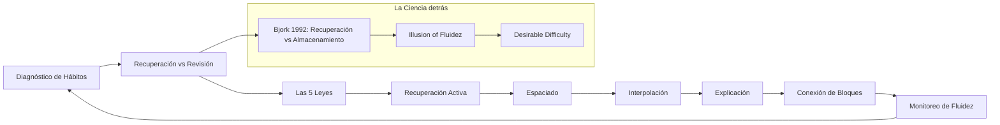
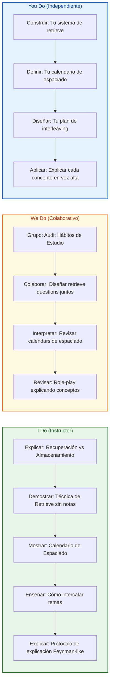
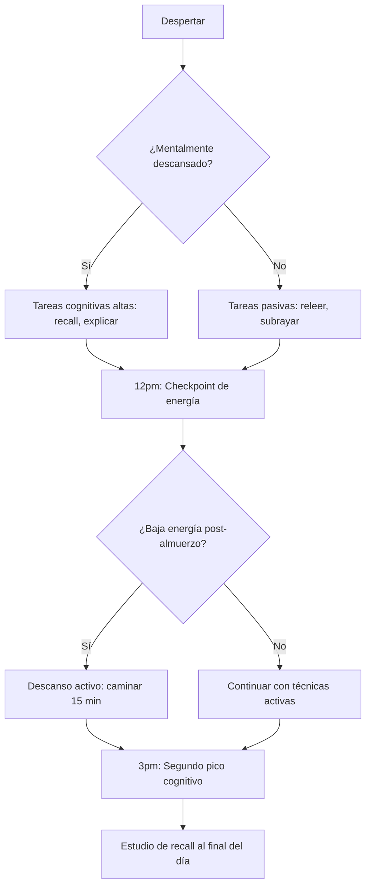
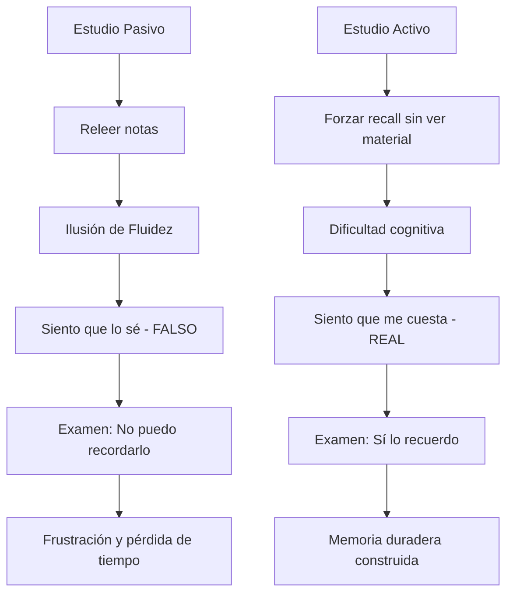
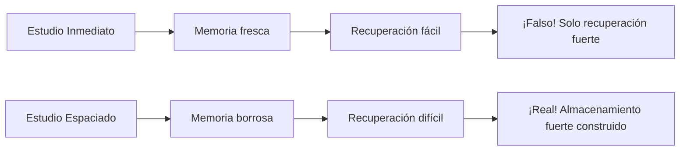
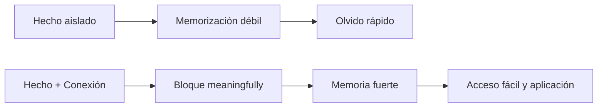
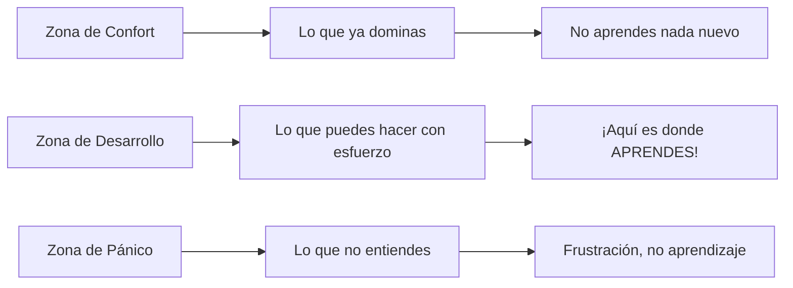

# MASTERCLASS: El Estrés del Aprendizaje

## INTRODUCCION: POR QUE ESTE MASTERCLASS ES DIFERENTE

La mayoria de las personas estudia de manera pasiva: releen notas, subrayan textos y relean capitulos una y otra vez. Esto crea una ilusión de fluidez - sientes que sabes la informacion, pero cuando llega el momento de recordarla, no puedes.

Este masterclass propore un camino alternativo: un sistema de aprendizaje activo donde la memoria de recuperacion, la espaciacion, la intercalacion y la explicacion activa trabajan como un sistema integrado. La investigacion de Robert y Elizabeth Bjork (1992) mostro que lo que sientes como dificultad durante el study es en realidad la senal de que tu cerebro esta construyendo memoria a largo plazo.

> **Objetivo de Aprendizaje** - Al final de esta guia, podras distinguir entre memoria de recuperacion y de almacenamiento, aplicar las 5 leyes científicas del aprendizaje efectivo, y disenar un sistema de estudio que priorice el esfuerzo cognitivo sobre la comodidad.

> **Advertencia educativa** - Este contenido es formativo. El "estres" del aprendizaje no es angustia; es el esfuerzo cognitivo necesario para construir memoria duradera.

---

## MAPA DEL SISTEMA DE APRENDIZAJE



| Fase | Pregunta que responde | Output principal |
|------|-----------------------|------------------|
| **Diagnóstico de Hábitos** | ¿Estoy estudiando con comodidad o con esfuerzo? | Lista de hábitos pasivos a eliminar |
| **Recuperación vs Revisión** | ¿Qué tipo de memoria estoy fortaleciendo? | Distinción clara entre storage y retrieval strength |
| **Las 5 Leyes** | ¿Qué debo hacer diferente? | Protocolo de 5 leyes aplicables |
| **Recuperación Activa** | ¿Cómo fuerzo el recuerdo sin ver el material? | Sistema de retrieve practice |
| **Espaciado** | ¿Cuándo debo repetir para máxima retención? | Calendario de espaciado adaptativo |
| **Interpolación** | ¿Cómo mezco diferentes temas? | Plan de interleaving por asignatura |
| **Explicación** | ¿Cómo verifico que truly entiendo? | Protocolo de explicación sin materiales |
| **Conexión de Bloques** | ¿Cómo ataco la memorización aislada? | Sistema de bloques meaningful |
| **Monitoreo de Fluidez** | ¿Cómo detecto la ilusión de fluidez? | Señales de alerta y tests de realidad |



---

## PARTE 1: DIAGNOSTICO DE HABITOS DE ESTUDIO - CONOCE TU COMPORTAMIENTO ANTES DE CAMBIARLO

### 1.1 Principio Central

No puedes mejorar lo que no mides. Muchos intentan cambiar sus hábitos de estudio sin primero diagnosticarlos, y fracasan porque no comprenden qué están haciendo actualmente. El primer paso es convertir lo automático en consciente.

> **Consejo de experto**: Dedica 3 dias a registrar TODOS tus habitos de estudio sin juzgarte. Solo observa. Esto revela patrones ocultos que sabotearan tus esfuerzos si no los abordas.

### 1.2 Qué significa diagnosticar tus hábitos de estudio

| Aspecto | Qué observar | Por qué importa |
|---------|-------------|-----------------|
| **Revisión pasiva** | Releer notas, subrayar, resumir | Crea ilusión de fluidez sin aprendizaje real |
| **Tiempo de estudio** | Cuántas horas seguidas? | Sesiones largas fatigan la memoria |
| **Frecuencia** | Diario, una vez por semana? | La espaciación es clave para retención |
| **Entorno** | Donde estudias? | Los estímulos contextuales afectan el recuerdo |
| **Herramientas** | Libros, notas, pantallas? | Cada medio tiene diferente carga cognitiva |
| **Estado mental** | Cansado, motivado, distraído? | El estado influye en la consolidación |

### 1.3 Test de Autodiagnóstico Rápido

**Ejercicio 1: Test de Fluidez**

```
1. Abre tus notas de un tema que estudiaste ayer
2. Lee un párrafo → Cierra el libro
3. ¿Puedes explicar el párrafo sin verlo?
4. ¿Cuántas veces tuviste que releerlo para entenderlo?
```

| Resultado | ¿Qué significa? | ¿Qué hacer? |
|-----------|----------------|-------------|
| Lo explicas fácilmente | Alta fluidez, pero... | Verifica si realmente lo recuerdas al día siguiente |
| Tienes que releer | Fluidez baja | Buena señal, sigue así |
| No puedes explicarlo | Sin comprensión real | Revisa el tema con técnicas activas |

### 1.4 Mapa de tu Día Estudiantil



---
---

## PARTE 2: RECUPERACION VS REVISION - LA DIFERENCIA QUE CAMBIA TODO

### 2.1 El Concepto Central de Bjork (1992)

En el corazón de este masterclass está la distinción entre dos tipos de fuerza de memoria, propuesta por Robert y Elizabeth Bjork:

| Tipo de Memoria | Qué es | Por qué es engañosa |
|-----------------|--------|---------------------|
| **Fuerza de Recuperación** (Retrieval Strength) | Cómo fácilmente puedes recordar información AHORA | Crea la ilusión de que sabes algo, pero no garantiza retención a largo plazo |
| **Fuerza de Almacenamiento** (Storage Strength) | Cán profundamente integrada y permanente en tu cerebro | Es lo que realmente determina si retendrás la información en 1 mes |

> **Insight clave**: Cuanto más fácil te sea recordar algo ahora, MÁS ilusoria se siente tu competencia. Pero la facilidad de recuperación NO equivale a la profundidad de almacenamiento.

### 2.2 La Ilusión de Fluidez: Tu Enemigo Silencioso

La **fluidez** es la sensación de que la información "fluye" naturalmente en tu mente. Se produce cuando:

- Relees las notas una y otra vez
- Subrayas pasivamente el texto
- Observas diagramas que "entendemos" al instante
- Leemos un resumen y pensamos "sí, lo entiendo"



### 2.3 El Experimento que lo Demuestra

Los Bjork realizaron un experimento clave:

1. **Grupo A (Práctica Distribuida)**: Estudiaron el material en múltiples sesiones espaciadas
2. **Grupo B (Práctica Concentrada)**: Estudiaron el mismo material en una sola sessión larga

**Resultado**: Al día siguiente, ambos grupos recordaban similar. Pero al mes después:
- Grupo A (espaciado): Recordó significativamente MÁS
- Grupo B (concentrado): Recordó MUCHO MENOS

> **Conclusión**: La práctica espaciada construye fuerza de almacenamiento. La práctica concentrada solo mejora la fuerza de recuperación temporal.

### 2.4 Cómo Detectar la Ilusión de Fluidez en Ti Mismo

| Señal de Alerta | ¿Qué significa? | Acción inmediata |
|-----------------|-----------------|------------------|
| "Lo he leído 3 veces y ya lo entiendo" | Fluidez alta, retención baja | Cierra el libro y explica sin ver |
| "Me resulta fácil de recordar" | Recuperación fácil = ilusión | Testa al día siguiente |
| "Las notas me parecen familiares" | Reconocimiento ≠ recuerdo | Prueba a recall activo |
| "Puedo resolver los ejercicios sin mirar" | Buena señal, pero... | Resuelve de nuevo en 3 días |

---
---

## PARTE 3: LAS 5 LEYES DEL APRENDIZAJE EFECTIVO

### 3.1 Ley 1: Recuperar, No Revisar (Retrieve, Don't Review)

> **En el minuto 8:16 del video**: "Deja de releer notas. En su lugar, fuerza tu cerebro a recordar información desde cero sin ver el material."

#### ¿Por qué funciona?

Cuando recuperas información, estás fortaleciendo las vías neuronales de acceso. Cada vez que recuerdas sin ayuda, haces más fuerte el "camino" de esa memoria. Releer notas solo refuerza el camino de reconocimiento, no el de recuperación activa.

#### Protocolo de Recuperación Activa

```python
# Sistema para practicar recall activo
def recall_session(topic, notes, delay_minutes=5):
    """
    Protocolo de una sessión de recall:
    1. Lee el tema una vez (solo una vez)
    2. Cierra las notas
    3. Escribe todo lo que recuerdas (no importa el orden)
    4. Abre las notas y marca lo que olvidaste
    5. Repite el recall sin notas después de delay_minutes
    """
    pass  # Implementación del protocolo
```

| Paso | Acción | Tiempo |
|------|--------|--------|
| 1 | Lee el tema una vez | 5 min |
| 2 | Cierra las notas | - |
| 3 | Escribe/recita todo lo que recuerdas | 5-10 min |
| 4 | Revisa notas y marca lo olvidado | 3 min |
| 5 | Repeat recall después de 5-10 min | 5 min |

#### Ejemplo Práctico

**Tema**: Teoría de la relatividad de Einstein

**Método tradicional ( incorrecto )**: Releer el capítulo 3 veces

**Método de recall ( correcto )**:
1. Lee el capítulo una vez (15 min)
2. Cierra el libro
3. Escribe desde memoria: "La relatividad dice que..."
4. Marca lo que no recordaste
5. Vuelve a escribir solo lo olvidado
6. Mañana, antes de abrir el libro, intenta recordar de nuevo

---
---

### 3.2 Ley 2: Espaciado (Space Your Study)

> **En el minuto 10:10 del video**: "Distribuye las sesiones de práctica en el tiempo. El objetivo es llegar a un punto donde el material se siente ligeramente 'borroso', forzando a tu cerebro a esforzarse más para recuperarlo."

#### La Curva de Olvido de Ebbinghaus

La research muestra que después de aprender algo:
- **1 hora después**: Perdemos el 50% de la información
- **1 día después**: Perdemos el 70%
- **1 semana después**: Perdemos el 90%

La solución NO es estudiar más tiempo en una sola sessión, sino **espaciar las revisiones**.

#### Calendario de Espaciado Recomendado

| Sesión | Cuándo | Qué hacer |
|--------|--------|-----------|
| **1ra** | Dia 0 | Estudiar el tema por primera vez (recall activo) |
| **2da** | Dia 1 | Recordar sin ver notas (recall) |
| **3ra** | Dia 3 | Recordar + resolver problemas |
| **4da** | Dia 7 | Recordar + explicar en voz alta |
| **5ta** | Dia 14 | Recordar + aplicar a nuevos contextos |
| **6ta** | Dia 30 | Recordar + enseñar a alguien |

#### El Concepto de "Borroso" (Blurry)

La clave del espaciado es dejar que la memoria se vuelva **ligeramente borrosa** antes de revisarla. Esto no es malo - es exactamente lo que queremos:



| Si sientes... | ¿Qué significa? | ¿Qué hacer? |
|---------------|-----------------|-------------|
| "Lo recuerdo perfectamente" | Memoria fresca, solo recuperación | Espera 1-2 días y prueba de nuevo |
| "Lo recuerdo, pero con esfuerzo" | Almacenamiento being built | ¡Perfecto! Sigue así |
| "No puedo recordar nada" | Espaciado demasiado largo | Revisa, pero no memorices - entiende |
| "Me cuesta mucho esfuerzo" | Dificultad deseable | Continue espaciando |

---
---

### 3.3 Ley 3: Interpolación (Interleave Your Practice)

> **En el minuto 11:28 del video**: "Mezcla diferentes asignaturas o tipos de problemas juntos. Esto evita que el cerebro dependa de patrones predecibles."

#### ¿Por qué funciona?

Cuando practicas un solo tema repetidamente (práctica bloqueada), tu cerebro aprende a resolver ese problema específico de manera automática. Pero cuando intercalas diferentes tipos de problemas, tu cerebro debe:
1. Identificar qué tipo de problema es
2. Elegir la estrategia correcta
3. Ejecutar la solución

Este proceso adicional fortalece las conexiones de memoria y mejora la transferencia a nuevos contextos.

#### Ejemplo de Interpolación vs. Práctica Bloqueada

**Tema**: Matemáticas (álgebra, geometría, cálculo)

| Práctica Bloqueada ( incorrecta ) | Interpolación ( correcta ) |
|-----------------------------------|----------------------------|
| 10 problemas de Álgebra | 1 de Álgebra, 1 de Geometría, 1 de Cálculo |
| Luego 10 de Geometría | Repeat: 1 de Geometría, 1 de Cálculo, 1 de Álgebra |
| Luego 10 de Cálculo | Repeat con diferentes combinaciones |

#### Protocolo de Interpolación

```python
def interleaved_practice(topics, problems_per_topic):
    """
    Sistema de práctica interpolada:
    - topics: lista de temas a mezclar
    - problems_per_topic: problemas por tema por ronda
    """
    schedule = []
    for round_num in range(3):  # 3 rondas
        for topic in topics:
            schedule.append((topic, round_num))
    return schedule
```

| Beneficio | Qué improve |
|-----------|-------------|
| **Transferencia** | Mejora la aplicación a problemas nuevos |
| **Retención** | La memoria se vuelve más flexible |
| **Discriminación** | Aprende a distinguir entre tipos de problemas |
| **Resiliencia** | Menos sensible al contexto específico |

---
---

### 3.4 Ley 4: Explicar Sin Materiales (Explain Without Materials)

> **En el minuto 13:05 del video**: "Intenta explicar un concepto en tus propias palabras simples sin mirar la fuente. El punto donde luchas por explicar algo es exactamente donde necesitas enfocar tu estudio."

#### ¿Por qué funciona?

Explicar fuerza la **comprensión profunda** sobre la superficial. Cuando explicas, tu cerebro:
1. Debe organizar la información de manera lógica
2. Debe encontrar conexiones entre conceptos
3. Debe traducir la información a un lenguaje own
4. Debe identificar vacíos en tu entendimiento

#### El Protocolo de Explicación Feynman

| Paso | Acción | Propósito |
|------|--------|-----------|
| **1** | Elige un concepto específico | Enfocar atención |
| **2** | Explica como si enseñaras a un niño de 10 años | Forzar lenguaje simple |
| **3** | Identifica donde te cuesta explicar | Encontrar vacíos de conocimiento |
| **4** | Revisa el material para fill those gaps | Corregir errores |
| **5** | Simplifica aún más con metáforas | Consolidar comprensión |

#### Ejemplo Práctico

**Concepto**: photosíntesis

**Intento 1 (antes de aprender)**:
> "La photosíntesis es cuando las plantas comen luz solar... y algo con el agua... y producen oxígeno?"

**Después de aprender y explicar**:
> "Imagina que una planta es una fábrica de comida. Tiene una fábrica called cloroplasto. La fábrica usa:
> - Luz solar como energía (como el sol provee energía a los paneles solares)
> - Agua como recurso (como el agua es necesaria para la fábrica)
> - Dióxido de carbono del aire (como el escape de los autos)
> 
> La fábrica produce:
> - Glucosa (comida para la planta)
> - Oxígeno (que liberamos al aire)
> 
> La ecuación es: 6CO2 + 6H2O + luz → C6H12O6 + 6O2"

#### Señales de que Necesitas Trabajar Más

| Si dices... | ¿Qué significa? | ¿Qué hacer? |
|-------------|-----------------|-------------|
| "Es complicado de explicar" | Vacío de conocimiento | Revisa ese punto específico |
| "No sé cómo explicarlo simplemente" | Falta de comprensión profunda | Vuelve al material básico |
| "Uso mucha jerga técnica" | Estás repitiendo, no entendiendo | Encuentra una metáfora |
| "No puedo conectarlo con nada" | Conexiones débiles | Busca analogías de la vida real |

---
---

### 3.5 Ley 5: Construir Bloques Significativos (Build Meaningful Blocks)

> **En el minuto 14:14 del video**: "Evita memorizar hechos aislados. En su lugar, concéntrate en conectar nueva información al conocimiento existente, similar a cómo los jugadores de ajedrez expertos reconocen patrones en lugar de piezas individuales."

#### El Problema de la Memorización Aislada

Cuando memorizas hechos sueltos, tu cerebro los almacena como "islas" sin conexiones. Esto significa:
- Son difíciles de recordar (ningún camino de acceso)
- Son difíciles de aplicar (no sabes cuándo usarlos)
- Se olvidan rápidamente (sin conexiones, no se consolidan)

#### La Estrategia de Bloques Meaningful

En su lugar, construye **bloques** - grupos de información interconectada:



| Estrategia | Qué hacer | Ejemplo |
|------------|-----------|---------|
| **Conectar a lo conocido** | Vincula nuevo conocimiento con algo que ya sabes | "Esta fórmula física es como la ley de Ohm que ya sé" |
| **Patrones, no piezas** | Identifica estructuras repetidas | En ajedrez: "ataque de torre", "defensa de peón" |
| **Jerarquías de conocimiento** | Organiza en categorías y sub-categorías | La química: elementos → grupos → propiedades |
| **Narrativas** | Convierte hechos en historias | La historia del descubrimiento de la vacuna |

#### El Ejemplo del Ajedrez

Los research muestran que:
- **Principiantes**: Recuerden posiciones de piezas individuales (peones, torres, alfiles)
- **Expertos**: Recuerden posiciones de "ataques", "defensas", "estructuras" (patrones de 5-6 piezas)

> **Conclusión**: Los expertos no tienen mejor memoria para piezas individuales. Tienen mejor memoria para **estructuras de significado**.

#### Protocolo de Construcción de Bloques

```python
def build_knowledge_blocks(new_fact, existing_knowledge):
    """
    Conecta un nuevo hecho al conocimiento existente
    """
    connections = []
    for known in existing_knowledge:
        similarity = calculate_connection(new_fact, known)
        if similarity > threshold:
            connections.append(known)
    
    block = {
        'fact': new_fact,
        'connections': connections,
        'category': categorize(new_fact, existing_knowledge)
    }
    return block
```

| Paso | Acción |
|------|--------|
| 1 | Identifica el nuevo hecho |
| 2 | Busca conexiones con conocimiento existente |
| 3 | Categoriza el hecho dentro de una estructura |
| 4 | Crea una narrativa o analogía que lo conecte |
| 5 | Revisa periódicamente todo el bloque |

---
---

## PARTE 4: EL ESTRÉS COMO Señal de Construcción - Aprende a Disfrutar la Dificultad

### 4.1 El Cambio de Mentalidad

> **En el minuto 4:57 del video**: "El sentimiento de 'lucha' durante el estudio es en realidad la sensación de la memoria siendo construida."

La mentalidad correcta es crucial. En lugar de ver la dificultad como un enemigo, hay que verla como una **señal de progreso**.

#### Comparación de Mentalidades

| Mentalidad Tradicional ( incorrecta ) | Mentalidad del Aprendiz Efectivo ( correcta ) |
|----------------------------------------|----------------------------------------------|
| "Si me cuesta, no lo entiendo" | "Si me cuesta, estoy construyendo memoria" |
| "Quiero que sea fácil" | "Quiero que me forcing a pensar" |
| "Evito la dificultad" | "Busco la dificultad deseable" |
| "Estudio para que sea familiar" | "Estudio para que sea accesible después" |

### 4.2 La Dificultad Deseable vs. La Dificultad Dañina

No toda dificultad es buena. Hay que distinguir entre:

| Tipo de Dificultad | Qué es | Cómo manejarla |
|--------------------|--------|----------------|
| **Dificultad Deseable** | El esfuerzo de recordar información que está "a mano" | ¡Enfócate en esto! Es la señal de que estás construyendo memoria |
| **Dificultad Dañina** | La frustración por no entender el concepto básico | Revisa los fundamentos, no continues empujando |
| **Agotamiento Mental** | El cansancio después de mucho esfuerzo cognitivo | Descansa, no forces más study en ese estado |

### 4.3 Señales de que Estás en la Zona de Desarrollo

La **Zona de Desarrollo Próximo** (Vygotsky) es el espacio entre lo que puedes hacer solo y lo que puedes hacer con ayuda. Es donde el aprendizaje óptimo sucede.



| Si sientes... | ¿Estás en la zona correcta? | ¿Qué hacer? |
|---------------|----------------------------|-------------|
| "Lo recuerdo con un esfuerzo moderado" | Sí - Zona de Desarrollo | Continue |
| "Me cuesta, pero lo consigo" | Sí - Dificultad Deseable | Sigue así |
| "Estoy frustrado, no entiendo nada" | No - Zona de Pánico | Descansa y revisa fundamentos |
| "Es demasiado fácil" | No - Zona de Confort | Busca retos más difíciles |
| "Me divierto mientras estudio" | Sí - Flujo | Mantén el equilibrio con desafíos |

---
---

## PARTE 5: I DO / WE DO / YOU DO - EJERCICIOS PROGRESIVOS

### 5.1 I Do — Diagnóstico Guiado de Hábitos de Estudio

**Objetivo**: Diagnosticar tus hábitos de estudio antes de cambiarlos.

| Paso | Acción | Resultado esperado |
|------|--------|--------------------|
| 1 | Carga tus notas de un tema reciente | Lista de temas estudiados |
| 2 | Calcula tu frecuencia de estudio | ¿Diario, semanal, mensual? |
| 3 | Evalúa tu método (releer vs. recall) | Porcentaje de estudio pasivo vs. activo |
| 4 | Identifica tu zona horaria óptima | Mañana, tarde, noche? |
| 5 | Detecta la ilusión de fluidez | Señales de alerta |
| 6 | Recomienda mejoras específicas | Plan de acción personalizado |

```python
def study_habits_diagnostic(topics_studied, methods_used, frequency):
    """
    Sistema para diagnosticar hábitos de estudio
    """
    passive_methods = ['releer', 'subrayar', 'resumir', 'revisar']
    active_methods = ['recall', 'explicar', 'intercalar', 'espaciar']
    
    passive_count = sum(1 for m in methods_used if m in passive_methods)
    active_count = sum(1 for m in methods_used if m in active_methods)
    
    return {
        'passive_ratio': passive_count / len(methods_used),
        'active_ratio': active_count / len(methods_used),
        'recommendation': 'Increase active methods' if passive_count > active_count else 'Good balance'
    }
```

**Interpretación guiada:**
- Si usas más del 70% de métodos pasivos, estás en la zona de ilusión de fluidez
- Si tu frecuencia es diaria pero solo por 15 min, la consistencia es buena pero la profundidad puede faltar
- Si estudias solo antes del examen, estás en la zona de recuperación temporal

### 5.2 We Do — Diseñar un Sistema de Recall en Grupo

**Escenario**: Tienes un examen de historia y biología en 2 semanas.

**Tarea colaborativa**: Diseña un calendario de estudio usando las 5 leyes.

| Decisión | Opción recomendada | Justificación |
|----------|--------------------|---------------|
| **Frecuencia** | Diario, 30-45 min | Espaciado óptimo |
| **Método principal** | Recall sin notas | Fortalece almacenamiento |
| **Interpolación** | 15 min historia + 15 min biología | Evita práctica bloqueada |
| **Explicación** | Explica cada concepto en voz alta | Detecta vacíos |
| **Bloques** | Conecta eventos históricos con descubrimientos biológicos | Crea redes de conocimiento |

```python
def collaborative_study_plan(topics, days_available):
    """
    Plan de estudio colaborativo
    """
    daily_plan = []
    for day in range(days_available):
        # Interleave 2 topics per day
        topic_a = topics[day % len(topics)]
        topic_b = topics[(day + 1) % len(topics)]
        
        daily_plan.append({
            'day': day + 1,
            'topic_a': topic_a,
            'topic_b': topic_b,
            'method': 'recall + explain',
            'duration': 45
        })
    return daily_plan
```

---
---

### 5.3 You Do — Construye Tu Propio Sistema de Aprendizaje

**Tarea**: Crea un sistema personalizado de estudio para tu próximo examen o proyecto.

**Debes incluir:**

| Componente | Qué definir | Ejemplo |
|------------|-------------|---------|
| **Calendario de espaciado** | ¿Cuándo estudiarás cada tema? | Dias 0, 1, 3, 7, 14 |
| **Método de recall** | ¿Cómo forzarás el recuerdo? | Sin notas, explicar en voz alta |
| **Plan de intercalación** | ¿Qué temas mezclarás? | Matemáticas + Física + Química |
| **Protocolo de explicación** | ¿Cómo verificarás que entiendes? | Explicar como a un niño de 10 años |
| **Conexión de bloques** | ¿Cómo conectarás nuevo con viejo? | Analogías de la vida diaria |
| **Señales de alerta** | ¿Cómo detectarás la ilusión de fluidez? | Test de recall al día siguiente |

**Criterios de evaluación:**

| Criterio | Peso |
|----------|------|
| Uso de técnicas activas (recall, explicar) | 30% |
| Espaciado adecuado | 25% |
| Interpolación de temas | 15% |
| Conexión de bloques meaningful | 20% |
| Monitoreo de la ilusión de fluidez | 10% |

### 5.4 I Do — Test de Realidad: Detecta la Ilusión de Fluidez

**Objetivo**: Aprender a distinguir entre sentirse competente y realmente recordar.

| Escenario | ¿Qué sientes? | ¿Qué haces? | ¿Qué significa? |
|-----------|---------------|-------------|-----------------|
| Relees tus notas 3 veces | "Lo entiendo" | Cierra las notas y explica | Si no puedes explicar, era ilusión |
| Resolves un problema | "Lo hice fácil" | Resuelve otro similar al día siguiente | Si lo recuerdas, era real |
| Ves un diagrama | "Me suena familiar" | Dibuja el diagrama sin verlo | Si no lo dibujas, era ilusión |
| Lees un resumen | "Sí, lo sé" | Testa con preguntas de examen | Si fallas, era ilusión |

### 5.5 We Do — Role-Play: Explicar un Concepto a un Principiante

**Escenario**: Estás explicando la photosíntesis a alguien que nunca la ha estudiado.

| Paso | Qué hacer | Señal de que fallaste |
|------|-----------|----------------------|
| 1 | Explica en tus propias palabras | Usas jerga técnica |
| 2 | Usa una metáfora | No puedes encontrar una |
| 3 | Pregunta: "¿Qué preguntas tú?" | No hay preguntas - no entendieron |
| 4 | Revisa donde te bloqueaste | "Es complicado de explicar" |
| 5 | Simplifica aún más | Repite la metáfora |

### 5.6 You Do — Monitorea tu Progreso

**Tarea**: Durante 2 semanas, registra:

| Métrica | Cómo medirla | Meta |
|---------|-------------|------|
| % de tiempo en recall vs. releer | Registro diario | 70% recall, 30% revisión |
| Frecuencia de estudio | Sesiones por semana | 5-7 sesiones |
| Duración de cada sessión | Minutos | 30-45 min |
| Explicaciones exitosas | Conceptos explicados sin mirar | 3-5 por día |
| Señales de ilusión de fluidez | Veces que "sentí que lo sabía" pero no pude recordar | Reducir cada semana |

---
