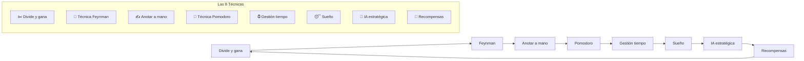
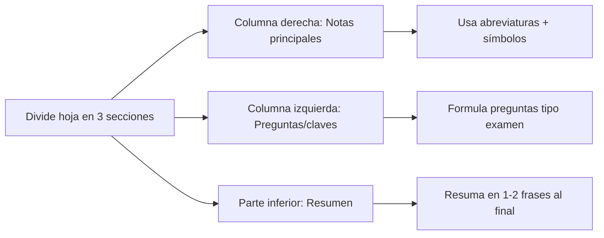
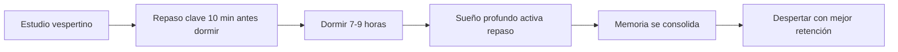
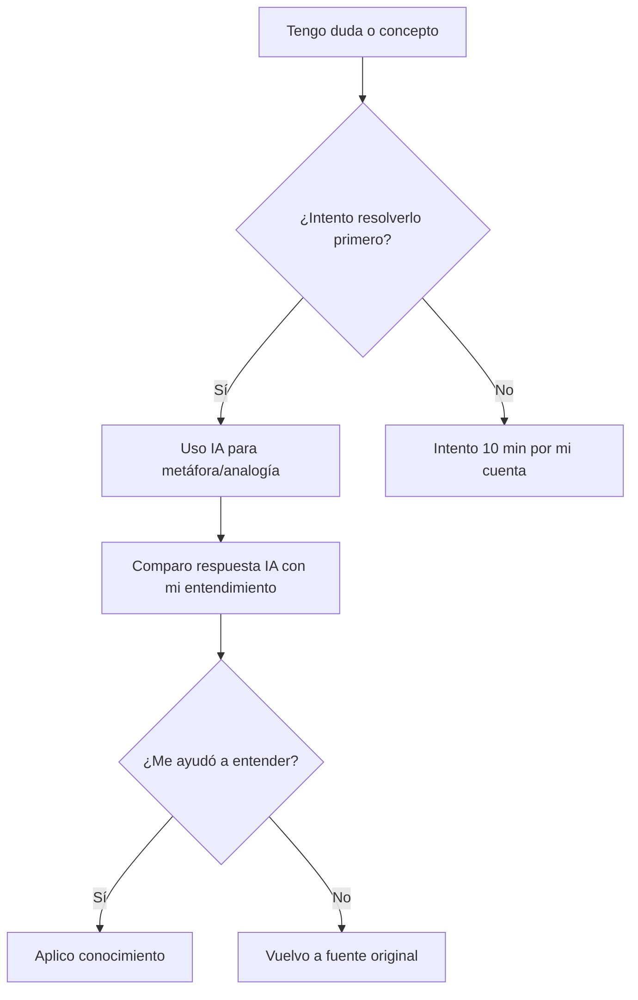
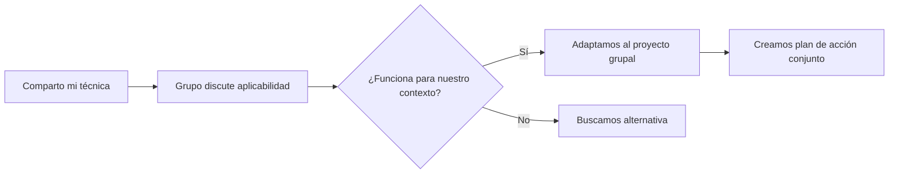
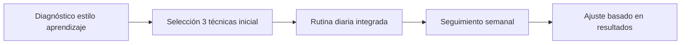

# MASTERCLASS: Técnicas de Aprendizaje Efectivo - 8 Métodos de Bárbara Oakley 🧠📚

## INTRODUCCIÓN: POR QUÉ ESTA MASTERCLASS ES DIFERENTE 🎯

> **🎯 Objetivo de Aprendizaje** — Al final de esta guía, podrás aplicar las 8 técnicas de Barbara Oakley para aprender más rápido, retener mejor la información y evitar el agotamiento durante el estudio.

> **⚠️ Advertencia educativa** — Este contenido es formativo. La eficacia depende de la aplicación constante. Adapta las técnicas a tu estilo de aprendizaje único.

---

## MAPA DEL WORKFLOW 🔄



---

## PARTE 1: DIVIDE Y GANA - PEQUEÑOS PASOS, GRANDES RESULTADOS 🎯

### 1.1 Principio Central: El cerebro aprende mejor en bloques pequeños 🧱

> **💡 Insight de Oakley (0:30)**: Objetivos abrumadores activan el dolor mental. Dividir en micro-tareas reduce la resistencia inicial.

### 1.2 Fórmula de micro-objetivos 📐

| Elemento | Mal ejemplo | Bueno ejemplo |
|----------|-------------|---------------|
| **Objetivo** | "Aprender cálculo" | "Entender derivada de x²" |
| **Sesión** | "Estudiar 3 horas" | "25 min enfocado" |
| **Meta** | "Dominar tema" | "Resolver 3 problemas" |

### 1.3 Protocolo de división 🔢

```python
# Sistema para dividir cualquier tema
def divide_learning_topic(main_topic, hours_available):
    return {
        'micro_objetivos': [f"{main_topic} - subconcepto {i}" for i in range(1, 6)],
        'sesiones_diarias': min(4, hours_available // 0.5),  # bloques de 30 min
        'duracion_sesion': 25,  # minutos
        'descanso': 5           # minutos
    }

# Ejemplo: Aprender programación en 2 horas/día
divide_learning_topic("Programación Python", 2)
```

---

## PARTE 2: TÉCNICA FEYNMAN - ENSEÑAR PARA APRENDER 👶

### 2.1 Principio Central: Si no puedes explicarlo simplemente, no lo entendiste 🧠

> **🎯 Revelación (1:23-2:59)**: Explicar como si enseñaras a un niño revela lagunas inmediatas y consolida conocimiento.

### 2.2 Los 4 pasos de Feynman 🔄

| Paso | Acción | Propósito |
|------|--------|-----------|
| **1. Elige concepto** | Selecciona tema específico | Enfocar atención |
| **2. Enseña a un niño** | Usa lenguaje sencillo, analogías | Detectar vacíos |
| **3. Revisa lagunas** | Vuelve al material cuando falte | Corregir errores |
| **4. Simplifica aún más** | Usa metáforas y dibujos | Consolidar comprensión |

### 2.3 Plantilla Feynman 📝

```mermaid
flowchart TD
    A[Concepto: Fotosíntesis] --> B{¿Puedo explicar a un niño de 10 años?}
    B -->|No| C[Identificar qué no entiendo]
    C --> D[Revisar clorofila, luz, CO2]
    D --> E[Explicar: "Plantas comen luz"]
    E --> F[¿Más simple?]
    F -->|Sí| G[¡Lo entiendo!]
    F -->|No| H[Volver a simplificar]
```

### 2.4 Ejercicio práctico 🧪

```python
# Checklist Feynman
def feynman_checklist(concept):
    return {
        'explain_simple': f"¿Lo explicaría a un amigo no técnico en 60 segundos?",
        'use_analogy': "¿Qué metáfora cotidiana representa esto?",
        'find_gaps': "¿Qué parte me cuesta explicar?",
        'review_source': "¿Necesito volver al libro/video?",
        'simplify_more': "¿Puedo dibujarlo o hacer una historia?"
    }
```

---

## PARTE 3: ANOTAR A MANO - EL PODER DEL LÁPIZ ✍️

### 3.1 Principio Central: La escritura activa genera conexiones neuronales 🔗

> **📊 Dato (3:10)**: Tomar notas a mano aumenta retención en un 30-50% vs tecleo. El cerebro procesa profundamente al formar letras.

### 3.2 Comparación: Mano vs Teclado 📊

| Aspecto | Notas a mano | Notas digitales |
|---------|--------------|-----------------|
| **Velocidad** | Más lenta | Más rápida |
| **Procesamiento** | Profundo (selección) | Superficial (transcripción) |
| **Retención** | Alta | Moderada |
| **Distracción** | Baja | Alta (notificaciones) |
| **Creatividad** | Alta (dibujos, flechas) | Limitada |

### 3.3 Método Cornell mejorado 📓



### 3.4 Protocolo de toma de notas 🖊️

```python
# Sistema de notas efectivas
def tomar_notas_efectivas(tema):
    return {
        'antes': 'Revisa objetivo de aprendizaje',
        'durante': [
            'Escribe solo ideas clave',
            'Usa símbolos: → (conduce a), ⊕ (combina)',
            'Deja espacios para agregar después'
        ],
        'despues': [
            'Revisa y completa en 10 min',
            'Formula 3 preguntas de autoevaluación',
            'Conecta con conocimiento previo'
        ]
    }
```

---

## PARTE 4: TÉCNICA POMODORO - ENFOQUE CON DESCANSOS INTELIGENTES 🍅

### 4.1 Principio Central: El cerebro necesita pausas para consolidar ⏱️

> **⏰ Advertencia (3:59-4:50)**: Descansos sin celular permiten que el modo difuso procese información. El teléfono interrumpe esta consolidación.

### 4.2 Ciclo Pomodoro optimizado 🔄

| Fase | Duración | Actividad | Prohibido |
|------|----------|-----------|-----------|
| **Enfoque** | 25 min | Tarea específica | Redes, email |
| **Descanso corto** | 5 min | Estiramiento, agua, mirada lejos | Celular, pantallas |
| **Cada 4 ciclos** | Descanso largo | 15-30 min | Trabajo relacionado |

### 4.3 Por qué evitar el celular en descansos 📵

> **🧠 Neurociencia**: El modo difuso (actividad cerebral durante descanso) requiere estímulos mínimos. El celular activa el modo focalizado, bloqueando la consolidación.

### 4.4 Temporizador Pomodoro 🍅

```python
# Temporizador Pomodoro simple
import time

def pomodoro_session(task_name, cycles=4):
    for i in range(cycles):
        print(f"🍅 Pomodoro {i+1}/{cycles}: {task_name}")
        time.sleep(25 * 60)  # 25 min enfoque
        print("⏰ Tiempo de descanso - ¡LEVÁNTATE y mira lejos!")
        time.sleep(5 * 60)   # 5 min descanso
        if (i+1) % 4 == 0:
            print("🌟 ¡Descanso largo! 15-30 min para recargar")
            time.sleep(20 * 60)  # 20 min descanso largo
    print("¡Felicitaciones! Completaste tus pomodoros")
```

---

## PARTE 5: GESTIÓN DEL TIEMPO - CALIDAD SOBRE CANTIDAD ⏰

### 5.1 Principio Central: Más horas ≠ mejor aprendizaje 📈

> **📊 Insight (5:18)**: No existe número ideal de horas, pero exceder 8 horas diarias reduce eficiencia por fatiga cognitiva.

### 5.2 Fórmula de tiempo óptimo 🧮

| Factor | Recomendación | Por qué |
|--------|---------------|---------|
| **Sesiones máximas/día** | 4 bloques de 90 min | Ciclos ultradianos naturales |
| **Descanso entre sesiones** | 20-30 min | Recuperación de neurotransmisores |
| **Horario de estudio** | Cuando tienes energía pico | Ritmo circadiano personal |
| **Límite diario absoluto** | 6 horas efectivas | Más allá, ley de retornos decrecientes |

### 5.3 Horario de estudio personalizado 📅

```python
# Generador de horario de estudio
def crear_horario_estudio(horas_disponibles, energia_pico):
    mañana = "8:00-11:00" if energia_pico == "mañana" else "descanso"
    tarde = "15:00-18:00" if energia_pico == "tarde" else "descanso"
    noche = "19:00-21:00" if energia_pico == "noche" else "descanso"
    
    return {
        'bloques_activos': [b for b in [mañana, tarde, noche] if b != "descanso"],
        'total_horas': len([b for b in [mañana, tarde, noche] if b != "descanso"]) * 3,
        'recomendacion': "Máximo 4 bloques de 90 min o equivalente"
    }

# Ejemplo: persona con energía en mañana
crear_horario_estudio(6, "mañana")
```

---

## PARTE 6: EL PAPEL DEL SUEÑO - CONSOLIDACIÓN NOCTURNA 😴

### 6.1 Principio Central: El sueño es cuando aprendemos realmente 💤

> **🧠 Revelación (6:09-6:44)**: Durante el sueño profundo, el cerebro repite y consolida patrones aprendidos. Revisar antes de dormir potencia este efecto.

### 6.2 Ciclos de sueño y aprendizaje 🌙

| Fase de sueño | Duración | Rol en aprendizaje |
|---------------|----------|-------------------|
| **Sueño ligero** | 50% | Filtrado inicial de información |
| **Sueño profundo** | 20% | Consolidación de memoria declarativa |
| **REM** | 30% | Integración emocional y creativa |
| **Despierto** | - | Adquisición inicial |

### 6.3 Protocolo de aprendizaje nocturno 🌃



### 6.4 Técnica de repaso pre-sueño 📖

```python
# Rutina de 10 minutos antes de dormir
def repaso_pre_sueno():
    return {
        'minuto_1_2': 'Respira profundo 4-7-8',
        'minuto_3_5': 'Revisa 3 conceptos clave del día',
        'minuto_6_8': 'Formula preguntas: "¿Por qué esto es importante?"',
        'minuto_9_10': 'Visualiza aplicar lo aprendido mañana'
    }
```

---

## PARTE 7: USO ESTRATÉGICO DE LA IA - POTENCIADOR, NO SUSTITUTO 🤖

### 7.1 Principio Central: La IA como metáfora generadora, no como respuesta directa 💡

> **🎯 Consejo (7:14)**: Usa ChatGPT para crear analogías y despertar curiosidad, nunca para obtener respuestas que eviten tu esfuerzo cognitivo.

### 7.2 Uso apropiado vs inapropiado de la IA ⚖️

| Uso apropiado | Uso inapropiado | Por qué |
|---------------|-----------------|---------|
| **"Explica la relatividad como si tuviera 10 años"** | "Dame la respuesta al problema 3" | Desarrolla comprensión vs copia |
| **"Crea una metáfora para la fotosíntesis"** | "Resuelve esta ecuación por mí" | Estimula pensamiento vs evita esfuerzo |
| **"¿Qué analogía hay entre CPU y cocina?"** | "Dame el código completo" | Fomenta conexión vs dependencia |

### 7.3 Plantilla de prompts efectivos 📝

```python
# Generador de prompts IA estratégica
def strategic_ai_prompt(concept, goal):
    templates = {
        'metaphora': f"Explica {concept} usando una metáfora de la vida cotidiana",
        'analogy': f"¿Qué analogía existe entre {concept} y algo familiar?",
        'simplify': f"¿Cómo le explicarías {concept} a un amigo sin conocimiento previo?",
        'curiosity': f"¿Cuál es el aspecto más sorprendente o controvertido de {concept}?"
    }
    return templates.get(goal, f"Explícame {concept} de forma sencilla")

# Ejemplo
strategic_ai_prompt("bloquechain", "metaphora")
```

### 7.4 Protocolo de uso ético 🔐



---

## PARTE 8: RECOMPENSAS - EL CIRCUITO DE LA MOTIVACIÓN 🎁

### 8.1 Principio Central: El cerebro busca recompensa para repetir comportamiento 🔄

> **💡 Insight (8:42)**: Premiar esfuerzo (no solo resultado) mantiene dopamina estable y evita el abandono.

### 8.2 Sistema de recompensas efectivas 🏆

| Tipo de esfuerzo | Recompensa apropiada | Tiempo | Por qué funciona |
|------------------|----------------------|--------|------------------|
| **Sesión Pomodoro completada** | 5 min de video favorito | Inmediato | Refuerzo inmediato |
| **Tema dominado** | Actividad placentera | 30-60 min | Asociar aprendizaje con placer |
| **Meta semanal alcanzada** | Salida o pequeño lujo | Semanal | Motivación a largo plazo |
| **Proyecto terminado** | Experiencia significativa | Mensual | Consolidación de identidad |

### 8.3 La trampa de las recompensas inapropiadas ⚠️

> **🚫 Evitar**: Recompensas que contradigan el objetivo (ej: comer azúcar después de estudiar nutrición).

### 8.4 Protocolo de recompensa personalizada 🎯

```python
# Sistema de recompensas inteligente
def crear_sistema_recompensas(objetivo, esfuerzo_requerido):
    return {
        'micro': {
            'trigger': 'Cada Pomodoro completado',
            'recompensa': 'Estiramiento + agua + 1 min mirada a ventana',
            'duracion': '1 min'
        },
        'medio': {
            'trigger': 'Cada tema dominado',
            'recompensa': 'Episodio de serie favorito (20 min) o caminata al aire libre',
            'duracion': '20-30 min'
        },
        'macro': {
            'trigger': 'Cada meta semanal alcanzada',
            'recompensa': 'Actividad especial: cena fuera, masaje, libro nuevo',
            'duracion': '2-4 horas'
        }
    }

# Ejemplo para aprender español
crear_sistema_recompensas("Conversación básica", 30)
```

---

## PARTE 9: I DO / WE DO / YOU DO - EJERCICIOS PROGRESIVOS 🎓

### 9.1 I Do — Técnica Feynman guiada 👶

**Objetivo**: Aplicar Feynman a un concepto que estés aprendiendo

| Paso | Acción | Tiempo |
|------|--------|--------|
| 1 | Elige un concepto específico | 2 min 🎯 |
| 2 | Explica en voz alta como si enseñaras a un niño | 3 min 👶 |
| 3 | Identifica qué partes fueron difíciles | 2 min 🔍 |
| 4 | Vuelve al material para aclarar lagunas | 3 min 📚 |
| 5 | Explica nuevamente, más sencillo | 2 min ✨ |

### 9.2 We Do — Análisis en equipo de técnicas 🧑‍🤝‍🧑

**Ejercicio grupal**: Cada persona comparte su técnica favorita y por qué



### 9.3 You Do — Sistema personal de aprendizaje 🚀

**Tarea**: Diseña tu sistema integrado de las 8 técnicas



**Checklist de implementación**:

- [ ] Identifica tu mejor hora para aprender (mañana/tarde/noche)
- [ ] Configura técnica Pomodoro con aplicación bloqueadora
- [ ] Elige un tema y aplica técnica Feynman hoy
- [ ] Compra cuaderno para notas a mano específicamente para aprendizaje
- [ ] Establece rutina de 10 min de repaso antes de dormir
- [ ] Define tu sistema de recompensas personales
- [ ] Prueba usar IA para generar una metáfora de lo que estudias
- [ ] Agenda tu primera sesión de aprendizaje integrado

---

## PREGUNTAS DE VERIFICACIÓN 📝

1. **Aplica**: ¿Qué concepto reciente estudiaste que podrías explicar usando la técnica Feynman a un niño de 8 años?

2. **Analiza**: ¿Cuál de las 8 técnicas has estado subutilizando? ¿Qué cambio mínimo harías hoy para incorporarla?

3. **Diseña**: Crea tu rutina matutina de aprendizaje integrando al menos 3 técnicas.

4. **Reflexiona**: ¿Cómo medirías si tu aprendizaje es más efectivo después de aplicar estas técnicas? ¿Qué indicador usarías?

---

## GLOSARIO RÁPIDO 📚

| Término | Definición | Emoji |
|---------|------------|-------|
| **Modo difuso** | Estado cerebral de relajación que consolida aprendizaje | 💭🧠 |
| **Micro-objetivo** | Pequeña meta de aprendizaje específica | 🎯📚 |
| **Consolidación** | Proceso de hacer permanente la memoria | 🔒🧠 |
| **Analogía** | Comparación que facilita comprensión | 🔄💡 |
| **Retención activa** | Recordar sin mirar fuente | 🧠⚡ |
| **Ciclo ultradiano** | Ritmo biológico de 90-120 min | ⏱️🔄 |

---

## RECURSOS ADICIONALES 📦

### Apps recomendadas 📱

- **Enfoque**: Forest, Focus To-Do, Pomodone
- **Notas**: GoodNotes, Notability, OneNote (modo manuscrita)
- **Repaso**: Anki, Quizlet, RemNote
- **Sueño**: Sleep Cycle, Pillow, AutoSleep

### Libros esenciales 📚

- "Aprendiendo a Aprender" - Barbara Oakley & Terrence Sejnowski
- "Make It Stick" - Peter Brown, Henry Roediger III, Mark McDaniel
- "El poder del hábito" - Charles Duhigg

### Podcasts de referencia 🎙️

- The Learning Scientists Podcast
- Hidden Brain (NPR)
- The Tim Ferriss Show