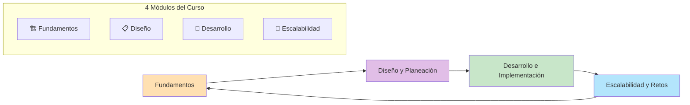
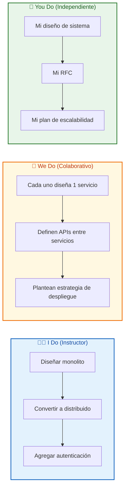
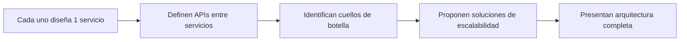
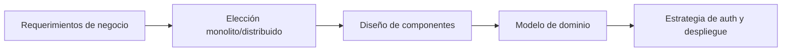

# MASTERCLASS: Arquitectura Backend - Curso Práctico Completo 🏗️

## INTRODUCCIÓN: POR QUÉ ESTA MASTERCLASS ES DIFERENTE 🎯

La mayoría de los tutoriales de backend muestran código sin contexto. Esta guía enseña **cómo pensar como arquitecto**: traducir necesidades de negocio en sistemas escalables, decidir entre monolitos y microservicios, diseñar APIs, aplicar TDD y desplegar en la nube.

El objetivo no es aprender un framework, sino **entender los principios que aplican a cualquier lenguaje o plataforma**.

> **🎯 Objetivo de Aprendizaje** — Al final de esta guía, podrás diseñar un sistema backend distribuido, aplicar DDD básico, implementar TDD, diseñar autenticación segura, aplicar estrategias de escalabilidad y redactar documentos de diseño.

> **⚠️ Advertencia profesional** — Este contenido es formativo. La arquitectura backend requiere práctica real en proyectos. Usá esta guía como mapa, no como verdad absoluta.

---

## 🗺️ MAPA DE LA MASTERCLASS 🧭

| 🧩 Fase | ❓ Pregunta que responde | 📤 Resultado principal |
|---------|------------------------|------------------------|
| **🏗️ Fundamentos** | ¿Cómo funciona un backend moderno? | Visión completa del sistema |
| **📋 Diseño** | ¿Cómo planifico antes de codear? | Documentos y diagramas |
| **🧪 Desarrollo** | ¿Cómo implemento con calidad? | Código testeado y mantenible |
| **🚀 Escalabilidad** | ¿Cómo crece el sistema? | Estrategias de producción |

---

## 🏗️ PARTE 1: FUNDAMENTOS - CÓMO FUNCIONA UN BACKEND MODERNO 🏗️

### 1.1 ❓ PRETEST

¿Qué componente se encarga de distribuir el tráfico entre múltiples servidores?

> Respuesta esperada: Balanceador de carga.
> Si acertás: camino rápido → andá al punto 7.

### 1.2 🎯 POR QUÉ + LOGRO

Importa porque **el backend es el motor de toda aplicación web**. Sin entender sus componentes, no podés diagnosticar problemas de performance ni diseñar sistemas escalables. Vas a lograr **leer un diagrama de arquitectura y explicar cada pieza**.

### 1.3 ⚡ VICTORIA RÁPIDA (<5 min)

Dibujá en un papel: usuario → navegador → servidor → base de datos. Esa es la arquitectura más simple. Ahora agregá: balanceador, gateway y cola de mensajes. Esa es la arquitectura distribuida.

### 1.4 💡 CONCEPTO

Analogía: El backend es como **una cocina de restaurante** — tenés el mesón de entrada (gateway), los cocineros (servicios), la despensa (base de datos), el llamado de mesas (cola de mensajes) y el encargado de distribuir trabajo (balanceador).

Definición: La arquitectura backend es el diseño de la lógica del servidor: cómo se estructuran los componentes, cómo se comunican y cómo se escalan para soportar carga. Incluye APIs, bases de datos, servicios, colas y estrategias de despliegue.

### 1.5 👀 EJEMPLO RESUELTO

| Componente | Función | Ejemplo |
|------------|---------|---------|
| **Gateway** | Punto de entrada único, enrutamiento | API Gateway de Kubernetes |
| **Balanceador** | Distribuye tráfico entre servidores | Nginx, AWS ELB |
| **Servicio** | Lógica de negocio específica | Servicio de usuarios, servicio de pagos |
| **Base de datos** | Persistencia de datos | PostgreSQL, MongoDB |
| **Cola de mensajes** | Comunicación asincrónica | RabbitMQ, Kafka |

### 1.6 ⚠️ CONTRA-EJEMPLO / ERROR Típico

Error: Poner toda la lógica en un solo servidor porque "es más simple".

Corrección: Un monolito funciona al inicio, pero cuando el tráfico crece, un cuello de botella en el pago afecta todo el sistema. Los sistemas distribuidos permiten escalar cada servicio independientemente.

### 1.7 🧪 PRÁCTICA

Elegí una app que usas daily (Twitter, Spotify, Mercado Libre). Identificá: ¿dónde está el gateway? ¿cuántos servicios imaginás que tiene? ¿dónde están las bases de datos?

> Respuesta esperada / criterio: No necesitás saber la respuesta real. Lo importante es que practiques descomponer un sistema en componentes. Ejemplo: Spotify tiene servicio de usuarios, servicio de recomendación, servicio de streaming, etc.

### 1.8 🔁 RECALL — Nivel Bloom: Analizar

¿Por qué los sistemas distribuidos son más complejos pero más escalables que los monolitos?

### 1.9 📌 IDEA CLAVE

Un backend distribuido es un equipo de especialistas: cada servicio hace una cosa bien, pero necesitan coordinación.

### 1.10 ✅ AUTO-CHEQUEO + SIGUIENTE

- [ ] Dibujé la arquitectura de una app conocida
- [ ] Identifiqué gateway, servicios y bases de datos
- [ ] Entiendo la diferencia entre monolito y distribuido

Siguiente: Cómo traducir requerimientos de negocio en decisiones de arquitectura.

---

## 🏗️ PARTE 2: SISTEMAS MONOLÍTICOS VS DISTRIBUIDOS 🏗️

### 2.1 ❓ PRETEST

¿Cuál es la principal ventaja de un monolito sobre microservicios?

> Respuesta esperada: Simplicidad de desarrollo y deployment.
> Si acertás: camino rápido → andá al punto 7.

### 2.2 🎯 POR QUÉ + LOGRO

Importa porque **elegir la arquitectura incorrecta en el día 1 te cuesta meses de refactor**. Un monolito puede ser la mejor decisión para un startup, y microservicios pueden ser una pesadilla para un equipo pequeño. Vas a lograr **decidir con criterio**, no por moda.

### 2.3 ⚡ VICTORIA RÁPIDA (<5 min)

Listá 3 ventajas de monolitos y 3 de microservicios. Esa es la base de la decisión.

### 2.4 💡 CONCEPTO

Analogía: Un monolito es como **una casa prefabricada** — todo está junto, es más barato y rápido de construir, pero si querés agrandar la cocina, tenés que reformar toda la casa. Los microservicios son como **un conjunto de departamentos** — cada uno se puede reformar independientemente, pero necesitas coordinar entre vecinos.

Definición: Un monolito es una aplicación donde toda la lógica está empaquetada en un solo proceso. Un sistema distribuido separa la lógica en servicios independientes que se comunican por red. La elección depende de: tamaño del equipo, complejidad del dominio, carga esperada y velocidad de desarrollo requerida.

### 2.5 👀 EJEMPLO RESUELTO

| Criterio | Monolito | Distribuido |
|-----------|----------|-------------|
| **Desarrollo inicial** | Rápido, todo en un lugar | Lento, requiere definir contratos |
| **Escalabilidad** | Escala todo o nada | Escala por servicio |
| **Complejidad operativa** | Baja | Alta (red, latencia, consistencia) |
| **Equipo** | 1-5 desarrolladores | 5+ desarrolladores por dominio |
| **Tiempo de deploy** | Lento si crece | Rápido por servicio |
| **Debugging** | Simple | Complejo (trazas distribuidas) |

### 2.6 ⚠️ CONTRA-EJEMPLO / ERROR Típico

Error: Empezar con microservicios porque "Google y Netflix lo hacen".

Corrección: Google y Netflix tienen miles de ingenieros y problemas de escala que no tenés. Empezá con monolito, separá módulos claramente, y extraé servicios solo cuando haya una razón concreta (cuello de botella, dominio independiente, equipo separado).

### 2.7 🧪 PRÁCTICA

Evaluá tu proyecto actual: ¿cuántos desarrolladores son? ¿cuál es la carga esperada? ¿necesitan escalar independientemente? Escribí 1 párrafo justificando monolito o distribuido.

> Respuesta esperada / criterio: La justificación debe basarse en tus circunstancias reales, no en modas. Ejemplo: "Somos 2 devs, hacemos un MVP, monolito es correcto porque necesitamos velocidad, no escalabilidad aún."

### 2.8 🔁 RECALL — Nivel Bloom: Evaluar

¿Bajo qué condiciones cambiarías un monolito por microservicios?

### 2.9 📌 IDEA CLAVE

La arquitectura perfecta es la que encaja en tu contexto: no hay soluciones universales, solo trade-offs.

### 2.10 ✅ AUTO-CHEQUEO + SIGUIENTE

- [ ] Entiendo las 6 diferencias clave entre monolito y distribuido
- [ ] Evalué mi proyecto con criterios objetivos
- [ ] Sé cuándo migrar de uno a otro

Siguiente: Los componentes de un sistema backend distribuido.

---

## 🔄 PARTE 3: COMPONENTES DE UN SISTEMA DISTRIBUIDO 🔄

### 3.1 ❓ PRETEST

¿Qué componente se encarga de traducir requests externos a servicios internos?

> Respuesta esperada: API Gateway.
> Si acertás: camino rápido → andá al punto 7.

### 3.2 🎯 POR QUÉ + LOGRO

Importa porque **cada componente tiene una responsabilidad específica**. Si entendés qué hace cada pieza, podés diagnosticar problemas: si el servicio de pagos falla, ¿es culpa del gateway, del balanceador o de la base de datos? Vas a lograr **mapear cualquier sistema backend** en 5 minutos.

### 3.3 ⚡ VICTORIA RÁPIDA (<5 min)

Dibujá un flujo: usuario hace request → gateway → balanceador → servicio → base de datos → respuesta. Esa es la arquitectura estándar de cualquier sistema moderno.

### 3.4 💡 CONCEPTO

Analogía: Un sistema distribuido es como **una empresa** — tenés recepción (gateway), un encargado de repartir tareas (balanceador), departamentos especializados (servicios), archivos (bases de datos) y mensajería interna (colas).

Definición: Los componentes de un sistema backend distribuido son: Gateway (punto de entrada único), Balanceador (distribuye carga), Servicios (lógica de negocio), Base de datos (persistencia) y Colas (comunicación asincrónica). Cada uno tiene una función específica y se comunica mediante APIs.

### 3.5 👀 EJEMPLO RESUELTO

| Componente | Responsabilidad | Ejemplo de herramienta |
|------------|-----------------|------------------------|
| **Gateway** | Enrutamiento, auth, rate limiting | Kong, AWS API Gateway |
| **Balanceador** | Distribuir tráfico, health checks | Nginx, HAProxy, AWS ELB |
| **Servicio** | Lógica de negocio específica | Node.js, Python, Go |
| **Base de datos** | Persistencia y consultas | PostgreSQL, MongoDB, Redis |
| **Cola de mensajes** | Comunicación asincrónica | RabbitMQ, Kafka, SQS |

### 3.6 ⚠️ CONTRA-EJEMPLO / ERROR Típico

Error: Conectar servicios directamente sin gateway ni balanceador "para simplificar".

Corrección: Sin gateway, tenés que manejar auth, logging y rate limiting en cada servicio. Sin balanceador, un servidor se satura mientras otro está idle. La complejidad se paga una vez; la fragilidad se paga todos los días.

### 3.7 🧪 PRÁCTICA

Dibujá el flujo de un pedido de Mercado Libre: usuario busca producto → agrega al carrito → paga → recibe confirmación. Identificá: ¿dónde está el gateway? ¿qué servicios intervienen? ¿dónde se usan colas?

> Respuesta esperada / criterio: No necesitás la arquitectura real. Lo importante es que identifiques los componentes y sus responsabilidades. Ejemplo: gateway recibe request, servicio de catálogo busca producto, servicio de carrito guarda, servicio de pagos procesa, cola envía email.

### 3.8 🔁 RECALL — Nivel Bloom: Analizar

¿Por qué las colas de mensajes son necesarias en sistemas distribuidos?

### 3.9 📌 IDEA CLAVE

Los componentes distribuidos son como un equipo: cada uno tiene su rol, y la comunicación clara (APIs) es lo que evita el caos.

### 3.10 ✅ AUTO-CHEQUEO + SIGUIENTE

- [ ] Dibujé un flujo completo de sistema distribuido
- [ ] Identifiqué 5 componentes y su función
- [ ] Entiendo por qué las colas desacoplan servicios

Siguiente: Cómo se comunican estos componentes mediante APIs.

---

## 🔌 PARTE 4: APIs - EL LENGUAJE ENTRE COMPONENTES 🔌

### 4.1 ❓ PRETEST

¿Qué protocolo es más eficiente para comunicación interna entre microservicios?

> Respuesta esperada: gRPC.
> Si acertás: camino rápido → andá al punto 7.

### 4.2 🎯 POR QUÉ + LOGRO

Importa porque **las APIs son el contrato entre servicios**. Si el contrato es confuso, los servicios se rompen cuando cambian. Vas a lograr **diseñar APIs estables y eficientes** para comunicación interna y externa.

### 4.3 ⚡ VICTORIA RÁPIDA (<5 min)

Escribí 1 endpoint REST: GET /api/users/123. Esa es una API simple. Ahora pensá: ¿qué pasa si el servicio de usuarios cambia su estructura interna? El endpoint sigue igual porque el contrato es estable.

### 4.4 💡 CONCEPTO

Analogía: Las APIs son como **menús de restaurante** — el cliente no necesita saber cómo se cocina, solo qué puede pedir. Si cambiás la cocina (lógica interna), el menú (API) se mantiene igual.

Definición: Una API es un contrato entre dos sistemas que define cómo comunicarse. REST usa HTTP verbos y recursos, gRPC usa protocol buffers para comunicación binaria eficiente, y WebSockets permiten comunicación bidireccional en tiempo real.

### 4.5 👀 EJEMPLO RESUELTO

| Protocolo | Uso | Ventaja | Ejemplo |
|-----------|-----|---------|---------|
| **REST** | APIs públicas, CRUD | Simple, universal | GET /api/users, POST /api/orders |
| **gRPC** | Comunicación interna | Binario, rápido, tipado | Servicio de pagos → servicio de usuarios |
| **WebSockets** | Tiempo real | Bidireccional | Chat, notificaciones, live updates |

### 4.6 ⚠️ CONTRA-EJEMPLO / ERROR Típico

Error: Usar REST para todo, incluso para comunicación interna de alta frecuencia.

Corrección: REST tiene overhead de texto. Para 10,000 requests/segundo entre servicios, gRPC es más eficiente. Usá REST para APIs externas y gRPC para comunicación interna.

### 4.7 🧪 PRÁCTICA

Diseñá 2 endpoints REST para un sistema de reseñas: 1) crear reseña, 2) obtener reseñas de un producto. Escribí el método, la ruta y el payload.

> Respuesta esperada / criterio: Deben ser RESTful. Ejemplo: POST /api/reviews (crear), GET /api/products/123/reviews (obtener).

### 4.8 🔁 RECALL — Nivel Bloom: Aplicar

¿Cuándo usarías gRPC en vez de REST?

### 4.9 📌 IDEA CLAVE

Las APIs son contratos: diseñálas para que sean estables, porque cambiar un contrato rompe todos los clientes.

### 4.10 ✅ AUTO-CHEQUEO + SIGUIENTE

- [ ] Entiendo las diferencias entre REST, gRPC y WebSockets
- [ ] Diseñé 2 endpoints REST
- [ ] Sé cuándo usar cada protocolo

Siguiente: Cómo traducir requerimientos de negocio en arquitectura técnica.

---

## 📋 PARTE 5: REQUERIMIENTOS DE NEGOCIO A TÉCNICOS 📋

### 5.1 ❓ PRETEST

¿Qué preguntarías a un negocio antes de diseñar la arquitectura de un sistema de pagos?

> Respuesta esperada: Volumen de transacciones, disponibilidad requerida, compliance, países.
> Si acertás: camino rápido → andá al punto 7.

### 5.2 🎯 POR QUÉ + LOGRO

Importa porque **la arquitectura debe resolver problemas reales del negocio**, no técnicos abstractos. Si el negocio necesita 99.99% de uptime pero vos diseñás para 99%, fallaste. Vas a lograr **hacer las preguntas correctas** antes de escribir una línea de código.

### 5.3 ⚡ VICTORIA RÁPIDA (<5 min)

Escribí 3 preguntas que le harías a un dueño de negocio antes de diseñar su sistema: 1) ¿cuántos usuarios esperan? 2) ¿qué pasa si el sistema falla? 3) ¿necesitan cumplir alguna regulación?

### 5.4 💡 CONCEPTO

Analogía: Los requerimientos de negocio son como **el plano de una casa** — si el cliente quiere una casa con 3 baños pero vos construís 1, no importa cuán bonita sea, fallaste.

Definición: Traducir requerimientos de negocio a técnicos consiste en convertir objetivos empresariales (ej: "procesar 10,000 pagos por minuto") en especificaciones técnicas (ej: "necesitamos 3 instancias de base de datos, cola de mensajes y cache distribuido").

### 5.5 👀 EJEMPLO RESUELTO

| Requerimiento de negocio | Requerimiento técnico | Decisión de arquitectura |
|--------------------------|----------------------|--------------------------|
| 10,000 transacciones/min | Alta throughput, baja latencia | Cache + cola de mensajes + particionamiento |
| Disponibilidad 99.99% | Multi-AZ, failover automático | Múltiples regiones, base replicada |
| Compliance PCI DSS | Encriptación, auditoría | Encriptación en tránsito y reposo, logs inmutables |
| Escalar a 1M usuarios | Escalabilidad horizontal | Microservicios stateless + balanceador |

### 5.6 ⚠️ CONTRA-EJEMPLO / ERROR Típico

Error: Diseñar primero la tecnología y después ver si encaja en el negocio.

Corrección: El negocio define los constraints, la tecnología es la herramienta. Si el negocio necesita 99.99% de uptime, no podés usar un servidor single-point-of-failure "porque es más simple".

### 5.7 🧪 PRÁCTICA

Elegí 1 requerimiento de negocio (ej: "app de delivery que soporte 5,000 pedidos/hora"). Escribí 3 requerimientos técnicos derivados.

> Respuesta esperada / criterio: Deben ser medibles y accionables. Ejemplo: "5,000 pedidos/hora" → "necesitamos procesar 1.4 pedidos/segundo, con picos de 3x → 4.2 pedidos/segundo".

### 5.8 🔁 RECALL — Nivel Bloom: Analizar

¿Por qué es peligroso diseñar la arquitectura antes de entender los requerimientos de negocio?

### 5.9 📌 IDEA CLAVE

La arquitectura no es un ejercicio técnico: es la traducción de necesidades de negocio a decisiones técnicas.

### 5.10 ✅ AUTO-CHEQUEO + SIGUIENTE

- [ ] Hice 5 preguntas clave al negocio
- [ ] Convertí 1 requerimiento de negocio en técnico
- [ ] Entiendo por qué los constraints vienen del negocio

Siguiente: Cómo documentar esas decisiones en un RFC.

---

## 📝 PARTE 6: DOCUMENTOS DE DISEÑO - RFCs Y TECH SPECS 📝

### 6.1 ❓ PRETEST

¿Qué información debe tener un RFC antes de proponer una solución técnica?

> Respuesta esperada: Contexto, problema, soluciones evaluadas, solución propuesta, riesgos.
> Si acertás: camino rápido → andá al punto 7.

### 6.2 🎯 POR QUÉ + LOGRO

Importa porque **documentar decisiones evita discusiones infinitas**. Si alguien pregunta "¿por qué usamos PostgreSQL en vez de MongoDB?", el RFC tiene la respuesta. Vas a lograr **escribir documentos que la próxima persona entienda** sin que estés presente.

### 6.3 ⚡ VICTORIA RÁPIDA (<5 min)

Abrí un archivo nuevo y escribí: "RFC: Sistema de reseñas - Contexto: necesitamos almacenar reseñas de productos. Problema: hoy las reseñas están en el mismo servicio de productos, acoplamiento alto. Solución propuesta: microservicio independiente de reseñas."

### 6.4 💡 CONCEPTO

Analogía: Un RFC es como **el plano de una reforma** — si lo tenés escrito, cualquier constructor entiende qué hacer y por qué. Si solo está en tu cabeza, cada persona hace una interpretación distinta.

Definición: Un RFC (Request for Comments) es un documento que propone un cambio técnico, justifica la decisión y permite que el equipo debata antes de implementar. Debe incluir: contexto, problema, opciones evaluadas, solución propuesta, riesgos y plan de implementación.

### 6.5 👀 EJEMPLO RESUELTO

| Sección | Contenido |
|---------|-----------|
| **Contexto** | Hoy las reseñas están acopladas al servicio de productos |
| **Problema** | Escalar reseñas requiere escalar todo el servicio de productos |
| **Opciones** | A) Extraer microservicio, B) Mantener monolito con módulo separado |
| **Solución** | A) Microservicio con API propia y base de datos separada |
| **Riesgos** | Latencia adicional, consistencia eventual entre servicios |
| **Plan** | Week 1: API + DB, Week 2: Migración de datos, Week 3: Despliegue canary |

### 6.6 ⚠️ CONTRA-EJEMPLO / Error Típico

Error: Escribir un RFC de 3 páginas sin evaluar alternativas.

Corrección: Un RFC debe mostrar que evaluaste otras opciones, incluso las que no elegiste. Eso demuestra que la decisión fue razonada, no arbitraria.

### 6.7 🧪 PRÁCTICA

Escribí el outline de un RFC para "agregar caché al servicio de productos". 5 secciones: contexto, problema, opciones, solución, riesgos.

> Respuesta esperada / criterio: Cada sección debe ser concreta. Ejemplo de problema: "El servicio de productos tarda 500ms en responder; necesitamos <50ms."

### 6.8 🔁 RECALL — Nivel Bloom: Crear

¿Por qué un RFC corto es mejor que uno largo?

### 6.9 📌 IDEA CLAVE

Un RFC no es un documento de venta: es una herramienta de decisión colectiva. Si nadie lo debate, probablemente está mal escrito.

### 6.10 ✅ AUTO-CHEQUEO + SIGUIENTE

- [ ] Escribí el outline de 1 RFC
- [ ] Incluí contexto, problema, opciones y solución
- [ ] Entiendo la diferencia entre RFC y tech spec

Siguiente: Cómo hacer revisión efectiva de documentos de diseño.

---

## 👥 PARTE 7: REVISIÓN DE DISEÑO EN EQUIPO 👥

### 7.1 ❓ PRETEST

¿Cuál es el objetivo principal de una revisión de diseño (design review)?

> Respuesta esperada: Mejorar la calidad del diseño, no buscar culpables.
> Si acertás: camino rápido → andá al punto 7.

### 7.2 🎯 POR QUÉ + LOGRO

Importa porque **un mal diseño cuesta 10 veces más arreglarlo en producción que en la pizarra**. La revisión en equipo detecta fallos antes de codear. Vas a lograr **dar y recibir feedback técnico** sin conflictos personales.

### 7.3 ⚡ VICTORIA RÁPIDA (<5 min)

Leé 1 párrafo de diseño de un compañero. Escribí 1 pregunta y 1 sugerencia. Esa es una review útil.

### 7.4 💡 CONCEPTO

Analogía: La revisión de diseño es como **un segundo par de ojos al pintar un cuadro** — vos podés no ver el error de perspectiva que otro ve en 2 segundos.

Definición: La revisión de diseño es un proceso donde el equipo evalúa una propuesta técnica antes de implementarla. El objetivo es mejorar la calidad, no aprobar o rechazar. Se evalúan: escalabilidad, seguridad, mantenibilidad, costo y consistencia con el ecosistema existente.

### 7.5 👀 EJEMPLO RESUELTO

| Rol en la review | Responsabilidad | Pregunta típica |
|-------------------|-----------------|-----------------|
| **Autor** | Presentar diseño y responder preguntas | "¿Por qué elegimos PostgreSQL?" |
| **Revisor 1** | Escalabilidad | "¿Qué pasa si crecemos 10x?" |
| **Revisor 2** | Seguridad | "¿Cómo manejamos auth y secrets?" |
| **Revisor 3** | Operaciones | "¿Cómo lo desplegamos y monitoreamos?" |
| **Revisor 4** | Mantenibilidad | "¿Qué pasa si el autor se va de vacaciones?" |

### 7.6 ⚠️ CONTRA-EJEMPLO / Error Típico

Error: Convertir la review en una discusión de preferencias personales: "yo prefiero Node.js" vs "yo prefiero Go".

Corrección: Las reviews deben basarse en criterios objetivos: rendimiento medido, experiencia del equipo, ecosistema, costo. Las preferencias personales son válidas, pero deben argumentarse con datos.

### 7.7 🧪 PRÁCTICA

Leé este diseño: "Vamos a guardar las sesiones en memoria del servidor". Escribí 2 preguntas de review.

> Respuesta esperada / criterio: Deben apuntar a problemas objetivos. Ejemplo: 1) ¿Qué pasa si el servidor se reinicia? 2) ¿Cómo escalamos horizontalmente si las sesiones están en memoria?

### 7.8 🔁 RECALL — Nivel Bloom: Evaluar

¿Por qué "me gusta más así" no es una razón válida en una revisión de diseño?

### 7.9 📌 IDEA CLAVE

Una buena review busca mejorar el diseño, no demostrar quién sabe más. El objetivo es que el sistema sobreviva años, no que el autor gane la discusión.

### 7.10 ✅ AUTO-CHEQUEO + SIGUIENTE

- [ ] Participé en 1 revisión de diseño
- [ ] Hice 2 preguntas objetivas
- [ ] Entiendo la diferencia entre preferencia y criterio técnico

Siguiente: Cómo modelar datos y diseñar arquitectura de bajo nivel.

---

## 🧩 PARTE 8: DISEÑO DE ARQUITECTURA - MODELADO Y PRUEBAS 🧩

### 8.1 ❓ PRETEST

¿Qué diagrama usás para modelar las relaciones entre entidades de un sistema?

> Respuesta esperada: Diagrama entidad-relación (ER).
> Si acertás: camino rápido → andá al punto 7.

### 8.2 🎯 POR QUÉ + LOGRO

Importa porque **diseñar antes de codear detecta fallos en la pizarra**. Un error de modelado en producción cuesta semanas de migración. Vas a lograr **diseñar sistemas mantenibles** desde la etapa conceptual.

### 8.3 ⚡ VICTORIA RÁPIDA (<5 min)

Dibujá 3 entidades: Usuario, Producto, Reseña. Conectalas con líneas: Usuario escribe Reseña, Reseña es de Producto. Esa es la base de un modelo de datos.

### 8.4 💡 CONCEPTO

Analogía: El modelado de datos es como **el plano de una ciudad** — si no definís dónde van las calles, las casas y las plazas, después tenés calles sin salida y casas en medio de parques.

Definición: El diseño de arquitectura de bajo nivel incluye: modelado de datos (entidades y relaciones), diagramación de componentes (cómo se comunican), definición de contratos de API y estrategias de pruebas unitarias, integración y carga.

### 8.5 👀 EJEMPLO RESUELTO

| Entidad | Atributos clave | Relaciones |
|---------|-----------------|------------|
| **Usuario** | id, nombre, email, password_hash | Escribe muchas reseñas |
| **Producto** | id, nombre, precio, stock | Tiene muchas reseñas |
| **Reseña** | id, usuario_id, producto_id, rating, comentario | Pertenece a 1 usuario, 1 producto |

### 8.6 ⚠️ CONTRA-EJEMPLO / Error Típico

Error: Modelar primero las tablas de la base de datos sin pensar en el dominio.

Corrección: Empezá por el dominio (qué entidades existen y cómo se relacionan), después elegí la base de datos. Si modelás tablas primero, terminás con estructuras rígidas que no representan el negocio.

### 8.7 🧪 PRÁCTICA

Dibujá el modelo de datos de un sistema de blog: entidades Post, Autor, Comentario. Definí atributos y relaciones.

> Respuesta esperada / criterio: Deben estar todas las relaciones: Autor escribe Post, Post tiene muchos Comentarios, Comentario pertenece a 1 Autor.

### 8.8 🔁 RECALL — Nivel Bloom: Crear

¿Por qué es mejor diseñar el modelo de dominio antes de elegir la base de datos?

### 8.9 📌 IDEA CLAVE

Un buen modelo de datos es estable: si el dominio cambia, el modelo se adapta. Si la base de datos es el modelo, cambiarla cuesta migraciones eternas.

### 8.10 ✅ AUTO-CHEQUEO + SIGUIENTE

- [ ] Dibujé modelo de datos de 1 sistema
- [ ] Identifiqué entidades, atributos y relaciones
- [ ] Entiendo la diferencia entre modelo de dominio y modelo de BD

Siguiente: Estrategias de despliegue y CI/CD.

---

## 🚀 PARTE 9: CI/CD Y ESTRATEGIAS DE DESPLIEGUE 🚀

### 9.1 ❓ PRETEST

¿Qué estrategia de despliegue reduce el riesgo exponiendo la nueva versión a un porcentaje pequeño de usuarios?

> Respuesta esperada: Canary release.
> Si acertás: camino rápido → andá al punto 7.

### 9.2 🎯 POR QUÉ + LOGRO

Importa porque **desplegar no es solo "subir código"**: es reducir riesgo, poder revertir rápido y automatizar procesos repetitivos. Vas a lograr **elegir la estrategia correcta** según el riesgo del cambio y la madurez del equipo.

### 9.3 ⚡ VICTORIA RÁPIDA (<5 min)

Escribí 3 estrategias de despliegue que conocés: Canary, Blue/Green, Rolling. Esa es tu base para decidir.

### 9.4 💡 CONCEPTO

Analogía: Las estrategias de despliegue son como **probar un plato nuevo** — Canary es darle una cucharada a tu familia primero, Blue/Green es tener dos platos listos y cambiar de uno a otro, Rolling es ir sirviendo de a una mesa por vez.

Definición: Las estrategias de despliegue definen cómo una nueva versión de software llega a producción. Canary expone a un % pequeño de usuarios, Blue/Green mantiene dos entornos y cambia el tráfico, Rolling reemplaza instancias gradualmente. CI/CD automatiza el proceso desde que el dev hace push hasta que llega a producción.

### 9.5 👀 EJEMPLO RESUELTO

| Estrategia | Cuándo usar | Riesgo | Rollback |
|------------|-------------|--------|----------|
| **Canary** | Cambios críticos, alta tracción | Bajo | Rápido (volver al 0%) |
| **Blue/Green** | Downtime cero, rollback instantáneo | Medio | Instantáneo (cambiar DNS) |
| **Rolling** | Actualizaciones rutinarias | Medio | Moderado (rollback de versión) |
| **Big Bang** | Cambios triviales, entornos dev | Alto | Lento (revertir cambios) |

### 9.6 ⚠️ CONTRA-EJEMPLO / Error Típico

Error: Hacer deploy un viernes a las 5 PM "porque era poco código".

Corrección: El momento del deploy importa. Los viernes son peligrosos porque si algo falla, el equipo se va de fin de semana. Regla: no deployes viernes ni antes de feriados largos.

### 9.7 🧪 PRÁCTICA

Evaluá este cambio: "Modificamos el flujo de pago". ¿Qué estrategia de despliegue elegirías? Justificá en 1 párrafo.

> Respuesta esperada / criterio: Cambio en pago es crítico → Canary o Blue/Green. Justificación: "Elegimos Canary porque exponemos a 5% de usuarios primero, monitoreamos errores, y si todo sale bien, aumentamos a 100%."

### 9.8 🔁 RECALL — Nivel Bloom: Evaluar

¿Por qué Blue/Green es más seguro que Rolling para cambios críticos?

### 9.9 📌 IDEA CLAVE

Un buen deploy no es rápido: es reversible. Si podés volver atrás en 1 minuto, podés experimentar sin miedo.

### 9.10 ✅ AUTO-CHEQUEO + SIGUIENTE

- [ ] Entiendo 3 estrategias de despliegue
- [ ] Elegí estrategia para 1 escenario concreto
- [ ] Entiendo la diferencia entre CI y CD

Siguiente: Qué significa "Code Complete" y cómo saber que terminaste.

---

## ✅ PARTE 10: CODE COMPLETE - CUÁNDO ESTÁ LISTO ✅

### 10.1 ❓ PRETEST

¿Cuál es el criterio principal para decir que una feature está "code complete"?

> Respuesta esperada: Cumple con criterios de aceptación, está testeada y lista para desplegar.
> Si acertás: camino rápido → andá al punto 7.

### 10.2 🎯 POR QUÉ + LOGRO

Importa porque **"casi terminado" es una fuente eterna de bugs y estrés**. Saber definir "hecho" evita deudas técnicas y discusiones infinitas. Vas a lograr **entregar features terminadas**, no "casi listas".

### 10.3 ⚡ VICTORIA RÁPIDA (<5 min)

Escribí tu definición personal de "feature terminada": código escrito + tests pasando + documentación actualizada. Esa es tu línea de llegada.

### 10.4 💡 CONCEPTO

Analogía: Code Complete es como **firmar el contrato de una casa** — no es "poner la pintura", es que tenga techo, agua, luz y que el cliente la pueda habitar. Si falta el agua, no está completa aunque tenga pintura.

Definición: Code Complete significa que una feature cumple con todos los criterios de aceptación definidos, pasa todas las pruebas (unitarias, integración, carga), tiene documentación actualizada y está lista para desplegar en producción sin trabajo adicional.

### 10.5 👀 EJEMPLO RESUELTO

| Criterio | Estado |
|----------|--------|
| Feature implementada según RFC | ✅ |
| Pruebas unitarias >80% coverage | ✅ |
| Pruebas de integración pasando | ✅ |
| Documentación actualizada | ✅ |
| Code review aprobada | ✅ |
| Desplegable en producción | ✅ |

### 10.6 ⚠️ CONTRA-EJEMPLO / Error Típico

Error: "Queda poquito, lo terminamos mañana" cuando en realidad falta logging, monitoreo y manejo de errores.

Corrección: Definí los criterios de "hecho" antes de empezar. Si logging y monitoreo son parte del criterio, no están completos hasta que estén.

### 10.7 🧪 PRÁCTICA

Escribí tu Definition of Done personal: lista de 5 criterios que deben cumplirse para considerar una feature terminada.

> Respuesta esperada / criterio: Deben ser medibles y no subjetivos. Ejemplo: 1) Código mergeado, 2) Tests pasando, 3) Documentación actualizada, 4) Code review aprobada, 5) Deploy en staging exitoso.

### 10.8 🔁 RECALL — Nivel Bloom: Crear

¿Por qué "code complete" es un criterio de equipo, no individual?

### 10.9 📌 IDEA CLAVE

Una feature no está terminada cuando el código funciona: está terminada cuando el sistema entero está listo para usarla sin miedo.

### 10.10 ✅ AUTO-CHEQUEO + SIGUIENTE

- [ ] Escribí mi Definition of Done
- [ ] Compartí criterios con mi equipo
- [ ] Entiendo por qué "casi terminado" es enemigo de la calidad

Siguiente: Cómo diseñar entidades y aplicar DDD básico.

---

## 🧪 PARTE 11: DDD BÁSICO - MODELADO DE DOMINIO 🧪

### 11.1 ❓ PRETEST

¿Qué es una entidad en Domain-Driven Design?

> Respuesta esperada: Un objeto con identidad única que persiste en el tiempo.
> Si acertás: camino rápido → andá al punto 7.

### 11.2 🎯 POR QUÉ + LOGRO

Importa porque **el código debe reflejar el negocio, no la base de datos**. Si modelás el dominio correctamente, el código se convierte en documentación viva del negocio. Vas a lograr **diseñar entidades que cualquier desarrollador entienda** sin necesidad de explicación.

### 11.3 ⚡ VICTORIA RÁPIDA (<5 min)

Escribí 3 entidades de un sistema de reseñas: Usuario, Producto, Reseña. Esa es la base del modelo de dominio.

### 11.4 💡 CONCEPTO

Analogía: DDD es como **dibujar un mapa del territorio** — el mapa no es el territorio, pero si está bien hecho, te orienta. El código es el mapa, el negocio es el territorio.

Definición: Domain-Driven Design (DDD) es un enfoque de diseño donde el modelo de código refleja el dominio del negocio. Una entidad tiene identidad única (ej: Usuario con id), un value object es inmutable (ej: Dinero con monto y moneda), y un aggregate es un grupo de entidades que se modifican juntas (ej: Orden con sus Items).

### 11.5 👀 EJEMPLO RESUELTO

| Concepto DDD | Ejemplo en Reseñas | Característica |
|--------------|-------------------|----------------|
| **Entidad** | Usuario | Tiene id único, persiste en el tiempo |
| **Value Object** | Rating (1-5 estrellas) | Inmutable, no tiene id propio |
| **Aggregate** | Reseña + Usuario + Producto | Se modifican juntos en una transacción |
| **Repository** | Repositorio de Reseñas | Abstracción de persistencia |

### 11.6 ⚠️ CONTRA-EJEMPLO / Error Típico

Error: Crear una entidad "Reseña" con 50 campos porque "la base de datos tiene esa tabla".

Corrección: El modelo de dominio debe reflejar el negocio, no el esquema de BD. Si el negocio dice "una reseña tiene un rating y un comentario", no agregues 30 campos de auditoría en la entidad del dominio.

### 11.7 🧪 PRÁCTICA

Diseñá el modelo de dominio de un sistema de blog: entidades Autor, Post, Comentario. Definí cuál es entidad, cuál value object y cuál aggregate.

> Respuesta esperada / criterio: Autor es entidad (id único), Post es entidad (id único), Comentario es entidad (id único). Un Post tiene muchos Comentarios → Post es el aggregate root.

### 11.8 🔁 RECALL — Nivel Bloom: Crear

¿Por qué DDD ayuda a que el código sea más mantenible?

### 11.9 📌 IDEA CLAVE

DDD no es sobre código: es sobre que el modelo refleje el lenguaje del negocio. Si el negocio habla de "reseñas", el código debe tener una clase Reseña.

### 11.10 ✅ AUTO-CHEQUEO + SIGUIENTE

- [ ] Identifiqué 3 entidades en mi dominio
- [ ] Definí 1 value object y 1 aggregate
- [ ] Entiendo la diferencia entre entidad y value object

Siguiente: Cómo desacoplar interfaces para testing.

---

## 🔌 PARTE 12: DISEÑO DE INTERFACES - DESACOPLAMIENTO 🔌

### 12.1 ❓ PRETEST

¿Qué patrón de diseño permite cambiar la implementación de una base de datos sin modificar la lógica de negocio?

> Respuesta esperada: Repository pattern / Inyección de dependencias.
> Si acertás: camino rápido → andá al punto 7.

### 12.2 🎯 POR QUÉ + LOGRO

Importa porque **el acoplamiento es el enemigo de la mantenibilidad**. Si tu servicio de pagos sabe que usa PostgreSQL, no podés cambiar a MongoDB sin reescribir todo. Vas a lograr **diseñar interfaces estables** que permitan cambiar implementaciones sin romper el sistema.

### 12.3 ⚡ VICTORIA RÁPIDA (<5 min)

Escribí 1 interface: "Repositorio de Usuarios" con métodos: guardar, buscarPorId, buscarPorEmail. Esa es la abstracción. Ahora podés implementarla con PostgreSQL, MongoDB o memoria.

### 12.4 💡 CONCEPTO

Analogía: Las interfaces son como **tomas de corriente** — no importa qué dispositivo conectes, la toma siempre tiene el mismo formato. Podés cambiar la lámpara, el cargador o la TV sin tener que cambiar la toma.

Definición: Una interfaz (o contrato) define qué métodos existen sin decir cómo funcionan. La inyección de dependencias permite cambiar la implementación sin modificar el código que la usa. Esto desacopla la lógica de negocio de los detalles técnicos.

### 12.5 👀 EJEMPLO RESUELTO

| Interface | Métodos | Implementación A | Implementación B |
|-----------|---------|------------------|------------------|
| **RepositorioReseñas** | guardar, buscarPorId, listarPorProducto | PostgreSQL | MongoDB |
| **ServicioPagos** | procesarPago, reembolsar | Stripe | PayPal |
| **Cache** | obtener, guardar, invalidar | Redis | Memcached |

### 12.6 ⚠️ CONTRA-EJEMPLO / Error Típico

Error: Llamar directamente a la base de datos desde la lógica de negocio.

Corrección: Si tu servicio hace `SELECT * FROM usuarios` directamente, estás acoplado a SQL. Si usas un Repository, podés cambiar a MongoDB sin tocar la lógica.

### 12.7 🧪 PRÁCTICA

Diseñá 1 interface para un servicio de notificaciones: métodos: enviarEmail, enviarSMS, enviarPush. Definí qué parámetros recibe cada uno.

> Respuesta esperada / criterio: La interface no debe depender de implementación. Ejemplo: enviarEmail(destinatario: string, asunto: string, cuerpo: string).

### 12.8 🔁 RECALL — Nivel Bloom: Aplicar

¿Por qué las interfaces son fundamentales para testing?

### 12.9 📌 IDEA CLAVE

Si podés cambiar la implementación sin cambiar la interface, podés testear con mocks, cambiar de BD y evolucionar sin miedo.

### 12.10 ✅ AUTO-CHEQUEO + SIGUIENTE

- [ ] Diseñé 1 interface para mi dominio
- [ ] Entiendo la diferencia entre interface y implementación
- [ ] Sé cómo usar mocks para testear

Siguiente: Desarrollo Guiado por Pruebas (TDD).

---

## 🧪 PARTE 13: TEST-DRIVEN DEVELOPMENT (TDD) 🧪

### 13.1 ❓ PRETEST

¿Cuál es el orden correcto del ciclo TDD?

> Respuesta esperada: Test falla → Código mínimo → Refactor.
> Si acertás: camino rápido → andá al punto 7.

### 13.2 🎯 POR QUÉ + LOGRO

Importa porque **testear después de codear es más caro y menos efectivo**. Si escribís el test primero, el código nace para ser testeable. Vas a lograr **escribir código más limpio** y con menos bugs desde el día 1.

### 13.3 ⚡ VICTORIA RÁPIDA (<5 min)

Escribí 1 test unitario: "test crear_reseña_con_rating_valido". Ahora escribí el código mínimo para que pase. Esa es la esencia de TDD.

### 13.4 💡 CONCEPTO

Analogía: TDD es como **construir una casa con andamios** — primero ponés los andamios (tests), después construís la casa (código), después quitás los andamios. Si construís sin andamios, se cae antes de terminarla.

Definición: Test-Driven Development es un ciclo de 3 pasos: 1) Escribir un test que falla (rojo), 2) Escribir el código mínimo para que pase (verde), 3) Refactorizar el código sin cambiar comportamiento. Esto asegura que todo el código tiene tests y que los tests reflejan el comportamiento esperado.

### 13.5 👀 EJEMPLO RESUELTO

| Paso | Acción | Resultado |
|------|--------|-----------|
| 1 | Escribir test: crear reseña con rating 5 | Test falla (función no existe) |
| 2 | Escribir función mínima que devuelva true | Test pasa |
| 3 | Refactor: agregar validación de rating 1-5 | Test sigue pasando |

### 13.6 ⚠️ CONTRA-EJEMPLO / Error Típico

Error: Escribir todos los tests después de terminar el código.

Corrección: Si el código ya funciona, los tests solo confirman lo que ya sabés. TDD usa los tests para diseñar la API: si el test es difícil de escribir, la API es difícil de usar.

### 13.7 🧪 PRÁCTICA

Escribí el ciclo TDD completo para una función: "validar que un email tenga formato correcto". 1) Test falla, 2) Código mínimo, 3) Refactor.

> Respuesta esperada / criterio: El test debe fallar primero, luego pasar con código mínimo. Ejemplo: test espera "usuario@dominio.com" → devuelve true, "usuario@" → devuelve false.

### 13.8 🔁 RECALL — Nivel Bloom: Aplicar

¿Por qué TDD genera código más limpio que testear después?

### 13.9 📌 IDEA CLAVE

TDD no es sobre testear: es sobre diseñar la API desde el uso, no desde la implementación.

### 13.10 ✅ AUTO-CHEQUEO + SIGUIENTE

- [ ] Escribí 1 test antes del código
- [ ] Ciclo rojo → verde → refactor completado
- [ ] Entiendo por qué el test primero cambia el diseño

Siguiente: Cómo desplegar servicios en la nube.

---

## ☁️ PARTE 14: DESPLIEGUE EN LA NUBE ☁️

### 14.1 ❓ PRETEST

¿Qué modelo de despliegue permite pagar solo por el tiempo que el servicio está procesando requests?

> Respuesta esperada: Serverless / Functions as a Service.
> Si acertás: camino rápido → andá al punto 7.

### 14.2 🎯 POR QUÉ + LOGRO

Importa porque **la nube no es solo "servidores remotos"**: es autoescalado, monitoreo integrado y pago por uso. Saber desplegar en la nube te permite armar sistemas production-ready sin administrar hardware. Vas a lograr **elegir el servicio correcto** para cada necesidad.

### 14.3 ⚡ VICTORIA RÁPIDA (<5 min)

Escribí 1 servicio simple: API de salud que devuelve "OK". Desplegálo en Vercel, Netlify o AWS Lambda. Ese es tu primer deploy en la nube.

### 14.4 💡 CONCEPTO

Analogía: La nube es como **alquilar un auto** — no tenés que mantenerlo, cambiá el aceite ni preocuparte por la ITV. Cuando lo necesitás, lo usás. Cuando no, lo devolvés. Pagás por el uso, no por tenerlo estacionado.

Definición: El despliegue en la nube implica usar servicios gestionados (BaaS, PaaS, IaaS) para ejecutar código sin administrar servidores físicos. Incluye: computación (Lambda, App Service), almacenamiento (S3, Blob), bases de datos gestionadas (RDS, Cosmos) y monitoreo (CloudWatch, Application Insights).

### 14.5 👀 EJEMPLO RESUELTO

| Servicio | Proveedor | Uso |
|----------|-----------|-----|
| **Compute** | AWS Lambda, Azure Functions | Código que se ejecuta por demanda |
| **Base de datos** | AWS RDS, Azure SQL | PostgreSQL/MySQL gestionado |
| **Cache** | AWS ElastiCache, Azure Cache | Redis gestionado |
| **Storage** | AWS S3, Azure Blob | Archivos estáticos |
| **Monitor** | CloudWatch, Application Insights | Logs, métricas, alertas |

### 14.6 ⚠️ CONTRA-EJEMPLO / Error Típico

Error: Levantar un servidor EC2 o VM y instalar todo manualmente "para tener control".

Corrección: Los servicios gestionados incluyen backups automáticos, parches de seguridad y alta disponibilidad. Si pasás tiempo administrando servidores, no estás diseñando arquitectura, estás haciendo sysadmin.

### 14.7 🧪 PRÁCTICA

Elegí 1 servicio cloud para tu API de reseñas: computación, base de datos y storage. Escribí por qué elegiste cada uno.

> Respuesta esperada / criterio: Deben ser servicios gestionados. Ejemplo: "API en Lambda (serverless, pago por uso), BD en RDS (backups automáticos), imágenes en S3 (CDN incluido)."

### 14.8 🔁 RECALL — Nivel Bloom: Aplicar

¿Por qué los servicios gestionados son preferibles a servidores propios para la mayoría de los casos?

### 14.9 📌 IDEA CLAVE

La nube no es un lugar: es un modelo operativo. Si podés pagar por uso y olvidarte del hardware, ganás tiempo para diseñar.

### 14.10 ✅ AUTO-CHEQUEO + SIGUIENTE

- [ ] Elegí 3 servicios cloud para mi sistema
- [ ] Entiendo la diferencia entre IaaS, PaaS y SaaS
- [ ] Tengo 1 servicio desplegado en la nube

Siguiente: Cómo escalar servicios de lectura.

---

## ⚡ PARTE 15: SERVICIOS DE LECTURA ESCALABLES Y STATELESS ⚡

### 15.1 ❓ PRETEST

¿Qué significa que un servicio es stateless?

> Respuesta esperada: No guarda estado local entre requests; cada request es independiente.
> Si acertás: camino rápido → andá al punto 7.

### 15.2 🎯 POR QUÉ + LOGRO

Importa porque **el estado local impide el escalado horizontal**. Si un servidor guarda la sesión en memoria, no podés agregar más servidores sin sincronizarlos. Vas a lograr **diseñar servicios que escalan agregando instancias** sin cambiar el código.

### 15.3 ⚡ VICTORIA RÁPIDA (<5 min)

Escribí 1 servicio stateless: "GET /api/products/{id}" — no guarda nada en memoria, solo lee de BD y devuelve. Esa es la arquitectura ideal para escalar.

### 15.4 💡 CONCEPTO

Analogía: Un servicio stateless es como **un cajero automático** — no te recuerda de una transacción a otra, cada operación es independiente. Si se rompe un cajero, vas a otro y funciona igual.

Definición: Un servicio stateless no guarda información de la sesión en memoria del servidor. El estado se guarda en base de datos o cache externo. Esto permite agregar o quitar instancias sin afectar a los usuarios, porque cualquier servidor puede atender cualquier request.

### 15.5 👀 EJEMPLO RESUELTO

| Estrategia | Implementación | Resultado |
|------------|----------------|-----------|
| **Cache distribuida** | Redis para sesiones y datos frecuentes | Reduce carga en BD |
| **CDN** | Cloudflare para assets estáticos | Reduce latencia global |
| **Read replicas** | Réplicas de lectura para queries | Escala lecturas horizontalmente |
| **Stateless services** | Sin sesión en memoria | Escalado infinito agregando instancias |

### 15.6 ⚠️ CONTRA-EJEMPLO / Error Típico

Error: Guardar la sesión del usuario en memoria del servidor "porque es más rápido".

Corrección: La sesión en memoria funciona con 1 servidor. Cuando necesites 10 servidores, tendrás que sincronizar la sesión entre todos, que es más complejo que usar Redis desde el día 1.

### 15.7 🧪 PRÁCTICA

Evaluá este servicio: guarda un contador de visitas en una variable global. ¿Por qué no escala? Escribí 1 párrafo.

> Respuesta esperada / criterio: La variable global está en memoria de 1 servidor. Si escalás a 2 servidores, cada uno tiene su contador. La solución es guardar el contador en Redis o BD.

### 15.8 🔁 RECALL — Nivel Bloom: Analizar

¿Por qué el cache es la herramienta más efectiva para escalar lecturas?

### 15.9 📌 IDEA CLAVE

Stateless + cache = escalabilidad infinita. Si no guardás estado local y cacheás lo que se repite, podés agregar servidores sin pensar.

### 15.10 ✅ AUTO-CHEQUEO + SIGUIENTE

- [ ] Entiendo qué es stateless y por qué es escalable
- [ ] Identifiqué 3 estrategias de cache
- [ ] Diseñé 1 servicio de lectura escalable

Siguiente: Cómo diseñar autenticación y autorización seguras.

---

## 🔒 PARTE 16: AUTENTICACIÓN Y AUTORIZACIÓN 🔒

### 16.1 ❓ PRETEST

¿Qué diferencia hay entre autenticación y autorización?

> Respuesta esperada: Autenticación es quién sos, autorización es qué podés hacer.
> Si acertás: camino rápido → andá al punto 7.

### 16.2 🎯 POR QUÉ + LOGRO

Importa porque **la seguridad es responsabilidad del backend**. Un diseño de auth deficiente expone datos de usuarios y genera breaches. Vas a lograr **diseñar flujos de autenticación seguros** usando estándares como JWT y OAuth2.

### 16.3 ⚡ VICTORIA RÁPIDA (<5 min)

Escribí 1 flujo de login: usuario envía email y password → backend valida → devuelve token JWT. Esa es la base de la autenticación moderna.

### 16.4 💡 CONCEPTO

Analogía: Autenticación es como **mostrar el DNI en la puerta** (quién sos). Autorización es como **la pulsera VIP del evento** (qué podés hacer). Podés entrar al evento (autenticado), pero solo acceder a la zona VIP si tenés la pulsera (autorizado).

Definición: Autenticación verifica la identidad del usuario (login con credenciales, OAuth2, SSO). Autorización determina qué recursos puede acceder ese usuario (roles, permisos, scopes). JWT es un token que contiene la identidad y permisos, firmado para evitar falsificaciones.

### 16.5 👀 EJEMPLO RESUELTO

| Concepto | Ejemplo |
|----------|---------|
| **Autenticación** | Login con email/password, OAuth2 con Google |
| **JWT** | Token con payload: {userId: 123, role: "admin"} |
| **Autorización** | Middleware que verifica role="admin" antes de /admin/* |
| **OAuth2** | Flujo: cliente → auth server → access token → API |

### 16.6 ⚠️ CONTRA-EJEMPLO / Error Típico

Error: Guardar la contraseña en texto plano "porque es más simple".

Corrección: Las contraseñas deben guardarse hasheadas con bcrypt o Argon2. Si la base de datos se filtra, los usuarios están expuestos. Nunca guardes contraseñas en texto plano.

### 16.7 🧪 PRÁCTICA

Dibujá el flujo de autenticación de tu app: login → validación → generación de token → request con token → validación → respuesta.

> Respuesta esperada / criterio: Debe incluir: 1) Credenciales, 2) Validación contra BD, 3) Generación de JWT, 4) Token en header Authorization, 5) Validación en middleware.

### 16.8 🔁 RECALL — Nivel Bloom: Aplicar

¿Por qué JWT es más escalable que sesiones en memoria para microservicios?

### 16.9 📌 IDEA CLAVE

Auth es el primer muro de seguridad: si lo diseñás mal, todo lo demás es irrelevante. Usá estándares (JWT, OAuth2), no inventes tu propio esquema.

### 16.10 ✅ AUTO-CHEQUEO + SIGUIENTE

- [ ] Dibujé flujo de autenticación completo
- [ ] Entiendo la diferencia entre auth y authorization
- [ ] Sé por qué JWT es mejor que sesiones en memoria

Siguiente: Cómo proteger el sistema con throttling y retry policies.

---

## 🛡️ PARTE 17: THROTTLING Y RETRY POLICIES 🛡️

### 17.1 ❓ PRETEST

¿Qué estrategia usás para evitar que un cliente consuma todos los recursos del servidor?

> Respuesta esperada: Rate limiting (throttling).
> Si acertás: camino rápido → andá al punto 7.

### 17.2 🎯 POR QUÉ + LOGRO

Importa porque **sin límites, un cliente abusivo o un bug pueden tumbar todo el sistema**. El throttling protege la disponibilidad. Las retry policies evitan que fallos temporales generen cascadas de errores. Vas a lograr **diseñar sistemas resilientes** que se recuperan solos.

### 17.3 ⚡ VICTORIA RÁPIDA (<5 min)

Escribí 1 regla de rate limiting: "máximo 100 requests por minuto por usuario". Esa es la protección básica.

### 17.4 💡 CONCEPTO

Analogía: El throttling es como **la fila en un banco** — si no hay límite de personas, el cajero se satura y todos esperan más. Las retry policies son como **volver a llamar si la línea está ocupada** — pero con un límite de reintentos para no saturar más.

Definición: Throttling (rate limiting) limita la cantidad de requests que un cliente puede hacer en un período. Retry policies definen cómo reintentar requests fallidos: con exponential backoff (tiempo creciente entre reintentos) se evita saturar un servicio que ya está fallando.

### 17.5 👀 EJEMPLO RESUELTO

| Estrategia | Implementación | Uso |
|------------|----------------|-----|
| **Rate Limiting** | Token bucket, sliding window | Proteger APIs públicas |
| **Exponential Backoff** | 1s → 2s → 4s → 8s entre reintentos | Servicios externos inestables |
| **Circuit Breaker** | Abrir después de N fallos, cerrar después de X tiempo | Servicio caído |
| **Timeout** | Máximo 5s por request | Evitar requests colgados |

### 17.6 ⚠️ CONTRA-EJEMPLO / Error Típico

Error: Reintentar inmediatamente cuando un servicio falla "por si era un error temporal".

Corrección: Si el servicio está caído, reintentar inmediatamente genera más carga. Con exponential backoff, esperás 1s, 2s, 4s, dando tiempo a que se recupere.

### 17.7 🧪 PRÁCTICA

Diseñá la retry policy para un servicio de pagos que depende de un tercero. Definí: reintentos máximos, tiempo inicial, factor de backoff.

> Respuesta esperada / criterio: Debe ser conservador porque los pagos no se reintentan sin confirmación. Ejemplo: 3 reintentos, 1s inicial, factor 2, timeout 5s.

### 17.8 🔁 RECALL — Nivel Bloom: Crear

¿Por qué exponential backoff es mejor que reintentos fijos?

### 17.9 📌 IDEA CLAVE

La resiliencia no es evitar fallos: es diseñar para que los fallos no generen catástrofes. Throttling + retries = sistema que se recupera solo.

### 17.10 ✅ AUTO-CHEQUEO + SIGUIENTE

- [ ] Diseñé 1 regla de rate limiting
- [ ] Definí 1 retry policy con exponential backoff
- [ ] Entiendo la diferencia entre throttling y circuit breaker

Siguiente: Cómo combinar todo en tu sistema personal.

---

## 🎓 PARTE 18: I DO / WE DO / YOU DO - TU ARQUITECTURA COMPLETA 🎓

### 18.1 🧭 I Do — Diseño de sistema completo

**🎯 Objetivo**: Combinar todos los módulos en una arquitectura coherente.

| 📌 Paso | 📝 Acción | ⏱️ Tiempo |
|---------|-----------|-----------|
| 1 | Definir requerimientos de negocio | 10 min |
| 2 | Elegir monolito o distribuido | 5 min |
| 3 | Dibujar componentes (gateway, servicios, BD) | 10 min |
| 4 | Definir APIs entre servicios | 10 min |
| 5 | Diseñar modelo de dominio (DDD) | 10 min |
| 6 | Definir estrategia de auth | 5 min |
| 7 | Elegir estrategia de despliegue | 5 min |

**📋 Ejemplo guiado**:
- Negocio: Sistema de reseñas para e-commerce
- Arquitectura: Monolito modular (MVP) → Microservicios (escala)
- Componentes: Gateway Nginx, servicio de reseñas, PostgreSQL, Redis cache
- APIs: REST externa, gRPC interna
- Modelo: Usuario, Producto, Reseña (aggregate)
- Auth: JWT con refresh tokens
- Deploy: Canary releases en AWS

### 18.2 🤝 We Do — Diseño colaborativo de sistema

**👥 Ejercicio grupal**: Cada persona diseña 1 servicio y el grupo integra todos en un sistema completo.

**📜 Reglas del ejercicio**:
1. Sin preferencias personales: usar criterios objetivos
2. Cada servicio debe tener 1 responsabilidad única
3. Definir contratos de API antes de implementar
4. Identificar puntos de fallo y proponer mitigaciones

### 18.3 🚀 You Do — Tu arquitectura personal

**📋 Tarea**: Diseñá la arquitectura de tu proyecto soñado.

**✅ Checklist de implementación**:

- [ ] 📋 Escribí 5 requerimientos de negocio medibles
- [ ] 🏗️ Decidí monolito o distribuido con justificación
- [ ] 🔄 Dibujé diagrama de componentes
- [ ] 🔌 Definí 3 APIs principales
- [ ] 🧩 Diseñé modelo de dominio (3 entidades)
- [ ] 🔒 Definí estrategia de autenticación
- [ ] 🚀 Elegí estrategia de despliegue
- [ ] 📝 Escribí RFC de 1 página de mi arquitectura

---

## 🧩 PREGUNTAS DE VERIFICACIÓN 📝✅

1. **📊 Aplica**: Dibujá la arquitectura completa de un sistema de pedidos: gateway, servicios, bases de datos y colas. Explicá cada componente.

2. **🔍 Analiza**: ¿Por qué los microservicios no son siempre la mejor opción? ¿Cuándo un monolito es superior?

3. **🛠️ Diseña**: Escribí un RFC de 1 página para "agregar sistema de reseñas a un e-commerce". Incluye: contexto, problema, solución, riesgos.

4. **💭 Reflexiona**: ¿Por qué TDD cambia la forma de diseñar APIs?

5. **📅 Crea**: Diseñá tu estrategia de despliegue para un cambio en el flujo de pagos. ¿Canary, Blue/Green o Rolling? Justificá.

---

## 📖 GLOSARIO RÁPIDO 📚

| Término | Definición |
|---------|------------|
| **Backend** | Lógica del servidor que procesa datos y responde a clients |
| **Monolito** | Aplicación empaquetada en un solo proceso |
| **Microservicio** | Servicio independiente con una responsabilidad única |
| **API Gateway** | Punto de entrada único que enruta a servicios internos |
| **Load Balancer** | Distribuye tráfico entre múltiples servidores |
| **Cola de mensajes** | Comunicación asincrónica entre servicios |
| **REST** | Protocolo de APIs basado en HTTP y recursos |
| **gRPC** | Protocolo binario eficiente para comunicación interna |
| **DDD** | Domain-Driven Design: modelo de código basado en el negocio |
| **Entidad** | Objeto con identidad única que persiste en el tiempo |
| **TDD** | Test-Driven Development: tests primero, código después |
| **CI/CD** | Integración y despliegue continuos automatizados |
| **JWT** | Token de autenticación firmado que contiene identidad |
| **OAuth2** | Protocolo de autorización delegada |
| **Rate Limiting** | Límite de requests por cliente en un período |
| **Exponential Backoff** | Reintentos con tiempo creciente entre ellos |
| **Stateless** | Servicio que no guarda estado local entre requests |
| **Cache** | Almacenamiento temporal de datos frecuentes |
| **Canary Release** | Deploy gradual exponiendo a un % pequeño de usuarios |
| **Blue/Green** | Dos entornos idénticos, cambio de tráfico instantáneo |

---

## 🎓 NOTAS FINALES 🎓✨

La arquitectura backend no es un conjunto de herramientas: es una forma de pensar. Cada decisión (monolito vs distribuido, REST vs gRPC, SQL vs NoSQL) tiene trade-offs. La clave es entender el contexto del negocio y diseñar para evolucionar, no para la perfección inicial.

Recuerda:
1. **🏗️ La arquitectura sirve al negocio**, no al revés
2. **📋 Documentá decisiones** en RFCs antes de codear
3. **🧪 Diseñá para testing** desde el día 1
4. **🔒 La seguridad es no funcional**, pero es fundamental
5. **🚀 Automatizá despliegues** para poder revertir rápido
6. **📈 Escalá cuando haya dolor**, no por moda
7. **✅ Code Complete significa terminado**, no "casi listo"

> **🌟 Mensaje final**: El mejor código es el que no tenés que escribir porque el diseño evitó el problema. Invertí tiempo en arquitectura, diseño y testing: se paga solo en mantenibilidad y velocidad de desarrollo a largo plazo.

---

**Creado con propósito educativo. La arquitectura backend se aprende diseñando, codificando y desplegando sistemas reales. Usá esta guía como mapa, no como verdad absoluta.**

🏗️✨
