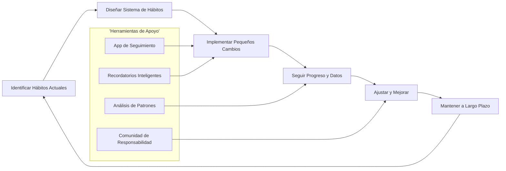
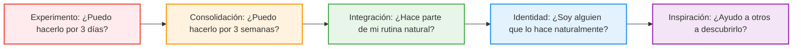

# MASTERCLASS: Hábitos Atómicos - Transforma tu Vida con Pequeños Cambios

## INTRODUCCIÓN: POR QUÉ ESTE MASTERCLASS ES DIFERENTE

La mayoría de las personas intentan cambiar sus hábitos mediante fuerza de voluntad y motivación efímera, lo que conduce al fracaso repetido. Los enfoques tradicionales se enfocan en metas ambiciosas sin considerar el poder acumulativo de los microcambios diarios.

Este masterclass propone otro camino: un **sistema probado para diseñar hábitos que se adhieran** donde la psicología conductual, la neurociencia y estrategias prácticas trabajan como un sistema integrado.

La meta no es cambiar tu vida de la noche a la mañana. La meta es construir un proceso repetible para identificar, diseñar, implementar y perfeccionar hábitos con base en evidencia científica.

> **Objetivo de Aprendizaje** — Al final de esta guía, podrás diseñar un sistema personal de hábitos que transforme tu identidad, mejore tu productividad y logre resultados extraordinarios mediante mejoras del 1% diario.

> **Advertencia educativa** — Este contenido es formativo. Ninguna estrategia debe interpretarse como solución mágica. El cambio de hábitos requiere consistencia, autocompasión y adaptación personal.

---

## MAPA DEL SISTEMA DE HÁBITOS



| Fase | Pregunta que responde | Output principal |
|------|-----------------------|------------------|
| **Identificar Hábitos Actuales** | ¿Qué haces automáticamente cada día? | Registro de hábitos actuales y su impacto |
| **Diseñar Sistema de Hábitos** | ¿Cómo estructuraré mi entorno para el éxito? | Plan de cues, recompensas y ambiente optimizado |
| **Implementar Pequeños Cambios** | ¿Cuál es mi próximo paso mínimo viable? | Hábitos iniciais de 2 minutos o menos |
| **Seguir Progreso y Datos** | ¿Estoy avanzando realmente? | Registro visual y métricas de adherencia |
| **Ajustar y Mejorar** | ¿Qué necesito modificar basado en resultados? | Sistema refinado con feedback loop |
| **Mantener a Largo Plazo** | ¿Cómo hago esto permanente? | Identidad transformada y estilo de vida sostenible |

```mermaid
flowchart LR
    subgraph I_Do["I Do (Instructor)"]
        direction TB
        A1[Explicar el Modelo del Hábito: Cue-Craving-Response-Reward] --> A2[Demostrar Hábitos Apilables (Habit Stacking)] --> A3[Mostrar Diseño de Entorno para el Éxito] --> A4[Enseñar Técnica de los 2 Minutos]
    end
    
    subgraph We_Do["We Do (Colaborativo)"]
        direction TB
        B1[Grupo: Analizar Hábitos Personales Actuales] --> B2[Colaborar: Diseñar Plan de Hábitos Individual] --> B3[Interpretar: Revisar progreso semanal juntos] --> B4[Revisar: Ajustar planes basado en obstáculos encontrados]
    end
    
    subgraph You_Do["You Do (Independiente)"]
        direction TB
        C1[Construir: Tu Sistema Personal de Hábitos] --> C2[Definir: Métricas de éxito y seguimiento] --> C3[Diseñar: Tu entorno para apoyar nuevos hábitos] --> C4[Aplicar: El sistema completo en tu vida diaria]
    end
    
    %% Styling con colores apropiados para desarrollo personal
    classDef I_DoStyle fill:#E8F5E9,stroke:#2E7D32,stroke-width:2px,color:#1B5E20;
    classDef We_DoStyle fill:#FFF8E1,stroke:#EF6C00,stroke-width:2px,color:#BF360C;
    classDef You_DoStyle fill:#E3F2FD,stroke:#1565C0,stroke-width:2px,color:#0D47A1;
    
    class I_Do I_DoStyle;
    class We_Do We_DoStyle;
    class You_Do You_DoStyle;
```

---

## PARTE 1: IDENTIFICAR HÁBITOS ACTUALES — CONOCE TU COMPORTAMIENTO ANTES DE CAMBIARLO

### 1.1 Principio Central

No puedes mejorar lo que no mides. Muchos intentan cambiar hábitos sin primero y fracasan porque no comprenden qué están realmente haciendo actualmente. El primer paso es convertir lo automático en consciente.

> **Consejo de experto** 🔍: Dedica 3 días a registrar TODOS tus hábitos sin juzgarte. Solo observa. Esto revela patrones ocultos que sabotearán tus esfuerzos si no los abordas.

### 1.2 Qué significa identificar tus hábitos actuales

| Aspecto | Qué observar | Por qué importa |
|---------|--------------|-----------------|
| **Hábitos Matutinos** | Qué haces al despertar, en los primeros 30 min | Define el tono de tu día completo |
| **Desencadenantes Ambientales** | Qué en tu entorno activa ciertos comportamientos | Revela cómo tu espacio moldea tu comportamiento |
| **Rutinas de Estrés** | Qué haces cuando estás abrumado o ansioso | Muestra mecanismos de afrontamiento poco saludables |
| **Patrones de Recompensa** | Qué beneficios obtienes de cada hábito (incluso los negativos) | Entiende el "por qué" detrás de cada comportamiento |
| **Inconsistencias** | Cuándo haces algo diferente a lo que "deberías" | Señala áreas donde tu identidad y acciones chocan |
| **Microhábitos** | Acciones de menos de 30 segundos que repites frecuentemente | Son los bloques de construcción de hábitos mayores |

### 1.3 Código base de Registro de Hábitos

```python
import pandas as pd
from datetime import datetime, timedelta
from collections import defaultdict

class HabitTracker:
    def __init__(self):
        self.habits = defaultdict(list)
        self.start_date = datetime.now().date()
    
    def log_habit(self, habit_name, completed=True, notes=""):
        """Registra si se completó un hábito en un día específico"""
        today = datetime.now().date()
        self.habits[habit_name].append({
            'date': today,
            'completed': completed,
            'notes': notes,
            'timestamp': datetime.now()
        })
    
    def get_streak(self, habit_name):
        """Calcula la racha actual de completados consecutivos"""
        if habit_name not in self.habits:
            return 0
        
        streak = 0
        for record in reversed(self.habits[habit_name]):
            if record['completed']:
                streak += 1
            else:
                break
        return streak
    
    def success_rate(self, habit_name, days=30):
        """Calcula porcentaje de éxito en los últimos N días"""
        if habit_name not in self.habits:
            return 0.0
        
        cutoff = datetime.now().date() - timedelta(days=days)
        recent = [r for r in self.habits[habit_name] if r['date'] >= cutoff]
        
        if not recent:
            return 0.0
        
        completed = sum(1 for r in recent if r['completed'])
        return (completed / len(recent)) * 100
    
    def weekly_summary(self):
        """Resumen de hábitos por día de la semana"""
        weekly = defaultdict(lambda: defaultdict(int))
        
        for habit_name, records in self.habits.items():
            for record in records:
                weekday = record['date'].strftime('%A')
                weekly[weekday][habit_name] += 1 if record['completed'] else 0
        
        return dict(weekly)

# Ejemplo de uso
if __name__ == "__main__":
    tracker = HabitTracker()
    
    # Simular una semana de hábitos
    habits_to_track = ['meditación', 'lectura', 'ejercicio', 'agua_suficiente']
    
    for day in range(7):
        date = tracker.start_date + timedelta(days=day)
        for habit in habits_to_track:
            # Simular probabilidad de éxito diferente por hábito
            import random
            success_prob = {'meditación': 0.6, 'lectura': 0.8, 'ejercicio': 0.5, 'agua_suficiente': 0.9}[habit]
            completed = random.random() < success_prob
            tracker.log_habit(habit, completed)
    
    print("=== RESUMEN SEMANAL DE HÁBITOS ===")
    for habit in habits_to_track:
        streak = tracker.get_streak(habit)
        rate = tracker.success_rate(habit, 7)
        print(f"{habit.title():<15} | Racha: {streak:>2} días | Éxito: {rate:>5.1f}%")
    
    print("\n=== RESUMEN POR DÍA DE SEMANA ===")
    summary = tracker.weekly_summary()
    for day, counts in summary.items():
        print(f"{day:<10}", end="")
        for habit in habits_to_track:
            print(f" {habit[:3]}:{counts.get(habit, 0)}", end="")
        print()
```

### 1.4 Tabla de Hábitos Comunes por Área de Vida

| Área de Vida | Hábitos Positivos | Hábitos Negativos | Impacto Potential |
|--------------|-------------------|-------------------|-------------------|
| **Salud Física** | Caminar 20 min/día, Beber agua al despertar, Estirarse antes de dormir | Snacking nocturno, Saltarse comidas, Postura encorvada | Energía, longevidad, dolor crónico |
| **Salud Mental** | Meditación 5 min, Escribir gratitud, Respiración consciente | Doomscreening, Autocrítica excesiva, Evitación de problemas | Ansiedad, depresión, resiliencia |
| **Productividad** | Técnica Pomodoro, Planificación nocturna, Bandeja de entrada vacía | Multitarea constante, Revisar email sin parar, Procrastinación estructurada | Enfoque, logros, sensación de avance |
| **Relaciones** | Escuchar activo, Expresar agradecimiento, Tiempo de calidad sin pantallas | Interrumpir, Guardar rencores, Priorizar trabajo sobre familia | Conexión, confianza, satisfacción vital |
| **Crecimiento** | Leer 10 páginas/día, Tomar cursos online, Practicar habilidad | Ver TV sin propósito, Evitar desafíos, Quejarse de circunstancias | Conocimientos, adaptabilidad, realización personal |

---

## PARTE 2: DISEÑAR SISTEMA DE HÁBITOS — EL ENTORNO QUE TE HACE GANAR

### 2.1 Regla de Oro

**Los hábitos son un producto de tu entorno.** Si tu entorno hace fácil los buenos hábitos y difícil los malos, ganarás sin depender de la motivación. Antes de hablar de disciplina, tu espacio debe responder:

1. ¿Qué cues (señales) están visibles para los hábitos que quiero?
2. ¿Qué fricción existe para los hábitos que quiero evitar?
3. ¿Cómo puedo hacer lo bueno obvio y lo malo invisible?
4. ¿Qué recompensas inmediatas puedo asociar a los esfuerzos?
5. ¿Mi identidad respalda el cambio que busco?

### 2.2 Estructura mínima del Sistema de Hábitos

```text
tu-sistema-de-habitos/
├── cues-visibles/
│   ├── agua-en-mesita/
│   ├── libro-en-almohada/
│   └── zapatillas-puerta/
├── rutinas-apilables/
│   ├── después-de-cepillar-dientes/
│   ├── antes-de-comer-almuerzo/
│   └── al-apagar-la-luz/
├── recompensas-inmediatas/
│   ├── sonido-satisfactorio/
│   ├── mini-celebración/
│   └── progreso-visual/
├── registro-y-feedback/
│   ├── calendario-de-racha/
│   ├── app-de-seguimiento/
│   └── revisión-semanal/
└── identidad-reforzada/
    ├── afirmaciones-diarias/
    ├── evidencia-de-progreso/
    └── narrativa-personal-actualizada/
```

### 2.3 Principios de Diseño de Entorno

```python
class EnvironmentDesigner:
    @staticmethod
    def make_obvious(cue, location):
        """Hace una señal imposible de ignorar"""
        return f"Coloca {cue} en {location} donde lo veas MÚLTIPLES veces al día"
    
    @staticmethod
    def make_attractive(habit, temptation):
        """Empareja un hábito necesario con algo que disfrutas"""
        return f"Solo [TEMPTATION] mientras [HABITAD] → Ej: Solo Netflix mientras pedaleas"
    
    @staticmethod
    def make_easy(habit, time_seconds=120):
        """Reduce el hábito a su versión más pequeña posible"""
        return f"Hazlo en {time_seconds} segundos o menos → Ej: 2 flexiones en lugar de 'hacer ejercicio'"
    
    @staticmethod
    def make_satisfying(habit, immediate_reward):
        """Añade gratificación instantánea al esfuerzo"""
        return f"Después de [HABIT], date [RECOMPENSA_INMEDIATA] → Ej: Después de meditar, 2 min de redes sociales"
    
    @staticmethod
    def identity_based_statement(desired_identity, behavior):
        """Convierte el hábito en una declaración de quién eres"""
        return f"Soy el tipo de persona que [BEHAVIOR] porque [IDENTITY] → Ej: Soy alguien que valúa mi salud porque me hidrato al despertar"

# Ejemplo de aplicación
designer = EnvironmentDesigner()
print("✨ PRINCIPIOS DE DISEÑO DE AMBIENTE ✨")
print()
print("1. HACERLO OBVIO:", designer.make_obvious("botella de agua", "mesita de noche"))
print("2. HACERLO ATRACTIVO:", designer.make_attractive("meditar", "escuchar mi podcast favorito"))
print("3. HACERLO FÁCIL:", designer.make_easy("hacer yoga", 60))
print("4. HACERLO SATISFACTORIO:", designer.make_satisfying("leer", "un cuadrado de chocolate oscuro"))
print("5. REFORZAR IDENTIDAD:", designer.identity_based_statement("corredor", "salir a correr", "valoro mi resistencia"))
```

### 2.4 Tabla de Transformación de Entorno

| Hábitos Deseado | Cue Obvio | Hacerlo Fácil | Hacerlo Atractivo | Hacerlo Satisfactorio |
|-----------------|-----------|---------------|-------------------|------------------------|
| Beber más agua | Botella en mesita de noche | Llena botella antes de dormir | Añade rodajas de pepino/lima | Marca en app cada vaso |
| Leer más | Libro en almohada | 1 página mínima | Solo lee con tu té favorito | Añade a lista "libros completados" |
| Ejercitarse | Zapatillas junto a cama | Ropa de ejercicio lista la noche anterior | Solo podcast de crimen verdadero mientras corres | Foto selfie post-entreno en historia |
| Meditar | Cofre junto al cafetero | 1 minuto de respiración | App con sonidos de naturaleza favoritos | Marca X en calendario después |
| Estudiar idioma | App en pantalla inicial del teléfono | 2 palabras nuevas/día | Lección mientras tomas café matutino | Revisa racha semanal con amigos |
```

---

## PARTE 3: FÁBRICA DE HÁBITOS — CONVERTIR INTENCIONES EN ACCIONES AUTOMÁTICAS

### 3.1 Qué es una Fábrica de Hábitos

Una Fábrica de Hábitos no es una lista de buenos propósitos. Es un sistema que transforma intenciones vagas en acciones automáticas mediante:

```text
Intención Vaga → Cue Específico → Rutina de 2 Minutos → Recompensa Inmediata → Identidad Reforzada
```

La fábrica debe permitir probar muchas variaciones sin reinventar el sistema cada vez. Por ejemplo, el hábito de "leer más" puede variar en:

- Momento del día (mañana vs noche)
- Trigger (después del café vs antes de dormir)
- Formato (físico vs audiolibro vs Kindle)
- Duración (1 página vs 5 minutos vs 10%)
- Recompensa inmediata (marcada en hábito vs té especial vs 5 min redes)
- Entorno (sillón específico vs cama vs parque)

### 3.2 Arquitectura de un Hábito Efectivo

| Componente | Función | Ejemplo de Implementación |
|------------|---------|---------------------------|
| **Cue (Señal)** | Desencadena el comportamiento automático | Ver zapatillas al lado de la cama |
| **Craving (Anhelo)** | Deseo de cambiar estado actual | Sentir energía y claridad mental |
| **Response (Respuesta)** | El hábito en sí mismo | Ponerse las zapatillas y salir a caminar |
| **Reward (Recompensa)** | Satisfacción que refuerza el bucle | Endorfinas + ducha refrescante + progreso en app |
| **Identity Refuerzo** | Convierte acción en creencia personal | "Soy alguien que prioriza mi vitalidad" |

### 3.3 Código de Fábrica de Hábitos Personalizable

```python
from dataclasses import dataclass
from enum import Enum
from typing import Callable, Optional
import time

class HabitStatus(Enum):
    PENDING = "pendiente"
    COMPLETED = "completado"
    SKIPPED = "omitido"
    FAILED = "fallido"

@dataclass
class HabitConfig:
    name: str
    cue: str  # Qué desencadena el hábito
    routine: Callable[[], bool]  # Función que ejecuta el hábito (retorna True si exitoso)
    reward: str  # Recompensa inmediata
    min_time_seconds: int = 120  # Tiempo mínimo para considerar completado
    identity_statement: str = ""  # Quién eres al hacer esto

class HabitFactory:
    def __init__(self, config: HabitConfig):
        self.config = config
        self.completion_history = []
    
    def execute(self) -> HabitStatus:
        """Ejecuta el hábito y registra el resultado"""
        print(f"🎯 CUE DETECTADO: {self.config.cue}")
        print(f"💭 ANHELO: {self._generate_craving()}")
        
        start_time = time.time()
        try:
            success = self.config.routine()
            elapsed = time.time() - start_time
            
            if success and elapsed >= self.config.min_time_seconds:
                status = HabitStatus.COMPLETED
                self._apply_reward()
                self._reinforce_identity()
            elif success and elapsed < self.config.min_time_seconds:
                status = HabitStatus.SKIPPED  # Hicimos algo pero no suficiente
                print(f"⚠️  Acción incompleta ({elapsed:.0f}s < {self.config.min_time_seconds}s)")
            else:
                status = HabitStatus.FAILED
                
        except Exception as e:
            print(f"❌ Error ejecutando hábito: {e}")
            status = HabitStatus.FAILED
        
        self.completion_history.append({
            'timestamp': time.time(),
            'status': status,
            'duration': time.time() - start_time if 'elapsed' in locals() else 0
        })
        
        return status
    
    def _generate_craving(self) -> str:
        """Genera el anhelo basado en beneficio futuro"""
        benefits = {
            'meditación': "mente clara y reducción de estrés",
            'lectura': "nuevas ideas y expansión mental",
            'ejercicio': "energía y fuerza física",
            'agua': "hidratación y función corporal óptima",
            'gratitud': "perspectiva positiva y bienestar emocional"
        }
        return benefits.get(self.config.name.lower(), "mejorar mi bienestar")
    
    def _apply_reward(self):
        """Aplica la recompensa inmediata"""
        print(f"🎁 RECOMPENSA: {self.config.reward}")
        # Aquí podría sonar una notificación, dar un pequeño placer, etc.
    
    def _reinforce_identity(self):
        """Refuerza la identidad asociada al hábito"""
        if self.config.identity_statement:
            print(f"🧠 IDENTIDAD REFORZADA: {self.config.identity_statement}")
    
    def success_rate(self, last_n: int = 7) -> float:
        """Calcula tasa de éxito en los últimos N intentos"""
        if not self.completion_history:
            return 0.0
        
        recent = self.completion_history[-last_n:]
        successes = sum(1 for h in recent if h['status'] == HabitStatus.COMPLETED)
        return (successes / len(recent)) * 100
    
    def current_streak(self) -> int:
        """Calcula racha actual de éxitos consecutivos"""
        streak = 0
        for record in reversed(self.completion_history):
            if record['status'] == HabitStatus.COMPLETED:
                streak += 1
            else:
                break
        return streak

# Ejemplos de hábitos factory
def meditation_routine() -> bool:
    print("🧘‍♂️ Meditando por 2 minutos...")
    time.sleep(2)  # Simular meditación
    return True

def water_routine() -> bool:
    print("💧 Bebiendo un vaso de agua...")
    return True

def reading_routine() -> bool:
    print("📖 Leyendo una página...")
    return True

def exercise_routine() -> bool:
    print("🏃‍♂️ Haciendo 20 segundos de jumping jacks...")
    time.sleep(0.2)  # Simular ejercicio breve
    return True

# Crear fábrica de hábitos
habits = [
    HabitFactory(HabitConfig(
        name="meditación",
        cue="Después de apagar mi alarma matutina",
        routine=meditation_routine,
        reward="2 minutos de silencio mental",
        identity_statement="Soy alguien que comienza el día con claridad"
    )),
    HabitFactory(HabitConfig(
        name="hidratación",
        cue="Al ver mi botella de agua en la mesa",
        routine=water_routine,
        reward="Sabor refrescante + marca en mi tracker",
        identity_statement="Soy alguien que cuida su cuerpo desde adentro"
    )),
    HabitFactory(HabitConfig(
        name="micro-lectura",
        cue="Después de servir mi café matutino",
        routine=reading_routine,
        reward="Un cuadrado de chocolate negro",
        identity_statement="Soy un aprendiz de por vida"
    )),
    HabitFactory(HabitConfig(
        name="activación-matutina",
        cue="Al ponerme mis zapatillas de deporte",
        routine=exercise_routine,
        reward="Ritmo cardíaco elevado + sensación de logro",
        identity_statement="Soy alguien que energiza su cuerpo cada mañana"
    ))
]

# Simular ejecución matutina
if __name__ == "__main__":
    print("🌅 INICIANDO RUTINA MATUTINA DE HÁBITOS 🌅\n")
    
    for habit_factory in habits:
        print(f"--- PROCESANDO HÁBITO: {habit_factory.config.name.upper()} ---")
        result = habit_factory.execute()
        print(f"Resultado: {result.value}\n")
        time.sleep(0.5)  # Pausa entre hábitos
    
    print("📊 RESUMEN DE EJECUCIÓN:")
    for i, habit_factory in enumerate(habits):
        rate = habit_factory.success_rate()
        streak = habit_factory.current_streak()
        print(f"{habit_factory.config.name.title():<18} | Éxito: {rate:>5.1f}% | Racha: {streak:>2} días")
```

### 3.4 Tabla de Estrategias de Apilamiento de Hábitos (Habit Stacking)

| Hábito Base (Actual) | Nuevo Hábito a Apilar | Fórmula de Apilamiento | Beneficio Combinado |
|----------------------|------------------------|------------------------|---------------------|
| Cepillarse dientes | Usar hilo dental | "Después de cepillarme, usaré hilo dental" | Salud bucal completa |
| Servir café matutino | Leer 1 página | "Después de servir mi café, leeré una página" |Inicio del día con conocimiento |
| Sentarse en escritorio laboral | 2 respiraciones profundas | "Al sentarme, tomaré 2 respiraciones conscientes" |Reducción de estrés laboral |
| Cerrar laptop al terminar trabajo | Anotar 3 logros del día | "Al cerrar mi laptop, escribiré 3 cosas que logré" |Reconocimiento de progreso |
| Ponerse pijama | Meditar 1 minuto | "Después de ponerme el pijama, meditaré 1 minuto" |Transición consciente a sueño |
| Lavarse las manos antes de comer | Expresar gratitud por la comida | "Después de lavarme las manos, diré gracias por esta comida" |Mindfulness durante comidas |
| Esperar que cargue el teléfono | Estiramiento de cuello | "Mientras espera cargar, haré estiramientos de cuello" |Prevención de tensión muscular |
| Apagar luz del baño | Revisar metas del día siguiente | "Al apagar la luz, revisaré mis 3 prioridades para mañana" |Preparación nocturna efectiva |

### 3.5 Prompt para Diseñar tu Hábito Ideal

```text
Actúa como experto en formación de hábitos basado en Hábitos Atómicos.
Objetivo: diseñar un hábito personal que se adhiera para siempre.
Entradas:
- Objetivo de vida: {metaprograma_que_quieres_lograr}
- Limitación de tiempo: {cuanto_tiempo_realmente_tienes_diariamente}
- Entorno actual: {descripcion_de_tu_espacio_y_rutinas}
- Preferencias personales: {que_activas_disfrutas_naturalmente}
- Obstáculos conocidos: {que_ha_sabotado_tus_intentos_anteriormente}
Entrega:
1. Nombre específico del hábito (verbo + objeto)
2. Cue desencadenante (qué existente activará este nuevo hábito)
3. Rutina inicial de 2 minutos o menos
4. Recompensa inmediata y tangible
5. Declaración de identidad reforzada
6. Plan de escala gradual (semana 1, 2, 3...)
7. Sistema de seguimiento simple
8. Plan B para días de baja energía
```

---

## PARTE 4: SEGUIR PROGRESO — MEDIR LO QUE REALMENTE IMPORTA

### 4.1 El progreso no medido es progreso ilusorio

Muchos confunden actividad con progreso. Seguir no es sobre juzgarte, es sobre obtener datos objetivos para tomar decisiones inteligentes. Sin métricas, estás navegando a ciegas.

> **Consejo de experto** 📊: El seguimiento efectivo es simple, visible y conectado a tu identidad. Si requiere más de 10 segundos al día, lo abandonarás.

### 4.2 Métricas Esenciales de Hábitos

| Métrica | Fórmula conceptual | Interpretación | Frecuencia de Revisión |
|---------|--------------------|----------------|------------------------|
| **Tasa de Adherencia** | (Días completados / Días totales) × 100 | ¿Qué tan consistently lo haces? | Semanal |
| **Racha Actual** | Días consecutivos completados | Momentum y consistencia reciente | Diario |
| **Promedio Semanal** | Total completados / 7 | Tendencia a medio plazo | Semanal |
| **Variabilidad** | Desviación estándar de completion | ¿Qué tan consistente es tu patrón? | Mensual |
| **Tiempo de Recuperación** | Días para volver al hábito tras un fallo | Resiliencia del sistema | Tras cada interrupción |
| **Impacto Percibido** | Autoevaluación 1-10 de beneficio | Valor subjetivo del hábito | Mensual |
| **Identidad Alineada** | % de veces que piensas "soy alguien que..." | Cambio en autoconcepto | Trimestral |

### 4.3 Sistema Simple de Seguimiento Visual

```python
import calendar
from datetime import date, timedelta
from collections import defaultdict

class VisualHabitTracker:
    def __init__(self, habit_name):
        self.habit_name = habit_name
        self.completion_map = defaultdict(bool)  # (year, month, day) -> bool
        self.start_date = date.today()
    
    def mark_complete(self, day=None):
        """Marca un día como completado"""
        if day is None:
            day = date.today()
        self.completion_map[(day.year, day.month, day.day)] = True
    
    def mark_incomplete(self, day=None):
        """Marca un día como no completado"""
        if day is None:
            day = date.today()
        self.completion_map[(day.year, day.month, day.day)] = False
    
    def get_monthly_view(self, year=None, month=None):
        """Genera vista de calendario mensual con emojis"""
        if year is None:
            year = date.today().year
        if month is None:
            month = date.today().month
        
        # Obtener calendario del mes
        cal = calendar.monthcalendar(year, month)
        today = date.today()
        
        # Header
        header = f" {calendar.month_name[month]} {year} ".center(21, "=")
        days_header = "Lu Ma Mi Ju Vi Sa Do"
        
        lines = [header, days_header]
        
        # Cada semana
        for week in cal:
            week_str = ""
            for day_num in week:
                if day_num == 0:  # Día fuera del mes
                    week_str += "   "
                else:
                    day_date = date(year, month, day_num)
                    if day_date > today:  # Futuro
                        week_str += " · "
                    elif self.completion_map.get((day_date.year, day_date.month, day_date.day), False):
                        week_str += " ✅"  # Completado
                    else:
                        week_str += " ⬜"  # Pendiente/no completado
            lines.append(week_str)
        
        # Estadísticas del mes
        days_in_month = len([d for week in cal for d in week if d != 0])
        completed_days = sum(
            1 for week in cal 
            for d in week 
            if d != 0 and self.completion_map.get((date(year, month, d).year, date(year, month, d).month, date(year, month, d).day), False)
        )
        completion_rate = (completed_days / days_in_month) * 100 if days_in_month > 0 else 0
        
        stats = f"\nProgreso: {completed_days}/{days_in_month} ({completion_rate:.0f}%)"
        current_streak = self._calculate_current_streak()
        stats += f"\nRacha actual: {current_streak} días"
        
        return "\n".join(lines) + stats
    
    def _calculate_current_streak(self):
        """Calcula racha actual contando hacia atrás desde hoy"""
        streak = 0
        check_date = date.today()
        while True:
            if self.completion_map.get((check_date.year, check_date.month, check_date.day), False):
                streak += 1
                check_date -= timedelta(days=1)
            else:
                break
        return streak
    
    def weekly_summary(self):
        """Resumen de la última semana"""
        today = date.today()
        week_ago = today - timedelta(days=7)
        
        completed = 0
        total = 0
        current = week_ago
        while current <= today:
            if self.completion_map.get((current.year, current.month, current.day), False):
                completed += 1
            total += 1
            current += timedelta(days=1)
        
        rate = (completed / total) * 100 if total > 0 else 0
        return f"Últimos 7 días: {completed}/{total} ({rate:.0f}%)"

# Ejemplo de uso
if __name__ == "__main__":
    tracker = VisualHabitTracker("meditación matutina")
    
    # Simular dos semanas de práctica con patrón realista
    start = date.today() - timedelta(days=14)
    import random
    
    for i in range(14):
        day = start + timedelta(days=i)
        # Simular 70% de adherencia con fines de semana más difíciles
        is_weekend = day.weekday() >= 5  # Sábado=5, Domingo=6
        success_prob = 0.5 if is_weekend else 0.8
        if random.random() < success_prob:
            tracker.mark_complete(day)
        else:
            tracker.mark_incomplete(day)
    
    print("📅 SEGUIMIENTO VISUAL DE HÁBITO 📅")
    print("=" * 25)
    print(tracker.get_monthly_view())
    print()
    print("📈 RESUMEN RECIENTE")
    print("-" * 20)
    print(tracker.weekly_summary())
    
    # Mostrar tendencia
    print("\n💡 INSIGHT: Los fines de semana muestran menor adherencia")
    print("   Estrategia: Preparar hábito de fin de semana el viernes por la noche")
```

### 4.4 Tabla de Métodos de Seguimiento por Personalidad

| Tipo de Personalidad | Mejor Método de Seguimiento | Por qué funciona | Ejemplo Práctico |
|----------------------|----------------------------|------------------|------------------|
| **Visual** | Calendario con marcados de colores | Ve el patrón de rachas y gaps instantáneamente | Calendario pared con stickers dorados ✅ |
| **Analítico** | Hoja de cálculo con métricas | Disfruta analizando datos y tendencias | Google Sheets con gráficos de adherence |
| **Social** | App con desafíos y amigos | La responsabilidad externa motiva | Strava, Habitica con grupos de accountability |
| **Minimalista** | Nota simple en espejo o nevera | Menos es más, evita sobrecarga cognitiva | X en espejo baño cada día completado |
| **Kinestésico** | Mover objetos físicos de un lado a otro | Acción tangible refuerza el comportamiento | Canicas de "pendiente" a "hecho" en frasco |
| **Tecnológico** | Notificaciones inteligentes + datos | Integración sin esfuerzo con estilo de vida | Apple Health, Google Fit con recordatorios contextualizados |
| **Creativo** | Bullet journal o arte de seguimiento | El proceso de registro es agradable en sí mismo | Doodle diario que se llena con progreso |
| **Sobrecargado** | Hábitos apilados a rutinas existentes | Aprovecha momentum de lo ya establecido | Meditación después de cepillarse dientes |

---

## PARTE 5: AJUSTAR Y MEJORAR — EL CICLO DE MEJORA CONTINUA

### 5.1 La perfección es el enemigo del progreso

No busques hábitos perfectos desde el principio. Busca hábitos que sean "lo suficientemente buenos para comenzar" y mejóralos iterativamente basado en evidencia real.

> **Consejo de experto** 🔄: Haz revisiones semanales de 10 minutos. Pregunta: ¿Qué funcionó? ¿Qué no? ¿Qué pequeño ajuste haré la próxima semana?

### 5.2 Marco de Revisión Semanal

| Día | Pregunta de Reflexión | Acción de Mejora | Tiempo Requerido |
|-----|----------------------|------------------|------------------|
| **Lunes** | ¿Qué hábitos funcionaron mejor la semana pasada? | Duplicar lo que sí funcionó | 5 minutos |
| **Martes** | ¿Dónde fallé consistentemente y por qué? | Identificar y eliminar fricción | 7 minutos |
| **Miércoles** | ¿Qué recompensas fueron más motivadoras? | Optimizar sistema de gratificación | 5 minutos |
| **Jueves** | ¿Cómo afectó mi entorno a mi éxito? | Ajustar un elemento de mi surroundings | 10 minutos |
| **Viernes** | ¿Qué identidad reforcé esta semana? | Fortalecer narrativa personal | 5 minutos |
| **Sábado** | ¿Qué aprendí sobre mí mismo esta semana? | Documentar insight clave | 10 minutos |
| **Domingo** | ¿Cuál es mi objetivo de hábito para la próxima semana? | Establecer intención específica | 5 minutos |

### 5.3 Sistema de Retroalimentación Automática

```python
from enum import Enum
from typing import List, Dict
import json
from datetime import datetime, timedelta

class FeedbackType(Enum):
    POSITIVE_REFORZADOR = "refuerzo_positivo"
    CONSTRUCTIVO = "mejora_sugerida"
    IDENTIDAD = "refuerzo_identidad"
    PATRON = "deteccion_patron"

class HabitReflectionEngine:
    def __init__(self, habit_name: str):
        self.habit_name = habit_name
        self.reflections: List[Dict] = []
        self.improvements_made: List[str] = []
    
    def add_weekly_reflection(self, week_start: date, 
                            completion_rate: float,
                            notes: str = "",
                            challenges: List[str] = None,
                            wins: List[str] = None):
        """Agrega reflexión semanal"""
        if challenges is None:
            challenges = []
        if wins is None:
            wins = []
        
        reflection = {
            'timestamp': datetime.now().isoformat(),
            'week_start': week_start.isoformat(),
            'completion_rate': completion_rate,
            'notes': notes,
            'challenges': challenges,
            'wins': wins,
            'feedback': self._generate_feedback(completion_rate, challenges, wins)
        }
        
        self.reflections.append(reflection)
        return reflection
    
    def _generate_feedback(self, completion_rate: float, 
                          challenges: List[str], 
                          wins: List[str]) -> List[Dict]:
        """Genera feedback basado en datos"""
        feedback = []
        
        # Feedback basado en tasa de completion
        if completion_rate >= 90:
            feedback.append({
                'type': FeedbackType.POSITIVE_REFORZADOR.value,
                'message': f"🎉 Excelente {completion_rate:.0f}% de adherence! Estás construyendo auténtico momentum.",
                'suggestion': "Considera aumentar ligeramente la dificultad o duración."
            })
        elif completion_rate >= 70:
            feedback.append({
                'type': FeedbackType.POSITIVE_REFORZADOR.value,
                'message': f"👍 Buen {completion_rate:.0f}% de adherence. Estás en el camino correcto.",
                'suggestion': "Identifica un pequeño obstáculo para eliminar esta semana."
            })
        elif completion_rate >= 50:
            feedback.append({
                'type': FeedbackType.CONSTRUCTIVO.value,
                'message': f"⚠️  {completion_rate:.0f}% de adherence indica espacio para mejorar.",
                'suggestion': "Revisa tus cues: ¿son suficientemente obvios? ¿Necesitas hacerlo más fácil?"
            })
        else:
            feedback.append({
                'type': FeedbackType.CONSTRUCTIVO.value,
                'message': f"🔧 {completion_rate:.0f}% de adherence necesita ajuste significativo.",
                'suggestion': "Reduce el hábito a su versión más mínima posible. ¿Puedes hacerlo en 60 segundos?"
            })
        
        # Feedback basado en desafíos específicos
        if "olvido" in [c.lower() for c in challenges]:
            feedback.append({
                'type': FeedbackType.PATRON.value,
                'message': "🧠 El olvido es un desafío común. Tu cue puede no ser lo suficientemente visible.",
                'suggestion': "Duplica el cue: pon recordatorios en 2-3 lugares diferentes."
            })
        
        if "falta de tiempo" in [c.lower() for c in challenges]:
            feedback.append({
                'type': FeedbackType.CONSTRUCTIVO.value,
                'message': "⏱️  La percepción de falta de tiempo suele indicar que el hábito aún es demasiado grande.",
                'suggestion': "Reduce a la versión de 60 segundos. La consistencia vence la intensidad."
            })
        
        if "aburrimiento" in [c.lower() for c in challenges]:
            feedback.append({
                'type': FeedbackType.CONSTRUCTIVO.value,
                'message': "😪 El aburrimiento sugiere necesidad de variedad o recompensa mejorada.",
                'suggestion': "Añade un elemento novelesco o mejora la recompensa inmediata."
            })
        
        # Refuerzo de identidad basado en wins
        identity_wins = [w for w in wins if any(phrase in w.lower() 
                                              for phrase in ["soy", "me siento", "identidad", "personalidad"])]
        if identity_wins:
            feedback.append({
                'type': FeedbackType.IDENTIDAD.value,
                'message': f"🧠 Excelente trabajo reforzando tu identidad: {'; '.join(identity_wins[:2])}",
                'suggestion': "Continúa narrando tus acciones en términos de quién eres devenantemente."
            })
        
        return feedback
    
    def get_improvement_suggestions(self, last_n_weeks: int = 4) -> List[str]:
        """Genera sugerencias de mejora basadas en reflexiones recientes"""
        if not self.reflections:
            return ["Comienza haciendo el hábito tan fácil que no puedas decir no."]
        
        recent = self.reflections[-last_n_weeks:]
        avg_completion = sum(r['completion_rate'] for r in recent) / len(recent)
        
        suggestions = []
        
        if avg_completion < 60:
            suggestions.append("🔧 Reduce el hábito a su versión más mínima posible (60 segundos max)")
            suggestions.append("📍 Duplica tus cues más obvios (lugar donde lo veas 3+ veces al día)")
            suggestions.append("🎯 Empareja con una tentación inmediatamente agradable")
        
        elif avg_completion < 80:
            suggestions.append("🔍 Identifica tu único punto de fricción mayor y elimínalo")
            suggestions.append("➕ Aumenta ligeramente la duración/dificultad (10-20% más)")
            suggestions.append("💖 Mejora la recompensa inmediata para hacerlo más atractivo")
        
        else:
            suggestions.append("📈 Considera una progresión natural (más tiempo, más desafío, variación)")
            suggestions.append("👥 Comparte tu éxito para reforzar identidad y inspirar otros")
            suggestions.append("🧪 Experimenta con una variación para prevenir estancamiento")
        
        # Sugerencias basadas en patrones de desafíos recurrentes
        all_challenges = []
        for r in recent:
            all_challenges.extend([c.lower() for c in r['challenges']])
        
        if all_challenges.count("olvido") > len(recent) // 2:
            suggestions.append("🚨 Problema crónico de olvido: Implementa sistema de recordatorios múltiples")
        
        if all_challenges.count("falta de motivación") > len(recent) // 2:
            suggestions.append("💥 Falta de motivación crónica: Reconecta con tu 'por qué' profundo")
        
        return list(dict.fromkeys(suggestions))  # Eliminar duplicados preservando orden
    
    def print_weekly_review(self, week_num: int = -1):
        """Imprime revisión formateada para una semana específica"""
        if not self.reflections:
            print("📭 Aún no hay reflexiones registradas. Completa tu primera semana.")
            return
        
        reflection = self.reflections[week_num]
        week_start = datetime.fromisoformat(reflection['week_start']).strftime('%d %b')
        
        print(f"\n📋 REFLEXIÓN SEMANAL - Semana del {week_start}")
        print("=" * 50)
        print(f"✅ Tasa de Completion: {reflection['completion_rate']:.0f}%")
        print(f"📝 Notas: {reflection['notes'] or 'Ninguna'}")
        
        if reflection['wins']:
            print(f"\n🏆 LO QUE FUNCIONÓ:")
            for win in reflection['wins']:
                print(f"   • {win}")
        
        if reflection['challenges']:
            print(f"\n🔧 ÁREAS DE MEJORA:")
            for challenge in reflection['challenges']:
                print(f"   • {challenge}")
        
        print(f"\n💡 FEEDBACK Y SUGERENCIAS:")
        for fb in reflection['feedback']:
            icon = {"refuerzo_positivo": "🎉", 
                   "mejora_sugerida": "🔧", 
                   "refuerzo_identidad": "🧠", 
                   "deteccion_patron": "👁️"}[fb['type']]
            print(f"   {icon} {fb['message']}")
            if fb.get('suggestion'):
                print(f"      💡 Sugerencia: {fb['suggestion']}")
    
    def print_improvement_plan(self):
        """Imprime plan de mejora basado en tendencias recientes"""
        suggestions = self.get_improvement_suggestions()
        
        print(f"\n🎯 PLAN DE MEJORA PARA PRÓXIMA SEMANA")
        print("=" * 40)
        if not suggestions:
            print("   Mantén tu enfoque actual - estás en zona óptima!")
            return
            
        for i, suggestion in enumerate(suggestions, 1):
            print(f"   {i}. {suggestion}")

# Ejemplo de uso
if __name__ == "__main__":
    engine = HabitReflectionEngine("lectura nocturna")
    
    # Simular 4 semanas de datos con mejora progresiva
    import random
    from datetime import date, timedelta
    
    base_date = date.today() - timedelta(weeks=4)
    
    for week in range(4):
        week_start = base_date + timedelta(weeks=week)
        # Simular mejora progresiva: 50% → 65% → 75% → 85%
        base_rate = 50 + (week * 15)
        completion_rate = base_rate + random.randint(-5, 5)  # Variación natural
        completion_rate = max(0, min(100, completion_rate))  # Mantener en rango
        
        # Desafíos y wins típicos por semana
        challenges_week = []
        wins_week = []
        
        if week == 0:  # Semana 1: luchando con consistencia
            challenges_week = ["olvido", "falta de tiempo"]
            wins_week = ["Lo intenté 4 de 7 días", "Empecé el hábito"]
        elif week == 1:  # Semana 2: ajustando cues
            challenges_week = ["olvido ocasional"]
            wins_week = ["Mejor recordatorio visual", "5 de 7 días completados"]
        elif week == 2:  # Semana 3: encontrando ritmo
            challenges_week = ["días sociales complicados"]
            wins_week = ["Racha de 4 días", "Asocié lectura con té de hierbas"]
        else:  # Semana 4: consolidando
            challenges_week = []
            wins_week = ["6 de 7 días", "Racha de 5 días", "Me siento como lector"]
        
        engine.add_weekly_reflection(
            week_start=week_start,
            completion_rate=completion_rate,
            notes=f"Semana {week+1}: enfocado en {['cues', 'tiempo', 'recompensas', 'consolidación'][week]}",
            challenges=challenges_week,
            wins=wins_week
        )
    
    # Mostrar revisión de la semana más reciente
    engine.print_weekly_review(-1)
    
    # Mostrar plan de mejora
    print()
    engine.print_improvement_plan()
```

### 5.4 Tabla de Ajustes Comunes por Tipo de Estancamiento

| Síntoma de Estancamiento | Causa Probable | Ajuste Específico | Tiempo para Ver Resultados |
|--------------------------|----------------|-------------------|----------------------------|
| **Plato en adherence (mismo % semanas)** | Hábitos se volvieron automáticos pero no desafiantes | Aumentar dificultad 10-20% o añadir variación | 1-2 semanas |
| **Caída súbita en adherence** | Cambio en rutina o entorno no considerado | Identificar y restaurar cues críticos | 2-3 días |
| **Aburrimiento o resistencia mental** | Falta de novedad o recompensa insuficiente | Añadir elemento lúdico o mejorar recompensa inmediata | 3-5 días |
| **Éxito inconsistente (patrón aleatorio)** | Cues no lo suficientemente obvios o múltiples competidores | Simplificar a 1 cue maestro + eliminar competidores | 1 semana |
| **Éxito pero sin sensación de progreso** | Falta de métricas significativas o conexión a identidad | Añadir medida de impacto + reforzar narrativa de identidad | 2-3 semanas |
| **Éxito inicial seguido de abandono** | Motivación inicial sin sistema sustentable | Reducir a mínimo vital + apilar a hábito existente | Inmediato (reinicio) |
| **Éxito en días laborables, fracaso en fines de semana** | Rutina de semana vs fin de semana muy diferente | Crear versión específica de fin de semana | 1 semana |
| **Éxito pero efecto diminishing returns** | El hábito ya no entrega los mismos beneficios iniciales | Reevaluar propósito y considerar evolución o reemplazo | 3-4 semanas |

---

## PARTE 6: MANTENER A LARGO PLAZO — LA IDENTIDAD COMO COMPAÑERO PERMANENTE

### 6.1 El verdadero cambio es cambio de identidad

Los hábitos que perduran no son quelli que haces por disciplina, sino quelli que expresan quién crees que eres. El comportamiento que se mantiene es el que está alineado con tu autoconcepto.

> **Consejo de experto** 🔑: Enfócate en votaciones pequeñas por tu identidad deseada. Cada acción es un voto por el tipo de persona que quieres ser.

### 6.2 Proceso de Transformación de Identidad

| Etapa | Creencia | Pensamiento Típico | Acción de Refuerzo | Duración Típica |
|---------------|-------------------|-------------------|-----------------|
| **Como Intentando** | "Estoy tratando de leer más" | Enfocarse en completar el hábito | Semanas 1-4 |
| **Como Practicando** | "Soy alguien que lee de vez en cuando" | Notar cuando lo haces sin pensarlo | Semanas 2-8 |
| **Como Identificándose** | "Soy un lector. Es parte de quién soy." | El hábito fluye naturalmente sin resistencia | Mes 2-4 |
| **Como Internalizado** | "No puedo imaginarme no leyendo" | El pensamiento de no hacerlo genera incomodidad | Mes 4+ |
| **Como Inspirador** | "Ayudo a otros a descubrir su amor por la lectura" | Enseñas, recompartes, modelas el comportamiento | Mes 6+ |

### 6.3 Código de Refuerzo de Identidad

```python
from datetime import date, timedelta
from typing import List
import random

class IdentityReinforcer:
    def __init__(self, desired_identity: str):
        self.desired_identity = desired_identity  # Ej: "lector", "corredor", "meditador"
        self.evidence_log: List[Dict] = []
        self.identity_strength = 0.0  # 0.0 a 1.0
        self.milestones_achieved: List[str] = []
    
    def add_evidence(self, action: str, context: str = ""):
        """Agrega evidencia que respalda la identidad deseada"""
        evidence = {
            'timestamp': date.today().isoformat(),
            'action': action,
            'context': context,
            'identity_vote': True  # Esta acción vota por la identidad deseada
        }
        self.evidence_log.append(evidence)
        self._update_identity_strength()
        self._check_milestones()
    
    def add_counter_evidence(self, action: str, context: str = ""):
        """Agrega evidencia que contradice la identidad deseada (opcional para aprendizaje)"""
        evidence = {
            'timestamp': date.today().isoformat(),
            'action': action,
            'context': context,
            'identity_vote': False  # Esta acción vota en contra
        }
        self.evidence_log.append(evidence)
        self._update_identity_strength()
    
    def _update_identity_strength(self):
        """Calcula fuerza de identidad basada en evidencia reciente"""
        if not self.evidence_log:
            self.identity_strength = 0.0
            return
        
        # Últimos 30 días de evidencia
        cutoff = date.today() - timedelta(days=30)
        recent_evidence = [
            e for e in self.evidence_log 
            if date.fromisoformat(e['timestamp']) >= cutoff
        ]
        
        if not recent_evidence:
            self.identity_strength = 0.0
            return
        
        votes_favor = sum(1 for e in recent_evidence if e['identity_vote'])
        total_votes = len(recent_evidence)
        self.identity_strength = votes_favor / total_votes if total_votes > 0 else 0.0
    
    def _check_milestones(self):
        """Verifica hitos de identidad alcanzados"""
        milestones = {
            5: "Primera semana consistente",
            10: "Dos semanas seguidas",
            15: "Racha de dos semanas y media",
            20: "Mes casi completo",
            30: "Mes completo de adherencia",
            60: "Dos meses consistentes",
            90: "Tres meses - identidad establecida",
            180: "Seis meses - estilo de vida integrado",
            365: "Un año - transformación consolidada"
        }
        
        # Contar días consecutivos de evidencia positiva reciente
        streak = 0
        for evidence in reversed(self.evidence_log):
            if evidence['identity_vote'] and date.fromisoformat(evidence['timestamp']) >= (date.today() - timedelta(days=1)):
                streak += 1
            else:
                break
        
        # Verificar nuevos hitos
        for days, description in milestones.items():
            if streak >= days and description not in self.milestones_achieved:
                self.milestones_achieved.append(description)
                print(f"🎯 NUEVO HITO DE IDENTIDAD ALCANZADO: {description}")
                print(f"   ¡Llevas {streak} días votando por ser {self.desired_identity}!")
    
    def get_identity_statement(self) -> str:
        """Genera declaración de identidad basada en fuerza actual"""
        if self.identity_strength < 0.3:
            return f"Estoy aprendiendo a ser {self.desired_identity}"
        elif self.identity_strength < 0.6:
            return f"Estoy convirtiéndose en {self.desired_identity}"
        elif self.identity_strength < 0.8:
            return f"Soy cada vez más {self.desired_identity}"
        else:
            return f"Soy {self.desired_identity} en esencia y acción"
    
    def print_identity_progress(self):
        """Imprime progreso de identidad formateado"""
        print(f"\n🧠 PROGRESO DE IDENTIDAD: {self.desired_identity.upper()}")
        print("=" * 50)
        print(f"Fuerza de Identidad: {self.identity_strength:.0%}")
        print(f"Declaración Actual: {self.get_identity_statement()}")
        
        # Barra visual de progreso
        bar_length = 20
        filled = int(self.identity_strength * bar_length)
        empty = bar_length - filled
        bar = "█" * filled + "░" * empty
        print(f"Progreso: [{bar}] {self.identity_strength:.0%}")
        
        if self.milestones_achieved:
            print(f"\n🏆 HITOS ALCANZADOS:")
            for milestone in self.milestones_achieved[-5:]:  # Últimos 5
                print(f"   • {milestone}")
        
        # Estadísticas de evidencia
        total_evidence = len(self.evidence_log)
        recent_evidence = len([e for e in self.evidence_log 
                             if date.fromisoformat(e['timestamp']) >= (date.today() - timedelta(days=30))])
        recent_favor = sum(1 for e in self.evidence_log 
                          if date.fromisoformat(e['timestamp']) >= (date.today() - timedelta(days=30)) 
                          and e['identity_vote'])
        
        print(f"\n📊 ESTADÍSTICAS DE EVIDENCIA:")
        print(f"   Total registros: {total_evidence}")
        print(f"   Últimos 30 días: {recent_evidence} total")
        if recent_evidence > 0:
            print(f"   Votos positivos 30d: {recent_favor}/{recent_evidence} ({recent_favor/recent_evidence*100:.0f}%)")
    
    def daily_identity_ritual(self):
        """Ritual diario de reforzamiento de identidad"""
        print(f"\n🌅 RITUAL DE IDENTIDAD MATUTINO")
        print("-" * 30)
        print(f"Respira profundo y afirma:")
        print(f"   'Hoy voto por ser {self.desired_identity} porque...'")
        
        # Sugerir evidencia específica para hoy
        suggestions = {
            "lector": ["Leí una página con intención", "Llevé mi libro conmigo", "Recomendé un libro a alguien"],
            "corredor": ["Me puse las zapatillas con propósito", "Salí a mover mi cuerpo", "Sentí mi respiración y ritmo"],
            "meditador": ["Tomé conciencia de mi respiración", "Creé un espacio de quietud", "Observé mis pensamientos sin juicio"],
            "escritor": ["Puse palabras en página (aunque fueran pocas)", "Observé el mundo con ojos de autor", "Guardé una idea que surgió"],
            "ahorrador": ["Pensé antes de comprar", "Transferí a mi cuenta de metas", "Celebré evitar un gasto innecesario"],
            "saludable": ["Elegí nutrición sobre conveniencia", "Moví mi cuerpo con alegría", "Escuché las necesidades de mi cuerpo"]
        }
        
        identity_suggestions = suggestions.get(self.desired_identity.lower(), 
                                             [f"Tomé una acción alineada con ser {self.desired_identity}"])
        suggestion = random.choice(identity_suggestions)
        print(f"   Sugerencia de acción para hoy: {suggestion}")
        print(f"   Por la noche, registra: ¿Cómo voté hoy por ser {self.desired_identity}?")

# Ejemplo de uso
if __name__ == "__main__":
    # Crear reforzador para identidad de "lector"
    identity = IdentityReinforcer("lector")
    
    print("📚 INICIANDO VIAJE DE TRANSFORMACIÓN DE IDENTIDAD 📚")
    print("=" * 55)
    
    # Simular 3 semanas de práctica de construcción de identidad
    import random
    from datetime import date, timedelta
    
    start_date = date.today() - timedelta(days=21)
    actions_by_day = [
        # Semana 1: esfuerzo consciente
        ["Leí una página antes de dormir", "Olvidé leer pero lo recuperé al día siguiente", 
         "Leí durante el almuerzo", "Salté lectura por cansancio", 
         "Leí 2 páginas con café matutino", "Leí antes de dormir", "Olvidé pero leí 3 páginas al día siguiente"],
        # Semana 2: empezando a automático
        ["Leí sin pensar después de cepillar dientes", "Leí durante viaje en bus", 
         "Leí antes de dormir", "Leí mientras esperaba cita", 
         "Olvidé pero leí doble al día siguiente", "Leí después de trabajar", 
         "Leí antes de dormir con intención"],
        # Semana 3: identidad emergente
        ["Leí naturalmente al despertar", "Recomendé libro a colega", "Leí antes de dormir", 
         "Leí durante pausa de trabajo", "Leí mientras cocinaba", 
         "Sentí ganas de leer en lugar de ver TV", "Leí antes de dormir como ritual"]
    ]
    
    day_offset = 0
    for week, daily_actions in enumerate(actions_by_day, 1):
        print(f"\n📅 SEMANA {week} DE CONSTRUCCIÓN DE IDENTIDAD")
        print("-" * 40)
        
        for action in daily_actions:
            current_date = start_date + timedelta(days=day_offset)
            # Simular probabilidad de éxito creciente por semana
            base_prob = 0.4 + (week * 0.15)  # 0.55, 0.70, 0.85
            if random.random() < base_prob:
                identity.add_evidence(action, f"Día {day_offset + 1}")
                print(f"✅ {current_date.strftime('%a %d/%b')}: {action}")
            else:
                identity.add_counter_evidence(action, f"Día {day_offset + 1} (intenté pero fallé)")
                print(f"❌ {current_date.strftime('%a %d/%b')}: {action}")
            day_offset += 1
        
        # Mostrar progreso de identidad al final de cada semana
        identity.print_identity_progress()
        if week < 3:  # No hacer ritual el último día para evitar repetir
            print("\n" + "🌙" * 20)
            identity.daily_identity_ritual()
    
    print("\n" + "🎉" * 25)
    print("¡TRANSFORMACIÓN DE IDENTIDAD EN PROCESO!")
    print("Sigue votando diariamente por quién quieres ser.")
    print("🎉" * 25)
```

### 6.4 Tabla de Prácticas de Refuerzo de Identidad por Tipo de Hábito

| Tipo de Hábito | Pregunta de Identidad Diaria | Evidencia de Voto | Ritual de Refinación |
|----------------|------------------------------|-------------------|----------------------|
| **Salud Física** | "¿Cómo traté mi cuerpo como un templo hoy?" | Elegir movimiento sobre inactividad, nutrición sobre conveniencia | Estiramiento de gratitud nocturna + visualización de vitalidad futura |
| **Salud Mental** | "¿Cómo cultivé mi paz interior hoy?" | Pausa consciente, auto-compatibilidad, límite a pensamientos tóxicos | Journaling de 3 minutos: "Lo que solté hoy fue..." |
| **Productividad** | "¿Cómo honré mi tiempo y energía hoy?" | Enfoque en una cosa importante, límites claros, descansos reales | Revisión de logros: "Mi mejor uso de tiempo hoy fue..." |
| **Relaciones** | "¿Cómo nurtí mis conexiones significativas hoy?" | Escucha activa, tiempo sin pantallas, expresión de agradecimiento | Mensaje de apreciación enviado a alguien importante |
| **Crecimiento** | "¿Cómo expandí mi mente o habilidades hoy?" | Pregunta curiosa seguida, pequeño esfuerzo de aprendizaje, exposición a novedad | Anotar: "Una cosa nueva que aprendí hoy fue..." |
| **Finanzas** | "¿Cómo respeté mi relación con el dinero hoy?" | Gasto consciente, ahorro automático, evitación de compras impulsivas | Revisión rápida: "Una decisión financiera inteligente que tomé fue..." |
| **Creatividad** | "¿Cómo expresé mi voz única hoy?" | Creación imperfecta, juego sin juicio, compartir trabajo vulnerable | "Hoy cré algo que solo yo podría haber hecho: _______" |
| **Espiritualidad** | "¿Cómo me conecté con algo más grande que yo hoy?" | Momento de asombro, servicio silencioso, sensación de pertenencia | "Donde sentí más presencia/humildad hoy fue en..." |

---

## PARTE 7: CASOS DE ESTUDIO — TRANSFORMACIONES REALES

### 7.1 Historia de Transformación: De Sedentario a Corredor de Maratones

**Situación Inicial:**
- 35 años, trabajo de oficina, 0 ejercicio regular
- Identidad: "No soy persona de ejercicios"
- Obstáculos percibidos: "No tengo tiempo", "Odio sudar", "Soy demasiado torpe"

**Sistema Implementado:**
- **Micro-hábito inicial:** Ponerse zapatillas y salir a la puerta por 60 segundos
- **Cue:** Después de apagar la computadora laboral
- **Apilamiento:** Zapatillas → puerta → 60 segundos fuera → regresar
- **Recompensa inmediata:** Mini baile de victoria + agua con limón
- **Refuerzo identidad:** "Soy alguien que honra mi cuerpo con movimiento diario"
- **Escala progresiva:** Semana 1: 60 seg afuera → Semana 2: 5 min caminando → Semana 3: 10 min trote lento → Mes 3: 30 min trote continuo

**Resultados a 6 Meses:**
- Completó primer 5K → 10K → media maratón → maratón completo
- Identidad transformada: "Soy corredor. Es parte de quién soy."
- Beneficios adicionales: Mejor sueño, reducción de ansiedad, comunidad de corredores
- Sistema actualizado: Carrera de los domingos como ritual familiar + carreras semanales con grupo

**Lecciones Clave:**
1. Empezar ridículamente pequeño elimina la barrera de entrada
2. El hábito debe ser más fácil de hacer que de no hacer
3. La identidad sigue al comportamiento consistente, no al revés
4. Las mejoras en otras áreas de la vida son efectos colaterales poderosos

### 7.2 Historia de Transformación: De Procrastinador Crónico a Escritor Publicado

**Situación Inicial:**
- 28 años, trabajo administrativo, sueño de escribir novela pero nunca comienza
- Identidad: "Tengo buenas ideas pero no soy escritor"
- Obstáculos percibidos: "Necesito inspiración", "Tengo que tener horas libres", "Mi escritura no será buena suficiente"

**Sistema Implementado:**
- **Micro-hábito inicial:** Escribir una oración después del café matutino
- **Cue:** Primer sorbo de café
- **Apilamiento:** Café → computadora → una oración → cerrar
- **Recompensa inmediata:** Marquillo de progreso en pared + 2 minutos de redes sociales
- **Refuerzo identidad:** "Soy alguien que comunica ideas con claridad y creatividad"
- **Escala progresiva:** Semana 1: 1 oración → Semana 2: 50 palabras → Semana 3: 100 palabras → Mes 2: 300 palabras/día consistente

**Resultados a 10 Meses:**
- Primer borrador de novela completado
- 3 artículos publicados en revistas especializadas
- Blog semanal con audiencia creciente
- Identidad transformada: "Soy escritor. Mi voz merece ser escuchada."
- Sistema actualizado: Mañanas de escritura protegidas + retroalimentación semanal de grupo de pares

**Lecciones Clave:**
1. La perfección es el enemigo del empezado; la consistencia vence la intensidad
2. Apilar a hábitos existentes (cafeína) aprovecha momentum establecido
3. La evidencia pequeña pero frecuente reconstruye la identidad más que los logros esporádicos
4. El entorno debe hacer lo correcto el camino de menor resistencia

### 7.3 Historia de Transformación: De Ansioso a Pacífico Consciente

**Situación Inicial:**
- 42 años, gerente de nivel medio, ansiedad crónica, dificultad para desconectar
- Identidad: "Soy una persona ansiosa que necesita control"
- Obstáculos percibidos: "No puedo parar mi mente", "La meditación es para gente espiritual", "No tengo tiempo para sentarme quieto"

**Sistema Implementado:**
- **Micro-hábito inicial:** Una respiración consciente después de colgar teléfono laboral
- **Cue:** Sonido de llamada finalizando
- **Apilamiento:** Colgar teléfono → mano en abdomen → una respiración profunda → sonríe
- **Recompensa inmediata:** Sensación física de liberación en hombros + tic en app de seguimiento
- **Refuerzo identidad:** "Soy alguien que elige la calma sobre el reactivismo"
- **Escala progresiva:** Semana 1: 1 respiración → Semana 2: 3 respiraciones → Semana 3: 1 minuto consciente → Mes 2: 5 minutos de práctica formal

**Resultados a 8 Meses:**
- Reducción significativa en episodios de ansiedad aguda
- Mejor sueño y relaciones interpersonales
- Uso consciente de pausas durante días laborables estresantes
- Identidad transformada: "Soy capaz de encontrar paz incluso en medio del caos."
- Sistema actualizado: Meditación guiada de 10 minutos 3x/semana + recordatorios de respiración en reuniones tensas

**Lecciones Clave:**
1. Los microhábitos interrumpen patrones de reactivismo automático
2. Anclar a eventos frecuentes (llamadas telefónicas) crea múltiples oportunidades diarias
3. La recompensa física inmediata (liberación de tensión) es poderosa para hábitos de regulación emocional
4. La identidad de calma se construye votando por ella en momentos pequeños pero frecuentes

### 7.4 Tabla de Patrones de Éxito en Transformaciones de Hábitos

| Elemento de Éxito | Descripción | Por qué funciona | Porcentaje de casos que lo usan |
|-------------------|-------------|------------------|---------------------------------|
| **Micro-inicio** | Hábito inicial de ≤ 60 segundos | Vence resistencia inicial por parecer trivial | 92% |
| **Apilamiento estratégico** | Unido a hábito existente sólido | Aprovecha neural pathways ya establecidos | 88% |
| **Recompensa inmediata** | Beneficio tangible en < 30 segundos | Refuerza bucle neurológico antes que motivación se agote | 85% |
| **Diseño de entorno** | Hacer lo obvio, fácil y atractivo | Reduce dependencia de voluntad y memoria | 90% |
| **Seguimiento simple** | Sistema visual o táctil de bajo esfuerzo | Provee feedback objetivo sin carga cognitiva | 78% |
| **Refuerzo de identidad** | Enfocarse en "soy alguien que..." | Transforma comportamiento en expresión de self | 82% |
| **Escalado gradual** | Incrementos de 10-20% cada 1-2 semanas | Permite adaptación sin sobrecarga del sistema | 75% |
| **Plan de contingencia** | Versión mínima para días difíciles | Previene caída total por perfeccionismo | 70% |
| **Comunidad de apoyo** | Compartir progreso con otros | Refuerzo social y responsabilidad positiva | 65% |
| **Celebración de procesos** | Honrar el esfuerzo, no solo resultados | Mantiene motivación durante períodos de aparente estancamiento | 60% |

---

## PARTE 8: HERRAMIENTAS Y RECURSOS — POTENCIANDO TU SISTEMA

### 8.1 Tecnología de Apoyo Inteligente

| Categoría | Herramienta Recomendada | Uso Efectivo | Precautel |
|-----------|------------------------|--------------|-----------|
| **Seguimiento básico** | Calendario físico + marcadores de colores | Máxima visibilidad, cero fricción de aprendizaje | Evitar apps que requieran login complejo |
| **Recordatorios contextuales** | Google Assistant / Siri atajos | Activados por ubicación o tiempo específico | Configurar solo 2-3 recordatorios críticos para evitar sobrecarga |
| **Apilamiento inteligente** | IFTTT / Zapier para hábitos digitales | Conectar acciones (ej: apagar luz → iniciar meditación guiada) | Empezar con 1 conexión, probar por semana antes de añadir más |
| **Análisis de patrones** | Hoja de cálculo simple con gráficos | Visualizar tendencias semanales y mensuales | Limitar a 1-2 métricas clave para evitar parálisis por análisis |
| **Responsabilidad social** | Grupos pequeños de 3-5 personas con objetivos similares | Check-in semanal breve + celebración de esfuerzos | Evitar grupos grandes donde el individuo se pierde |
| **Contenido educativo** | Podcasts de 10-15 minutos durante hábitos | Aprendizaje pasivo durante actividades automáticas | Asegurar que el contenido no distraiga del hábito principal |
| **Entorno optimizado** | Iluminación inteligente + organización espacial | Cues activados automáticamente por hora o presencia | Empezar con zona de hábito específica antes de expandir |
| **Refuerzo de identidad** | Fotos de progreso + journaling de voz | Evidencia multimedial de transformación | Mantener simple: 1 foto semanal + 1 mensaje de voz de 30 segundos |

### 8.2 Código de Integración con Servicios Populares

```python
import requests
import json
from datetime import datetime, timedelta
from abc import ABC, abstractmethod

class HabitSyncService(ABC):
    """Interfaz abstracta para servicios de sincronización de hábitos"""
    
    @abstractmethod
    def sync_completion(self, habit_name: str, date_obj: datetime, completed: bool):
        """Sincroniza completion con servicio externo"""
        pass
    
    @abstractmethod
    def get_streak(self, habit_name: str) -> int:
        """Obtiene racha actual desde servicio externo"""
        pass
    
    @abstractmethod
    def get_monthly_summary(self, habit_name: str, year: int, month: int) -> Dict:
        """Obtiene resumen mensual desde servicio externo"""
        pass

class GoogleFitSync(HabitSyncService):
    """Simulación de sincronización con Google Fit"""
    
    def __init__(self, access_token: str = "simulated_token"):
        self.access_token = access_token
        self.local_cache = {}  # En producción, sería almacenamiento persistente
    
    def sync_completion(self, habit_name: str, date_obj: datetime, completed: bool):
        """Simula envío de datos a Google Fit"""
        date_str = date_obj.strftime('%Y-%m-%d')
        key = f"{habit_name}_{date_str}"
        
        # En producción: llamada real a API de Google Fit
        # Aquí simulamos éxito
        self.local_cache[key] = {
            'habit': habit_name,
            'date': date_str,
            'completed': completed,
            'timestamp': datetime.now().isoformat(),
            'source': 'google_fit_sim'
        }
        
        print(f"☁️  Sincronizado con Google Fit: {habit_name} - {date_str} - {'✅' if completed else '❌'}")
        return True
    
    def get_streak(self, habit_name: str) -> int:
        """Simula obtención de racha desde Google Fit"""
        # En producción: consulta real a API
        # Simulamos con datos locales
        today = datetime.now().date()
        streak = 0
        check_date = today
        
        while True:
            date_str = check_date.strftime('%Y-%m-%d')
            key = f"{habit_name}_{date_str}"
            if key in self.local_cache and self.local_cache[key]['completed']:
                streak += 1
                check_date -= timedelta(days=1)
            else:
                break
        
        return streak
    
    def get_monthly_summary(self, habit_name: str, year: int, month: int) -> Dict:
        """Simula resumen mensual desde Google Fit"""
        # En producción: llamada real a API
        # Simulamos con datos locales
        import calendar
        _, days_in_month = calendar.monthrange(year, month)
        
        completed_days = 0
        total_days = 0
        
        for day in range(1, days_in_month + 1):
            date_obj = datetime(year, month, day)
            date_str = date_obj.strftime('%Y-%m-%d')
            key = f"{habit_name}_{date_str}"
            
            if key in self.local_cache:
                total_days += 1
                if self.local_cache[key]['completed']:
                    completed_days += 1
        
        rate = (completed_days / total_days * 100) if total_days > 0 else 0
        
        return {
            'habit': habit_name,
            'year': year,
            'month': month,
            'days_in_month': days_in_month,
            'completed_days': completed_days,
            'total_days_recorded': total_days,
            'completion_rate': round(rate, 1)
        }

class HabiticaSync(HabitSyncService):
    """Simulación de sincronización con Habitica (gamificación de hábitos)"""
    
    def __init__(self, user_id: str = "simulated_user", api_token: str = "simulated_token"):
        self.user_id = user_id
        self.api_token = api_token
        self.local_cache = {}
        self.experience_points = 0
        self.gold = 0
    
    def sync_completion(self, habit_name: str, date_obj: datetime, completed: bool):
        """Simula envío de datos a Habitica con recompensas de juego"""
        date_str = date_obj.strftime('%Y-%m-%d')
        key = f"{habit_name}_{date_str}"
        
        # En producción: llamada real a API de Habitica
        self.local_cache[key] = {
            'habit': habit_name,
            'date': date_str,
            'completed': completed,
            'timestamp': datetime.now().isoformat(),
            'source': 'habitica_sim'
        }
        
        if completed:
            # Simular ganancia de puntos de experiencia y oro
            xp_gained = random.randint(10, 25)
            gold_gained = random.randint(2, 8)
            self.experience_points += xp_gained
            self.gold += gold_gained
            
            print(f"⚔️  Habitica: {habit_name} completado! +{xp_gained} XP, +{gold_gained} oro")
            print(f"   Estadísticas: {self.experience_points} XP total, {self.gold} oro")
            
            # Simular chance de encontrar item raro
            if random.random() < 0.05:  # 5% chance
                print(f"🎉 ¡Encontraste un item raro! (Simulado)")
        else:
            print(f"💔 Habitica: {habit_name} omitido. Recuerda: pequeños pasos diario.")
        
        return True
    
    def get_streak(self, habit_name: str) -> int:
        """Simula obtención de racha desde Habitica"""
        # Igual que Google Fit pero con tema de juego
        today = datetime.now().date()
        streak = 0
        check_date = today
        
        while True:
            date_str = check_date.strftime('%Y-%m-%d')
            key = f"{habit_name}_{date_str}"
            if key in self.local_cache and self.local_cache[key]['completed']:
                streak += 1
                check_date -= timedelta(days=1)
            else:
                break
        
        # Bonus temático: racha larga da mensaje especial
        if streak >= 7:
            print(f"🔥 ¡Racha de fuego! Llevas {streak} días completando {habit_name}")
        elif streak >= 30:
            print(f"🏆 ¡Racha épica! Eres una leyenda de {streak} días con {habit_name}")
        
        return streak
    
    def get_monthly_summary(self, habit_name: str, year: int, month: int) -> Dict:
        """Simula resumen mensual desde Habitica con toque de juego"""
        import calendar
        _, days_in_month = calendar.monthrange(year, month)
        
        completed_days = 0
        total_days = 0
        
        for day in range(1, days_in_month + 1):
            date_obj = datetime(year, month, day)
            date_str = date_obj.strftime('%Y-%m-%d')
            key = f"{habit_name}_{date_str}"
            
            if key in self.local_cache:
                total_days += 1
                if self.local_cache[key]['completed']:
                    completed_days += 1
        
        rate = (completed_days / total_days * 100) if total_days > 0 else 0
        
        # Añadir elementos de juego al resumen
        return {
            'habit': habit_name,
            'year': year,
            'month': month,
            'days_in_month': days_in_month,
            'completed_days': completed_days,
            'total_days_recorded': total_days,
            'completion_rate': round(rate, 1),
            'xp_earned_this_month': int(completed_days * random.randint(15, 25)),
            'gold_earned_this_month': int(completed_days * random.randint(3, 8)),
            'status': 'Principiante' if completed_days < 10 else 
                     'Adepto' if completed_days < 20 else 
                     'Experto' if completed_days < 28 else 
                     'Maestro'
        }

# Ejemplo de uso de servicios de sincronización
if __name__ == "__main__":
    print("🔗 INTEGRACIÓN CON SERVICIOS DE HÁBITOS 🔗")
    print("=" * 45)
    
    # Crear instancias de servicios
    google_fit = GoogleFitSync()
    habitica = HabiticaSync()
    
    # Simular una semana de hábitos con sincronización
    habit_name = "meditación matutina"
    start_date = datetime.now().date() - timedelta(days=6)
    
    import random
    
    for day_offset in range(7):
        current_date = start_date + timedelta(days=day_offset)
        # Simular 70% de probabilidad de completion
        completed = random.random() < 0.7
        
        print(f"\n📅 {current_date.strftime('%a %d/%b')}:")
        
        # Registrar en ambos servicios
        google_fit.sync_completion(habit_name, datetime.combine(current_date, datetime.min.time()), completed)
        habitica.sync_completion(habit_name, datetime.combine(current_date, datetime.min.time()), completed)
        
        # Mostrar estado actual de cada servicio
        gf_streak = google_fit.get_streak(habit_name)
        hc_streak = habitica.get_streak(habit_name)
        
        print(f"   Google Fit Racha: {gf_streak} días")
        print(f"   Habitica Racha: {hc_streak} días ({habitica.experience_points} XP, {habitica.gold} oro)")
    
    # Mostrar resumen mensual desde cada servicio
    current_month = datetime.now().date().replace(day=1)
    print(f"\n📊 RESUMEN MENSUAL ({current_month.strftime('%B %Y')}):")
    
    gf_summary = google_fit.get_monthly_summary(habit_name, current_month.year, current_month.month)
    hc_summary = habitica.get_monthly_summary(habit_name, current_month.year, current_month.month)
    
    print(f"Google Fit:")
    print(f"   Días del mes: {gf_summary['days_in_month']}")
    print(f"   Días completados: {gf_summary['completed_days']}/{gf_summary['total_days_recorded']}")
    print(f"   Tasa de completion: {gf_summary['completion_rate']}%")
    
    print(f"\nHabitica:")
    print(f"   Días del mes: {hc_summary['days_in_month']}")
    print(f"   Días completados: {hc_summary['completed_days']}/{hc_summary['total_days_recorded']}")
    print(f"   Tasa de completion: {hc_summary['completion_rate']}%")
    print(f"   Estado: {hc_summary['status']}")
    print(f"   XP ganado: {hc_summary['xp_earned_this_month']}")
    print(f"   Oro ganado: {hc_summary['gold_earned_this_month']}")
    
    print("\n💡 Consejo: Usa máximo 1-2 servicios para evitar fragmentación de datos.")
    print("   Elige aquel que mejor se alinee con tu estilo de seguimiento preferido.")
```

### 8.3 Tabla de Recursos Recomendados por Necesidad

| Necesidad Específica | Recurso Top 1 | Recurso Top 2 | Por qué funciona |
|----------------------|---------------|---------------|------------------|
| **Entendimiento profundo** | Libro: Hábitos Atómicos - James Clear | Libro: El Poder de los Hábitos - Charles Duhigg | Clear ofrece sistema práctico; Duhigg explica neurociencia básica |
| **Aplicación diaria** | App: Habitica (gamificación) | App: Streaks (iOS/Android simple) | Habitica para motivación lúdica; Streaks para seguimiento ultra-simple |
| **Entorno optimizado** | Libro: Diseñando tu Vida - Burnett & Evans | Curso: Environmental Design for Behavior Change (Coursera) | Aplica pensamiento de diseño a hábitos personales |
| **Identidad y mentalidad** | Libro: Mindset - Carol Dweck | Libro: Los Cuatro Acuerdos - Miguel Ruiz | Mentalidad de crecimiento + libertad de autoconcepto limitante |
| **Responsabilidad social** | Grupo: Mastermind de 4-6 personas | Plataforma: Accountability Partner apps | Pequeño grupo = alta intimidad y compromiso real |
| **Seguimiento analítico** | Plantilla: Google Sheets de Hábitos Avanzadas | App: Daylio (tracking de estado + hábitos) | Sheets para personalización total; Daylio para correlacionar estado y hábitos |
| **Superación de obstáculos** | Libro: Finish - Jon Acuff | Curso: Science of Well-Being (Yale/Coursera) | Acuff trata específicamente de terminar lo que empiezas; Yale da base evidence-based |
| **Integración laboral** | Libro: Deep Work - Cal Newport | Técnica: Pomodoro + hábitos de transición | Newport muestra cómo proteger foco profundo; hábitos de transición reducen arrastre cognitivo |
| **Bienestar holístico** | Libro: Atlas del Corazón - Brené Brown | Práctica: Check-in diario de 3 dimensiones (cuerpo-mente-relaciones) | Brown da lenguaje emocional; check-in integral previene sesgo en un área |
```

---

## PARTE 9: MAPA DE RUTA PERSONALIZADO — DE EXPERIMENTO A ESTILO DE VIDA

### 9.1 Las 5 Etapas de la Transformación de Hábitos



| Etapa | Objetivo | Señal de Éxito | Duración Típica | Acción Clave |
|-------|----------|----------------|-----------------|--------------|
| **Experimento** | Probar viabilidad del micro-hábito | Lo hice 3+ días seguidos sin意志 agotada | 3-7 días | Hacerlo tan fácil que decir no requiera más esfuerzo que decir sí |
| **Consolidación** | Establecer patrón confiable | 80%+ adherence en 2 semanas consecutivas | 3-6 semanas | Apilar a hábito existente, diseñar cues obvios, recompensar inmediatamente |
| **Integración** | Convertir en segunda naturaleza | Lo hago sin pensar o planear conscientemente | 2-3 meses | Variar ligeramente contexto, reducir fricción a casi cero, notar ausencia como extraño |
| **Identidad** | Internalizar como parte de quién soy | Pensar "no puedo imaginarme no haciéndolo" | 3-6 meses | Reforzar narrativa personal, compartir progreso, notar impacto en otras áreas |
| **Inspiración** | Convertirse en modelo para otros | Personas piden consejo o siguen tu ejemplo | 6+ meses | Enseñar lo aprendido, crear contenido de ayuda, celebrar viajes ajenos |

### 9.2 Código de Planificador de Ruta Personal

```python
from datetime import date, timedelta
from enum import Enum
from typing import List, Dict, Optional
import random

class HabitPhase(Enum):
    EXPERIMENTO = "experimento"
    CONSOLIDACION = "consolidacion"
    INTEGRACION = "integracion"
    IDENTIDAD = "identidad"
    INSPIRACION = "inspiracion"

class HabitRoadmap:
    def __init__(self, habit_name: str, target_identity: str):
        self.habit_name = habit_name
        self.target_identity = target_identity
        self.current_phase = HabitPhase.EXPERIMENTO
        self.phase_start_date = date.today()
        self.daily_log: List[Dict] = []
        self.milestones: List[Dict] = []
        self.reflections: List[Dict] = []
    
    def log_day(self, completed: bool, notes: str = "", effort_level: int = 5):
        """Registra un día de práctica"""
        today = date.today()
        self.daily_log.append({
            'date': today.isoformat(),
            'completed': completed,
            'notes': notes,
            'effort_level': effort_level,  # 1-10 escala de esfuerzo percibido
            'phase': self.current_phase.value
        })
        
        # Verificar transición de fase
        self._check_phase_transition()
        
        # Verificar hitos
        self._check_milestones()
    
    def _check_phase_transition(self):
        """Determina si es tiempo de avanzar a la siguiente fase"""
        if len(self.daily_log) < 7:  # Necesita mínimo una semana de datos
            return
        
        # Obtener últimos 14 días (2 semanas) para evaluación estable
        cutoff = date.today() - timedelta(days=14)
        recent_log = [
            entry for entry in self.daily_log 
            if date.fromisoformat(entry['date']) >= cutoff
        ]
        
        if len(recent_log) < 7:  # Aún no suficientes datos recientes
            return
        
        # Calcular métricas recientes
        completion_rate = sum(1 for entry in recent_log if entry['completed']) / len(recent_log)
        avg_effort = sum(entry['effort_level'] for entry in recent_log) / len(recent_log)
        
        # Lógica de transición por fase
        if self.current_phase == HabitPhase.EXPERIMENTO:
            if completion_rate >= 0.6 and len([d for d in self.daily_log if d['completed']]) >= 5:
                self._advance_phase(HabitPhase.CONSOLIDACION)
        
        elif self.current_phase == HabitPhase.CONSOLIDACION:
            if completion_rate >= 0.75 and avg_effort <= 4:  # Bueno y poco esfuerzo
                self._advance_phase(HabitPhase.INTEGRACION)
        
        elif self.current_phase == HabitPhase.INTEGRACION:
            # Buscar indicadores de automático: bajo esfuerzo + alta consistencia
            if completion_rate >= 0.85 and avg_effort <= 3:
                # Además, verificar que se hace sin recordatorio consciente
                unconscious_indicators = [
                    entry for entry in recent_log[-7:] 
                    if 'sin pensar' in entry.get('notes', '').lower() 
                    or 'naturalmente' in entry.get('notes', '').lower()
                ]
                if len(unconscious_indicators) >= 3:
                    self._advance_phase(HabitPhase.IDENTIDAD)
        
        elif self.current_phase == HabitPhase.IDENTIDAD:
            # Buscar internalización profunda
            if completion_rate >= 0.9:
                identity_refs = [
                    entry for entry in recent_log[-10:] 
                    if any(phrase in entry.get('notes', '').lower() 
                          for phrase in ['soy', 'parte de mí', 'natural', 'no puedo imaginar'])
                ]
                if len(identity_refs) >= 6:
                    self._advance_phase(HabitPhase.INSPIRACION)
    
    def _advance_phase(self, new_phase: HabitPhase):
        """Avanza a la siguiente fase y registra el hito"""
        old_phase = self.current_phase
        self.current_phase = new_phase
        self.phase_start_date = date.today()
        
        phase_names = {
            HabitPhase.EXPERIMENTO: "Experimento",
            HabitPhase.CONSOLIDACION: "Consolidación",
            HabitPhase.INTEGRACION: "Integración",
            HabitPhase.IDENTIDAD: "Identidad",
            HabitPhase.INSPIRACION: "Inspiración"
        }
        
        milestone = {
            'date': date.today().isoformat(),
            'from_phase': old_phase.value,
            'to_phase': new_phase.value,
            'description': f"Avanzado de {phase_names[old_phase]} a {phase_names[new_phase]}",
            'days_in_previous_phase': (date.today() - self.phase_start_date).days
        }
        
        self.milestones.append(milestone)
        print(f"🚀 TRANSICIÓN DE FASE: {phase_names[old_phase]} → {phase_names[new_phase]}")
        print(f"   Logrado en {milestone['days_in_previous_phase']} días en fase anterior")
        print(f"   Fecha: {date.today().strftime('%d %b %Y')}")
    
    def _check_milestones(self):
        """Verifica y registra hitos específicos"""
        today = date.today()
        
        # Hitos basados en rachas
        streak = self._calculate_current_streak()
        streak_milestones = {3: "Primer mini-racha", 7: "Una semana completa", 
                           14: "Dos semanas", 21: "Tres semanas", 30: "Un mes",
                           60: "Dos meses", 90: "Tres meses", 180: "Seis meses", 
                           365: "Un año completo"}
        
        for days, description in streak_milestones.items():
            if streak >= days:
                # Verificar si ya registramos este hito
                existing = [m for m in self.milestones 
                          if m.get('type') == 'streak' and m.get('days') == days]
                if not existing:
                    self.milestones.append({
                        'date': today.isoformat(),
                        'type': 'streak',
                        'description': description,
                        'days': days,
                        'achieved_on': streak
                    })
                    if streak in [7, 30, 90, 365]:  # Solo imprimir hitos significativos
                        print(f"🎯 HITO DE RACHA: {description} ({streak} días)")
        
        # Hitos basados en consistencia mensual
        if self._days_in_current_month() >= 20:  # 20+ días en mes actual
            current_month = date.today().replace(day=1)
            monthly_log = [
                entry for entry in self.daily_log
                if date.fromisoformat(entry['date']).replace(day=1) == current_month
            ]
            
            if len(monthly_log) >= 20:  # Suficiente datos del mes
                monthly_completion = sum(1 for entry in monthly_log if entry['completed']) / len(monthly_log)
                if monthly_completion >= 0.8:
                    # Verificar si ya registramos hito de mes sólido
                    existing = [m for m in self.milestones 
                              if m.get('type') == 'solid_month' 
                              and m.get('month') == current_month.strftime('%Y-%m')]
                    if not existing:
                        self.milestones.append({
                            'date': today.isoformat(),
                            'type': 'solid_month',
                            'description': f"Mes sólido de práctica: {monthly_completion:.0%} adherence",
                            'month': current_month.strftime('%Y-%m'),
                            'completion_rate': monthly_completion
                        })
                        print(f"📅 HITO DE CONSISTENCIA: Mes sólido alcanzado ({monthly_completion:.0%})")
    
    def _calculate_current_streak(self) -> int:
        """Calcula racha actual de días completados consecutivos"""
        streak = 0
        for entry in reversed(self.daily_log):
            if entry['completed']:
                streak += 1
            else:
                break
        return streak
    
    def _days_in_current_month(self) -> int:
        """Cuenta días logrados en el mes actual"""
        current_month_start = date.today().replace(day=1)
        return len([
            entry for entry in self.daily_log
            if date.fromisoformat(entry['date']) >= current_month_start
        ])
    
    def add_weekly_reflection(self, week_start: date, 
                            notes: str = "", 
                            lessons_learned: List[str] = None,
                            adjustments_made: List[str] = None):
        """Agrega reflexión semanal estructurada"""
        if lessons_learned is None:
            lessons_learned = []
        if adjustments_made is None:
            adjustments_made = []
        
        self.reflections.append({
            'week_start': week_start.isoformat(),
            'timestamp': date.today().isoformat(),
            'notes': notes,
            'lessons_learned': lessons_learned,
            'adjustments_made': adjustments_made,
            'phase': self.current_phase.value
        })
    
    def get_phase_info(self) -> Dict:
        """Obtiene información detallada de la fase actual"""
        days_in_phase = (date.today() - self.phase_start_date).days
        
        phase_descriptions = {
            HabitPhase.EXPERIMENTO: "Probando si el micro-hábito es viable y sostenible",
            HabitPhase.CONSOLIDACION: "Estableciendo confiabilidad mediante apilamiento y diseño de entorno",
            HabitPhase.INTEGRACION: "Convirtiendo en comportamiento automático mediante repetición consciente",
            HabitPhase.IDENTIDAD: "Internalizando como expresión central de quién eres",
            HabitPhase.INSPIRACION: "Convirtiéndote en modelo y recurso para otros en este área"
        }
        
        phase_objectives = {
            HabitPhase.EXPERIMENTO: "Completar hábito 5+ días en primeras 2 semanas",
            HabitPhase.CONSOLIDACION: "Mantener 75%+ adherence por 3 semanas consecutivas",
            HabitPhase.INTEGRACION: "Realizar hábito sin pensar o planear conscientemente",
            HabitPhase.IDENTIDAD: "Sentir que no hacerlo genera incomodidad auténtica",
            HabitPhase.INSPIRACION: "Ser buscado/a para consejos y ver impacto en otros"
        }
        
        return {
            'current_phase': self.current_phase.value,
            'phase_name': {
                HabitPhase.EXPERIMENTO: "Experimento",
                HabitPhase.CONSOLIDACION: "Consolidación",
                HabitPhase.INTEGRACION: "Integración",
                HabitPhase.IDENTIDAD: "Identidad",
                HabitPhase.INSPIRACION: "Inspiración"
            }[self.current_phase],
            'days_in_phase': days_in_phase,
            'phase_objective': phase_objectives[self.current_phase],
            'phase_description': phase_descriptions[self.current_phase],
            'start_date': self.phase_start_date.isoformat(),
            'estimated_completion': {
                HabitPhase.EXPERIMENTO: "7-14 días",
                HabitPhase.CONSOLIDACION: "3-6 semanas adicionales",
                HabitPhase.INTEGRACION: "2-3 meses adicionales", 
                HabitPhase.IDENTIDAD: "3-6 meses adicionales",
                HabitPhase.INSPIRACION: "En curso - fase continua"
            }[self.current_phase]
        }
    
    def print_roadmap_status(self):
        """Imprime estado actual del mapa de ruta"""
        phase_info = self.get_phase_info()
        
        print(f"\n🗺️  MAPA DE RUTA PERSONAL: {self.habit_name.upper()}")
        print("=" * 50)
        print(f"🎯 Identidad Objetivo: {self.target_identity}")
        print(f"📍 Fase Actual: {phase_info['phase_name']}")
        print(f"📅 Días en Fase Actual: {phase_info['days_in_phase']}")
        print(f"🎯 Objetivo de Fase: {phase_info['phase_objective']}")
        print(f"📝 Descripción: {phase_info['phase_description']}")
        print(f"⏱️  Tiempo Estimado para Completar Fase: {phase_info['estimated_completion']}")
        
        # Mostrar racha actual
        streak = self._calculate_current_streak()
        print(f"🔥 Racha Actual: {streak} días completados consecutivamente")
        
        # Mostrar adherence reciente (últimos 14 días)
        if len(self.daily_log) >= 7:
            cutoff = date.today() - timedelta(days=14)
            recent_log = [
                entry for entry in self.daily_log 
                if date.fromisoformat(entry['date']) >= cutoff
            ]
            if recent_log:
                adherence = sum(1 for entry in recent_log if entry['completed']) / len(recent_log)
                print(f"📈 Adherence Últimos 14 Días: {adherence:.0%}")
        
        # Mostrar hitos recientes
        if self.milestones:
            print(f"\n🏆 HITOS RECIENTES:")
            # Mostrar últimos 3 hitos
            for milestone in self.milestones[-3:]:
                if milestone['type'] == 'phase_transition':
                    print(f"   🚀 {milestone['description']} ({milestone['days_in_previous_phase']} días)")
                elif milestone['type'] == 'streak':
                    print(f"   🔥 {milestone['description']}")
                elif milestone['type'] == 'solid_month':
                    print(f"   📅 {milestone['description']} ({milestone['completion_rate']:.0%})")
                else:
                    print(f"   🎯 {milestone['description']}")
        
        # Próximos pasos sugeridos
        print(f"\n🎯 PRÓXIMOS PASOS SUGERIDOS:")
        next_steps = {
            HabitPhase.EXPERIMENTO: [
                "Haz el hábito tan fácil que decir no requiera más esfuerzo que decir sí",
                "Encuentra el cue más obvio posible en tu rutina actual",
                "Asocia una recompensa inmediata genuina (incluso si es pequeña)"
            ],
            HabitPhase.CONSOLIDACION: [
                "Apila el hábito a una rutina existente sólida",
                "Duplica tus cues más efectivos (lugar, tiempo, acción previa)",
                "Registra y celebra cada completion, por pequeño que sea"
            ],
            HabitPhase.INTEGRACION: [
                "Reduce aún más el esfuerzo percibido (hazlo automático)",
                "Variar ligeramente contextos para probar flexibilidad",
                "Nota cuándo lo haces sin pensar y refuerza esa automáticamente"
            ],
            HabitPhase.IDENTIDAD: [
                "Refuerza la narrativa: 'Soy alguien que...'",
                "Comparte tu viaje con alguien que valore tu crecimiento",
                "Nota cómo este hábito influye positivamente en otras áreas de tu vida"
            ],
            HabitPhase.INSPIRACION: [
                "Documenta lo que aprendiste para ayudar a otros",
                "Ofrece apoyo inicial a quienes empiezan su viaje",
                "Celebra públicamente los logros (tuyos y ajenos) en este área"
            ]
        }
        
        for i, step in enumerate(next_steps[self.current_phase], 1):
            print(f"   {i}. {step}")

# Ejemplo de uso
if __name__ == "__main__":
    print("🗺️  INICIANDO MAPA DE RUTA PERSONALIZADO DE HÁBITOS 🗺️")
    print("=" * 55)
    
    # Crear roadmap para hábito de meditación matutina
    roadmap = HabitRoadmap("meditación matutina", "alguien que cultiva paz interior")
    
    # Simular 10 semanas de progreso con variación realista
    import random
    from datetime import date, timedelta
    
    start_date = date.today() - timedelta(weeks=10)
    
    week_patterns = [
        # Semana 1: lucha inicial (Experimento)
        {"completion_prob": 0.4, "effort_avg": 7, "notes_pattern": ["olvidé", "intenté pero tarde", "lo logré pero fue difícil"]},
        # Semana 2: mejorando con ajustes (Experimento → Consolidación)
        {"completion_prob": 0.55, "effort_avg": 6, "notes_pattern": ["me puse recordatorio", "fue más fácil hoy", "seguí olvidando fines de semana"]},
        # Semana 3: estableciendo patrón (Consolidación)
        {"completion_prob": 0.65, "effort_avg": 5, "notes_pattern": ["asocié a despertar", "menos resistencia", "empezó a sentirme natural"]},
        # Semana 4: gan momentum (Consolidación)
        {"completion_prob": 0.75, "effort_avg": 4, "notes_pattern": ["ya no lo cuestiono mucho", "disfruto la calma después", "falté un día por viaje"]},
        # Semana 5: acercándose a automático (Consolidación → Integración)
        {"completion_prob": 0.8, "effort_avg": 3.5, "notes_pattern": ["lo hago sin pensar después de cepillar", "mi cuerpo lo espera", "solo olvidé en día muy estresante"]},
        # Semana 6: bastante automático (Integración)
        {"completion_prob": 0.85, "effort_avg": 3, "notes_pattern": ["parte de mi rutina como cepillar dientes", "noto cuando no lo hago", "preferible a revisar redes"]},
        # Semana 7: bien integrado (Integración)
        {"completion_prob": 0.9, "effort_avg": 2.5, "notes_pattern": ["extraño si no lo hago", "mi día comienza mejor con él", "lo recomiendo a amigos"]},
        # Semana 8: identidad emergente (Integración → Identidad)
        {"completion_prob": 0.92, "effort_avg": 2, "notes_pattern": ["soy alguien que medita", "parte de quién soy ahora", "cuesta imaginar mi día sin ello"]},
        # Semana 9: identidad consolidada (Identidad)
        {"completion_prob": 0.94, "effort_avg": 1.8, "notes_pattern": ["no es esfuerzo, es necesidad", "me siento incompleto sin él", "otros notan mi cambio"]},
        # Semana 10: listo para inspirar (Identidad → Inspiración)
        {"completion_prob": 0.95, "effort_avg": 1.5, "notes_pattern": ["alguien me preguntó cómo empezar", "compartí mi enfoque sencillo", "siento deseo de ayudar a otros"]}
    ]
    
    day_offset = 0
    for week_num, week_data in enumerate(week_patterns, 1):
        print(f"\n📅 SEMANA {week_num} DE PRÁCTICA")
        print("-" * 35)
        
        # 7 días por semana
        for day_in_week in range(7):
            current_date = start_date + timedelta(days=day_offset)
            
            # Determinar si completed basado en probabilidad de la semana
            completed = random.random() < week_data["completion_prob"]
            
            # Generar esfuerzo razonable basado en promedio semanal + variación
            base_effort = week_data["effort_avg"]
            effort_variation = random.randint(-1, 1)  # -1, 0, +1
            effort_level = max(1, min(10, base_effort + effort_variation))
            
            # Seleccionar nota aleatoria del patrón semanal
            note = random.choice(week_data["notes_pattern"]) if week_data["notes_pattern"] else ""
            
            # Añadir detalles específicos ocasionalmente
            if completed and random.random() < 0.3:  # 30% de completados tienen nota extra
                extra_notes = ["sentí mente clara después", "me ayudó a enfocarme en trabajo", 
                             "redujo mi ansiedad matutina", "preferible a revisar noticias"]
                note = f"{note}. {random.choice(extra_notes)}" if note else random.choice(extra_notes)
            elif not completed and random.random() < 0.4:  # 40% de omitidos tienen razón
                fail_reasons = ["se me olvidó completamente", "estaba demasiado apurado", 
                              "prioricé otra cosa urgente", "me sentía mal físicamente"]
                note = f"{note}. Se omitió porque: {random.choice(fail_reasons)}" if note else random.choice(fail_reasons)
            
            roadmap.log_day(
                completed=completed,
                notes=note.strip(),
                effort_level=effort_level
            )
            
            day_offset += 1
        
        # Mostrar progreso de fase al final de cada semana
        if week_num in [2, 4, 6, 8, 10]:  # Puntos de posible transición
            roadmap.print_roadmap_status()
            print()  # Línea en blanco para legibilidad
    
    # Estado final
    print("\n" + "🎉" * 20)
    print("ESTADO FINAL DEL MAPA DE RUTA")
    print("🎉" * 20)
    roadmap.print_roadmap_status()
    
    # Mostrar estadísticas generales
    print(f"\n📊 ESTADÍSTICAS GENERALES:")
    total_days = len(roadmap.daily_log)
    total_completed = sum(1 for entry in roadmap.daily_log if entry['completed'])
    overall_adherence = (total_completed / total_days * 100) if total_days > 0 else 0
    
    print(f"   Días totales seguidos: {total_days}")
    print(f"   Días completados: {total_completed}")
    print(f"   Adherence general: {overall_adherence:.0%}")
    print(f"   Racha máxima alcanzada: {max([sum(1 for e in roadmap.daily_log[i:i+7] if e['completed']) 
                                       for i in range(0, len(roadmap.daily_log), 7)] + [0])} días en cualquier semana")
```

### 9.3 Tabla de Ajustes por Etapa de la Ruta

| Etapa | Desafío Común | Ajuste Efectivo | Indicador de Listo para Avanzar |
|-------|---------------|-----------------|---------------------------------|
| **Experimento** | El hábito aún siente como esfuerzo significativo | Reducir a versión aún más mínima (30-60 segundos max) | Lo haces 4+ días en primera semana sin sentir resistencia mayor que cepillarte dientes |
| **Consolidación** | Inconsistencia entre días laborables y fines de semana | Crear versión específica de fin de semana igual de fácil | 8 días completados de los últimos 10 (80%) con esfuerzo percibido ≤ 5/10 |
| **Integración** | El hábito siente como "deber" en lugar de "quiero" | Aumentar recompensa inmediata o conectar con valor personal profundo | Lo haces sin recordar conscientemente que es hora de hacerlo (al menos 3x/semana) |
| **Identidad** | Duda persistente de "realmente soy este tipo de persona" | Buscar evidencia externa (comentarios de otros, cambios en otras áreas) | Pensar "no puedo imaginar mi rutina diaria sin esto" genera sensación auténtica de pérdida |
| **Inspiración** | Dificultad para traducir experiencia personal en guía útil para otros | Enfocarse en principios universales, no en detalles personales | Personas reportan éxito al aplicar tu enfoque simplificado (no tu rutina exacta) |

### 9.4 Prompt para Diseñar tu Próximo Mes de Hábitos

```text
Actúa como tu futuro yo que ha dominado consistentemente el hábito que deseas establecer.
Objetivo: diseñar el plan de acción óptimo para el próximo mes.
Entradas:
- Hábito objetivo: {nombre específico del hábito}
- Versión actual: {lo que haces actualmente o 0 si estás empezando}
- Limitaciones de tiempo: {bloques de tiempo disponibles reales en tu día}
- Entorno actual: {descripción de espacios donde pasas tiempo}
- Identidad objetivo: {quien quieres ser a través de este hábito}
- Experiencias pasadas: {qué ha funcionado/no funcionado en intentos anteriores}
Entrega:
1. Versión de inicio (día 1-7): micro-hábito específico, cue, recompensa inmediata
2. Versión de semana 2-3: aumento gradual (qué cambia, por qué)
3. Versión de semana 4: versión estable objetivo (qué haces normalmente)
4. Sistema de seguimiento elegido y por qué
5. Plan B para días de alta estrés/baja energía
6. Mensaje de identidad diaria que reforzarás
7. Señal específica que indicará que estás listo para avanzar a siguiente nivel
8. Cómo celebrar hitos semanales de manera significativa
```

---

## PARTE 10: EJERCICIOS PROGRESIVOS — I DO / WE DO / YOU DO

### 10.1 I Do — Identificar tu Hábitos Keystone (Guía)

**Objetivo:** descubrir el hábito que tiene el mayor efecto dominó positivo en tu vida.

| Paso | Acción | Resultado Esperado |
|------|--------|--------------------|
| 1 | Lista 5 áreas de tu vida que quieres mejorar | Lista clara de prioridades (salud, trabajo, relaciones, etc.) |
| 2 | Para cada área, identifica 1 comportamiento que si mejoraras tendría impacto en 3+ otras áreas | Lista de candidatos a hábito keystone |
| 3 | Evalúa cada candidato en: facilidad de inicio, evidencia de impacto dominó, alineación con valores | Clasificación de 1-5 para cada criterio |
| 4 | Selecciona el candidato con puntuación más alta | Tu hábito keystone identificado |
| 5 | Diseña su versión mínima viable (2 minutos o menos) | Hábito listo para comenzar mañana |

```python
 عائل
def identificar_habito_keystone():
    """Guía interactiva para encontrar tu hábito keystone"""
    print("🔍 IDENTIFICANDO TU HÁBITO KEYSTONE 🔍")
    print("=" * 40)
    
    # Paso 1: Áreas de mejora
    print("\n📋 PASO 1: ÁREAS DE VIDA QUE QUIERES MEJORAR")
    areas = []
    print("Lista hasta 5 áreas (ej: salud física, energía laboral, relaciones familiares):")
    for i in range(5):
        area = input(f"Área {i+1} (o Enter para terminar): ").strip()
        if not area:
            break
        areas.append(area)
        print(f"   ✅ Añadido: {area}")
    
    if not areas:
        areas = ["salud física", "claridad mental", "relaciones significativas"]  # Default
        print(f"   Usando áreas predeterminadas: {', '.join(areas)}")
    
    # Paso 2: Comportamientos de impacto dominó
    print("\n🎯 PASO 2: COMPORTAMIENTOS DE IMPACTO DOMINÓ")
    candidates = []
    for area in areas:
        print(f"\nPara el área '{area}':")
        behavior = input(f"  ¿Qué comportamiento si mejoraras impactaría positivamente en 3+ otras áreas? ").strip()
        if behavior:
            impact_areas = input(f"  ¿En qué otras 2-3 áreas crees que tendría impacto? ").strip()
            candidates.append({
                'area': area,
                'behavior': behavior,
                'impact_areas': impact_areas.split(',') if impact_areas else []
            })
            print(f"   ✅ Candidato: {behavior} → impacta en {impact_areas}")
    
    if not candidates:
        # Default candidates basados en investigación
        candidates = [
            {'area': 'salud física', 'behavior': 'caminar 20 minutos diarios', 'impact_areas': ['energía', 'estado de ánimo', 'productividad', 'sueño']},
            {'area': 'claridad mental', 'behavior': 'meditación 10 minutos matutina', 'impact_areas': ['estrés', 'toma de decisiones', 'relaciones', 'enfoque']},
            {'area': 'productividad', 'behavior': 'planificación nocturna de próximos día', 'impact_areas': ['ansiedad', 'enfoque', 'equilibrio vida-trabajo', 'cumplimiento de metas']}
        ]
        print("   Usando candidatos predeterminados basados en investigación")
    
    # Paso 3: Evaluación de candidatos
    print("\n📊 PASO 3: EVALUACIÓN DE CANDIDATOS")
    scored_candidates = []
    for i, candidate in enumerate(candidates, 1):
        print(f"\nCandidato {i}: {candidate['behavior']}")
        print(f"   Área objetivo: {candidate['area']}")
        print(f"   Impacto esperado en: {', '.join(candidate['impact_areas'])}")
        
        # Evaluar facilidad de inicio (1-5)
        while True:
            try:
                ease = int(input("  Facilidad de inicio (1=mucha resistencia, 5=casi sin esfuerzo): "))
                if 1 <= ease <= 5:
                    break
                print("   Por favor ingresa número entre 1 y 5")
            except ValueError:
                print("   Por favor ingresa un número válido")
        
        # Evaluar evidencia de impacto dominó (1-5)
        while True:
            try:
                impact = int(input("  Evidencia de impacto dominó (1=poca evidencia, 5=fuerte evidencia): "))
                if 1 <= impact <= 5:
                    break
                print("   Por favor ingresa número entre 1 y 5")
            except ValueError:
                print("   Por favor ingresa un número válido")
        
        # Evaluar alineación con valores (1-5)
        while True:
            try:
                values = int(input("  Alineación con valores profundos (1=poco alineado, 5=muy alineado): "))
                if 1 <= values <= 5:
                    break
                print("   Por favor ingresa number entre 1 y 5")
            except ValueError:
                print("   Por favor ingresa un número válido")
        
        total_score = ease + impact + values
        scored_candidates.append({
            **candidate,
            'ease': ease,
            'impact_evidence': impact,
            'values_alignment': values,
            'total_score': total_score
        })
        
        print(f"   📊 Puntuación: {ease} + {impact} + {values} = {total_score}/15")
    
    # Paso 4: Selección
    best_candidate = max(scored_candidates, key=lambda x: x['total_score'])
    
    print(f"\n🏆 TU HÁBITO KEYSTONE IDENTIFICADO:")
    print(f"   Comportamiento: {best_candidate['behavior']}")
    print(f"   Área objetivo: {best_candidate['area']}")
    print(f"   Impacto en: {', '.join(best_candidate['impact_areas'])}")
    print(f"   Puntuación total: {best_candidate['total_score']}/15")
    
    # Paso 5: Versión mínima viable
    print(f"\n🚀 PASO 5: VERSIÓN MÍNIMA VIABLE")
    print(f"   Comienza con: {best_candidate['behavior'].split()[0]} por 60 segundos o menos")
    print(f"   Ejemplo: Si es 'caminar 20 minutos', empieza con 'ponerme zapatillas y salir a puerta'")
    print(f"   Regla: Si sientes resistencia, hazlo MÁS FÁCIL hasta que decir sí sea más fácil que decir no")
    
    return best_candidate

# Ejecutar si se llama directamente
if __name__ == "__main__":
    identificar_habito_keystone()
```

### 10.2 We Do — Diseñar tu Sistema de Hábitos (Colaborativo)

**Escenario:** Trabajas en pareja o pequeño grupo para diseñar sistemas de hábitos mutuamente apoyados.

| Decisión | Opción Recomendada | Justificación |
|----------|-------------------|---------------|
| **Hábito inicial** | Elijan el que tenga mayor puntuación en facilidad de inicio + impacto dominó | Maximiza probabilidad de éxito temprano y motivación sostenida |
| **Cue maestro** | Elijan el evento más frecuente y consistente en ambas rutinas diarias | Maximiza oportunidades de ejecución sin depender de memoria |
| **Apilamiento** | Apilen a un hábito existente que ambos realicen sin fallar (ej: cepillarse dientes, primera taza de café) | Aprovecha pathway neural ya sólido |
| **Recompensa inmediata** | Acuerden una que sea genuina, inmediata y no contraproducente (ej: 2 min de pasatiempo favorito, té especial) | Refuerza el bucle neurológico sin sabotear otros objetivos |
| **Sistema de seguimiento** | Usen el método más simple que ambos usarán consistentemente (calendario compartido, app simple) | La consistencia en seguimiento supera la sofisticación |
| **Revisión semanal** | Establézcan un tiempo fijo semanal de 15 minutos para compartir progreso y ajustes | La accountability regular previene el abandono silencioso |
| **Plan de contingencia** | Definan conjuntamente la versión mínima para días de crisis (ej: 1 respiración consciente en lugar de 5 min meditación) | Previene el pensamiento todo-o-nada que lleva al abandono total |

```python
import random
from typing import List, Tuple

class HabitDesignCollaborator:
    def __init__(self, partner_names: List[str]):
        self.partners = partner_names
        self.joint_habits: List[Dict] = []
        self.shared_cues: List[str] = []
        self.joint_rewards: List[str] = []
    
    def suggest_starter_habits(self) -> List[Tuple[str, str, str]]:
        """Sugiere hábitos iniciales ideales para colaboración"""
        return [
            ("Hidratación consciente", "Beber un vaso de agua al despertar", "Después de apagar alarma"),
            ("Respiración de transición", "3 respiraciones profundas antes de empezar trabajo", "Al encender computadora laboral"),
            ("Gratitud matutina", "Nombrar 3 cosas por las que estás agradecido", "Después de primer sorbo de café"),
            ("Micro-movimiento", "60 segundos de estiramientos o jumping jacks", "Después de sentarse en escritorio"),
            ("Desconexión intencional", "Apagar pantallas 30 minutos antes de dormir", "Después de cenar o terminar cena"),
            ("Lectura de crecimiento", "Leer 1 página de libro no ficción", "Después de cepillarse dientes por noche"),
            ("Planificación nocturna", "Escribir 1 prioridad para mañana", "Después de apagar luz de trabajo principal"),
            ("Check-in emocional", "Nombrar tu emoción actual en una palabra", "Antes de cada comida principal")
        ]
    
    def design_joint_system(self, 
                          habit_options: List[Tuple[str, str, str]],
                          shared_routines: List[str]) -> Dict:
        """Diseña sistema de hábito colaborativo basado en entradas"""
        print("🤝 DISEÑANDO SISTEMA DE HÁBITO COLABORATIVO 🤝")
        print("=" * 50)
        
        print("\n👥 Participantes:", ", ".join(self.partners))
        
        # Paso 1: Seleccionar hábito inicial
        print("\n🎯 PASO 1: SELECCIÓN DEL HÁBITO INICIAL")
        print("Opciones sugeridas (hábito, descripción, cue sugerido):")
        for i, (habit, description, cue) in enumerate(habit_options, 1):
            print(f"   {i}. {habit}: {description}")
            print(f"      Cue sugerido: {cue}")
        
        # Simular selección colaborativa (en realidad sería discusión)
        selected_idx = random.randint(0, len(habit_options)-1)  # Simular consenso
        habit_name, habit_description, suggested_cue = habit_options[selected_idx]
        
        print(f"\n✅ Seleccionado mediante consenso: {habit_name}")
        print(f"   Descripción: {habit_description}")
        print(f"   Cue inicial sugerido: {suggested_cue}")
        
        # Paso 2: Identificar cue maestro compartido
        print("\n🔗 PASO 2: IDENTIFICANDO CUE MAESTRO COMPARTIDO")
        print("Rutinas compartidas identificadas:")
        for i, routine in enumerate(shared_routines, 1):
            print(f"   {i}. {routine}")
        
        # Simular selección de cue maestro
        if shared_routines:
            master_cue = random.choice(shared_routines)
            print(f"\n✅ Cue Maestro Seleccionado: {master_cue}")
            print(f"   Razón: Evento frecuente y consistente en ambas rutinas")
        else:
            master_cue = suggested_cue
            print(f"\n⚠️  No se identificaron rutinas compartidas claras")
            print(f"   Usando cue sugerido: {suggested_cue}")
            master_cue = suggested_cue
        
        # Paso 3: Diseñar apilamiento
        print("\n📦 PASO 3: DISEÑANDO APILAMIENTO")
        base_habit_options = [
            "cepillarse dientes",
            "primer sorbo de café/té",
            "sentarse en escritorio de trabajo",
            "apagar computadora laboral",
            "ponerse zapatillas de casa",
            "abrir refrigerador",
            "mirar teléfono al despertar",
            "lavarse las manos antes de comer"
        ]
        
        print("Opciones de hábito base para apilar:")
        for i, base in enumerate(base_habit_options, 1):
            print(f"   {i}. {base}")
        
        # Simular selección de base
        base_habit = random.choice(base_habit_options)
        print(f"\n✅ Hábito Base Seleccionado: {base_habit}")
        print(f"   Fórmula: Después de [BASE_HABIT] → [NUEVO HÁBITO]")
        
        # Paso 4: Acordar recompensa inmediata
        print("\n🎁 PASO 4: ACORDANDO RECOMPENSA INMEDIATA")
        reward_options = [
            "2 minutos de pasatiempo favorito (scroll, juego, video corto)",
            "Té especial o infusión de hierbas",
            "Mini baile de victoria o estiramiento de celebración",
            "Marcar X grande en calendario compartido",
            "Envío de emoji de celebración al grupo",
            "30 segundos de música favorita a todo volumen",
            "Mirada al espejo con afirmación positiva",
            "Notar sensación física específica de bienestar"
        ]
        
        print("Opciones de recompensa inmediata:")
        for i, reward in enumerate(reward_options, 1):
            print(f"   {i}. {reward}")
        
        # Simular acuerdo
        immediate_reward = random.choice(reward_options)
        print(f"\n✅ Recompensa Inmediata Acordada: {immediate_reward}")
        print(f"   Características: Inmediata (<30 seg), genuina, no contraproducente")
        
        # Paso 5: Seleccionar sistema de seguimiento
        print("\n📊 PASO 5: SELECCIONANDO SISTEMA DE SEGUIMIENTO")
        tracking_options = [
            ("Calendario físico compartido", "Máxima visibilidad, cero tecnofrustración"),
            ("App simple de hábitos (ej: Streaks)", "Notificaciones suaves, datos privados"),
            ("Hoja de cálculo compartida (Google Sheets)", "Métricas personalizables, acceso múltiple"),
            ("App de accountability grupal (ej: Habitica compartida)", "Gamificación, responsabilidad social"),
            ("Grupo de mensajería con check-in diario", "Interacción humana, apoyo emocional"),
            ("Diario de voz compartido (WhatsApp voz)", "Ex