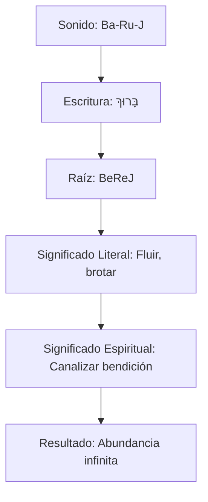
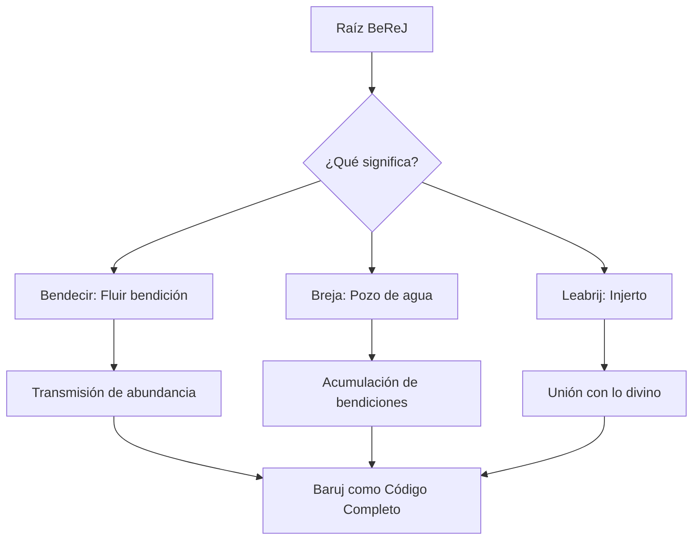
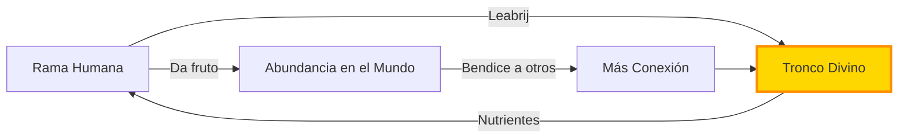
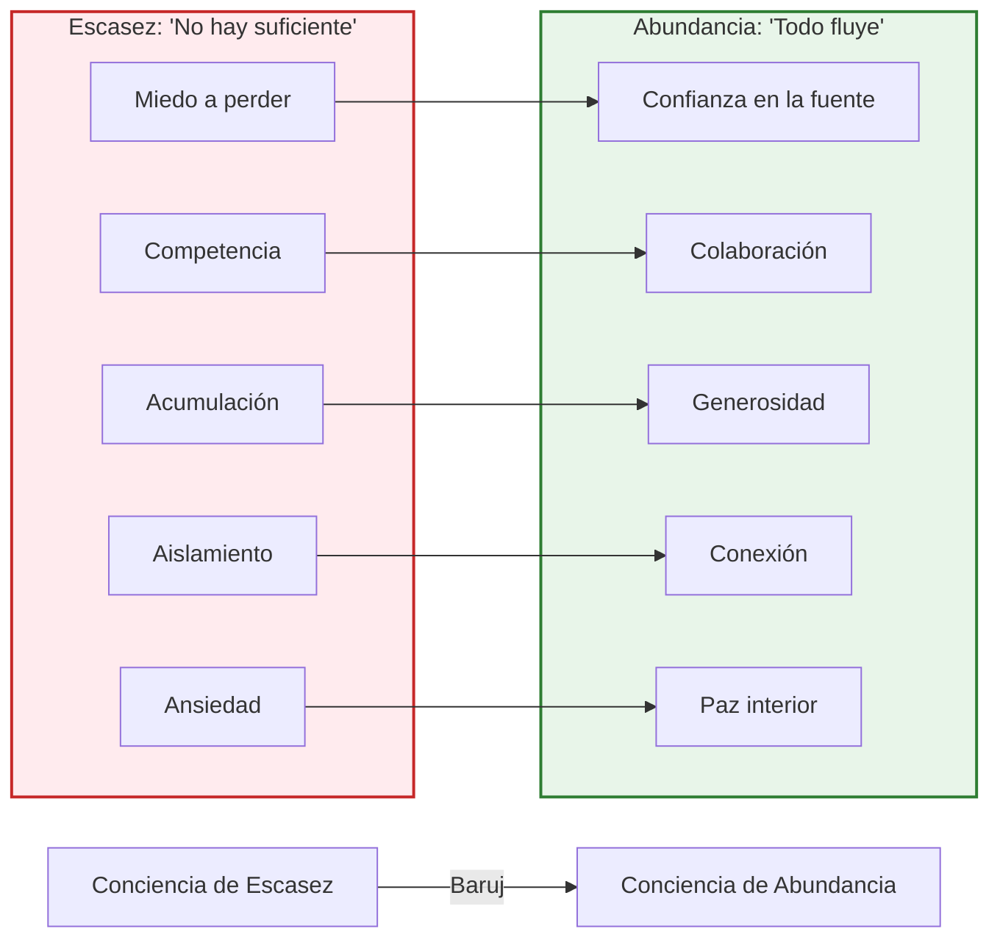
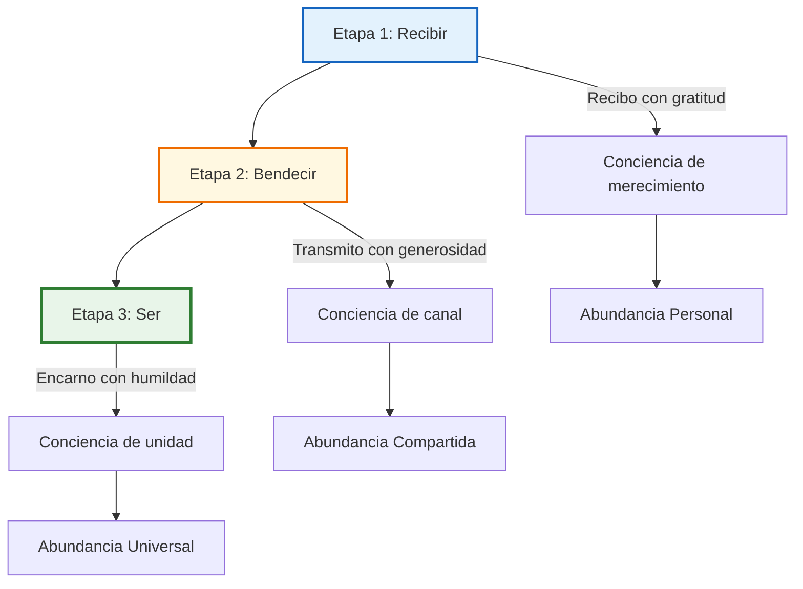
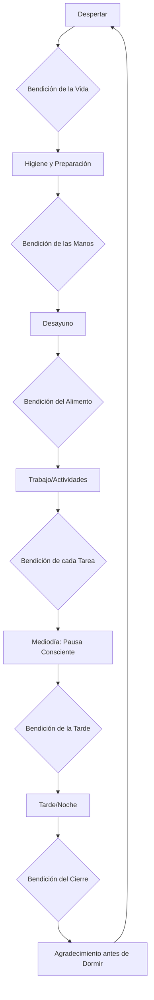
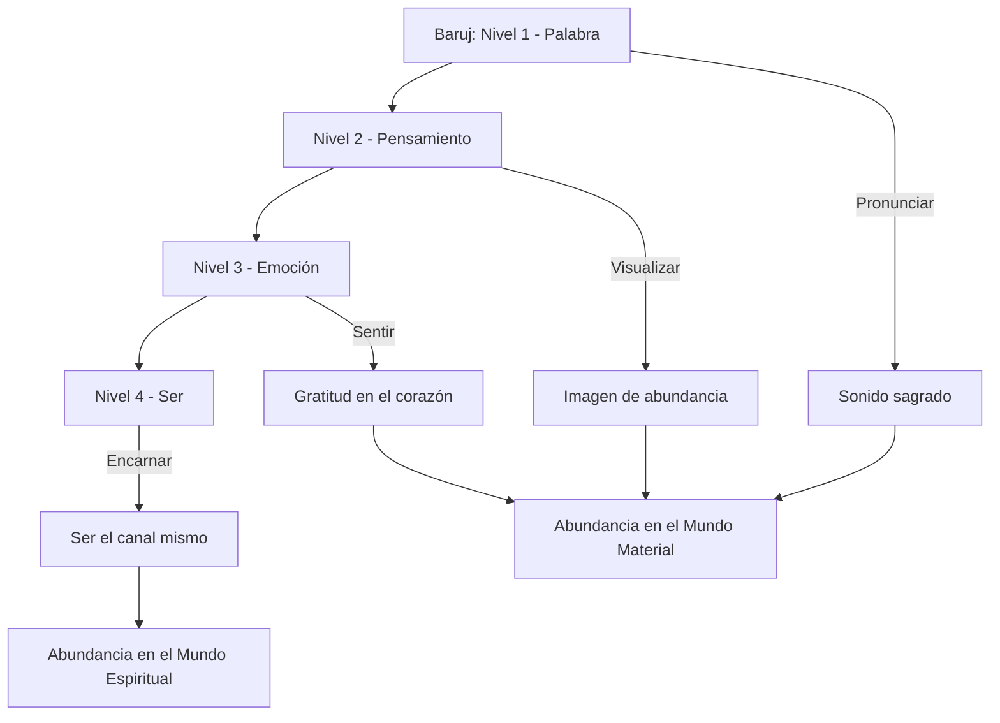
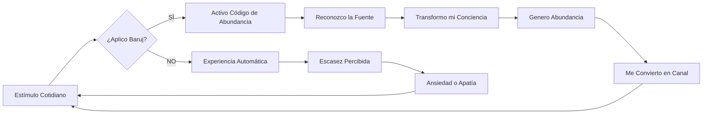
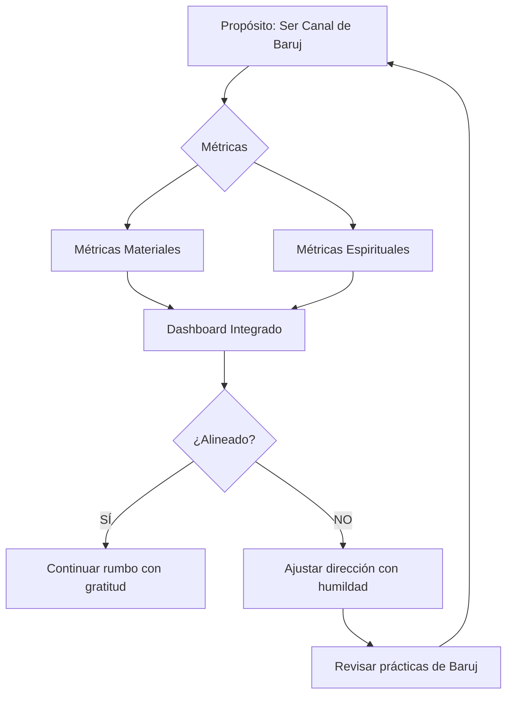

# MASTERCLASS: El Código de Abundancia de Baruj — Sabiduría Hebrea para una Vida Bendecida 🕎✨

## INTRODUCCIÓN: POR QUÉ UNA PALABRA HEBREA PUEDE CAMBIAR TU CONCIENCIA 🧠

En la tradición judía, las palabras no son solo sonidos: son **códigos de energía** que activan realidades espirituales específicas. 🗝️ Entre todas las palabras hebreas, **Baruj** (בָּרוּךְ) ocupa un lugar central. La usamos a diario en bendiciones, rezos y rituales, pero pocas veces entendemos su verdadero alcance.

En este video, un maestro espiritual explora el significado profundo de Baruj: desde su etimología hasta su aplicación práctica para transformar una mentalidad de escasez en una mentalidad de **abundancia infinita**. 🌊

> **🎯 Objetivo de Aprendizaje** — Al final de esta guía, comprenderás qué es realmente Baruj, cómo funciona como "código de abundancia" y podrás aplicarlo en tu vida cotidiana para transformar tu conciencia.

> **⚠️ Nota espiritual** — Este contenido es formativo y respetuoso con todas las tradiciones. Las interpretaciones aquí vertidas provienen de fuentes jasídicas y cabalísticas y no buscan reemplazar el estudio con un rabino o guía espiritual calificado.

---

## MAPA DEL FLUJO DE SABIDURÍA 🗺️

```mermaid
flowchart LR
    A[Etimología de Baruj] --> B[Espiritualidad de la Palabra]
    B --> C[Breja: Pozo de Acumulación]
    C --> D[Leabrij: Injerto Divino]
    D --> E[Práctica Cotidiana]
    E --> F[Transformación de Conciencia]
    F --> G[Ser un Canal de Abundancia]
    G --> A

    subgraph NIVEL_1 ["Nivel 1: La Palabra"]
        A1[Significado de Baruj]
        A2[Verbo Lebarej: Bendecir]
        A3[Raíz BeReJ (B,R,J)]
    end

    subgraph NIVEL_2 ["Nivel 2: La Espiritualidad"]
        B1[Breja: Pozo/Depósito]
        B2[Leabrij: Injerto/Injerto]
        B3[Conexión con la Fuente]
    end

    subgraph NIVEL_3 ["Nivel 3: La Práctica"]
        C1[Bendecir a Dios, no al objeto]
        C2[Acciones cotidianas conscientes]
        C3[Del yo a la Fuente]
    end

    A1 --> A2
    A2 --> A3
    A3 --> B1
    B1 --> B2
    B2 --> B3
    B3 --> C1
    C1 --> C2
    C2 --> C3
```

| Nivel | Pregunta que responde | Output principal |
|-------|-----------------------|------------------|
| **Etimología** 📜 | ¿Qué significa literalmente Baruj? | Verbo lebarej: hacer fluir bendición |
| **Espiritualidad** 🕯️ | ¿Por qué esta palabra es un código sagrado? | Conexión con la Fuente divina |
| **Breja** 💧 | ¿Qué es un "pozo de bendición"? | Acumulación de influencias positivas |
| **Leabrij** 🌿 | ¿Qué significa "injertarse" espiritualmente? | Unión del alma humana con lo divino |
| **Práctica** 🛠️ | ¿Cómo aplicar Baruj en lo cotidiano? | Consciencia de abundancia |
| **Transformación** 🦋 | ¿Qué pasa cuando vivo desde Baruj? | De escasez a infinito |

```mermaid
flowchart LR
    subgraph I_Do["👨‍🏫 I Do (Instructor)"]
        direction TB
        A1[Mostrar: escritura hebrea de Baruj] --> A2[Analizar: raíz BeReJ y sus significados] --> A3[Explicar: Breja como pozo y Leabrij como injerto] --> A4[Demostrar: bendición cotidiana del agua]
    end
    
    subgraph We_Do["🤝 We Do (Colaborativo)"]
        direction TB
        B1[Practicar: bendiciones en hebreo] --> B2[Reflexionar: momentos de escasez vs. abundancia] --> B3[Compartir: experiencias de "inyección de luz"] --> B4[Crear: ritual personal de bendición]
    end
    
    subgraph You_Do["💪 You Do (Independiente)"]
        direction TB
        C1[Memorizar: 5 bendiciones diarias] --> C2[Implementar: conciencia de Baruj en rutina] --> C3[Documentar: cambios en percepción] --> C4[Diseñar: tu propio código de abundancia]
    end
    
    classDef I_DoStyle fill:#E3F2FD,stroke:#1565C0,stroke-width:2px,color:#0D47A1;
    classDef We_DoStyle fill:#FFF8E1,stroke:#EF6C00,stroke-width:2px,color:#BF360C;
    classDef You_DoStyle fill:#E8F5E9,stroke:#2E7D32,stroke-width:2px,color:#1B5E20;
    
    class I_Do I_DoStyle;
    class We_Do We_DoStyle;
    class You_Do You_DoStyle;
```

---

## PARTE 1: LA PALABRA BARUJ — CÓDIGO SAGRADO HEBREO 🕎

### 1.1 Principio Central

En la tradición judía, cada palabra hebrea es un **contenedor de energía espiritual**. Baruj no es solo un adjetivo que significa "bendecido": es una **herramienta vibracional** que, cuando se pronuncia con conciencia, activa un canal de abundancia infinita. 🔑

> **💡 Idea clave** — Baruj no describe un estado: lo crea. Cuando dices "Baruj" o bendices a Dios, no estás etiquetando una realidad: estás **generando** una nueva realidad de abundancia.



### 1.2 Etimología: Del Verbo Lebarej al Concepto de Bendición 📖

**Del 1:29 al 1:46 del video**, el orador explica que Baruj viene del verbo **lebarej** (לְבָרֵךְ), que significa **"bendecir"**. Pero la traducción simple pierde la riqueza del original hebreo:

| Nivel | Hebreo | Transliteración | Significado |
|-------|--------|-----------------|-------------|
| **Verbo base** | בָּרַךְ | *baraj* | Bendecir, hacer fluir |
| **Forma causativa** | הִבְרִיךְ | *hivrij* | Hacer que otro reciba bendición |
| **Adjetivo** | בָּרוּךְ | *baruj* | Bendecido, lleno de flujo |
| **Raíz triliteral** | ב-ר-ך | *B-R-J* | Fluir, brotar, crecer |

> **📌 Idea clave** — La raíz B-R-J no significa "decir palabras bonitas". Significa **hacer fluir** algo desde una fuente hacia un receptor. Baruj es, en esencia, un **canal de transmisión** de abundancia.

### 1.3 La Escritura Hebrea: Un Código Visual

```text
בָּרוּךְ

Bet (ב) — Casa, receptáculo
Resh (ר) — Cabeza, principio, superior
Vav (ו) — Y, conexión, continuidad
Jet (ך) final — Vida, fluir, multiplicar
```

| Letra | Significado simbólico | Relación con Baruj |
|-------|----------------------|--------------------|
| **Bet (ב)** 🏠 | Casa, receptáculo, contenedor | Baruj como recipiente que recibe y contiene bendición |
| **Resh (ר)** 👑 | Cabeza, principio, superior | La bendición viene de una fuente superior |
| **Vav (ו)** 🔗 | Y, conexión, continuidad | La unión entre el cielo y la tierra |
| **Jet (ך)** 🌊 | Vida, fluir, multiplicar | El resultado: vida que se expande |

> **🔮 Insight cabalístico** — El Resh (cabeza) en el medio de la palabra indica que Baruj siempre viene **desde una fuente superior**. No generamos la bendición nosotros: la canalizamos.

---

## PARTE 2: ESPIRITUALIDAD DE BARUJ — LOS SIGNIFICADOS OCULTOS 🕯️

### 2.1 Principio Central

La palabra Baruj tiene tres significados espirituales interconectados que, juntos, forman un sistema de comprensión de la realidad:

1. **Bendecir** (acto de transmitir)
2. **Pozo de agua** (lugar de acumulación)
3. **Injerto** (unión con la fuente) 💧🌿



### 2.2 Breja: El Pozo de Acumulación de Bendiciones 💧

**Del 3:58 al 6:01 del video**, el orador explica que Baruj comparte raíz con la palabra **Breja** (בְּרֵכָה), que significa **"pozo"** o **"piscina"**. Esto no es coincidencia: es un símbolo profundo de cómo funciona la bendición.

| Aspecto de la Breja | Significado Espiritual | Aplicación Práctica |
|---------------------|------------------------|---------------------|
| **Agua acumulada** 💧 | Las bendiciones se almacenan | Cada acción consciente suma |
| **Pozo profundo** 🕳️ | Fuente inagotable | Abundancia infinita disponible |
| **Agua que fluye** 🌊 | La bendición se renueva | No se agota al dar |
| **Lugar de encuentro** 🤝 | Comunidad alrededor del pozo | Las bendiciones se multiplican en comunidad |

> **📌 Idea clave** — Baruj es como un pozo: cada vez que bendices, no estás "gastando" algo que se acaba. Estás accediendo a una **fuente infinita** que se renueva constantemente. La bendición no se pierde: se multiplica.

### 2.3 Leabrij: El Injerto Espiritual 🌿

La segunda conexión etimológica es con el término **leabrij** (לַעֲבֵרִית), relacionado con **injertar**. En agricultura, el injerto es el proceso de unir una rama a un tronco más fuerte para que la rama absorba la vitalidad de la fuente. 🌱➡️🌳

| Etapa del Injerto | Símbolo Espiritual | Analogía Humana |
|-------------------|--------------------|-----------------|
| **Corte de la rama** ✂️ | Separación de la conciencia ordinaria | Dejar de identificarse solo con lo material |
| **Preparación del tronco** 🪚 | Apertura del corazón | Disponibilidad para recibir |
| **Unión (grafting)** 🔗 | Conexión con la Fuente divina | Alineación con propósito superior |
| **Crecimiento conjunto** 🌿 | Absorción de vitalidad divina | Transformación personal |
| **Frutificación** 🍎 | Manifestación de abundancia | Resultados tangibles en la vida |

> **🌳 Insight profundo** — Así como un injerto hace que la rama sea más fuerte al unirse al tronco, Baruj es el **mecanismo espiritual** que nos injerta en la fuente de toda abundancia. No es lo que hacemos: es cómo nos conectamos.



---

## PARTE 3: LA PRÁCTICA DE BARUJ — TRANSFORMAR LO COTIDIANO 🛠️

### 3.1 Principio Central

La aplicación de Baruj no se limita a rezos formales. Es una **herramienta práctica de transformación de conciencia** que se ejerce en cada acción consciente del día. El video aclara un malentendido común (del 3:03 al 3:45 y del 9:45 al 10:45): no bendecimos los objetos porque ellos ya son benditos. **Bendecimos a Dios por ellos**, y en ese acto de reconocimiento, transformamos nuestra propia percepción. 🙏

> **📌 Idea clave** — La bendición no cambia el objeto: **te cambia a ti**. Al reconocer la fuente de la abundancia, pasas de una conciencia de escasez (yo tengo/yo no tengo) a una conciencia de abundancia (yo recibo/yo agradezco/yo comparto).

### 3.2 El Malentendido Común: ¿Bendecimos el Agua o a Dios? 💧

| Entendimiento Incorrecto ❌ | Entendimiento Correcto ✅ |
|-----------------------------|---------------------------|
| "El agua es sagrada, así que la bendigo" | "Dios creó el agua; bendigo a Dios por ella" |
| "Bendigo el alimento para que sea sagrado" | "Reconozco la fuente divina de este alimento" |
| "La bendición hace sagrado al objeto" | "La bendición hace sagrado **mi acto de beber**" |
| "Baruj es una frase mágica" | "Baruj es una herramienta de conexión consciente" |

### 3.3 La Fórmula de la Bendición Diaria

```text
Baruj Atá Adonai Eloheinu Melej HaOlam...

(Bendito eres Tú, Dios nuestro, Rey del universo...)
```

| Componente | Función Espiritual | Ejemplo de Aplicación |
|------------|-------------------|----------------------|
| **Baruj** 🕎 | Código de abundancia activado | Al pronunciar Baruj, activas el pozo |
| **Atá** (Tú) 👤 | Relación personal con la Fuente | No es abstracto: es relación |
| **Adonai** (Dios) ✨ | Nombre sagrado de la Fuente | Reconocimiento de origen |
| **Eloheinu** (nuestro Dios) 🤝 | Conexión comunitaria | No es solo mío: es nuestro |
| **Melej HaOlam** (Rey del universo) 👑 | Universalidad del principio | La abundancia es para todos |

### 3.4 7 Bendiciones Cotidianas para Transformar tu Conciencia 🌅

| Momento del Día | Acción | Bendición (tradición) | Efecto Espiritual |
|-----------------|--------|----------------------|------------------|
| **Al despertar** 🌅 | Abrir los ojos | "Baruj... shehejeyanu" (nos diste vida) | Gratitud por un nuevo día |
| **Al lavarse las manos** 🧼 | Netilat yadaim | "Baruj... al netilat yadaim" | Pureza y nuevo comienzo |
| **Antes de beber agua** 💧 | Beber con conciencia | "Baruj... shehakol" (todo existe por Su palabra) | Reconocimiento de la fuente |
| **Antes de comer pan** 🍞 | Partir el pan | "Baruj... hamotzi lejem min haaretz" | Conexión tierra-pan-vida |
| **Antes de estudiar** 📚 | Abrir un libro | "Baruj... laasok b'divrei Torah" | Consagración del aprendizaje |
| **Al ver fenómenos naturales** 🌄 | Arcoíris, tormenta, mar | "Baruj... shekajá mitzvá" (cumples mandamientos) | Asombro y reverencia |
| **Al encontrarse con alguien** 🤝 | Saludar a otro | "Baruj... sheatzlijta" (te hiciste encontrar) | Gratitud por la conexión humana |

> **🌊 Insight profundo** — Cada bendición es un "inyección de luz" (como dice el video). Cada vez que bendices, estás inyectando conciencia de abundancia en un momento que, de otra forma, sería automático y sin sentido.

---

## PARTE 4: DE LA ESCASEZ A LA ABUNDANCIA — LA TRANSFORMACIÓN DE CONCIENCIA 🦋

### 4.1 Principio Central

El efecto más poderoso de Baruj es la **transformación de la mentalidad de escasez a mentalidad de abundancia infinita** (del 11:00 al 11:45 del video). No es un cambio circunstancial: es un cambio perceptual profundo que afecta cómo ves el mundo, cómo tomas decisiones y cómo te relacionas con los demás. 🧠➡️✨



### 4.2 La Escasez como Autoengaño

| Creencias de Escasez ❌ | Realidad de Abundancia ✅ |
|------------------------|---------------------------|
| "Si doy, me quedo sin nada" 🥺 | "Al dar, activo el canal de recibir" |
| "El éxito es finito: si tú ganas, yo pierdo" ⚔️ | "El éxito se expande: todos podemos crecer" |
| "No tengo suficiente tiempo" ⏰ | "El tiempo se organiza cuando hay propósito" |
| "El dinero es limitado" 💸 | "El dinero es energía: fluye donde hay conciencia" |
| "Debo aferrarme a lo que tengo" 🤏 | "Soltar es el primer paso para recibir más" |

### 4.3 Ejercicio: Mapeo de Escasez vs. Abundancia

| Área de Vida | Creencia de Escasez | Creencia de Abundancia (con Baruj) | Acción de Transformación |
|--------------|---------------------|-----------------------------------|--------------------------|
| **Dinero** 💰 | "No alcanza para..." | "Baruj: la fuente provee lo necesario" | Bendecir cada ingreso y gasto |
| **Tiempo** ⏰ | "No tengo tiempo para..." | "Baruj: el tiempo se alinea con el propósito" | Bendecir cada nuevo día |
| **Relaciones** 🤝 | "La gente no es confiable" | "Baruj: cada encuentro es una oportunidad" | Bendecir cada interacción significativa |
| **Trabajo** 💼 | "Debo competir para sobrevivir" | "Baruj: el valor que creo retorna multiplicado" | Bendecir cada tarea completada |
| **Salud** 🏃 | "Mi cuerpo es limitado" | "Baruj: la vitalidad fluye desde la fuente" | Bendecir cada parte del cuerpo al despertar |

---

## PARTE 5: SER UNA BENDICIÓN — EL LLAMADO DE ABRAHAM 🌟

### 5.1 Principio Central

**Del 12:45 al 13:15 del video**, el orador aborda el nivel más alto de la práctica de Baruj: no solo recibir bendiciones ni bendecir a otros, sino **convertirse en un canal de bendición**. La meta final no es tener abundancia: **ser abundancia**. 🕯️➡️🌍

> **📜 Texto fundacional** — Dios le dijo a Abraham: *"Y serás una bendición"* (Gen. 12:2, "Vehayta berajá"). No dice "recibirás bendiciones" ni "tendrás bendiciones". Dice: **serás una bendición**.

| Nivel | Descripción | Manifestación |
|-------|-------------|---------------|
| **1. Recibir bendiciones** 📥 | Aceptar la abundancia que viene | Agradecimiento consciente |
| **2. Bendecir a otros** 📤 | Transmitir bendiciones a quienes nos rodean | Palabras de gratitud, apoyo, reconocimiento |
| **3. Ser una bendición** ✨ | Encarnar la abundancia como estado del ser | Presencia que transforma, ejemplo vivo |

### 5.2 La Transmutación de la Conciencia



### 5.3 El Camino de Abraham como Modelo

| Etapa de Abraham | Analogía con Baruj | Lección Práctica |
|------------------|--------------------|------------------|
| **Salida de Ur** 🚶 | Dejar la mentalidad de escasez | Salir de la zona de confiego limitante |
| **Viaje a Canaán** 🗺️ | Caminar hacia lo desconocido con fe | Confiar en el flujo de la abundancia |
| **Encuentro con Melquisedec** 🤝 | Recibir bendición de otro | Aceptar bendiciones con humildad |
| **Circuncisión (Brit Milá)** ✂️ | Injerto físico y espiritual | Leabrij: unirse a la Fuente |
| **"Serás una bendición"** 🌟 | Cumplimiento del propósito | Transformarse en canal de bendición |

> **🌳 Insight profundo** — Abraham no era rico cuando recibió la promesa. No tenía tierras, no tenía hijos. Pero tenía algo más importante: **disponibilidad para ser un canal**. La abundancia no viene de lo que tienes: viene de lo que estás dispuesto a ser.

---

## PARTE 6: SISTEMA DE PRÁCTICA DIARIA DE BARUJ 🗓️

### 6.1 Estructura de un Día Consciente



### 6.2 Tabla de Bendiciones por Contexto

| Contexto 🎭 | Bendición Tradicional | Traducción y Significado | Momento de Aplicación |
|-------------|----------------------|--------------------------|----------------------|
| **Al despertar** 🌅 | Modeh ani... | "Agradezco por devolverme el alma" | Primer pensamiento del día |
| **Al beber agua** 💧 | Shehakol nihyeh bidvaro | "Todo existe por Su palabra" | Cada sorbo consciente |
| **Al comer frutas/verduras** 🍎 | Borei pri ha'etz / ha'adamah | "Creador del fruto del árbol/tierra" | Antes de comer |
| **Al comer pan** 🍞 | Hamotzi lejem min haaretz | "Saca pan de la tierra" | Cada comida con pan |
| **Al ver el mar** 🌊 | Sheasa et hayam hagadol | "Quien hizo el mar grande" | Contemplación de la naturaleza |
| **Al escuchar noticias buenas** 📰 | Shehejeianu | "Nos mantuvo vivo hasta este momento" | Celebración consciente |
| **Al ver a un ser querido** 👨‍👩‍👧‍👦 | Sheatzlijta li l'fosja | "Te hiciste encontrar conmigo" | Cada reencuentro |
| **Al aprender algo nuevo** 📚 | Laasok b'divrei Torah | "Nos diste la Torá" | Cada momento de aprendizaje |

### 6.3 Tu Ritual Personal de Baruj

```text
MAÑANA (5 minutos)
├── 1. Modeh ani (al despertar) 🙏
├── 2. Bendición al lavarse las manos 🧼
├── 3. Bendición al beber el primer vaso de agua 💧
└── 4. Propósito del día: "Hoy seré un canal de bendición" 🎯

DÍA (Micro-momentos)
├── Antes de cada comida: bendición correspondiente 🍽️
├── Al ver algo bello: "Baruj... shekajá" 🌄
├── Al encontrarse con alguien: bendición de encuentro 👋
└── Antes de tareas importantes: breve pausa consciente ⏸️

NOCHE (5 minutos)
├── 1. Revisión del día: ¿dónde fui un canal? 📝
├── 2. Agradecimiento por 3 momentos específicos 🙏
├── 3. Shema antes de dormir (si aplica) 🌙
└── 4. Intención para mañana: "Seguir siendo bendición" ✨
```

---

## PARTE 7: ARQUITECTURA ESPIRITUAL DE LA ABUNDANCIA 🏗️

### 7.1 Los 4 Niveles de la Bendición

La tradición cabalística distingue cuatro niveles en los que Baruj opera. Entender estos niveles te permite aplicar la herramienta con mayor precisión espiritual.



| Nivel 🎚️ | Aspecto | Herramienta | Resultado |
|-----------|---------|-------------|-----------|
| **1. Verbo** 🗣️ | Pronunciar Baruj | Bendiciones en hebreo | Activar el código sonoro |
| **2. Pensamiento** 💭 | Visualizar la fuente | Meditación en la raíz BeReJ | Abrir el canal mental |
| **3. Emoción** ❤️ | Sentir gratitud real | Corazón abierto, no solo palabras | Emoción que atrae abundancia |
| **4. Ser** ✨ | Encarnar Baruj | Vida como bendición constante | Convertirse en canal |

### 7.2 Tabla de Barreras y Soluciones Espirituales

| Barrera Interna 🚧 | Síntoma | Herramienta Baruj para Superarla |
|--------------------|---------|----------------------------------|
| **Mentalidad de escasez** 😰 | "No alcanza" | Bendición de gratitud por lo que YA hay |
| **Apatía espiritual** 😴 | "No siento nada al rezar" | Concentración en la raíz BeReJ (fluir) |
| **Resentimiento** 😤 | "No tengo lo que merezco" | Bendición de Shehejeianu (agradecimiento por estar vivo) |
| **Miedo al futuro** 😨 | "¿Qué pasará si...?" | Modo "Breja": confiar en el pozo infinito |
| **Desconexión** 🔌 | "No siento propósito" | Leabrij: injertarse en la Fuente mediante estudio |

### 7.3 Modelo de Inyección de Luz Diaria



> **💡 Regla práctica** — Cada vez que experimentas un momento de abundancia (comer, beber, ver algo bello, recibir un gesto), aplica Baruj. No necesitas ser religioso: necesitas ser **consciente**.

---

## PARTE 8: CASOS DE ESTUDIO — BARUJ EN ACCIÓN 🌟

### 8.1 La Práctica de los Justos (Tzadikim) 👨‍🏫

La tradición jasídica relata que los tzadikim (justos) vivían en un estado constante de Baruj. No porque no tuvieran problemas: sino porque cada problema lo enfrentaban desde la conciencia de que **todo fluye desde una fuente de bondad**.

| Tzadik | Enseñanza sobre Baruj | Aplicación Práctica |
|--------|----------------------|---------------------|
| **Rabí Najman de Breslev** 📖 | "No hay nada más poderoso que la alegría" | Agradecer incluso en dificultades |
| **Rabí Shneur Zalman de Liadí** 🔮 | El Tanya como manual de conciencia | Transformar pensamientos mediante palabras sagradas |
| **Rabí Levi Yitzjak de Berditchev** 💪 | "Defensor del pueblo" ante Dios | Ver bondad incluso cuando no es obvia |
| **Rebe de Lubavitch** 🌍 | "Cada judío es un embajador de la luz" | Ser canal, no solo recipiente |

### 8.2 El Poder de una Bendición en Tiempos de Crisis ⛈️

| Crisis Personal | Aplicación de Baruj | Resultado Espiritual |
|-----------------|---------------------|---------------------|
| **Pérdida de empleo** 💼❌ | "Baruj... shegía l'zman hazeh" (bendito que llegamos a este momento) | Aceptación + apertura a nuevas oportunidades |
| **Enfermedad** 🏥 | "Baruj... rofeh chol bassar" (quien sana toda carne) | Confianza en el proceso de sanación |
| **Duelo** 😢 | "Baruj... dayan ha'emet" (juez de la verdad) | Encontrar sentido en el dolor |
| **Ansiedad financiera** 💸 | "Baruj... shehakol nihyeh bidvaro" (todo existe por Su palabra) | Escasez transformada en confianza |
| **Soledad** 🚶 | "Baruj... sheasá li kol tzorki" (cumplió todas mis necesidades) | Gratitud por la presencia divina |

### 8.3 La Historia de los Hermanos Reichman y el Rebe (Revisitada) 🏠

En el video anterior sobre negocios, vimos la anécdota de los hermanos Reichman y el Rebe de Lubavitch. Ahora la leemos desde la óptica de Baruj:

> El Rebe no les dijo "no se retiren" por razones financieras. Les dijo **no se retiren** porque retirarse es **cerrar el canal de bendición**. Mientras estés vivo y puedas recibir, tienes la obligación espiritual de **seguir siendo un canal** para que la bendición fluya a través de ti hacia otros. 🌊

| Lección desde Baruj | Aplicación en Negocios |
|---------------------|------------------------|
| No retirarse = seguir siendo canal 🔄 | El emprendimiento no es solo para ganar dinero |
| Cerrar el canal = cortar la abundancia ❌ | Cerrar una empresa puede ser saludable (no es idolatría) |
| La bendición fluye a través de la acción ✨ | Cada negocio debe tener un propósito que lo trascienda |
| La abundancia es infinita si el canal está abierto ♾️ | No hay límite al crecimiento si sirve a otros |

---

## PARTE 9: SISTEMA DE PRÁCTICA INTEGRADA — DE LA TEORÍA A LA VIDA 🌟

### 9.1 Tu Código Personal de Abundancia

```text
MI CÓDIGO DE ABUNDANCIA: BARUJ
═══════════════════════════════

PROPÓSITO CENTRAL
¿Para qué quiero más abundancia?
(Escribir en 1 frase)

MIS BENDICIONES ANCLA
(3 bendiciones que digo sin falta cada día)
1. _________________________________ (mañana)
2. _________________________________ (comida)
3. _________________________________ (noche)

MIS MOMENTOS DE INYECCIÓN DE LUZ
(5 situaciones donde aplicaré Baruj conscientemente)
1. Al beber agua 💧
2. Al ver algo bello 🌄
3. Al saludar a alguien 🤝
4. Al completar una tarea ✅
5. Al agradecer antes de dormir 🌙

MI MÉTRICA DE ABUNDANCIA
¿Cómo mediré mi transformación?
- Escaseces reportadas esta semana: ___
- Momentos de gratitud profundos: ___
- Veces que bendije a otro conscientemente: ___
```

### 9.2 Mapa de Transformación de 90 Días

| Mes | Fase | Acción Principal | Indicador de Progreso |
|-----|------|------------------|----------------------|
| **Mes 1** 🔍 | Conciencia | Identificar 10 bendiciones cotidianas | Lista completada |
| **Mes 2** 🛠️ | Práctica | Implementar 3 bendiciones diarias | Consistencia > 80% |
| **Mes 3** ✨ | Transformación | Encarnar Baruj como estado del ser | Menos quejas, más gratitud |

### 9.3 Tabla de Progreso Espiritual

| Dimensión 🌱 | Semana 1 | Semana 4 | Semana 8 | Semana 12 |
|--------------|----------|-----------|-----------|-----------|
| Consciencia de bendiciones (1-10) | ? | ? | ? | ? |
| Veces que bendije conscientemente/día | ? | ? | ? | ? |
| Momentos de escasez percibida/día | ? | ? | ? | ? |
| Profundidad de gratitud (1-10) | ? | ? | ? | ? |
| Conexión con propósito (1-10) | ? | ? | ? | ? |
| Actos de generosidad espontáneos/semana | ? | ? | ? | ? |

---

## PARTE 10: I DO / WE DO / YOU DO — EJERCICIOS PROGRESIVOS 🎓

### 10.1 I Do — Exploración etimológica guiada 📖

**Objetivo:** comprender los tres significados de Baruj (bendecir, pozo, injerto).

| Paso | Acción | Herramienta | Resultado Esperado |
|------|--------|-------------|--------------------|
| 1 | Escribir Baruj en hebreo: בָּרוּךְ | Papel o app | Representación visual |
| 2 | Identificar cada letra y su significado simbólico | Tabla de letras | Comprensión del código |
| 3 | Buscar 3 palabras que compartan la raíz B-R-J | Diccionario hebreo o internet | Conexiones etimológicas |
| 4 | Explicar Breja como pozo y Leabrij como injerto | Analogías cotidianas | Claridad conceptual |
| 5 | Crear una frase personal que integre los 3 significados | Reflexión guiada | Síntesis personal |

**Ejemplo guiado:**

> "Baruj es el código que me injerta (leabrij) en la Fuente, permitiendo que el agua viva (breja) fluya a través de mí para bendecir a otros."

### 10.2 We Do — Práctica de bendiciones en grupo 🤝

**Escenario:** un grupo de 3-5 personas se reúne para experimentar Baruj en comunidad.

| Actividad | Duración | Resultado Esperado |
|-----------|----------|--------------------|
| **1. Círculo de gratitud** 🙏 | 10 min | Cada persona agradece 1 cosa en voz alta |
| **2. Bendición del agua compartida** 💧 | 5 min | Grupo bendice una jarra de agua juntos |
| **3. Reflexión sobre injerto** 🌿 | 15 min | Cada uno comparte dónde se siente "injertado" o desconectado |
| **4. Creación de ritual grupal** ✨ | 20 min | Diseñar una bendición semanal para el grupo |
| **5. Compromiso personal** 📝 | 5 min | Cada uno elige 1 práctica diaria de Baruj |

```python
# Template: Registro de práctica grupal
group_practice = {
    "date": "2026-08-26",
    "participants": ["Persona 1", "Persona 2", "Persona 3"],
    "blessing_shared": "Baruj Atá... shehakol nihyeh bidvaro",
    "insights": [
        "Sentí conexión al pronunciar Baruj en grupo",
        "El agua bendita supo diferente (estado alterado de conciencia)",
        "Me di cuenta de que bendigo muy pocas veces al día"
    ],
    "commitments": [
        "Bendecir antes de cada comida",
        "Bendecir al despertar",
        "Bendecir al encontrarme con alguien"
    ]
}
```

### 10.3 You Do — Crea tu sistema personal de Baruj 💪

**Tarea:** diseña un sistema de práctica diaria que integre los 3 niveles de Baruj (palabra, pensamiento, emoción).

| Criterio | Peso |
|----------|------|
| Consistencia (viabilidad diaria) | 30% |
| Profundidad (no solo ritual vacío) | 25% |
| Integración (en rutina existente) | 20% |
| Expansión (crecimiento progresivo) | 15% |
| Comunidad (compartir con otros) | 10% |

**Entregable:**
1. **Tu código personal de Baruj** (1 frase que lo resume)
2. **Rutina diaria** (3 momentos mínimos de bendición)
3. **Ritual semanal** (práctica más profunda)
4. **Métrica de seguimiento** (cómo medirás tu transformación)
5. **Cuenta de accountability** (con quién compartirás tu progreso)

---

## PARTE 11: MATRIZ DE CREENCIAS — ABUNDANCIA VS. ESCASEZ ⚖️

### 11.1 Identifica tus Creencias Limitantes

| Creencia Limitante ❌ | ¿Dónde la aprendí? | Costo en mi vida | Creencia Alineada con Baruj ✅ |
|----------------------|---------------------|------------------|-------------------------------|
| "El dinero es para sobrevivir, no para vivir" 💀 | | | "El dinero es un canal de bendición" |
| "Debo sufrir para merecer" 😭 | | | "La abundancia fluye cuando estoy alineado con mi propósito" |
| "Los demás tienen más suerte" 🍀 | | | "Cada uno tiene un canal único de bendición" |
| "No soy suficiente" 😔 | | | "Soy un receptáculo digno de bendición infinita" |
| "Dar me deja sin nada" 🥺 | | | "Al dar, abro el canal para recibir más" |

### 11.2 Transformación de Creencias con Baruj

| Creenza Antigua | Palabra de Baruj para Transformarla | Resultado Esperado |
|-----------------|-------------------------------------|-------------------|
| "No tengo suficiente" ❌ | "Shehakol nihyeh bidvaro" (todo existe por Su voluntad) | Confianza en la fuente |
| "Solo yo puedo resolverlo" ⚡ | "Baruj... sheatzlijta li" (me hiciste tener éxito) | Humildad y gratitud |
| "El futuro es incierto y temible" 😰 | "Modé ani lefanéja" (agradezco por devolverme el alma) | Presencia en el ahora |
| "La abundancia es para otros, no para mí" 🚫 | "Vehayta berajá" (y serás una bendición) | Merecimiento personal |

---

## PARTE 12: DASHBOARD ESPIRITUAL-FINANCIERO 📊

### 12.1 Métricas Integradas de Abundancia

Un dashboard espiritual-financiero combina indicadores materiales con indicadores de conciencia para medir el progreso real en la aplicación de Baruj.



### 12.2 Tabla de Métricas

| Dominio 📊 | Métrica | Frecuencia | Meta | Alerta ⚠️ |
|------------|---------|------------|------|-----------|
| **Material - Liquidez** 💧 | Reserva (meses de gastos) | Mensual | > 3 meses | < 1 mes |
| **Material - Crecimiento** 📈 | % ingresos invertidos en aprendizaje | Mensual | > 10% | < 5% |
| **Material - Impacto** 🌱 | % ganancias a causas | Mensual | > 10% | 0% |
| **Espiritual - Gratitud** 🙏 | Veces que bendijiste conscientemente/día | Diaria | > 5 | < 2 |
| **Espiritual - Presencia** 🧘 | Minutos de meditación/reflexión | Diaria | > 10 | 0 |
| **Espiritual - Conexión** 🤝 | Interacciones significativas/semana | Semanal | > 3 | 0 |
| **Integrado - Propósito** 🎯 | Alineación diaria (1-10) | Diaria | > 7 | < 5 por 3 días |

### 12.3 Sistema de Alertas y Acciones Correctivas

| Alerta 🚨 | Condición | Acción de Baruj |
|-----------|-----------|-----------------|
| Sequía de gratitud 💧 | < 2 bendiciones/día por 3 días | Recitar Modeh ani al despertar + 3 agradecimientos antes de dormir |
| Estancamiento financiero 📉 | CAGR negativo 2 trimestres | Bendecir cada ingreso y repensar modelo |
| Apatía espiritual 😴 | 0 minutos de reflexión/semana | Volver a 1 bendición mínima diaria |
| Aislamiento 🔒 | 0 interacciones significativas/semana | Bendecir cada encuentro, incluso casual |
| Ansiedad de escasez 😰 | Pensamientos de "no alcanza" > 3/día | Aplicar Shehakol en cada momento de escasez percibida |

---

## PARTE 13: CASOS DE APLICACIÓN POR CONTEXTO 🏢

### 13.1 Emprendedores y Líderes 🚀

| Principio Baruj | Implementación Práctica |
|-----------------|-------------------------|
| **Inyectar luz en cada reunión** ✨ | Comenzar reuniones con 1 minuto de gratitud compartida |
| **Ver cada empleado como canal** 👥 | Reconocer públicamente las contribuciones (bendecir = reconocer) |
| **Bendecir cada venta** 💰 | Agradecer por cada cliente, no solo por el ingreso |
| **Leabrij: injertar propósito en la cultura** 🌿 | Misión escrita y compartida que trascienda el lucro |
| **Breja: construir pozos de valor** 💧 | Sistemas que acumulan valor a largo plazo (no solo quick wins) |

### 13.2 Profesionales y Empleados 💼

| Principio Baruj | Implementación Práctica |
|-----------------|-------------------------|
| **Bendecir el inicio de la jornada** 🌅 | Modeh ani + intención antes de entrar a trabajar |
| **Ver cada tarea como canal** 🔧 | Transformar "tengo que hacer X" en "agradezco poder hacer X" |
| **Bendecir a colegas** 👋 | Reconocimiento genuino, no solo cumplido formal |
| **Inyectar luz en dificultades** ⛈️ | Ante un problema: "Baruj... ¿qué puedo aprender aquí?" |
| **Cerrar el día con gratitud** 🌙 | 3 logros o aprendizajes antes de dormir |

### 13.3 Familias y Hogar 🏠

| Principio Baruj | Implementación Práctica |
|-----------------|-------------------------|
| **Bendecir las comidas en familia** 🍽️ | Rotar quién bendice, incluir a los niños |
| **Bendecir el hogar** 🏡 | Ceremonia de bendición de la casa (similar a la mezuzá) |
| **Ver cada miembro como bendición** 👨‍👩‍👧‍👦 | Expresar gratitud específica a cada persona cada día |
| **Bendecir los momentos difíciles** ⛈️ | "Baruj... esta dificultad trae consigo una enseñanza" |
| **Ritual de Shabbat como inyección de luz** 🕯️ | Cena de Shabbat con bendiciones y gratitud profunda |

### 13.4 Relaciones y Comunidad 🤝

| Principio Baruj | Implementación Práctica |
|-----------------|-------------------------|
| **Bendecir cada encuentro** 👋 | "Baruj... sheatzlijta li l'fosja" al ver a alguien querido |
| **Ver conflictos como oportunidades** ⚔️ | "Baruj... esta fricción me está mostrando algo" |
| **Bendecir a quienes nos hieren** 🩹 | Practicar bendición incluso por personas difíciles |
| **Ser canal para la comunidad** 🌍 | Ofrecer ayuda no como favor, sino como bendición |
| **Celebrar los éxitos ajenos** 🎉 | Bendecir el éxito de otros como si fuera propio |

---

## PARTE 14: GLOSARIO DE CONCEPTOS CLAVE 📚

| Término Hebreo 🕎 | Significado Literal | Significado Espiritual |
|-------------------|---------------------|------------------------|
| **Baruj** (בָּרוּךְ) | Bendecido | Código de abundancia activado |
| **Lebarej** (לְבָרֵךְ) | Bendecir | Hacer fluir bendición desde la Fuente |
| **Breja** (בְּרֵכָה) | Pozo, piscina | Acumulación de influencias positivas |
| **Leabrij** (לַעֲבֵרִית) | Injerto | Unión espiritual del alma con lo divino |
| **Shehakol** (שֶׁהַכֹּל) | Que todo existe | Reconocimiento de la fuente de toda existencia |
| **Shehejeianu** (שֶׁהֶחֱיָנוּ) | Que nos mantuvo vivo | Gratitud por la vida y los momentos especiales |
| **Modé ani** (מוֹדֶה אֲנִי) | Agradezco yo | Gratitud matutina por el alma devuelta |
| **Tikkun Olam** (תִּקּוּן עוֹלָם) | Reparación del mundo | El propósito final de la abundancia |

| Concepto Espiritual 🕯️ | Definición |
|------------------------|------------|
| **Código de abundancia** 🗝️ | Patrón vibratorio que, al activarse conscientemente, genera realidad de abundancia |
| **Inyección de luz** ⚡ | Acto consciente de reconocer la fuente divina en un momento cotidiano |
| **Canal de bendición** 🌊 | Persona que, al estar alineada, transmite abundancia a otros |
| **Conciencia de escasez** 😰 | Percepción limitada de la realidad basada en el miedo |
| **Conciencia de abundancia** ✨ | Percepción ampliada de la realidad basada en la confianza en la Fuente |
| **Pozo espiritual (Breja)** 💧 | Estado de acumulación de bendiciones accesible mediante la práctica consciente |
| **Injerto divino (Leabrij)** 🌿 | Proceso de unión del alma humana con la conciencia divina |

---

## PARTE 15: ROADMAP DE IMPLEMENTACIÓN — 90 DÍAS DE TRANSFORMACIÓN 🗺️

### 15.1 Ruta de Transformación Personal

| Semana | Fase | Acción Principal | Entregable |
|--------|------|------------------|------------|
| **1** 🔍 | Diagnóstico | Mapear creencias de escasez actuales | Lista de 10 creencias limitantes |
| **2-3** 📖 | Aprendizaje | Estudiar las 7 bendiciones cotidianas | Lista personalizada de bendiciones |
| **4-5** 🛠️ | Práctica inicial | Implementar 1 bendicia diaria (mañana) | Rutina de Modeh ani |
| **6-7** 📈 | Expansión | Añadir bendición antes de comer | 2 bendiciones/día estables |
| **8-10** 💧 | Profundización | Añadir bendición al beber agua | 3 bendiciones/día consistentes |
| **11-13** ✨ | Integración | Añadir bendición nocturna de gratitud | 4 bendiciones/día |
| **14-17** 🤝 | Comunidad | Compartir práctica con 1 persona | Grupo de accountability |
| **18-21** 🧘 | Meditación | Añadir 5 min de reflexión sobre raíz BeReJ | Diario de insights |
| **22-26** 🌟 | Transformación | Evaluar cambios en percepción de abundancia | Informe de 90 días |

### 15.2 Métricas de Progreso

| Indicador | Semana 0 | Semana 4 | Semana 8 | Semana 12 | Semana 26 |
|-----------|----------|-----------|-----------|-----------|-----------|
| Bendiciones conscientes/día | ? | ? | ? | ? | ? |
| Pensamientos de escasez/día | ? | ? | ? | ? | ? |
| Nivel de gratitud (1-10) | ? | ? | ? | ? | ? |
| Sensación de propósito (1-10) | ? | ? | ? | ? | ? |
| Actos de generosidad/semana | ? | ? | ? | ? | ? |
| Conexión con comunidad (1-10) | ? | ? | ? | ? | ? |

---

## PARTE 16: CHECKLIST FINAL DE IMPLEMENTACIÓN ✅

### 16.1 Conocimiento Adquirido

| Check ✅ | Estado |
|----------|--------|
| Entiendo el significado etimológico de Baruj (בָּרוּךְ) | ☐ |
| Puedo explicar la conexión con Breja (pozo) y Leabrij (injerto) | ☐ |
| Comprendo la diferencia entre bendecir el objeto y bendecir a Dios por él | ☐ |
| Entiendo la transformación de escasez a abundancia como cambio de conciencia | ☐ |
| Conozco el llamado de Abraham: "ser una bendición" | ☐ |

### 16.2 Práctica Implementada

| Check ✅ | Estado |
|----------|--------|
| Tengo 3 bendiciones diarias establecidas (mañana, comida, noche) | ☐ |
| He bendecido conscientemente al despertar durante 7 días consecutivos | ☐ |
| He aplicado Baruj en un momento de escasez percibida | ☐ |
| He compartido la práctica con al menos una persona | ☐ |
| Llevo un registro de mi transformación (diario o app) | ☐ |

### 16.3 Transformación Interna

| Check ✅ | Estado |
|----------|--------|
| He identificado y transformado al menos 3 creencias limitantes | ☐ |
| Siento más gratitud en mi vida diaria | ☐ |
| Me veo más como canal que como recipiente | ☐ |
| He experimentado un "momento de abundancia" significativo | ☐ |
| Tengo un plan de crecimiento espiritual-financiero a 90 días | ☐ |

---

## PREGUNTAS DE VERIFICACIÓN 📝

Responde cada pregunta basándote en los conceptos de esta masterclass. Escribe tus respuestas o compártelas para profundizar tu aprendizaje.

### Preguntas sobre Etimología y Significado

1. **Aplica**: ¿Por qué es importante entender que Baruj no es solo "bendecido", sino un código de abundancia? ¿Cómo cambia tu práctica?

2. **Analiza**: ¿Qué enseña la conexión entre Baruj, Breja (pozo) y Leabrij (injerto) sobre la naturaleza de la bendición?

3. **Compara**: ¿En qué se diferencia "bendecir un objeto" de "bendecir a Dios por el objeto"? ¿Por qué esta distinción cambia la experiencia?

### Preguntas sobre Práctica Cotidiana

4. **Reflexiona**: ¿Qué momentos de tu día podrías transformar con una bendición consciente? ¿Por qué no lo haces actualmente?

5. **Diseña**: Crea tu rutina personal de 3 bendiciones diarias alineadas con tus valores y contexto.

6. **Evalúa**: ¿Qué barreras internas (pereza, escepticismo, olvido) te impiden bendecir más? ¿Cómo superarlas?

### Preguntas sobre Transformación de Conciencia

7. **Sintetiza**: Explica con tus palabras por qué Baruj transforma la mentalidad de escasez en abundancia.

8. **Aplica**: Piensa en una situación reciente de escasez (dinero, tiempo, afecto). ¿Cómo habría sido diferente si hubieras aplicado Baruj en ese momento?

9. **Reflexiona**: ¿Has experimentado alguna vez un "momento de abundancia" inexplicable? ¿Qué lo causó?

### Preguntas Integradoras

10. **Conecta**: ¿Cómo se relacionan los conceptos de Breja (pozo acumulado) y Leabrij (injerto) con la idea de "ser un canal de bendición"?

11. **Propón un sistema**: Diseña un ritual semanal familiar para introducir Baruj en tu hogar. ¿Qué incluiría? ¿Cómo lo adaptarías a niños?

12. **Reflexión final**: De todos los niveles de Baruj (palabra, pensamiento, emoción, ser), ¿en cuál estás más estancado? ¿Qué acción concreta tomarás esta semana para avanzar al siguiente nivel?

---

## GLOSARIO RÁPIDO 📚

| Término Hebreo 🕎 | Transliteración | Definición |
|-------------------|-----------------|------------|
| **Baruj** | baruj | Bendecido; código sagrado de abundancia |
| **Lebarej** | lebarej | Bendecir; hacer fluir bendición desde la Fuente |
| **Breja** | breja | Pozo, piscina; acumulación de bendiciones |
| **Leabrij** | leabrij | Injerto; unión espiritual del alma con lo divino |
| **Shehakol** | shehakol | Bendición genérica: "Todo existe por Su palabra" |
| **Shehejeianu** | shehejeianu | Bendición de gratitud por la vida y los momentos especiales |
| **Modé ani** | modeh ani | "Agradezco": bendición matutina al despertar |
| **Tikkun Olam** | tikkun olam | Reparación del mundo: propósito final de la abundancia |
| **Tzadik** | tzadik | Justo; persona que encarna la conciencia de Baruj |
| **Brit Milá** | brit milá | Alianza de circuncisión; injerto físico y espiritual |

| Concepto Espiritual 🕯️ | Significado |
|------------------------|------------|
| **Código de abundancia** 🗝️ | Patrón vibratorio que genera realidad de abundancia al activarse |
| **Inyección de luz** ⚡ | Acto consciente de reconocer la Fuente divina en lo cotidiano |
| **Canal de bendición** 🌊 | Persona alineada que transmite abundancia a otros |
| **Conciencia de escasez** 😰 | Percepción limitada basada en el miedo a no tener suficiente |
| **Conciencia de abundancia** ✨ | Percepción ampliada basada en confianza en la Fuente infinita |
| **Pozo espiritual (Breja)** 💧 | Estado de acumulación de bendiciones accesible mediante práctica |
| **Injerto divino (Leabrij)** 🌿 | Unión del alma humana con la conciencia divina |

---

## ANEXO: FORMATO IDEAL PARA CONTENIDO ESPIRITUAL 📖

### Recomendaciones de legibilidad para guías espirituales

El ancho óptimo para artículos espirituales y educativos es **60–75 caracteres por línea** (incluyendo espacios). Equivale aproximadamente a:

- `max-width: 65ch` en CSS.
- 550–750 px de ancho de contenido.

```css
.article-content {
  max-width: 65ch;
  font-size: 18px;
  line-height: 1.75;
}
```

Esto facilita:

- Mantener la atención en textos profundos
- Reducir la fatiga visual en lectura reflexiva
- Mejorar la comprensión de conceptos abstractos
- Facilitar el seguimiento de ideas complejas

---

### Lo que hace agradable una guía espiritual al alma

#### 1. Jerarquía visual muy clara

El usuario debería poder escanear el contenido sin leerlo linealmente.

**Ejemplo:**

```text
H1: El Código de Abundancia de Baruj
Introducción
H2: Etimología de Baruj
Texto...
H2: Significado Espiritual
Texto...
H3: Breja: El Pozo
Texto...
```

#### 2. Párrafos cortos y espaciosos

El cerebro espiritual procesa mejor bloques pequeños.

**Mejor:**

Baruj es un código.

Se activa con conciencia.

Transforma la realidad.

**Peor:**

Baruj es un código que se activa con conciencia y que transforma la realidad desde adentro hacia afuera...

#### 3. Espacio en blanco abundante

Para aprendizaje profundo:

```css
.article-content {
  line-height: 1.75;
  /* Mucho espacio antes de cada sección */
}
```

#### 4. Secciones cortas

Una buena regla: **200–400 palabras por sección** y luego un nuevo subtítulo.

#### 5. Alternar patrones visuales

Cada pocas pantallas, alterna entre:

- Lista
- Diagrama
- Tabla
- Ejemplo práctico
- Cita inspiradora

#### 6. Resúmenes frecuentes

Después de cada tema, agrega un cierre visual:

> **📌 Idea clave** — Baruj no es lo que dices: es cómo lo dices. La conciencia transforma la palabra en herramienta espiritual.

---

## REFERENCIAS Y RECURSOS ADICIONALES 📚

### Libros Recomendados 📖

| Título | Autor | Por qué leerlo |
|--------|-------|----------------|
| **"The Kabbalah of Money"** | Rabbi Nison E. Bulman | Filosofía financiera judía aplicada |
| **"The River of Fire"** | Rabí Shneur Zalman de Liadí | Clásico jasídico sobre la naturaleza del alma |
| **"The Gift of the Jews"** | Thomas Cahill | Historia del pensamiento judío y su impacto en el mundo |
| **"The Chosen"** | Chaim Potok | Novela sobre tradición, propósito y relación maestro-discípulo |
| **"The Seven Habits of Highly Effective People"** | Stephen Covey | Principios alineados con mentalidad de abundancia |

### Videos y Conferencias 🎥

| Recurso | Descripción |
|---------|-------------|
| **Baruj: El Código de Abundancia** 🎬 | Video original que inspiró esta masterclass |
| **Shemá Israel: El Poder de la Declaración** 🎓 | Profundización en las palabras sagradas |
| **Cábala y Gratitud** 🔮 | Serie sobre prácticas de gratitud cotidiana |
| **El Rebe de Lubavitch: Vida y Enseñanzas** 👨‍🏫 | Biografía espiritual del líder jasídico |

### Citas Inspiradoras 💎

> "Baruj no es un adjetivo: es un verbo en estado continuo. Estar bendecido es un proceso, no un destino."
> — Enseñanza cabalística anónima

> "No bendecimos el agua porque el agua es sagrada. Bendecimos a Dios por el agua, y en ese acto, el agua se vuelve sagrada para nosotros."
> — Mario Sabán (interpretación jasídica)

> "La abundancia no es tener mucho: es reconocer que todo lo que tengo es suficiente y fluye de una Fuente infinita."
> — Principio de Breja

> "Ser una bendición no es ser perfecto: es estar disponible para ser canal."
> — Rebe de Lubavitch (según tradición)

---

## CIERRE: TU TURNO DE SER BENDICIÓN 📝

Has recorrido el significado de Baruj desde su etimología hebrea hasta su aplicación práctica en la vida cotidiana. Has descubierto que esta palabra no es un adjetivo pasivo ("bendecido"), sino un **código activo de abundancia** que puedes usar cada día. 🕎✨

La tradición nos dice que Abraham no fue llamado "bendecido" (Baruj) casualmente. Fue llamado a **ser una bendición**. Y ese llamado no era solo para Abraham: es para cada ser humano que quiera transformar su conciencia de escasez en conciencia de abundancia infinita. 🌊

Ahora te toca a ti:

1. **Hoy mismo**: di tu primera bendición consciente (Modeh ani o Shehakol).
2. **Esta semana**: implementa 3 bendiciones diarias.
3. **Este mes**: documenta los cambios en tu percepción de abundancia.
4. **Este año**: conviértete en un canal de bendición para otros.

> **🎓 Cierre final** — Baruj es el código. La conciencia es la clave. La práctica es el camino. Y la abundancia es el resultado inevitable de vivir desde un estado de bendición constante. Como enseñó el Rebe: no te retires mientras puedas recibir. Sigue siendo canal. Sigue bendiciendo. Sigue siendo Baruj. 🌟

**Tu próximo paso:** Elige UNA bendición para implementar HOY. No mañana. Hoy. La transformación comienza con una sola palabra pronunciada con conciencia. 🗝️✨

---

## APPENDIX: PROMPTS PARA REFLEXIÓN GUIADA 🧠

### Prompt Diario (3 minutos)

> "¿Qué bendiciones recibí hoy que no agradecí? ¿Qué cambio haré mañana?"

### Prompt Semanal (10 minutos)

> "¿En qué momentos esta semana experimenté escasez mental? ¿Cómo puedo aplicar Baruj en esos momentos la próxima semana?"

### Prompt Mensual (20 minutos)

> "¿He transformado mi relación con el dinero, el tiempo y las relaciones mediante la práctica de Baruj? ¿Qué evidencia tengo?"

### Prompt Trimestral (45 minutos)

> "Revisando los últimos 3 meses: ¿soy más consciente de la abundancia? ¿soy más generoso? ¿soy más canal que recipiente? ¿qué ajustes necesito hacer?"

---

**Fin de la Masterclass** 🎓✨

*Creada siguiendo los lineamientos de skill.md | Inspirada en el video sobre Baruj | Enfoque espiritual-práctico*
