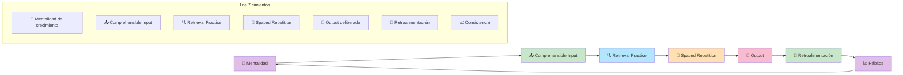

# Masterclass: Los Cimientos Fundamentales para Aprender Inglés de Forma Exponencial 🏗️📈🇬🇧

> **La premisa central de esta guía** — Aprender inglés no es acumular horas de estudio: es construir un sistema basado en principios científicos. Si entendés y aplicás estos 7 cimientos antes de empezar, tu aprendizaje pasa de ser lineal (1 hora = 1 palabra) a exponencial (1 hora = 10 palabras porque cada palabra se conecta con las demás).

## Antes de empezar: 🎯 ¿qué vas a poder hacer al terminar esta guía?

Al terminar de leer y **aplicar** esta guía vas a poder:

- Entender los 7 principios científicos que rigen todo aprendizaje de idiomas.
- Aplicar la mentalidad correcta para evitar el 90% de los abandonos.
- Diseñar un sistema de aprendizaje diario sostenible.
- Diagnosticar y evitar los errores fatales que frenan el progreso.
- Combinar estas estrategias con las guías de A1, A2, listening, speaking y vocabulario para lograr un aprendizaje exponencial.

---

## MAPA DEL WORKFLOW 🔄



---

## PARTE 1 — 🧠 El cimiento #1: Mentalidad de crecimiento

### El mito: "no tengo talento para los idiomas"

Muchos estudiantes creen que aprender inglés depende de la inteligencia o el talento. **Falso.**

La investigación de Carol Dweck muestra que las personas con **mentalidad de crecimiento** (creen que la habilidad se desarrolla con esfuerzo) aprenden mucho más rápido que las personas con **mentalidad fija** (creen que la habilidad es innata).

### Los 3 principios de la mentalidad de crecimiento

| Principio | Qué significa en inglés | Cómo aplicarlo |
|-----------|------------------------|----------------|
| **El error es información** | Mistakes are data | Cada error te dice qué ajustar. No es un juicio sobre tu capacidad. |
| **El esfuerzo > el talento** | Effort > talent | 1 hora de práctica deliberada vale más que 10 horas de práctica casual. |
| **El progreso no es lineal** | Progress is not linear | Vas a tener días malos. Eso es normal. Lo que importa es la tendencia a largo plazo. |

### Cómo cambiar tu mentalidad

1. **Cambiá "soy malo para los idiomas" por "todavía no soy bueno".**
2. **Cambiá "esto es difícil" por "esto es un desafío".**
3. **Cambiá "fallé" por "aprendí qué no funciona".**

> **📊 Datos científicos:** un meta-análisis de 2020 (Alsowat) muestra que las **estrategias de aprendizaje** tienen el impacto más grande en **speaking** (d=0.90). La mentalidad de crecimiento es la estrategia más poderosa porque determina si persistís o abandonás.

---

## PARTE 2 — 📥 El cimiento #2: Comprehensible Input (Krashen, 1981)

### El mito: "necesito sumergirme en inglés 24/7"

Muchos estudiantes creen que escuchar podcasts en inglés mientras dormen o ver series sin entender nada los hará fluir. **Falso.**

El cerebro solo aprende cuando el input es **comprensible**. Si entendés menos del 70%, el cerebro no puede procesar el lenguaje; si entendés más del 90%, no hay nada nuevo que aprender.

### La regla del i+1

```
Tu nivel actual = i
Input óptimo = i + 1 (un poquito por encima)
```

**Ejemplo:**
- Si estás en A1, escuchá podcasts A1-A2 (no B2).
- Si estás en A2, leé graded readers A2 (no novelas nativas).
- Si estás en B1, escuchá podcasts B1 (no noticias nativas sin transcripción).

### Cómo aplicar el Comprehensible Input

| Actividad | Nivel | Ejemplo |
|-----------|-------|---------|
| **Listening** | A1-A2 | Podcasts "ESL Pod", "6 Minute English" con transcripción. |
| **Reading** | A1-A2 | Graded readers (Oxford Bookworms Starter/Level 2). |
| **Videos** | A1-A2 | YouTube con subtítulos en inglés (no en español). |
| **Conversaciones** | A1-A2 | Tutores de IA que hablan lento y corrigen errores. |

> **📊 Datos científicos:** un meta-análisis de 2023 (Webb) muestra que el **listening con reading simultaneously** genera ganancias de vocabulario del 13-17%. La **lectura** genera ganancias del 17% en tests inmediatos. Ambos son efectivos si el input es comprensible.

---

## PARTE 3 — 🔍 El cimiento #3: Retrieval Practice

### El mito: "tengo que volver a leer y escuchar mucho"

Muchos estudiantes creen que repasar el mismo material una y otra vez los ayuda a aprender. **Falso.**

El cerebro no aprende cuando **reconocés** información: aprende cuando **intentás recordarla sin ayuda**.

### La diferencia entre reconocimiento y retrieval

| Actividad | Reconocimiento | Retrieval |
|-----------|----------------|-----------|
| **Escuchar un podcast** | ✅ Reconocés palabras | ❌ No recordás activamente |
| **Leer un texto** | ✅ Reconocés palabras | ❌ No recordás activamente |
| **Hacer un dictado** | ❌ No reconocemos | ✅ Intentamos recordar |
| **Hablar sin mirar** | ❌ No reconocemos | ✅ Intentamos recordar |
| **Flashcards (activo)** | ❌ No reconocemos | ✅ Intentamos recordar |

### Cómo aplicar el Retrieval Practice

1. **Después de aprender una palabra, cerrá el libro e intentá escribirla.**
2. **Hacé dictados: escuchá un audio y escribí lo que escuchaste.**
3. **Habla sin mirar notas: grabate hablando sin ayuda.**
4. **Usá flashcards donde el esfuerzo está en recordar, no en reconocer.**

> **📊 Datos científicos:** el **retrieval practice** mejora la retención a largo plazo más que cualquier otra técnica de estudio. Cada intento de recordar fortalece la conexión neuronal. Es la base de todo aprendizaje exponencial.

---

## PARTE 4 — 📅 El cimiento #4: Spaced Repetition

### El mito: "estudiar 4 horas un domingo es mejor que 20 minutos diarios"

Muchos estudiantes creen que estudiar mucho en un solo día es efectivo. **Falso.**

El cerebro consolida el aprendizaje en los **periodos de descanso** entre sesiones. Si estudiás 4 horas un domingo y no volvés a tocar el inglés hasta el próximo domingo, olvidás el 80% de lo que aprendiste.

### La curva del olvido (Ebbinghaus)

```
Día 0: aprendés 100 palabras → retención 100%
Día 1: sin repasar → retención 58%
Día 7: sin repasar → retención 23%
Día 30: sin repasar → retención 5%
```

**Con spaced repetition:**
```
Día 0: aprendés 100 palabras → retención 100%
Día 1: repasás → retención 100%
Día 3: repasás las difíciles → retención 95%
Día 7: repasás las difíciles → retención 90%
Día 14: repasás las difíciles → retención 85%
Día 30: repasás las difíciles → retención 80%
```

### Cómo aplicar el Spaced Repetition

| Herramienta | Para qué | Cómo usarla |
|-------------|----------|-------------|
| **Anki** | Vocabulario | Creá flashcards y repasá automáticamente. |
| **Quizlet** | Vocabulario | Repasá con juegos y modos de estudio. |
| **Manual** | Gramática | Repasá reglas cada 2 semanas con ejercicios. |
| **Audios** | Listening | Repasá el mismo audio en intervalos: día 1, 3, 7, 14, 30. |

> **📊 Datos científicos:** un meta-análisis de 2023 (Webb) muestra que el **spaced practice** tiene un efecto mayor que la práctica masiva en tests demorados. El cerebro necesita tiempo para consolidar redes neuronales.

---

## PARTE 5 — 🎯 El cimiento #5: Output Deliberado

### El mito: "primero tengo que escuchar y leer mucho, después hablo"

Muchos estudiantes pasan meses o años solo consumiendo contenido en inglés, pero nunca hablan. Cuando intentan hablar, se traban. **Falso.**

El cerebro optimiza lo que practicas. Si solo practicas **reconocer** palabras (input), te volvés excelente reconociéndolas, pero no creas las redes neuronales necesarias para **producirlas** en tiempo real.

### La regla del 50/50

```
50% del tiempo: Input (escuchar, leer)
50% del tiempo: Output (hablar, escribir)
```

**En la práctica:**
- Por cada 30 minutos de listening, sumá 10 minutos de speaking.
- Por cada 20 minutos de reading, sumá 10 minutos de writing.
- No consumas contenido sin cerrar el ciclo con producción.

### Cómo aplicar el Output Deliberado

| Nivel | Actividad | Tiempo |
|-------|-----------|--------|
| **A1** | Repetir frases cortas, responder preguntas simples | 5-10 min/día |
| **A2** | Narrar experiencias, hacer presentaciones cortas | 10-15 min/día |
| **B1+** | Conversaciones simuladas, escribir párrafos | 20-30 min/día |

> **📊 Datos científicos:** un meta-análisis de 2020 (Alsowat) muestra que las **estrategias de aprendizaje** tienen el impacto más grande en **speaking** (d=0.90). El output deliberado es la estrategia más efectiva para cerrar la brecha input-output.

---

## PARTE 6 — 🤖 El cimiento #6: Retroalimentación Inmediata

### El mito: "voy a practicar solo y después me corrijo"

Muchos estudiantes hablan o escriben en inglés sin recibir corrección. Creen que con el tiempo "se les va a corregir solo". **Falso.**

Sin feedback, los errores se convierten en **malos hábitos consolidados**. Cuanto más repetís un error, más difícil es corregirlo después.

### El ciclo de aprendizaje correcto

```
Intento → Error → Feedback → Corrección → Nuevo intento
```

**Sin feedback, no hay ciclo. Sin ciclo, no hay mejora.**

### Cómo obtener retroalimentación inmediata

| Método | Cuándo usarlo | Ejemplo |
|--------|---------------|---------|
| **Tutor de IA** | Todos los días | ChatGPT / Claude para corregir speaking y writing. |
| **Autograbación** | Todos los días | Grabate hablando y escuchate para identificar errores. |
| **Compañero de intercambio** | 2-3 veces por semana | Language exchange en persona o online. |
| **Profesor/tutor humano** | 1 vez por semana | Para corrección profunda y explicación de reglas. |

> **📊 Datos científicos:** estudios de **dialogue-based CALL** (meta-análisis 2020) muestran que la retroalimentación inmediata genera efectos significativos en **vocabulario** (d=0.98) y **producción oral**. La demora en el feedback reduce el aprendizaje.

---

## PARTE 7 — 📈 El cimiento #7: Consistencia y Hábitos

### El mito: "necesito estudiar muchas horas para progresar"

Muchos estudiantes creen que el aprendizaje depende de la intensidad. **Falso.**

El aprendizaje depende de la **frecuencia**. 20 minutos todos los días generan progreso exponencial; 4 horas un domingo generan frustración y olvido rápido.

### La regla del 1%

```
Progreso exponencial:
Día 1: 1% mejor
Día 2: 1% mejor
...
Día 365: 37x mejor que el día 1
```

**En la práctica:**
- **Compromiso mínimo:** 15-20 minutos por día, sin excepción.
- **Horario fijo:** mañana, tarde o noche. Elegí uno y respetalo.
- **Nunca cero:** incluso 2 minutos mantienen el hábito.
- **Rastreo:** medí tu progreso semanalmente, no diariamente.

### Cómo construir el hábito

1. **Elegí un horario fijo:** por ejemplo, 7:00 AM todos los días.
2. **Poné una alarma:** el mismo horario, todos los días.
3. **Empezá con 2 minutos:** no te comprometas a 1 hora. Empezá con 2 minutos y aumentá gradualmente.
4. **Usá un tracker:** marcá en un calendario los días que cumpliste.
5. **No rompas la cadena:** después de 7 días, no querrás romper la racha.

> **📊 Datos científicos:** estudios 2025 (Sanemueang) confirman que la **gamificación** y la **consistencia diaria** generan mejoras significativas (p<.001) en niveles A1-A2. El hábito es más importante que la intensidad.

---

## PARTE 8 — 🚨 Los errores fatales que destruyen el aprendizaje

Estos son los errores que cometen el 90% de los estudiantes y que los hacen abandonar:

| Error | Por qué es fatal | Solución |
|-------|------------------|----------|
| ❌ **Cambiar de recurso constantemente** | No generas bases sólidas | Quedate con 1 podcast, 1 libro, 1 app por semana. |
| ❌ **Escuchar contenido demasiado difícil** | Generas frustración | Si entendés menos del 70%, bajá el nivel. |
| ❌ **No practicar speaking por miedo** | No generas vocabulario activo | Hablá desde el día 1, incluso si te equivocás. |
| ❌ **Memorizar listas de palabras** | No generas redes de asociación | Aprendé en contexto, con collocations y word families. |
| ❌ **Estudiar sin repasar** | Olvidás el 80% en 24 horas | Usá spaced repetition: día 1, 3, 7, 14, 30. |
| ❌ **No recibir feedback** | Los errores se convierten en hábitos | Usá IA, grabate, o un compañero de intercambio. |
| ❌ **Abandonar después de 2 semanas** | Esperas resultados inmediatos | El progreso es invisible al principio. Medí mensualmente. |

---

## PARTE 9 — 🛠️ El sistema de aprendizaje exponencial

### Cómo combinar los 7 cimientos en una rutina diaria

```
Rutina diaria de 20 minutos:
├── 5 min — Input: escuchar un podcast o ver un video (comprehensible input)
├── 5 min — Retrieval: escribí 5 palabras nuevas de memoria (retrieval practice)
├── 5 min — Output: hablá en voz alta sobre lo que escuchaste (output deliberado)
├── 3 min — Feedback: corregí tus errores con IA o autograbación (retroalimentación)
└── 2 min — Repaso: repasá las palabras del día anterior (spaced repetition)
```

### Cómo medir tu progreso

| Métrica | Cómo medirla | Frecuencia |
|---------|--------------|------------|
| **Vocabulario activo** | Escribí 50 palabras en 2 minutos | Semanal |
| **Listening** | Escuchá un audio A2 y contá cuántas ideas entendiste | Semanal |
| **Speaking** | Grabate hablando 1 minuto y evaluá tu fluidez | Semanal |
| **Consistencia** | Marcá los días que cumpliste tu rutina | Diaria |

---

## PARTE 10 — 📚 Glosario de conceptos clave

- 🧠 **Mentalidad de crecimiento:** creencia de que la habilidad se desarrolla con esfuerzo, no es innata.
- 📥 **Comprehensible Input:** input que entendés entre el 70-90% (i+1).
- 🔍 **Retrieval Practice:** intentar recordar sin ayuda; más efectivo que volver a leer.
- 📅 **Spaced Repetition:** repasar en intervalos crecientes para maximizar la retención.
- 🎯 **Output deliberado:** producir lenguaje (hablar, escribir) con un objetivo específico.
- 🤖 **Retroalimentación:** corrección inmediata de errores para evitar malos hábitos.
- 📈 **Consistencia:** frecuencia diaria > intensidad esporádica.
- 📊 **Curva del olvido:** gráfico que muestra cómo olvidamos información sin repaso.
- 🎯 **Sweet spot:** el punto óptimo de dificultad donde aprendés más (70-90%).
- 🗣️ **Vocabulario activo:** palabras que podés recuperar y usar en una conversación real.
- 📦 **Vocabulario pasivo:** palabras que reconocés pero no usás espontáneamente.

---

## PARTE 11 — 🧠 Resumen mental (para fijar el conocimiento)

Si tuvieras que recordar solo 3 ideas de esta masterclass:

1. 🧠 **La mentalidad lo es todo.** Si creés que podés aprender, lo harás. Si creés que no, abandonarás. Cambiá "no puedo" por "todavía no puedo".
2. 📥 **El input debe ser comprensible.** Si entendés menos del 70%, bajá el nivel. El cerebro aprende en el sweet spot, no en la frustración.
3. 📈 **La consistencia vence a la intensidad.** 20 minutos todos los días generan progreso exponencial. 4 horas un domingo generan frustración.

---

## PARTE 12 — 🌐 Recursos para profundizar

- 📖 Libro: *"Mindset"* de Carol Dweck — mentalidad de crecimiento aplicada al aprendizaje.
- 📖 Libro: *"Make It Stick"* de Peter Brown — ciencia de la memoria aplicada al aprendizaje.
- 📖 Libro: *"Teaching by Principles"* de H. Douglas Brown — fundamentos científicos de la enseñanza de idiomas.
- 📖 Libro: *"Atomic Habits"* de James Clear — por qué la consistencia vence a la intensidad.
- 🎧 Podcast: *"The English Journey & 5 Rules for Fast Improvement"* (Maddie, POC English) — los 6 peldaños del aprendizaje.
- 🎧 Podcast: *"How to Turn Passive Vocabulary into Active Vocabulary"* (Maddie, Slow English Podcast) — retrieval practice y vocabulario activo.
- 📱 App: **Anki** o **Quizlet** — spaced repetition para vocabulario.
- 🌐 Web: **Cambridge English A1/A2 Tests** — tests oficiales para medir tu nivel.
- 🤖 Herramienta: **ChatGPT / Claude** — tutor conversacional para speaking y writing con corrección inmediata.
- 📚 Guía complementaria: **`ingles-a1-cientifico-masterclass.md`** — aplicación práctica de estos cimientos en A1.
- 📚 Guía complementaria: **`ingles-a2-cientifico-masterclass.md`** — aplicación práctica de estos cimientos en A2.
- 📚 Guía complementaria: **`listening-a1-a2-cientifico-masterclass.md`** — listening con métodos científicos.
- 📚 Guía complementaria: **`speaking-a1-a2-cientifico-masterclass.md`** — speaking con métodos científicos.
- 📚 Guía complementaria: **`vocabulario-a1-a2-cientifico-masterclass.md`** — vocabulario con SRS y retrieval practice.

---

*Guía elaborada como síntesis de los 7 cimientos fundamentales para aprender inglés de forma exponencial: Mentalidad de crecimiento (Dweck), Comprehensible Input (Krashen), Retrieval Practice (Bjork & Bjork), Spaced Repetition (Ebbinghaus), Output Deliberado (Ellis), Retroalimentación inmediata (Alsowat 2020, dialogue-based CALL) y Consistencia/Hábitos (Sanemueang 2025, Clear).*
