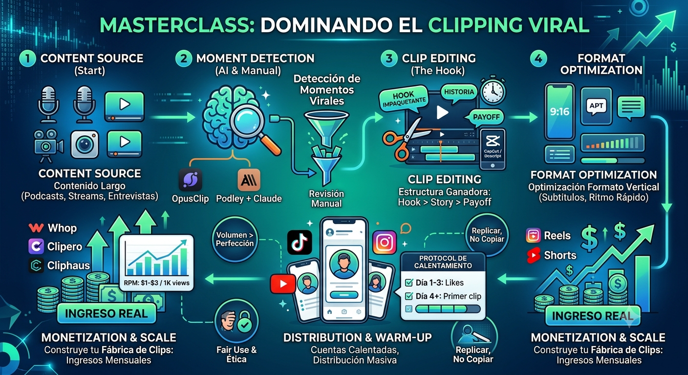
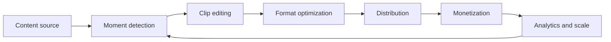
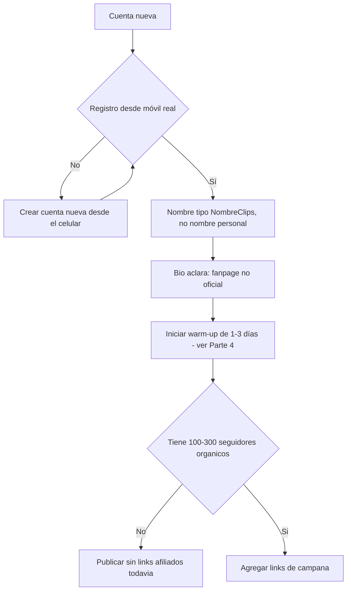
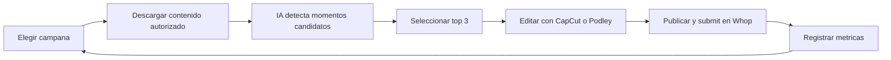

# 🎬 MASTERCLASS: Dominando el Clipping Viral - La Fábrica de Contenido de Segunda Vida



## 🚀 INTRODUCCIÓN: POR QUÉ ESTA MASTERCLASS ES DIFERENTE

La creación de contenido digital cambió de reglas. Ya no basta con producir un solo video exitoso. Hoy la ventaja está en quienes pueden transformar horas de contenido largo en decenas de fragmentos cortos, optimizados y distribuidos masivamente.

Este masterclass propone un sistema integrado: **diagnosticar momentos virales, editar con IA, calentar cuentas, publicar con volumen y monetizar por reproducciones**.

La meta no es volverse famoso. La meta es construir una **fábrica de clips** que genere ingresos reales desde cualquier fuente de contenido: podcasts, entrevistas, streams o programas de radio.

> 🎯 **Objetivo de aprendizaje** — Al final de esta guía vas a poder diseñar un workflow end-to-end para transformar contenido largo en clips, preparar cuentas de forma segura, ejecutar una estrategia de volumen y monetizar en Whop y otras plataformas.

> ⚠️ **Advertencia educativa** — Este contenido es formativo. El clipping requiere autorización explícita del creador original del contenido fuente. Respetá siempre los derechos de autor, las reglas de cada campaña, los términos de servicio de cada plataforma y las normas de publicidad/transparencia vigentes en tu país. Los montos de RPM, comisiones y presupuestos mencionados en esta guía son de referencia — cambian con frecuencia y deben verificarse directamente en cada plataforma antes de tomar decisiones.

---

## 🗺️ MAPA DEL WORKFLOW — FÁBRICA DE CLIPS



| Fase | Pregunta que responde | Output principal |
|------|-----------------------|------------------|
| **Content Source** | ¿De dónde obtengo el material? | Episodios, streams, entrevistas autorizadas |
| **Moment Detection** | ¿Qué fragmentos valen la pena? | Lista de momentos candidatos |
| **Clip Editing** | ¿Cómo lo hago viral? | Reels editados con hook, story, payoff |
| **Format Optimization** | ¿Está listo para cada red? | Subtítulos, velocidad, formato vertical |
| **Distribution** | ¿Cómo llego a la audiencia? | Cuentas calentadas, horarios optimizados |
| **Monetization** | ¿Cómo cobro? | Whop, Clipero, Cliphaus, RPM |
| **Analytics & Scale** | ¿Qué funciona y qué no? | Métricas de retención, views, ingresos |

### 🛤️ Dos caminos de ejecución

**Camino A — Profesional (con suscripciones):**
Whop/Cliphaus → OpusClip/WayInVideo → CapCut → móvil → submit

**Camino B — Open-source, sin costo de licencias:**
Whop → Podley + Claude (vía MCP) → yt-dlp → renderizado automático → submit

El Camino A prioriza velocidad de setup a cambio de costos mensuales fijos. El Camino B tiene una curva de aprendizaje técnica inicial (instalar y configurar herramientas) pero sin costos recurrentes de licencias.

---

## 🔐 PARTE 1: PREPARACIÓN SEGURA DE CUENTAS

### 💡 1.1 Principio central

Una cuenta mal preparada destruye cualquier estrategia de clipping antes de empezar. Las plataformas detectan comportamiento de bot, cuentas nuevas sin actividad previa y perfiles falsos. La preparación no es opcional: es la base de todo lo que sigue en esta guía.

### 🔀 1.2 Flujo de decisión (corregido: cada rama termina en una acción, no en un callejón sin salida)



### ✅ 1.3 Checklist de cuenta segura

| Check | Requisito |
|-------|-----------|
| Registro | Dispositivo móvil real (no emulador, no farm de cuentas) |
| Nombre | Formato "NombreClips", nunca el nombre personal del clipper |
| Biografía | Debe aclarar "fanpage no oficial" o equivalente |
| Links afiliados | Solo después de 100-300 seguidores orgánicos |
| Enfoque inicial | Una sola campaña o afiliación por cuenta |
| Transparencia | El contenido patrocinado debe estar identificado como tal (ver Parte 10.1) |
| Seguridad | No usurpar identidad ni imagen de figuras públicas o marcas reales |

### 💻 1.4 Código de validación de cuenta

```python
from dataclasses import dataclass

@dataclass
class AccountReadiness:
    seguidores: int
    tiene_links_afiliados: bool
    es_movil: bool
    nombre_clips: bool
    bio_aclara: bool
    dias_warmup_completados: int

def validar_cuenta_clipper(cuenta: AccountReadiness) -> dict:
    checks = {
        "registro_movil": cuenta.es_movil,
        "nombre_no_personal": cuenta.nombre_clips,
        "bio_fanpage": cuenta.bio_aclara,
        "warmup_completo": cuenta.dias_warmup_completados >= 1,
        "links_apropiados": cuenta.seguidores >= 100 or not cuenta.tiene_links_afiliados,
    }
    failed = [check for check, ok in checks.items() if not ok]
    if failed:
        raise ValueError(f"Cuenta no lista, faltan: {failed}")
    return {"valid": True, "checks": checks}

validar_cuenta_clipper(AccountReadiness(
    seguidores=250,
    tiene_links_afiliados=False,
    es_movil=True,
    nombre_clips=True,
    bio_aclara=True,
    dias_warmup_completados=3,
))
```

---

## 🎯 PARTE 2: IDENTIFICACIÓN DE MOMENTOS VIRALES

### 🔎 2.1 Qué buscar en el contenido largo

| Tipo de momento | Señal | Ejemplo | Retención esperada |
|-----------------|-------|---------|---------------------|
| **Hook Reactor** | Reacción emocional brusca | Cara de sorpresa genuina | 100%+ (relativo al benchmark del nicho) |
| **Hook Quote** | Frase poderosa y contundente | "Nadie te dice esto..." | 90%+ |
| **Hook Story** | Historia con inicio sorprendente | "Hice esto y pasó..." | 85%+ |
| **Hook Contrarian** | Opinión opuesta a la mayoría | "Todos dicen X pero..." | 80%+ |
| **Hook Tutorial** | Solución concreta en una frase | "Así arreglé mi..." | 75%+ |
| **Dato shock** | Número o estadística inesperada | "El 90% falla en..." | Variable, depende del contexto |

*Los porcentajes de retención son valores de referencia relativos, no garantías — la retención real depende del nicho, la audiencia y la ejecución del clip.*

### 📊 2.2 Framework de evaluación de potencial viral

```python
from dataclasses import dataclass

@dataclass
class MomentScore:
    emocion_fuerte: bool
    dato_impactante: bool
    duracion_segundos: float
    retencion_esperada: float  # 0.0 a 1.0, estimación subjetiva del editor

def evaluar_momento(m: MomentScore) -> dict:
    puntuacion = 0
    if m.emocion_fuerte:
        puntuacion += 30
    if m.dato_impactante:
        puntuacion += 25
    if m.duracion_segundos <= 30:
        puntuacion += 20
    if m.retencion_esperada > 0.7:
        puntuacion += 25

    recomendacion = "Publicar" if puntuacion >= 60 else "Descartar"
    return {"puntuacion": puntuacion, "recomendacion": recomendacion}

evaluar_momento(MomentScore(
    emocion_fuerte=True,
    dato_impactante=False,
    duracion_segundos=25,
    retencion_esperada=0.85,
))
```

**Nota de diseño:** este scoring es un punto de partida, no una fórmula definitiva — los pesos (30/25/20/25) conviene ajustarlos con tus propios datos históricos de retención una vez que tengas 30-50 clips publicados.

### ⚖️ 2.3 Manual vs. IA

| Método | Ventaja | Desventaja |
|--------|---------|------------|
| **Manual** | Control total, contexto completo | Lento, subjetivo, no escala |
| **IA (OpusClip)** | Velocidad, volumen | Puede perder matices y contexto |
| **IA + Revisión (Claude)** | Velocidad + entendimiento del lenguaje | Requiere setup técnico inicial |

---

## ✂️ PARTE 3: EDICIÓN EFICIENTE

### 🪝 3.1 Estructura Hook / Story / Payoff

| Componente | Duración | Función |
|------------|----------|---------|
| **Hook** | 0.5-3s | Captar atención inmediata (los primeros frames deciden si el usuario sigue viendo) |
| **Story** | 5-25s | Desarrollar el momento viral con ritmo, sin relleno |
| **Payoff** | 1-5s | Cierre, resolución o llamada a la acción |

### 🛠️ 3.2 Buenas prácticas de edición

- **Cortes cada 2-3 segundos**: mantiene la atención en formatos verticales de scroll rápido.
- **Subtítulos quemados siempre**: gran parte del consumo es sin audio.
- **Formato vertical 9:16** desde el primer corte, no un recorte posterior de un video horizontal.
- **Sin relleno**: cada frame debe justificar su lugar en el clip; si un segmento no suma, se corta.
- **Edición desde cero**: tomar el concepto viral, no clonar el clip de otro creador frame por frame.

### 💻 3.3 Código de validación de estructura de clip

```python
from dataclasses import dataclass

@dataclass
class ClipConfig:
    hook_max_seconds: float = 3.0
    story_max_seconds: float = 25.0
    payoff_max_seconds: float = 5.0
    max_duration: float = 60.0
    caption_required: bool = True
    vertical_format: bool = True

    def validate(self, clip_duration: float, has_captions: bool, is_vertical: bool) -> bool:
        return (
            clip_duration <= self.max_duration
            and has_captions == self.caption_required
            and is_vertical == self.vertical_format
        )

config = ClipConfig()
config.validate(clip_duration=42, has_captions=True, is_vertical=True)
```

---

## 🔥 PARTE 4: CALENTAMIENTO DEL ALGORITMO (WARM-UP)

### ❓ 4.1 Por qué es crítico

Los algoritmos de TikTok, Instagram y YouTube distinguen comportamiento humano de comportamiento de bot. Una cuenta nueva que sube contenido sin actividad previa suele marcarse como sospechosa y ver su alcance reducido — el warm-up existe para evitar justamente eso.

### 📅 4.2 Protocolo de calentamiento

| Día | Acción | Duración |
|-----|--------|----------|
| **Día 1** | Ver contenido del nicho + dar like + guardar posts | 20-30 min |
| **Día 2** | Repetir + seguir cuentas relevantes del nicho | 20-30 min |
| **Día 3** | Repetir + dejar comentarios orgánicos y relevantes | 20-30 min |
| **Día 4** | Publicar el primer reel | 1 clip |
| **Día 5-90** | Reel diario + engagement continuo | Volumen sostenido |

### 📈 4.3 Señales de que la cuenta ya está "calentada"

- Los videos se publican sin advertencias de "actividad inusual".
- El alcance inicial supera las 200-500 visitas sin promoción externa.
- La tasa de interacción (engagement rate) supera el 3-5%.
- El algoritmo empieza a sugerir contenido relevante en el feed propio (señal de que el perfil ya está "leído" correctamente).

---

## 📦 PARTE 5: ESTRATEGIA DE CONTENIDO Y VOLUMEN

### 🔁 5.1 El modelo de volumen

El clipping es un modelo de volumen, no de perfección. No se busca "el clip perfecto": se busca la idea con más probabilidad de funcionar, publicada con consistencia.

| Principio | Aplicación |
|-----------|------------|
| **Replicar, no copiar** | Tomar el concepto viral y editarlo desde cero con material propio/autorizado |
| **Ritmo rápido** | Cortes cada 2-3 segundos, sin tiempos muertos |
| **Sin relleno** | Cada frame debe aportar valor o se elimina |
| **Edición desde cero** | Nunca copy/paste literal de clips ajenos |
| **Equipo mínimo** | Un celular alcanza para arrancar; no hace falta estudio de edición |

### 🗓️ 5.2 Blueprint de contenido diario



---

## 🧰 PARTE 6: STACK DE HERRAMIENTAS (TABLA ÚNICA CONSOLIDADA)

### 🎬 6.1 Edición

| Herramienta | Uso | Precio de referencia | Notas |
|-------------|-----|----------------------|-------|
| **CapCut** | Edición móvil + templates | Gratis | El más usado en TikTok |
| **Descript** | Edición automática + subtítulos | Desde ~$12/mes | IA integrada para transcripción |
| **Runway ML** | Edición avanzada con IA | Desde ~$15/mes | Efectos profesionales |

### 🤖 6.2 Detección de momentos y generación asistida por IA

| Herramienta | Método | Precio de referencia | Ventaja |
|-------------|--------|----------------------|---------|
| **OpusClip** | IA analiza el video completo | Desde ~$19/mes | Decenas de clips candidatos en minutos |
| **WayInVideo** | Generación guiada por IA | Variable | Pensado para volumen alto (18+ clips/día) |
| **Podley + Claude** | Transcript + comprensión lingüística vía MCP | Gratis (sin suscripción) | Selección de momentos con contexto real, no solo palabras clave |

### 🆓 6.3 Workflow open-source con Podley + Claude

| Paso | Acción | Herramienta |
|------|--------|-------------|
| Setup | Instalar Node.js, Python, FFmpeg y Podley | Terminal |
| Conexión | Configurar el servidor MCP de Podley en Claude Desktop | Configuración de Claude |
| Selección | Elegir campaña en Whop (criterios: "Most Paid Out", presupuesto restante 20%+, RPM $1-3) | Whop web |
| Descarga | Descargar el episodio fuente con yt-dlp (solo contenido autorizado) | yt-dlp |
| Análisis | Claude analiza la transcripción y propone los 3 momentos con más potencial | Claude |
| Render | Podley corta, formatea a vertical y quema los subtítulos | Podley |
| Submit | Publicar en la red social y enviar el link a Whop | Móvil |

### 💰 6.4 Monetización y distribución (resumen — detalle en Parte 7)

| Herramienta | Uso | Notas |
|-------------|-----|-------|
| **Whop** | Marketplace de campañas de clipping | Plataforma principal para empezar |
| **Clipero** | Modelo de meritocracia creador-clipero | Relación transparente entre ambas partes |
| **Cliphaus / Clip Farm** | Agencias con campañas de presupuesto alto | Foco en volumen masivo |

*Los precios y condiciones de todas las herramientas de esta tabla cambian con frecuencia — verificalos en el sitio oficial de cada una antes de decidir tu stack.*

---

## 💵 PARTE 7: PLATAFORMAS DE MONETIZACIÓN

### ⚖️ 7.1 Comparación de plataformas

| Plataforma | Modelo | RPM de referencia | Ventaja | Mejor para |
|------------|--------|--------------------|---------|-------------|
| **Whop** | CPM directo | ~$1-3 por 1.000 views | Marketplace consolidado, fácil de empezar | Primeros pasos |
| **Clipero** | Meritocracia | Variable según campaña | Relación creador-clipero clara | Equipos colaborativos |
| **Cliphaus** | Presupuestos altos | ~$1 por 1.000 views | Campañas de gran volumen (históricamente $15K+) | Volumen masivo sostenido |
| **Clip Farm** | Similar a Whop | ~$1-3 por 1.000 views | Fácil acceso | Experimentación inicial |

*Estos RPM son valores históricos de referencia citados en la comunidad de clipping, no una garantía contractual — cada campaña define su propia tarifa y puede cambiarla sin aviso previo. Confirmá siempre el RPM vigente dentro de la plataforma antes de invertir tiempo en una campaña.*

### 🧮 7.2 Cálculo de ingresos estimados

```python
def calcular_ingresos_clipping(views_mensuales: int, rpm: float, comision_plataforma: float = 0.10) -> dict:
    ingreso_bruto = views_mensuales * rpm / 1000
    return {
        "views": views_mensuales,
        "rpm": rpm,
        "ingreso_bruto": round(ingreso_bruto, 2),
        "comision_plataforma": round(ingreso_bruto * comision_plataforma, 2),
        "ingreso_neto": round(ingreso_bruto * (1 - comision_plataforma), 2),
    }

calcular_ingresos_clipping(views_mensuales=2_000_000, rpm=1.0)
```

*La comisión de plataforma (10% en el ejemplo) es un valor ilustrativo — revisá el porcentaje real de la plataforma que uses, ya que varía entre Whop, Clipero y Cliphaus.*

### 💳 7.3 Proceso típico de pago en Whop

1. Unirse a una campaña dentro de Whop.
2. Calentar la cuenta (1-3 días, ver Parte 4) si todavía no está activada.
3. Verificar la cuenta con el código que indica la campaña en la bio.
4. Publicar el clip en la red social elegida.
5. Copiar el link del post y pegarlo en Whop **dentro de la ventana de tiempo que indique la campaña** (suele ser corta, del orden de 30 minutos — confirmar el plazo exacto en las reglas de cada campaña).
6. Esperar a que el clip alcance el mínimo de visitas exigido por la campaña.
7. El equipo de la campaña revisa el clip contra sus reglas.
8. Se aprueba el pago si cumple todos los requisitos.

---

## 📡 PARTE 8: DISTRIBUCIÓN MASIVA

### 🪖 8.1 El ejército de clippers

La clave del modelo actual no es solo la edición: es la distribución masiva. Las marcas y campañas reclutan a muchos clippers para publicar desde cuentas personales o de nicho, de forma que el contenido se sienta como una conversación espontánea entre pares, no como un anuncio tradicional.

**Esto exige transparencia**: si el contenido responde a una campaña paga, corresponde identificarlo como tal según las normas de publicidad de tu país y de cada plataforma (ver Parte 9.1). El modelo funciona a largo plazo cuando la audiencia confía en lo que ve — no a costa de esa confianza.

### 🤝 8.2 Modelos de trabajo

| Modelo | Descripción | Cuándo usarlo |
|--------|-------------|---------------|
| **Fijo** | Pago mensual por cantidad de clips entregados | Agencias con relación estable |
| **Por reproducción** | Pago proporcional a las views generadas | Whop, Cliphaus |
| **Afiliación** | Comisión por conversiones (venta, registro, etc.) | Productos digitales |
| **Meritocracia** | Se paga solo si el clip cumple metas definidas | Clipero |

### 📲 8.3 Canales de distribución

| Canal | Ventaja | Consideración |
|-------|---------|----------------|
| **TikTok** | Alcance orgánico más alto para cuentas nuevas | Algoritmo cambia con frecuencia |
| **Instagram Reels** | Buena integración con bio y links | Alcance orgánico menor que TikTok |
| **YouTube Shorts** | Monetización adicional propia de la plataforma | Requiere 1.000 suscriptores para monetizar directamente |
| **Cuentas propias** | Control total del canal | Requiere warm-up constante en cada cuenta nueva |

---

## 🛡️ PARTE 9: GESTIÓN DE RIESGOS Y ÉTICA

### 📢 9.1 Transparencia publicitaria (ampliado)

El riesgo más pasado por alto en el clipping no es técnico, es de confianza: publicar contenido patrocinado sin identificarlo como tal. Buenas prácticas mínimas:

- Si el clip forma parte de una campaña paga, indicalo en el video o en la descripción (por ejemplo, con una etiqueta de contenido pagado/colaboración cuando la plataforma lo permita).
- Revisá las normas de publicidad y protección al consumidor vigentes en tu país — varían, pero la mayoría exige distinguir contenido orgánico de contenido pagado.
- Nunca uses la identidad de una figura pública o marca real sin autorización, aunque el clip provenga de contenido público.

### ©️ 9.2 Derechos de autor y fair use

| Riesgo | Síntoma | Mitigación |
|--------|---------|------------|
| **Claim de copyright** | Video bajado o desmonetizado | Usar solo contenido con autorización explícita del creador original |
| **Pérdida de contexto** | El clip se malinterpreta sin el video original | Incluir suficiente contexto dentro del propio clip |
| **Marketing disfrazado** | Publicidad no revelada como tal | Aplicar la transparencia descripta en 9.1 |
| **Penalización de algoritmo** | Alcance bajo por cuenta nueva o sin warm-up | Completar el protocolo de warm-up antes de publicar con volumen |

### 📜 9.3 Reglas de campaña

- Leer siempre las normas específicas de cada campaña antes de sumarte.
- Algunas campañas exigen un porcentaje mínimo de audiencia de un país o idioma específico.
- Respetar los presupuestos y tiempos de aprobación indicados por la campaña.
- No incluir contenido sensible (menores, salud, violencia, etc.) sin autorización explícita y verificación de que cumple las políticas de cada plataforma.

---

## 🗓️ PARTE 10: BLUEPRINT DE 90 DÍAS

### ⏱️ 10.1 Timeline de referencia

| Período | Acción | Resultado esperado (orientativo) |
|---------|--------|-----------------------------------|
| **Días 1-3** | Warm-up + preparación de cuentas | Cuenta activada, sin advertencias de la plataforma |
| **Días 4-30** | 1 reel diario | Mes 1: resultados variables, priorizar consistencia sobre views |
| **Días 31-60** | 1 reel diario + optimización según métricas | Mes 2: crecimiento moderado si se ajusta el enfoque |
| **Días 61-90** | 1 reel diario + aumento de volumen | Mes 3: posible crecimiento acelerado si el mes 2 validó un ángulo |

*Los resultados varían enormemente según nicho, calidad de ejecución y suerte del algoritmo — esta tabla es un marco de disciplina, no una proyección de ingresos garantizada.*

### 🧱 10.2 Reglas de disciplina

- Priorizar volumen consistente por sobre la búsqueda del clip perfecto.
- No saltear el warm-up, aunque genere ansiedad por "perder tiempo".
- Replicar conceptos virales, no copiar clips ajenos.
- No abandonar la estrategia en el primer mes — el modelo de volumen rinde con el tiempo, no de inmediato.

---

## 🎓 PARTE 11: PRÁCTICA GUIADA — I DO / WE DO / YOU DO

### 👀 11.1 I Do — Diagnosticar contenido para clipping

**Objetivo:** identificar 3 momentos virales en un podcast de 1 hora (con autorización del creador para usarlo).

| Paso | Acción | Resultado esperado |
|------|--------|----------------------|
| 1 | Escuchar o transcribir el podcast completo | Transcripción disponible |
| 2 | Marcar frases con potencial (usando la tabla de la Parte 2.1) | ~10 candidatos |
| 3 | Evaluar cada candidato con el framework de la Parte 2.2 | Top 3 momentos |
| 4 | Estimar la duración ideal del clip | 15-45 segundos |

### 👥 11.2 We Do — Diseñar tu workflow personalizado

**Ejercicio grupal:** cada persona diseña su propio flujo, desde la fuente de contenido hasta la monetización.

| Decisión | Opción de referencia |
|----------|------------------------|
| Fuente de contenido | Podcast o stream de nicho, con autorización |
| Herramienta de edición | OpusClip o Podley + Claude |
| Plataforma de monetización | Whop para empezar |
| Warm-up | 3 días, 20-30 min diarios |
| Volumen inicial | 1 clip por día |

### 🚀 11.3 You Do — Implementar tu sistema completo

**Tarea:** armá tu primer pipeline de clipping en 7 días.

- Día 1: crear la cuenta desde el celular.
- Día 2-3: warm-up.
- Día 4: sumarte a una campaña en Whop.
- Día 5: descargar contenido autorizado y detectar momentos.
- Día 6: editar el primer clip.
- Día 7: publicar y hacer el submit.

---

## ❓ PREGUNTAS DE VERIFICACIÓN

1. **Aplica**: si tenés una cuenta nueva con 0 seguidores, ¿qué 3 pasos darías en los primeros 20 minutos para iniciar el warm-up?
2. **Analiza**: ¿por qué es más efectivo replicar conceptos virales que copiar exactamente el mismo contenido?
3. **Diseña**: creá un template de clip para un podcast de negocios usando la estructura Hook/Story/Payoff.
4. **Compara**: entre Whop, Clipero y Cliphaus, ¿cuál elegirías para empezar si tu objetivo es un ingreso mensual moderado, y por qué?
5. **Evalúa**: si un clip obtiene 50.000 views en 24 horas, ¿cómo calcularías el ingreso estimado con la función de la Parte 7.2?
6. **Optimiza**: ¿qué ajustarías en tu estrategia si después de 30 días tu promedio es bajo en views por clip?
7. **Reflexiona**: ¿qué riesgo ético te preocupa más al trabajar con clipping (transparencia, derechos de autor, otro) y cómo lo mitigarías?
8. **Calcula**: con un RPM de referencia y un objetivo mensual de ingresos, ¿cuántas views necesitás y cuántos clips diarios para alcanzarlo?
9. **Sintetiza**: del Blueprint de 90 días, ¿qué pasaría si saltás el warm-up y publicás con volumen desde el primer día?
10. **Planifica**: diseñá tu primer workflow personalizado integrando una herramienta de detección de momentos + una plataforma de monetización + tu propio celular, con tiempos realistas.

---

## 📖 GLOSARIO RÁPIDO

| Término | Definición |
|---------|------------|
| **Clipping** | Crear videos cortos (15-60s) a partir de contenido largo, con autorización del creador original |
| **RPM** | Revenue per mille — ingreso de referencia por cada 1.000 views |
| **Warm-up** | Días de engagement previo para que el algoritmo trate a la cuenta como legítima |
| **Hook** | Los primeros 0.5-3 segundos que captan la atención |
| **Meritocracia** | Modelo de pago donde se cobra por resultados, no por intentos |
| **Fanpage** | Página de fans identificada como no oficial, para evitar confusión de identidad |
| **Blueprint 90 días** | Compromiso de publicación diaria sostenida por 90 días |
| **Creador vs. clipper** | El creador produce el contenido largo; el clipper produce los fragmentos cortos |
| **Algoritmo** | Sistema que decide a quién mostrarle qué contenido |
| **Retención** | Porcentaje de la audiencia que ve el clip completo — señal clave para el algoritmo |

---

## ✅ CHECKLIST FINAL DE LA FÁBRICA DE CLIPS

| Bloque | Check |
|--------|-------|
| Cuenta | Registro móvil, nombre seguro, bio aclaratoria |
| Warm-up | 1-3 días de engagement previo completados |
| Contenido | Reel diario, replicar conceptos, editar desde cero |
| Herramientas | Stack elegido y configurado (Camino A o Camino B) |
| Monetización | Cuenta en la plataforma elegida + campaña seleccionada |
| Distribución | Publicación en horarios optimizados para el nicho |
| Transparencia | Contenido patrocinado identificado como tal |
| Métricas | Seguimiento de views, retención e ingresos |
| Riesgo | Derechos de autor, reglas de campaña y ética revisados |
| Disciplina | Blueprint de 90 días en marcha |

---

## 🔗 RECURSOS ADICIONALES

### 🧰 Herramientas
- **Whop**: https://whop.com
- **OpusClip**: https://www.opus.pro
- **CapCut**: https://www.capcut.com
- **Podley**: https://github.com/podley-ai/podley
- **yt-dlp**: https://github.com/yt-dlp/yt-dlp

### 🏢 Agencias y plataformas
- **Clipero**: plataforma de meritocracia para clippers
- **Cliphaus**: agencia con campañas de presupuesto alto
- **Clip Farm**: alternativa accesible para experimentación

*Verificá siempre los términos, tarifas y condiciones actuales directamente en cada sitio — este listado es orientativo y puede desactualizarse.*

### 📚 Lecturas y comunidades
- Foros de clipping en Discord
- Grupos de Facebook de clippers
- Canales de YouTube con casos de estudio reales

---

**Tu viaje como clipper profesional empieza con un solo clip. La consistencia, el volumen y la transparencia con tu audiencia son tu ventaja competitiva real.**