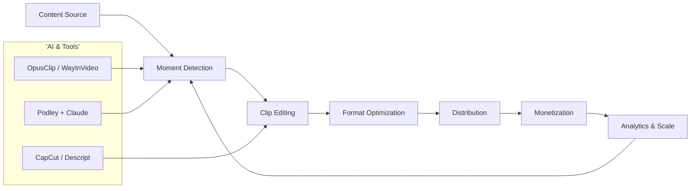
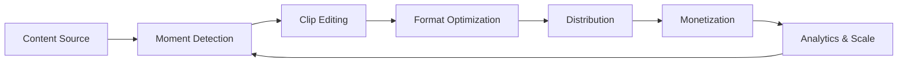
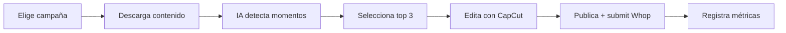

# MASTERCLASS: Dominando el Clipping Viral - La Fábrica de Contenido de Segunda Vida

## INTRODUCCIÓN: POR QUÉ ESTA MASTERCLASS ES DIFERENTE

La creación de contenido digital cambió de reglas. Ya no basta con producir un solo video exitoso. Hoy la ventaja está en quienes pueden transformar horas de contenido largo en decenas de fragmentos cortos, optimizados y distribuidos masivamente.

Este masterclass propone un sistema integrado: **diagnosticar momentos virales, editar con IA, calentar cuentas, publicar con volumen y monetizar por reproducciones**.

La meta no es volverse famoso. La meta es construir una **fábrica de clips** que genere ingresos reales desde cualquier fuente de contenido: podcasts, entrevistas, streams o programas de radio.

> **Objetivo de Aprendizaje** — Al final de esta guía, podrás diseñar un workflow end-to-end para transformar contenido largo en clips, preparar cuentas, ejecutar una estrategia de volumen y monetizar en Whop y otras plataformas.

> **Advertencia educativa** — Este contenido es formativo. Respetar siempre los derechos de autor, las reglas de las campañas y los términos de servicio de cada plataforma. El clipping requiere autorización del creador original.

---

## MAPA DEL WORKFLOW - FÁBRICA DE CLIPS



| Fase | Pregunta que responde | Output principal |
|------|-----------------------|------------------|
| **Content Source** | ¿De dónde obtengo el material? | Episodios, streams, entrevistas |
| **Moment Detection** | ¿Qué fragmentos valen la pena? | Lista de momentos candidatos |
| **Clip Editing** | ¿Cómo lo hago viral? | Reels editados con hook, story, payoff |
| **Format Optimization** | ¿Está listo para cada red? | Subtítulos, velocidad, formato vertical |
| **Distribution** | ¿Cómo llego a la audiencia? | Cuentas calentadas, horarios optimizados |
| **Monetization** | ¿Cómo cobro? | Whop, Clipero, Cliphaus, RPM |
| **Analytics & Scale** | ¿Qué funciona y qué no? | Métricas de retención, views, ingresos |

---

## PARTE 1: LA PREPARACIÓN SEGURA DE CUENTAS

### 1.1 Principio Central

Una cuenta mal preparada destruye cualquier estrategia de clipping antes de empezar. Las plataformas detectan comportamiento de bot, cuentas nuevas sin actividad previa y perfiles falsos. La preparación no es opcional: es la base de todo.

```mermaid
flowchart TD
    A[Cuenta Nueva] --> B{¿Registro desde móvil?}
    B -->|No| C[Alta riesgo de detección bot]
    B -->|Sí| D[Nombre "NombreClips" + fanpage]
    D --> E[Bio aclara "no oficial"]
    E --> F{¿Tienes 100-300 seguidores?}
    F -->|No| G[Sin links afiliados aún]
    F -->|Sí| H[Agregar links de campaña]
```

### 1.2 Checklist de Cuenta Segura

| Check | Requisito |
|-------|-----------|
| Registro | Dispositivo móvil real |
| Nombre | NombreClips, no nombre personal |
| Biografía | "Fanpage no oficial" |
| Links afiliados | Solo después de 100-300 seguidores |
| Enfoque inicial | UNA sola campaña o afiliación |
| Seguridad | No usurpar identidad de figuras públicas |

### 1.3 Código de Validación de Cuenta

```python
def validar_cuenta_clipper(seguidores, tiene_links_afiliados, es_movil, nombre_clips, bio_aclara):
    checks = {
        'registro_movil': es_movil,
        'nombre_no_personal': nombre_clips,
        'bio_fanpage': bio_aclara,
        'links_apropiados': seguidores >= 100 or not tiene_links_afiliados,
    }
    if not all(checks.values()):
        failed = [k for k, v in checks.items() if not v]
        raise ValueError(f'Cuenta no lista: {failed}')
    return {'valid': True, 'checks': checks}

validar_cuenta_clipper(
    seguidores=250,
    tiene_links_afiliados=False,
    es_movil=True,
    nombre_clips=True,
    bio_aclara=True
)
```

---

## PARTE 2: MAPA DEL WORKFLOW - FÁBRICA DE CLIPS

### 2.1 Visión General

El clipping moderno no es solo editar videos. Es un **sistema integrado** donde la IA detecta momentos, edita automáticamente, optimiza para cada plataforma, distribuye desde cuentas calentadas y cobra por reproducciones.



### 2.2 Dos Caminos de Ejecución

**Camino A: Profesional (suscripciones)**
Whop/Cliphaus → OpusClip/WayInVideo → CapCut → móvil → submit

**Camino B: Open-source gratis**
Whop → Podley + Claude (MCP) → yt-dlp → rendering automático → submit

---

## PARTE 3: IDENTIFICACIÓN DE MOMENTOS VIRALES

### 3.1 Qué buscar en el contenido largo

| Tipo de Momento | Señal | Ejemplo |
|-----------------|-------|---------|
| **Reacción** | Cambio emocional brusco | "No puede ser verdad..." |
| **Frase poderosa** | Afirmación contundente | "Nadie te dice esto..." |
| **Historia** | Inicio sorprendente | "Hice esto y pasó..." |
| **Contrarian** | Opinión opuesta a mayoría | "Todos dicen X pero..." |
| **Tutorial** | Solución en 1 frase | "Así arreglé mi..." |
| **Dato shock** | Número o estadística inesperada | "El 90% falla en..." |

### 3.2 Framework de Evaluación de Potencial Viral

```python
def evaluar_moment(clip_text, duracion, emocion_fuerte, dato_impactante, retencion_esperada):
    puntuacion = 0
    if emocion_fuerte:
        puntuacion += 30
    if dato_impactante:
        puntuacion += 25
    if duracion <= 30:
        puntuacion += 20
    if retencion_esperada > 0.7:
        puntuacion += 25
    return {'puntuacion': puntuacion, 'recomendacion': 'Publicar' if puntuacion >= 60 else 'Descartar'}

evaluar_moment(
    clip_text="Nadie te dice esto...",
    duracion=25,
    emocion_fuerte=True,
    dato_impactante=False,
    retencion_esperada=0.85
)
```

### 3.3 Manual vs IA

| Método | Ventaja | Desventaja |
|--------|---------|------------|
| **Manual** | Control total, contexto completo | Lento, subjetivo |
| **IA (OpusClip)** | Velocidad, volumen | Puede perder matices |
| **IA + Revisión (Claude)** | Velocidad + entendimiento profundo | Requiere setup inicial |

---

## PARTE 4: EDICIÓN EFICIENTE

### 4.1 Herramientas Principales

| Herramienta | Uso | Precio | Notas |
|-------------|-----|--------|-------|
| **CapCut** | Edición móvil + templates | Gratis | Popular en TikTok |
| **Descript** | Edición automática + subtítulos | $12+/mes | IA integrada |
| **Runway ML** | Edición avanzada | $15+/mes | Efectos profesionales |

### 4.2 Estructura Hook/Story/Payoff

| Componente | Duración | Función |
|------------|----------|---------|
| **Hook** | 0.5-3s | Captar atención inmediata |
| **Story** | 5-25s | Desarrollar el momento viral |
| **Payoff** | 1-5s | Cierre o llamada a acción |

### 4.3 Código de Estructura de Clip

```python
@dataclass
class ClipConfig:
    hook_max_seconds: float = 3.0
    story_max_seconds: float = 25.0
    payoff_max_seconds: float = 5.0
    max_duration: float = 60.0
    caption_required: bool = True
    vertical_format: bool = True

    def validate(self, clip_duration: float) -> bool:
        return clip_duration <= self.max_duration and self.caption_required
```

---

## PARTE 5: CALENTAMIENTO DEL ALGORITMO

### 5.1 Por qué es crítico

Los algoritmos de TikTok, Instagram y YouTube detectan comportamiento humano vs bot. Una cuenta nueva que sube contenido sin actividad previa es marcada como sospechosa y penalizada con reach reducido.

### 5.2 Protocolo de Calentamiento

| Día | Acción | Duración |
|-----|--------|----------|
| **Día 1** | Ver contenido + likes + guardados | 20-30 min |
| **Día 2** | Repetir + seguir cuentas relevantes | 20-30 min |
| **Día 3** | Repetir + comentarios orgánicos | 20-30 min |
| **Día 4** | Primer reel diario | 1 clip |
| **Día 5-90** | Reel diario + engagement continuo | Volumen |

### 5.3 Señales de Cuenta Calentada

- Videos se publican sin advertencia de "actividad inusual"
- Reach inicial > 200-500 views
- Engagement rate > 3-5%
- Algoritmo empieza a sugerir contenido

---

## PARTE 6: ESTRATEGIA DE CONTENIDO

### 6.1 El Modelo de Volumen

El clipping es un modelo de volumen, no de perfección. No busques el clip perfecto: busca la idea ganadora.

| Principio | Aplicación |
|-----------|------------|
| **Replicar, no copiar** | Toma conceptos virales y edita desde cero |
| **Ritmo rápido** | Cortes cada 2-3 segundos |
| **Sin relleno** | Cada frame debe aportar valor |
| **Edición desde cero** | No copy/paste de clips ajenos |
| **Equipo mínimo** | Solo móvil necesario inicialmente |

### 6.2 Blueprint de Contenido Diario



---

## PARTE 7: HERRAMIENTAS Y STACK TECNOLÓGICO

### 7.1 Herramientas Completas

| Herramienta | Uso | Precio | Notas |
|-------------|-----|--------|-------|
| **Descript** | Edición automática + subtítulos | $12+/mes | IA integrada |
| **CapCut** | Edición móvil + templates | Gratis | Popular en TikTok |
| **Whop** | Marketplace campañas clipping | Comisión | Plataforma principal |
| **Clipero** | Meritocracia para clippers | - | Modelo transparente creador-clipero |
| **Cliphaus/Clip Farm** | Agencias españolas | - | Campañas $15K+ RPM ~$1 |
| **Runway ML** | Edición con IA avanzada | $15+/mes | Efectos profesionales |
| **OpusClip** | Detección automática momentos | $19+/mes | Integración con redes |
| **WayInVideo** | Generación clips IA | - | Volumen crítico (18+/día) |
| **Podley + Claude** | Workflow open-source gratis | Gratis | Sin suscripciones mensuales |

### 7.2 Workflow Open-Source con Podley + Claude

| Paso | Acción | Herramienta |
|------|--------|-------------|
| Setup | Instalar Node, Python, FFmpeg, Podley | Terminal |
| Conexión | Configurar MCP en Claude Desktop | Claude config |
| Selección | Whop: Most Paid Out + budget 20%+ + RPM $1-3 | Whop web |
| Descarga | yt-dlp para descargar episodio | yt-dlp |
| Análisis | Claude analiza transcript y elige top 3 moments | Claude AI |
| Render | Podley corta, formatea vertical, quema captions | Podley |
| Submit | Subir a redes + link a Whop | Móvil |

---

## PARTE 8: PLATAFORMAS DE MONETIZACIÓN

### 8.1 Comparación de Plataformas

| Plataforma | Modelo | RPM típico | Ventaja | Mejor para |
|------------|--------|------------|---------|------------|
| **Whop** | CPM directo | $1-$3/1K views | Marketplace consolidado | Inicios rápidos |
| **Clipero** | Meritocracia | Variable | Relación creador-clipero clara | Equipos colaborativos |
| **Cliphaus** | Presupuestos altos | ~$1/1K views | Campañas $15K+ | Volumen masivo |
| **Clip Farm** | Similar Whop | $1-$3/1K views | Fácil acceso | Experimentación |

### 8.2 Cálculo de Ingresos

```python
def calcular_ingresos_clipping(views_mensuales, rpm):
    return {
        'views': views_mensuales,
        'rpm': rpm,
        'ingreso_bruto': views_mensuales * rpm / 1000,
        'comision_plataforma': views_mensuales * rpm / 1000 * 0.1,
        'ingreso_neto': views_mensuales * rpm / 1000 * 0.9,
    }

calcular_ingresos_clipping(views_mensuales=2_000_000, rpm=1.0)
```

### 8.3 Proceso de Pago Whop

1. Unirse a campaña Whop
2. Calentar cuenta 1-3 días
3. Verificar cuenta (código en bio)
4. Subir clip a red social
5. Copiar link y pegar en Whop dentro de **30 minutos**
6. Esperar mínimo 3,000 visitas
7. Equipo revisa clip
8. Pago aprobado

---

## PARTE 9: DISTRIBUCIÓN MASIVA

### 9.1 El Ejército de Clippers

La clave del éxito actual no es solo la edición, sino la distribución masiva. Las marcas contratan "ejércitos" de personas para que publiquen estos clips desde cuentas personales. La publicidad se siente como una conversación espontánea, no como un anuncio tradicional.

### 9.2 Modelos de Trabajo

| Modelo | Descripción | Cuándo usarlo |
|--------|-------------|---------------|
| **Fijo** | Pago mensual por cantidad de clips | Agencias estables |
| **Por reproducción** | Pago por views generadas | Whop, Cliphaus |
| **Afiliación** | Comisión por conversiones | Productos digitales |
| **Meritocracia** | Solo se paga si el clip cumple metas | Clipero |

### 9.3 Canales de Distribución

| Canal | Ventaja | Consideración |
|-------|---------|---------------|
| **TikTok** | Alcance orgánico más alto | Algoritmo cambiante |
| **Instagram Reels** | Integración con bio | Menor alcance que TikTok |
| **YouTube Shorts** | Monetización adicional | Requiere 1K suscriptores |
| **Cuentas propias** | Control total | Requiere warm-up constante |

---

## PARTE 10: AUTOMATIZACIÓN CON IA

### 10.1 Detección Automática de Momentos

| Herramienta | Método | Ventaja |
|-------------|--------|---------|
| **OpusClip** | IA analiza video completo | Decenas de clips en minutos |
| **WayInVideo** | Generación guiada | Volumen crítico (18+/día) |
| **Podley + Claude** | Transcript + entendimiento lingüístico | Selección con contexto real |

### 10.2 Ventajas de Claude + Podley

- Sin suscripciones mensuales
- Entiende matices del lenguaje, no solo buzzwords
- Selecciona momentos con profundidad real
- Render automático vertical + captions quemados

---

## PARTE 11: GESTIÓN DE RIESGOS

### 11.1 Derechos de Autor y Fair Use

| Riesgo | Síntoma | Mitigación |
|--------|---------|------------|
| **Claim de copyright** | Video bajado o demonetizado | Usar solo contenido autorizado |
| **Pérdida de contexto** | Clip incomprendido sin original | Incluir suficiente contexto en el clip |
| **Marketing disfrazado** | Publicidad no revelada | Transparencia con audiencia |
| **Penalización algoritmo** | Reach bajo por cuenta nueva | Warm-up previo obligatorio |

### 11.2 Reglas de Campaña

- Leer siempre las normas de cada campaña
- Algunas requieren porcentaje específico de audiencia española
- Respetar presupuestos y tiempos de aprobación
- No incluir contenido sensible sin autorización

---

## PARTE 12: BLUEPRINT DE 90 DÍAS

### 12.1 Timeline Probado

| Período | Acción | Resultado esperado |
|---------|--------|--------------------|
| **Días 1-3** | Warm-up + preparación cuentas | Cuenta "activada" |
| **Días 4-30** | 1 reel diario | Mes 1: 0-500 views promedio |
| **Días 31-60** | 1 reel diario + optimización | Mes 2: crecimiento moderado |
| **Días 61-90** | 1 reel diario + volumen | Mes 3: crecimiento exponencial |

### 12.2 Reglas de Disciplina

- No busca perfección, prioriza volumen
- No saltar el warm-up
- No copiar clips, replicar conceptos
- No abandonar en el primer mes

---

## PARTE 13: I DO / WE DO / YOU DO

### 13.1 I Do — Diagnosticar Contenido para Clipping

**Objetivo:** identificar 3 momentos virales en un podcast de 1 hora.

| Paso | Acción | Resultado esperado |
|------|--------|--------------------|
| 1 | Escuchar podcast completo | Transcripción |
| 2 | Marcar frases poderosas | 10 candidatos |
| 3 | Evaluar con framework | Top 3 momentos |
| 4 | Estimar duración clip | 15-45 segundos |

### 13.2 We Do — Diseñar Workflow Personalizado

**Ejercicio grupal:** cada persona diseña su flujo desde source hasta monetización.

| Decisión | Opción recomendada |
|----------|--------------------|
| Fuente de contenido | Podcast/stream de nicho |
| Herramienta de edición | OpusClip o Podley + Claude |
| Plataforma monetización | Whop para inicio |
| Warm-up | 3 días, 20 min diarios |
| Volumen inicial | 1 clip/día |

### 13.3 You Do — Implementar Sistema Completo

**Tarea:** crea tu primer pipeline de clipping en 7 días.

- Día 1: Crear cuenta desde móvil
- Día 2-3: Warm-up
- Día 4: Unirse a campaña Whop
- Día 5: Descargar contenido y detectar momentos
- Día 6: Editar primer clip
- Día 7: Publicar y submit

---

## PARTE 14: TIPOS DE CLIPS QUE GENERAN VIRALIDAD

| Tipo de Clip | Momento Clave | Retención | Ejemplo |
|-------------|--------------|-----------|---------|
| **Hook Reactor** | Reacción impactante | 100%+ | Caras de sorpresa |
| **Hook Quote** | Frase poderosa | 90%+ | "No puede ser verdad..." |
| **Hook Story** | Historia corta | 85%+ | "Hice esto y pasó..." |
| **Hook Contrarian** | Opinión opuesta | 80%+ | "Todos dicen X pero..." |
| **Hook Tutorial** | Solución rápida | 75%+ | "Así arreglé mi..." |

---

## PREGUNTAS DE VERIFICACIÓN

1. **Aplica**: Si tienes una cuenta nueva con 0 seguidores, ¿qué 3 pasos darías en los primeros 20 minutos para iniciar el warm-up?
2. **Analiza**: ¿Por qué es más efectivo replicar conceptos virales que copiar exactamente el mismo contenido?
3. **Diseña**: Crea un template de clip para un podcast de negocios usando estructura Hook/Story/Payoff.
4. **Compara**: Entre Whop, Clipero y Cliphaus, ¿cuál elegirías para empezar si tu objetivo es $2,000/mes y por qué?
5. **Evalúa**: Si un clip obtiene 50,000 views en 24 horas, ¿cómo calcularías el ingreso estimado y cuándo solicitarías pago?
6. **Optimiza**: ¿Qué ajustarías en tu estrategia si después de 30 días tu promedio es 500 views por clip?
7. **Reflexiona**: ¿Qué riesgo ético tienes más al trabajar con clipping y cómo lo mitigarías?
8. **Calcula**: Con un RPM de $1.5 y objetivo de $1,500/mes, ¿cuántas views necesitas y cuántos clips diarios para alcanzarlo?
9. **Sintetiza**: Del Blueprint de 90 días, ¿qué pasaría si saltas el warm-up y subes directo el primer día?
10. **Planifica**: Diseña tu primer workflow personalizado integrando OpusClip + Whop + móvil, con tiempos realistas.

---

## GLOSARIO RÁPIDO

| Término | Definición |
|---------|------------|
| **Clipping** | Crear videos cortos (15-60s) desde contenido largo |
| **RPM** | Revenue per 1,000 views (pago por mil vistas) |
| **Warm-up** | 1-7 días de engagement previo para "activar" el algoritmo |
| **Hook** | Primeros 0.5-3 segundos que captan atención |
| **Meritocracia** | Sistema donde se paga por resultados, no por intentos |
| **Fanpage** | Página de fans no oficial (evita problemas legales) |
| **Blueprint 90 días** | Compromiso de 1 reel diario por 90 días para crecimiento exponencial |
| **Creador vs Clipper** | Creador hace contenido largo, clipper hace los fragmentos virales |
| **Algoritmo** | Sistema que decide qué contenido mostrar a quién |
| **Retención** | % de usuarios que ven el video completo (clave para viralidad) |

---

## CHECKLIST FINAL DE LA FÁBRICA DE CLIPS

| Bloque | Check |
|--------|-------|
| Cuenta | Registro móvil, nombre seguro, bio aclaratoria |
| Warm-up | 1-3 días de engagement previo |
| Contenido | Reel diario, replicar conceptos, editar desde cero |
| Herramientas | Stack elegido (OpusClip o Podley + Claude) |
| Monetización | Cuenta Whop + campaña seleccionada |
| Distribución | Publicación en horarios optimizados |
| Métricas | Seguimiento de views, retención e ingresos |
| Riesgo | Derechos de autor, reglas de campaña, ética |
| Disciplina | Blueprint 90 días aplicado |
| Escalamiento | Análisis semanal de qué funciona |

---

## RECURSOS ADICIONALES

### Herramientas
- **Whop**: https://whop.com
- **OpusClip**: https://www.opus.pro
- **CapCut**: https://www.capcut.com
- **Podley**: https://github.com/podley-ai/podley
- **yt-dlp**: https://github.com/yt-dlp/yt-dlp

### Agencias y Plataformas
- **Clipero**: Plataforma de meritocracia para clippers
- **Cliphaus**: Agencia española con campañas de $15K+
- **Clip Farm**: Alternativa accesible para experimentación

### Lecturas y Comunidades
- Foros de clipping en Discord
- Grupos de Facebook de clippers
- Canales de YouTube con case studies

---

**¡Tu viaje como clipper profesional comienza con un solo clip. La consistencia y el volumen son tu ventaja competitiva!**
