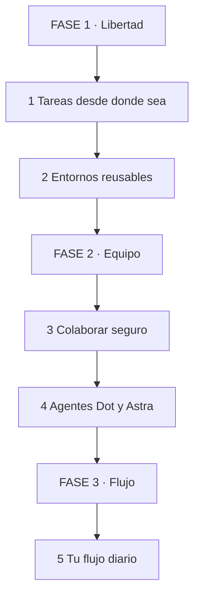
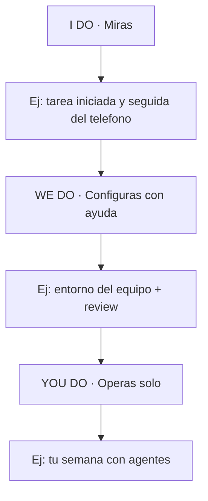

# ☁️ Codex Cloud — Codifica desde Cualquier Lugar 🤖💻

## 🎯 INTRODUCCIÓN 💡

Codex Cloud es un entorno de desarrollo en la nube: persistente, colaborativo y con agentes IA. Inicias una tarea en la nube y la sigues desde cualquier dispositivo, incluso el teléfono, sin la laptop abierta.

> **🎯 Objetivo** — Al terminar sabrás crear entornos reusables, delegar tareas a Dot y Astra y colaborar con code review avanzado.

> **⚠️ Nota** — Guía basada en el video de presentación. Verifica disponibilidad y planes en tu cuenta.

---

## 🗺️ MAPA — LEE DE ARRIBA HACIA ABAJO 🗺️

Cómo leerlo: empiezas en FASE 1, bajas hasta FASE 3. Sin entorno definido, los agentes trabajan sobre arena.

| Fase 🧩 | Qué logras 🎯 | Habilidad 🛠️ |
|------|---------------|--------------|
| **FASE 1 · Libertad** (1-2) | Trabajas sin laptop atada | Configurar entornos |
| **FASE 2 · Equipo** (3-4) | Colaboras con secrets seguros | Delegar a agentes |
| **FASE 3 · Flujo** (5) | Rutina diaria en la nube | Operar en cloud |

### Cómo aprenderla: I Do → We Do → You Do

---

## 📱 1. PERSISTENCIA Y FLEXIBILIDAD

Inicia tareas en la nube y accede desde cualquier dispositivo, incluso el teléfono, sin mantener la laptop abierta. Soporta interacción por voz en movimiento.

| Antes 📋 | Con Codex Cloud 🎯 |
|----------|--------------------|
| Laptop abierta = trabajo avanza | La nube trabaja, tú revisas |
| Solo desde tu máquina configurada | Teléfono, tablet o cualquier PC |
| Escribir todo | Voz para indicaciones rápidas en movimiento |

> **📌 Idea clave** — Tu laptop deja de ser el servidor. Es solo una ventana más.

---

## 📦 2. ENTORNOS REUSABLES

Crea entornos nombrados que empaquetan repos, red, variables y secrets. Funcionan como snapshots: el equipo no repite setups.

| Incluye 📋 | Para qué 🎯 |
|------------|-------------|
| Repositorios | Código listo al abrir |
| Red | Accesos y permisos del proyecto |
| Variables + secrets | Config sin exponer valores |
| Nombre reusable | "frontend-v2" se comparte al equipo |

> **📌 Idea clave** — Si tu onboarding tarda días, tu entorno está mal. Un buen entorno se clona en minutos.

---

## 🤝 3. COLABORAR SEGURO

| Feature 📋 | Qué resuelve 🎯 |
|------------|-----------------|
| Onboarding por chat | Nuevos productivos sin manual de 50 páginas |
| Vault personal + secrets | Cada uno guarda lo suyo, el equipo comparte lo común |
| Code review avanzado | Revisión con contexto del entorno, no solo diff |

---

## 🤖 4. AGENTES DOT Y ASTRA

Dot y Astra automatizan research de repos, creación de PRs, tests y monitoreo de estado. Tú te quedas con el trabajo creativo.

| Delega ✅ | Hazlo tú 🔴 |
|-----------|-------------|
| Research inicial del repo | Diseño de arquitectura |
| PRs de rutina + tests | Merge final sin revisar |
| Monitoreo de estado | Incidentes críticos |

> **📌 Idea clave** — Los agentes preparan, tú decides. Revisa cada PR como si lo escribiera un junior rápido.

---

## 🔁 5. TU FLUJO DIARIO

1. Mañana: revisa estado de tareas nocturnas desde el teléfono.
2. Define el entorno del día (1 comando, 0 setup).
3. Delega research/tests a Dot y Astra.
4. Tarde: review avanzado + merges.
5. Voz en movimiento para instrucciones y seguimiento.

---

## 🧩 I DO / WE DO / YOU DO

### I Do — Primera tarea en la nube

| Paso | Acción | Resultado |
|------|--------|-----------|
| 1 | Inicia tarea en la nube | Corre sin tu laptop |
| 2 | Revísala del teléfono | Acceso verificado |
| 3 | Prueba 1 comando por voz | Canal alternativo |

### We Do — Entorno del equipo

| Decisión | Opción | Por qué |
|----------|--------|---------|
| Repos | Los 2 core | 80% del trabajo |
| Secrets | Vault + compartidos | Seguridad sin fricción |
| Nombre | Versión clara | Reusable por todos |

### You Do — Semana con agentes

| Criterio | Peso |
|----------|------|
| Entorno reusable creado | 30% |
| 3+ tareas delegadas a agentes | 30% |
| Review avanzado usado | 20% |
| 1 día sin laptop atada | 20% |

---

## ✅ CHECKLIST

| Bloque 📦 | Check ✔️ |
|--------|-------|
| Acceso | Tarea seguida del teléfono |
| Entorno | Reusable con repos + secrets |
| Colab | Onboarding + review probados |
| Agentes | Dot/Astra con PRs revisados |
| Flujo | Rutina diaria definida |

---

## 📝 PREGUNTAS

1. ¿Qué tarea tuya podría correr de noche en la nube?
2. ¿Qué lleva tu entorno ideal? Lista repos, red y secrets.
3. ¿Qué delegarías a Dot/Astra esta semana y qué revisarías tú?
4. ¿Cuánto tarda hoy tu setup? ¿Cuánto con entorno reusable?
5. ¿Qué harías con 1 día sin depender de tu laptop?

---

## 📖 GLOSARIO

| Término | Definición |
|---------|------------|
| **Codex Cloud** | Entorno dev en la nube, persistente y colaborativo |
| **Snapshot** | Entorno guardado y reusable |
| **Vault** | Bóveda personal de secrets |
| **Dot / Astra** | Agentes IA para tareas dev |
| **Review avanzado** | Revisión con contexto del entorno |

*Basada en el video de presentación de Codex Cloud.*
