# 🧠 Cómo funciona la compilación y ejecución de un programa: De la fuente a la CPU

## 🗺️ MAPA DEL CURSO

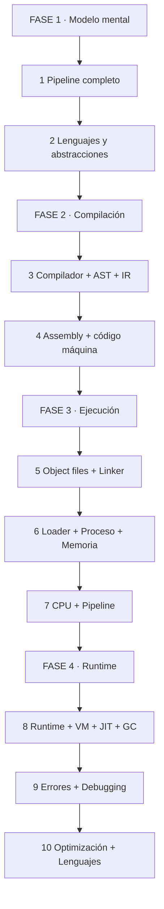

*Se lee de arriba hacia abajo. Empezás por el modelo mental, pasás por compilación, ejecución, runtime y terminás en errores y optimización.*

| 🧩 Fase | ❓ Pregunta que responde | 📤 Resultado principal |
|---------|------------------------|------------------------|
| **FASE 1 · Modelo** | ¿Qué pasa desde que escribo código hasta que se ejecuta? | Pipeline mental |
| **FASE 2 · Compilación** | ¿Cómo transforma el compilador código en instrucciones? | AST, IR, código máquina |
| **FASE 3 · Ejecución** | ¿Cómo carga el SO el programa y lo ejecuta la CPU? | Proceso, memoria, registros |
| **FASE 4 · Runtime** | ¿Qué hacen JIT, GC y runtime en lenguajes modernos? | Modelo de ejecución completo |


*Se lee de izquierda a derecha. Muestro el pipeline, lo recorremos juntos, lo aplicás solo.*

> **🎯 Objetivo** — Al final podrás responder con precisión qué hace cada componente del pipeline, por qué existen y cómo se conectan. Podrás debuggear, optimizar y elegir el lenguaje correcto para cada problema.
> **⚠️ Advertencia** — Este es un modelo mental simplificado pero técnicamente sólido. Cuando una explicación sea una simplificación, lo indicaré claramente.

---

## 🧩 PARTE 1: MODELO MENTAL — EL VIAJE COMPLETO 🧩

### 1.1 ❓ PRETEST

¿Qué sucede desde que escribo `int c = a + b;` hasta que la CPU ejecuta la suma?

> Respuesta esperada: El compilador transforma el código fuente en instrucciones de máquina, el linker combina módulos, el loader carga el ejecutable en memoria, el sistema operativo crea un proceso, y la CPU ejecuta las instrucciones paso a paso.
> Si acertás: camino rápido → andá al punto 7.

### 1.2 🎯 POR QUÉ + LOGRO

Importa porque **sin este modelo mental, programás sin entender las consecuencias de tu código**. Un memory leak, un segmentation fault o un performance issue son misterios. Con el modelo, son síntomas de una causa conocida. Vas a lograr **leer cualquier error y saber en qué etapa del pipeline ocurrió**.

### 1.3 ⚡ VICTORIA RÁPIDA (<5 min)

Escribí este código en C:

```c
int main() {
    int a = 10;
    int b = 20;
    int c = a + b;
    return c;
}
```

Compilalo con `gcc -o programa programa.c`. Ejecutá `./programa`. Esa es la superficie. Ahora vamos a ver qué hay debajo.

### 1.4 💡 CONCEPTO

Analogía: Ejecutar un programa es como **construir una casa** — el código fuente es el plano, el compilador es el arquitecto que traduce el plano a instrucciones de construcción, el linker es el contratista que une todos los planos parciales, el loader es la grúa que carga los materiales en el terreno, el proceso es la casa terminada, la memoria son las habitaciones, y la CPU son los habitantes que usan cada espacio.

Definición: El pipeline completo es: Código fuente → Compilador → AST → IR → Optimización → Assembly → Object file → Linker → Ejecutable → Loader → Proceso → Memoria virtual → Runtime → Sistema operativo → CPU → Instrucciones. Cada etapa transforma la representación del programa. No todos los lenguajes pasan por todas las etapas.

### 1.5 👀 EJEMPLO RESUELTO

| Etapa | Entrada | Salida | Responsable |
|-------|---------|--------|-------------|
| 1 | Código fuente | Tokens | Lexer |
| 2 | Tokens | AST | Parser |
| 3 | AST | IR | Compilador |
| 4 | IR | Assembly | Code generator |
| 5 | Assembly | Object file | Assembler |
| 6 | Object files | Ejecutable | Linker |
| 7 | Ejecutable | Proceso en memoria | Loader + SO |
| 8 | Proceso | Instrucciones ejecutadas | CPU |

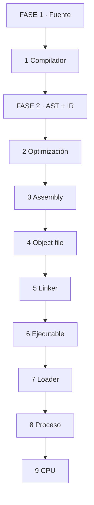

*Se lee de izquierda a derecha. Cada etapa transforma la representación.*

### 1.6 ⚠️ CONTRA-EJEMPLO / Error Típico

Error: Creer que el compilador convierte directamente código fuente en código máquina. En la mayoría de los compiladores modernos, el código fuente se transforma en una o más representaciones intermedias antes de generar código máquina.

Corrección: El compilador es una cadena de transformaciones: fuente → tokens → AST → IR → código máquina. Cada etapa permite análisis, validación y optimación.

### 1.7 🧪 PRÁCTICA

Dibujá el pipeline de ejecución para un programa simple en C. Marcá en qué etapa se detecta un error de sintaxis, un error de tipos y un segmentation fault.

> Respuesta esperada / criterio: Error de sintaxis en lexer/parser, error de tipos en semantic analysis, segmentation fault en runtime (CPU/MMU).

### 1.8 🔁 RECALL — Nivel Bloom: Comprender

¿Qué es el loader y cuándo se ejecuta? Respondé en 1 línea.

### 1.9 📌 IDEA CLAVE

El pipeline puede variar según el lenguaje, pero todas las ejecuciones terminan en CPU ejecutando instrucciones. Todo lo demás es transformación de representaciones.

### 1.10 ✅ AUTO-CHEQUEO + SIGUIENTE

- [ ] Puedo dibujar el pipeline completo de compilación y ejecución
- [ ] Entiendo qué hace cada etapa y qué produce
- [ ] Sé en qué etapa se detectan los errores más comunes

Siguiente: Lenguajes de programación y abstracciones.

---

## 🧩 PARTE 2: LENGUAJES DE PROGRAMACIÓN — ABSTRACCIONES SOBRE HARDWARE 🧩

### 2.1 ❓ PRETEST

¿Por qué necesitamos lenguajes de programación en lugar de escribir código máquina directamente?

> Respuesta esperada: Porque el código máquina es específico de cada arquitectura, ilegible para humanos y propenso a errores. Los lenguajes de alto nivel permiten expresar algoritmos de forma portable y legible.
> Si acertás: camino rápido → andá al punto 7.

### 2.2 🎯 POR QUÉ + LOGRO

Importa porque **los lenguajes de programación son el puente entre el pensamiento humano y la ejecución mecánica**. Entender ese puente te permite escribir código que se traduce eficientemente a instrucciones de máquina. Vas a lograr **distinguir entre abstracciones del lenguaje y su manifestación en hardware**.

### 2.3 ⚡ VICTORIA RÁPIDA (<5 min)

Escribí `a = b + c` en tres "niveles": (1) lenguaje humano, (2) lenguaje de programación (C), (3) assembly (`mov`, `add`). Esa es la transformación que hace el compilador.

### 2.4 💡 CONCEPTO

Analogía: Un lenguaje de programación es como **un idioma** — vos habláis en español (código fuente), el compilador es el traductor que convierte tu discurso en instrucciones que el hardware entiende (código máquina). Cuanto más alto el nivel, más lejos del hardware y más cerca del problema.

Definición: Lenguaje de alto nivel = abstracciones cercanas al dominio del problema (variables, funciones, objetos). Lenguaje de bajo nivel = cercano al hardware (registros, direcciones de memoria). Assembly = representación simbólica del código máquina. Machine code = secuencia de bits que la CPU ejecuta directamente.

### 2.5 👀 EJEMPLO RESUELTO

| Abstracción | Código | Se convierte en |
|-------------|--------|-----------------|
| Variable | `int x = 10;` | Dirección de memoria + valor |
| Función | `int suma(int a, int b)` | Bloque de código + dirección de entrada |
| Condicional | `if (x > 0)` | Comparación + salto condicional |
| Bucle | `for (int i = 0; i < 10; i++)` | Inicialización + comparación + incremento + salto |
| Clase | `class Persona { ... }` | Estructura de datos + funciones asociadas |
| Puntero | `int *p = &x;` | Dirección de memoria |

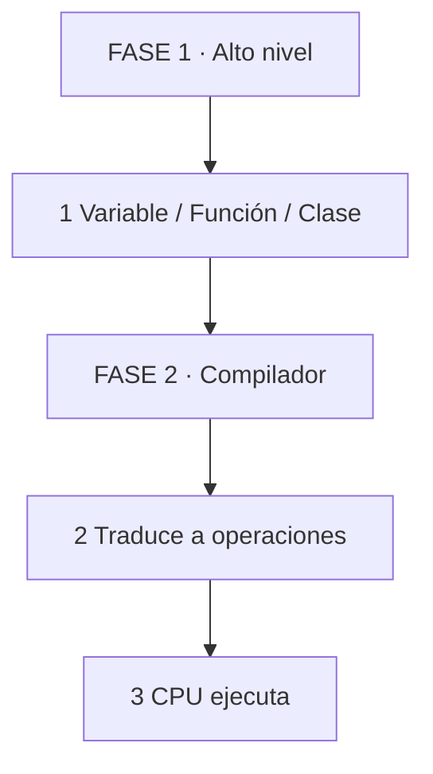

*Se lee de arriba hacia abajo. Abstracciones de alto nivel se traducen a operaciones elementales.*

### 2.6 ⚠️ CONTRA-EJEMPLO / Error Típico

Error: Creer que `int x = 10;` crea una "caja" donde guardar 10. En realidad, `x` es un nombre simbólico que el compilador traduce a una dirección de memoria (en el stack) donde se guarda el valor 10.

Corrección: Las variables son abstracciones. El compilador decide dónde viven: stack, heap, registros o directamente en código máquina como constantes.

### 2.7 🧪 PRÁCTICA

Tomá estas 3 abstracciones y explicá cómo se traducen a operaciones de máquina: (a) variable local, (b) llamada a función, (c) bucle `for`.

> Respuesta esperada / criterio: (a) reserva espacio en stack, guarda valor. (b) push de parámetros + call + return address. (c) inicialización + comparación + salto condicional.

### 2.8 🔁 RECALL — Nivel Bloom: Comprender

¿Por qué un lenguaje de programación no puede ejecutarse directamente en la CPU? Respondé en 1 línea.

### 2.9 📌 IDEA CLAVE

Los lenguajes son abstracciones. El compilador es el traductor. La CPU solo entiende instrucciones elementales.

### 2.10 ✅ AUTO-CHEQUEO + SIGUIENTE

- [ ] Distingo lenguaje alto nivel, bajo nivel, assembly y machine code
- [ ] Entiendo que las abstracciones se traducen a operaciones elementales
- [ ] Puedo explicar la traducción de variable, función y bucle a operaciones de máquina

Siguiente: Compiladores y el pipeline de transformación.

---

## 🧩 PARTE 3: COMPILADORES — EL MOTOR DE TRANSFORMACIÓN 🧩

### 3.1 ❓ PRETEST

¿Qué es un compilador y qué problema resuelve?

> Respuesta esperada: Es un programa que traduce código fuente de un lenguaje a otro lenguaje (usualmente código máquina o bytecode). Resuelve el problema de la brecha entre la expresión algorítmica humana y la ejecución mecánica de la CPU.
> Si acertás: camino rápido → andá al punto 7.

### 3.2 🎯 POR QUÉ + LOGRO

Importa porque **el compilador es el primer filtro de calidad y rendimiento de tu código**. Un buen compilador puede optimizar tu algoritmo sin que lo modifiques. Un compilador que no entendés puede generar código ineficiente o errores críticos. Vas a lograr **leer warnings y errores del compilador como consejos, no como ruido**.

### 3.3 ⚡ VICTORIA RÁPIDA (<5 min)

Compilá este código con `gcc -Wall -Wextra -pedantic`:

```c
int main() {
    int x = 10;
    char c = x; // warning: conversion
    return 0;
}
```

Leé el warning. Ese es el compilador hablando. Esa es la primera interacción.

### 3.4 💡 CONCEPTO

Analogía: Un compilador es como **un traductor jurado** — no solo convierte palabras, sino que verifica que el mensaje tenga sentido, que no haya contradicciones y que esté bien escrito. Si el texto original tiene errores, el traductor los señala antes de traducir.

Definición: Un compilador es un programa que recibe código fuente y produce código objeto o ejecutable. Sus etapas principales son: análisis léxico (lexer), análisis sintáctico (parser), análisis semántico, generación de IR, optimización y generación de código. Cada etapa transforma la representación del programa y detecta errores específicos.

### 3.5 👀 EJEMPLO RESUELTO

| Etapa | Entrada | Salida | Error detectado |
|-------|---------|--------|-----------------|
| Lexer | `int x = 10;` | Tokens: `INT`, `ID`, `=`, `NUM`, `;` | Carácter inválido |
| Parser | Tokens | AST | Sintaxis incorrecta |
| Semantic | AST | AST anotada | Tipo incompatible |
| IR gen | AST anotada | IR | — |
| Optimizer | IR | IR optimizada | — |
| Code gen | IR optimizada | Assembly | — |

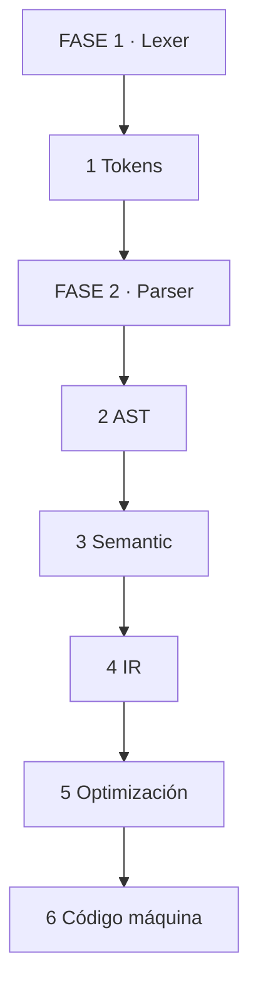

*Se lee de izquierda a derecha. Cada etapa transforma y valida.*

### 3.6 ⚠️ CONTRA-EJEMPLO / Error Típico

Error: Ignorar warnings del compilador. Un warning es una señal de que el compilador tuvo que hacer una suposición que puede ser peligrosa.

Corrección: Tratá los warnings como errores potenciales. Compilá con `-Wall -Wextra -Werror` en desarrollo. El compilador ve patrones que vos no ves.

### 3.7 🧪 PRÁCTICA

Compilá un programa con un error de sintaxis (falta un `;`), un error de tipos (asignación incompatible) y un warning (variable no usada). Anotá en qué etapa se detecta cada uno.

> Respuesta esperada / criterio: Error de sintaxis en parser, error de tipos en semantic analysis, warning en semantic analysis o code generation.

### 3.8 🔁 RECALL — Nivel Bloom: Comprender

¿Qué es el lexer y por qué es la primera etapa del compilador? Respondé en 1 línea.

### 3.9 📌 IDEA CLAVE

El compilador es una cadena de transformaciones y validaciones. Cada etapa detecta errores específicos. Los warnings son señales, no ruido.

### 3.10 ✅ AUTO-CHEQUEO + SIGUIENTE

- [ ] Entiendo las etapas del compilador y qué produce cada una
- [ ] Sé distinguir error de sintaxis, tipo y warning
- [ ] Uso flags de compilación que habilitan todas las advertencias

Siguiente: AST, IR y optimizaciones.

---

## 🧩 PARTE 4: AST, IR Y OPTIMIZACIONES 🧩

### 4.1 ❓ PRETEST

¿Qué es un AST y por qué es una representación mejor que el código fuente para optimizar?

> Respuesta esperada: Es un árbol que representa la estructura jerárquica del programa. A diferencia del código fuente (texto plano), el AST captura relaciones semánticas (precedencia de operadores, alcance de variables) y permite recorrer y transformar el programa de forma sistemática.
> Si acertás: camino rápido → andá al punto 7.

### 4.2 🎯 POR QUÉ + LOGRO

Importa porque **el AST es el modelo interno que el compilador usa para "entender" tu código**. Sin AST, el compilador solo haría reemplazos de texto. Con AST, puede analizar, transformar y optimizar tu programa de forma profunda. Vas a lograr **entender por qué ciertos patrones de código se optimizan mejor que otros**.

### 4.3 ⚡ VICTORIA RÁPIDA (<5 min)

Escribí `a + b * c` en papel. Dibujá el árbol: la multiplicación va más abajo que la suma porque tiene mayor precedencia. Esa es la estructura que el parser construye.

### 4.4 💡 CONCEPTO

Analogía: El AST es como **un mapa conceptual** — en lugar de leer un texto plano, el compilador lee un diagrama que muestra relaciones jerárquicas. "Esto es una suma, sus hijos son `a` y una multiplicación. La multiplicación tiene hijos `b` y `c`."

Definición: AST = Abstract Syntax Tree. Representación jerárquica de la estructura sintáctica del programa. IR = Intermediate Representation, representación intermedia entre el AST y el código máquina. Optimizaciones = transformaciones del IR que mejoran rendimiento o reducen tamaño sin cambiar el comportamiento. Ejemplos: constant folding, dead code elimination, inlining, loop optimization.

### 4.5 👀 EJEMPLO RESUELTO

**Expresión:** `a + b * c`

**AST:**

```
      +
     / \
    a   *
       / \
      b   c
```

**IR (simplificada):**

```
t1 = b * c
t2 = a + t1
```

**Después de constant folding** (si `b=2`, `c=3`):

```
t1 = 6
t2 = a + t1
```

**Después de dead code elimination** (si `t2` no se usa):

```
; código eliminado
```

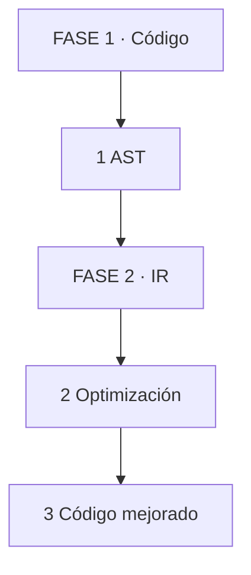

*Se lee de izquierda a derecha. Código se parsea, se representan operaciones, se optimizan.*

### 4.6 ⚠️ CONTRA-EJEMPLO / Error Típico

Error: Escribir código "más corto" esperando que sea más rápido. `a + b * c` y `a + (b * c)` son iguales para el compilador. La longitud del código fuente no determina la velocidad del ejecutable.

Corrección: Escribí código legible. El compilador aplica optimizaciones automáticas. Si necesitás velocidad, medí con profiler, no adivines.

### 4.7 🧪 PRÁCTICA

Tomá este código:

```c
int suma(int a, int b) {
    int c = a + b;
    return c;
}
int main() {
    int x = suma(2, 3);
    return x;
}
```

Explicá qué optimizaciones podría aplicar el compilador (constant propagation, inlining, dead code elimination).

> Respuesta esperada / criterio: El compilador puede reemplazar `suma(2, 3)` por `5` (constant propagation), inline la función, eliminar código muerto si el valor no se usa, y eventualmente reducir todo a `return 5;`.

### 4.8 🔁 RECALL — Nivel Bloom: Analizar

¿Por qué el AST es mejor que el código fuente para detectar errores de precedencia? Respondé en 1 línea.

### 4.9 📌 IDEA CLAVE

AST estructura el código, IR lo prepara para optimizar. El compilador transforma tu código en un grafo de operaciones y lo mejora sin que lo notes.

### 4.10 ✅ AUTO-CHEQUEO + SIGUIENTE

- [ ] Puedo dibujar el AST de una expresión simple
- [ ] Entiendo qué es IR y por qué existe
- [ ] Reconozco 3 optimizaciones comunes y cuándo aplican

Siguiente: Assembly y código máquina.

---

## 🧩 PARTE 5: ASSEMBLY Y CÓDIGO MÁQUINA 🧩

### 5.1 ❓ PRETEST

¿Qué es el código máquina y por qué no lo escribimos directamente?

> Respuesta esperada: Es una secuencia de bits que la CPU ejecuta directamente. Es específico de cada arquitectura (x86-64, ARM64), ilegible para humanos y propenso a errores. Los lenguajes de alto nivel y los compiladores lo generan automáticamente.
> Si acertás: camino rápido → andá al punto 7.

### 5.2 🎯 POR QUÉ + LOGRO

Importa porque **entender la relación entre código de alto nivel y código máquina te permite escribir código que se compila eficientemente**. Un `for` mal escrito puede generar cientos de instrucciones innecesarias. Con este conocimiento, podés anticipar el costo. Vas a lograr **leer assembly y reconocer patrones de código eficiente versus ineficiente**.

### 5.3 ⚡ VICTORIA RÁPIDA (<5 min)

Compilá `int c = a + b;` con `gcc -S programa.c -o programa.s`. Abrí el archivo `.s`. Es assembly. Esa es la traducción que hace el compilador.

### 5.4 💡 CONCEPTO

Analogía: El assembly es como **la receta escrita en lenguaje de cocina profesional** — cada paso es específico (cortar en cubos de 1cm, mezclar a 180 grados). El código máquina es la comida lista: el resultado final que cualquiera puede "comer" (ejecutar) sin entender la receta.

Definición: Assembly = representación simbólica del código máquina. Cada instrucción se escribe como `mov`, `add`, `jmp` en lugar de secuencias de bits. ISA = Instruction Set Architecture, el conjunto de instrucciones que una CPU entiende (x86-64, ARM64). Registros = almacenamiento interno de la CPU. El compilador genera assembly para una ISA específica.

### 5.5 👀 EJEMPLO RESUELTO

**Código C:**
```c
int suma(int a, int b) {
    return a + b;
}
```

**Assembly (x86-64, simplificado):**
```
suma:
    movl %edi, %eax    ; mueve 'a' a %eax
    addl %esi, %eax    ; suma 'b' a %eax
    ret                ; retorna
```

**Explicación:**
- `%edi` y `%esi` son registros donde llegan los parámetros (convención de llamada)
- `%eax` es el registro de retorno
- `addl` suma en 32 bits (l = long)
- `ret` devuelve el control al llamador

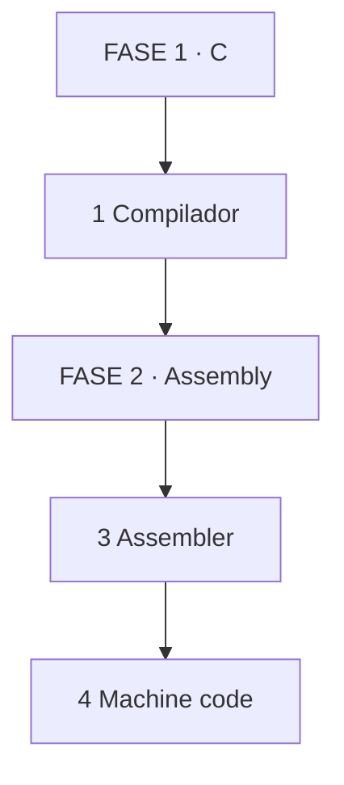

*Se lee de izquierda a derecha. Código C se ensambla en código máquina.*

### 5.6 ⚠️ CONTRA-EJEMPLO / Error Típico

Error: Creer que el assembly es igual en todas las CPUs. El assembly para x86-64 (Intel/AMD) es completamente distinto al de ARM64 (Apple Silicon, Raspberry Pi). Un compilador puede generar assembly para múltiples arquitecturas.

Corrección: El compilador es específico de arquitectura. `gcc` puede generar para x86-64, ARM64, RISC-V, etc. El código máquina resultante es diferente en cada caso.

### 5.7 🧪 PRÁCTICA

Compilá una función simple con `gcc -S` para x86-64 y para ARM64 (si tenés las herramientas). Compará las instrucciones. ¿Qué registros usan? ¿Cómo pasan parámetros?

> Respuesta esperada / criterio: x86-64 usa `%edi`, `%esi` para parámetros enteros. ARM64 usa `w0`, `w1`. Ambas hacen la suma, pero con registros y sintaxis distintos.

### 5.8 🔁 RECALL — Nivel Bloom: Comprender

¿Qué es la ISA y por qué es una abstracción entre el software y el hardware? Respondé en 1 línea.

### 5.9 📌 IDEA CLAVE

Assembly es la última representación legible antes de los bits. La ISA es el contrato entre software y hardware.

### 5.10 ✅ AUTO-CHEQUEO + SIGUIENTE

- [ ] Puedo generar y leer assembly de una función simple
- [ ] Entiendo la relación entre assembly, código máquina e ISA
- [ ] Reconozco registros, operaciones y convenciones de llamada

Siguiente: Object files y Linker.

---

## 🧩 PARTE 6: OBJECT FILES Y LINKER 🧩

### 6.1 ❓ PRETEST

¿Qué es un object file y por qué no se puede ejecutar directamente?

> Respuesta esperada: Es un archivo intermedio que contiene código máquina, datos y símbolos, pero las referencias entre símbolos están incompletas. El linker las resuelve para producir un ejecutable completo.
> Si acertás: camino rápido → andá al punto 7.

### 6.2 🎯 POR QUÉ + LOGRO

Importa porque **los object files son la unidad de compilación modular**. Entender cómo funcionan te permite depurar errores de linking, crear bibliotecas y entender por qué un símbolo no se encuentra. Vas a lograr **interpretar errores de linker y diseñar proyectos modulares**.

### 6.3 ⚡ VICTORIA RÁPIDA (<5 min)

Compilá dos archivos: `main.c` y `suma.c`. Ejecutá `gcc -c main.c` y `gcc -c suma.c`. Se generan `main.o` y `suma.o`. Esos son object files. Ahora linkeá: `gcc main.o suma.o -o programa`. Esa es la magia del linker.

### 6.4 💡 CONCEPTO

Analogía: Un object file es como **un capítulo de libro impreso pero sin índice** — tiene contenido, pero no sabés a qué página corresponde una referencia. El linker es el editor que arma el libro completo y crea el índice final.

Definición: Object file = archivo con código máquina, datos y símbolos (nombres de funciones/variables). Secciones: `.text` (código), `.data` (datos inicializados), `.bss` (datos sin inicializar), `.symtab` (tabla de símbolos). Linker = programa que combina object files y bibliotecas, resuelve referencias entre símbolos, asigna direcciones finales y produce un ejecutable.

### 6.5 👀 EJEMPLO RESUELTO

**Archivo `suma.c`:**
```c
int suma(int a, int b) {
    return a + b;
}
```

**Archivo `main.c`:**
```c
extern int suma(int a, int b);
int main() {
    return suma(2, 3);
}
```

**Compilación:**
```
gcc -c suma.c → suma.o  (define símbolo suma)
gcc -c main.c → main.o  (referencia símbolo suma)
gcc main.o suma.o -o programa → ejecutable (resuelve referencia)
```

**Si faltara `suma.o`:**
```
undefined reference to `suma'
```

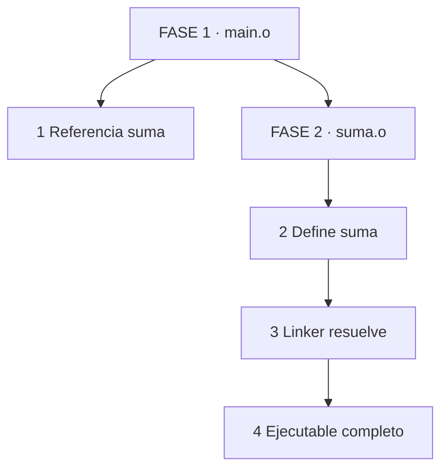

*Se lee de izquierda a derecha. main.o pide suma, suma.o la define, linker une.*

### 6.6 ⚠️ CONTRA-EJEMPLO / Error Típico

Error: Olvidar incluir un archivo `.o` o una biblioteca en el comando de linking. El linker no encuentra el símbolo y falla con "undefined reference".

Corrección: Verificá que todos los object files y bibliotecas están en el comando de linking. Usá `nm archivo.o` para ver qué símbolos exporta cada object file.

### 6.7 🧪 PRÁCTICA

Creá dos archivos C: uno con una función `multiplicar` y otro que la llame desde `main`. Compilá por separado, inspeccioná símbolos con `nm`, linkeá y ejecutá.

> Respuesta esperada / criterio: `multiplicar.o` exporta el símbolo `multiplicar`. `main.o` lo referencia. El linker resuelve la referencia. El programa ejecuta correctamente.

### 6.8 🔁 RECALL — Nivel Bloom: Aplicar

¿Qué hace el linker cuando encuentra la misma función en dos bibliotecas? Respondé en 1 línea.

### 6.9 📌 IDEA CLAVE

El linker es el editor que arma el ejecutable completo resolviendo referencias entre módulos. Sin linker, solo tenés piezas sueltas.

### 6.10 ✅ AUTO-CHEQUEO + SIGUIENTE

- [ ] Puedo compilar y linkear programas modulares
- [ ] Entiendo las secciones `.text`, `.data` y `.bss`
- [ ] Uso `nm` para inspeccionar símbolos

Siguiente: Loader y sistema operativo.

---

## 🧩 PARTE 7: LOADER Y SISTEMA OPERATIVO 🧩

### 7.1 ❓ PRETEST

¿Qué hace el loader cuando ejecuto `./programa`?

> Respuesta esperada: Lee el ejecutable, reserva memoria virtual, mapea secciones del archivo a direcciones de memoria, carga bibliotecas dinámicas, prepara el stack y transfiere control al punto de entrada (antes de `main`).
> Si acertás: camino rápido → andá al punto 7.

### 7.2 🎯 POR QUÉ + LOGRO

Importa porque **el loader es el puente entre el ejecutable en disco y el proceso en memoria**. Sin loader, tu programa es solo un archivo. Con loader, es un proceso vivo que el sistema operativo puede ejecutar. Vas a lograr **entender por qué un ejecutable no se ejecuta directamente, sino que requiere un sistema operativo**.

### 7.3 ⚡ VICTORIA RÁPIDA (<5 min)

Ejecutá `readelf -h programa` (Linux) o `otool -l programa` (macOS). Mirá el "Entry point address". Esa es la dirección donde empieza a ejecutar el loader. No es `main`, es el punto de entrada del runtime.

### 7.4 💡 CONCEPTO

Analogía: El loader es como **el equipo de mudanza** — recibe los planos (ejecutable), carga los muebles (secciones del archivo), ubica cada cosa en su habitación (memoria virtual), conecta los servicios (bibliotecas dinámicas) y finalmente te entrega las llaves (control al punto de entrada).

Definición: Loader = parte del sistema operativo que carga un ejecutable en memoria. Formato ejecutable: ELF (Linux), PE (Windows), Mach-O (macOS). El loader mapea secciones del archivo a direcciones virtuales, carga bibliotecas dinámicas, ejecuta el dynamic linker/loader, inicializa el stack y llama al punto de entrada (que ejecuta código de inicio del runtime antes de `main`).

### 7.5 👀 EJEMPLO RESUELTO

| Paso | Acción | Resultado |
|------|--------|-----------|
| 1 | Ejecutas `./programa` | Shell llama a `execve()` |
| 2 | Kernel lee ELF | Identifica formato y punto de entrada |
| 3 | Mapea secciones | `.text`, `.data`, `.bss` a memoria virtual |
| 4 | Carga bibliotecas dinámicas | `libc.so`, etc. |
| 5 | Prepara stack | Argumentos, variables de entorno |
| 6 | Transfiere control | Punto de entrada → runtime → `main` |

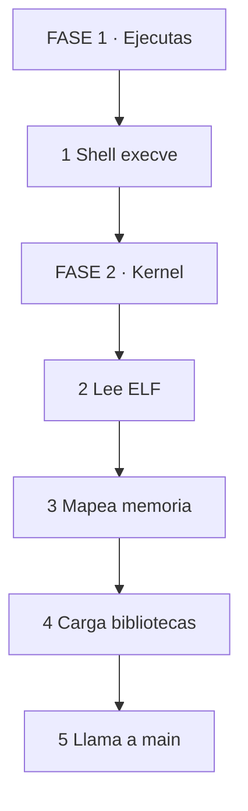

*Se lee de arriba hacia abajo. Desde el comando hasta la ejecución de main.*

### 7.6 ⚠️ CONTRA-EJEMPLO / Error Típico

Error: Creer que `main` es lo primero que se ejecuta. Antes de `main`, el runtime inicializa el stack, ejecuta constructores estáticos, carga bibliotecas y prepara el entorno.

Corrección: El punto de entrada del ejecutable es `_start` (o similar). Ese código prepara el entorno y luego llama a `main`. En lenguajes con runtime (Java, Python), el runtime se inicializa antes.

### 7.7 🧪 PRÁCTICA

Ejecutá `readelf -h programa` (o `otool -l` en macOS). Identificá el punto de entrada, la arquitectura y las secciones del ejecutable.

> Respuesta esperada / criterio: Entry point address, Machine (x86-64 o ARM64), y al menos 3 secciones (`.text`, `.data`, `.bss`).

### 7.8 🔁 RECALL — Nivel Bloom: Comprender

¿Por qué el sistema operativo es necesario para ejecutar un programa? Respondé en 1 línea.

### 7.9 📌 IDEA CLAVE

El loader transforma un archivo en un proceso. El sistema operativo es el intermediario obligatorio entre el disco y la CPU.

### 7.10 ✅ AUTO-CHEQUEO + SIGUIENTE

- [ ] Entiendo qué hace el loader antes de `main`
- [ ] Puedo inspeccionar un ejecutable ELF/PE/Mach-O
- [ ] Sé la diferencia entre archivo en disco y proceso en memoria

Siguiente: Proceso y memoria.

---

## 🧩 PARTE 8: PROCESO Y MEMORIA 🧩

### 8.1 ❓ PRETEST

¿Qué es un proceso y cómo se diferencia de un programa?

> Respuesta esperada: Un programa es un archivo ejecutable en disco. Un proceso es una instancia de ese programa en ejecución, con su propio espacio de memoria virtual, registros, stack, heap y estado. Cada ejecución del mismo programa crea un proceso distinto.
> Si acertás: camino rápido → andá al punto 7.

### 8.2 🎯 POR QUÉ + LOGRO

Importa porque **entender procesos y memoria es clave para debuggear crashes, memory leaks y problemas de concurrencia**. Sin este modelo, un segmentation fault es un mensaje críptico. Con el modelo, es un acceso ilegítimo a una dirección de memoria. Vas a lograr **leer un stack trace y saber qué está pasando en la memoria del proceso**.

### 8.3 ⚡ VICTORIA RÁPIDA (<5 min)

Ejecutá `ps aux | grep tu_programa`. Ese es tu proceso en la lista del sistema operativo. Tiene un PID, un estado y una dirección de memoria. Esa es la manifestación concreta del programa en ejecución.

### 8.4 💡 CONCEPTO

Analogía: Un proceso es como **un trabajador en una oficina** — el programa es el manual de procedimientos, el proceso es el trabajador leyéndolo, con su escritorio (memoria), su bandeja de entrada (stack) y su archivo temporal (heap). Dos trabajadores pueden leer el mismo manual pero tienen escritorios distintos.

Definición: Proceso = instancia de programa en ejecución, con espacio de memoria virtual propio. Espacio de memoria virtual: stack (crece hacia direcciones altas), heap (crece hacia direcciones altas), código/text, datos inicializados, BSS (datos sin inicializar), bibliotecas compartidas. Thread = hilo de ejecución dentro de un proceso, comparte memoria con otros threads del mismo proceso pero tiene su propio stack.

### 8.5 👀 EJEMPLO RESUELTO

**Diagrama de memoria virtual (x86-64, Linux):**

```
HIGH ADDRESS
┌──────────────────┐ ← Stack (crece hacia abajo)
│      STACK       │
│   (parámetros,   │
│  variables locales│
│  return address) │
├──────────────────┤
│                  │
│       HEAP       │
│  (malloc, new)   │
│                  │
├──────────────────┤ ← BSS (datos sin inicializar)
│       BSS        │
├──────────────────┤ ← Data (datos inicializados)
│       DATA       │
├──────────────────┤ ← Text (código ejecutable)
│      CODE        │
└──────────────────┘ ← LOW ADDRESS
```

**Llamada a función:**

```
Stack antes de llamar:
┌──────────────────┐
│   return addr    │ ← a donde volver
├──────────────────┤
│   parámetro b    │
├──────────────────┤
│   parámetro a    │
└──────────────────┘

Stack durante la función:
┌──────────────────┐
│   return addr    │
├──────────────────┤
│   parámetro b    │
├──────────────────┤
│   parámetro a    │
├──────────────────┤
│  variable local x│ ← Frame Pointer apunta aquí
└──────────────────┘
```

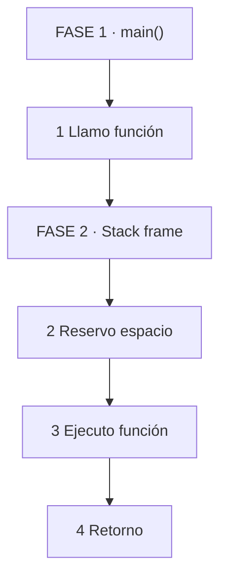

*Se lee de arriba hacia abajo. Llamada, reserva de stack frame, ejecución, retorno.*

### 8.6 ⚠️ CONTRA-EJEMPLO / Error Típico

Error: Creer que el stack y el heap son lo mismo porque ambos son memoria. Son zonas con propósitos completamente distintos: stack es automático y rápido, heap es manual y flexible.

Corrección: Stack = memoria automática para variables locales y llamadas a función. Heap = memoria dinámica asignada explícitamente. Acceder a stack es más rápido porque el puntero se gestiona con registros. Acceder a heap requiere seguimiento manual o automático (GC).

### 8.7 🧪 PRÁCTICA

Dibujá el estado del stack después de llamar a `funcA(1, 2)` que dentro llama a `funcB(3)` y dentro declara `int x = 10;`. Marcá parámetros, return address y variables locales.

> Respuesta esperada / criterio: Stack con return address de funcA, parámetros de funcA, return address de funcB, parámetro de funcB, variable local x.

### 8.8 🔁 RECALL — Nivel Bloom: Aplicar

¿Qué es un stack frame y qué información contiene? Respondé en 1 línea.

### 8.9 📌 IDEA CLAVE

Proceso = programa en ejecución. Memoria virtual = espacio privado. Stack y heap son zonas con reglas distintas.

### 8.10 ✅ AUTO-CHEQUEO + SIGUIENTE

- [ ] Puedo dibujar el layout de memoria de un proceso
- [ ] Entiendo qué es un stack frame y qué contiene
- [ ] Distingo proceso de thread y programa

Siguiente: Stack vs Heap y errores de memoria.

---

## 🧩 PARTE 9: STACK VS HEAP Y ERRORES DE MEMORIA 🧩

### 9.1 ❓ PRETEST

¿Dónde vive cada variable en este código?

```c
int global = 10;
int main() {
    int stack_var = 20;
    int *heap_ptr = malloc(sizeof(int));
    *heap_ptr = 30;
    return 0;
}
```

> Respuesta esperada: `global` en DATA/BSS, `stack_var` en stack, `heap_ptr` en stack (puntero), `*heap_ptr` en heap.
> Si acertás: camino rápido → andá al punto 7.

### 9.2 🎯 POR QUÉ + LOGRO

Importa porque **los errores de memoria son la causa #1 de crashes y vulnerabilidades en lenguajes sin GC**. Entender stack y heap te permite predecir dónde ocurrirá un memory leak, un dangling pointer o un stack overflow. Vas a lograr **diagnosticar errores de memoria por su síntoma, no por azar**.

### 9.3 ⚡ VICTORIA RÁPIDA (<5 min)

Ejecutá este programa:

```c
#include <stdio.h>
int main() {
    int arr[1000000];
    printf("OK\n");
    return 0;
}
```

Si falla con "segmentation fault" o "stack overflow", acabas de ver el límite del stack.

### 9.4 💡 CONCEPTO

Analogía: Stack es como **una pila de bandejas en un restaurant** — se usa automáticamente, se apila y desapila rápido, pero tiene tamaño fijo. Heap es como **un depósito de cajas** — pedís una caja del tamaño que quieras, la guardás donde hay lugar, pero tenés que acordarte de devolverla.

Definición: Stack = memoria automática, LIFO (último en entrar, primero en salir), gestionada por el compilador/runtime. Heap = memoria dinámica, gestionada por el programador (`malloc`/`free`) o por el GC. Stack overflow = se agota el espacio del stack (por recursión infinita o variables muy grandes). Heap leak = se reserva memoria pero nunca se libera. Use-after-free = se accede a memoria ya liberada. Dangling pointer = puntero que apunta a memoria liberada.

### 9.5 👀 EJEMPLO RESUELTO

| Variable | Zona | Tamaño | Tiempo de vida | Gestión |
|----------|------|--------|----------------|---------|
| `global` | DATA/BSS | Fijo | Todo el programa | Compilador |
| `stack_var` | Stack | Fijo (frame) | Hasta retornar función | Compilador |
| `heap_ptr` | Stack | 8 bytes (64 bits) | Hasta retornar función | Compilador |
| `*heap_ptr` | Heap | `sizeof(int)` | Hasta `free()` | Programador / GC |

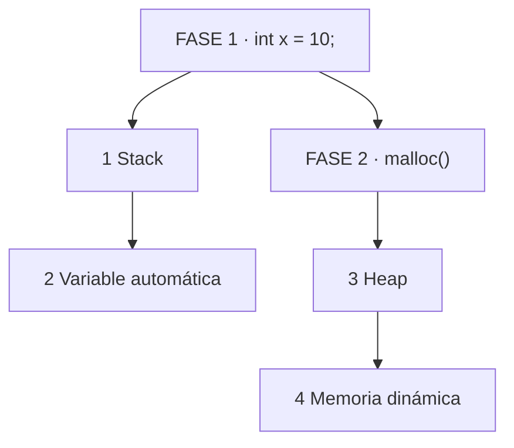

*Se lee de izquierda a derecha. Variable automática en stack, memoria dinámica en heap.*

### 9.6 ⚠️ CONTRA-EJEMPLO / Error Típico

Error: Confundir el puntero con el objeto. `int *p = malloc(sizeof(int));` — `p` vive en el stack (8 bytes), el `int` vive en el heap. Si liberás `p` pero lo usás después, tenés un dangling pointer.

Corrección: El puntero es una variable como otra. El objeto apuntado es memoria separada. `free(p)` libera el objeto, no el puntero. Después de `free`, el puntero debe ponerse a `NULL`.

### 9.7 🧪 PRÁCTICA

Clasificá estas operaciones por el error que causan: (a) `free(p); printf("%d", *p);` (b) `malloc()` sin `free` en un loop infinito (c) `int arr[10000000];` en `main`.

> Respuesta esperada / criterio: (a) use-after-free, (b) memory leak, (c) stack overflow.

### 9.8 🔁 RECALL — Nivel Bloom: Analizar

¿Por qué un memory leak en el heap no se recupera automáticamente en C? Respondé en 1 línea.

### 9.9 📌 IDEA CLAVE

Stack es automático y rápido. Heap es flexible pero requiere gestión. Los errores de memoria surgen de confundir ambas zonas o de gestionar mal el heap.

### 9.10 ✅ AUTO-CHEQUEO + SIGUIENTE

- [ ] Puedo clasificar cualquier variable en stack, heap, DATA o BSS
- [ ] Entiendo stack overflow, memory leak, use-after-free y dangling pointer
- [ ] Puedo diagnosticar un error de memoria por su síntoma

Siguiente: Sistema operativo y llamadas al sistema.

---

## 🧩 PARTE 10: SISTEMA OPERATIVO Y SYSTEM CALLS 🧩

### 10.1 ❓ PRETEST

¿Por qué `printf()` (que escribe en pantalla) requiere intervención del kernel, pero `x = y + z` no?

> Respuesta esperada: Porque escribir en pantalla implica acceder a hardware (terminal, framebuffer) que está protegido por el kernel. Las operaciones aritméticas se ejecutan completamente en user space sin intervención del sistema operativo.
> Si acertás: camino rápido → andá al punto 7.

### 10.2 🎯 POR QUÉ + LOGRO

Importa porque **el sistema operativo es el intermediario obligatorio entre tu programa y el hardware**. Entender esta relación te permite escribir código eficiente (saber qué operaciones son caras) y debuggear problemas de permisos, archivos y concurrencia. Vas a lograr **distinguir operaciones de user space de operaciones de kernel space**.

### 10.3 ⚡ VICTORIA RÁPIDA (<5 min)

Ejecutá `strace ./programa` en Linux. Verás una lista de system calls. Esas son las veces que tu programa "toca" el kernel. Esa es la frontera entre tu código y el sistema operativo.

### 10.4 💡 CONCEPTO

Analogía: El sistema operativo es como **el gerente de un edificio de oficinas** — vos podés trabajar en tu oficina (user space) sin molestarlo, pero si querés usar la impresora compartida, abrir una ventana o recibir un paquete, tenés que pedirle permiso al gerente (kernel space). Él decide si tu pedido es válido y lo ejecuta por vos.

Definición: Kernel = núcleo del sistema operativo, ejecuta en modo privilegiado (kernel space). User space = espacio donde se ejecutan los programas, sin acceso directo a hardware. System call = interfaz controlada para solicitar servicios del kernel (`open`, `read`, `write`, `malloc`, `fork`, `execve`). `malloc` usa system calls (`brk` o `mmap`) para obtener memoria del kernel, pero la gestión interna es user space.

### 10.5 👀 EJEMPLO RESUELTO

| Operación | ¿System call? | ¿Por qué? |
|-----------|---------------|-----------|
| `x = y + z` | No | Aritmética en registros CPU |
| `printf("hola")` | Sí | Escribe en terminal (hardware) |
| `malloc(100)` | Sí | Pide memoria al kernel |
| `open("archivo")` | Sí | Accede a filesystem |
| `read(fd, buf, n)` | Sí | Lee desde disco |
| `int arr[100]` | No | Memoria en stack, user space |

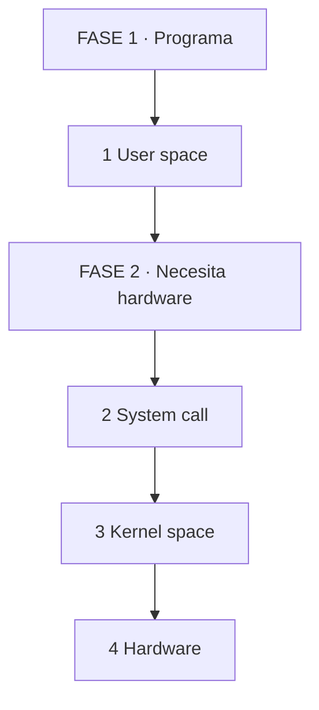

*Se lee de izquierda a derecha. Programa pide, kernel ejecuta, hardware responde.*

### 10.6 ⚠️ CONTRA-EJEMPLO / Error Típico

Error: Creer que `malloc()` es una system call. `malloc` es una función de la biblioteca C que usa system calls (`brk`/`mmap`) para obtener memoria del kernel, pero la gestión de la lista de bloques libres y asignados es user space.

Corrección: Las system calls son la frontera. Todo lo que toque hardware o recursos compartidos requiere system call. La aritmética, la lógica y la gestión de estructuras de datos no.

### 10.7 🧪 PRÁCTICA

Ejecutá `strace -e trace=open,read,write ./programa` en un programa que abre un archivo y lee contenido. Identificá las system calls y sus parámetros.

> Respuesta esperada / criterio: `open` con ruta y flags, `read` con fd, buffer y tamaño, `write` con fd y buffer.

### 10.8 🔁 RECALL — Nivel Bloom: Analizar

¿Por qué un programa no puede acceder directamente a la memoria de otro proceso? Respondé en 1 línea.

### 10.9 📌 IDEA CLAVE

User space = lógica del programa. Kernel space = acceso a hardware. System call = la frontera controlada.

### 10.10 ✅ AUTO-CHEQUEO + SIGUIENTE

- [ ] Distingo operaciones de user space de system calls
- [ ] Uso `strace` para observar system calls
- [ ] Entiendo por qué el kernel es necesario para hardware y recursos compartidos

Siguiente: CPU y ejecución de instrucciones.

---

## 🧩 PARTE 11: CPU Y EJECUCIÓN DE INSTRUCCIONES 🧩

### 11.1 ❓ PRETEST

¿Qué es el program counter y qué hace durante la ejecución?

> Respuesta esperada: Es un registro de la CPU que guarda la dirección de la próxima instrucción a ejecutar. Se incrementa automáticamente después de fetch, a menos que una instrucción de salto lo modifique.
> Si acertás: camino rápido → andá al punto 7.

### 11.2 🎯 POR QUÉ + LOGRO

Importa porque **la CPU es el hardware que ejecuta tu código**. Entender cómo funciona te permite escribir código que aprovecha la arquitectura: localidad de referencia, evitar branches impredecibles, usar datos contiguos. Vas a lograr **leer un perfil de CPU y saber por qué un cuello de botella existe**.

### 11.3 ⚡ VICTORIA RÁPIDA (<5 min)

Ejecutá `perf stat ./programa` en Linux. Verás instrucciones ejecutadas, ciclos de CPU, cache misses. Esa es la medición directa de lo que hace la CPU con tu código.

### 11.4 💡 CONCEPTO

Analogía: La CPU es como **un cocinero en una cocina** — tiene una receta (programa), una mesa de trabajo (registros), una estantería (cache), una alacena (RAM) y un libro de pasos (program counter). Lee un paso, ejecuta, pasa al siguiente. Si el paso siguiente está en la alacena, tarda más. Si la receta tiene saltos impredecibles, pierde tiempo.

Definición: CPU = Central Processing Unit, ejecuta instrucciones. Etapas del pipeline: fetch (busca instrucción), decode (decodifica), execute (ejecuta), memory (acceso a memoria), write back (escribe resultado). Registros = almacenamiento interno ultra rápido. Program Counter (PC) = dirección de la próxima instrucción. Stack Pointer (SP) = dirección del tope del stack. Cache = memoria intermedia rápida. RAM = memoria principal, más lenta.

### 11.5 👀 EJEMPLO RESUELTO

**Instrucción assembly:** `addl %eax, %ebx`

**Pipeline:**

```
Fetch:  Lee la instrucción desde memoria (cache/RAM)
Decode: Decodifica opcode (add) y operandos (eax, ebx)
Execute: ALU suma los valores de %eax y %ebx
Memory: No accede a memoria (registro-registro)
Write Back: Ecribe resultado en %ebx
PC se incrementa a la siguiente instrucción
```

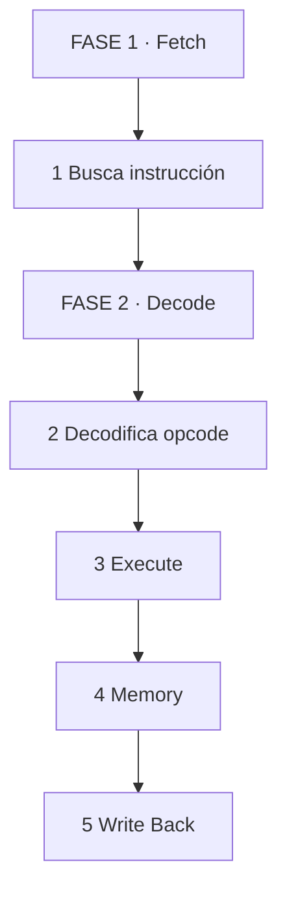

*Se lee de izquierda a derecha. Cada etapa procesa la instrucción.*

### 11.6 ⚠️ CONTRA-EJEMPLO / Error Típico

Error: Creer que la CPU ejecuta instrucciones de una en una de forma secuencial sin solapamiento. Los CPUs modernos usan pipeline, ejecución fuera de orden y branch prediction. Varias instrucciones están en diferentes etapas simultáneamente.

Corrección: El pipeline permite throughput mayor que una instrucción por ciclo. Pero los saltos condicionales (if, while) pueden detener el pipeline si el branch predictor falla.

### 11.7 🧪 PRÁCTICA

Ejecutá `perf stat -e cycles,instructions,cache-references,cache-misses ./programa`. Anotá los valores. ¿Cuántas instrucciones por ciclo (IPC) tiene tu programa? ¿Cuántos cache misses?

> Respuesta esperada / criterio: IPC cercano a 1 es normal, mayor a 1 indica buen uso de pipeline. Cache misses bajos indican buena localidad de referencia.

### 11.8 🔁 RECALL — Nivel Bloom: Comprender

¿Qué es branch prediction y por qué los bucles con tamaño fijo son más rápidos? Respondé en 1 línea.

### 11.9 📌 IDEA CLAVE

La CPU ejecuta un pipeline de etapas. El programador no controla el pipeline, pero puede escribir código que lo aproveche (localidad, pocos branches impredecibles).

### 11.10 ✅ AUTO-CHEQUEO + SIGUIENTE

- [ ] Entiendo las etapas del pipeline de CPU
- [ ] Sé qué son registros, PC, SP y cache
- [ ] Puedo usar `perf` para medir ciclos, instrucciones y cache misses

Siguiente: Runtime, VM, JIT y Garbage Collection.

---

## 🧩 PARTE 12: RUNTIME, VM, JIT Y GARBAGE COLLECTOR 🧩

### 12.1 ❓ PRETEST

¿Qué es un runtime y por qué Java y Python necesitan uno pero C no?

> Respuesta esperada: Es el conjunto de servicios que ejecutan un programa compilado a bytecode o interpretado. Java y Python compilan a bytecode que necesita una VM para ejecutarse. C compila a código máquina nativo que la CPU ejecuta directamente sin runtime intermedio.
> Si acertás: camino rápido → andá al punto 7.

### 12.2 🎯 POR QUÉ + LOGRO

Importa porque **los lenguajes modernos usan runtimes, VMs y JITs que afectan rendimiento, seguridad y portabilidad**. Entender estas capas te permite elegir el lenguaje correcto para cada problema y optimizar código en lenguajes gestionados. Vas a lograr **leer métricas de profiling de Java, JavaScript o Python y saber qué está pasando en el runtime**.

### 12.3 ⚡ VICTORIA RÁPIDA (<5 min)

Ejecutá `node -e "console.log(1+1)"`. Node.js compila el JavaScript a bytecode, lo ejecuta con V8 (JIT), y muestra el resultado. Esa es la capa runtime en acción.

### 12.4 💡 CONCEPTO

Analogía: Un runtime es como **el motor de un auto** — vos ponés la llave (ejecutas el programa), pero el motor maneja la combustión, la transmisión y el escape. No ves los pistones, pero están ahí haciendo el trabajo. Un JIT es como **un piloto automático que aprende tu ruta** — la primera vez tardas más, pero las siguientes veces el camino es más directo.

Definición: Runtime = capa de software que ejecuta un programa además del sistema operativo. VM (Virtual Machine) = entorno de ejecución que interpreta o compila bytecode (JVM, V8, .NET CLR). JIT (Just-In-Time) = compilador que genera código máquina nativo durante la ejecución, combinando portabilidad del bytecode con rendimiento del código máquina. AOT (Ahead-of-Time) = compilación completa antes de la ejecución.

### 12.5 👀 EJEMPLO RESUELTO

**Java:**

```
Source (.java)
    ↓ Compilador (javac)
Bytecode (.class)
    ↓ JVM
[JIT compila bytecode caliente a código máquina]
    ↓
CPU ejecuta código máquina nativo
```

**Python:**

```
Source (.py)
    ↓ Compilador (Python)
Bytecode (.pyc)
    ↓ Intérprete (CPython)
[Ejecuta bytecode en una máquina virtual]
    ↓
CPU ejecuta instrucciones de la VM
```

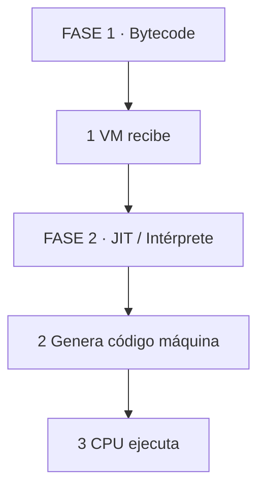

*Se lee de izquierda a derecha. Bytecode entra, runtime lo transforma, CPU ejecuta.*

### 12.6 ⚠️ CONTRA-EJEMPLO / Error Típico

Error: Creer que Java es "interpretado" porque usa bytecode. La JVM usa JIT para compilar bytecode a código máquina nativo durante la ejecución. El código "caliente" se ejecuta directamente en la CPU.

Corrección: La distinción no es "compilado vs interpretado", sino "cuándo se compila a código máquina". AOT compila antes, JIT compila durante, intérprete nunca compila a código máquina nativo (o lo hace con gran overhead).

### 12.7 🧪 PRÁCTICA

Elegí un lenguaje (Java, JavaScript, Python, C). Explicá su pipeline completo desde fuente hasta CPU. Identificá si usa JIT, AOT, bytecode o código máquina nativo.

> Respuesta esperada / criterio: Pipeline claro, identificación de etapas, mención de JIT/AOT/bytecode/nativo.

### 12.8 🔁 RECALL — Nivel Bloom: Evaluar

¿Por qué JIT puede generar código más rápido que AOT en algunos casos? Respondé en 1 línea.

### 12.9 📌 IDEA CLAVE

Runtime, VM, JIT y GC son capas entre tu código y la CPU. Cada una agrega portabilidad, seguridad o rendimiento a costa de overhead.

### 12.10 ✅ AUTO-CHEQUEO + SIGUIENTE

- [ ] Distingo runtime, VM, JIT, AOT y bytecode
- [ ] Entiendo por qué Java usa JIT y Python usa intérprete
- [ ] Puedo explicar el trade-off entre compilación ahead-of-time y just-in-time

Siguiente: Errores y debugging.

---

## 🧩 PARTE 13: ERRORES, DEBUGGING Y OPTIMIZACIÓN 🧩

### 13.1 ❓ PRETEST

Un programa C falla con "Segmentation fault". ¿En qué etapa del pipeline ocurre este error?

> Respuesta esperada: En runtime, cuando la CPU intenta acceder a una dirección de memoria no mapeada o sin permisos. El sistema operativo envía la señal SIGSEGV al proceso.
> Si acertás: camino rápido → andá al punto 7.

### 13.2 🎯 POR QUÉ + LOGRO

Importa porque **los errores no son aleatorios: cada tipo de error ocurre en una etapa específica del pipeline**. Saber esto te permite diagnosticar crashes, warnings y comportamientos extraños con método. Vas a lograr **leer cualquier error y saber dónde buscar la causa**.

### 13.3 ⚡ VICTORIA RÁPIDA (<5 min)

Ejecutá este programa:

```c
int main() {
    int *p = NULL;
    *p = 10;
    return 0;
}
```

Compilá y ejecutá. El segmentation fault es la CPU detectando un acceso ilegal. Esa es la firma del sistema operativo protegiendo la memoria.

### 13.4 💡 CONCEPTO

Analogía: Los errores son como **los síntomas de una enfermedad** — cada síntoma apunta a un órgano (etapa del pipeline). Un error de sintaxis es como una falta de ortografía (compilador). Un segmentation fault es como un infarto (runtime/CPU). Un linker error es como una reunión donde falta un participante (linker).

Definición: Tabla de errores:
- Syntax error: lexer/parser detecta código mal formado.
- Compile error: semantic analysis detecta tipos incompatibles, variables no declaradas.
- Linker error: linker no encuentra símbolos definidos.
- Loader error: formato ejecutable inválido, bibliotecas faltantes.
- Runtime error: fallo durante ejecución (división por cero, acceso inválido a memoria, excepción no capturada).
- Segmentation fault: la MMU (Memory Management Unit) detecta acceso a página sin permisos.

### 13.5 👀 EJEMPLO RESUELTO

| Error | Cuándo ocurre | Quién lo detecta | Ejemplo |
|-------|---------------|-----------------|---------|
| Syntax error | Compilación | Parser | Falta `}` |
| Type error | Compilación | Semantic analysis | `int x = "hola";` |
| Linker error | Linking | Linker | `undefined reference` |
| Runtime error | Ejecución | Runtime/SO | División por cero |
| Segmentation fault | Ejecución | MMU + SO | Acceso a `NULL` o memoria liberada |
| Logic error | Ejecución | Desarrollador | Algoritmo incorrecto |

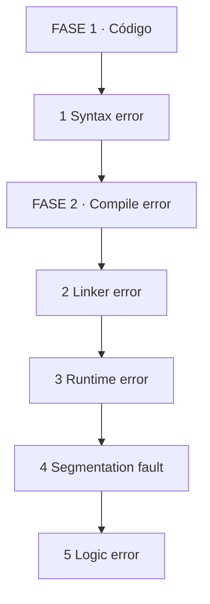

*Se lee de izquierda a derecha. Cada etapa tiene sus errores característicos.*

### 13.6 ⚠️ CONTRA-EJEMPLO / Error Típico

Error: Confundir un segmentation fault con un error de compilación. El segmentation fault es un error de runtime. El programa se compiló correctamente, pero en ejecución accedió a memoria inválida.

Corrección: Usá un debugger (gdb, lldb) para obtener el stack trace en el momento del crash. Eso te dice exactamente en qué línea y en qué función ocurrió el acceso inválido.

### 13.7 🧪 PRÁCTICA

Provocá y diagnosticá 3 errores: (a) syntax error, (b) linker error (falta objeto), (c) segmentation fault. Para cada uno, anotá en qué etapa se detecta y qué herramienta lo revela.

> Respuesta esperada / criterio: (a) compilador, (b) linker, (c) runtime/debugger. Cada uno con mensaje de error concreto.

### 13.8 🔁 RECALL — Nivel Bloom: Analizar

¿Por qué un memory leak no causa un crash inmediato pero eventualmente derriba el proceso? Respondé en 1 línea.

### 13.9 📌 IDEA CLAVE

Cada error ocurre en una etapa específica. Saber la etapa reduce el espacio de búsqueda drásticamente.

### 13.10 ✅ AUTO-CHEQUEO + SIGUIENTE

- [ ] Puedo clasificar cualquier error por etapa del pipeline
- [ ] Uso debugger para obtener stack trace de crashes
- [ ] Entiendo la diferencia entre runtime error y logic error

Siguiente: Comparación de lenguajes y modelo mental final.

---

## 🧩 PARTE 14: COMPARACIÓN DE LENGUAJES Y MAPA MENTAL FINAL 🧩

### 14.1 ❓ PRETEST

¿Por qué C, Rust y Go tienen modelos de ejecución distintos a Java y Python?

> Respuesta esperada: C y Rust compilan a código máquina nativo (AOT). Go compila a código máquina nativo con runtime ligero (scheduler, GC). Java y C# compilan a bytecode y usan JVM/CLR con JIT. Python compila a bytecode y lo interpreta con overhead mayor.
> Si acertás: camino rápido → andá al punto 7.

### 14.2 🎯 POR QUÉ + LOGRO

Importa porque **cada lenguaje hace trade-offs entre portabilidad, rendimiento, seguridad y productividad**. Entender estos trade-offs te permite elegir el lenguaje correcto para cada problema y anticipar sus costos ocultos. Vas a lograr **leer cualquier lenguaje y saber inmediatamente en qué etapa del pipeline se ejecuta**.

### 14.3 ⚡ VICTORIA RÁPIDA (<5 min)

Elegí un lenguaje que usás hoy. Dibujá su pipeline en 3 pasos. Esa es la primera aproximación a su modelo de ejecución.

### 14.4 💡 CONCEPTO

Analogía: Cada lenguaje es como **un modelo de auto** — C es un auto de carreras (rápido, manual, sin ayudas). Rust es un auto de carreras con airbags (rápido, seguro). Go es una camioneta (sencilla, confiable, runtime incluido). Java es un auto con piloto automático (portable, seguro, overhead). Python es un scooter (flexible, fácil de estacionar, menos control).

Definición: Cada lenguaje elige un punto en el espectro entre control y productividad. C y Rust dan máximo control (código máquina, gestión manual o automática de memoria). Go da código máquina con runtime mínimo. Java y C# dan portabilidad via bytecode + JIT. Python da productividad via intérprete con overhead.

### 14.5 👀 EJEMPLO RESUELTO

| Lenguaje | Compilación | IR | Bytecode | VM | JIT | GC |
|----------|-------------|-----|----------|-----|-----|-----|
| C | gcc/clang | Opcional | No | No | No | No |
| C++ | gcc/clang | LLVM IR | No | No | No | Opcional |
| Rust | rustc | LLVM IR | No | No | No | Si |
| Go | gc | SSA | No | Runtime propio | Si | Si |
| Java | javac | Bytecode | Si | JVM | Si | Si |
| C# | Roslyn | IL | Si | CLR | Si | Si |
| JavaScript | V8/Node | Bytecode IR | Si | V8 | Si | Si |
| Python | CPython | Bytecode | Si | Python VM | No | Si |

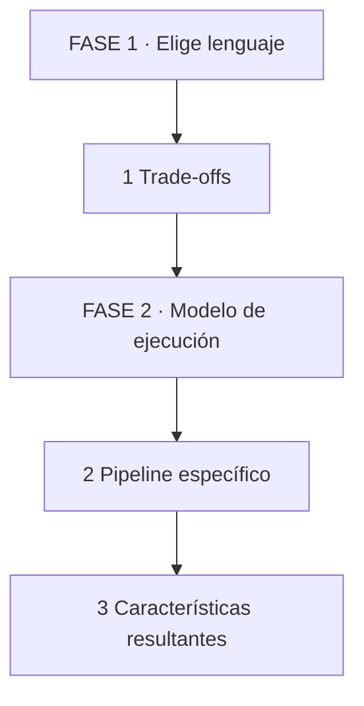

*Se lee de izquierda a derecha. Lenguaje define trade-offs, que determinan el pipeline y sus características.*

### 14.6 ⚠️ CONTRA-EJEMPLO / Error Típico

Error: Generalizar "Python es lento" sin contexto. Python es lento para bucles numéricos porque el intérprete tiene overhead por operación. Pero para orquestación, I/O y prototyping, es competitivo porque las bibliotecas subyacentes están en C.

Corrección: Medí antes de afirmar. Cada lenguaje tiene zonas de fuerza y debilidad según el tipo de operación.

### 14.7 🧪 PRÁCTICA

Elegí 2 lenguajes que conozcas. Dibujá sus pipelines. Identificá en qué etapa difieren y por qué uno es más rápido que el otro en operaciones numéricas.

> Respuesta esperada / criterio: Pipeline de cada lenguaje, identificación de etapa de diferencia (JIT vs intérprete, GC vs manual), explicación del impacto en rendimiento.

### 14.8 🔁 RECALL — Nivel Bloom: Evaluar

¿Por qué un lenguaje con JIT puede ser más rápido que uno compilado a código máquina nativo en algunos escenarios? Respondé en 1 línea.

### 14.9 📌 IDEA CLAVE

No hay lenguajes "buenos" o "malos". Hay trade-offs entre control, rendimiento, portabilidad y productividad.

### 14.10 ✅ AUTO-CHEQUEO FINAL

- [ ] Puedo dibujar el pipeline de C, Rust, Go, Java, C#, JavaScript y Python
- [ ] Entiendo los trade-offs de cada modelo de ejecución
- [ ] Puedo explicar por qué un lenguaje es más adecuado que otro para un problema específico

---

## 📝 PREGUNTAS DE VERIFICACIÓN FINAL

1. **Aplica**: Explicá el viaje completo desde que escribís `int c = a + b;` hasta que la CPU ejecuta la suma, nombrando cada etapa.
2. **Analiza**: ¿Por qué un lenguaje de alto nivel necesita un compilador o intérprete para ejecutarse en hardware?
3. **Diseña**: ¿Cómo cambiaría el pipeline si en lugar de C usaras Python para el mismo algoritmo?
4. **Reflexiona**: ¿Por qué es imposible escribir un programa que se ejecute directamente en la CPU sin sistema operativo en una computadora moderna?
5. **Evalúa**: ¿Qué errores pueden aparecer en cada etapa del pipeline? Clasifícalos por severidad.
6. **Conecta**: ¿Cómo se relacionan AST, IR y optimizaciones en la calidad del código máquina final?
7. **Propón**: ¿Qué herramientas usarías para verificar que tu programa está bien compilado, linkeado y ejecutado?
8. **Síntesis**: Explicá en 3 líneas cómo un `segmentation fault` se produce desde el código fuente hasta la señal del sistema operativo.

---

## 📚 GLOSARIO

| Término | Definición en 1 línea |
|---------|-----------------------|
| **Compilador** | Programa que traduce código fuente a código objeto o ejecutable |
| **Lexer** | Etapa del compilador que convierte caracteres en tokens |
| **Token** | Unidad léxica: palabra clave, identificador, número, operador |
| **Parser** | Etapa del compilador que construye el AST desde los tokens |
| **AST** | Abstract Syntax Tree, representación jerárquica de la estructura del programa |
| **IR** | Intermediate Representation, representación intermedia para optimización |
| **Optimización** | Transformación del IR para mejorar rendimiento o reducir tamaño |
| **Assembly** | Representación simbólica del código máquina |
| **Machine code** | Secuencia de bits ejecutable por la CPU |
| **ISA** | Instruction Set Architecture, conjunto de instrucciones de una CPU |
| **Object file** | Archivo con código máquina y símbolos, pero sin resolver referencias |
| **Linker** | Programa que combina object files y resuelve referencias |
| **Loader** | Parte del SO que carga el ejecutable en memoria |
| **Proceso** | Instancia de un programa en ejecución con memoria propia |
| **Thread** | Hilo de ejecución dentro de un proceso |
| **Stack** | Memoria automática para llamadas a función y variables locales |
| **Heap** | Memoria dinámica asignada explícitamente |
| **Runtime** | Capa de software que ejecuta un programa además del SO |
| **VM** | Virtual Machine, entorno que ejecuta bytecode |
| **JIT** | Just-In-Time compiler, compila bytecode a código máquina durante ejecución |
| **AOT** | Ahead-of-Time compilation, compila antes de ejecutar |
| **GC** | Garbage Collector, libera memoria no utilizada automáticamente |
| **System call** | Interfaz controlada para solicitar servicios del kernel |
| **Segmentation fault** | Acceso a memoria no permitido, señal SIGSEGV |
| **Pipeline** | Etapas superpuestas de fetch-decode-execute en la CPU |
| **Cache** | Memoria intermedia rápida entre CPU y RAM |
| **Branch prediction** | Predicción del resultado de saltos condicionales para mantener el pipeline |
| **ELF** | Executable and Linkable Format, formato de ejecutable en Linux |
| **PE** | Portable Executable, formato de ejecutable en Windows |
| **Mach-O** | Formato de ejecutable en macOS |
| **PID** | Process ID, identificador único de proceso |
| **Virtual memory** | Memoria virtual, abstracción entre direcciones lógicas y físicas |
| **MMU** | Memory Management Unit, hardware que traduce direcciones virtuales a físicas |
