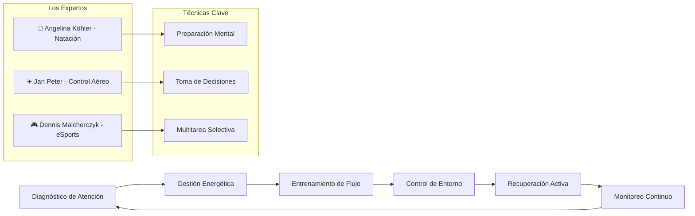
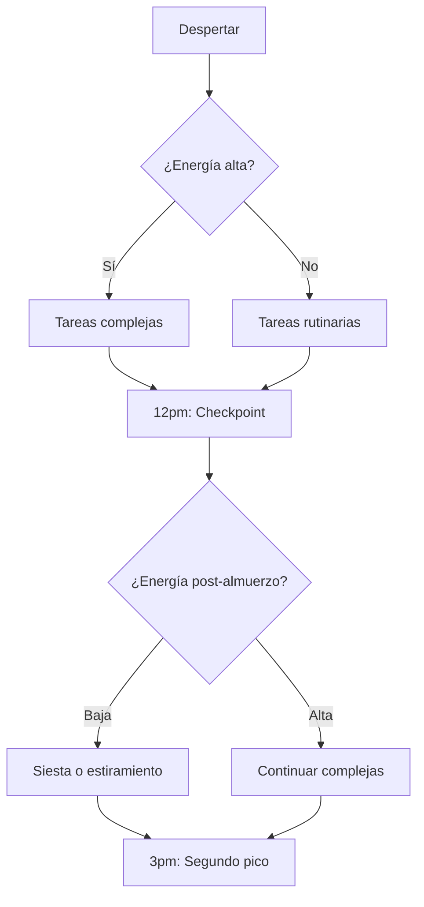
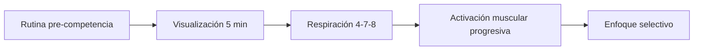
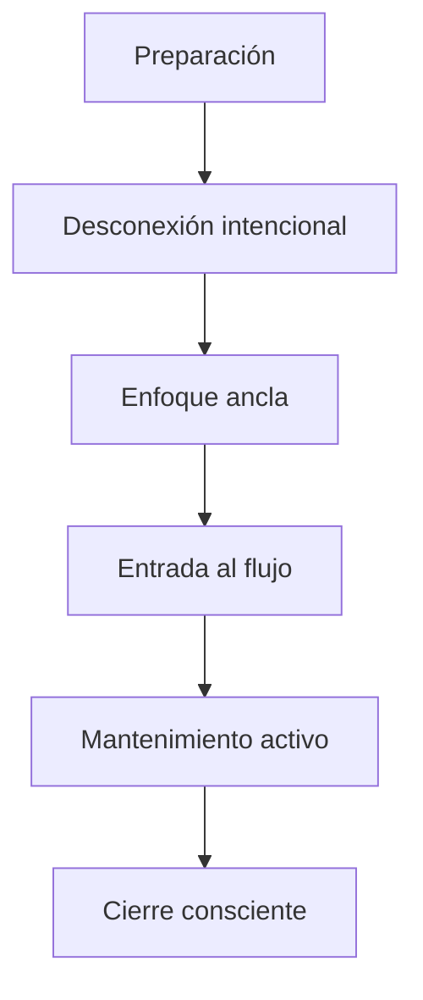
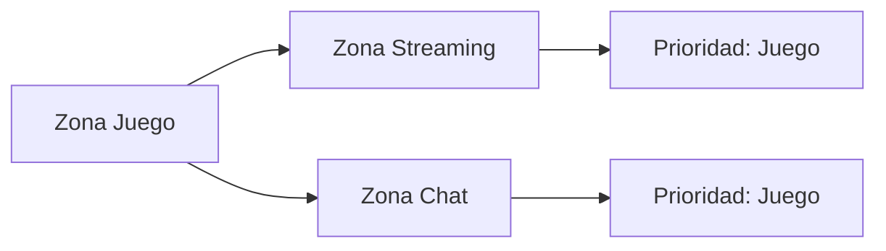
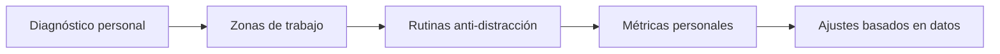
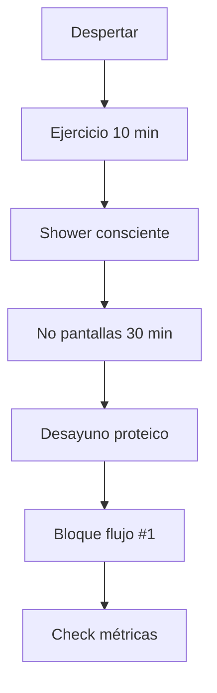

# MASTERCLASS: La Ciencia de la Concentración - Dominando la Atención en la Era Digital 🧠✨

## INTRODUCCIÓN: POR QUÉ ESTA MASTERCLASS ES DIFERENTE 🎯

> **🎯 Objetivo de Aprendizaje** — Al final de esta guía, podrás diagnosticar tu estilo de atención, aplicar técnicas de centramiento comprobadas científicamente, diseñar rutinas de entrenamiento mental y crear sistemas de protección contra distracciones digitales.

> **⚠️ Advertencia educativa** — Este contenido es formativo. La implementación requiere constancia y adaptación personal. No existe una fórmula mágica universal; cada cerebro es único.

---

## MAPA DEL WORKFLOW 🔬



---

## PARTE 1: DIAGNÓSTICO DE ATENCIÓN - CONOCER TU CEREBRO 🧠

### 1.1 Principio Central: La Atención es un Músculo💪

Tu cerebro no tiene "un solo tipo de atención". Tiene **tres sistemas** que trabajan en conjunto:

| Sistema | Función | Ejercicio del Protagonista |
|---------|---------|---------------------------|
| **Sostenida** | Mantener foco por períodos largos | Angelina en competencia de 400m |
| **Selectiva** | Filtrar estímulos irrelevantes | Jan Peter con múltiples pantallas |
| **Dividida** | Multitarea controlada | Dennis en partida de CS:GO |

### 1.2 Test de Autodiagnóstico Rápido ⚡

**Ejercicio 1: Test de Estrofo 🧪**
```
1. Lee un texto complejo → Anota ideas principales
2. Interrumpe con notificación → Vuelve al texto  
3. ¿Cuántos segundos te tomó recuperar el foco? 🤔
```

| Tiempo de recuperación | Tipo de distraído |
|------------------------|-------------------|
| < 30 segundos | Enfocado 🔵 |
| 30-90 segundos | Moderado 🟡 |
| > 90 segundos | Fragmentado 🔴 |

### 1.3 Mapa de tu Día Energético 🌙



---

## PARTE 2: GESTIÓN ENERGÉTICA - EL CEREPO CONSUME 20% DEL METABOLISMO ⚡

### 2.1 La Regla del Glucógeno Cerebral 🍎

> **🧠 Dato científico**: Tu cerebro usa 120g de glucógeno diarios, pero consume 20% de tus 2500 calorías diarias.

### 2.2 Rutinas como Ahorro Energético 🔄

**Caso Angelina Köhler (2:22-4:43)** - Preparación mental automática:



### 2.3 Protocolo de Energía Óptima 💊

| Momento | Acción | Horario ideal |
|---------|--------|---------------|
| **Desayuno cerebral** | Omega-3 + proteína | 7-8am |
| **Almuerzo ligero** | Evita hiperglucemia | 12-13pm |
| **Snack estratégico** | Frutos secos + agua | 15-16pm |
| **Cena anti-estrés** | Menos pantallas 2h antes | 20-21pm |

---

## PARTE 3: ENTRENAMIENTO DE FLUJO - EL ESTADO DE MÁXIMO RENDIMIENTE 🌊

### 3.1 ¿Qué es el Estado de Flujo? 🌊

> **💧 Definición**: Flujo = concentración total + pérdida de noción de tiempo + acción y conciencia fusionadas.

**Dr. Corinna Peifer (28:00-33:00)** mide el flujo con:
- Frecuencia cardíaca estable ❤️
- Conductancia galvánica reducida ⚡
- Alpha waves en EEG 🧠

### 3.2 Técnicas de Conexión Mental 🔗



### 3.3 Caso Práctico: Jan Peter Konopinsky ✈️

**Desafío (6:27-8:28)**: Decisiones en 3 segundos con 50 variables
**Técnica**: Chunking + priorización + checklist mental

```python
# Mental checklist de Jan Peter
def decision_protocol(traffic_complexity):
    # 1. Filtrar estímulos críticos
    critical_flight = [f for f in traffic if f.altitude_conflict]
    
    # 2. Priorizar por proximidad temporal
    priority_order = sorted(critical_flight, key=lambda x: x.time_to_collision)
    
    # 3. Ejecutar con voz + gestos (canal dual)
    for flight in priority_order[:3]:  # Máximo 3 simultáneos
        execute_resolution(flight)
```

---

## PARTE 4: CONTROL DE ENTORNO - VENCER AL CAPITALISMO DE LA ATENCIÓN 💰

### 4.1 El Problema de las Notificaciones 🔔

> **📊 Estadística impactante**: Cada notificación interrumpe tu atención por 23 minutos en promedio.

### 4.2 Arsenal de Defensa Digital 🛡️

| Herramienta | Propósito | Configuración |
|-------------|-----------|---------------|
| **Focus Mode** | Bloquea distracciones | 90 min bloques |
| **Do Not Disturb** | Silencio activo | Solo emergencias |
| **Cold Turkey** | Bloqueo absoluto | Páginas prohibidas |
| **Freedom** | Red inalámbrica limitada | Schedules automáticos |
| **Forest** | Gamificación del enfoque | 60-120 min sesiones |

### 4.3 Caso Dennis "Denninho" Malcherczyk 🎮

**Desafío (16:20-19:59)**: Jugar CS:GO mientras streaming + chat + análisis en vivo

**Técnica**: Zonas de atención múltiple:



---

## PARTE 5: RECUPERACIÓN ACTIVA - EL SECRETO DE LA SOSTENIBILIDAD 💤

### 5.1 El Mito del "Más Trabajo" 🚫

> **⏰ Verdad científica**: 4 horas de enfoque profundo superan a 12 horas de multitarea dispersa.

### 5.2 Técnicas de Recuperación 🧘

| Técnica | Duración | Beneficio |
|---------|----------|-----------|
| **Pomodoro adaptativo** | 45 min trabajo / 15 descanso | Mantiene dopamina estable 🍅 |
| **Micro-siesta** | 10-20 min | Reset de cortafuegos cerebrales 😴 |
| **Walk-and-talk** | 15 min caminata | Creatividad + oxígeno cerebral 🚶 |
| **Respiración cuadrada** | 4-4-4-4 | Activación nerviosa parasimpática 🌬️ |

### 5.3 Protocolo Divagación Mental (25:51-26:10) 🔄

```
Trabajo intenso (45-60 min) → 
    Pausa activa (10-15 min) →
        Actividades: estiramiento, agua, desconexión pantalla
        Objetivo: reducir cortisol + recargar glucógeno
        Resultado: mantener capacidad de enfoque
```

---

## PARTE 6: MÉTRICAS DE RENDIMIENTO - MEDIR SIN PERJUDICAR 📊

### 6.1 KPIs de Concentración 💯

| Métrica | Cálculo | Umbral saludable |
|---------|---------|------------------|
| **Deep Work Time** | Minutos sin interrupciones | > 240 min/día |
| **Recovery Ratio** | Tiempo descanso / trabajo intenso | 1:4 a 1:3 |
| **Flow Frequency** | Veces en estado de flujo/semana | 3-5 veces |
| **Stress Recovery** | Tiempo para recuperar foco | < 60 segundos |
| **Decision Fatigue** | Calidad decisiones por hora | Línea descendente |

### 6.2 Herramientas de Tracking 📱

```yaml
apps:
  - name: RescueTime
    purpose: "Tracking automático de atención"
    metric: "Deep vs Shallow work ratio"
  
  - name: Brain.fm + HRV4Training
    purpose: "Música + medición fisiológica"
    metric: "Estado físico vs mental"
```

---

## PARTE 7: I DO / WE DO / YOU DO — EJERCICIOS PROGRESIVOS 🎓

### 7.1 I Do — Ejercicio Guiado de Flujo 🌊

**Objetivo**: Entrar en estado de flujo en 20 minutos

| Paso | Acción | Duración |
|------|--------|----------|
| 1 | Preparación física | 3 min 🔧 |
| 2 | Desconexión digital total | 2 min 📵 |
| 3 | Ancla de atención (respiración) | 2 min 🌬️ |
| 4 | Tarea con desafío claro | 10 min 🎯 |
| 5 | Cierre consciente | 3 min 📝 |

```python
# Protocolo de anclaje para flujo
def create_focus_anchor():
    # Paso 1: Ambiente
    environment = {
        'noise_level': 'silencio o música sin palabras',
        'temperature': '20-22°C',
        'light': 'natural o luz cálida',
        'phone': 'en otra habitación'
    }
    
    # Paso 2: Ancla mental
    anchor = "4-7-8 breathing + visualización de resultado"
    
    # Paso 3: Timer
    focus_block = 45  # minutos
    
    return environment, anchor, focus_block
```

### 7.2 We Do — Análisis de Casos Reales 🧑‍🤝‍🧑

**Escenario**: Tienes 2 horas para escribir un informe importante. El diagnóstico muestra:
- Energía media por la tarde
- Teléfono con redes sociales
- Presión de deadline

**Plan colaborativo**:

| Momento | Acción grupal | Responsabilidad |
|---------|--------------|-----------------|
| **Preparación** | Accountability partner | Apagar notificaciones |
| **Inicio** | Técnica Pomodoro | 45 min bloque inicial |
| **Mitad** | Check-in energético | Evaluar necesidad de snack |
| **Final** | Revisión cruzada | Calidad + métricas |

### 7.3 You Do — Sistema Personal de Concentración 🚀

**Tarea**: Diseña tu sistema anti-distracción



**Checklist de implementación**:

- [ ] Identifica tus 3 horas pico de energía
- [ ] Crea ritual de inicio de sesión profunda
- [ ] Configura bloqueadores digitales
- [ ] Define señales para tu flujo (técnica, música, ambiente)
- [ ] Programa recuperación activa
- [ ] Mide y ajusta cada 2 semanas

---

## PARTE 8: TÉCNICAS AVANZADAS - NEUROHACKING ÉTICO 🧬

### 8.1 Neurofeedback Básico 🧠

**EEG en casa**: Muse, HeartMath, o aplicaciones de respiración sincronizada

| Estado | Frecuencia dominante | Training |
|--------|---------------------|----------|
| **Relajación** | Alpha (8-12 Hz) 🟢 | Meditación guiada |
| **Enfoque** | Beta (13-30 Hz) 🔵 | Respiración activa |
| **Flujo** | Coherente alpha-beta 🟣 | Flow en actividad |
| **Estrés** | Beta-Alta (>30 Hz) 🔴 | Activación parasimpática |

### 8.2 Suplementación Estratégica 💊

> **⚠️ Aviso**: Consulta médico antes de cualquier suplemento

| Suplemento | Dosis típica | Efecto |
|------------|--------------|--------|
| **L-Theanine** | 100-200mg | Calma sin somnolencia |
| **Cafeína libre** | 100-300mg | Enfoque sin jitter |
| **Lion's Mane** | 500mg | Neurogénesis |
| **Magnesium** | 200-400mg | Recuperación nerviosa |

---

## PARTE 9: FALLOS COMUNES Y CÓMO EVITARLOS 🚧

### 9.1 Las 7 trampas del multitasker 🙅‍♂️

| Trampa | Señal de alerta | Solución |
|--------|-----------------|----------|
| **Ilusión de productividad** | "Hago muchas cosas" | Medición real de output |
| **Uso del teléfono "solo 5 min"** | 30 min después 📱 | Bloq. de apps |
| **Trabajo en sofá** | Menos calidad 💺 | Espacio dedicado |
| **"Mañana empiezo temprano"** | Procrastinación ⏰ | Regla 2-minutos |
| **Multitud de post-its** | Fragmentación 🗒️ | Sistema único |
| **Música con letra** | Competencia auditiva 🎵 | Música instrumental |
| **Perfeccionismo** | Parálisis 🟨 | Regla del 80% |

### 9.2 Recuperación de atención fragmentada 🆘

```python
def recover_focus(duration_disrupted):
    recovery_map = {
        "1-5 min": "3 deep breaths + relectura",
        "5-15 min": "Estiramiento + regresión texto",
        "15-30 min": "Pausa activa + restart task",
        ">30 min": "Almuerzo + nuevo bloque más tarde"
    }
    return recovery_map.get(duration_disrupted, "toma todo el día")
```

---

## PREGUNTAS DE VERIFICACIÓN 📝

1. **Aplica**: Si tu energía está en modo "volatile_range" por la tarde (bajo rendimiento), ¿qué técnica usarías para recuperar atención? 🎯

2. **Analiza**: ¿Cómo medirías si estás en estado de flujo durante una tarea compleja? Propon una métrica objetiva. 📊

3. **Diseña**: Crea un ritual de inicio de sesión profunda para tu actividad principal. Incluye mínimo 3 elementos sensoriels. 🔮

4. **Reflexiona**: ¿Qué sacrificarías mañana para ganar 2 horas de concentración profunda? ¿Es accesible?

---

## GLOSARIO RÁPIDO 📚

| Término | Definición | Emoji |
|---------|------------|-------|
| **Flujo** | Estado de concentración total | 🌊 |
| **Deep Work** | Trabajo sin interrupciones | 🎯 |
| **Cortafuegos** | Corte de corteza prefrontal | 🧠 |
| **Recovery Ratio** | Equilibrio trabajo-descanso | ⚖️ |
| **Chunking** | Dividir información en bloques | 🧱 |
| **Anclaje mental** | Rutual que activa enfoque | 🔗 |
| **Alpha waves** | Frecuencia de relajación | 🟢 |
| **Beta waves** | Frecuencia de enfoque activo | 🔵 |

---

## RECURSOS ADICIONALES 📦

### Apps recomendadas 📱
- **Focus**: Freedom, Cold Turkey, Forest
- **Tracking**: RescueTime, Toggl Track
- **Bienestar**: Brain.fm, HRV4Training, Headspace

### Libros esenciales 📚
- "Deep Work" - Cal Newport
- "Flow" - Mihaly Csikszentmihalyi  
- "The Shallows" - Nicholas Carr
- "Atomic Habits" - James Clear

### Podcasts de referencia 🎙️
- Huberman Lab (Andrew Huberman)
- The Tim Ferriss Show
- The Knowledge Project

---

## CONCLUSIÓN: TU RUTINA DE MAÑANA OPTIMIZADA 🌅



> **📌 Idea clave**: La concentración no es un don innato. Es un sistema entrenable con diagnóstico, protocolos y medición constante.