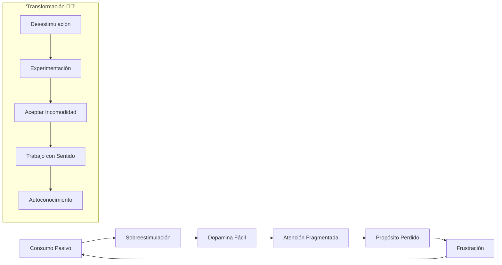
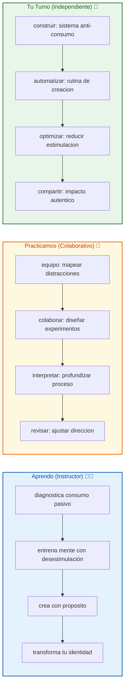

# 🚀 MASTERCLASS: Recuperando la Atención — De Consumidor Pasivo a Creador Activo 🔥🧠

## 🎯 INTRODUCCIÓN: POR QUÉ ESTE MASTERCLASS ES DIFERENTE 💡

La tecnología moderna nos ha convertido en consumidores pasivos de información. Estamos constantemente estimulados, buscando la próxima dosis de dopamina. Pero tu atención es tu activo más valioso, y está siendo despojada día a día.

Este masterclass propone una hoja de ruta para recuperar el control: **dejar de consumir para crear, entrenar la mente para la profundidad y encontrar propósito en el trabajo auténtico**.

> **🎯 Objetivo de Aprendizaje** — Al final de esta guía, entenderás el impacto de la sobreestimulación tecnológica en tu cerebro, tendrás un sistema para entrenar tu atención y construirás un camino hacia la creación activa con propósito.

> **⚠️ Advertencia** — Este contenido es formativo. La recuperación de la atención es un proceso continuo que requiere práctica consciente. Los ejercicios deben aplicarse consistentemente para ver resultados.

---

## 🗺️ MAPA DEL WORKFLOW DE RECUPERAR LA ATENCIÓN 🗺️🚀



| Fase 🌍 | Desafío ❓ | Output principal 🎯 |
|--------|------------|------------------|
| **Consumo Pasivo** 📱 | ¿Qué consumes sin darte cuenta? | Identificación de patrones |
| **Sobreestimulación** ⚡ | ¿Por qué te sientes saturado? | Reconocimiento de dopamina |
| **Dopamina Fácil** 🎰 | ¿Qué te distrae constantemente? | Mapeo de distracciones |
| **Atención Fragmentada** 🧩 | ¿Dónde está tu enfoque? | Diagnostico del caos mental |
| **Propósito Perdido** 🧭 | ¿Qué te mueve realmente? | Claridad de valores |
| **Frustración** 😞 | ¿Qué sientes al final del día? | Motivación para cambio |

---



---

## ⚡ PARTE 1: EL IMPACTO DE LA TECNOLOGÍA EN NUESTRO CEREBAZO ⚡✨

### 1.1 ⚡ La sobreestimulación constante

La tecnología moderna está diseñada para captar tu atención. Cada notificación, like y scroll genera una pequeña dosis de dopamina. Con el tiempo, esto **reprograma tu cerebro** para buscar recompensas inmediatas, no para profundizar en lo complejo.

### 1.2 📊 El costo de la dopamina fácil

| Consumo Pasivo 🚫 | Consecuencia Real ✅ |
|------------------|---------------------|
| Notificaciones constantes | Dificultad para concentrarse |
| Scroll infinito | Reducción de la paciencia |
| Entretenimiento instantáneo | Disminución de la curiosidad |
| Multitarea digital | Fragmentación de la atención |
| Validación social buscada | Disminución de la autoestima |

### 1.3 🧠 La atención como activo más valioso

Tu atención no es infinita. Cada minuto que entregas a la sobreestimulación es un minuto que no puedes recuperar. La recuperación de este activo es esencial para cualquier creación significativa.

---

## 🛑 PARTE 2: DESESTIMULACIÓN — EL PRIMER PASO PARA RECUPERAR LA ATENCIÓN 🛑✨

### 2.1 🛑 El arte de aburrirse conscientemente

"El aburrimiento no es negativo. Es una necesidad biológica para que tu cerebro se resetee." — Jaime Higuera

Cuando alejamos el estímulo constante, permitimos que el cerebro:
- Recupere su curiosidad natural
- Genere ideas propias sin depender de algoritmos
- Establezca una nueva baseline emocional

### 2.2 📊 Estrategias de desestimulación efectiva

| Acción ⚡ | Duración | Beneficio principal 🧠 |
|----------|----------|----------------------|
| Desconexión total | 24-48 horas | Reset completo |
| No digital antes de dormir | 2 horas antes | Mejor sueño |
| Mañanas sin dispositivos | 60-90 minutos | Enfoque matutino |
| Días de bloqueo | 1 día/semana | Recuperación profunda |
| Silencio consciente | 15-30 minutos | Claridad mental |

### 2.3 🛠️ Ejercicio: el reto del aburrimiento

```
🛑 Plan de desestimulación:
1. Estaciona dispositivos 2 horas antes de dormir
2. Dedica 30 minutos diarios a estar sin pantallas
3. Programa 1 día completo sin redes sociales
4. Practica silencio consciente 15 minutos diarios
5. Registra ideas que emergen en la quietud
```

---

## 🎨 PARTE 3: PROBAR COSAS NUEVAS SIN JUZGAR 🎨✨

### 3.1 🎨 El enemigo del progreso: la perfección

"El mayor enemigo del progreso no es el fracaso, es la búsqueda de la perfección." — Jaime Higuera

| Perfección paralizante 🚫 | Experimentación saludable ✅ |
|--------------------------|---------------------------|
| "No es lo suficientemente bueno" | "Es suficiente para empezar" |
| "Esperaré a tener tiempo perfecto" | "Uso lo que tengo ahora" |
| "Necesito más conocimiento" | "Aprendo haciendo" |
| "Temor al juicio externo" | "Mejoramiento continuo" |

### 3.2 📊 Framework para experimentar sin miedo

```
🎨 Ciclo de experimentación:
1. Ideación: ¿Qué te gustaría probar?
2. Simplificación: Reduce a versión mínima viable
3. Ejecución: Hazlo sin perfeccionismo
4. Observación: ¿Qué aprendiste?
5. Iteración: Mejora basada en experiencia
```

### 3.3 🛠️ Ejercicio: 7 días de experimentación

```
🎨 Reto semanal:
Día 1: Escribe 1 oración sin editar
Día 2: Crea un dibujo en 5 minutos
Día 3: Graba un audio hablando de un tema
Día 4: Programa 10 líneas de código
Día 5: Escribe una idea sin juzgarla
Día 6: Comparte algo sin editar
Día 7: Reflexiona sobre la semana
```

---

## 💪 PARTE 4: ACEPTAR LA INCOMODIDAD — LA NUEVA DROGA SALUDABLE 💪✨

### 4.1 💪 La incomodadad como aliada

La dificultad no es tu enemiga. Es tu entrenador. Cuando abrazas la incomodidad:
- Construyes resistencia mental
- Desarrollas disciplina auténtica
- Generas una nueva fuente de motivación interna

### 4.2 📊 Tabla de incomodadadad productiva

| Situación incómoda 🎯 | Acción 💪 | Resultado 🔄 |
|---------------------|----------|-------------|
| Tarea compleja | Empezar sin preparación | Progreso inmediato |
| Rechazo potencial | Compartir trabajo imperfecto | Crecimiento personal |
| Frustración inicial | Persistir 10 minutos más | Rompiendo resistencia |
| Aburrimiento | Quedarte en la actividad | Fortaleciendo atención |

### 4.3 🛠️ Script para aceptar la incomodadad

```
💪 Diálogo interno:
1. "Lo incómodo es temporal, lo evasivo es eterno"
2. "La acción es mi nueva droga saludable"
3. "Disfruto el esfuerzo porque me transforma"
4. "La perfección puede esperar, el progreso no"
```

---

## 🎯 PARTE 5: TRABAJO CON SENTIDO — MÁS ALLÁ DE LA GRATIFICACIÓN INSTANTÁNEA 🎯✨

### 5.1 🎯 Construyendo algo real que aporte valor

El trabajo con sentido trasciende la gratificación instantánea. Cuando creas con propósito:
- Añades valor a otros
- Te conectas con algo mayor
- Salvando tu propia vida a través de la contribución

### 5.2 📊 El contraste: consumir vs crear

| Consumo Pasivo 📱 | Creación Activa 🛠️ |
|------------------|--------------------|
| Busca entretenimiento | Busca contribución |
| Recibe sin dar | Da valor a cambio |
| Gratificación efímera | Satisfacción duradera |
| Fragmentación | Integridad |
| Dependencia externa | Autorregulación |

### 5.3 🛠️ Framework para trabajo con sentido

```
🎯 Preguntas de sentido:
1. ¿Quién se beneficiará de esto?
2. ¿Qué problema resuelve?
3. ¿Por qué importa para ti?
4. ¿Qué aprenderás creando?
5. ¿Cómo conectarás con otros?
```

---

## 🌟 PARTE 6: AUTOCONOCIMIENTO Y CONTRIBUCIÓN 🌟✨

### 6.1 🌟 Descubriendo tus talentos únicos

Tienes responsabilidad ética de descubrir tus dones. La tecnología, cuando se usa con intención:
- Multiplica tu impacto
- Amplifica tu voz única
- Te convierte en agente de cambio

### 6.2 📊 Tabla de autoconocimiento

| Área de interés 🎨 | Pregunta clave ❓ | Acción exploradora ⚡ |
|-------------------|-----------------|---------------------|
| Creatividad | ¿Qué actividades te hacen perder la noción del tiempo? | Programa 1 hora creativa |
| Impacto | ¿Qué problema te duele ver sin resolver? | Investiga 1 solución posible |
| Talento | ¿Qué te dicen los demás que eres bueno? | Pregunta 3 personas de confianza |
| Propósito | ¿Qué harías si no tuviera miedo al juicio? | Escribe sin censura |

### 6.3 🛠️ Ejercicio: mapa de contribución

```
🌟 Mapa personal:
1. Lista 3 problemas que te inquietan
2. Identifica 2 habilidades que posees
3. Conecta: ¿Cómo puedes contribuir?
4. Diseña 1 proyecto mínimo viable
5. Comparte con 1 persona para feedback
```

---

## 🎓 PARTE 7: I DO / WE DO / YOU DO — EJERCICIOS PRÁCTICOS 🎓✨

### 7.1 🏫 I Do — Diagnosticar el consumo pasivo

| Paso 🚶 | Acción ⚡ | Resultado esperado ✅ |
|------|--------|--------------------|
| 1️⃣ 📱 | Mapear distracciones del día | Lista de 5 patrones |
| 2️⃣ 🛑 | Aplicar 30 minutos sin pantalla | Sensación de quietud |
| 3️⃣ 🎯 | Identificar propósito oculto | 1 pregunta de sentido |
| 4️⃣ 💡 | Registrar idea emergente | Nota de creatividad |

### 7.2 👥 We Do — Reconocer patrones en grupo

**Tarea colaborativa:** cada integrante comparte:

```
👥 Diario grupal:
1. Mi mayor distracción tecnológica es...
2. Cuando me aburro, mi cerebro busca...
3. Tengo miedo de juzgar cuando...
4. Mi propósito oculto sería...
5. Compromiso: verificar el avance
```

### 7.3 🎯 You Do — Construir sistema de creación activa

**Tarea:** crea tu sistema personal:

| Sistema 🛠️ | Acción ⚡ | Alerta 🔔 |
|------------|---------|----------|
| 🛑 Desestimulación | 30 minutos diarios sin pantalla | Sin pausa en 3 días |
| 🎨 Experimentación | 1 creación semanal imperfecta | Sin crear en 7 días |
| 💪 Incomodadad | Aceptar 1 reto incómodo diario | Evadir reto 3 veces |
| 🎯 Propósito | Proyecto con valor real | Sin impacto en 14 días |
| 🌟 Autoconocimiento | Reflexión semanal personal | Sin reflexión en 7 días |

---

## ✅ PARTE 8: CHECKLIST FINAL 🏁✨

| Bloque 🧩 | Check ✅ |
|--------|-------|
| **Diagnóstico completado** | 🤔 Mapeado de patrones de consumo |
| **Desestimulación practicada** | 🛑 3 sesiones de aburrimiento consciente |
| **Experimentación iniciada** | 🎨 1 proyecto imperfecto creado |
| **Incomodadad aceptada** | 💪 3 retos abrazados |
| **Trabajo con sentido** | 🎯 1 proyecto con propósito definido |
| **Autoconocimiento avanzado** | 🌟 1 talento identificado |
| **Sistema personal** | 📊 Rutina anti-consumo establecida |

---

## 📝 PARTE 9: PREGUNTAS DE VERIFICACIÓN 📝✨

Responde cada pregunta basándote en los conceptos de esta master class. Escribe tus respuestas o compártelas para profundizar tu aprendizaje. 📝

### Preguntas sobre Consumo y Atención

1. **📱 Aplica**: ¿Qué dispositivo o aplicación más te consume tiempo sin darte cuenta? ¿Qué emoción sientes al usarlo?

2. **🔍 Analiza**: ¿Has experimentado el "aburrimiento consciente"? ¿Qué ideas o pensamientos emergieron cuando dejaste de consumir?

### Preguntas sobre Experimentación

3. **🎨 Diseña**: Elige un proyecto que has pospuesto por miedo al juicio. ¿Qué versión ridícula podrías crear esta semana?

4. **💪 Evalúa**: ¿Qué te ha parado antes de intentar algo nuevo? ¿Cómo puedes abordar eso sin perfeccionismo?

### Preguntas sobre Propósito

5. **🎯 Reflexiona**: ¿Qué problema del mundo te preocupa realmente? ¿Cómo podrías contribuir, por mínima que sea?

6. **🌟 Calcula**: Si dedicas solo 15 minutos diarios a crear algo con propósito, ¿qué lograrías en 1 año?

### Preguntas Integradoras

7. **🔗 Conecta**: ¿Cómo se relaciona el miedo al juicio con la dependencia del consumo pasivo?

8. **💡 Propón un sistema**: Diseña un sistema de 20 minutos diarios que combine desestimulación, experimentación y acción con propósito.

---

## 📚 GLOSARIO RÁPIDO 📖✨

| Término 📝 | Definición 📋 |
|---------|------------|
| **Consumo pasivo** 📱 | Ingesta de información sin generar valor |
| **Desestimulación** 🛑 | Alejamiento consciente de estímulos digitales |
| **Dopamina fácil** 🎰 | Recompensa instantánea sin esfuerzo real |
| **Atención fragmentada** 🧩 | Falta de enfoque sostenido en una tarea |
| **Trabajo con sentido** 🎯 | Actividad que aporta valor más allá del yo |
| **Autoconocimiento** 🌟 | Descubrimiento de talentos y propósito |
| **Aburrimiento consciente** 🛑 | Quietud intencional para reset mental |
| **Perfeccionismo disfrazado** 🎭 | Miedo disfrazado de exigencia por calidad |
| **Propósito trascendental** 🌟 | Contribución que supera necesidades personales |

---

## 📐 ANEXO: FORMATO IDEAL PARA MASTERCLASS EDUCATIVAS 📐✨

### 📏 Estructura visual recomendada 📏✨

El ancho óptimo 📏 para masterclasses educativas es **60–75 caracteres por línea** 📐.

```css
.article-content {
  🎨 font-size: 18px;
  📏 line-height: 1.75;
  📐 max-width: 65ch;
}
```

### 🎯 CIERRE PRÁCTICO 🎯✨

| Nivel 📊 | Debes poder hacer ✨ |
|-------|------------------|
| **🏫 I Do** | ✅ Diagnosticar y comenzar desestimulación |
| **👥 We Do** | 🤝 Reconocer patrones y apoyar experimentación |
| **🎯 You Do** | 🚀 Construir sistema personal de creación activa |

---

## 🎁 RECURSOS ADICIONALES 🎁✨

- 📖 [📚 Jaime Higuera - Productividad](https://www.jaimehiguera.com)
- 🎥 [🎬 Video original: "De Consumidor Pasivo a Creador Activo"]
- 💻 [💻 Apps: Forest, Freedom, Cold Turkey]
- 🛠️ [🛠️ Libros: "Deep Work", "Digital Minimalism"]

---

**🎉 Felicitaciones! Has completado la masterclass de recuperar la atención. 🧠 Ahora tienes el sistema para entrenar tu mente, crear sin miedo y construir algo que realmente importe.**

> **💡 Próximo paso:** La próxima vez que sientas la tentación de consumir sin propósito, di: "Este es mi momento de aburrirme con propósito". Si en 15 minutos no surge una idea, escribe cualquier cosa. La quietud genera claridad.