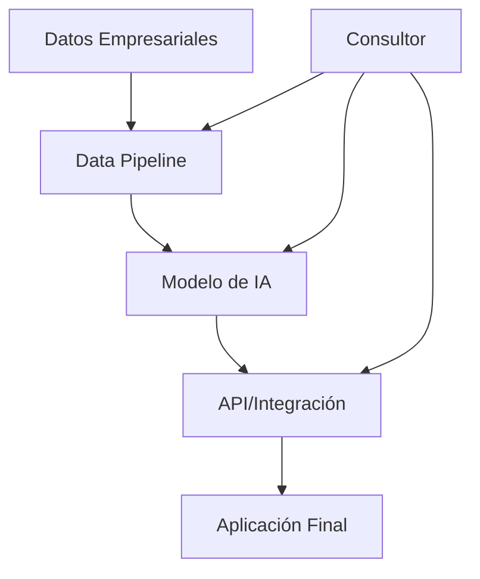

En 2025, ser consultor de IA no es solo saber programar. Es entender cómo las empresas pueden usar IA para resolver problemas reales, generar ROI y mantenerse competitivas. Este manual te guía desde cero hasta tener tu primera consultoría pagada.

***

## 1. ¿Qué es un Consultor de IA?

Un consultor de IA es un experto que ayuda a empresas a implementar soluciones de inteligencia artificial. No eres un programador que codifica todo, sino un estratega que:

- Identifica oportunidades donde la IA puede impactar
- Diseña arquitecturas escalables
- Evalúa proveedores (OpenAI, AWS, Google Cloud)
- Entrena equipos internos
- Mide ROI y optimiza implementaciones

**Diferencia clave:** Los consultores no construyen sistemas, los diseñan y supervisan.

### Cómo Diseñar y Supervisar Sistemas de IA

Como consultor, tu rol es el de **arquitecto y director de orquesta**. No tocas código todo el día, pero defines la visión y aseguras que se ejecute correctamente.

#### 1. Fase de Diseño Estratégico

**Evaluación Inicial:**
- **Auditoría de Datos:** ¿Qué datos tienen? ¿Calidad? ¿Volumen?
- **Análisis de Problema:** Entrevista stakeholders para entender pain points reales
- **Evaluación Técnica:** Infraestructura existente, capacidades del equipo

**Diseño de Solución:**
- **Selección de Enfoque:** Fine-tuning vs prompt engineering vs custom model
- **Arquitectura High-Level:** Diagrama de componentes (data → modelo → aplicación)
- **Evaluación de Proveedores:** OpenAI vs Anthropic vs open-source



**Documento de Requisitos:**
- Alcance funcional y no-funcional
- Métricas de éxito (accuracy, latency, cost)
- Riesgos y mitigaciones
- Timeline y milestones

#### 2. Fase de Arquitectura Técnica

**Selección Tecnológica:**
- **Modelos:** GPT-4 para generación, BERT para clasificación
- **Infraestructura:** Cloud vs on-premise, GPUs necesarias
- **Herramientas:** MLflow para tracking, Docker para deployment

**Diseño de Pipeline:**
- **ETL (Extract, Transform, Load):** Procesamiento de datos
- **Entrenamiento:** Hiperparámetros, validación cruzada
- **Deployment:** A/B testing, rollback strategies

**Seguridad y Compliance:**
- **GDPR/CCPA:** Manejo de datos personales
- **Bias Auditing:** Asegurar fairness en modelos
- **Monitoreo:** Drift detection, performance degradation

#### 3. Fase de Supervisión e Implementación

**Gestión de Equipo:**
- **Definir Roles:** Data scientists, ML engineers, DevOps
- **Mentoría:** Guiar al equipo en mejores prácticas
- **Code Reviews:** Asegurar calidad sin escribir código

**Iteración y Optimización:**
- **MVP First:** Entrega funcional rápida para feedback
- **Métricas de Seguimiento:** Accuracy, latency, user satisfaction
- **Iteraciones:** Basadas en datos, no en opiniones

**Cambio de Paradigma:**
- De "construir código" a "definir qué construir"
- De "debuggear algoritmos" a "optimizar procesos de negocio"
- De "técnico puro" a "traductor entre negocio y tecnología"

#### 4. Entrega y Transferencia de Conocimiento

**Documentación Completa:**
- Arquitectura decisions y trade-offs
- Guías de operación y mantenimiento
- Playbooks para escenarios comunes

**Capacitación del Equipo:**
- Workshops sobre mantenimiento del sistema
- Knowledge transfer sessions
- Creación de runbooks

**Plan de Soporte:**
- Periodo de warranty post-implementación
- SLA para soporte técnico
- Escalation procedures

#### Caso Práctico: Diseño de Chatbot Empresarial

**Problema:** Empresa de e-commerce necesita chatbot 24/7 para soporte.

**Enfoque Consultor:**
1. **Discovery:** Entrevistas con customer service, análisis de tickets históricos
2. **Diseño:** Seleccionar RAG + GPT-4, definir intents principales
3. **Arquitectura:** Especificar vector database, API endpoints, monitoring
4. **Supervisión:** Guiar al equipo de desarrollo, revisar integraciones
5. **Lanzamiento:** A/B testing, métricas de satisfacción, optimización

**Resultado:** Sistema funcionando sin que el consultor escriba una línea de código de producción.

### Tipos de Consultores IA

1. **Técnico Puro:** Arquitectura, implementación, fine-tuning
2. **Estratégico:** Roadmap IA, evaluación de casos de uso
3. **Especializado:** IA en salud, finanzas, manufactura
4. **Generalista:** Pequeñas empresas con necesidades variadas

***

## 2. Habilidades Técnicas Esenciales

### 2.1 Fundamentos Matemáticos

**Lo mínimo indispensable:**
- Álgebra Lineal: Vectores, matrices, SVD
- Probabilidad: Distribuciones, Teorema de Bayes
- Estadística: Regresión, inferencia
- Cálculo: Gradientes, optimización

**Recomendación:** Estudia los artículos de matemáticas de este blog antes de continuar.

### 2.2 Tecnologías Core

**Lenguajes de Programación:**
- **Python:** Estándar para IA (NumPy, Pandas, Scikit-learn)
- **SQL:** Manipulación de datos empresariales
- **Bash/Shell:** Automatización en cloud

**Frameworks y Librerías:**
- **Machine Learning:** Scikit-learn, XGBoost, LightGBM
- **Deep Learning:** PyTorch, TensorFlow
- **MLOps:** MLflow, DVC, Weights & Biases
- **Cloud:** AWS SageMaker, Google Vertex AI, Azure ML

**Herramientas de IA Generativa:**
- **Modelos:** GPT-4, Claude, Llama
- **Plataformas:** OpenAI API, Hugging Face, Anthropic
- **Fine-tuning:** LoRA, QLoRA para optimización

### 2.3 Arquitecturas y Patrones

**Sistemas de Producción:**
- **RAG (Retrieval-Augmented Generation):** Para chatbots empresariales
- **Fine-tuning vs Prompt Engineering:** Cuándo usar cada uno
- **Evaluación de Modelos:** BLEU, ROUGE, precisión/recall
- **Bias y Fairness:** Auditoría ética de modelos

**Infraestructura:**
- **Cloud Computing:** AWS, GCP, Azure
- **Contenedores:** Docker, Kubernetes
- **APIs:** REST, GraphQL para integración empresarial

```python
# Ejemplo: Pipeline básico de ML para consultoría
import pandas as pd
from sklearn.model_selection import train_test_split
from sklearn.ensemble import RandomForestClassifier
from sklearn.metrics import classification_report

# Cargar datos empresariales
data = pd.read_csv('customer_data.csv')
X = data.drop('churn', axis=1)
y = data['churn']

# Split y entrenamiento
X_train, X_test, y_train, y_test = train_test_split(X, y, test_size=0.2)
model = RandomForestClassifier(n_estimators=100)
model.fit(X_train, y_train)

# Evaluación
predictions = model.predict(X_test)
print(classification_report(y_test, predictions))
```

***

## 3. Habilidades Blandas y de Negocio

### 3.1 Comunicación Ejecutiva

**Presentaciones:**
- Explica conceptos técnicos a CEOs sin jerga
- Crea storyboards visuales para propuestas
- Usa analogías: "La IA es como un asistente personal que nunca duerme"

**Escucha Activa:**
- Entiende problemas reales del negocio
- Pregunta sobre métricas de éxito
- Identifica stakeholders clave

### 3.2 Pensamiento Estratégico

**Evaluación de ROI:**
- Calcula payback period de implementaciones IA
- Identifica quick wins vs proyectos largos
- Mide impacto en KPIs: revenue, cost reduction, customer satisfaction

**Gestión de Riesgos:**
- Compliance (GDPR, CCPA)
- Seguridad de datos
- Escalabilidad y mantenimiento

### 3.3 Liderazgo de Equipos

**Mentoría:**
- Entrena equipos internos en IA
- Crea centros de excelencia (CoE)
- Desarrolla roadmaps de adopción

**Gestión de Stakeholders:**
- Alinea expectativas con realidad técnica
- Maneja resistencia al cambio
- Celebra wins pequeños para mantener momentum

***

## 4. Roadmap para Convertirte en Consultor

### 4.1 Fase 1: Fundamentos (3-6 meses)

**Aprendizaje:**
- Cursos: Coursera "Machine Learning", fast.ai
- Libros: "Hands-On Machine Learning", "Deep Learning"
- Proyectos personales: Kaggle competitions

**Certificaciones:**
- Google Cloud Professional ML Engineer
- AWS Certified Machine Learning - Specialty
- Microsoft Azure AI Engineer

### 4.2 Fase 2: Experiencia Práctica (6-12 meses)

**Proyectos Reales:**
- Freelance en Upwork/Fiverr
- Contribuciones open-source
- Voluntariado en startups

**Redes:**
- LinkedIn: Conecta con CTOs y heads de IA
- Meetups: AI/ML communities locales
- Conferencias: NeurIPS, ICML (virtual si no puedes viajar)

### 4.3 Fase 3: Especialización (6-12 meses)

**Dominios Específicos:**
- IA en Finanzas: Fraud detection, trading algorithms
- IA en Salud: Diagnostic assistance, drug discovery
- IA en Retail: Recommendation systems, demand forecasting

**Herramientas Empresariales:**
- Tableau/Power BI para dashboards
- Jira/Asana para project management
- Slack/Microsoft Teams para comunicación

### 4.4 Fase 4: Consultoría Activa (12+ meses)

**Estrategias de Marketing:**
- Website personal/portfolio
- Content marketing: Blog posts, LinkedIn articles
- Networking: Eventos de industria, chambers of commerce

**Pricing:**
- Hourly: $100-300 USD (entry level)
- Daily: $800-2000 USD (mid level)
- Project-based: 20-50% del valor total

***

## 5. Cómo Conseguir Tu Primer Cliente

### 5.1 Estrategias de Prospección

**Redes Profesionales:**
- LinkedIn: Publica contenido sobre IA, conecta con decision makers
- Referrals: Pide recomendaciones a tu network
- Cold outreach: Emails personalizados a empresas locales

**Contenido que Atrae Clientes:**
- Case studies: "Cómo redujimos costos 30% con IA"
- Webinars: "IA para PYMES sin presupuesto gigante"
- White papers: Tendencias de IA en tu industria

### 5.2 Proceso de Venta

**Discovery Call:**
- Preguntas clave:
  - ¿Qué problemas intentan resolver?
  - ¿Qué datos tienen disponibles?
  - ¿Cuál es su presupuesto y timeline?
  - ¿Quiénes son los stakeholders?

**Propuesta Técnica:**
- Alcance claro: Qué entregarás
- Timeline realista
- Métricas de éxito
- Riesgos y mitigaciones

**Negociación:**
- No bajes precio, agrega valor
- Incluye fases de pilotaje
- Define términos de pago claros

### 5.3 Primer Proyecto Ideal

**Características:**
- Empresa pequeña/mediana (menos burocracia)
- Problema bien definido (no ambiguo)
- Datos accesibles
- Presupuesto razonable ($5k-20k)
- Industria que conoces

**Ejemplo de Primer Proyecto:**
- Implementar chatbot para soporte al cliente
- Sistema de recomendación para e-commerce
- Análisis predictivo de churn

***

## 6. Casos de Estudio Reales

### 6.1 Caso: Retail Chain - Sistema de Recomendación

**Problema:** Tienda física con 40% de productos sin vender anualmente.

**Solución:**
- Análisis de datos de ventas históricos
- Modelo de recomendación basado en collaborative filtering
- Integración con app móvil existente

**Resultado:**
- Aumento 25% en ventas cross-sell
- Reducción 15% en inventario obsoleto
- ROI en 6 meses

**Lecciones:**
- Importancia de datos limpios
- Necesidad de A/B testing
- Valor de iteraciones rápidas

### 6.2 Caso: Manufacturera - Predictive Maintenance

**Problema:** Downtime no planificado costaba $500k/mes.

**Solución:**
- Sensores IoT en maquinaria
- Modelo de predicción de fallos usando time series
- Dashboard en tiempo real para operadores

**Resultado:**
- Reducción 60% en downtime no planificado
- Ahorro $300k/mes
- Payback en 2 meses

**Lecciones:**
- Datos en tiempo real requieren infraestructura robusta
- Explicabilidad del modelo es crucial para aceptación
- Training continuo del modelo es necesario

### 6.3 Caso: Startup Fintech - Detección de Fraude

**Problema:** Falsos positivos altos en detección de transacciones fraudulentas.

**Solución:**
- Fine-tuning de modelo pre-entrenado
- Ensemble de múltiples algoritmos
- Sistema de alertas inteligente

**Resultado:**
- Reducción 40% en falsos positivos
- Aumento 30% en detección de fraudes reales
- Escalabilidad a millones de transacciones

**Lecciones:**
- Balance precision/recall es crítico
- Compliance regulatoria complica implementaciones
- Monitoreo continuo es esencial

***

## 7. Errores Comunes y Cómo Evitarlos

### 7.1 Errores Técnicos

**Sobrestimar la Madurez de Datos:**
- Solución: Siempre audita calidad de datos primero
- Herramienta: Usa pandas-profiling para análisis rápido

**Ignorar Escalabilidad:**
- Solución: Diseña para 10x el tamaño inicial
- Herramienta: Usa cloud-native architectures

**No Validar Modelos:**
- Solución: Cross-validation + holdout sets
- Herramienta: Scikit-learn pipelines

### 7.2 Errores de Negocio

**Prometer Lo Imposible:**
- Solución: Sé honesto sobre limitaciones
- Estrategia: Incluye disclaimers en propuestas

**Perder el Foco en ROI:**
- Solución: Todo proyecto debe tener métricas claras
- Estrategia: Dashboard de impacto desde día 1

**Mala Comunicación:**
- Solución: Updates semanales + demos regulares
- Herramienta: Notion/ClickUp para project tracking

### 7.3 Errores Personales

**Quemarse:**
- Solución: Establece boundaries claros
- Estrategia: Automatiza procesos repetitivos

**No Aprender Continuamente:**
- Solución: Dedica 10% del tiempo a learning
- Recursos: ArXiv, Towards Data Science, ML newsletters

***

## 8. Recursos para Aprender y Crecer

### 8.1 Cursos y Certificaciones

**Plataformas:**
- Coursera: Andrew Ng's Machine Learning
- edX: MIT's Deep Learning
- Udacity: Nanodegree AI Product Manager

**Certificaciones:**
- TensorFlow Developer Certificate
- PyTorch certifications
- AWS/Azure ML certifications

### 8.2 Comunidades y Networking

**Online:**
- Reddit: r/MachineLearning, r/learnmachinelearning
- Discord: AI communities, local tech groups
- Twitter: Sigue @AndrewYNg, @ylecun, @demishassabis

**Eventos:**
- AI Summit, Web Summit (IA tracks)
- Local meetups: AI/ML groups en Meetup.com
- Conferencias: ICML, NeurIPS, CVPR

### 8.3 Herramientas y Software

**Gratuitos:**
- Google Colab: Para experimentos
- Hugging Face: Modelos pre-entrenados
- Streamlit: Prototipos rápidos

**Pago:**
- Weights & Biases: MLOps
- DataRobot: AutoML
- Obviously AI: No-code ML

### 8.4 Libros Recomendados

**Técnicos:**
- "Deep Learning" - Goodfellow, Bengio, Courville
- "Pattern Recognition and Machine Learning" - Bishop
- "Machine Learning Engineering" - Andriy Burkov

**Negocio:**
- "AI Superpowers" - Kai-Fu Lee
- "Prediction Machines" - Agrawal, Gans, Goldfarb
- "The AI Advantage" - Thomas Davenport

***

## 9. Plan de Acción de 90 Días

### Semana 1-4: Fundamentos
- Completa curso de Machine Learning
- Configura entorno de desarrollo
- Crea portfolio básico en GitHub

### Semana 5-8: Primer Proyecto
- Elige problema empresarial simple
- Implementa solución end-to-end
- Documenta proceso y resultados

### Semana 9-12: Networking y Ventas
- Optimiza perfil de LinkedIn
- Contacta 20 empresas potenciales
- Prepara pitch de 30 segundos

**Métrica de Éxito:** Primer cliente pagado o proyecto freelance.

***

## Conclusión

Ser consultor de IA es una carrera lucrativa con demanda creciente. El camino requiere paciencia, aprendizaje continuo y mezcla de habilidades técnicas y comerciales.

**Recuerda:** Las empresas no buscan "el mejor programador", buscan alguien que entienda su negocio y pueda traducir problemas a soluciones IA.

Empieza hoy. Tu primer cliente está esperando que lo encuentres.

**¿Listo para comenzar?** El primer paso es dominar los fundamentos matemáticos. Lee los artículos de matemáticas de esta serie y comienza a construir proyectos.

**Contacto:** Si necesitas mentoría personalizada, escríbeme a través del blog.
