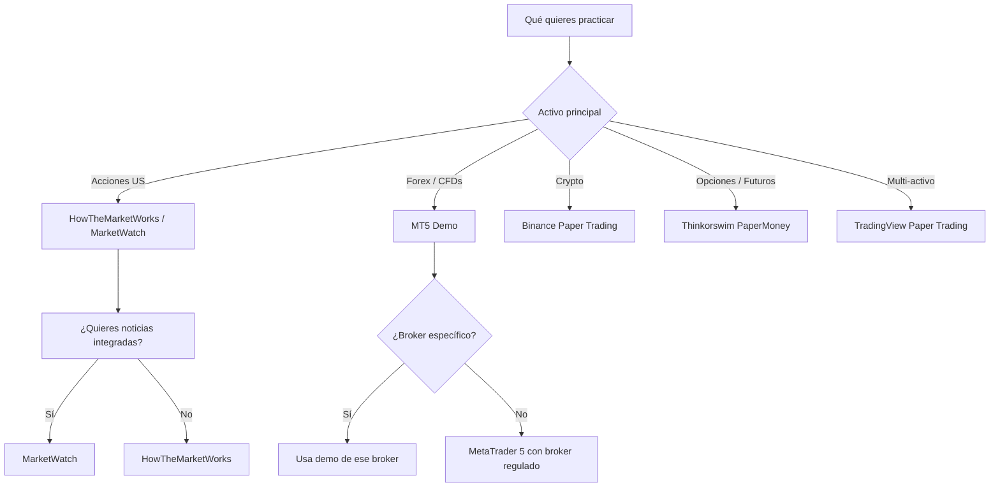
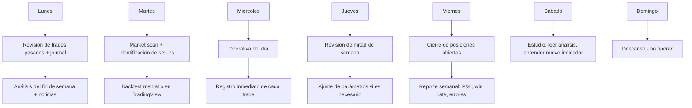
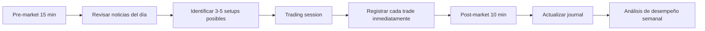

## ¿Qué vas a aprender

En esta masterclass aprenderás a usar plataformas de trading demo para convertirte en un inversor disciplinado sin arriesgar ni un dólar de tu capital:

- Plataformas disponibles y cuál elegir según tu perfil
- Estrategias específicas para entrenamiento en demo vs. trading real
- Errores que NO cometes en demo pero SÍ arruinan tu cuenta real
- Cómo medir tu progreso y detectar si estás listo para capital real
- Rutina semanal de prácticas y métricas para seguir
- Trazabilidad de resultados, journaling y psicología del trading demo


# MASTERCLASS: Trading Demo — Aprende a Invertir SIN Arriesgar Dinero Real

## INTRODUCCIÓN — POR QUÉ ESTA MASTERCLASS ES DIFERENTE

El mayor mito del trading es que "si gano mucho en demo, ganaré en real". No es verdad.

Las plataformas demo resuelven solo un problema técnico: **aprender la interfaz, ejecutar órdenes y probar estrategias sin consecuencias financieras**. Pero no resuelven el problema psicológico: el miedo, la codicia, el sesgo de resultado y la ilusión de control.

Esta masterclass te enseña a usar las plataformas demo de forma **profesional**, no como un juego. Al final, sabrás distinguir entre "ganar en demo" y "estar listo para el dinero real".

> **🎯 Objetivo de Aprendizaje** — Al final de esta guía, podrás elegir la plataforma demo adecuada, diseñar un plan de entrenamiento estructurado, medir tus métricas como un trader profesional y determinar con objetividad si estás preparado para operar con capital real.

> **Advertencia educativa** — Esta guía es formativa. El trading conlleva riesgo. Practicar en demo reduce el riesgo financiero, pero no elimina la necesidad de educación, disciplina y gestión de riesgo antes de operar en vivo.


## MAPA DEL MASTERCLASS

| Fase | Pregunta que responde | Output principal |
|------|-----------------------|------------------|
| **Plataformas** | ¿Qué demo usar y por qué? | Perfil, ventajas y limitaciones |
| **Configuración** | ¿Cómo preparo la sesión? | Entorno realista y reproducible |
| **Estrategia** | ¿Cómo organizo mi práctica? | Plan de entrenamiento semanal |
| **Errores** | ¿Qué no hacer en demo? | Lista de trampas psicológicas |
| **Métricas** | ¿Cómo sé si estoy mejorando? | Journal, KPIs y curva de equity |
| **Transición** | ¿Cuándo pasar a real? | Criterios objetivos de readiness |
| **Psicología** | ¿Cómo entrenar la mente? | Rutinas y hábitos para el largo plazo |


## PARTE 1: PLATAFORMAS DEMO — CUÁL ELEGIR Y POR QUÉ

### 1.1 Ecosystem de plataformas disponibles

No todas las demos son iguales. Algunas simulan precio. Otras simulan spread, comisiones y liquidez. Algunas son educativas. Otras son brokers reales con modo paper.

| Plataforma | Activos | Fortaleza | Limitación |
|------------|---------|-----------|------------|
| **HowTheMarketWorks** | Acciones y ETFs US | Ganadores con premios educativos | Datos de un solo exchange |
| **MarketWatch Virtual Trading** | Acciones, ETFs, opciones | Integrada con noticias en vivo | Spreads no siempre realistas |
| **Investopedia Simulator** | Acciones, opciones, forex | Comunidad y leaderboards | Datos retrasados en algunos activos |
| **TradingView Paper Trading** | Multi-activo | Datos de calidad y gráficos profesionales | Ejecución simulada no siempre realista |
| **MetaTrader 5 Demo** | Forex, CFDs, metales | Spreads realistas y datos tick-level | Solo brokers que ofrecen MT5 |
| **Thinkorswim PaperMoney** | Acciones, opciones, futuros | Plataforma profesional real | Solo para residentes US |
| **Binance Paper Trading** | Crypto | Datos reales del exchange | Solo cripto |
| **eToro Portfolio Demo** | Acciones, ETFs, CFDs | Interfaz social | Modelo de ejecución diferente a broker real |


### 1.2 Cómo elegir tu plataforma



**Criterios de selección:**

| Criterio | Pregunta clave | Peso |
|----------|----------------|------|
| **Activos disponibles** | ¿Puedo practicar exactamente lo que quiero operar? | 30% |
| **Calidad de datos** | ¿Los precios se parecen a un broker real? | 20% |
| **Comisiones y spreads** | ¿Simula costos reales? | 20% |
| **Herramientas** | ¿Tiene gráficos, indicadores, órdenes avanzadas? | 15% |
| **Comunidad** | ¿Tiene foros, rankings o competencias? | 10% |
| **Interfaz** | ¿Es similar a lo que usaré en producción? | 5% |


### 1.3 Perfiles recomendados

| Perfil de trader | Mejor plataforma | Por qué |
|------------------|------------------|---------|
| Principiante absoluto (acciones US) | **HowTheMarketWorks** | Educación gamificada, sin presión |
| Principiante avanzado (multi-activo) | **MarketWatch Virtual Trading** | Noticias integradas, portfolios realistas |
| Quant / códigigo (forex, CFDs) | **MetaTrader 5 Demo** | Datos tick-level, spread realista |
| Crypto trader | **Binance Paper Trading** | Datos reales del exchange |
| Trader de opciones | **Thinkorswim PaperMoney** | Herramientas profesionales |
| Trader visual (cualquier activo) | **TradingView Paper Trading** | Gráficos de clase mundial |


## PARTE 2: CONFIGURACIÓN — PREPARA TU ENTORNO DE ENTRENAMIENTO

### 2.1 Regla de oro

Si tu entorno de demo no se parece al entorno real, tu entrenamiento es falso. Un trader que practica con spreads de 0 pips y sin comisiones desarrollará hábitos que lo harán perder dinero en producción.

**Tu checklist de configuración:**

| Check | Pregunta | ¿Por qué importa? |
|-------|----------|-------------------|
| Spreads realistas | ¿Los spreads duplican/triplican en noticias? | El slippage real existe |
| Comisiones activas | ¿Pago comisión por trade? | Los costos destruyen estrategias marginales |
| Slippage simulado | ¿Las órdenes llenan a precio distinto? | Backtest ≠ ejecución real |
| Datos sincronizados | ¿Los precios coinciden con fuentes públicas? | Verifica que no haya look-ahead bias |
| Tamaño de lote realista | ¿Puedo operar lotes mínimos del broker real? | Evita falsa sensación de escalado |
| Herramientas idénticas | ¿Uso los mismos indicadores/órdenes? | No quiero reaprender en producción |


### 2.2 Cómo configurar MT5 Demo correctamente

MetaTrader 5 Demo es el estándar de oro para forex y CFDs porque simula las condiciones del broker de forma casi idéntica.

**Pasos:**

1. **Descargar MT5** desde el broker regulado que usarás en producción.
2. **Abrir cuenta demo** con el mismo perfil de cuenta que usarás en real (standard, cent, etc.).
3. **Configurar instrumentos**:
   ```python
   import MetaTrader5 as mt5
   
   # Verificar símbolos disponibles
   symbols = mt5.symbols_get()
   print(f"Total símbolos: {len(symbols)}")
   
   # Asegurar que tus activos están en Market Watch
   for sym in ['EURUSD', 'GBPUSD', 'XAUUSD']:
       info = mt5.symbol_select(sym, True)
       print(f"{sym}: {'Agregado' if info else 'Ya estaba'}")
   ```
4. **Activar registro de trades**:
   ```python
   # En tu estrategia, guardar cada decisión
   import json
   from datetime import datetime
   
   def log_trade(trade_data, path='trades_demo.json'):
       trade_data['timestamp'] = datetime.now().isoformat()
       trade_data['mode'] = 'demo'
       with open(path, 'a') as f:
           f.write(json.dumps(trade_data) + '\n')
   ```
5. **Sincronizar horarios**: Verifica que la demo tenga el mismo horario de mercado que el broker real.


### 2.3 Configuración ideal por tipo de trader

| Tipo | Activos recomendados | Timeframe | Cantidad de trades/semana |
|------|----------------------|-----------|---------------------------|
| **Scalper** | Forex majors, índices | 1m - 5m | 20+ |
| **Day trader** | Acciones, futuros | 5m - 1h | 5 - 15 |
| **Swing trader** | Acciones, ETFs, CFDs | 4h - 1D | 1 - 5 |
| **Position trader** | Índices, materias primas | 1D - 1W | < 1 |


## PARTE 3: ESTRATEGIA DE ENTRENAMIENTO — CÓMO ORGANIZAR TU PRÁCTICA

### 3.1 El método I Do / We Do / You Do en demo

| Fase | Qué haces | Objetivo |
|------|-----------|---------|
| **I Do** (Semanas 1-2) | Aprendes la interfaz, ejecutas órdenes básicas | Familiaridad con herramientas |
| **We Do** (Semanas 3-4) | Sigues traders experimentados, copias setups | Aprendizaje por observación |
| **You Do** (Semana 5+) | Operas tus propias estrategias con journal | Desarrollo de edge propio |


### 3.2 Plan semanal de entrenamiento



**Regla de oro:** No abras más de 3 trades por día en las primeras 4 semanas. La calidad > cantidad.


### 3.3 Metas de entrenamiento progresivo

| Etapa | Duración | Meta de trades | Meta de win rate | Aprendizaje |
|-------|----------|----------------|------------------|-------------|
| **Nivel 1 - Infraestructura** | Semanas 1-2 | 20+ | N/A | Ejecución sin errores técnicos |
| **Nivel 2 - Observación** | Semanas 3-4 | 15+ | N/A | Identificar setups de otros traders |
| **Nivel 3 - Ejecución propia** | Semanas 5-8 | 40+ | > 40% | Validar tu estrategia en demo |
| **Nivel 4 - Optimización** | Meses 3-4 | 50+ | > 45% | Ajustar sin overfitear |
| **Nivel 5 - Simulación real** | Meses 5-6 | 3 meses consistentes | > 50% | Evaluar readiness para real |


### 3.4 Journal estructurado de trading

Cada trade debe registrarse con estos campos:

```markdown
## Trade #47 - 2026-06-14 14:30 UTC

**Activo:** EURUSD
**Dirección:** LONG
**Entrada:** 1.0850
**Stop Loss:** 1.0820 (30 pips)
**Take Profit:** 1.0910 (60 pips)
**R:R:** 2:1
**Timeframe:** H1

**Contexto de mercado:**
- Tendencia: Alcista en H4
- Volatilidad: Media (ATR 14 = 45 pips)
- Noticias: ECB speech a las 16:00

**Razón de entrada:**
- Pullback a EMA 50
- RSI = 48 (no sobrecompra)
- Soporte histórico en 1.0830

**Resultado:**
- SL alcanzado a las 18:45 UTC
- P&L: -30 pips

**Lección aprendida:**
El pullback fue más profundo de lo esperado. 
Próxima vez: esperar confirmación de vela en EMA 50.
```

| Campo | Obligatorio | Por qué |
|-------|-------------|---------|
| Número de trade | ✅ | Para tracking |
| Fecha y hora | ✅ | Para análisis temporal |
| Activo y dirección | ✅ | Contexto |
| Entrada, SL, TP | ✅ | Para calcular R:R |
| Contexto de mercado | ✅ | Para aprender |
| Razón de entrada | ✅ | Para detectar sesgos |
| Resultado | ✅ | Métricas |
| Lección aprendida | ✅ | El valor real del journal |


## PARTE 4: ERRORES QUE ARRUINAN TU DEMO (Y TU CUENTA REAL)

### 4.1 Los 7 pecados capitales del trading demo

| Error | Síntoma | Consecuencia real |
|-------|---------|-------------------|
| **Sobre-apalancamiento** | Opera lotes enormes "porque es demo" | Cuenta real vaporizada en minutos |
| **Sin stop loss** | "Dejo correr" sin SL | Catástrofe en real |
| **Revancha** | Recuperar pérdidas inmediatamente | Martingala emocional |
| **Desprecio de comisiones** | Opera 100 trades sin costos | La comisión se come tu edge en real |
| **Sesgo de confirmación** | Solo registra trades ganadores | No aprendes de errores |
| **Falta de journal** | No recuerda por qué entró | No mejora, solo repite |
| **Pasar a real prematuramente** | "Gané 10 trades, ya soy experto" | Destruye cuenta en la primera semana real |


### 4.2 Cómo medir si estás sesgado por ser demo

Preguntas de autoevaluación honesta:

| Pregunta | Si respondes "Sí" | Acción |
|----------|-------------------|--------|
| ¿Operas más trades en demo que en un mes real que podrarias? | **Sí** | Reducir frecuencia un 50% |
| ¿Tomas más riesgo porque "no es real"? | **Sí** | Operar solo 1% del capital simulado |
| ¿Olvidas poner SL en trades pequeños? | **Sí** | Regla: sin SL = sin trade |
| ¿Te frustras cuando pierdes aunque sea demo? | **Sí** | Psicológico: necesitas más práctica |
| ¿Comparas tu resultado con traders famosos? | **Sí** | Compara con tu propio histórico |
| ¿Cambias de estrategia cada semana? | **Sí** | Stick with una strategy 2+ meses |
| ¿No tienes journal completo? | **Sí** | Empezar journal YA |


### 4.3 La prueba del espejo

Antes de considerar operar en real, responde estas preguntas:

1. ¿He hecho al menos 100 trades en demo con la misma estrategia?
2. ¿Mi win rate en los últimos 30 trades supera el 45%?
3. ¿Mi profit factor es mayor a 1.5?
4. ¿Mi drawdown máximo en demo no supera el 10%?
5. ¿Tengo un journal completo con lecciones aprendidas?
6. ¿He pasado por un drawdown de 5+ trades seguidos y continué operando bien?
7. ¿Me siento cómodo con pérdidas individuales sin FOMO ni revenge trading?
8. ¿Conozco mis números: expectancy, R:R promedio, mejor y peor día?

**Si respondiste NO a cualquiera, sigues en demo.**


## PARTE 5: MÉTRICAS QUE IMPORTAN — CÓMO MEDIR TU PROGRESO

### 5.1 KPIs esenciales del trader

| Métrica | Fórmula | Meta | Interpretación |
|---------|---------|------|----------------|
| **Win Rate** | Trades ganadores / Total | > 40% (momentum) / > 50% (reversión) | Precisión de tus señales |
| **Profit Factor** | Ganancias brutas / Pérdidas brutas | > 1.5 | Calidad de tu estrategia |
| **Expectancy** | (WR × Ganancia promedio) - ((1-WR) × Pérdida promedio) | > 0 | Valor esperado por trade |
| **Max Drawdown** | Peak to trough más profundo | < 10% demo | Control de riesgo |
| **Sharpe Ratio** | Retorno / Volatilidad | > 1.0 | Eficiencia de tu trading |
| **R:R promedio** | Ganancia promedio / Pérdida promedio | > 1.5 | Calidad de tus salidas |


### 5.2 Código: seguimiento automático de métricas

```python
import json
from datetime import datetime
from dataclasses import dataclass, asdict
from typing import List
import statistics


@dataclass
class Trade:
    trade_id: int
    date: str
    asset: str
    direction: str  # LONG or SHORT
    entry: float
    stop_loss: float
    take_profit: float
    exit: float
    result_pips: float
    result_money: float
    reason: str
    lesson: str
    platform: str


class TradeTracker:
    def __init__(self, journal_file='demo_journal.json'):
        self.journal_file = journal_file
        self.trades: List[Trade] = []
        self._load()

    def add_trade(self, trade: Trade):
        self.trades.append(trade)
        self._save()

    def metrics(self) -> dict:
        results = [t.result_money for t in self.trades]
        winners = [r for r in results if r > 0]
        losers = [r for r in results if r <= 0]

        win_rate = len(winners) / len(results) if results else 0
        avg_win = statistics.mean(winners) if winners else 0
        avg_loss = abs(statistics.mean(losers)) if losers else 1
        profit_factor = sum(winners) / abs(sum(losers)) if losers else float('inf')
        expectancy = (win_rate * avg_win) - ((1 - win_rate) * avg_loss)

        return {
            'total_trades': len(results),
            'win_rate': round(win_rate, 2),
            'profit_factor': round(profit_factor, 2),
            'expectancy': round(expectancy, 4),
            'avg_win': round(avg_win, 2),
            'avg_loss': round(avg_loss, 2),
            'best_trade': max(results),
            'worst_trade': min(results),
            'consecutive_losses': self._max_consecutive(results),
        }

    def _max_consecutive(self, results: list) -> int:
        max_consec = 0
        current = 0
        for r in results:
            if r <= 0:
                current += 1
                max_consec = max(max_consec, current)
            else:
                current = 0
        return max_consec

    def _save(self):
        with open(self.journal_file, 'w') as f:
            json.dump([asdict(t) for t in self.trades], f, indent=2)

    def _load(self):
        try:
            with open(self.journal_file, 'r') as f:
                data = json.load(f)
                self.trades = [Trade(**d) for d in data]
        except FileNotFoundError:
            pass


# USO:
tracker = TradeTracker()

# Agregar un trade
trade = Trade(
    trade_id=47,
    date="2026-06-14",
    asset="EURUSD",
    direction="LONG",
    entry=1.0850,
    stop_loss=1.0820,
    take_profit=1.0910,
    exit=1.0820,
    result_pips=-30,
    result_money=-30,
    reason="Pullback a EMA 50",
    lesson="Esperar confirmación de vela",
    platform="demo"
)
tracker.add_trade(trade)

# Ver métricas
print(tracker.metrics())
```


### 5.3 Tabla de métricas objetivo por etapa

| Etapa | Win Rate | Profit Factor | Expectancy | Drawdown máx |
|-------|----------|---------------|------------|--------------|
| **Nivel 1** | N/A | N/A | N/A | N/A |
| **Nivel 2** | N/A | N/A | N/A | N/A |
| **Nivel 3** | > 35% | > 1.2 | > 0 | < 15% |
| **Nivel 4** | > 40% | > 1.5 | > 0 | < 10% |
| **Nivel 5** | > 45% | > 1.8 | > 0 | < 8% |


## PARTE 6: TRANSICIÓN A CAPITAL REAL — ¿ESTÁS LISTO?

### 6.1 La prueba definitiva

Antes de abrir una cuenta real, completa este checklist:

| Criterio | Requisito mínimo | Verificación |
|----------|------------------|--------------|
| **Trades en demo** | > 100 trades en 3 meses | Contador de journal |
| **Consistencia** | 3 meses positivos consecutivos | Gráfica de equity |
| **Drawdown** | Máximo 10% en demo | Métricas calculadas |
| **Win rate** | > 40% en últimos 50 trades | Estadísticas |
| **Profit factor** | > 1.5 en últimos 50 trades | Métricas |
| **R:R positivo** | > 1.5 promedio | Por trade |
| **Psychological readiness** | No FOMO, no revancha | Autoevaluación |
| **Capital de riesgo** | Dinero que puedas perder 100% | Declaración personal |


### 6.2 La regla del 1% (y la del 0.25%)

Cuando pases a real, aplica estas reglas desde el día 1:

```python
# Gestión de riesgo para cuenta real
def calculate_position_size(
    account_equity: float,
    risk_per_trade: float,  # 0.01 = 1%
    entry_price: float,
    stop_loss: float
) -> float:
    """
    Calcula el tamaño de posición basado en riesgo.
    Nunca arriesgues más del 1% por trade.
    """
    risk_amount = account_equity * risk_per_trade
    technical_risk = abs(entry_price - stop_loss)
    
    if technical_risk == 0:
        return 0.0
    
    # Por acción/CFD
    units = risk_amount / technical_risk
    
    return max(units, 0.0)


# EJEMPLO PRÁCTICO:
# Cuenta: $10,000 USD
# Riesgo por trade: 1% = $100
# Entrada: $50.00
# Stop loss: $49.00
# Riesgo técnico: $1.00 por acción

units = calculate_position_size(
    account_equity=10_000,
    risk_per_trade=0.01,  # 1%
    entry_price=50.00,
    stop_loss=49.00
)
print(f"Comprar {units:.0f} acciones")  # Output: Comprar 100 acciones
# Riesgo total: 100 acciones × $1 = $100 (1% de $10,000)
```

**Regla del 0.25% para traders nuevos:**
Si tienes menos de 6 meses de demo consistente, usa 0.25% por trade. Es más lento, pero sobrevives más tiempo.


### 6.3 Criterios de salida de real

Sí, también hay que saber cuándo **dejar de operar**:

| Señal | Acción |
|-------|--------|
| Drawdown > 10% en cuenta real | Suspender operativa 1 semana |
| 3 días consecutivos con pérdidas | Revisar journal y estrategia |
| No entender un movimiento del mercado | No operar hasta entenderlo |
| Cambiar estrategia por FOMO | Volver a demo con la nueva estrategia |
| Efectos personales afectando juicio | Descanso obligatorio |


## PARTE 7: PSICOLOGÍA Y MINDSET — LO QUE NO ENSEÑAN LAS PLATAFORMAS

### 7.1 La mentalidad correcta en demo

El error número 1: tratar la demo como un juego. No lo es.

**Cambia tu mindset:**

| Mindset incorrecto | Mindset correcto |
|--------------------|------------------|
| "Perdí $1,000 virtuales, no importa" | Cada trade es una decisión financiera real |
| "En demo gano siempre" | En demo aprendo, en demo cometo errores |
| "Paso a real cuando quiera" | Paso a real cuando esté listo, no cuando quiera |
| "Si funciona en demo, funciona en real" | Demo es necesaria pero no suficiente |
| "No necesita fundamentos" | Todo trade debe tener una razón económica |


### 7.2 La prueba del dinero verdadero

Antes de operar en real, haz esto:

1. **Opera 1 mes en demo como si fuera real** (usa 1% de una cantidad que simulaste)
2. **Registra la emoción de cada trade** (no solo el resultado)
3. **Pregúntate al final de cada día**: ¿Me arrepiento de algún trade?
4. **Si tienes más de 2 trades de los que te arrepientes al día, sigues en demo**

El verdadero test no es cuánto ganas en demo. Es cuántoDuele perder1,000 virtualesCuando sientes ese dolor, estás listo.


### 7.3 Rutina diaria recomendada




## PARTE 8: CHECKLIST FINAL DEL TRADER DEMO

| Bloque | Check |
|--------|-------|
| **Plataforma** | Elegí la correcta para mis activos y estilo |
| **Configuración** | Spreads, comisiones y datos realistas activos |
| **Plan** | Tengo un plan semanal de entrenamiento |
| **Journal** | Registro trades con razón y lección |
| **Métricas** | Calculo win rate, profit factor y expectancy |
| **Disciplina** | Opero la misma estrategia 2+ meses sin cambiar |
| ** psicológico** | Siento el "dolor" de perder trades demo |
| **Readiness** | Aprobé la checklist de transición a real |
| **Risk** | Conozco y aplico la regla del 1% (o 0.25%) |
| **Continuidad** | Tengo un plan de mantenimiento de skills |


## Preguntas de Verificación 📝

Responde cada pregunta basándote en los conceptos de esta master class.

### Preguntas sobre Plataformas Demo

1. **Aplica**: Tienes $500 USD y quieres empezar a practicar. ¿Qué plataforma elegirías y por qué? ¿Qué configuración implementarías?

2. **Analiza**: ¿Por qué operar solo con acciones en HowTheMarketWorks no te prepara para operar forex en MT5?

### Preguntas sobre Entrenamiento

3. **Diseña**: Crea un plan de entrenamiento de 4 semanas para un swing trader de acciones US. Define qué harás cada semana.

4. **Evalúa**: Acabas de hacer 30 trades y tienes un profit factor de 0.8. ¿Significa que tu estrategia es mala? ¿Qué más debes revisar?

### Preguntas sobre Psicología

5. **Reflexiona**: ¿Por qué el sobre-apalancamiento en demo es un predictor de ruina en real?

6. **Conecta**: ¿Cómo se relacionan el journaling y la psicología del trading? Explica con un ejemplo práctico.

### Preguntas Integradoras

7. **Propón un sistema**: Diseña un test de 30 días para determinar si un trader está listo para cuentas reales. ¿Qué medirías? ¿Cuál sería el umbral de aprobación?

8. **Síntesis**: Compara dos traders: uno que hizo 500 trades en demo con profit factor 1.3 pero sin journal, y otro que hizo 100 trades con profit factor 2.0 y journal detallado. ¿Quién está más listo para real? Justifica.

9. **Reflexión final**: ¿Qué es más importante: tener una estrategia ganadora en demo o tener la disciplina para ejecutarla? Argumenta tu respuesta.


## GLOSARIO RÁPIDO

| Término | Definición |
|---------|------------|
| **Demo account** | Cuenta simulada con dinero virtual para practicar |
| **Paper trading** | Sinónimo de demo trading |
| **Spread** | Diferencia entre precio de compra y venta |
| **Slippage** | Diferencia entre precio esperado y precio de ejecución |
| **Profit factor** | Ganancias brutas / Pérdidas brutas |
| **Win rate** | Porcentaje de trades ganadores |
| **Drawdown** | Caída desde el máximo de equity |
| **R:R (Risk:Reward)** | Relación entre riesgo y ganancia por trade |
| **Expectancy** | Valor esperado por trade (promedio ponderado) |
| **Journal** | Registro detallado de cada trade con razones y lecciones |
| **Look-ahead bias** | Usar información futura en una simulación |
| **Overfitting** | Sobreajuste de parámetros a datos históricos |


## ANEXO: CONFIGURACIONES RECOMENDADAS POR BROKER

### Configuración MT5 Demo estándar

```python
CONFIG_MT5_DEMO = {
    "login": "TU_NUMERO_CUENTA",
    "password": "TU_CONTRASEÑA",
    "server": "Broker-Demo-Server",
    "path": "C:\\Program Files\\MetaTrader 5\\terminal64.exe",
    "default_symbols": ["EURUSD", "GBPUSD", "USDJPY", "XAUUSD"],
    "default_timeframe": mt5.TIMEFRAME_H1,
    "initial_deposit": 10_000,  # USD virtual
    "leverage": 100,
    "commission_per_lot": 7.0,  # USD por lote estándar
}
```

### Configuración TradingView Paper Trading

```python
CONFIG_TRADINGVIEW_DEMO = {
    "initial_capital": 100_000,
    "commission_per_trade": 0.65,  # USD por contrato de acciones
    "slippage_percent": 0.01,  # 0.01%
    "allowed_assets": ["NYSE", "NASDAQ", "FOREX", "CRYPTO"],
}
```


## RECURSOS ADICIONALES

| Recurso | Link | Descripción |
|---------|------|-------------|
| **HowTheMarketWorks** | https://www.howthemarketworks.com | Demo gratuito de acciones US con competencias |
| **MarketWatch Virtual Trading** | https://www.marketwatch.com/tools/stock-portfolio-game | Simulador integrado con noticias |
| **MetaTrader 5 Demo** | https://www.metatrader5.com | Plataforma profesional para forex/CFDs |
| **TradingView Paper Trading** | https://es.tradingview.com | Gráficos profesionales + demo multi-activo |
| **Investopedia Simulator** | https://www.investopedia.com/simulator | Demo con comunidad y rankings |
| **Binary Options Demo** | https://www.binaryoptions.net | Para práctica de opciones binarias (educativo) |


## CIERRE

La clave del trading exitoso no es la plataforma.

Es la **disciplina de entrenamiento**.

Si practicas 3 meses en demo con journal, métricas y una estrategia definida, no importa qué broker elijas después. Sabrás operar.

Si pasas a real en 2 semanas "porque gané un par de trades", no importa qué broker elijas. Perderás dinero.

---

### 📌 Idea clave

> El trading demo es una herramienta de aprendizaje, no un casino. Trata cada trade virtual como si fuera real, y solo operarás en cuenta real cuando estés verdaderamente listo.
