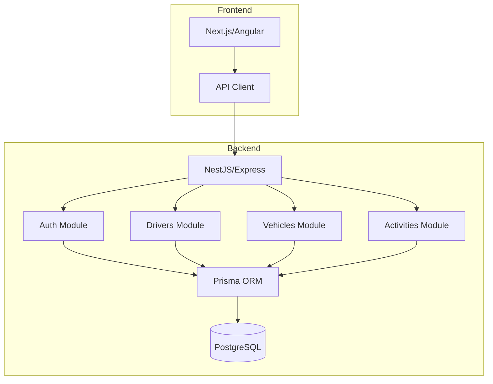

# Desafío Técnico: Plataforma de Dashboard Logístico Moderno

## Introducción

Este desafío evalúa tu capacidad para diseñar y construir una aplicación full-stack con arquitectura limpia, escalabilidad y buenas prácticas de ingeniería. No se enfoca en algoritmos complejos, sino en tus decisiones arquitectónicas, organización del proyecto y madurez técnica.

## Contexto de Negocio

Una empresa gestiona operaciones de campo y rutas logísticas para conductores y vehículos. La plataforma debe permitir a los operadores:

- Visualizar conductores y vehículos
- Asignar tareas
- Monitorear rutas
- Seguir estados
- Visualizar actividades en un dashboard

El sistema simula una versión ligera de servicios como Uber Dispatch, Oracle Field Service o una SaaS de gestión logística.

## Requisitos Funcionales

### Frontend

#### 1. Autenticación
- Pantalla de login
- Rutas protegidas
- Persistencia de sesión

#### 2. Dashboard de Despacho
Mostrar:
- Lista de vehículos/conductores
- Actividades asignadas
- Estados de actividades
- Cronograma/timelines
- Tarjetas de tareas

#### 3. Gestión de Actividades
Permitir:
- Crear actividad
- Editar actividad
- Cambiar estado
- Asignar actividad a conductor

Campos de la actividad:
- Título
- Descripción
- Fecha programada
- Prioridad
- Estado
- Conductor asignado

#### 4. Visualización del Dashboard
Incluir:
- Tarjetas con estadísticas
- Actividades activas
- Actividades completadas
- Actividades pendientes
- Vehículos en línea/fuera de línea

#### 5. UI Responsiva
La aplicación debe funcionar en:
- Escritorio
- Tablet
- Móvil

### Backend

#### Endpoints requeridos

- `auth/login`
- `auth/me`
- `drivers`
- `vehicles`
- `activities`

Incluir:
- Operaciones CRUD
- Validaciones
- Manejo de errores

## Requisitos Arquitectónicos

### Backend
La aplicación debe demostrar:
- Arquitectura modular
- Separación de preocupaciones
- Capa de servicios
- Patrón repositorio
- Validación DTO
- Configuración de entorno
- Manejo centralizado de errores

### Frontend
La aplicación debe demostrar:
- Arquitectura basada en características
- Componentes reutilizables
- Manejo de estado
- Capa de abstracción de API
- Estados de carga/error

## Stack Sugerido

**Frontend:**
- Next.js O Angular
- TypeScript
- TailwindCSS O Material UI

**Backend:**
- NestJS O Express
- PostgreSQL
- Prisma ORM

**Opcional:**
- Redis
- Docker
- Socket.IO

## Ejemplos de Estructura de Carpetas

### Backend (NestJS)
```
src/
├── modules/
│   ├── auth/
│   │   ├── controllers/
│   │   ├── services/
│   │   ├── repositories/
│   │   └── dto/
│   ├── drivers/
│   ├── vehicles/
│   └── activities/
├── common/
│   ├── filters/
│   ├── interceptors/
│   └── utils/
├── config/
└── app.module.ts
```

### Frontend (Next.js)
```
src/
├── features/
│   ├── auth/
│   │   ├── components/
│   │   ├── hooks/
│   │   └── store/
│   ├── dispatch/
│   └── shared/
├── components/
├── services/
├── types/
├── utils/
└── app/
```

## Diagramas de Arquitectura



## Criterios de Evaluación

### Arquitectura
- Organización
- Modularidad
- Pensamiento de escalabilidad

### Calidad de Código
- Legibilidad
- Mantenibilidad
- Nombres significativos
- Consistencia

### Frontend
- UX
- Responsividad
- Manejo de estado

### Backend
- Diseño de API
- Validaciones
- Manejo de errores
- Abstracciones

### Madurez Engineering
- Conciencia de trade-offs
- Estructura del proyecto
- Calidad de documentación

## Entregables

1. Código fuente funcional
2. Documentación (README)
3. Instrucciones de setup
4. Screenshots del dashboard
5. Diagramas de arquitectura
6. (Opcional) Docker compose

## Tiempo Estimado

**2-3 días** de trabajo

## Nivel

**Junior a Mid-Level**

---

**Nota**: El enfoque está en arquitectura, organización y buenas prácticas, no en diseño visual perfecto.

---

## Preguntas de Verificación 📝

Responde cada pregunta basándote en los conceptos del desafío. Escribe tus respuestas o compártelas para profundizar tu aprendizaje.

### Preguntas sobre Arquitectura

1. **Diseña**: Explica cómo estructurarías los módulos de NestJS para cumplir con el patrón de arquitectura limpia. ¿Qué responsabilidades tendría cada capa?

2. **Compara**: ¿Cuál sería la diferencia entre usar el patrón Repository vs acceder directamente al ORM en el service layer? Cuándo usarías cada uno.

3. **Evalúa**: El desafío pide "modularidad" y "separación de preocupaciones". ¿Cómo aplicarías estos principios en la estructura de carpetas del frontend Next.js?

### Preguntas sobre Frontend

4. **Propón**: Diseña un sistema de manejo de estado para el dashboard de despacho. ¿Qué datos manejarías localmente vs en el servidor?

5. **Aplica**: Crea un componente reutilizable para la lista de actividades. ¿Qué props recibiría y cómo manejarías los estados de carga y error?

6. **Analiza**: La app debe funcionar en móvil, tablet y escritorio. ¿Qué estrategias de responsive design aplicarías y qué breakpoints considerarías?

### Preguntas sobre Backend

7. **Diseña**: Implementa el endpoint `activities` con las operaciones CRUD. ¿Qué validaciones incluirías y cómo manejarías los errores?

8. **Calcula**: Si la app maneja 1000 actividades concurrentes, ¿qué estrategias de paginación y caché aplicarías para mantener buen performance?

9. **Propón**: Diseña el sistema de autenticación. ¿Qué almacenarías en el JWT y cómo validarías los permisos por rol?

### Preguntas Integradoras

10. **Conecta**: Explica cómo la arquitectura modular del backend se relaciona con la arquitectura basada en características del frontend. ¿Qué ventajas ofrece esta alineación?

11. **Síntesis**: Toma la funcionalidad de "asignar actividad a conductor". Dibuja el flujo completo desde el frontend hasta la base de datos, incluyendo validaciones y manejo de errores.

12. **Reflexión final**: Este es un desafío "Junior a Mid-Level". ¿Qué decisiones arquitectónicas diferenciarían una solución junior de una solución senior?

---

## Glosario Rápido

| Término | Definición |
|---------|------------|
| **Arquitectura limpia** | Patrón que separa las reglas de negocio de la infraestructura |
| **Repository pattern** | Abstracción para operaciones de base de datos |
| **DTO** | Objeto que transporta datos entre capas |
| **Responsive design** | Diseño que se adapta a diferentes tamaños de pantalla |
| **State management** | Manejo de estado global en aplicaciones |