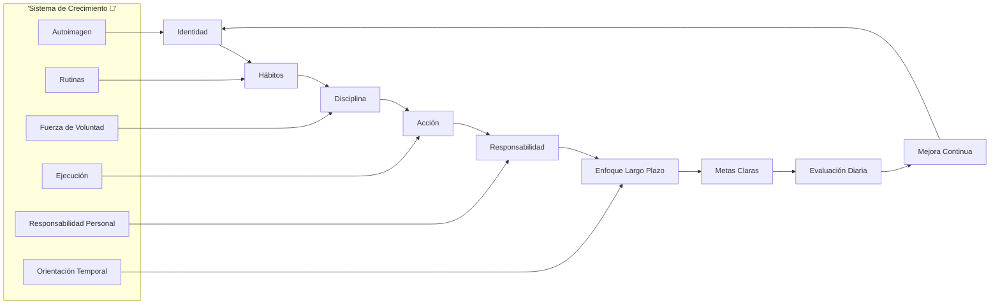
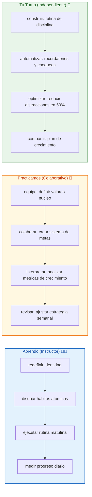
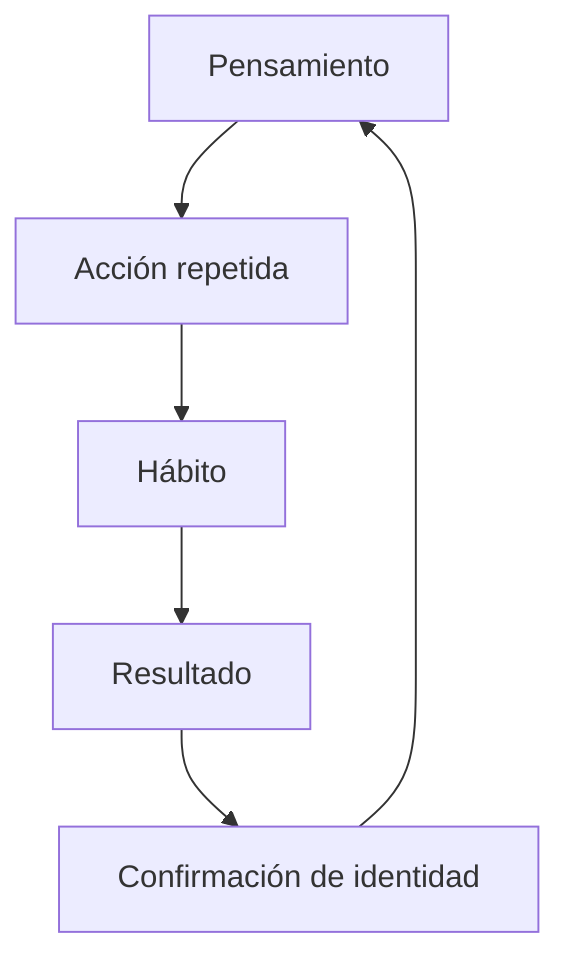
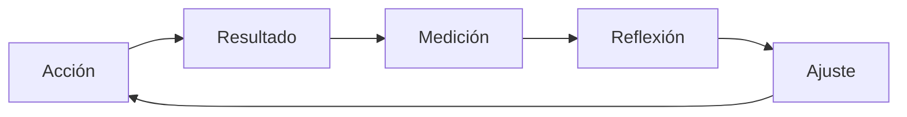

# 🚀 MASTERCLASS: Desarrollo Personal al Estilo Brian Tracy 🧠✨

## 🎯 INTRODUCCIÓN: POR QUÉ ESTE MASTERCLASS ES DIFERENTE 💡

El desarrollo personal tradicional suele concentrarse en trucos rápidos y motivación pasajera. Pero los resultados extraordinarios no vienen de una charla inspiradora dura 10 minutos. Vienen de una **transformación estructural en la forma en que te ves a ti mismo y en cómo actúas todos los días**, incluso cuando nadie te observa.

Este masterclass propone otro camino: **construir la identidad de una persona exitosa desde los hábitos más pequeños hasta el pensamiento a largo plazo**. No se trata de imitar a Brian Tracy. Se trata de entender los principios que usa y aplicarlos para reprogramar tu mentalidad, tu disciplina y tus resultados.

> **🎯 Objetivo de Aprendizaje** — Al final de esta guía podrás rediseñar tu identidad, crear el sistema de hábitos que premia la disciplina, pensar en términos de años en lugar de días, responsabilizarte de cada resultado y construir un plan de crecimiento sostenible.

> **⚠️ Advertencia** — Este contenido es formativo. El crecimiento personal requiere aplicación constante. Ninguna teoría reemplaza la acción deliberada y la reflexión diaria.

---

## 🗺️ MAPA DEL WORKFLOW DE DESARROLLO PERSONAL 🧭✨



| Fase 🌍 | Pregunta que responde ❓ | Output principal 🎯 |
|--------|-----------------------|------------------|
| **Identidad** 🧬 | ¿Quién quiero ser? | Visión de ti mismo |
| **Hábitos** 🔄 | ¿Qué hago todos los días? | Sistema de rutinas |
| **Disciplina** 💪 | ¿Cómo actúo sin motivación? | Fuerza de voluntad entrenada |
| **Acción** ⚡ | ¿Qué hago hoy? | Movimiento real |
| **Responsabilidad** ⚖️ | ¿De quién depende mi resultado? | Control de tu futuro |
| **Enfoque Largo Plazo** 📅 | ¿Hacia dónde voy en 5 años? | Estrategia temporal |
| **Metas Claras** 🎯 | ¿Qué quiero lograr? | Objetivos medibles |
| **Evaluación Diaria** 📊 | ¿Qué aprendí hoy? | Retroalimentación |
| **Mejora Continua** 📈 | ¿Cómo soy mejor que ayer? | Progreso medible |

---




---

## 🔍 PARTE 1: IDENTIDAD — LA BASE OCULTA DEL ÉXITO 🧬✨

### 1.1 🧬 Qué es la identidad y por qué lo controla todo

Tu identidad es la imagen que tienes de ti mismo. Es el relato interno que repites cada día: "soy una persona disciplinada", "soy impuntual", "no soy bueno con las matemáticas", "siempre llego temprano".

Brian Tracy dice que tus resultados actuales no son un accidente. Son el reflejo exacto de tu identidad actual. Cambiar de hábito sin cambiar de identidad es como pintar una casa sobre cimientos rotos: se ve bien por fuera, pero se cae a la primera tormenta.

### 1.2 ⚠️ El error del principiante: querer cambiar el comportamiento sin cambiar la creencia

El error número uno es creer que alcanzarás metas extraordinarias manteniendo la misma autoimagen. Si quieres ganar más dinero pero te ves a ti mismo como "alguien que no entiende de finanzas", nunca llegarás lejos.

Esto es lo que ocurre:

| Intento | Resultado | Por qué |
|--------|-----------|---------|
| Cambiar de hábito sin cambiar identidad | Resultados temporales | La vieja identidad tira hacia atrás |
| Cambiar identidad primero | Conducta natural | La nueva identidad exige congruencia |
| Trabajar más en la misma identidad | Más esfuerzo, mismo resultado | Estás optimizando el sistema equivocado |
| Rediseñar la identidad | Menos resistencia, más continuidad | La conducta fluye de la creencia |

### 1.3 🔄 Cómo se forma la identidad

Tu identidad no viene de lo que dices que eres. Viene de lo que repites. Cada acción es un voto a favor de la persona que quieres ser.



### 1.4 🛠️ Código para rediseñar tu identidad

```text
👤 Declaración de nueva identidad:
- Escribe cómo quieres verte en tercera persona
- Usa el presente: "soy", "soy alguien que..."
- Incluye 3 a 5 atributos nucleares
- Ejemplo: "Soy alguien que cumple lo que promete, incluso cuando nadie ve."

📋 Registro de evidencia diaria:
- Cada día, anota 1 acción que confirme esa identidad
- No se vale aspirar. Se vale demostrar.
- Después de 30 días, la identidad deja de ser una frase y se convierte en un hecho.
```

**Ejemplo de declaración de identidad**

- Soy una persona que entrena aunque tenga sueño.
- Soy alguien que entrega calidad incluso con prisa.
- Soy disciplinado con mi dinero incluso en pequeñas cantidades.
- Soy constante aunque no tenga ganas.
- Soy responsable de cada resultado, sin excusas.

### 1.5 📊 Tabla de identidades comunes y sus resultados típicos

| Identidad declarada | Comportamiento esperado | Resultado típico |
|-------------------|----------------------|-----------------|
| "Soy impuntual" | Llegar tarde, posponer | Oportunidades perdidas |
| "Soy disciplinado" | Cumplir rutinas incluso sin motivación | Progreso acumulado |
| "No soy bueno para vender" | Evitar conversaciones comerciales | Ingresos estancados |
| "Soy una persona de acción" | Ejecutar rápido y corregir después | Aprendizaje acelerado |
| "Soy víctima de las circunstancias" | Buscar culpables externos | Estancamiento |
| "Soy alguien que aprende de los errores" | Reflexionar y ajustar | Mejora continua |

---

## 🔄 PARTE 2: HÁBITOS — LA ARQUITECTURA INVISIBLE DE TU DÍA 🔁✨

### 2.1 🔁 Por qué los hábitos son superpoderes

Los hábitos eliminan la necesidad de decidir. Cuando una acción es automática, consumes menos energía mental y obtienes resultados constantes. La gente exitosa no tiene más fuerza de voluntad. Tiene mejores sistemas.

Brian Tracy dice: "La excelencia no es un acto, es un hábito".

### 2.2 🧩 Anatomía de un hábito

Todo hábito tiene 4 partes:

```
🔔 Señal → 🧠 Rutina → 🎁 Recompensa → 🔁 Creencia
```

| Componente | Función | Ejemplo |
|-----------|---------|---------|
| **Señal** | Activa el hábito | Suena el despertador |
| **Rutina** | Acción automática | Levantarse y beber agua |
| **Recompensa** | Refuerza el hábito | Energía, satisfacción |
| **Creencia** | Valida la identidad | "Soy alguien disciplinado" |

### 2.3 🏗️ Cómo construir hábitos que duren

**Regla de oro:** no intentes cambiar todo a la vez. Elige 1 o 2 hábitos por trimestre.

**Fórmula de diseño:**

| Paso | Acción | Ejemplo |
|------|--------|---------|
| 1. Definir identidad | ¿Qué tipo de persona hace esto? | "Soy alguien que lee 20 páginas diarias" |
| 2. Automatizar señal | Vincular a algo que ya haces | Después de cepillarme los dientes |
| 3. Reducir fricción | Preparar el entorno | Libro abierto en la mesa |
| 4. Medir seguimiento | Marcar en calendario | X por día completado |
| 5. Celebrar small wins | Reforzar positivamente | 1 minuto de satisfacción |

### 2.4 📈 Tabla de hábitos nucleares para el éxito

| Hábito | Frecuencia | Impacto | Dificultad inicial |
|--------|-----------|---------|------------------|
| 📚 Leer 20 páginas | Diario | Alto | Baja |
| 🏃 Ejercicio 30 min | Diario | Alto | Media |
| 📝 Planificar el día siguiente | Noche anterior | Alto | Baja |
| 💧 Beber agua al despertar | Al despertar | Medio | Baja |
| 🧠 Meditación o reflexión | Diario | Medio | Media |
| 🛌 Dormir 7-8 horas | Diario | Alto | Media |
| 💰 Ahorro automático | Mensual | Alto | Baja |
| ✍️ Escribir metas | Semanal | Alto | Baja |

### 2.5 🚫 Errores comunes al crear hábitos

| Error | Síntoma | Solución |
|-------|---------|---------|
| Empezar demasiado grande | Abandono en 3 días | Reducir a versión ridícula |
| Depender de motivación | No actúa si no tiene ganas | Vincular a identidad, no a sentimiento |
| No medir seguimiento | Pierde el hilo | Usar calendario o app de hábitos |
| Saltarse un día "porque sí" | Romper la racha mental | Permitir 1 fallo, nunca 2 seguidos |
| Cambiar muchos hábitos a la vez | Sobrecarga | Máximo 2 por trimestre |
| No celebrar victorias | Sin refuerzo emocional | 1 minuto de celebración consciente |

---

## 💪 PARTE 3: DISCIPLINA — LA FUERZA QUE SE ENTRENA 💪✨

### 3.1 💡 Mitos sobre la disciplina

La disciplina no es un castigo. No es "sufrir para crecer". Es respeto por tu futuro. Es la capacidad de elegir lo que más quieres sobre lo que quieres ahora.

| Mitos | Realidad |
|-------|---------|
| "Disciplina es sufrir" | Es libertad retardada |
| "Soy indisciplinado de naturaleza" | Es un músculo, se entrena |
| "Necesito motivación para ser disciplinado" | La disciplina funciona sin motivación |
| "Los exitosos nacen así" | Todos construyen disciplina día a día |

### 3.2 🧠 Cómo funciona la fuerza de voluntad

La fuerza de voluntad es como un músculo. Si lo usas en muchas decisiones pequeñas al día, se agota. Si lo entrenas en pocas acciones deliberadas, crece.

Brian Tracy recomienda "eat the frog": hacer lo más difícil primero, antes de que la fuerza de voluntad se desgaste.

**Fórmula de disciplina diaria:**

1. 🌅 Mañana: haz la tarea más difícil primero
2. 📋 Prepara la noche anterior: evita decisiones matutinas
3. 🔒 Protege tus bloques profundos: no interrupciones
4. 🚫 Elimina opciones que te distraen: menos decisiones, más acción
5. 🏆 Celebra el cumplimiento: refuerza la creencia

### 3.3 🛠️ Sistema de disciplina por capas

```text
🌅 Nivel 1: Entorno
- Elimina distracciones físicas
- Prepara herramientas con anticipación
- Crea espacios limitados a una función

🧠 Nivel 2: Rutinas
- Automatiza decisiones repetitivas
- Define reglas fijas: "a las 7:00 entreno"
- Bloquea horarios sagrados

💪 Nivel 3: Fuerza de voluntad
- Úsala solo para decisiones importantes
- Entrena con small wins diarios
- No desperdicies energía en tonterías

🧬 Nivel 4: Identidad
- "Soy alguien disciplinado"
- Cada acción es evidencia
- La motivación deja de ser necesaria
```

### 3.4 📊 Tabla de niveles de disciplina

| Nivel | Característica | Ejemplo |
|-------|---------------|---------|
| 1 - Entorno | Sin distracciones visibles | Teléfono en otra habitación |
| 2 - Rutina | Acciones automatizadas | Despertar y entrenar sin pensar |
| 3 - Fuerza de voluntad | Actúa sin ganas | Estudia cuando está cansado |
| 4 - Identidad | Disciplina natural | "Soy disciplinado" sin esfuerzo |

---

## ⚡ PARTE 4: ACCIÓN SOBRE MOTIVACIÓN ⚡✨

### 4.1 ⚡ La verdad sobre la motivación

La motivación es una emoción. Las emociones vienen y van. Si esperas a sentirte motivado para actuar, actuarás en rachas cortas y abandonarás en los momentos que importan.

La acción no viene después de la motivación. La motivación viene después de la acción.

### 4.2 🔄 El ciclo correcto

```
⚡ Acción → 📈 Resultado pequeño → 🎁 Recompensa → 💪 Más motivación → ⚡ Más acción
```

No esperes el primer paso para empezar. Empieza sin el primer paso.

### 4.3 🛠️ Técnica de los 2 minutos

Cuando no quieras actuar, reduce la acción a algo tan pequeño que no tenga excusa:

| Acción original | Versión de 2 minutos |
|----------------|---------------------|
| Escribir un capítulo | Escribir 1 párrafo |
| Entrenar 45 minutos | Ponerse la ropa deportiva |
| Estudiar 2 horas | Abrir el libro y leer 1 página |
| Hacer 100 flexiones | Hacer 2 flexiones |
| Llamar a un cliente | Buscar el número |

Una vez que empiezas, casi siempre continúas. Si no continúas, al menos hiciste algo, y eso preserva la identidad.

### 4.4 📊 Comparación motivación vs acción

| Tipo | Característica | Resultado |
|------|---------------|---------|
| Motivación | Emocional, intermitente | Rayos de sol: aparece y desaparece |
| Acción | Deliberada, constante | Generador propio: crea energía |
| Esperar motivación | Inmovilidad | Cero progreso |
| Actuar sin ganas | Training | Progreso real |

### 4.5 📝 Tabla de activadores de acción

| Bloqueador | Activador | Resultado |
|-----------|---------|---------|
| "No tengo ganas" | Versión de 2 minutos | Empieza y muchas veces continúa |
| "Es muy difícil" | Dividir en pasos microscópicos | Sin resistencia |
| "No sé por dónde empezar" | Primera acción física visible | Momentum |
| "Tengo miedo de fallar" | Definir aprendizaje como éxito | Reducción de fricción |
| "No es el momento perfecto" | Usar el peor momento posible | Resiliencia |

---

## ⚖️ PARTE 5: RESPONSABILIDAD — RECUPERAR EL CONTROL ⚖️✨

### 5.1 ⚖️ La ley de la causa y efecto personal

Brian Tracy dice: "Eres responsable de todo lo que te pasa". No significa que todo sea tu culpa en el sentido moralista. Significa que todo lo que te pasa es respuesta a algo que hiciste o dejaste de hacer.

La gente exitosa no busca culpables. Busca patrones. Busca lo que pueden cambiar.

### 5.2 🔄 Cambiar el foco: de víctima a protagonista

| Mentalidad de víctima 😿 | Mentalidad de protagonista 🦸 |
|--------------------------|-------------------------------|
| "El mercado está mal" | "¿Cómo me adapto al mercado?" |
| "Mi jefe no me valora" | "¿Cómo genero más valor?" |
| "No tuve suerte" | "¿Qué decisiones tomé que me trajeron aquí?" |
| "Las circunstancias son difíciles" | "¿Qué hago ahora con lo que tengo?" |
| "Otros tienen más ventajas" | "¿Qué hago con lo que tengo?" |

### 5.3 🛠️ Ejercicio de responsabilidad radical

```
📋 Preguntas de responsabilidad:
1. ¿Qué resultado tengo hoy que no me gusta?
2. ¿Qué decisión o falta de decisión me trajo aquí?
3. ¿Qué puedo hacer diferente desde mañana?
4. ¿Qué necesito aprender para no repetirlo?
5. ¿De qué me voy a responsabilizar esta semana sin excusas?
```

### 5.4 📊 Tabla de niveles de responsabilidad

| Nivel | Comportamiento | Resultado |
|-------|---------------|---------|
| 1. Culpa externa | Busca culpables | No cambia nada |
| 2. Responsabilidad selectiva | Acepta lo fácil, niega lo difícil | Cambios inconsistentes |
| 3. Responsabilidad total | Acepta todo lo que pasa | Control real |
| 4. Responsabilidad proactiva | Anticipa y ajusta antes del resultado | Crecimiento acelerado |

---

## 📅 PARTE 6: PENSAR A LARGO PLAZO — LA DIFERENCIA ENTRE COMÚN Y EXTRAORDINARIO 📅✨

### 6.1 📅 La prueba de los 5 años

Brian Tracy propone una pregunta simple pero devastadora: "¿Estás haciendo hoy algo que te acerque a donde quieres estar dentro de 5 años?"

La respuesta honesta separa a las personas que avanzan de las que se estancan.

### 6.2 ⚠️ La trampa de la gratificación inmediata

El cerebro humano prefiere una recompensa pequeña hoy que una grande mañana. Es un mecanismo de supervivencia. Pero en el mundo moderno, esa preferencia destruye el progreso a largo plazo.

| Gratificación inmediata | Gratificación diferida |
|------------------------|------------------------|
| Comprar ahora, pagar después | Invertir hoy, cosechar mañana |
| Ver serie 3 horas | Estudiando una habilidad |
| Publicar sin aprender | Construir expertise primero |
| Gastar el bono | Ahorrar e invertir |

### 6.3 🛠️ Técnica de visualización a 5 años

```
📋 Ejercicio:
1. Cierra los ojos 2 minutos
2. Imagina tu vida en 5 años si mantienes tus hábitos actuales
3. Ahora imagina tu vida en 5 años si Cambias todo
4. Escribe ambas versiones
5. La brecha entre ambas es tu plan de acción inmediato
```

### 6.4 📊 Tabla de decisiones corto vs largo plazo

| Decisión | Corto plazo | Largo plazo |
|---------|-------------|-------------|
| Estudiar 1 hora diaria | Cuesta tiempo hoy | Carrera crece |
| Entrenar 4 veces por semana | Fatiga hoy | Salud 10 años después |
| Ahorrar 20% del ingreso | Menos consumo hoy | Libertad financiera |
| Leer 20 páginas diarias | Menos distracción hoy | Conocimiento compuesto |
| Construir negocio | Sin ingreso estable | Activo que funciona mientras duermes |
| Relaciones profundas | Inversión emocional | Red de apoyo durable |

---

## 🎯 PARTE 7: METAS CLARAS — EL MAPA QUE NO TE PIERDES 🎯✨

### 7.1 🎯 Por qué las metas son no negociables

Una meta es un destino. Sin destino, cualquier camino sirve. Y cuando cualquier camino sirve, terminas donde no querías estar.

Brian Tracy dice: "La gente con metas claras y escritas supera a la gente sin metas en una proporción de 10 a 1".

### 7.2 📝 Cómo escribir metas que funcionan

**Regla SMART adaptada:**

| Criterio | Pregunta clave | Ejemplo bueno |
|----------|---------------|--------------|
| **S** — Específica | ¿Qué exactamente quiero? | Aumentar ingresos a $5.000/mes |
| **M** — Medible | ¿Cómo sé que lo logré? | Facturación mensual verificable |
| **A** — Alcanzable | ¿Es posible? | Sí, con el skill que tengo o puedo aprender |
| **R** — Relevante | ¿Por qué me importa? | Libertad financiera y tranquilidad |
| **T** — Temporal | ¿Cuándo? | Antes del 31 de diciembre de 2027 |

### 7.3 🗺️ Sistema de metas por capas

```
🎯 Meta principal (5 años)
    └── 🏆 Metas anuales
            └── 📆 Metas trimestrales
                    └── 📋 Metas mensuales
                            └── 📅 Metas semanales
                                    └── ✅ Acciones diarias
```

### 7.4 📊 Tabla de ejemplos de metas por área

| Área | Meta principal | Meta anual |
|------|---------------|-----------|
| 💰 Finanzas | Libertad financiera | Ahorrar 6 meses de gastos |
| 💼 Profesional | Dirigir un equipo de 10 | Cursar liderazgo y dirigir proyecto grande |
| 🧠 Aprendizaje | Dominar 2 idiomas | Completar nivel B2 de inglés |
| 🏃 Salud | Correr un maratón | Correr media maratón |
| 🧘 Bienestar | Meditar 1 hora diaria | Meditar 20 minutos sin falta |
| 👥 Relaciones | Tener 5 amigos cercanos | Dedicar 1 día a la semana a encuentros reales |

---

## 📊 PARTE 8: EVALUACIÓN DIARIA Y MEJORA CONTINUA 📈✨

### 8.1 📊 Por qué medir es el único camino a mejorar

Lo que no se mide no se mejora. No es una frase motivacional. Es física básica aplicada a la conducta humana.

Si no registras tu progreso, tu cerebro se olvida de lo que hiciste bien y magnifica lo que hiciste mal.

### 8.2 📝 Rutina de evaluación diaria

**Al final del día, responde:**

```
✅ ¿Qué hice bien hoy?
❌ ¿Qué podría haber hecho mejor?
🎯 ¿Qué aprendí?
📈 ¿Estoy más cerca de mi identidad ideal?
🔄 ¿Qué ajusto mañana?
```

### 8.3 📈 Métricas para rastrear

| Métrica | Frecuencia | Herramienta |
|---------|------------|-------------|
| Hábitos completados | Diario | Calendario o app |
| Tiempo profundo | Diario | Cronómetro o app |
| Estado emocional | Diario | Escala 1-10 |
| Lecturas completadas | Semanal | Contador de páginas |
| Ingresos/ahorro | Mensual | Hoja de cálculo |
| Progreso en metas | Trimestral | Revisión formal |

### 8.4 🔄 Ciclo de mejora continua



### 8.5 📊 Tabla de niveles de mejora

| Nivel | Frecuencia de evaluación | Resultado |
|-------|-------------------------|---------|
| Sin evaluación | Nunca | Azar puro |
| Evaluación mensual | 1 vez al mes | Mejora lenta |
| Evaluación semanal | 1 vez a la semana | Mejora constante |
| Evaluación diaria | Todos los días | Mejora acelerada |
| Evaluación en tiempo real | Durante la acción | Mejora inmediata |

---

## 🎓 PARTE 9: I DO / WE DO / YOU DO — EJERCICIOS PROGRESIVOS 🎓✨

### 9.1 🏫 I Do — Rediseñar la identidad

**🎯 Objetivo:** declarar la nueva identidad desde cero.

| Paso 🚶 | Acción ⚡ | Resultado esperado ✅ |
|------|--------|--------------------|
| 1️⃣ 📝 | Escribir 5 frases de identidad en presente | Declaración lista |
| 2️⃣ 📋 | Elegir la más importante | Identidad núcleo |
| 3️⃣ 🔄 | Listar 3 acciones diarias que la confirmen | Hábitos listos |
| 4️⃣ 📅 | Programar primera acción para mañana | Calendario bloqueado |
| 5️⃣ ✅ | Ejecutar y registrar | Evidencia inicial |

**Ejemplo guiado 💡:**

> "Soy una persona disciplinada con mi tiempo."
> Hábitos que lo confirman:
> 1. Despertar a las 6:00 sin apagar la alarma
> 2. Bloquear primera hora para tarea importante
> 3. No revisar redes en la primera hora

### 9.2 👥 We Do — Diseñar sistema de hábitos en equipo

**🎯 Escenario:** un equipo quiere mejorar su disciplina de reuniones y entregas.

**📝 Tarea colaborativa:** diseñar un sistema de hábitos compartido.

| Decisión 🎯 | Opción recomendada ✅ | Justificación 💡 |
|----------|--------------------|---------------|
| 🧬 Identidad común | "Somos un equipo que cumple promesas" | Alineación grupal |
| 🔔 Señal | Inicio de reunión con agenda | Reduce dispersión |
| 📋 Hábito | Minutos iniciales para revisión de compromisos | Refuerza responsabilidad |
| 📊 Métrica | Entregas a tiempo por persona | Visibilidad compartida |
| 🔄 Frecuencia | Revisión semanal de métricas | Ajuste rápido |

### 9.3 🎯 You Do — Construir tu sistema de crecimiento personal

**📝 Tarea:** diseña un sistema completo con estos bloques:

| Bloque 🧩 | Peso 📈 |
|----------|------|
| Declaración de identidad | 25% |
| 3 hábitos nucleares | 25% |
| Sistema de medición | 20% |
| Rutina de evaluación | 20% |
| Plan de ajuste trimestral | 10% |

### 9.4 🔍 I Do — Aplicar el ejercicio de responsabilidad radical

**🎯 Objetivo:** mapear un área de vida y recuperar el control.

| Escenario 📊 | Pregunta clave ❓ | Acción ⚡ |
|-----------|-----------------|---------|
| Bajo rendimiento laboral | ¿Qué Decision tomé que me trajo aquí? | Aceptar y ajustar |
| Relación deteriorada | ¿Qué dejé de hacer? | Volver a acciones conscientes |
| Dinero estancado | ¿Qué gastos evito ver? | Presupuesto sin excusas |
| Falta de salud | ¿Qué hábitos abandoné? | Reactivar rutina |

### 9.5 👥 We Do — Visualización a 5 años en grupo

**🎯 Escenario:** un equipo quiere alinear su visión de crecimiento.

**📝 Ejercicio colaborativo:**

| Paso 🚶 | Acción ⚡ |
|------|--------|
| 1️⃣ 🧘 | Cada persona escribe su vida ideal en 5 años |
| 2️⃣ 📋 | Compartirla con el grupo |
| 3️⃣ 🔍 | Identificar patrones comunes |
| 4️⃣ 🎯 | Definir metas compartidas de equipo |
| 5️⃣ 📅 | Bloquear acciones trimestrales |

### 9.6 🎯 You Do — Diseño de sistema de evaluación continua

**📝 Tarea:** diseña un sistema para medir tu progreso personal.

| Widget 🧩 | Métrica 📊 | Alerta 🔔 |
|--------|---------|--------|
| 🌅 Rutina matutina | % de cumplimiento semanal | Debajo del 70% |
| 💪 Hábitos diarios | Racha de días consecutivos | Romper racha |
| 📚 Aprendizaje | Páginas leídas o cursos completados | Sin aprendizaje en 7 días |
| ⚡ Acciones importantes | Tareas profundas por semana | Menos de 3 profundas |
| 🧘 Estado emocional | Promedio semanal | Cae por debajo de 5/10 |

---

## ✅ PARTE 10: CHECKLIST Y VERIFICACIÓN ✅✨

### 10.1 🧬 Checklist de identidad

| Bloque 🧩 | Check ✅ |
|--------|-------|
| Declaración de identidad | Escrita en presente y primera persona |
| Identidad núcleo | Definida y priorizada |
| Hábitos asociados | 1 a 3 hábitos que la confirmen |
| Evidencia diaria | Registro activo |

### 10.2 🔄 Checklist de hábitos

| Bloque 🧩 | Check ✅ |
|--------|-------|
| Hábitos seleccionados | Máximo 2 por trimestre |
| Señales definidas | Vinculadas a rutinas existentes |
| Fricción reducida | Entorno preparado |
| Seguimiento activo | Calendario visible |

### 10.3 💪 Checklist de disciplina

| Bloque 🧩 | Check ✅ |
|--------|-------|
| Rutina matutina | Primera tarea difícil antes de las 9:00 |
| Entorno protegido | Distracciones eliminadas |
| Fuerza de voluntad preservada | No se gasta en decisiones triviales |
| Identidad alineada | "Soy disciplinado" |

### 10.4 ⚡ Checklist de acción

| Bloque 🧩 | Check ✅ |
|--------|-------|
| Acción diaria | Ejecutada sin esperar motivación |
| Técnica de 2 minutos | Aplicada cuando hay resistencia |
| Pequeños pasos | Descomposición de metas grandes |
| Acción imperfecta | Avanzar es mejor que esperar |

### 10.5 ⚖️ Checklist de responsabilidad

| Bloque 🧩 | Check ✅ |
|--------|-------|
| Lenguaje proactivo | Sin "pero", sin "por culpa de" |
| Preguntas de reflexión | Respondidas semanalmente |
| Ajustes documentados | Cambios registrados |
| Responsabilidad total | Sin excusas externas |

### 10.6 📅 Checklist de largo plazo

| Bloque 🧩 | Check ✅ |
|--------|-------|
| Visión a 5 años | Escrita con detalles emocionales |
| Metas anuales | Alineadas con la visión |
| Revisión trimestral | Calendario programado |
| Decisiones alineadas | Cada elección大三 hacia la meta |

### 10.7 📊 Checklist de mejora continua

| Bloque 🧩 | Check ✅ |
|--------|-------|
| Evaluación diaria | 3 preguntas respondidas cada noche |
| Métricas rastreadas | Visual y accesible |
| Ajuste semanal | Cambios en base a datos |
| Celebración de victorias | Refuerzo positivo activo |

---

## 📝 PARTE 11: PREGUNTAS DE VERIFICACIÓN 📝✨

Responde cada pregunta basándote en los conceptos de esta master class. Escribe tus respuestas o compártelas para profundizar tu aprendizaje. 📝

### Preguntas sobre Identidad

1. **✏️ Aplica**: Tienes 27 años y te vez a ti mismo como "alguien que no es constante". Reescribe esa identidad en presente y diseña 3 acciones diarias que demuestren lo contrario.

2. **🔍 Analiza**: ¿Por qué intentar cambiar hábitos sin cambiar identidad casi siempre fracasa? Explica con un ejemplo personal real.

### Preguntas sobre Hábitos y Disciplina

3. **✏️ Diseña**: Crea un sistema de 2 hábitos para mañana: uno para tu salud y otro para tu aprendizaje. Define señal, rutina y recompensa para cada uno.

4. **✅ Evalúa**: ¿Qué nivel de disciplina tienes hoy? Explica por qué no estás en nivel 4 y qué harías esta semana para subir un nivel.

### Preguntas sobre Responsabilidad y Aprendizaje

5. **🧠 Reflexiona**: ¿En qué área de tu vida estás buscando culpables externos? Cómo cambiarías tu lenguaje para asumir responsabilidad?

6. **📅 Calcula**: Si dedicas 30 minutos diarios a aprender una habilidad, ¿cuántas horas habrás acumulado en 1 año? ¿Qué podría generar esa cantidad de práctica deliberada?

### Preguntas sobre Largo Plazo

7. **🔗 Conecta**: Explica cómo la gratificación inmediata sabotea las metas a 5 años. Dibuja tu ciclo actual y el ciclo deseado.

8. **💡 Propón un sistema**: Diseña una rutina semanal de 90 minutos para evaluar tu progreso: qué medir, qué preguntas responder y qué ajustes hacer.

### Preguntas Integradoras

9. **🧠 Sintetiza**: ¿Cómo se relacionan entre sí identidad, hábitos, disciplina, responsabilidad y largo plazo? Explica con una frase memorable.

10. **💭 Reflexión final**: De todos los principios de esta masterclass, ¿cuál crees que es el más difícil de aplicar y por qué? ¿Qué harás diferente a partir de hoy?

---

## 📚 GLOSARIO RÁPIDO 📖✨

| Término 📝 | Definición 📋 |
|---------|------------|
| **Identidad** 🧬 | La imagen que tienes de ti mismo |
| **Hábito** 🔄 | Acción automática desencadenada por una señal |
| **Disciplina** 💪 | Capacidad de actuar sin necesidad de motivación |
| **Gratificación diferida** 📅 | Elegir una recompensa mayor en el futuro sobre una menor hoy |
| **Responsabilidad radical** ⚖️ | Aceptar que todo resultado depende de tus decisiones |
| **Metas SMART** 🎯 | Específicas, Medibles, Alcanzables, Relevantes y Temporales |
| **Stack de hábitos** 🏗️ | Secuencia de hábitos conectados uno tras otro |
| **Fuerza de voluntad** 💪 | Músculo mental que se entrena con small wins |
| **Mejora continua** 📈 | Progreso constante a través de ciclos de acción y reflexión |
| **Propósito** 🎯 | Razón profunda que da dirección a las acciones |
| **Motivación** ⚡ | Emoción pasajera que no garantiza acción |
| **Acción deliberada** ✨ | Acto consciente alineado con metas de largo plazo |

---

## 📐 ANEXO: FORMATO IDEAL PARA MASTERCLASS EDUCATIVAS 📐✨

### 📏 Estructura visual recomendada 📏✨

El ancho óptimo 📏 para masterclasses educativas es **60–75 caracteres por línea** 📐.

```css
.article-content {
  🎨 font-size: 18px;
  📏 line-height: 1.75;
  📐 max-width: 65ch;
}
```

### 📊 Jerarquía visual muy clara 📊✨

El usuario debería poder "escanear" 📊 el contenido sin leerlo 📖.

| Elemento 🧩 | Tamaño recomendado 📏 |
|----------|------------------|
| H1 | 40–56 px |
| H2 | 28–36 px |
| H3 | 22–28 px |
| 🅿️ Párrafos | 18–20 px |

### 🅿️ Párrafos cortos 🅿️✨

El cerebro percibe los bloques grandes como "trabajo" 💼.

Mejor ✅:

- 🧬 La identidad es la base de todo resultado.
- 🔄 Los hábitos son Arquitectura invisible del día.
- 💪 La disciplina se entrena como un músculo.
- ⚡ La acción genera motivación, no al revés.

Peor 🚫:

- La identidad es la base de todo resultado y los hábitos son la arquitectura invisible del día mientras la disciplina se entrena como un músculo y la acción genera motivación...

### 📏 Espacio en blanco abundante 📏✨

Para aprendizaje profundo 📚:

```css
.article-content {
  📏 line-height: 1.75;
}
```

### 📋 Secciones cortas 📋✨

Una buena regla: **200–400 palabras 📝 por sección** y luego un nuevo subtitulo.

### 🎨 Alternar patrones visuales 🎨✨

Cada pocas pantallas 📱, alterna entre 📊:

- 📋 Lista
- 🗺️ Diagrama
- 📊 Tabla
- ✨ Ejemplo práctico
- ✅ Resumen

### 📌 Resúmenes frecuentes 📌✨

Después de cada tema 📚, agrega un cierre visual 👁️:

> **📌 Idea clave** — Tu identidad no es lo que dices que eres. Es lo que demuestras cada día con tus acciones repetidas.

### 🎯 Combinación recomendada de anchura y tamaño de fuente 🎯✨

```css
.article-content {
  🎨 font-size: 18px;
  📏 line-height: 1.75;
  📐 max-width: 65ch;
}
```

Esto crea una experiencia ✨ similar a la documentación 📖 de alta calidad 🏆 de empresas tecnologicas modernas 🏢. ✨🚀

---


## 🎯 CIERRE PRACTICO 🎯✨

| Nivel 📊 | Debes poder hacer ✨ |
|-------|------------------|
| **🏫 I Do** | ✅ Reformular tu identidad y diseñar hábitos que la confirmen |
| **👥 We Do** | 🧠 Crear un sistema de crecimiento compartido con metas alineadas |
| **🎯 You Do** | 🚀 Construir tu plan anual de desarrollo personal con métricas y evaluaciones |

---

## 🎁 RECURSOS ADICIONALES 🎁✨

- 📖 [📚 Brian Tracy Official](https://www.briantracy.com)
- 🎥 [🎬 Canales de crecimiento personal](https://www.youtube.com)
- 💻 [💻 Libros recomendados: "Metas" y "Éxito sin límites"]
- 🛠️ [🛠️ Apps de hábitos: Habitica, Notion, Streaks]

---


## 🏆 CHECKLIST FINAL DE DESARROLLO PERSONAL 🏆✅

| Bloque 🧩 | Check ✅ |
|--------|-------|
| 🧬 Identidad definida | 📝 Declaración escrita y presente |
| 🔄 Hábitos diseñados | ✅ 1-3 hábitos por trimestre |
| 💪 Disciplina entrenada | 🏋️ Sistema de small wins |
| ⚡ Acción constante | ✅ Ejecutar sin esperar motivación |
| ⚖️ Responsabilidad total | 🚫 Sin excusas externas |
| 📅 Largo plazo | 📆 Metas a 5 años desglosadas |
| 🎯 Metas claras | 📋 SMART y escritas |
| 📊 Evaluación diaria | 📈 Registro de hábitos y aprendizajes |
| 🚀 Mejora continua | 🔄 Ajuste semanal basado en datos |

---

**🎉 Felicitaciones! Has completado la masterclass de desarrollo personal al estilo Brian Tracy 🧠✨. Ahora tienes el mapa 🗺️, las herramientas 🛠️ y los principios 🎯 para transformar tu vida paso a paso.**

> **💡 Proximo paso:** Toma 10 minutos ahora. Escribe tu declaración de identidad, elige 1 hábito para esta semana y programa tu primera evaluación nocturna. La transformación empieza con una única acción deliberada. ⚡✨
