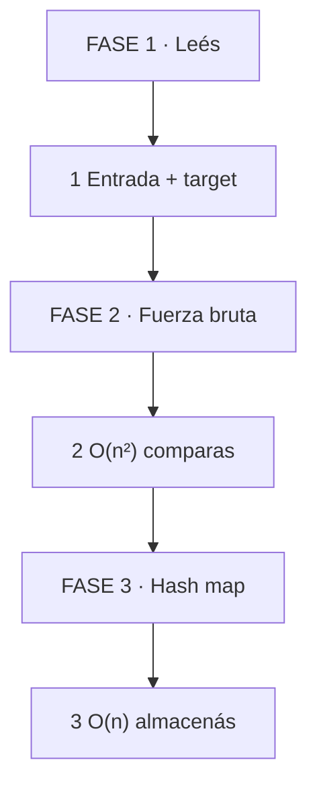
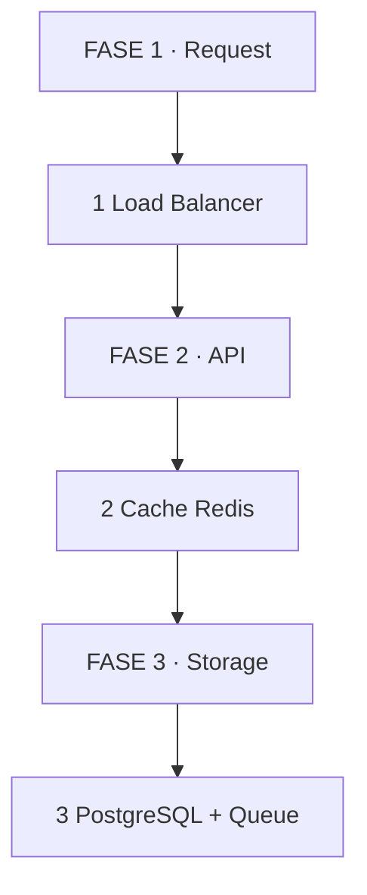
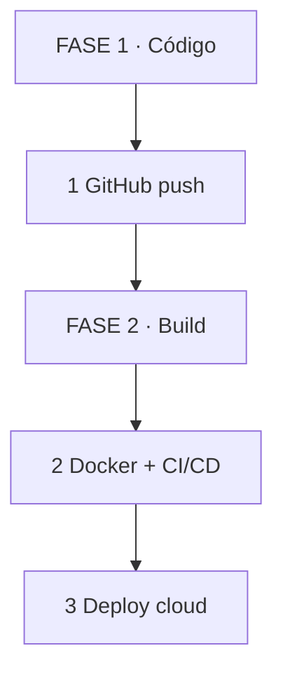
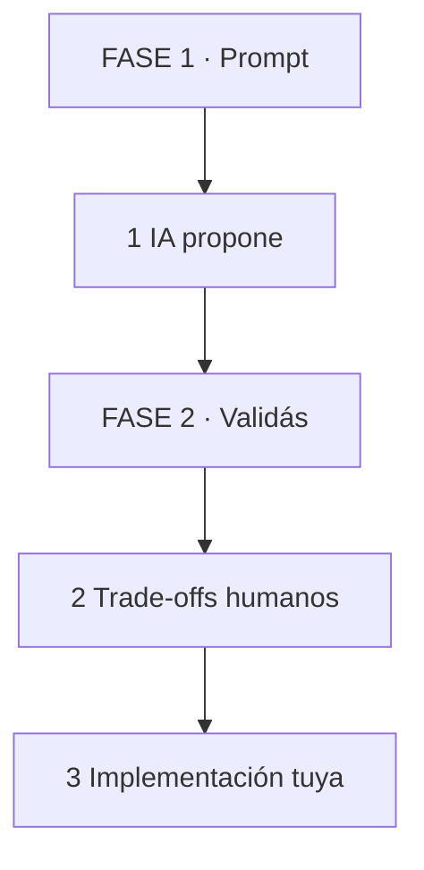
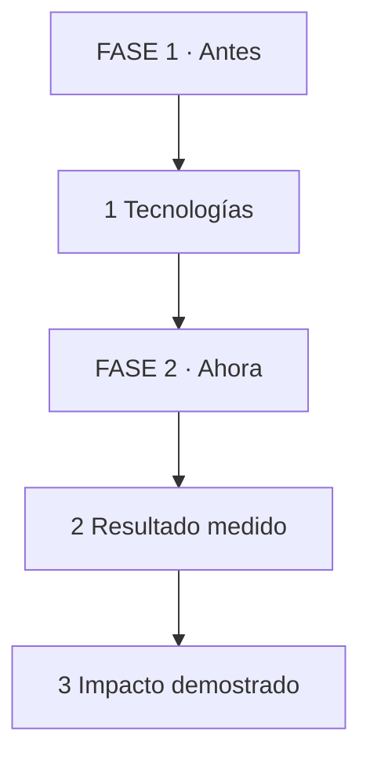
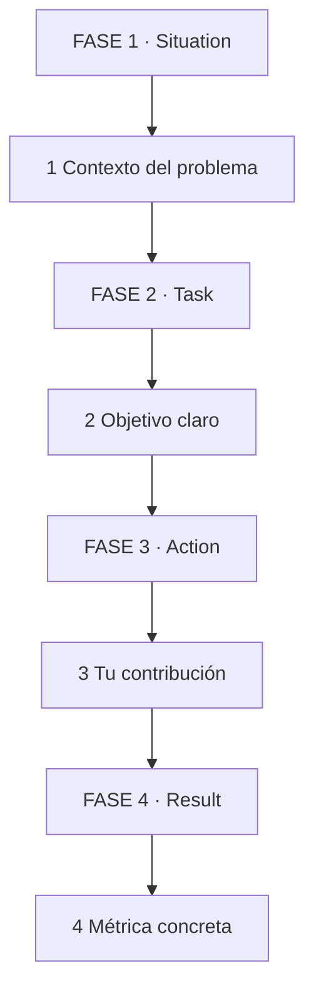

# 🚀 Guía Integral de Desarrollo Profesional en Ingeniería de Software 2026: De los Fundamentos a la Marca Personal

## INTRODUCCIÓN: EL MERCADO TECH EN 2026 🎯

El mercado tecnológico en 2026 premia ingenieros con bases sólidas, capacidad de diseño de sistemas y uso inteligente de IA. Ya no alcanza con saber un framework. Las empresas buscan profesionales que entiendan escalabilidad, tomen decisiones con trade-offs explícitos y demuestren impacto medible.

La clave es equilibrar tres pilares: **solidez técnica** (DSA + arquitectura), **productividad amplificada** (cloud + IA) y **estrategia profesional** (marca personal + inglés). Este artículo te guía paso a paso.

> **🎯 Objetivo** — Al final tendrás un plan de 12 semanas, 3 proyectos deployados, CV en formato XYZ y perfil listo para mercados internacionales.
> **⚠️ Advertencia** — No acumules conocimiento sin evidencia. El mercado contrata ejecución, no intención.

---

## 🧩 PARTE 1: FUNDAMENTOS — DSA Y DISEÑO DE SISTEMAS 🧩

### 1.1 ❓ PRETEST

¿Qué evalúan realmente las entrevistas técnicas cuando te dan un problema de algoritmos?

> Respuesta esperada: Evalúan razonamiento estructurado, capacidad de explicar trade-offs y comportamiento a escala (Big O), no solo si el código funciona.
> Si acertás: camino rápido → andá al punto 7.

### 1.2 🎯 POR QUÉ + LOGRO

Importa porque **DSA es el filtro más honesto del mercado**. Un candidato que explica "esto es O(n²) pero lo reduzco a O(n log n)" demuestra pensamiento estructural. Vas a lograr **resolver problemas en voz alta con claridad**.

### 1.3 ⚡ VICTORIA RÁPIDA (<5 min)

Elegí "Two Sum" en LeetCode. Escribí fuerza bruta O(n²) y luego versión con hash map O(n). Explicá la diferencia en 30 segundos. Esa es la base.

### 1.4 💡 CONCEPTO

Analogía: Big O es como **medir combustible de un viaje** — no importa si el auto es rápido, importa cuánto rinde cuando el viaje se hace largo.

Definición: Arrays, linked lists, hash maps, trees, graphs son estructuras. Sorting, searching, traversal son algoritmos. Patrones comunes: two pointers, sliding window, BFS/DFS, dynamic programming. La entrevista evalúa cómo pensás, no cuánto memorizaste.

### 1.5 👀 EJEMPLO RESUELTO

| Paso | Tú ves | Qué pasa dentro | Ejemplo |
|------|--------|-----------------|---------|
| 1 Leés | "Two Sum" | Input: array + target | `[2,7,11,15], target=9` |
| 2 Fuerza bruta | Loop anidado | O(n²) | Comparas cada par |
| 3 Optimizás | Hash map | O(n) | Almacenas complementos |

*Se lee de izquierda a derecha. Leés el problema, probás fuerza bruta, mejorás con estructura de datos.*

### 1.6 ⚠️ CONTRA-EJEMPLO / Error Típico

Error: Saltar a la solución óptima sin explicar la fuerza bruta. En entrevista, el proceso vale más que el resultado final.

Corrección: Mencioná la solución obvia, su complejidad, luego la mejora. "Primero haría dos loops O(n²). Pero puedo bajar a O(n) usando un hash map."

### 1.7 🧪 PRÁCTICA

Resolvé "Valid Parentheses" con stack. Explicá por qué es O(n) tiempo y O(n) espacio. Practicá en voz alta en menos de 2 minutos.

> Respuesta esperada / criterio: Stack para matching de apertura/cierre. Cada carácter se procesa una vez. Espacio máximo es profundidad de anidamiento.

### 1.8 🔁 RECALL — Nivel Bloom: Aplicar

¿Qué patrón usarías para encontrar el subarray con suma máxima? Mencionalo en 1 línea.

### 1.9 📌 IDEA CLAVE

La entrevista evalúa razonamiento, no memoria. Explicá fuerza bruta antes de optimizar.

### 1.10 ✅ AUTO-CHEQUEO + SIGUIENTE

- [ ] Resolví 5 problemas de arrays con two pointers o hash map
- [ ] Explico cada solución en voz alta con complejidad
- [ ] Identifico patrón de problema en menos de 30 segundos

Siguiente: Diseño de sistemas para arquitectura escalable.

---

## 🧩 PARTE 2: DISEÑO DE SISTEMAS — ARQUITECTURA ESCALABLE 🧩

### 2.1 ❓ PRETEST

¿Qué significa que un sistema sea altamente disponible?

> Respuesta esperada: Que permanece operativo la mayor parte del tiempo, típicamente medido como porcentaje (99.9% uptime). Se logra con redundancia, balanceo de carga y failover automático.
> Si acertás: camino rápido → andá al punto 7.

### 2.2 🎯 POR QUÉ + LOGRO

Importa porque **las empresas buscan ingenieros que piensen en sistemas, no solo en código**. Un backend que escala a 10K usuarios requiere decisiones de cache, particionamiento y mensajería. Vas a lograr **diseñar arquitecturas con trade-offs explícitos**.

### 2.3 ⚡ VICTORIA RÁPIDA (<5 min)

Dibujá Twitter/X en 3 componentes: frontend, API, base de datos. Agregá 1 capa de cache. Esa es la base de cualquier diseño.

### 2.4 💡 CONCEPTO

Analogía: Diseñar un sistema es como **planear una ciudad** — no alcanza con construir casas, necesitás rutas (API), servicios públicos (cache), correo (mensajería) y plantas de energía (bases de datos).

Definición: Escalabilidad = manejar mayor carga sin reescribir. Alta disponibilidad = resistencia a fallos. Trade-offs: consistencia vs disponibilidad (CAP), latencia vs throughput, costo vs rendimiento. Componentes clave: load balancer, cache (Redis), message queue (RabbitMQ/Kafka), storage (SQL vs NoSQL), CDN.

### 2.5 👀 EJEMPLO RESUELTO

| Paso | Tú ves | Qué pasa dentro | Ejemplo |
|------|--------|-----------------|---------|
| 1 Requerimientos | 1M usuarios, 10K writes/seg | Capacidad + rendimiento | Define límites |
| 2 Storage | PostgreSQL + Redis | SQL para datos, cache para lecturas | Separación de concerns |
| 3 Mensajería | Queue para notificaciones | Async, desacoplado | No bloquea request |

*Se lee de izquierda a derecha. Request entra, se balancea, cachea lectura, persiste en DB.*

### 2.6 ⚠️ CONTRA-EJEMPLO / Error Típico

Error: Usar base de datos como cola de mensajes haciendo polling cada 5 segundos. Genera carga innecesaria y latencia.

Corrección: Usar message broker dedicado (RabbitMQ, Kafka, AWS SQS). Productor publica, consumidor procesa cuando puede.

### 2.7 🧪 PRÁCTICA

Diseñá un sistema de notificaciones para 500K usuarios. Definí storage, cache, mensajería y CDN. Escribí 3 trade-offs que aceptarías y por qué.

> Respuesta esperada / criterio: Propone separación de lecturas (cache) y escrituras (DB), mensajería async para notificaciones, CDN para assets estáticos. Menciona al menos 1 trade-off (consistencia eventual vs rendimiento).

### 2.8 🔁 RECALL — Nivel Bloom: Analizar

¿Por qué Redis no reemplaza a PostgreSQL? Mencionalo en 1 línea.

### 2.9 📌 IDEA CLAVE

Diseño de sistemas es elegir trade-offs, no buscar la solución perfecta.

### 2.10 ✅ AUTO-CHEQUEO + SIGUIENTE

- [ ] Resolví 2 problemas de system design en voz alta
- [ ] Sé explicar CAP theorem en 2 líneas
- [ ] Distinguí SQL, NoSQL, cache, queue, CDN y cuándo usar cada uno

Siguiente: Cloud computing y proyectos desplegables.

---

## 🧩 PARTE 3: CLOUD COMPUTING E INFRAESTRUCTURA PRÁCTICA 🧩

### 3.1 ❓ PRETEST

¿Qué diferencia hay entre IaaS, PaaS y SaaS?

> Respuesta esperada: IaaS da infraestructura virtual (servidores, redes). PaaS agrega plataforma gestionada (bases de datos, runtime). SaaS es software listo para usar (CRM, email).
> Si acertás: camino rápido → andá al punto 7.

### 3.2 🎯 POR QUÉ + LOGRO

Importa porque **el mercado premia ingenieros que deployean sin ayuda de DevOps**. Un proyecto propio en AWS demuestra capacidad operativa. Vas a lograr **desplegar 2-3 proyectos propios en la nube sin experiencia bancaria previa**.

### 3.3 ⚡ VICTORIA RÁPIDA (<5 min)

Creá cuenta gratuita de AWS. Lanzá instancia EC2 t2.micro. Conectate por SSH. Si entrás, ya tenés un servidor.

### 3.4 💡 CONCEPTO

Analogía: Cloud es como **alquilar una oficina amueblada** — no construís paredes ni instalás electricidad, solo entrás con tu computadora y trabajás. IaaS es la oficina vacía, PaaS es con recepcionista y Wi-Fi, SaaS es con empleados ya contratados.

Definición: AWS/GCP/Azure ofrecen servicios por necesidad: EC2 (servidores), S3 (objetos), RDS (bases managed), Lambda (serverless), CloudFront (CDN). Proyecto propio = perfil demostrable sin experiencia laboral previa en empresas grandes.

### 3.5 👀 EJEMPLO RESUELTO

| Paso | Tú ves | Qué pasa dentro | Ejemplo |
|------|--------|-----------------|---------|
| 1 Subís código | GitHub repo | CI/CD detecta cambios | GitHub Actions |
| 2 Build | Dockerfile | Imagen de contenedor | Node, Python, PHP |
| 3 Deploy | Render / Vercel / AWS | URL pública | Proyecto vivo |

*Se lee de izquierda a derecha. Código en Git, build automático, deploy en la nube.*

### 3.6 ⚠️ CONTRA-EJEMPLO / Error Típico

Error: Deployear un proyecto sin dominio ni HTTPS. Los recruiters ven "http://" y desconfían.

Corrección: Usá servicios con HTTPS automático (Render, Vercel, Fly.io). Si usás EC2, configurá Nginx + Let's Encrypt.

### 3.7 🧪 PRÁCTICA

Desplegá tu proyecto CRUD en Render o Fly.io. Configurá base de datos managed (Render PostgreSQL). Verificá que los datos persistan entre deploys.

> Respuesta esperada / criterio: URL HTTPS pública, base de datos managed conectada, migraciones ejecutadas en deploy, datos de prueba visibles.

### 3.8 🔁 RECALL — Nivel Bloom: Aplicar

¿Por qué un proyecto deployado vale más que 5 cursos terminados? Respondé en 1 línea.

### 3.9 📌 IDEA CLAVE

Un proyecto deployado es evidencia. Un curso terminado es intención. El mercado contrata evidencia.

### 3.10 ✅ AUTO-CHEQUEO + SIGUIENTE

- [ ] Proyecto 1 deployado con HTTPS
- [ ] Base de datos managed configurada
- [ ] CI/CD automático desde GitHub

Siguiente: IA como herramienta de productividad.

---

## 🧩 PARTE 4: INTEGRACIÓN AVANZADA DE INTELIGENCIA ARTIFICIAL 🧩

### 4.1 ❓ PRETEST

¿Qué diferencia hay entre usar IA para generar código y usarla para diseñar soluciones?

> Respuesta esperada: Generar código es pedir implementación directa. Diseñar soluciones es usar IA para explorar opciones, validar supuestos y producir especificaciones antes de escribir una línea.
> Si acertás: camino rápido → andá al punto 7.

### 4.2 🎯 POR QUÉ + LOGRO

Importa porque **el mercado distingue ingenieros que usan IA como copiloto de los que dependen de ella para pensar**. Un senior usa CLI, agents, skills y automatizaciones para multiplicar velocidad sin perder autonomía. Vas a lograr **integrar IA como herramienta, no como muleta**.

### 4.3 ⚡ VICTORIA RÁPIDA (<5 min)

Instalá Claude Code o similar. Pedí: "Diseñá una API REST para un blog con posts y comentarios, incluyendo endpoints, validaciones y modelo de datos." Revisá la respuesta y modificá 2 decisiones de diseño.

### 4.4 💡 CONCEPTO

Analogía: Usar IA es como **tener un ayudante junior que lee rápido pero no entiende el contexto del negocio**. Tu trabajo es revisar, corregir y decidir.

Definición: Integración de IA significa: CLI tools (Claude Code, Codex), agents especializados por dominio, skills reutilizables, automatizaciones de testing y documentación. Demostrar dominio técnico real implica explicar trade-offs, justificar arquitectura y producir código limpio sin dependencia del LLM.

### 4.5 👀 EJEMPLO RESUELTO

| Paso | Tú ves | Qué pasa dentro | Ejemplo |
|------|--------|-----------------|---------|
| 1 Prompts | "Diseñá schema + endpoints" | IA genera propuesta | Revisión humana |
| 2 Validás | "¿Y si 10K concurrentes?" | IA sugiere cache + cola | Decisión tuya |
| 3 Implementás | Escribís código core | IA ayuda en boilerplate | Arquitectura tuya |

*Se lee de izquierda a derecha. IA sugiere, humano decide, humano ejecuta lo importante.*

### 4.6 ⚠️ CONTRA-EJEMPLO / Error Típico

Error: Subir un proyecto a GitHub generado 100% por IA sin revisar. Un recruiter o technical lead detecta patrones repetitivos o errores sutiles.

Corrección: Usá IA para prototipar, pero escribí el código core, agregá tests, documentá decisiones. El repositorio debe mostrar tu criterio.

### 4.7 🧪 PRÁCTICA

Usá un agente de IA para generar el diseño de un sistema de colas de procesamiento. Luego escribí la configuración de Docker y el archivo de migración manualmente. Subí ambos a GitHub con un README que explica tus decisiones.

> Respuesta esperada / criterio: README explica trade-offs, código tiene estilo consistente, tests pasan, commit messages son descriptivos.

### 4.8 🔁 RECALL — Nivel Bloom: Evaluar

¿Cuándo NO usar IA en el flujo de desarrollo? Mencionalo en 1 línea.

### 4.9 📌 IDEA CLAVE

IA multiplica velocidad, no reemplaza criterio. Tu valor está en decidir, no en generar.

### 4.10 ✅ AUTO-CHEQUEO + SIGUIENTE

- [ ] Configuré al menos 1 skill o automatización con IA
- [ ] Tengo 1 proyecto donde IA fue辅助, no autor
- [ ] Puedo explicar cada decisión de arquitectura sin mencionar IA

Siguiente: Estrategia profesional y marca personal.

---

## 🧩 PARTE 5: ESTRATEGIA PROFESIONAL Y MARCA PERSONAL 🧩

### 5.1 ❓ PRETEST

¿Qué diferencia hay entre un CV orientado a tecnologías y uno orientado a resultados?

> Respuesta esperada: Orientado a resultados describe impacto cuantitativo: "Optimicé API reduciendo latencia 40%". Orientado a tecnologías lista herramientas: "Usé Laravel, Redis, Docker".
> Si acertás: camino rápido → andá al punto 7.

### 5.2 🎯 POR QUÉ + LOGRO

Importa porque **los recruiters filtran por impacto, no por herramientas**. Un CV que dice "Hice X para Y logrando Z" genera entrevistas. Vas a lograr **posicionarte como ingeniero que resuelve problemas, no como coleccionista de frameworks**.

### 5.3 ⚡ VICTORIA RÁPIDA (<5 min)

Abrí tu CV. Buscá la primera viñeta que diga "Usé X tecnología". Reescribila como "Usé X para resolver Y, logrando Z". Esa es la transformación.

### 5.4 💡 CONCEPTO

Analogía: Un CV orientado a tecnologías es como **un menú de restaurante** — lista ingredientes sin decir qué plato preparás. Un CV orientado a resultados es como **una reseña** — explica qué cocinaste, para quién y por qué fue memorable.

Definición: Marca personal es la percepción consistente de tu valor en el mercado. LinkedIn es tu escaparate. El CV es tu resumen ejecutivo. La versión en inglés abre mercados internacionales. La negociación salarial empieza por validar tu impacto con datos.

### 5.5 👀 EJEMPLO RESUELTO

| Paso | Tú ves | Qué pasa dentro | Ejemplo |
|------|--------|-----------------|---------|
| 1 Antes | "Usé Laravel y Redis" | Lista tecnologías | Sin impacto |
| 2 Ahora | "Optimicé API con cache, reduciendo latencia 40%" | Resultado medido | Contratable |
| 3 Métrica | "Soporte 10K usuarios concurrentes" | Escala demostrada | Senior implícito |

*Se lee de izquierda a derecha. De lista de herramientas a demostración de valor.*

### 5.6 ⚠️ CONTRA-EJEMPLO / Error Típico

Error: Poner "Experiencia en AWS" sin contexto. AWS es una herramienta, no un resultado.

Corrección: "Diseñé arquitectura serverless en AWS soportando 500K requests/mes con costo 60% menor que EC2." Ahí sí hay historia.

### 5.7 🧪 PRÁCTICA

Tomá 3 viñetas de tu CV actual. Reescribilas en formato XYZ: Acción + Contexto + Métrica. Luego creá una versión corta de LinkedIn (3 líneas) con el mismo formato.

> Respuesta esperada / criterio: Cada viñeta tiene acción, contexto y métrica. LinkedIn empieza con resultado, no con "Soy desarrollador".

### 5.8 🔁 RECALL — Nivel Bloom: Aplicar

¿Por qué "lideré equipo de 5" es menos poderoso que "entregamos producto en 3 meses reduciendo deuda técnica 30%"? Explicá en 1 línea.

### 5.9 📌 IDEA CLAVE

Resultados con números contratan. Tecnologías listan. El mercado paga por impacto.

### 5.10 ✅ AUTO-CHEQUEO + SIGUIENTE

- [ ] Reescribí 3 viñetas de CV en formato XYZ
- [ ] Creé versión LinkedIn en inglés y español
- [ ] Preparé 2 ejemplos STAR para entrevistas conductuales

Siguiente: Inglés técnico y negociación.

---

## 🧩 PARTE 6: INGLÉS Y NEGOCIACIÓN — PERFIL INTERNACIONAL 🧩

### 6.1 ❓ PRETEST

¿Qué es el método STAR para entrevistas conductuales?

> Respuesta esperada: Situation, Task, Action, Result. Estructura para contar experiencias pasadas con contexto, acción personal y resultado medido.
> Si acertás: camino rápido → andá al punto 7.

### 6.2 🎯 POR QUÉ + LOGRO

Importa porque **las empresas globales entrevistan en inglés y evalúan comunicación tanto como código**. Un ingeniero que explica arquitectura en inglés con claridad duplica sus oportunidades. Vas a lograr **presentar tu experiencia en inglés sin perder precisión técnica**.

### 6.3 ⚡ VICTORIA RÁPIDA (<5 min)

Escribí 1 párrafo STAR sobre un proyecto reciente. Traducilo al inglés manteniendo métricas. Esa es la base de tu respuesta en entrevistas internacionales.

### 6.4 💡 CONCEPTO

Analogía: El inglés técnico es como **un traductor simultáneo** — no necesitás ser Shakespeare, necesitás transmitir exactamente qué hiciste, con quién y qué pasó.

Definición: Entrevista técnica en inglés evalúa: resolución de problemas en voz alta, explicación de arquitectura, trade-offs. Entrevista conductual evalúa: colaboración, liderazgo, manejo de conflictos. Negociación salarial empieza por validar mercado (Glassdoor, Levels.fyi) y tu valor único.

### 6.5 👀 EJEMPLO RESUELTO

| Paso | Tú ves | Qué pasa dentro | Ejemplo |
|------|--------|-----------------|---------|
| 1 Situation | "El API caía en picos" | Contexto | 500 errors en 20% requests |
| 2 Task | "Debíamos reducir latencia" | Objetivo | <200ms p95 |
| 3 Action | "Implementé cache + cola" | Tu rol | Redis + RabbitMQ |
| 4 Result | "Latencia bajó a 80ms" | Métrica | 500K usuarios estables |

*Se lee de izquierda a derecha. Contás historia completa con situación, tarea, acción y resultado.*

### 6.6 ⚠️ CONTRA-EJEMPLO / Error Típico

Error: Decir "I worked on a team" sin especificar tu rol real. El entrevistador busca accountability, no participación vaga.

Corrección: "I led the API redesign, reducing p95 latency from 300ms to 80ms." Ahí hay responsabilidad y resultado.

### 6.7 🧪 PRÁCTICA

Escribí 3 respuestas STAR en inglés sobre proyectos reales. Grabate decidiéndolas en voz alta. Duración máxima 2 minutos cada una. Enfocate en tu acción personal, no en "nosotros".

> Respuesta esperada / criterio: Cada historia tiene contexto, acción específica tuya, y métrica. Sin jerga innecesaria, con términos técnicos correctos.

### 6.8 🔁 RECALL — Nivel Bloom: Aplicar

¿Por qué negociar salario al final del proceso es mejor que al principio? Respondé en 1 línea.

### 6.9 📌 IDEA CLAVE

Inglés técnico claro + métricas concretas = acceso global.

### 6.10 ✅ AUTO-CHEQUEO + SIGUIENTE

- [ ] 3 historias STAR en inglés grabadas
- [ ] Preparé respuesta a "¿por qué te cambias?" en 2 versiones
- [ ] Investigué rango salarial en Levels.fyi o Glassdoor

Siguiente: Plan 12 semanas semana a semana.

---

## 🧩 PARTE 7: PLAN 12 SEMANAS — HOJA DE RUTA 🧩

### 7.1 ❓ PRETEST

¿Qué es un proyecto demostrable y por qué es más valioso que un certificado?

> Respuesta esperada: Un proyecto demostrable es código deployado con funcionalidad real, accesible por URL, con documentación. Es más valioso porque evidencia ejecución, no solo estudio teórico.
> Si acertás: camino rápido → andá al punto 7.

### 7.2 🎯 POR QUÉ + LOGRO

Importa porque **3 meses de estudio sin entregables no generan cambios en tu perfil**. Un plan estructurado con proyectos semanales produce evidencia tangible. Vas a lograr **completar 3 proyectos deployados, 50 problemas DSA y un perfil listo para aplicar**.

### 7.3 ⚡ VICTORIA RÁPIDA (<5 min)

Elegí 1 proyecto para este mes. Escribí su nombre y la URL donde vivirá. Eso ya es más que el 90% de los que "van a empezar".

### 7.4 💡 CONCEPTO

Analogía: Un plan de estudio es como **un menú semanal** — si cocinás sin plan, terminás pidiendo delivery. Con plan, comés variado y nutritivo cada día.

Definición: El plan de 12 semanas se divide en 3 bloques de 4 semanas. Cada semana tiene 1 foco técnico, 1 proyecto incremental y 1 habilidad profesional. DSA es diario (30 min). Diseño de sistemas es semanal (2 hs). Cloud es práctico (deploy semanal). Marca personal es continua (30 min).

### 7.5 👀 EJEMPLO RESUELTO

| Semana | Foco técnico | Proyecto | Profesional |
|--------|--------------|----------|-------------|
| 1 | Arrays + hash maps | Setup repo | CV v1 XYZ |
| 2 | Linked lists + stacks | CRUD API | LinkedIn es/en |
| 3 | Trees + BFS | Autenticación JWT | 2 historias STAR |
| 4 | Graphs + DFS | Tests + deploy | Post en blog/redes |

### 7.6 ⚠️ CONTRA-EJEMPLO / Error Típico

Error: Cambiar de proyecto cada semana sin terminar ninguno. 4 proyectos a medio hacer valen menos que 1 completo y deployado.

Corrección: Definí alcance real por semana. Proyecto 1 en semanas 1-4, proyecto 2 en semanas 5-8, proyecto 3 en semanas 9-12. Cada uno con deploy y README.

### 7.7 🧪 PRÁCTICA

Diseñá tu plan de las primeras 4 semanas. Definí: 1 foco DSA, 1 feature de proyecto, 1 tarea profesional. Escribilo en un documento compartible (Notion, Markdown).

> Respuesta esperada / criterio: Cada semana tiene exactamente 1 foco técnico, 1 feature, 1 tarea profesional. Proyecto tiene nombre, URL objetivo y stack definido.

### 7.8 🔁 RECALL — Nivel Bloom: Crear

Armá el plan de semanas 5-8 con foco en cloud y diseño de sistemas.

### 7.9 📌 IDEA CLAVE

Consistencia > intensidad. 1 hora diaria sostenida genera más que 8 horas un domingo.

### 7.10 ✅ AUTO-CHEQUEO + SIGUIENTE

- [ ] Plan de 12 semanas documentado
- [ ] 1 proyecto definido con alcance realista
- [ ] CV y LinkedIn en formato XYZ revisados

---

## 📝 PREGUNTAS DE VERIFICACIÓN

1. **Aplica**: Elegí 1 problema de LeetCode de arrays. Explicá la solución fuerza bruta, su complejidad y la optimizada con hash map.
2. **Analiza**: ¿Por qué Redis no reemplaza a PostgreSQL? Mencioná 2 diferencias arquitectónicas.
3. **Diseña**: Arquitectura para un sistema de notificaciones push a 500K usuarios. Definí storage, cache, mensajería y CDN.
4. **Reflexiona**: ¿Por qué un proyecto deployado vale más que 5 cursos terminados?
5. **Evalúa**: Tu CV actual tiene 3 viñetas orientadas a tecnologías. Reescribilas en formato XYZ.
6. **Conecta**: ¿Cómo usas IA para diseñar una API sin dejar que IA escriba el código core?
7. **Propón**: Plan de 4 semanas para preparar entrevistas en inglés con 3 historias STAR.
8. **Síntesis**: Explicá cómo se conectan DSA, diseño de sistemas, cloud y marca personal en una búsqueda laboral exitosa.

---

## 📚 GLOSARIO — CONCEPTOS PRINCIPALES

| Término | Definición en 1 línea |
|---------|-----------------------|
| **Big O** | Notación que mide crecimiento de algoritmo según entrada |
| **Hash Map** | Estructura clave-valor con acceso O(1) promedio |
| **Diseño de sistemas** | Proceso de definir arquitectura, componentes y trade-offs |
| **Escalabilidad** | Capacidad de manejar mayor carga sin reescribir |
| **Alta disponibilidad** | Sistema que permanece operativo la mayor parte del tiempo |
| **Load Balancer** | Distribuye tráfico entre servidores |
| **Cache** | Almacenamiento temporal para lecturas frecuentes |
| **Message Queue** | Cola de mensajes para procesamiento asincrónico |
| **IaaS / PaaS / SaaS** | Infraestructura / Plataforma / Software como servicio |
| **Serverless** | Ejecución de código sin gestionar servidores |
| **CI/CD** | Integración y despliegue continuos |
| **STAR** | Situation, Task, Action, Result para entrevistas conductuales |
| **Marca personal** | Percepción consistente de tu valor profesional |
| **Proyecto demostrable** | Código deployado con URL pública y documentación |
| **XYZ** | Acción + Contexto + Métrica para CV orientado a resultados |
| **CAP theorem** | Consistencia, Disponibilidad, Partición: elige 2 de 3 |
| **N+1** | Problema de consultas repetidas en un loop |
| **SoftDeletes** | Borrado lógico que marca deleted_at sin eliminar la fila |
| **Policy** | Clase que centraliza reglas de autorización por modelo |
