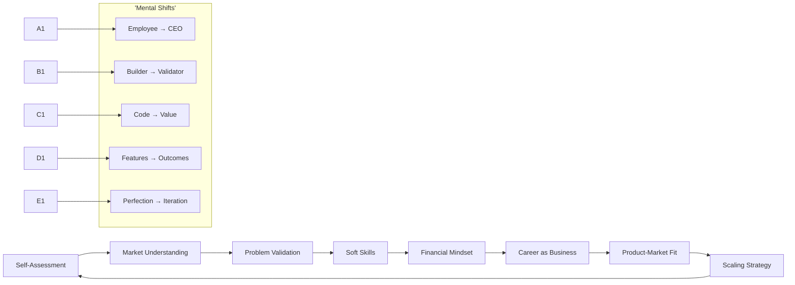
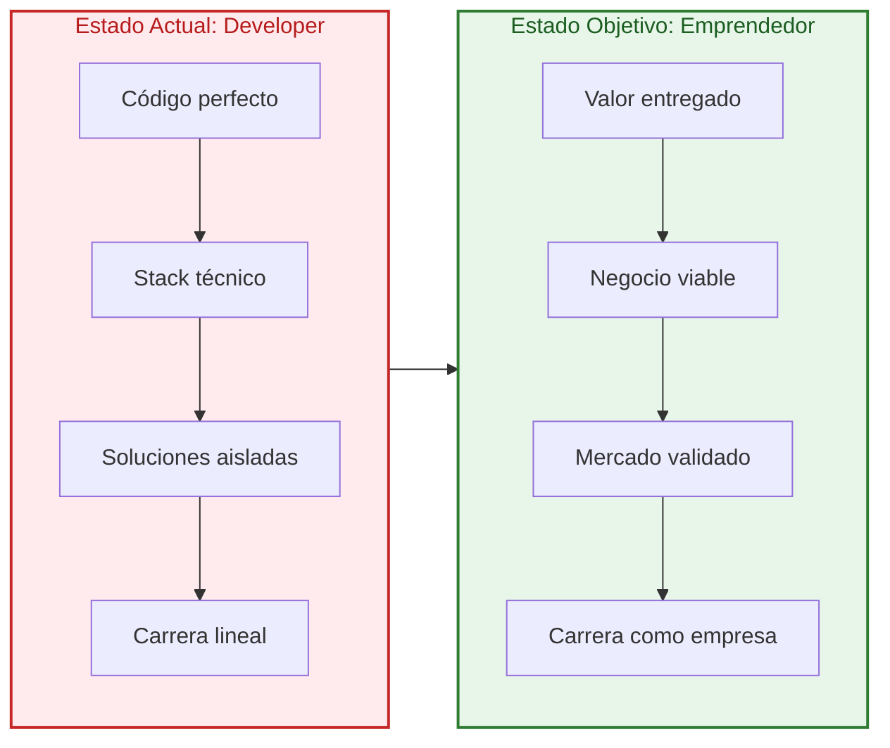
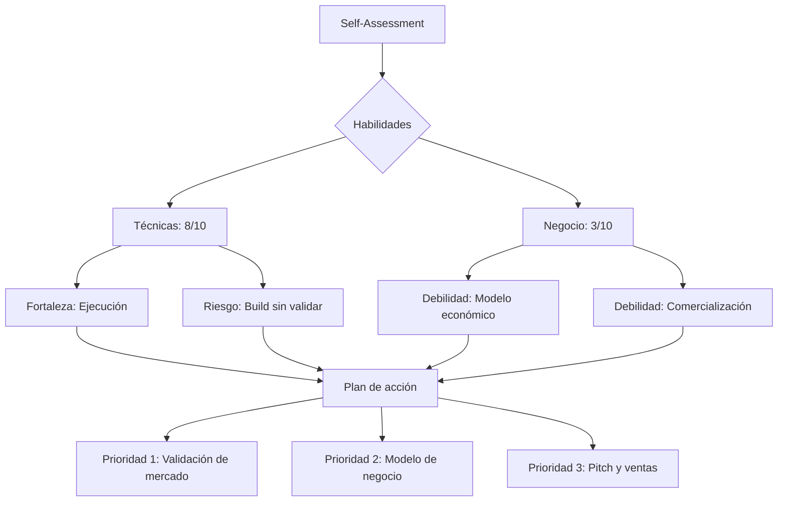
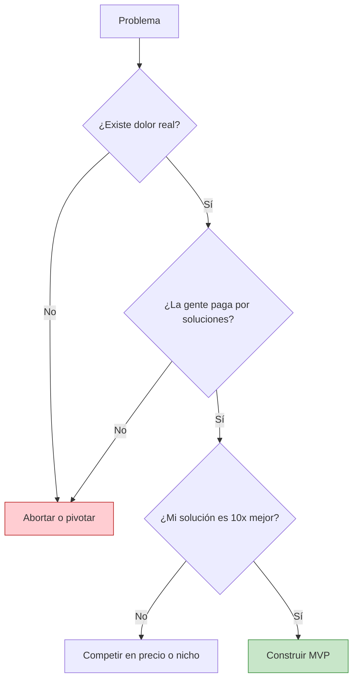
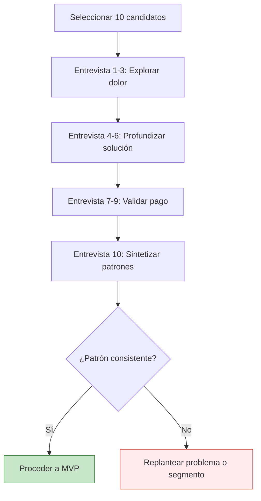
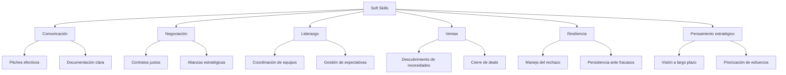
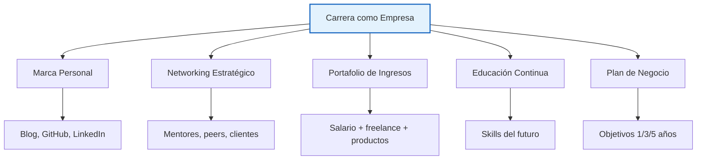
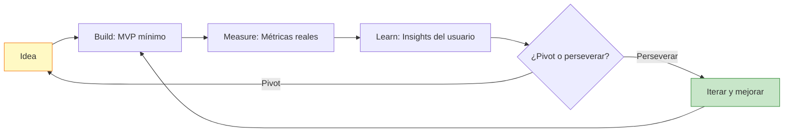
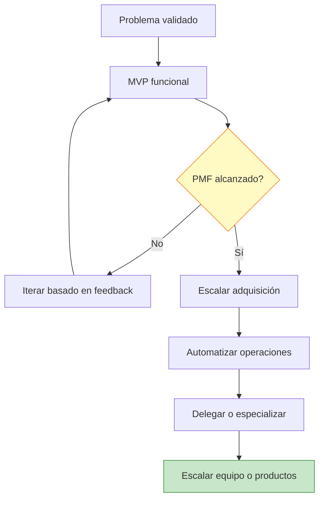

# 🚀 MASTERCLASS: De Desarrollador a Emprendedor - Mentalidad de Negocio para Developers

## INTRODUCCIÓN: POR QUÉ ESTE MASTERCLASS CAMBIA LAS REGLAS DEL JUEGO

El desarrollador promedio pasa años perfeccionando código, frameworks y arquitectura. Domina lenguajes, testing, CI/CD y optimización. Pero cuando decide lanzar un producto, crear una empresa o simplemente escalar su carrera como profesional independiente, descubre que el código es solo el 10% del juego.

El otro 90% es negocio.

Este masterclass propone un cambio de paradigma: **dejar de pensar como implementador para empezar a pensar como fundador**. No se trata de abandonar la técnica. Se trata de complementarla con una caja de herramientas que la mayoría de los developers ignoran hasta que es demasiado tarde.

> **Objetivo de Aprendizaje** — Al final de esta guía, podrás evaluar una idea de negocio desde la perspectiva del mercado, validar hipótesis antes de construir, desarrollar habilidades blandas esenciales y construir una carrera que funcione como una empresa, no como un puesto de trabajo.

> **Advertencia educativa** — Este contenido es formativo. Las recomendaciones de libros y estrategias no constituyen asesoramiento financiero ni empresarial. Cada contexto es único.

---

## 🗺️ MAPA DEL MINDSET



| Fase | Pregunta que responde | Output principal |
|------|-----------------------|------------------|
| **Self-Assessment** | ¿Cuál es mi ventaja competitiva real? | Perfil de habilidades y recursos |
| **Market Understanding** | ¿Qué necesita el mercado realmente? | Segmentación y dolor real |
| **Problem Validation** | ¿La gente pagaría por esto? | Evidencia de demanda |
| **Soft Skills** | ¿Puedo comunicar, negociar y liderar? | Habilidades blandas desarrolladas |
| **Financial Mindset** | ¿Cómo funciona el dinero en un negocio? | Modelo económico viable |
| **Career as Business** | ¿Mi carrera es un empleo o una empresa? | Plan de carrera estratégico |
| **Product-Market Fit** | ¿El producto resuelve un problema real? | Iteración basada en feedback |
| **Scaling Strategy** | ¿Cómo crecer sin perder control? | Plan de escalamiento |

---



---

## 🎯 PARTE 1: SELF-ASSESSMENT — CONOCETE ANTES DE TRANSFORMARTE

### 🧠 1.1 El sesgo del superviviente en tecnología

El developer promedio mira a los fundadores exitosos y cree que el secreto es el código. No lo es. El código es commodity. Lo que diferencia a un proyecto que escala de uno que muere en GitHub es la capacidad de entender el mercado, iterar rápido y construir algo que la gente quiera pagar.

El primer paso es un diagnóstico honesto de tus recursos actuales.

### ⭐ 1.2 Tu ventaja injusta (Unfair Advantage)

Según *The Unfair Advantage*, cada persona tiene combinaciones únicas de recursos, habilidades, experiencias y redes que los competidores no pueden replicar fácilmente. Para un developer, estas ventajas pueden ser:

| Ventaja | Ejemplo práctico | Cómo monetizarla |
|---------|-----------------|-----------------|
| **Técnica profunda** | Dominio de IA, blockchain, sistemas distribuidos | Consultoría premium, productos técnicos |
| **Red de pares** | 5 años en la industria, contactos en múltiples empresas | Referidos, partnerships, early adopters |
| **Velocidad de ejecución** | Puedes prototipar en semanas lo que otros tardan meses | MVP rápido, validación barata |
| **Credibilidad técnica** | Blog, open source, charlas en conferencias | Audiencia, confianza, autoridad |
| **Problema vivido** | Sufriste X problema y lo solucionaste para ti | Producto para tu mismo pain point |
| **Acceso a datos** | Trabajas en industria con datos valiosos | Insights, análisis, productos data-driven |

### 📊 1.3 Auditoría de habilidades técnicas vs de negocio



### 📝 1.4 Ejercicio: Matriz de recursos personales

| Recurso | Nivel actual (1-10) | Potencial (1-10) | Acción para cerrar la brecha |
|---------|---------------------|------------------|------------------------------|
| Código | | | |
| Diseño de producto | | | |
| Entendimiento del mercado | | | |
| Red de contactos | | | |
| Capital inicial | | | |
| Tiempo disponible | | | |
| Habilidades de venta | | | |
| Resiliencia ante el rechazo | | | |

---

## 🌍 PARTE 2: MARKET UNDERSTANDING — EL MERCADO NO ES TU OPINIÓN

### 🚨 2.1 El error número uno: construir en el vacío

*The Lean Startup* enfatiza que la causa principal del fracaso de startups no es la tecnología, sino construir algo que nadie quiere pagar. Eric Ries describe el ciclo Build-Measure-Learn como un motor de iteración, no como una secuencia one-shot.

El developer emprendedor tiende a saltar directo a Build. El emprendedor inteligente empieza por Learn.

### 🎧 2.2 Cómo escuchar el mercado (sin sesgos)

| Técnica | Qué mide | Cómo aplicarla siendo developer |
|---------|----------|--------------------------------|
| **Entrevistas de problema** | Dolor real | Habla con 10 potenciales usuarios ANTES de escribir código |
| **Análisis de competencia** | Espacio de soluciones | Estudia qué falla en productos existentes, no solo sus features |
| **Búsqueda orgánica** | Demanda explícita | Google Trends, Reddit, foros: ¿la gente busca esto activamente? |
| **Pre-venta o waitlist** | Intención de compra | Landing page con precio y botón de compra antes de desarrollar |
| **Fake door testing** | Interés real | Mide clics en un botón que no existe todavía |

### 🔍 2.3 El framework de validación en tres capas



### 📚 2.4 Lecturas clave y su aplicación práctica

| Libro | Concepto clave | Aplicación para developers |
|-------|---------------|----------------------------|
| **The Lean Startup** | Build-Measure-Learn | No construyas features. Construye experimentos medibles. |
| **How to F*ck Up Your Startup** | Sesgo del superviviente | Estudia fracasos, no solo éxitos. Identifica patrones de muerte. |
| **The Unfair Advantage** | Ventajas únicas | Mapea tu contexto específico: ¿qué tienes que otros no? |

---

## ✅ PARTE 3: PROBLEM VALIDATION — VALIDA ANTES DE CODIFICAR

### 🎯 3.1 La regla del problema primero

El developer tiende a enamorarse de soluciones. El emprendedor exitoso se obsesiona con problemas. La diferencia:

- **Developer**: "Voy a construir un SaaS con AI para X"
- **Emprendedor**: "Estoy validando que X personas pagarían dinero por resolver Y problema"

### 🧪 3.2 Técnicas de validación sin código

| Técnica | Costo | Tiempo | Señal de validación |
|---------|-------|--------|---------------------|
| **Entrevistas 1:1** | $0 | 1 semana | El usuario describe el dolor espontáneamente |
| **Landing page + botón** | $0-50 | 3 días | CTR > 2% en botón de "comprar" |
| **Waitlist con incentivo** | $0 | 1 semana | >100 emails cualificados |
| **Pre-venta** | $0 | 2 semanas | Alguien paga antes de que exista el producto |
| **Prototipo en Figma/Mockup** | $0 | 3 días | Usuarios interactúan y piden acceso |

### 💻 3.3 Código: Landing page de validación minimalista

```html
<!DOCTYPE html>
<html lang="es">
<head>
    <meta charset="UTF-8">
    <meta name="viewport" content="width=device-width, initial-scale=1.0">
    <title>[Tu Producto] - Resuelve [Dolor Específico]</title>
    <style>
        * { margin: 0; padding: 0; box-sizing: border-box; }
        body { font-family: -apple-system, BlinkMacSystemFont, 'Segoe UI', sans-serif; line-height: 1.6; }
        .hero { max-width: 600px; margin: 0 auto; padding: 60px 20px; text-align: center; }
        h1 { font-size: 2.5rem; margin-bottom: 1rem; color: #1a1a1a; }
        .subtitle { font-size: 1.25rem; color: #666; margin-bottom: 2rem; }
        .cta-button { 
            display: inline-block; 
            padding: 15px 40px; 
            background: #2563eb; 
            color: white; 
            text-decoration: none; 
            border-radius: 8px; 
            font-weight: 600;
            font-size: 1.1rem;
        }
        .cta-button:hover { background: #1d4ed8; }
        .social-proof { 
            margin-top: 3rem; 
            padding-top: 2rem; 
            border-top: 1px solid #e5e7eb; 
            color: #888; 
            font-size: 0.9rem; 
        }
    </style>
</head>
<body>
    <div class="hero">
        <h1>Deja de [dolor específico]</h1>
        <p class="subtitle">La primera herramienta que [promesa específica y medible]</p>
        <a href="#waitlist" class="cta-button">Quiero acceso anticipado</a>
        <div class="social-proof">
            <p>✓ Únete a los primeros 100 en acceder</p>
            <p>✓ Sin spam, solo actualizaciones del producto</p>
        </div>
    </div>
</body>
</html>
```

### 📈 3.4 Métricas de validación temprana

| Métrica | Benchmark | Interpretación |
|---------|-----------|----------------|
| **Tasa de clic en CTA** | > 2% | Interés inicial suficiente |
| **Tasa de completado de formulario** | > 5% | Dolor lo suficientemente fuerte |
| **Respuesta a email de seguimiento** | > 20% | Audiencia comprometida |
| **Intención de pago declarada** | > 10% | Validación de modelo económico |
| **Pre-ventas** | Cualquier cantidad | Validación máxima: dinero real |

### 🎤 3.5 El framework de las 10 entrevistas



**Regla de oro:** No preguntes "¿Te gustaría X?". Pregunta "Cuéntame la última vez que hiciste Y" o "¿Cuánto te cuesta actualmente este problema?".

---

## 💬 PARTE 4: SOFT SKILLS — LAS HABILIDADES QUE ABREN PUERTAS

### 🤝 4.1 Por qué los developers subestiman las soft skills

El developer promedio cree que el código habla por sí mismo. En un equipo pequeño o en una carrera independiente, esto es falso. Las habilidades blandas determinan:

- Si puedes vender tu idea
- Si puedes liderar un equipo
- Si puedes negociar un trato justo
- Si puedes comunicar valor a clientes
- Si puedes escalar más allá de tu propio tiempo

### 🌟 4.2 Las 6 soft skills esenciales para developer-emprendedores



### 🗣️ 4.3 Desarrollo de comunicación: de código a narrativa

| Nivel | Característica | Ejemplo |
|-------|---------------|---------|
| **Principiante** | Explica features y tecnología | "Usamos React y GraphQL porque son modernos" |
| **Intermedio** | Explica beneficios técnicos | "La arquitectura reduce latencia en un 40%" |
| **Avanzado** | Explica outcomes de negocio | "Esto significa que el cliente retiene 15% más usuarios" |
| **Experto** | Cuenta una historia | "El problema era X. Lo resolvimos con Y. Ahora Z pasa." |

### 📖 4.4 Libros recomendados y su aplicación

| Libro | Autor | Habilidad que desarrolla | Ejercicio clave |
|-------|-------|--------------------------|-----------------|
| **How to Present to Absolutely Anyone** | [Autor] | Presentaciones y pitches | Graba un pitch de 3 minutos de tu producto |
| **Win Every Argument** | Mehdi Hasan | Argumentación y persuasión | Debate un problema técnico desde perspectiva de negocio |
| **Soft Skills: The Software Developer's Life Manual** | John Sonmez | Carrera como negocio | Trata tu carrera como una empresa: define misión, clientes, revenue |

### 🎯 4.5 Ejercicio: Tu pitch de 30 segundos

**Antes:**
> "Soy desarrollador full-stack, trabajo con Node.js, React y PostgreSQL."

**Después:**
> "Ayudo a [segmento] a resolver [problema específico] mediante [tu enfoque único], logrando [resultado medible]."

**Plantilla:**
```
Yo ayudo a [QUIÉN] a [QUÉ NECESIDAD] 
mediante [TU ENFOQUE ÚNICO], 
para que [RESULTADO MEDIBLE].
```

---

## 💰 PARTE 5: FINANCIAL MINDSET — EL DINERO NO ES UN TABÚ

### ⚠️ 5.1 La relación tóxica developer-dinero

Muchos developers tienen una relación conflictiva con el dinero: lo ven como un subproducto del código, no como el resultado de valor entregado. Esta mentalidad limita:

- Capacidad de negociar salarios
- Habilidad para fijar precios en proyectos freelance
- Comprensión de unit economics en productos propios
- Visión de largo plazo en inversiones y ahorro

### 💡 5.2 Conceptos financieros básicos para developers

| Concepto | Definición simple | Por qué te importa |
|-----------|------------------|-------------------|
| **Unit Economics** | Ganancia por unidad vendida | Si tu SaaS cuesta $10 construir y vendes a $5, no hay negocio |
| **CAC (Customer Acquisition Cost)** | Cuánto cuesta conseguir un cliente | Si gastas $50 en marketing por un cliente que paga $30, pierdes dinero |
| **LTV (Lifetime Value)** | Valor total del cliente en el tiempo | Un cliente que paga $10/mes por 3 años vale $360 |
| **Burn Rate** | Cuánto gastas por mes sin ingresos | Define tu runway: meses que puedes sobrevivir |
| **Runway** | Meses hasta que se acaba el dinero | Si gastas $5k/mes y tienes $50k, tu runway es 10 meses |

### 🧮 5.3 Calculadora de viabilidad económica

```python
def calculate_unit_economics(
    price_per_unit: float,
    cost_per_unit: float,
    customer_lifetime_months: float,
    acquisition_cost: float
) -> dict:
    """Calcula métricas básicas de viabilidad económica."""
    
    margin_per_unit = price_per_unit - cost_per_unit
    margin_percentage = (margin_per_unit / price_per_unit) * 100 if price_per_unit > 0 else 0
    ltv = margin_per_unit * customer_lifetime_months
    ltv_cac_ratio = ltv / acquisition_cost if acquisition_cost > 0 else 0
    
    return {
        'margin_per_unit': round(margin_per_unit, 2),
        'margin_percentage': round(margin_percentage, 2),
        'ltv': round(ltv, 2),
        'acquisition_cost': acquisition_cost,
        'ltv_cac_ratio': round(ltv_cac_ratio, 2),
        'viable': ltv_cac_ratio > 3 and margin_percentage > 30
    }

# Ejemplo de uso
result = calculate_unit_economics(
    price_per_unit=49.99,
    cost_per_unit=5.00,  # Hosting, APIs, soporte
    customer_lifetime_months=24,
    acquisition_cost=20.00
)

print(f"Margen: ${result['margin_per_unit']} ({result['margin_percentage']}%)")
print(f"LTV: ${result['ltv']}")
print(f"LTV/CAC: {result['ltv_cac_ratio']}")
print(f"¿Viable? {'Sí' if result['viable'] else 'No'}")
```

### 💵 5.4 Tabla de precios para servicios tecnológicos

| Tipo de servicio | Rango de precios | Factores que justifican el precio |
|-----------------|------------------|----------------------------------|
| **Desarrollo freelance básico** | $15-50/hora | Complejidad técnica, urgencia |
| **Consultoría especializada** | $100-300/hora | Experiencia específica, industria |
| **Auditoría de código** | $2,000-10,000 | Tamaño del proyecto, riesgo |
| **MVP de SaaS** | $5,000-50,000 | Features, plataformas, integraciones |
| **Mantenimiento mensual** | $500-3,000/mes | SLA, complejidad, disponibilidad |
| **Equipo dedicado** | $3,000-15,000/mes | Cantidad de desarrolladores, seniority |

---

## 🏢 PARTE 6: CAREER AS A BUSINESS — TU CARRERA ES TU EMPRESA

### 👔 6.1 De empleado a CEO de tu propia carrera

*Soft Skills: The Software Developer's Life Manual* argumenta que debes tratar tu carrera como un negocio del que eres el CEO. Esto significa:

- Tienes un producto (tus habilidades y servicios)
- Tienes clientes (empleadores, clientes freelance, usuarios)
- Tienes costos (tiempo, energía, educación)
- Tienes que generar ingresos (salario, ganancias, equity)

### 🏗️ 6.2 Los 5 pilares de la carrera-empresa



### 💎 6.3 Tipos de ingresos para developers

| Fuente | Característica | Potencial | Estabilidad |
|--------|---------------|-----------|-------------|
| **Empleo tiempo completo** | Ingreso predecible | Medio | Alta |
| **Freelance** | Ingreso variable | Alto | Baja-Media |
| **Consultoría** | Ingreso premium | Muy alto | Media |
| **Productos digitales** | Escalable | Muy alto | Baja al inicio |
| **SaaS / Micro-SaaS** | Recurrente | Ilimitado | Media |
| **Contenido / Educación** | Escalable | Medio-Alto | Media |
| **Inversiones** | Pasivo | Depende | Baja |

### 🎓 6.4 Educación y credenciales: el valor real

El video argumenta que títulos, bootcamps y certificaciones sirven principalmente para legitimación y diferenciación en el mercado, no solo para aprender skills técnicos.

| Credencial | Valor real | Mejor uso |
|------------|-----------|-----------|
| **Título universitario** | Filtro inicial, legitimidad | Primer empleo, migraciones |
| **Bootcamp** | Skill específico, portfolio | Cambio de carrera rápido |
| **Certificación** | Demostración de conocimiento | Validación de skills específicas |
| **Portfolio real** | Prueba de competencia | Siempre es el mejor filtro |
| **Reputación online** | Confianza y autoridad | Networking, clientes, oportunidades |

---

## 🎯 PARTE 7: PRODUCT-MARKET FIT — DE LA IDEA AL PRODUCTO REAL

### 🔄 7.1 El ciclo Build-Measure-Learn en la práctica



### 📊 7.2 Qué medir en cada etapa

| Etapa | Métrica principal | Métrica secundaria |
|-------|-------------------|-------------------|
| **Validación** | Tasa de interés (emails, pre-ventas) | Calidad de feedback |
| **MVP** | Tasa de activación | Retención día 1 |
| **Crecimiento** | Tasa de retención semanal | NPS (Net Promoter Score) |
| **Escala** | LTV/CAC ratio | Churn rate |

### 🚫 7.3 Errores comunes de developers emprendedores

| Error | Síntoma | Solución |
|-------|---------|----------|
| **Feature creep** | El producto crece sin dirección | Definir roadmap por problemas, no por ideas |
| **Perfeccionismo técnico** | Nunca se lanza | Lanzar con lo mínimo viable |
| **Ignorar el precio** | Nadie paga por el producto | Hablar de dinero desde el día 1 |
| **Construir para uno mismo** | No hay mercado más amplio | Validar con usuarios reales |
| **Competir en features** | Carrera armamentista técnica | Competir en outcomes y experiencia |

---

## 📈 PARTE 8: SCALING STRATEGY — CRECER SIN PERDER EL CONTROL

### 🚀 8.1 El funnel del emprendedor developer



### 🤝 8.2 Cuándo delegar y qué delegar

| Etapa | Qué hacer tú | Qué delegar |
|-------|-------------|-------------|
| **0-10 clientes** | Todo | Nada |
| **10-50 clientes** | Producto y strategy | Soporte básico, tareas repetitivas |
| **50-200 clientes** | Estrategia y ventas | Operaciones, soporte, desarrollo junior |
| **200+ clientes** | Visión y partnerships | Casi todo (con sistemas de control) |

### 🎨 8.3 La mentalidad de portfolio

No dependas de un solo ingreso, producto o cliente. El developer-emprendedor exitoso construye un portafolio:

- **Ingresos estables** (empleo o retainer)
- **Ingresos variables** (proyectos freelance)
- **Ingresos escalables** (productos, contenido)
- **Ingresos pasivos** (inversiones, licencias)

---

## APPEND1

## 🏋️ PARTE 9: I DO / WE DO / YOU DO — EJERCICIOS PROGRESIVOS

### 🎯 9.1 I Do — Tu pitch de 30 segundos

**Objetivo:** transformar tu descripción técnica en una propuesta de valor.

| Componente | Antes (técnico) | Después (negocio) |
|------------|-----------------|-------------------|
| **Quién** | "Soy desarrollador" | "Ayudo a [segmento específico]" |
| **Qué** | "Hago apps con React" | "Resuelvo [problema específico]" |
| **Cómo** | "Con código limpio" | "Mediante [tu enfoque único]" |
| **Resultado** | "Funciona bien" | "Logrando [resultado medible]" |

**Ejemplo completo:**

> Antes: "Soy desarrollador backend especializado en Node.js y bases de datos."
> 
> Después: "Ayudo a startups fintech a procesar pagos 10x más rápido mediante arquitecturas serverless, reduciendo su infraestructura en un 60%."

### 🤝 9.2 We Do — Validación de una idea de producto

**Escenario:** tienes una idea para un SaaS de gestión de proyectos para estudios de arquitectura.

| Paso | Acción | Resultado esperado |
|------|--------|--------------------|
| 1 | Listar 10 estudios de arquitectura para contactar | Base de entrevistas |
| 2 | Diseñar guía de entrevista (sin mencionar tu producto) | Dolor honesto del usuario |
| 3 | Realizar entrevistas | Patrones comunes identificados |
| 4 | Sintetizar hallazgos | Problema validado o no |
| 5 | Crear landing page con descripción del problema | Medir interés (CTR, emails) |
| 6 | Si hay interés, construir MVP | Prototipo funcional |

### 🛠️ 9.3 You Do — Construye tu matriz de recursos

**Tarea:** completa la matriz de habilidades y recursos, y define tu plan de 90 días.

| Categoría | Nivel actual | Meta a 90 días | Acción concreta |
|-----------|-------------|----------------|-----------------|
| Habilidades técnicas | | | |
| Entendimiento del mercado | | | |
| Red de contactos | | | |
| Marca personal | | | |
| Capacidad de venta | | | |
| Conocimientos financieros | | | |

### 9.4 I Do — Calcula tu valía como freelance

**Objetivo:** determinar precios justos y rentables.

| Factor | Valor |
|--------|-------|
| Salario anual deseado | $ |
| Días laborables al año | |
| Horas por día | |
| Horas facturables por día (60%) | |
| Costos operativos mensuales | $ |
| Margen de ganancia deseado (30%) | |

**Fórmula:** 
```
Precio mínimo por hora = (Salario anual / Horas facturables anuales) + (Costos anuales / Horas facturables anuales) * 1.3
```

### 9.5 We Do — Tu primer experimento Lean Startup

**Escenario:** quieres validar una herramienta de automatización para e-commerce.

| Paso | Acción | Métrica de éxito |
|------|--------|-----------------|
| 1 | Crear landing page con descripción del problema | |
| 2 | Agregar botón "Quiero probar" | CTR > 3% |
| 3 | Compartir en comunidades relevantes | 100 visitas en 3 días |
| 4 | Ofrecer early access a cambio de email | 20+ emails |
| 5 | Contactar a los interesados | 5 entrevistas |
| 6 | Preguntar si pagarían | Al menos 1 "sí" con monto concreto |

### 9.6 You Do — Diseña tu carrera como empresa

**Tarea:** crea un plan de carrera estratégico para los próximos 12 meses.

| Elemento | Tu respuesta |
|----------|-------------|
| **Misión personal** | ¿Qué problema quieres resolver con tu trabajo? |
| **Mercado objetivo** | ¿A quién sirves (empleadores, clientes, usuarios)? |
| **Propuesta de valor única** | ¿Qué te diferencia de otros developers? |
| **Fuentes de ingreso** | ¿De dónde viene tu dinero hoy? |
| **Metas de ingresos** | ¿Cuánto quieres ganar en 12 meses? |
| **Inversiones en skills** | ¿Qué vas a aprender este año? |
| **Networking targets** | ¿A quién necesitas conocer? |

---

## PARTE 10: MINDSET SHIFTS FINALES — LOS CAMBIOS QUE MARCAN LA DIFERENCIA

### 10.1 De employee a CEO

| Mentalidad Employee | Mentalidad CEO |
|---------------------|---------------|
| "Me pagan por horas" | "Genero valor que se transforma en ingresos" |
| "Espero que me den oportunidades" | "Creo mis propias oportunidades" |
| "Mi valor es mi código" | "Mi valor es el resultado de mi código" |
| "Especialista profundo" | "Especialista con visión amplia" |
| "Seguridad laboral" | "Opciones y portafolio" |

### 10.2 De builder a validator

| Mentalidad Builder | Mentalidad Validator |
|--------------------|---------------------|
| "Si lo construyo, vendrá" | "Si hay demanda, construyo" |
| "Las features son el producto" | "El outcome es el producto" |
| "Más código = más valor" | "Menos código, más validación = más valor" |
| "Optimizar antes de lanzar" | "Lanzar antes de optimizar" |
| "Perfecto o nada" | "Iterativo y medible" |

### 10.3 De código a valor

El código es solo un medio. El fin es el valor:

| Output técnico | Output de valor |
|---------------|----------------|
| 1000 líneas de código | Un usuario que ahorra 5 horas/semana |
| 5 microservicios | Un negocio que escala sin colapsar |
| Refactor completo | Un equipo que puede iterar 2x más rápido |
| Arquitectura elegante | Un producto que retiene clientes |
| Tests passing | Un producto confiable en producción |

---

## APPEND2

## PARTE 11: CHECKLIST DEL DESARROLLADOR-EMPRENDEDOR

### 11.1 Autoevaluación semanal

| Área | Pregunta de check |
|------|-------------------|
| **Mercado** | ¿Hablé con al menos 1 usuario potencial esta semana? |
| **Validación** | ¿Tengo evidencia de que alguien pagaría por esto? |
| **Producto** | ¿Estoy construyendo lo que realmente necesitan o lo que yo quiero? |
| **Finanzas** | ¿Conozco mi unit economics? |
| **Comunicación** | ¿Puedo explicar mi proyecto en 30 segundos a alguien no técnico? |
| **Red** | ¿Amplié mi red esta semana? ¿Ayudé a alguien sin esperar retorno? |
| **Skills** | ¿Aprendí algo no-técnico que aplico a mi negocio? |
| **Mentalidad** | ¿Tomé una decisión de negocio hoy, no solo técnica? |

### 11.2 Lecturas progresivas por nivel

| Nivel | Libro | Objetivo |
|-------|-------|----------|
| **Principiante** | The Lean Startup | Entender el ciclo Build-Measure-Learn |
| **Principiante** | How to F*ck Up Your Startup | Aprender de fracasos ajenos |
| **Intermedio** | The Unfair Advantage | Identificar tus ventajas únicas |
| **Intermedio** | Soft Skills: The Software Developer's Life Manual | Tratar tu carrera como negocio |
| **Avanzado** | Win Every Argument | Dominar la persuasión y el debate |
| **Avanzado** | How to Present to Absolutely Anyone | Comunicar ideas a cualquier audiencia |

---

## PARTE 12: PREGUNTAS DE VERIFICACIÓN

### Preguntas sobre Mentalidad

1. **Reflexiona:** ¿Cuál es tu "unfair advantage" como developer? ¿Cómo puedes monetizarla hoy?

2. **Analiza:** ¿En qué etapa del ciclo Build-Measure-Learn sueles empezar tú? ¿Por qué?

### Preguntas sobre Mercado

3. **Aplica:** Tienes una idea para un SaaS. Diseña una landing page de validación en 10 minutos. ¿Qué elementos incluirías?

4. **Critica:** Un developer dice "mi producto es mejor porque usa tecnología X". ¿Cómo lo refutarías desde la perspectiva del mercado?

### Preguntas sobre Soft Skills

5. **Practica:** Graba un pitch de 30 segundos de tu proyecto actual. Luego, reformúlalo para enfocarlo en el dolor del usuario, no en la tecnología.

6. **Evalúa:** ¿Cuál de las 6 soft skills del framework es tu punto más débil? ¿Qué acción concreta tomarás esta semana?

### Preguntas sobre Carrera

7. **Diseña:** Si tu carrera fuera una empresa, ¿cuál sería tu modelo de negocio? ¿Empleo, freelance, productos?

8. **Calcula:** Usando la calculadora de unit economics, ¿tu servicio actual es viable? ¿Qué cambiarías en tu modelo de precios?

### Preguntas Integradoras

9. **Sintetiza:** Explica cómo la validación de mercado, las soft skills y el mindset financiero se complementan para crear un developer-emprendedor exitoso.

10. **Plan de acción:** Define tu plan de 90 días para transitar de developer a emprendedor. Incluye al menos una acción de validación, una de soft skills y una de mindset financiero.

---

## GLOSARIO RÁPIDO

| Término | Definición |
|---------|------------|
| **MVP (Minimum Viable Product)** | Versión mínima del producto que permite validar una hipótesis |
| **Product-Market Fit** | Cuando el producto resuelve un problema real para un mercado real |
| **Unit Economics** | Rentabilidad por unidad vendida (precio - costo) |
| **LTV/CAC** | Ratio entre valor de vida del cliente y costo de adquisición |
| **Burn Rate** | Velocidad a la que una empresa gasta su capital |
| **Runway** | Tiempo de operación posible con el capital actual |
| **Pivot** | Cambio de dirección estratégica basado en aprendizaje |
| **Unfair Advantage** | Ventaja competitiva difícil de replicar |
| **Soft Skills** | Habilidades interpersonales y de comunicación |
| **Survivorship Bias** | Error de analizar solo los éxitos, ignorando los fracasos |

---

## ANEXO: FRAMEWORK DE DECISIONES PARA DEVELOPERS

### Matriz de priorización de proyectos

| Criterio | Peso | Tu proyecto |
|----------|------|-------------|
| Dolor real del usuario | 30% | |
| Tu ventaja injusta | 25% | |
| Viabilidad económica | 20% | |
| Tu capacidad de ejecución | 15% | |
| Timeline realista | 10% | |

**Regla:** No empieces un proyecto que no sume al menos 60 puntos en esta matriz.

### Checklist de lanzamiento mínimo

| Check | Estado |
|-------|--------|
| Problema validado con 10+ usuarios | ☐ |
| Precio definido y alguien dijo "sí" | ☐ |
| MVP con 1 feature core | ☐ |
| Métricas de éxito definidas | ☐ |
| Plan de comunicación a 100 personas | ☐ |
| Contingencia si falla | ☐ |
