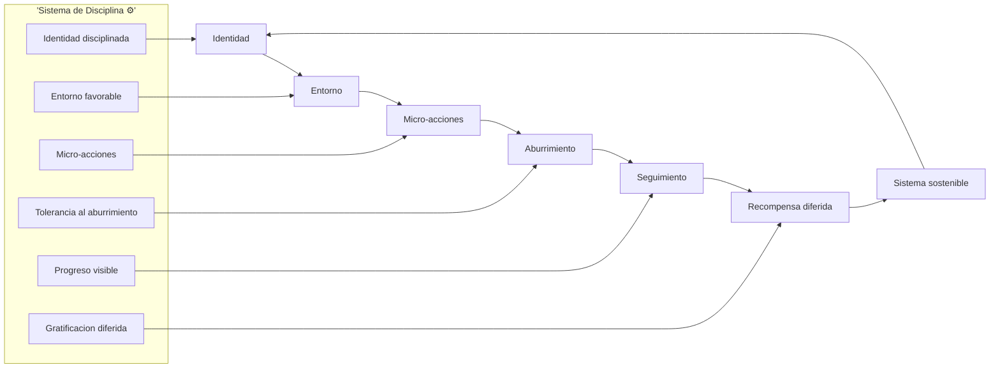
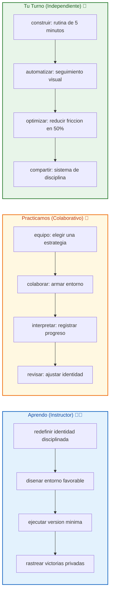
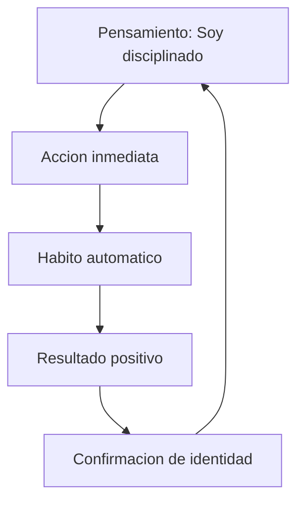
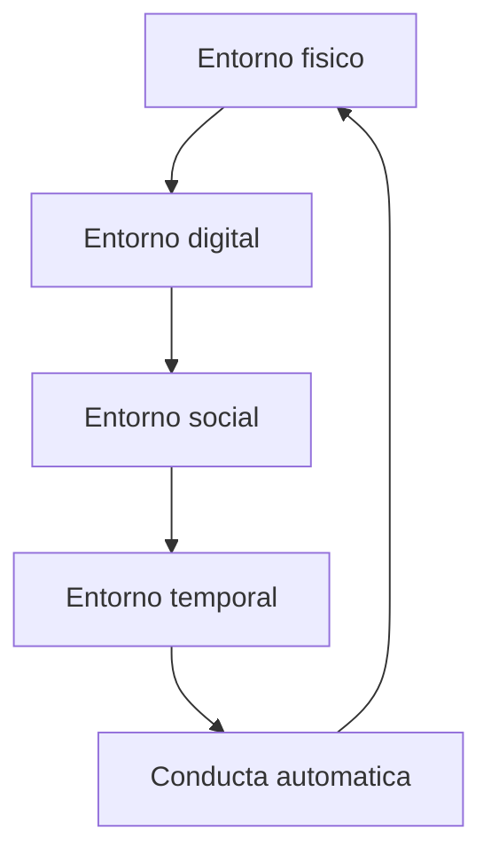

# 🚀 MASTERCLASS: Disciplina Inevitable — Cómo Reprogramar tu Cerebro y Dejar de Depender de la Motivación 🔥

## 🎯 INTRODUCCIÓN: POR QUÉ ESTE MASTERCLASS ES DIFERENTE 💡

La mayoría de las personas creen que la disciplina es un rasgo con el que se nace: o lo tienes, o no lo tienes. 🌩️ Confían ciegamente en la motivación ⚡ como si fuera un motor permanente, y cuando esta desaparece, abandonan. Y entonces culpan a su carácter.

Este masterclass propone otro camino: **la disciplina no es un evento, es un sistema**. 🧠⚙️ Un sistema diseñado para que lo correcto sea fácil y lo incorrecto sea difícil. No se trata de tener más fuerza de voluntad. Se trata de programar tu entorno, tus identidades y tus pequeñas acciones diarias para que la disciplina sea inevitable.

> **🎯 Objetivo de Aprendizaje** — Al final de esta guía, diseñarás un sistema personal de disciplina, aplicarás la regla de los 5 minutos, reprogramarás tu identidad, retrasarás recompensas y soportarás el aburrimiento necesario para construir resultados extraordinarios.

> **⚠️ Advertencia** — Este contenido es formativo. La disciplina requiere repetición y coherencia. Ninguna teoría reemplaza la implementación constante de pequeñas acciones deliberadas.

---

## 🧠🧠 MAPA DEL WORKFLOW DE LA DISCIPLINA INEVITABLE 🗺️💪



| Fase 🧩 | Pregunta que responde ❓ | Output principal 🎯 |
|--------|-----------------------|------------------|
| **Identidad** 🧬 | ¿Quién quiero ser? | Nueva autoimagen |
| **Entorno** 🏗️ | ¿Cómo diseño mi espacio? | Buenos hábitos fáciles |
| **Micro-acciones** ⚡ | ¿Por dónde empiezo? | Acciones pequeñas |
| **Aburrimiento** 🧘 | ¿Qué hago cuando no hay estimulación? | Tolerancia mental |
| **Seguimiento** 📊 | ¿Cómo veo mi progreso? | Victorias privadas |
| **Recompensa diferida** 📅 | ¿Cómo entreno la paciencia? | Resistencia al placer inmediato |
| **Sistema sostenible** 🌱 | ¿Cómo mantengo esto en el tiempo? | Rutina sin dependencia |

---




---

## 🧬 PARTE 1: IDENTIDAD — DEJA DE "INTENTARLO" Y EMPIEZA A SERLO 🧬✨

### 1.1 🧬 Por qué tu identidad lo controla todo

Tu identidad es el relato interno que repites cada día. Si te ves como "alguien sin disciplina", tu cerebro buscará pruebas que confirmen esa creencia. Si te ves como "alguien disciplinado", tus acciones fluirán sin resistencia.

Jaime Higuera lo explica con claridad: **"Deja de decir estoy intentando ser disciplinado. Adopta la identidad de alguien que ya lo es; tus acciones seguirán a tu identidad."**

### 1.2 ⚠️ El error más caro: pensar que la disciplina es opcional

| Mentalidad 🧠 | Lenguaje habitual 💬 | Resultado 📉 |
|-------------|---------------------|-------------|
| "Lo intentaré mañana" ⏰ | Futuro vago | Abandono constante |
| "Soy sin disciplina" 😿 | Identidad fija | Sin progreso |
| "Necesito motivación" ⚡ | Dependencia emocional | Inconstancia |
| "Soy disciplinado" 🦸 | Identidad clara | Acciones naturales |

### 1.3 🔄 Cómo se forma la identidad nueva



### 1.4 🛠️ Ejercicio de reescritura de identidad

```
🎭 Declaración de identidad disciplinada:
- Elige 1 identidad que quieras encarnar.
- Escribela en presente: "Soy alguien que..."
- Incluye 3 habitos que la confirmen.
- Lee tu declaración cada mañana y cada noche.

🔄 Ciclo de refuerzo:
1. Leo mi declaracion al despertar 🌅
2. Ejecuto el habito + pequeno que la confirme ⚡
3. Registro la victoria privada en mi libreta 📓
4. Leo mi declaracion antes de dormir 🌙
```

### 1.5 📊 Tabla de transformación de lenguaje

| Lenguaje evade 😿 | Lenguaje identitario 🦸 | Resultado 🌟 |
|-------------------|--------------------------|-------------|
| "Voy a intentarlo" | "Lo hago" | Acción sin excusas |
| "Tengo que hacerlo" | "Hago lo que hay que hacer" | Ejecución natural |
| "Espero estarlo" | "Soy" | Identidad consolidada |
| "Tratare de cumplir" | "Cumplo" | Resultados medibles |
| "Ojala lo logre" | "Lo logro" | Seguridad interna |

---

## 🐢 PARTE 2: EMPIEZA POCO A POCO — LA REGLA DE LA INTENSIDAD MINIMA 🐢✨

### 2.1 🐢 Por qué los cambios extremos fracasan

Tu cerebro es un detector de amenazas. 🧠⚡ Cuando le pides un cambio brusco, lo percibe como peligro y activa resistencia. "Voy a entrenar 5 horas diarias" suena a castigo. "Voy a hacer 2 flexiones" suena a juego.

La clave no es la intensidad. La clave es la constancia.

### 2.2 🛠️ Fórmula de progresión mínima

| Nivel 🎯 | Acción 📝 | Razón 💡 |
|---------|-----------|---------|
| 1. Version ridicula | Tan facil que no tiene excusa | Elimina resistencia |
| 2. Version sostenible | Repetible todos los dias | Construye habito |
| 3. Version progresiva | Aumenta solo cuando es automatica | Evita sobrecarga |
| 4. Version optima | Maxima capacidad sin desgaste | Resultados duraderos |

### 2.3 📊 Ejemplos de versiones pequeñas

| Objetivo grande 🎯 | Version ridicula 🐢 | Version +1% 📈 |
|-------------------|---------------------|---------------|
| Correr un maraton 🏃 | Ponerse las zapatillas y caminar 2 minutos 🚶 | Caminar 3 minutos |
| Escribir un libro ✍️ | Escribir 1 oracion por dia 📝 | Escribir 2 oraciones |
| Aprender ingles 🇬🇧 | Escuchar 1 podcast de 5 minutos 🔊 | Escuchar 1 podcast de 6 minutos |
| Meditar diario 🧘 | Sentarse y respirar 3 veces conscientemente 🌬️ | Respirar 4 veces |
| Leer 1 libro por semana 📚 | Leer 1 parrafo antes de dormir 🌙 | Leer 2 parrafos |
| Entrenar fuerza 💪 | Hacer 2 flexiones en la alfombra 🧎 | Hacer 3 flexiones |

### 2.4 🧠 Por qué funciona la version ridicula

Tu cerebro odia el conflicto. Cuando la accion es tan pequena que no duele, no hay resistencia. Una vez que empezas, la inercia hace el resto.

---

## 🏗️ PARTE 3: ARREGLA TU ENTORNO — NO CONFIES EN TU FUERZA DE VOLUNTAD 🏗️✨

### 3.1 🏗️ El entorno es el sistema invisible

Jaime Higuera lo dice sin ambigüedades: **"No dependas solo de la fuerza de voluntad. Diseña tu entorno para que los buenos habitos sean faciles y los malos sean dificiles de ejecutar."**

Tu fuerza de voluntad es finita. Tu entorno es constante. Diseña primero.

### 3.2 🔄 Diseño ambiental por capas



### 3.3 🛠️ Tabla de rediseño ambiental

| Habito objetivo 🎯 | Entorno actual ❌ | Entorno redisenado ✅ |
|-------------------|------------------|----------------------|
| Leer 20 paginas diarias 📚 | Celular en la mesa de noche | Libro visible, celular fuera de alcance |
| Meditar 10 minutos 🧘 | Sofa frente a la TV | Cojín designado, sin pantallas |
| Entrenar en casa 💪 | Ropa deportiva en el armario | Ropa deportiva sobre la cama |
| Escribir ✍️ | Notebook guardado | Notebook abierto en el escritorio |
| Ahorrar 💰 | Tarjeta en la cartera | Transferencia automatica el dia 1 |
| Comer saludable 🥗 | Comida chatarra visible | Fruta lavada en la mesa |
| Beber agua 💧 | Botella vacia | Botella llena en 3 puntos de la casa |

### 3.4 📋 Checklist de rediseño ambiental

| Capa 🧩 | Accion ⚡ | Estado ✅ |
|--------|---------|---------|
| Fisica | Reducir friccion de habitos buenos | ☐ |
| Fisica | Aumentar friccion de habitos malos | ☐ |
| Digital | Notificaciones silenciadas | ☐ |
| Digital | Apps de distraccion fuera de pantalla | ☐ |
| Social | Circulo que refleja tus metas | ☐ |
| Temporal | Bloqueo de horarios sagrados | ☐ |

---

## ⏱️ PARTE 4: LA REGLA DE LOS 5 MINUTOS — VENCE LA INERCIA EN SEGUNDOS ⏱️✨

### 4.1 ⏱️ Por qué la inercia es el verdadero enemigo

La parte más dificil de cualquier tarea no es la ejecucion. Es el primer movimiento. ⏱️⚡ Como un coche detenido, necesita mas energia para arrancar que para mantener velocidad. La regla de los 5 minutos está diseñada específicamente para vencer esa resistencia inicial.

### 4.2 🛠️ Tabla de aplicacion

| Bloqueo 🚧 | Promesa de 5 minutos ⏱️ | Resultado habitual 🎯 |
|-----------|-------------------------|----------------------|
| "No quiero entrenar" 💪 | Solo me pongo la ropa deportiva | 90% de las veces sigo entrenando |
| "No quiero estudiar" 📚 | Solo abro el libro y leo 1 pagina | 85% de las veces sigo estudiando |
| "No quiero trabajar" 💻 | Solo abro el documento y escribo 1 oracion | 92% de las veces sigo trabajando |
| "No quiero meditar" 🧘 | Solo me siento y respiro 3 veces | 80% de las veces sigo meditando |
| "No quiero ordenar" 🧹 | Solo ordeno 1 cajon | 75% de las veces sigo ordenando |

### 4.3 🧠 La neurociencia detras de los 5 minutos

Tu cerebro prefiere evitar dolor inmediato. Cuando prometes "solo 5 minutos", el dolor percibido es minimo. Una vez que empezas, el compromiso psicologico cambia. Salir cuesta mas que quedarse. Esa es la victoria.

---

## 🧘 PARTE 5: APRENDE A SOPORTAR EL ABURRIMIENTO — EL PRECIO DE ENTRADA 🧘✨

### 5.1 🧘 El aburrimiento es el filtro del exito

En un mundo de estimulacion constante, el aburrimiento se siente como un castigo. 🥱 Pero el aburrimiento es exactamente lo que buscas cuando intentas construir concentracion profunda.

**"La disciplina requiere tolerar el aburrimiento y la falta de estimulacion constante. El aburrimiento es el precio de entrada para lograr una concentracion profunda."** — Jaime Higuera

### 5.2 🧠 Por que tu cerebro huye del aburrimiento

| Comportamiento 🚨 | Explicacion cerebral 🧠 |
|-------------------|------------------------|
| Notificaciones constantes 📲 | Dopamina en dosis pequeñas |
| Redes sociales infinitas 📱 | Recompensa variable |
| Series de 8 horas 📺 | Escape de la realidad |
| multitarea constante 🎯 | Sensacion de productividad sin produccion |

### 5.3 🛠️ Entrenamiento de tolerancia al aburrimiento

```text
🥱 Nivel 1: Aburrimiento pasivo
- Sentarte sin estímulo 10 minutos
- Sin celular, sin música, sin pantalla
- Solo respirar y observar

🧠 Nivel 2: Aburrimiento activo
- Repetir una tarea simple sin variación
- Escribir la misma frase 50 veces
- Leer un texto técnico denso sin saltar

💪 Nivel 3: Aburrimiento prolongado
- Trabajo profundo de 90 minutos sin interrupciones
- Estudio deliberado sin recompensa inmediata
- Practica de habilidad sin validacion externa

🏆 Nivel 4: Aburrimiento productivo
- Descanso activo sin estimulación digital
- Caminar sin podcast ni música
- Inactividad como recuperacion mental
```

---

## 📊 PARTE 6: HAZ SEGUIMIENTO DE TU PROGRESO — VICTORIAS PRIVADAS 📈✨

### 6.1 📊 Por qué medir es el único camino a mejorar

Jaime Higuera dice: **"Utiliza una libreta o aplicación para visualizar tus victorias privadas. Ver el progreso ayuda a mantener el impulso."**

Lo que no se mide no existe. Tu cerebro olvida lo que hiciste bien y magnifica lo que hiciste mal. Un registro de victorias corrige ese sesgo.

### 6.2 📋 Rutina de seguimiento diario

**Al final del día, responde:**

```
✅ ¿Que habitos confirme hoy?
📊 ¿Cual fue mi victoria pequena mas importante?
📈 ¿Que evidencia tengo de que soy disciplinado?
🔄 ¿Que ajusto mañana?
🎯 ¿Estoy mas cerca de mi identidad ideal?
```

### 6.3 🛠️ Tabla de herramientas de seguimiento

| Herramienta 🛠️ | Uso 🎯 | Ventaja ✅ |
|----------------|--------|-----------|
| Libreta fisica 📓 | Registro diario | Sin distracciones |
| Calendario impreso 📅 | Marcar dias completados | Vista mensual |
| App de habitos 📱 | Seguimiento automatico | Gráficos y alertas |
| Hoja de calculo 📊 | Metricas cuantitativas | Analisis profundo |
| Mapa de racha 🔥 | Ver constancia visual | Motivacion por racha |

---

## 🎭 PARTE 7: CAMBIA TU IDENTIDAD — DEJA DE SER UN "INTENTADOR" 🎭✨

### 7.1 🎭 La brecha entre intentar y ser

"Estoy intentando ser mas ordenado" es una frase que perpetua el caos. "Soy ordenado" es una identidad que genera acciones automaticas.

### 7.2 🛠️ Tecnica de cambio de identidad

```
🎭 Declaracion de identidad deseada:
- Elige 1 identidad que quieras encarnar.
- Escribela en presente: "Soy alguien que..."
- Incluye 3 habitos que la confirmen.
- Lee tu declaracion cada mañana y cada noche.

🔄 Ciclo de refuerzo:
1. Leo mi declaracion al despertar 🌅
2. Ejecuto el habito + pequeno que la confirme ⚡
3. Registro la victoria privada en mi libreta 📓
4. Leo mi declaracion antes de dormir 🌙
```

---

## 🍫 PARTE 8: RETRASA LA RECOMPENSA — ENTRENA TU CEREBRO PARA EL LARGO PLAZO 🍫✨

### 8.1 🍫 La prueba del malvavisco digital

La capacidad de retrasar la gratificacion es el predictor mas confiable de exito. No es el coeficiente intelectual. No es el origen social. Es la capacidad de elegir 2 marshmallows en el futuro sobre 1 marshmallow ahora.

### 8.2 🛠️ Ejercicio de retraso progresivo

| Semana 📅 | Ejercicio 🛠️ | Tiempo 🕐 |
|-----------|---------------------|--------------|
| 1️⃣ 📅 | No revisar el celular los primeros 5 minutos | 5 minutos ⏱️ |
| 2️⃣ 📅 | Esperar 15 minutos antes de comer algo rico | 15 minutos ⏱️ |
| 3️⃣ 📅 | Esperar 30 minutos antes de abrir redes sociales | 30 minutos ⏱️ |
| 4️⃣ 📅 | Esperar 1 hora completa antes de contenido superficial | 1 hora ⏱️ |
| 5️⃣ 📅 | Solo recompensa después de tarea difícil | Variable ⏱️ |

---

## 🎓 PARTE 9: I DO / WE DO / YOU DO — EJERCICIOS PROGRESIVOS 🎓✨

### 9.1 🏫 I Do — Rediseñar la identidad

| Paso 🚶 | Accion ⚡ | Resultado esperado ✅ |
|------|--------|--------------------|
| 1️⃣ 📝 | Escribir 5 frases de identidad en presente | Declaracion lista |
| 2️⃣ 🎯 | Elegir la mas importante | Identidad nucleo |
| 3️⃣ ⚡ | Listar 3 micro-acciones que la confirmen | Habitos listos |
| 4️⃣ 📅 | Programar primera accion para mañana | Calendario bloqueado |
| 5️⃣ ✅ | Ejecutar y registrar | Evidencia inicial |

### 9.2 👥 We Do — Diseñar entorno en equipo

| Decision 🎯 | Opcion recomendada ✅ | Justificacion 💡 |
|----------|--------------------|---------------|
| 🧬 Identidad comun | "Somos un equipo que cumple lo que promete" | Alineación grupal |
|🏗️ Entorno | Agenda visible, tiempos estrictos | Reduce dispersion |
| ⚡ Micro-acciones | Revisión de 5 minutos al inicio | Baja fricción |
| 📊 Seguimiento | Tablero público de avance | Responsabilidad visible |
| 🍫 Recompensa | Celebrar hitos alcanzados | Refuerzo positivo |

### 9.3 🎯 You Do — Aplicar la regla de 5 minutos

| Criterio 📊 | Peso 📈 |
|----------|------|
| Seleccion honesta de tarea | 25% |
| Cumplimiento del compromiso | 30% |
| Registro diario | 25% |
| Reflexion final | 20% |

---

## ✅ PARTE 10: CHECKLIST FINAL DE DISCIPLINA INEVITABLE ✅✨

### 10.1 🧬 Checklist de identidad

| Bloque 🧩 | Check ✅ |
|--------|-------|
| Declaracion de identidad | Escrita en presente 👤 |
| Frase nucleo | Memorizada y repetida |
| Micro-acciones alineadas | 3 acciones diarias definidas ✅ |
| Evidencia registrada | Más de 7 victorias documentadas |

### 10.2 🐢 Checklist de empiezo pequeño

| Bloque 🧩 | Check ✅ |
|--------|-------|
| Version ridicula | Definida y ejecutable |
| Progresion gradual | Sin saltos agresivos |
| Constancia > intensidad | Accion diaria sin excepcion |
| Resistencia baja | Sin excusas validadas |

### 10.3 🏗️ Checklist de entorno

| Bloque 🧩 | Check ✅ |
|--------|-------|
| Friccion reducida | Buenos habitos visibles |
| Friccion aumentada | Malos habitos ocultos |
| Distracciones eliminadas | Espacio limpio |
| Señales activas | Recordatorios visibles |

### 10.4 ⏱️ Checklist de 5 minutos

| Bloque 🧩 | Check ✅ |
|--------|-------|
| Promesa de 5 minutos | Definida para cada habito evadido |
| Temporizador activo | Usado más de 7 veces |
| Tasa de continuacion | Mas del 80% |
| Inercia vencida | Se ejecuta sin negociacion |

### 10.5 🧘 Checklist de aburrimiento

| Bloque 🧩 | Check ✅ |
|--------|-------|
| Tiempo sin estímulos | 10+ minutos diarios |
| Tareas repetitivas | Sin saltar a recompensa |
| Descanso activo | Implementado |
| Concentración profunda | 90+ minutos continuos |

### 10.6 📊 Checklist de seguimiento

| Bloque 🧩 | Check ✅ |
|--------|-------|
| Herramienta de registro | Activa y accesible |
| Victorias privadas | Minimo 1 por dia |
| Racha visible | Más de 21 días |
| Revisión semanal | Ajustes documentados |

### 10.7 🎭 Checklist de identidad

| Bloque 🧩 | Check ✅ |
|--------|-------|
| Lenguaje proactivo | Sin "intentar" |
| Acciones alineadas | Coherencia diaria |
| Retroalimentación externa | Otros notan el cambio |
| Orgullo interno | Resultados sin culpa |

### 10.8 🍫 Checklist de recompensa diferida

| Bloque 🧩 | Check ✅ |
|--------|-------|
| Ejercicio de espera | Semanal |
| Gratificaciones diferidas | Mas del 50% |
| Control de impulsos | Mejora medible |
| Visión de largo plazo | Metas a 1-3 años |

---

## 📝 PARTE 11: PREGUNTAS DE VERIFICACION 📝✨

Responde cada pregunta basándote en los conceptos de esta master class. Escribe tus respuestas o compártelas para profundizar tu aprendizaje. 📝

### Preguntas sobre Identidad y Enojo

1. **✏️ Aplica**: Tienes 27 años y te dices a ti mismo "no soy disciplinado". Reescribe esa frase como identidad presentepor activo y diseña 3 micro-acciones que la confirmen durante la próxima semana.

2. **🔍 Analiza**: ¿Por qué intentar cambiar habitos sin cambiar identidad casi siempre fracasa? Explica con un ejemplo personal real y describe el momento exacto en que la nueva identidad empezó a dominar.

### Preguntas sobre Sistema y Micro-acciones

3. **✏️ Diseña**: Elige 1 habito que estés evadiendo y aplica la regla de los 5 minutos durante 3 días consecutivos. Registra tu tasa de continuación y explica por qué funcionó o no.

4. **✅ Evalúa**: ¿Qué nivel de diseño ambiental tienes hoy en tu espacio de trabajo y tu espacio digital? Enumera 3 mejoras concretas que puedes implementar esta semana sin invertir dinero.

### Preguntas sobre Aburrimiento y Progreso

5. **🧠 Reflexiona**: ¿Qué haces cuando te enfrentas al aburrimiento? ¿Cómo cambiarías esa respuesta para convertir el aburrimiento en concentración profunda durante los próximos 7 días?

6. **📅 Calcula**: Si entrenas tolerancia al aburrimiento 10 minutos diarios durante 30 días, ¿cuantas horas de concentración profunda habras acumulado? ¿Qué proyecto podrias terminar con ese tiempo?

### Preguntas sobre Responsabilidad y Largo Plazo

7. **🔗 Conecta**: Explica como la gratificacion inmediata sabotea tus metas a 1 año. Dibuja tu ciclo actual y el ciclo deseado después de aplicar los principios de esta masterclass.

8. **💡 Propón un sistema**: Diseña una rutina semanal de evaluación de disciplina: que medir, que preguntas responder y que ajustes hacer. Incluye seguimiento, identidad y recompensa diferida.

### Preguntas Integradoras

9. **🧠 Sintetiza**: ¿Como se relacionan entre sí identidad, entorno, micro-acciones, aburrimiento, seguimiento y recompensa diferida? Explica con una frase memorable que puedas usar como recordatorio.

10. **💭 Reflexión final**: De todos los principios de esta masterclass, ¿cuál crees que es el más difícil de aplicar y por qué? ¿Qué harás diferente a partir de hoy para empezar con ese principio?

---

## 📚 GLOSARIO RAPIDO 📖✨

| Termino 📝 | Definición 📋 |
|---------|------------|
| **Disciplina inevitable** 🚀 | Sistema diseñado para que la conducta correcta sea más fácil que la incorrecta |
| **Identidad disciplinada** 🧬 | Autoimagen de alguien que actúa sin necesidad de motivación |
| **Versión ridícula** 🐢 | Acción tan pequeña que no tiene excusa |
| **Diseño ambiental** 🏗️ | Modificacion del espacio físico y digital para facilitar habitos |
| **Regla de los 5 minutos** ⏱️ | Comprometerse a solo 5 minutos para vencer la inercia |
| **Tolerancia al aburrimiento** 🧘 | Capacidad de mantenerse enfocado sin estimulación constante |
| **Recompensa diferida** 📅 | Elegir una satisfacción mayor en el futuro sobre una menor hoy |
| **Micro-acción** ⚡ | Paso tan pequeño que elimina resistencia |
| **Fuerza de voluntad** 💪 | Recurso mental finito que se preserva con sistemas |
| **Victoria privada** 🏆 | Resultado pequeño pero confirmatorio de tu identidad |

---

## 📐 ANEXO: FORMATO IDEAL PARA MASTERCLASS EDUCATIVAS 📐✨

### 📏 Estructura visual recomendada 📏✨

El ancho óptimo 📏 para masterclasses educativas es **60–75 caracteres por línea** 📐.

```css
.article-content {
  🎨 font-size: 18px;
  📏 line-height: 1.75;
  📐 max-width: 65ch;
}
```

### 🎯 CIERRE PRACTICO 🎯✨

| Nivel 📊 | Debes poder hacer ✨ |
|-------|------------------|
| **🏫 I Do** | ✅ Reformular tu identidad y diseñar habitos que la confirmen |
| **👥 We Do** | 🧠 Crear un sistema de disciplina compartido con metas alineadas |
| **🎯 You Do** | 🚀 Construir tu plan anual de disciplina con metricas y evaluaciones |

---

## 🎁 RECURSOS ADICIONALES 🎁✨

- 📖 [📚 Jaime Higuera Official](https://www.jaimehiguera.com)
- 🎥 [🎬 Canales de disciplina: "Disciplina Inevitable"]
- 💻 [💻 Libros recomendados: "Atomic Habits", "Deep Work"]
- 🛠️ [🛠️ Apps de habitos: Habitica, Notion, Streaks, Loop Habit Tracker]

---

## 🏆 CHECKLIST FINAL DE DISCIPLINA INEVITABLE 🏆✅

| Bloque 🧩 | Check ✅ |
|--------|-------|
| 🧬 Identidad definida | 📝 Declaracion escrita en presente |
| 🐢 Version ridicula | Accion sin excusa |
| 🏗️ Entorno favorable | Buenos habitos faciles |
| ⏱️ Regla 5 minutos | Inercia vencida |
| 🧘 Aburrimiento soportado | 10+ minutos diarios |
| 📊 Seguimiento activo | Registro diario |
| 🎭 Identidad consolidada | Lenguaje proactivo |
| 🍫 Recompensa diferida | Control de impulsos |