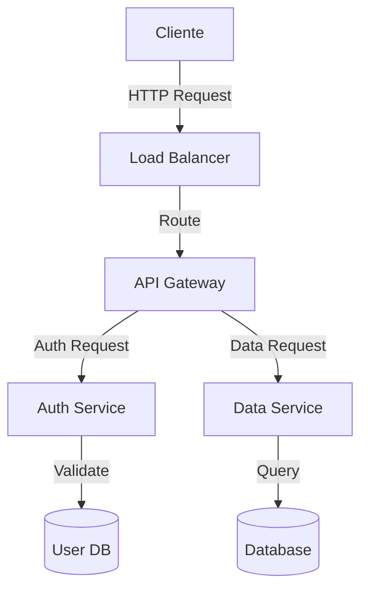
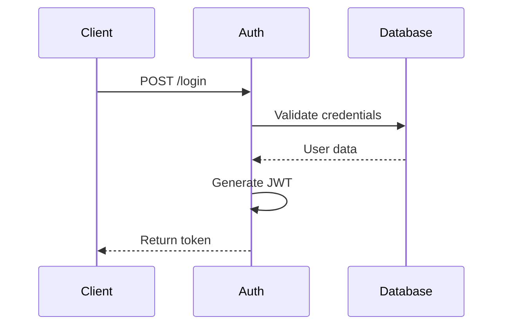

# Master Class: Diseño de Sistemas Web - Del Concepto al Diagrama

## Introducción

El diseño de sistemas de aplicaciones web es tanto una ciencia como un arte. Requiere comprender profundamente los requisitos funcionales y no funcionales, visualizar arquitecturas complejas, y comunicar estas ideas de manera clara y efectiva a través de diagramas y documentación.

Esta guía te llevará a través del proceso completo de diseño de sistemas web, desde la conceptualización inicial hasta la creación de diagramas detallados y documentación exhaustiva. Te proporcionará los conocimientos necesarios para abstraer y visualizar flujos de información complejos, seleccionar las arquitecturas adecuadas, y documentar tus decisiones de diseño de manera efectiva.

## 1. Fundamentos del Diseño de Sistemas Web

### 1.1 Pensamiento Sistémico

El diseño de sistemas web comienza con el "pensamiento sistémico" - la capacidad de ver el panorama completo y entender cómo interactúan las diferentes partes.

**Analogía:** Un sistema web es como una ciudad. Tiene diferentes distritos (módulos), sistemas de transporte (APIs), centrales eléctricas (bases de datos), y ciudadanos (usuarios) con diferentes necesidades. Un buen urbanista no solo piensa en edificios individuales, sino en cómo funciona toda la ciudad en conjunto.

### 1.2 Principios Fundamentales de Diseño

* **Separación de Responsabilidades:** Cada componente debe tener una responsabilidad bien definida y única.
* **DRY (Don't Repeat Yourself):** Evita la duplicación de código y lógica.
* **KISS (Keep It Simple, Stupid):** La simplicidad es preferible a la complejidad.
* **YAGNI (You Aren't Gonna Need It):** No agregues funcionalidades hasta que sean necesarias.
* **Acoplamiento Bajo, Cohesión Alta:** Minimiza las dependencias entre componentes mientras maximizas la coherencia interna.

**Ejemplo real:** En un sistema de comercio electrónico, separar claramente el módulo de gestión de inventario del módulo de procesamiento de pagos. Aunque interactúan, cada uno tiene responsabilidades distintas y puede evolucionar independientemente.

## 2. El Arte de los Diagramas: Visualizando Sistemas

### 2.1 Tipos de Diagramas y Cuándo Usarlos

#### Diagramas de Arquitectura

**Propósito:** Mostrar la estructura de alto nivel del sistema, incluyendo componentes principales y sus relaciones.

**Cuándo usar:** Al inicio del proyecto para establecer una visión compartida, y como referencia continua.

**Ejemplo:**

```
[Cliente Web] ←→ [API Gateway] ←→ [Microservicios] ←→ [Bases de Datos]
                     ↑                    ↑
                     ↓                    ↓
              [CDN/Cache]        [Sistemas Externos]
```

**Consejo práctico:** Mantén estos diagramas simples. Deben poder entenderse en menos de 5 minutos por alguien no técnico.

#### Diagramas de Flujo de Datos (DFD)

**Propósito:** Visualizar cómo fluye la información a través del sistema.

**Cuándo usar:** Para documentar procesos complejos y aclarar transformaciones de datos.

**Ejemplo de un proceso de compra:**

```
(Usuario) → [Selección de Productos] → [Carrito] → [Checkout] → [Procesamiento de Pago]
                      ↓                   ↑            ↓              ↓
              [Catálogo de Productos] ←---            [Inventario] → [Gestión de Pedidos]
```

**Analogía:** Un DFD es como el sistema circulatorio del cuerpo. Muestra cómo la "sangre" (datos) fluye a través de las "venas" (conexiones) entre los "órganos" (componentes).

#### Diagramas Entidad-Relación (ER)

**Propósito:** Modelar la estructura de datos y las relaciones entre entidades.

**Cuándo usar:** Durante el diseño de la base de datos y cuando necesites clarificar el modelo de dominio.

**Ejemplo simplificado para un blog:**

```
[Usuario] 1---* [Artículo] *---* [Categoría]
    ↓
    1
    ↓
[Comentario] *---1 [Artículo]
```

**Consejo práctico:** Empieza con entidades y relaciones clave. Agrega atributos solo cuando sea necesario para la claridad.

#### Diagramas de Secuencia

**Propósito:** Mostrar interacciones entre componentes en orden cronológico.

**Cuándo usar:** Para documentar flujos de trabajo complejos o protocolos de comunicación.

**Ejemplo de autenticación:**

```
[Usuario] → [Interfaz] → [Auth Service] → [Base de Datos]
                            ↓
                       [Token Service]
                            ↓
              [Interfaz] ← [Response con Token]
```

**Analogía:** Un diagrama de secuencia es como una coreografía de baile. Muestra exactamente quién hace qué movimiento y en qué momento, asegurando que todos los bailarines estén sincronizados.

#### Diagramas UML

**Propósito:** Proporcionar representaciones estandarizadas de estructuras y comportamientos del sistema.

**Cuándo usar:** Para documentación detallada, especialmente en equipos grandes o proyectos complejos.

**Tipos principales:**

* Diagramas de Clase: Estructura del código
* Diagramas de Componentes: Organización de módulos
* Diagramas de Actividad: Flujos de trabajo detallados

**Consejo práctico:** No te obsesiones con la precisión UML completa. A menudo, un diagrama UML-like simplificado es más efectivo para la comunicación.

### 2.2 Herramientas para Crear Diagramas

* **Draw.io (diagrams.net):** Gratuita, basada en web, amplia biblioteca de símbolos
* **Lucidchart:** Colaborativa, profesional, buena integración con otras herramientas
* **Mermaid:** Diagramas como código, ideal para incluir en documentación
* **PlantUML:** Potente para UML, basada en texto
* **Figma/Sketch:** Para mockups de UI que complementan diagramas técnicos

**Ejemplo de diagrama con Mermaid:**



**Consejo práctico:** Elige una herramienta que se adapte a tu flujo de trabajo. Si usas Markdown para documentación, Mermaid o PlantUML son excelentes. Para presentaciones a stakeholders, Lucidchart o Draw.io pueden ser mejores.

### 2.3 Principios de Diseño Visual Efectivo

* **Consistencia:** Usa símbolos y convenciones coherentes en todos tus diagramas.
* **Jerarquía Visual:** Los elementos más importantes deben destacarse visualmente.
* **Agrupación Lógica:** Organiza los componentes relacionados cerca unos de otros.
* **Flujo Direccional:** Asegúrate de que el diagrama guíe naturalmente el ojo en la dirección del flujo de información.
* **Niveles de Abstracción:** Mantén un nivel de detalle consistente; no mezcles conceptos de alto nivel con detalles de implementación.

**Analogía:** Un buen diagrama es como un buen mapa. No muestra cada árbol y piedra, sino que destaca los elementos relevantes para el viajero según su propósito.

**Ejemplo práctico:** En un diagrama de arquitectura, usa colores distintos para diferentes tipos de componentes (ej. azul para servicios, verde para bases de datos, naranja para sistemas externos) y mantén esta convención en todos los diagramas.

## 3. Abstrayendo el Flujo de Información

### 3.1 Modelado Conceptual

El modelado conceptual es el proceso de convertir requisitos del mundo real en abstracciones que pueden implementarse en un sistema.

**Proceso:**

1. Identificar entidades clave y sus atributos
2. Definir relaciones entre entidades
3. Establecer reglas de negocio y restricciones
4. Validar el modelo con stakeholders

**Analogía:** El modelado conceptual es como convertir una receta culinaria (instrucciones en lenguaje natural) en una lista de ingredientes y pasos precisos que cualquier chef podría seguir.

**Ejemplo real:** Para un sistema de reservas de hotel:

* Entidades: Hotel, Habitación, Reserva, Cliente, Pago
* Relaciones: Un Hotel tiene muchas Habitaciones; un Cliente hace muchas Reservas; una Reserva corresponde a una Habitación
* Reglas: Una Habitación no puede tener reservas superpuestas; una Reserva requiere un Pago válido

### 3.2 Del Dominio al Diseño Técnico

**Pasos para la transformación:**

1. Mapear entidades de dominio a estructuras técnicas (tablas, clases, APIs)
2. Definir operaciones y comportamientos de cada componente
3. Establecer protocolos de comunicación entre componentes
4. Diseñar interfaces de usuario y experiencia

**Ejemplo práctico - Sistema de eCommerce:**

**Modelo de dominio:**

* Producto, Categoría, Carrito, Pedido, Cliente

**Transformación técnica:**

* Base de datos: Tablas para productos, categorías, usuarios, pedidos, items\_pedido
* Servicios: ProductService, CartService, OrderService, PaymentService
* API: Endpoints para /products, /cart, /orders, /checkout
* Frontend: Páginas de catálogo, detalle de producto, carrito, checkout

**Consejo práctico:** Mantén una clara trazabilidad entre conceptos de dominio y componentes técnicos. Esto facilita la comunicación con stakeholders no técnicos.

### 3.3 Patrones para Modelar Flujos de Información

#### Arquitectura por Capas

**Concepto:** Organizar el sistema en capas con responsabilidades específicas.

**Ejemplo:**

```
[Presentación] → [Lógica de Negocio] → [Acceso a Datos] → [Almacenamiento]
```

**Analogía:** Como las capas de una cebolla, cada una envuelve y protege las capas interiores, con responsabilidades claramente definidas.

#### Patrón Publicador-Suscriptor (Pub/Sub)

**Concepto:** Componentes publican eventos sin conocer a los suscriptores, desacoplando productores y consumidores de información.

**Ejemplo:**

```
[Servicio de Pedidos] → [Cola de Eventos] → [Servicio de Notificaciones]
                                         → [Servicio de Inventario]
                                         → [Servicio de Análisis]
```

**Analogía:** Como un periódico: los redactores escriben artículos sin saber quién los leerá; los lectores se suscriben para recibir el periódico.

#### Patrón Command Query Responsibility Segregation (CQRS)

**Concepto:** Separar operaciones de lectura (queries) y escritura (commands).

**Ejemplo:**

```
[Cliente] → [Commands] → [Write Model] → [Database]
         → [Queries]  → [Read Model]  → [Database (or cache)]
```

**Analogía:** Como un restaurante con chefs (modelo de escritura) y camareros (modelo de lectura). Los chefs se especializan en preparar comida, los camareros en servirla y explicarla a los clientes.

**Cuando usar:** Sistemas con operaciones de lectura y escritura desequilibradas, donde se lee mucho más de lo que se escribe.

## 4. Arquitecturas Web Modernas

### 4.1 Monolítico vs. Microservicios

#### Arquitectura Monolítica

**Características:**

* Todo el código en una única aplicación
* Desplegado como una unidad
* Base de datos compartida

**Ventajas:**

* Simplicidad de desarrollo y despliegue
* Depuración más sencilla
* Menor complejidad operativa

**Desventajas:**

* Escalabilidad limitada
* Mayor riesgo en despliegues
* Posible acumulación de deuda técnica

**Analogía:** Un monolito es como una casa unifamiliar. Todo está bajo un mismo techo, lo que facilita el mantenimiento, pero limita la expansión.

#### Arquitectura de Microservicios

**Características:**

* Sistema dividido en servicios pequeños y especializados
* Cada servicio tiene su propia base de datos
* Comunicación a través de APIs

**Ventajas:**

* Escalabilidad independiente
* Equipos autónomos
* Tecnología heterogénea

**Desventajas:**

* Complejidad operativa
* Desafíos de comunicación entre servicios
* Mayor sobrecarga de infraestructura

**Analogía:** Los microservicios son como un complejo de apartamentos. Cada unidad es independiente y puede renovarse sin afectar a las demás, pero requiere una gestión más compleja del conjunto.

**Consejo práctico:** No elijas microservicios solo porque está de moda. Comienza con un monolito bien estructurado y evoluciona hacia microservicios cuando tengas una necesidad clara.

### 4.2 Frontend y Backend: Patrones de Integración

#### Arquitecturas de Frontend

* **MPA (Multi-Page Application):** Renderizado en servidor, navegación tradicional
* **SPA (Single-Page Application):** Carga inicial, actualizaciones dinámicas
* **Aplicaciones Isomórficas/Universales:** Renderizado en servidor + cliente
* **Micro-Frontends:** Componentes frontend independientes

**Ejemplo práctico:**

```
[Micro-Frontend: Header] → [Composition Layer] ← [Micro-Frontend: Product Catalog]
                                               ← [Micro-Frontend: Shopping Cart]
                                               ← [Micro-Frontend: Checkout]
```

#### Patrones de Comunicación Frontend-Backend

* **REST API:** Recursos y operaciones CRUD
* **GraphQL:** Consultas flexibles, un solo endpoint
* **Backends for Frontends (BFF):** APIs especializadas para cada frontend
* **Webhooks:** Callbacks HTTP para eventos
* **WebSockets:** Comunicación bidireccional en tiempo real

**Analogía:** Las APIs son como contratos legales entre frontend y backend. REST es un contrato estándar que funciona para la mayoría de los casos. GraphQL es un contrato personalizable que permite a cada parte especificar exactamente lo que necesita.

### 4.3 Consideraciones de Rendimiento y Escalabilidad

#### Estrategias de Caché

* **CDN:** Para recursos estáticos y páginas
* **Caché de API:** Almacenar respuestas frecuentes
* **Caché en memoria:** Redis/Memcached para datos de acceso frecuente
* **Caché en navegador:** Reducir solicitudes repetidas

**Analogía:** El caché es como tener ingredientes precocinados en un restaurante. No necesitas preparar todo desde cero para cada cliente, lo que acelera significativamente el servicio.

#### Estrategias de Escalado

* **Escalado Vertical:** Aumentar recursos de máquinas existentes
* **Escalado Horizontal:** Añadir más instancias del mismo servicio
* **Sharding:** Particionar datos entre múltiples bases de datos
* **Colas de Tareas:** Procesar operaciones pesadas de forma asíncrona

**Ejemplo real:** Un sistema de comercio electrónico durante el Black Friday:

* API Gateway escalado horizontalmente para manejar tráfico
* Servicio de Catálogo con caché agresivo
* Procesamiento de Pedidos a través de colas para manejar picos
* Sharding de base de datos por región geográfica

## 5. Documentación Efectiva de Sistemas

### 5.1 Niveles de Documentación

* **Nivel 1: Visión General del Sistema**
  * Propósito y contexto
  * Arquitectura de alto nivel
  * Stakeholders y usuarios
* **Nivel 2: Arquitectura y Componentes**
  * Componentes principales
  * Interacciones entre componentes
  * Tecnologías utilizadas
* **Nivel 3: Diseño Detallado**
  * Estructuras de datos
  * APIs internas y externas
  * Algoritmos clave
* **Nivel 4: Guías Operativas**
  * Procedimientos de despliegue
  * Monitoreo y alertas
  * Recuperación de desastres

**Consejo práctico:** No intentes documentar todo al mismo nivel de detalle. Documenta más profundamente las áreas complejas, críticas o propensas a malentendidos.

### 5.2 Documentación como Código (DocOps)

* **Markdown/AsciiDoc:** Documentación en texto plano versionable
* **Diagramas como código:** Mermaid, PlantUML
* **Documentación automatizada:** Swagger/OpenAPI para APIs
* **Integración con CI/CD:** Publicación automática de documentación

**Ejemplo práctico:**

```markdown
# Servicio de Autenticación

## Propósito
Gestionar autenticación y autorización de usuarios.

## API


## Dependencias

* Base de datos de usuarios
* Servicio de notificaciones (para alertas de seguridad)

```

**Beneficios:**
- Documentación que evoluciona con el código
- Facilidad de contribución para desarrolladores
- Revisión de documentación en el mismo proceso que el código

### 5.3 Comunicación de Decisiones de Arquitectura

#### Registro de Decisiones de Arquitectura (ADR)

**Estructura:**
1. Título: Descripción concisa de la decisión
2. Contexto: Factores que influyeron en la decisión
3. Decisión: La elección tomada
4. Consecuencias: Impacto positivo y negativo de la decisión
5. Estado: Propuesto, Aceptado, Superado, etc.

**Ejemplo:**
```markdown
# ADR-001: Adopción de GraphQL para APIs de Frontend

## Contexto
Nuestros frontends están experimentando problemas de rendimiento debido a múltiples llamadas API y over-fetching de datos.

## Decisión
Adoptaremos GraphQL como capa de API principal para todas las interacciones frontend-backend.

## Consecuencias
Positivas:
- Reducción de over-fetching y under-fetching
- Una sola request por vista
- Tipado fuerte de datos

Negativas:
- Curva de aprendizaje para el equipo
- Complejidad adicional en el backend
- Posibles desafíos de caché

## Estado
Aceptado - 2023-07-15
```

**Consejo práctico:** Los ADRs no son solo para decisiones técnicas. Documenta también decisiones sobre procesos, herramientas y organización que afecten al sistema.

## 6. Casos de Estudio: Del Concepto al Diagrama

### 6.1 Sistema de Comercio Electrónico

#### Requisitos clave:

* Catálogo de productos
* Carrito de compras
* Procesamiento de pagos
* Gestión de inventario
* Notificaciones a clientes

#### Proceso de diseño:

1. **Identificación de dominios:**
   * Catálogo
   * Carrito/Checkout
   * Pedidos
   * Inventario
   * Usuarios
2. **Diagrama de contexto:**

```
[Cliente] ←→ [Sistema eCommerce] ←→ [Proveedor de Pagos]
                    ↑
                    ↓
           [Sistema de Logística]
```

3. **Diagrama de componentes:**

```
[Frontend SPA] ←→ [API Gateway]
                      ↑
        ┌─────────────┼─────────────┐
        ↓             ↓             ↓
[Servicio de     [Servicio de   [Servicio de
  Catálogo]       Pedidos]      Usuarios]
        ↓             ↓             ↓
[DB Productos]    [DB Pedidos]   [DB Usuarios]
```

4. **Flujo de compra (diagrama de secuencia):**

```
[Cliente] → [Frontend] → [API Gateway] → [Servicio de Pedidos]
                                                ↓
                                        [Servicio de Pagos]
                                                ↓
                                        [Servicio de Inventario]
                                                ↓
                                        [Servicio de Notificaciones]
```

### 6.2 Sistema de Gestión de Contenidos (CMS)

#### Requisitos clave:

* Creación y edición de contenido
* Gestión de medios
* Publicación programada
* Control de versiones
* Roles y permisos

#### Proceso de diseño:

1. **Modelo de datos (simplificado):**

```
[Usuario] 1---* [Contenido] *---* [Categoría]
    ↑                ↑
    |                |
    |                *
[Rol] *---1     [Versión]
```

2. **Arquitectura de alto nivel:**

```
[Admin UI] ←→ [API] ←→ [Backend CMS] ←→ [Base de Datos]
                             ↓
                      [Sistema de Archivos/
                       Almacenamiento Blob]
```

3. **Flujo de publicación (diagrama de actividad):**

```
[Crear] → [Revisar] → [Aprobar] → [Programar] → [Publicar]
                ↓
            [Rechazar]
                ↓
            [Editar]
```

## 7. Reflexión Final: El Arte y la Ciencia del Diseño de Sistemas

El diseño de sistemas web es una disciplina que se encuentra en la intersección del arte y la ciencia. Como ciencia, requiere conocimientos técnicos, lógica rigurosa y metodologías probadas. Como arte, demanda creatividad, intuición y la capacidad de comunicar ideas complejas de manera elegante y accesible.

A lo largo de mi carrera diseñando sistemas, he llegado a comprender que los mejores diseños no son necesariamente los más sofisticados o tecnológicamente avanzados, sino aquellos que logran un equilibrio entre diversos factores a menudo contradictorios: simplicidad vs. flexibilidad, rendimiento vs. mantenibilidad, innovación vs. fiabilidad.

Los diagramas y la documentación no son meros subproductos del proceso de diseño, sino herramientas fundamentales de pensamiento. El acto de visualizar un sistema nos obliga a clarificar nuestras ideas, identificar inconsistencias y descubrir oportunidades de mejora que podrían pasar desapercibidas en discusiones abstractas. Como dijo el físico Richard Feynman: "Lo que no puedo crear, no lo entiendo". De manera similar, lo que no podemos diagramar, probablemente no lo comprendemos completamente.

He observado que los ingenieros a menudo subestiman la importancia de la comunicación visual en el diseño de sistemas. Tendemos a sumergirnos en detalles técnicos y código, olvidando que nuestros diseños deben ser comprensibles no solo para nosotros, sino para colegas, stakeholders y futuros mantenedores del sistema. Un diagrama claro puede prevenir semanas de malentendidos y trabajo desperdiciado.

También he aprendido que el diseño de sistemas es inherentemente iterativo. Rara vez acertamos a la primera. Los mejores diseñadores de sistemas que conozco mantienen una mentalidad de humildad y experimentación, dispuestos a probar ideas, aprender de los errores y refinar continuamente sus enfoques.

Finalmente, el mejor consejo que puedo ofrecer es recordar siempre que diseñamos sistemas para personas. Más allá de los requisitos técnicos, el verdadero propósito de nuestros sistemas es resolver problemas humanos y crear valor. Un sistema técnicamente impecable que no considera las necesidades, limitaciones y expectativas de sus usuarios y mantenedores está destinado al fracaso.

En última instancia, el diseño de sistemas web no se trata solo de conectar bases de datos, APIs y interfaces de usuario. Se trata de crear ecosistemas digitales que permitan a las personas realizar sus tareas de manera eficiente, resolver problemas complejos y, en el mejor de los casos, hacer del mundo un lugar un poco mejor.
