# MASTERCLASS: Docker desde Cero - Fundamentos Esenciales de Contenerización

## INTRODUCCIÓN: POR QUÉ DOCKER CAMBIÓ LA FORMA DE ENTREGAR SOFTWARE

> "En mi máquina funciona" es la frase más cara de la industria del software. Un desarrollador entrega su código, el operador lo despliega en producción y algo falla: una versión de librería distinta, una variable de entorno faltante, un puerto ocupado. Docker nace para matar esa frase de una vez por todas.

Docker no es magia. Es una forma de **empaquetar una aplicación junto con todo lo que necesita para ejecutarse** —sistema de archivos, dependencias, configuración y runtime— dentro de una unidad portable llamada **contenedor**. El mismo contenedor que corres en tu laptop es el que corre en el servidor de staging y en producción. Mismo entorno, mismos resultados.

La meta de esta masterclass no es memorizar comandos. La meta es construir una **mentalidad de contenerización**: entender qué problema resuelve Docker, cómo se construye una imagen reproducible, cómo se conectan los servicios y cómo se lleva todo a producción con disciplina.

> **Objetivo de Aprendizaje** — Al final de esta guía, podrás instalar Docker, crear una imagen propia desde un Dockerfile, ejecutar contenedores con volúmenes y redes, orquestar varios servicios con Docker Compose e integrar el build en un pipeline de CI/CD.

> **Advertencia práctica** — Docker es una herramienta poderosa. Usa imágenes oficiales, no expongas puertos innecesarios y nunca incluyas secretos (contraseñas, claves API) dentro de una imagen. La seguridad empieza en el Dockerfile.

---

## MAPA DEL WORKFLOW

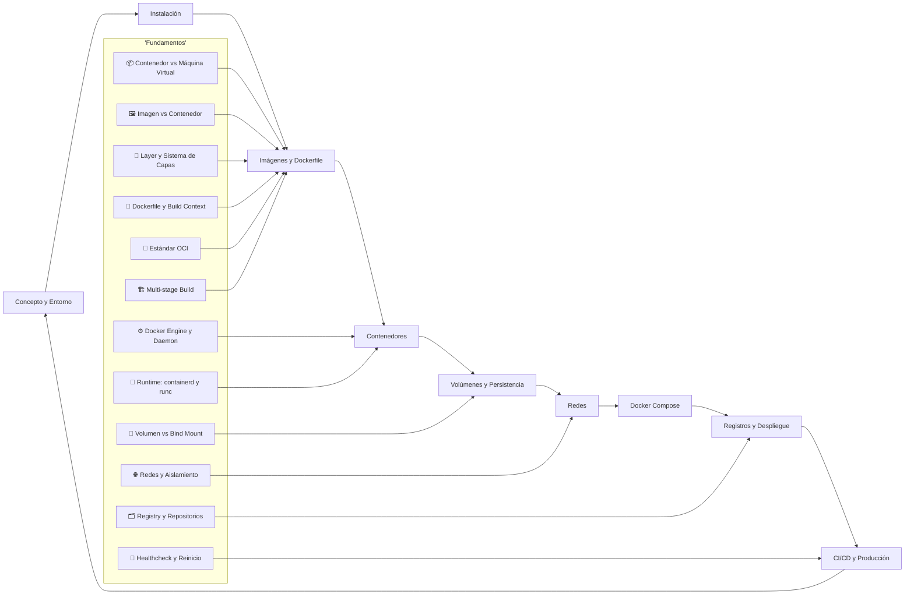

| Fase | Pregunta que responde | Output principal |
|------|-----------------------|------------------|
| **Concepto y Entorno** | ¿Qué es un contenedor y por qué usarlo? | Mentalidad y vocabulario |
| **Instalación** | ¿Docker corre en mi sistema? | Docker Engine + CLI funcional |
| **Imágenes y Dockerfile** | ¿Cómo empaqueto mi app? | Imagen reproducible |
| **Contenedores** | ¿Cómo ejecuto y gestiono mi app? | Proceso aislado en ejecución |
| **Volúmenes** | ¿Dónde guardo datos persistentes? | Almacenamiento duradero |
| **Redes** | ¿Cómo se comunican los servicios? | Conectividad y aislamiento |
| **Docker Compose** | ¿Cómo orquesto varios servicios? | Aplicación multi-contenedor |
| **Registros y Despliegue** | ¿Cómo distribuyo la imagen? | Imagen publicada y ejecutándose |
| **CI/CD y Producción** | ¿Cómo automatizo y escalo? | Pipeline y despliegue seguro |

### 🧭 Glosario visual de Fundamentos — para qué sirve cada elemento y consejos

Cada nodo del subgrafo `Fundamentos` representa un pilar del ecosistema Docker. Esta tabla explica su propósito y un consejo práctico para usarlo bien.

| 🔣 Icono | Elemento | ¿Para qué sirve? | 💡 Consejo práctico |
|----------|----------|------------------|---------------------|
| 📦 | **Contenedor vs Máquina Virtual** | Entender que el contenedor aísla procesos compartiendo el kernel, mientras la VM virtualiza hardware. | Si necesitas otro kernel o aislamiento fuerte por seguridad, usa VM; si buscas ligereza y densidad, contenedor. |
| 🖼️ | **Imagen vs Contenedor** | Distinguir la plantilla inmutable (imagen) de su instancia en ejecución (contenedor). | Piensa en imagen = clase y contenedor = objeto. Nunca edites un contenedor a mano:重建 la imagen. |
| 🗂️ | **Registry y Repositorios** | Distribuir imágenes versionadas entre equipos y servidores. | Publica siempre con tags inmutables (semver o SHA), nunca con `latest` en producción. |
| 🧱 | **Layer y Sistema de Capas** | Cada instrucción del Dockerfile genera una capa cacheable que acelera rebuilds. | Ordena las capas de lo menos a lo más cambiante para maximizar la caché del build. |
| 📝 | **Dockerfile y Build Context** | Definir de forma declarativa y reproducible cómo se construye la imagen. | Usa `.dockerignore` para excluir `node_modules`, `.git` y builds; reduce tamaño y tiempo. |
| 💾 | **Volumen vs Bind Mount** | Persistir datos: volúmenes gestionados por Docker (prod) vs montajes de carpeta del host (dev). | En producción usa volúmenes nombrados; en desarrollo usa bind mounts para iterar en vivo. |
| 🌐 | **Redes y Aislamiento** | Conectar contenedores por nombre en redes virtuales y limitar exposición externa. | Crea redes propias por app; expón solo los puertos necesarios con `-p`, nada más. |
| ⚙️ | **Docker Engine y Daemon** | El motor cliente-servidor que construye, ejecuta y gestiona contenedores. | Verifica con `docker info` tras instalar; el daemon (`dockerd`) es el que hace el trabajo pesado. |
| 📐 | **Estándar OCI** | Garantiza que imágenes y runtimes sean portables entre herramientas compatibles. | Prefiere imágenes que cumplan OCI para no quedar atado a un único vendor. |
| 🚀 | **Runtime: containerd y runc** | Capa que realmente arranca los contenedores según el estándar OCI. | Normalmente no lo tocas, pero saberlo ayuda a diagnosticar fallos de arranque bajos. |
| 🏗️ | **Multi-stage Build** | Separar la compilación de la ejecución para imágenes finales mínimas. | Compila en una etapa `AS builder` y copia solo el artefacto a una imagen `alpine` final. |
| 💓 | **Healthcheck y Reinicio** | Detectar cuándo un servicio está realmente sano y recuperarlo automáticamente. | Define `HEALTHCHECK` y usa `--restart unless-stopped` para resiliencia en producción. |

> **📌 Idea clave** — Estos 12 conceptos son el vocabulario mínimo para razonar sobre Docker. Dominarlos te permite leer cualquier `Dockerfile` o `compose` y predecir su comportamiento en producción.

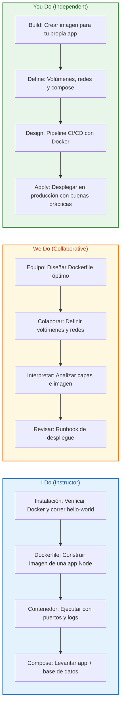

---

## PARTE 1: EL PROBLEMA Y LA SOLUCIÓN — CONTENEDORES VS MÁQUINAS VIRTUALES

### 1.1 Principio Central

Antes de tocar un comando, hay que entender el problema. El software no vive solo: depende del sistema operativo, las librerías del sistema, las versiones de runtime (Node, Python, JVM), variables de entorno y archivos de configuración. Cuando cualquiera de esos cambia entre entornos, el comportamiento cambia.

Docker resuelve esto empaquetando la aplicación **con su entorno completo** en un artefacto inmutable. El contenedor comparte el kernel del sistema operativo anfitrión pero mantiene su propio sistema de archivos, procesos y red aislados.

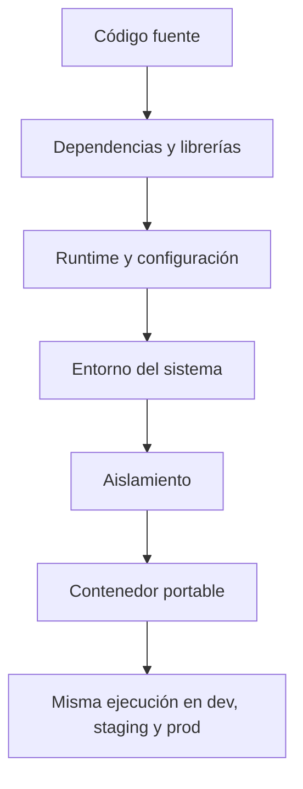

### 1.2 Contenedores vs Máquinas Virtuales

La confusión más común es pensar que un contenedor es "una VM ligera". No lo es. La diferencia es dónde vive el aislamiento.

| Característica | Máquina Virtual | Contenedor Docker |
|----------------|-----------------|-------------------|
| **Unidad de aislamiento** | Hypervisor virtualiza hardware | Docker aísla procesos en el SO |
| **Kernel** | Cada VM tiene su propio kernel | Comparte el kernel del host |
| **Tamaño** | GBs (SO completo) | MBs (solo app + dependencias) |
| **Arranque** | Segundos a minutos | Milisegundos a segundos |
| **Densidad** | Pocas VMs por host | Cientos de contenedores por host |
| **Portabilidad** | Depende del hipervisor | Portable entre hosts Linux/Windows |
| **Seguridad** | Fuerte aislamiento por hardware | Aislamiento a nivel proceso (menor) |

> **📌 Idea clave** — Una VM virtualiza *hardware*; un contenedor virtualiza el *sistema operativo*. Por eso los contenedores son más ligeros y rápidos, pero dependen de un kernel compatible (Linux, o un host Windows con WSL2).

### 1.3 Conceptos que debes dominar primero

| Concepto | Definición simple | Analogía |
|----------|-------------------|----------|
| **Imagen** | Plantilla inmutable y de solo lectura | Una receta de cocina |
| **Contenedor** | Instancia en ejecución de una imagen | El plato ya cocinado |
| **Registry** | Repositorio donde se guardan imágenes | Una biblioteca de recetas |
| **Dockerfile** | Receta que define cómo construir la imagen | Los pasos de la receta |
| **Layer (capa)** | Fragmento de la imagen, cacheable | Cada paso de la receta guardado |
| **Tag** | Versión de una imagen (`python:3.12`) | La edición de la receta |

### 1.4 Arquitectura de Docker

Docker usa una arquitectura cliente-servidor. El CLI (`docker`) habla con un demonio (`dockerd`) que construye, ejecuta y gestiona contenedores.

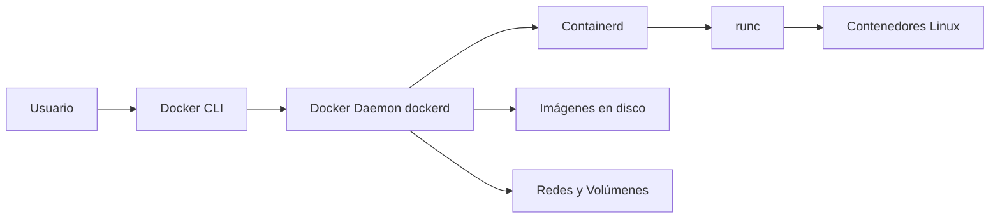

| Componente | Función |
|------------|---------|
| **Docker CLI** | Interfaz de línea de comandos que usas |
| **Docker Daemon** | Proceso en segundo plano que hace el trabajo pesado |
| **containerd** | Administra el ciclo de vida de los contenedores |
| **runc** | Ejecuta los contenedores según el estándar OCI |
| **OCI** | Estándar abierto de imágenes y runtimes (Docker lo cumple) |

---

## PARTE 2: INSTALACIÓN Y PRIMEROS PASOS

### 2.1 Regla de Oro

Antes de construir, confirma que tu entorno es capaz de ejecutar contenedores. Una instalación correcta te ahorra horas de errores confusos más adelante.

### 2.2 Opciones de instalación

| Plataforma | Herramienta recomendada | Notas |
|------------|--------------------------|-------|
| **Windows** | Docker Desktop (con WSL2) | WSL2 provee el kernel Linux necesario |
| **macOS** | Docker Desktop | Usa una VM ligera de Linux internamente |
| **Linux (Ubuntu)** | Docker Engine + CLI | Instalación nativa, sin Desktop necesario |
| **Servidor cloud** | Docker Engine solo | Sin interfaz gráfica, máximo rendimiento |

### 2.3 Verificar la instalación

```bash
# Versión del cliente y del demonio
docker version

# Información del sistema Docker (contenedores, imágenes, drivers)
docker info

# El ritual de iniciación: el contenedor "hola mundo"
docker run hello-world
```

Si `docker run hello-world` imprime un mensaje de bienvenida, tu entorno funciona. Lo que acaba de ocurrir:

1. Docker buscó la imagen `hello-world` en tu equipo.
2. Como no existía, la descargó del registry público (Docker Hub).
3. Creó un contenedor a partir de esa imagen.
4. El contenedor imprimió el mensaje y terminó.

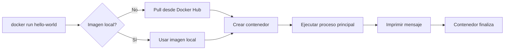

### 2.4 Estructura mínima de un proyecto contenerizado

```text
mi-app-docker/
├── app/
│   ├── index.js          # Código de la aplicación
│   ├── package.json      # Dependencias de Node
│   └── package-lock.json
├── Dockerfile            # Receta de la imagen
├── .dockerignore         # Archivos a excluir del build
├── docker-compose.yml    # Orquestación de servicios
└── README.md
```

### 2.5 Comandos esenciales de supervivencia

| Comando | Qué hace |
|---------|----------|
| `docker ps` | Lista contenedores en ejecución |
| `docker ps -a` | Lista todos los contenedores (incluso detenidos) |
| `docker images` | Lista imágenes locales |
| `docker run ` | Crea y arranca un contenedor |
| `docker stop <id>` | Detiene un contenedor |
| `docker rm <id>` | Elimina un contenedor detenido |
| `docker rmi ` | Elimina una imagen |
| `docker logs <id>` | Muestra los logs del contenedor |

---

## PARTE 3: IMÁGENES Y DOCKERFILE — CÓMO EMPAQUETAR TU APP

### 3.1 Qué es un Dockerfile

Un `Dockerfile` es un archivo de texto con instrucciones que Docker lee, en orden, para construir una imagen. Cada instrucción crea una **capa (layer)**. Las capas se cachean, así que el orden importa para la velocidad de los builds.

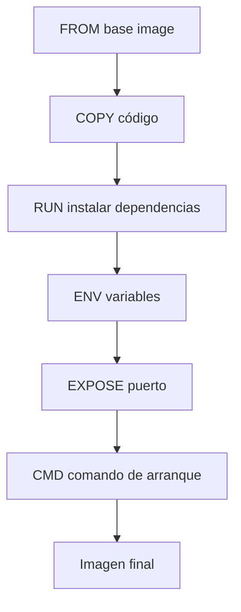

### 3.2 Anatomía de un Dockerfile (Node.js)

```dockerfile
# 1. Imagen base oficial de Node en versión estable (LTS)
FROM node:20-alpine

# 2. Directorio de trabajo dentro del contenedor
WORKDIR /usr/src/app

# 3. Copiar primero SOLO el manifiesto de dependencias
#    (aprovecha la caché: si package.json no cambia, no reinstala)
COPY package*.json ./

# 4. Instalar dependencias de producción
RUN npm install --omit=dev

# 5. Copiar el resto del código fuente
COPY . .

# 6. Puerto que escuchará la app
EXPOSE 3000

# 7. Comando de arranque
CMD ["node", "index.js"]
```

### 3.3 Instrucciones más usadas

| Instrucción | Propósito | Ejemplo |
|-------------|-----------|---------|
| `FROM` | Imagen base | `FROM python:3.12-slim` |
| `WORKDIR` | Carpeta de trabajo | `WORKDIR /app` |
| `COPY` | Copia archivos al contenedor | `COPY . .` |
| `RUN` | Ejecuta comandos al construir | `RUN apt-get update` |
| `ENV` | Define variables de entorno | `ENV NODE_ENV=production` |
| `EXPOSE` | Documenta el puerto | `EXPOSE 8080` |
| `CMD` | Comando por defecto al arrancar | `CMD ["python", "app.py"]` |
| `ENTRYPOINT` | Comando fijo (no reemplazable) | `ENTRYPOINT ["nginx"]` |
| `ARG` | Variable solo en build time | `ARG VERSION=1.0` |
| `.dockerignore` | Excluye archivos del build | `node_modules`, `.git` |

### 3.4 Construir y etiquetar una imagen

```bash
# Construir con un tag legible (nombre:versión)
docker build -t mi-app:1.0 .

# Listar para confirmar que existe
docker images

# Ejecutar la imagen mapeando el puerto 3000 del host al 3000 del contenedor
docker run -p 3000:3000 mi-app:1.0
```

### 3.5 Cmd vs Entrypoint

Muchos principiantes confunden `CMD` y `ENTRYPOINT`. La diferencia práctica:

| Escenario | `CMD` | `ENTRYPOINT` |
|-----------|-------|--------------|
| ¿Se puede sobreescribir al correr? | Sí, fácilmente | No (define el ejecutable) |
| Uso típico | Argumentos por defecto | El binario fijo de la app |
| Combinación | `ENTRYPOINT` + `CMD` = binario + args | Muy común en imágenes base |

```dockerfile
# Patrón recomendado: binario fijo + argumentos por defecto
ENTRYPOINT ["node", "index.js"]
CMD ["--port", "3000"]
```

### 3.6 Optimización de capas (caché inteligente)

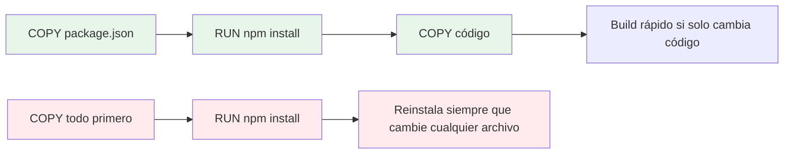

> **📌 Idea clave** — Copia primero lo que cambia menos (`package.json`, `requirements.txt`) y ejecuta la instalación de dependencias antes de copiar el código fuente. Así, editar tu código no fuerza a reinstalar todas las librerías.

---

## PARTE 4: CONTENEDORES EN EJECUCIÓN — GESTIÓN DEL CICLO DE VIDA

### 4.1 El ciclo de vida de un contenedor

Un contenedor no es eterno. Nace, vive mientras su proceso principal corre y muere cuando ese proceso termina. Entender los estados evita sorpresas.

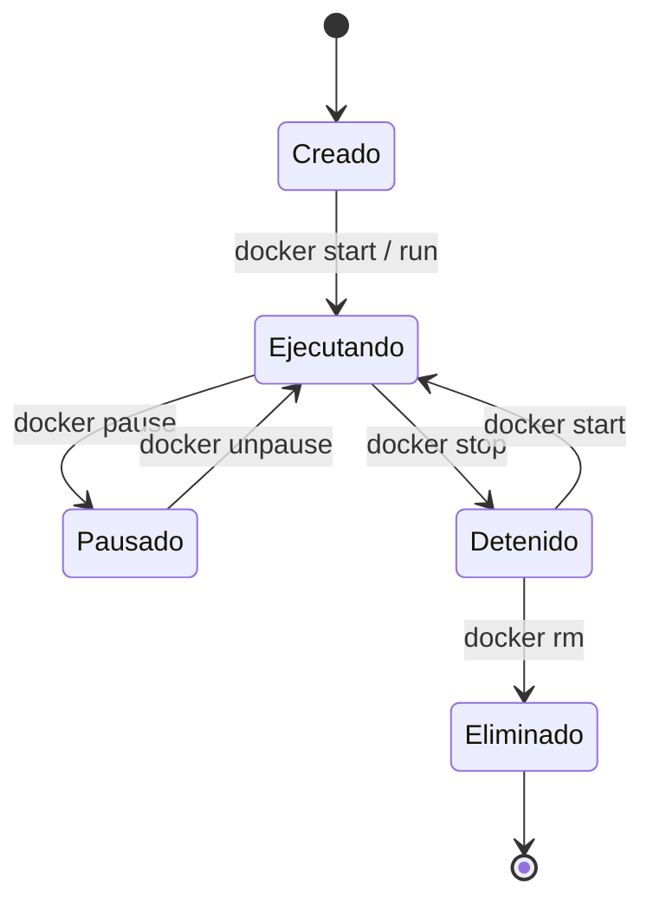

### 4.2 Ejecutar contenedores de forma útil

```bash
# Ejecutar en segundo plano (modo detached)
docker run -d -p 3000:3000 --name web mi-app:1.0

# Ver logs en tiempo real
docker logs -f web

# Ejecutar un comando dentro del contenedor (shell interactivo)
docker exec -it web sh

# Detener y eliminar
docker stop web
docker rm web
```

| Flag | Significado |
|------|-------------|
| `-d` | detached (segundo plano) |
| `-p` | mapeo de puertos `host:contenedor` |
| `--name` | nombre legible en lugar de ID aleatorio |
| `-it` | interactivo + terminal (para shells) |
| `-e` | pasar variable de entorno (`-e ENV=valor`) |
| `--rm` | eliminar el contenedor al salir (limpieza automática) |
| `-v` | montar un volumen (`host:contenedor`) |

### 4.3 Contenedores efímeros vs de larga duración

| Tipo | Característica | Ejemplo |
|------|----------------|---------|
| **Efímero** | Corre, hace su tarea y termina | Job de migración de datos |
| **Larga duración** | Servicio que escucha siempre | API web, base de datos |
| **Interactivo** | Necesita entrada del usuario | Depuración con shell |

> **Principio fundamental** — Los contenedores deben ser **descartables**. Si tu aplicación depende de que un contenedor específico sobreviva, estás usando Docker mal. La lógica de estado vive en volúmenes, no en el contenedor.

### 4.4 Limpieza del sistema

Los contenedores detenidos e imágenes huérfanas acumulan espacio en disco.

```bash
# Eliminar todos los contenedores detenidos
docker container prune

# Eliminar imágenes sin uso
docker image prune -a

# Liberar todo lo no usado (contenedores, redes, imágenes, caché de build)
docker system prune -a --volumes
```

> ⚠️ `docker system prune` es destructivo: borra todo lo no vinculado a un contenedor en ejecución. Úsalo con cuidado.

---

## PARTE 5: VOLÚMENES Y PERSISTENCIA — DONDE VIVEN LOS DATOS

### 5.1 El problema de la ephemeralidad

Un contenedor escribe sus archivos en su propio sistema de archivos. Cuando el contenedor se elimina, **esos archivos desaparecen**. Para una base de datos o cualquier dato que deba sobrevivir, eso es inaceptable.

La solución son los **volúmenes**: almacenamiento gestionado por Docker, fuera del sistema de archivos efímero del contenedor.

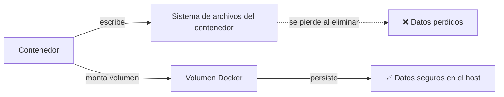

### 5.2 Tipos de almacenamiento

| Tipo | Descripción | Cuándo usarlo |
|------|-------------|---------------|
| **Volumen (named volume)** | Gestionado por Docker, en `/var/lib/docker/volumes` | Datos de base de datos, estado persistente |
| **Bind mount** | Monta una carpeta específica del host | Desarrollo (código en vivo), configuración |
| **tmpfs** | Solo en memoria RAM | Secretos temporales, caches sensibles |

### 5.3 Crear y usar volúmenes

```bash
# Crear un volumen nombrado
docker volume create datos-db

# Ejecutar Postgres montando el volumen en /var/lib/postgresql/data
docker run -d \
  --name postgres \
  -e POSTGRES_PASSWORD=secret \
  -v datos-db:/var/lib/postgresql/data \
  -p 5432:5432 \
  postgres:16
```

En desarrollo, un bind mount permite editar el código en tu host y verlo reflejado en el contenedor:

```bash
# Montar la carpeta actual (.) en /usr/src/app del contenedor
docker run -d -p 3000:3000 -v "$(pwd)":/usr/src/app mi-app:dev
```

### 5.4 Comparativa de montajes

| Aspecto | Volumen | Bind mount |
|---------|---------|------------|
| Ubicación | Docker la gestiona | Tú eliges la ruta del host |
| Portabilidad | Alta (Docker lo maneja) | Dependiente del host |
| Rendimiento | Bueno (volumes driver) | Variable |
| Backup | `docker volume` + rsync | Copia de carpeta normal |
| Uso típico | Producción | Desarrollo local |

> **📌 Idea clave** — En **producción** usa volúmenes nombrados para datos. En **desarrollo** usa bind mounts para iterar rápido.

---

## PARTE 6: REDES — CÓMO SE COMUNICAN LOS CONTENEDORES

### 6.1 Por qué importa la red

Por defecto, los contenedores están aislados. Para que tu API hable con tu base de datos, ambos deben estar en una **red de Docker**. Docker crea redes virtuales puente (bridge) que conectan contenedores por nombre.

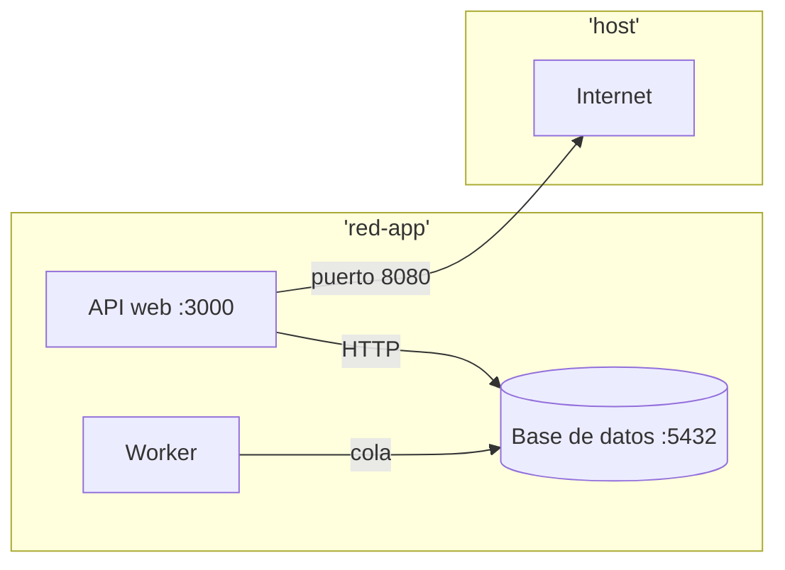

### 6.2 Tipos de redes

| Tipo | Descripción | Caso de uso |
|------|-------------|-------------|
| **bridge** | Red privada por defecto en el host | Contenedores en un mismo host |
| **host** | Comparte la red del host (sin aislamiento) | Máximo rendimiento, menos seguro |
| **none** | Sin red | Aislamiento total |
| **overlay** | Conecta hosts múltiples | Swarm / clústeres |
| **macvlan** | Contenedor con MAC propia en la LAN | Integración con red física |

### 6.3 Crear y conectar redes

```bash
# Crear una red personalizada
docker network create red-app

# Contenedor de base de datos en la red
docker run -d --name db --network red-app -e POSTGRES_PASSWORD=secret postgres:16

# Contenedor de API en la MISMA red (puede usar "db" como hostname)
docker run -d --name api --network red-app -p 8080:3000 mi-api:1.0
```

Dentro de la red `red-app`, el contenedor `api` puede conectarse a `db:5432` usando el nombre `db` como si fuera un DNS. Docker resuelve el nombre automáticamente.

### 6.4 Diagnóstico de red

```bash
# Listar redes
docker network ls

# Inspeccionar qué contenedores están conectados
docker network inspect red-app

# Probar conectividad desde dentro de un contenedor
docker exec -it api ping db
```

| Problema común | Causa | Solución |
|----------------|-------|----------|
| `getaddrinfo ENOTFOUND db` | Contenedores en redes distintas | Conectarlos a la misma red |
| Puerto cerrado externamente | No se mapeó con `-p` | Usar `-p host:contenedor` |
| Conexión rechazada | App no escucha en `0.0.0.0` | Bind a `0.0.0.0`, no `127.0.0.1` |

> **📌 Idea clave** — Para que un servicio sea accesible desde *fuera* del host usa `-p`. Para que dos contenedores se hablen *entre sí*, basta con estar en la misma red de Docker y usar sus nombres.

---

## PARTE 7: DOCKER COMPOSE — ORQUESTAR VARIOS SERVICIOS

### 7.1 El salto de uno a muchos

Una app real no es un solo contenedor: tiene API, base de datos, cache, worker, proxy. Levantar todo a mano con `docker run` es propenso a errores. **Docker Compose** define todos los servicios en un único archivo `docker-compose.yml`.

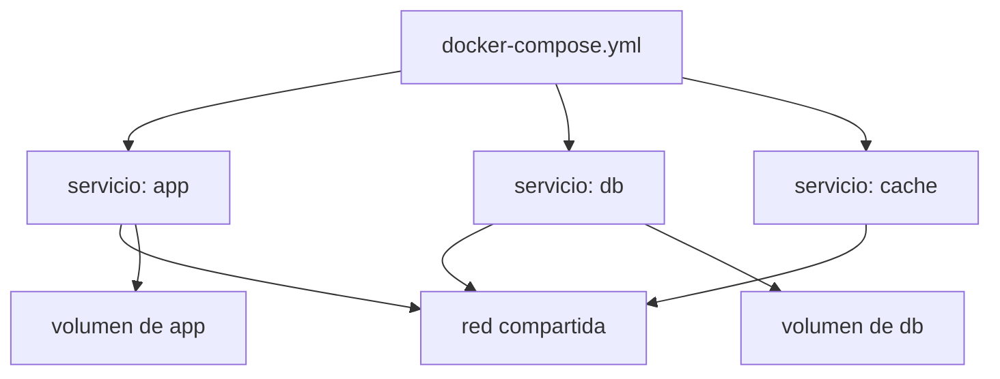

### 7.2 Un compose realista

```yaml
services:
  app:
    build: .
    ports:
      - "8080:3000"
    environment:
      - DATABASE_URL=postgres://postgres:secret@db:5432/miapp
      - REDIS_URL=redis://cache:6379
    depends_on:
      - db
      - cache
    networks:
      - red-app

  db:
    image: postgres:16
    environment:
      - POSTGRES_PASSWORD=secret
      - POSTGRES_DB=miapp
    volumes:
      - datos-db:/var/lib/postgresql/data
    networks:
      - red-app

  cache:
    image: redis:7-alpine
    networks:
      - red-app

volumes:
  datos-db:

networks:
  red-app:
    driver: bridge
```

### 7.3 Comandos de Compose

| Comando | Qué hace |
|---------|----------|
| `docker compose up` | Crea y levanta todos los servicios |
| `docker compose up -d` | Igual, en segundo plano |
| `docker compose down` | Detiene y elimina contenedores/redes |
| `docker compose build` | Reconstruye las imágenes |
| `docker compose logs -f` | Logs unificados de todos los servicios |
| `docker compose ps` | Estado de los servicios |

```bash
# Levantar todo en segundo plano
docker compose up -d

# Ver qué está corriendo
docker compose ps

# Escalar un servicio a 3 instancias
docker compose up -d --scale app=3
```

### 7.4 Variables y perfiles

```yaml
services:
  app:
    image: mi-app:${TAG:-latest}   # usa TAG del entorno, o "latest" por defecto
    profiles:
      - web                        # solo se levanta con --profile web
```

```bash
# Definir variable al ejecutar
TAG=1.2 docker compose up -d

# Levantar solo servicios de un perfil
docker compose --profile web up -d
```

| Concepto | Beneficio |
|----------|-----------|
| Variables `${VAR}` | Reutilizar el mismo archivo en dev/prod |
| `profiles` | Encender solo los servicios que necesitas |
| `depends_on` | Orden de arranque (no garantiza "listo") |
| `healthcheck` | Define cuándo un servicio está sano |

> **📌 Idea clave** — `depends_on` controla el *orden de inicio*, no espera a que el servicio esté *listo*. Para eso usa `healthcheck` y scripts de espera (wait-for-it).

---

## PARTE 8: REGISTROS Y DESPLIEGUE — DISTRIBUIR TU IMAGEN

### 8.1 Qué es un registry

Un **registry** es un repositorio de imágenes. Docker Hub es el público por defecto, pero existen alternativas privadas (GitHub Container Registry, Amazon ECR, Google Artifact Registry). Publicar tu imagen la hace disponible en cualquier servidor.

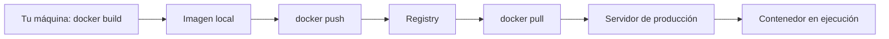

### 8.2 Publicar en Docker Hub

```bash
# Iniciar sesión
docker login

# Etiquetar con tu usuario y versión
docker tag mi-app:1.0 tuusuario/mi-app:1.0

# Subir la imagen
docker push tuusuario/mi-app:1.0

# En el servidor de producción, bajar y ejecutar
docker pull tuusuario/mi-app:1.0
docker run -d -p 8080:3000 tuusuario/mi-app:1.0
```

### 8.3 Versionado de imágenes

| Estrategia | Ejemplo | Cuándo |
|------------|---------|--------|
| **Semver** | `1.2.3` | Releases estables |
| **Git SHA** | `a1b2c3d` | Trazabilidad a un commit |
| **latest** | `latest` | Última build (evítalo en prod) |
| **Ambiente** | `prod`, `staging` | Separar entornos |

> ⚠️ Nunca uses `latest` en producción sin control. No sabes qué versión está corriendo realmente. Usa tags inmutables (semver o commit SHA).

### 8.4 Seguridad de imágenes

| Riesgo | Mitigación |
|--------|------------|
| Imágenes base con vulnerabilidades | Usa imágenes `slim`/`alpine` y escanea con `docker scout` |
| Secretos en la imagen | Usa `--build-arg` con cuidado o secretos en runtime |
| Usuario root en el contenedor | Agrega `USER appuser` no root |
| Puertos innecesarios expuestos | Expón solo lo imprescindible |
| Imágenes desactualizadas | Renueva base y dependencias periódicamente |

```dockerfile
# Buena práctica: crear usuario no root
RUN addgroup -S appgroup && adduser -S appuser -G appgroup
USER appuser
```

---

## PARTE 9: CI/CD Y PRODUCCIÓN — AUTOMATIZAR Y ESCALAR

### 9.1 De prototipo a producción

El valor real de Docker aparece cuando el build de la imagen se vuelve **automático y repetible**. Un pipeline de CI/CD construye, prueba y publica la imagen en cada commit, eliminando el factor humano.

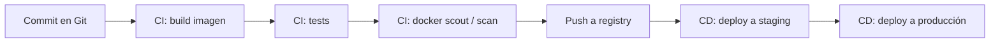

### 9.2 Pipeline de ejemplo (GitHub Actions)

```yaml
name: Docker CI
on:
  push:
    branches: [main]

jobs:
  build-and-push:
    runs-on: ubuntu-latest
    steps:
      - uses: actions/checkout@v4

      - name: Login a Docker Hub
        run: echo "${{ secrets.DOCKER_PASSWORD }}" | docker login -u ${{ secrets.DOCKER_USER }} --password-stdin

      - name: Build imagen
        run: docker build -t ${{ secrets.DOCKER_USER }}/mi-app:${{ github.sha }} .

      - name: Escanear vulnerabilidades
        run: docker scout cves ${{ secrets.DOCKER_USER }}/mi-app:${{ github.sha }} || true

      - name: Push imagen
        run: docker push ${{ secrets.DOCKER_USER }}/mi-app:${{ github.sha }}
```

### 9.3 Mejores prácticas de producción

| Práctica | Por qué |
|----------|---------|
| Imágenes pequeñas (multi-stage) | Menos superficie de ataque y descargas rápidas |
| Build multi-stage | Separa compilación de ejecución |
| Healthchecks | El orquestador sabe cuándo reiniciar |
| Límites de recursos | Evita que un contenedor coma toda la RAM |
| Logs a stdout/stderr | Recogidos por el sistema de logs |
| Reinicio automático | `restart: unless-stopped` en.compose o `--restart` |
| Sin datos en el contenedor | Estado siempre en volúmenes |

### 9.4 Build multi-stage (reducir tamaño)

```dockerfile
# Etapa 1: construcción
FROM node:20 AS builder
WORKDIR /app
COPY package*.json ./
RUN npm install
COPY . .
RUN npm run build

# Etapa 2: ejecución (imagen mínima)
FROM node:20-alpine
WORKDIR /app
COPY --from=builder /app/dist ./dist
COPY --from=builder /app/node_modules ./node_modules
USER node
CMD ["node", "dist/index.js"]
```

La imagen final solo contiene lo necesario para ejecutar, no las herramientas de build.

### 9.5 Límites y reinicio

```bash
# Limitar memoria y CPU
docker run -d -p 8080:3000 --memory=512m --cpus=1.0 mi-app:1.0

# Reinicio automático si falla
docker run -d --restart unless-stopped mi-app:1.0
```

| Política `--restart` | Comportamiento |
|----------------------|----------------|
| `no` | Nunca reinicia (por defecto) |
| `on-failure` | Reinicia solo si falla |
| `always` | Siempre reinicia |
| `unless-stopped` | Reinicia salvo que lo detengas manualmente |

---

## PARTE 10: I DO / WE DO / YOU DO — EJERCICIOS PROGRESIVOS

### 10.1 I Do — Instalación y primer contenedor

**Objetivo:** confirmar el entorno y correr tu primer contenedor.

| Paso | Acción | Resultado esperado |
|------|--------|--------------------|
| 1 | `docker version` | Cliente y daemon reportados |
| 2 | `docker run hello-world` | Mensaje de bienvenida |
| 3 | `docker ps -a` | Contenedor `hello-world` listado como exited |
| 4 | `docker images` | Imagen `hello-world` presente |

```bash
docker run --rm hello-world
```

**Interpretación guiada:**

- Si `hello-world` corre, Docker Engine funciona.
- El contenedor terminó porque su proceso principal solo imprime y sale.
- `--rm` limpia el contenedor automáticamente al salir.

### 10.2 We Do — Diseñar un Dockerfile en equipo

**Escenario:** tienes una app Node que escucha en el puerto 3000.

**Tarea colaborativa:** diseña un Dockerfile óptimo.

| Decisión | Opción recomendada | Justificación |
|----------|--------------------|---------------|
| Imagen base | `node:20-alpine` | Ligera y con runtime correcto |
| Orden de COPY | `package*.json` primero | Aprovecha la caché |
| Usuario | No root (`USER node`) | Seguridad |
| CMD | `node index.js` | Arranque claro |

```dockerfile
FROM node:20-alpine
WORKDIR /app
COPY package*.json ./
RUN npm install --omit=dev
COPY . .
USER node
EXPOSE 3000
CMD ["node", "index.js"]
```

### 10.3 You Do — Construir tu propia imagen

**Tarea:** conteneriza una aplicación tuya (cualquier lenguaje).

Debes incluir:

- Imagen base adecuada
- Instalación de dependencias aprovechando la caché
- Variables de entorno necesarias
- Puerto expuesto
- Usuario no root cuando sea posible
- `.dockerignore` para excluir `node_modules`, `.git`, etc.

| Criterio | Peso |
|----------|------|
| Tamaño de imagen | 25% |
| Velocidad de rebuild | 25% |
| Seguridad (no root) | 25% |
| Claridad del Dockerfile | 25% |

### 10.4 I Do — Volúmenes y persistencia

**Objetivo:** demostrar que los datos sobreviven al contenedor.

```bash
docker volume create datos
docker run -d --name db -e POSTGRES_PASSWORD=secret -v datos:/var/lib/postgresql/data postgres:16
# Crear una tabla, luego eliminar y recrear el contenedor:
docker rm -f db
docker run -d --name db2 -e POSTGRES_PASSWORD=secret -v datos:/var/lib/postgresql/data postgres:16
# La tabla sigue ahí: el volumen persistió.
```

| Paso | Acción | Validación |
|------|--------|------------|
| 1 | Crear volumen | `docker volume ls` lo muestra |
| 2 | Montar en contenedor | Datos escritos en `/var/lib/...` |
| 3 | Eliminar contenedor | `docker rm -f db` |
| 4 | Recrear con mismo volumen | Los datos persisten |

### 10.5 We Do — Interpretar redes

**Caso:** tu API no puede conectarse a `db:5432` y da `ENOTFOUND`.

| Pregunta | Respuesta esperada |
|----------|--------------------|
| ¿Están en la misma red? | Posiblemente no |
| ¿Qué comando usar? | `docker network connect red-app api` |
| ¿Cómo prevenirlo? | Definir la red en Compose |
| ¿El bind es correcto? | La app debe escuchar en `0.0.0.0` |

### 10.6 You Do — Docker Compose completo

**Tarea:** crea un `docker-compose.yml` con tres servicios:

1. `app` (tu imagen)
2. `db` (postgres)
3. `cache` (redis)

Debe incluir:

- Red compartida
- Volumen para la base de datos
- `depends_on` y `healthcheck`
- Variables de entorno de conexión

**Regla:** la app no debe iniciar hasta que la base de datos esté sana.

### 10.7 I Do — Publicar y desplegar

**Objetivo:** subir tu imagen y ejecutarla en otro equipo.

```bash
docker tag mi-app:1.0 tuusuario/mi-app:1.0
docker push tuusuario/mi-app:1.0
# En el servidor:
docker pull tuusuario/mi-app:1.0
docker run -d -p 8080:3000 --restart unless-stopped tuusuario/mi-app:1.0
```

| Paso | Acción | Validación |
|------|--------|------------|
| 1 | `docker login` | Autenticado |
| 2 | `docker tag` | Imagen con prefijo de usuario |
| 3 | `docker push` | Visible en Docker Hub |
| 4 | `docker pull` en servidor | Descarga exitosa |
| 5 | `docker run` | App responde en el puerto |

### 10.8 We Do — Revisar runbook de incidente

**Escenario:** el contenedor de producción se reinicia en bucle (crash loop).

| Paso | Acción |
|------|--------|
| 1 | `docker logs <id>` para ver el error |
| 2 | `docker inspect` para revisar configuración |
| 3 | Verificar variables de entorno y volúmenes montados |
| 4 | Corregir el Dockerfile o la config |
| 5 | Reconstruir y redeployar |
| 6 | Registrar la causa raíz |

### 10.9 You Do — Diseño de CI/CD

**Tarea:** diseña un pipeline para tu imagen.

| Etapa | Qué hace |
|-------|----------|
| Build | Construir imagen con tag = commit SHA |
| Test | Correr pruebas dentro del contenedor |
| Scan | Escanear vulnerabilidades |
| Push | Publicar a registry solo si pasa |
| Deploy | Aplicar en staging y luego producción |

### 10.10 Cierre práctico

| Nivel | Debes poder hacer |
|-------|-------------------|
| **I Do** | Seguir un ejemplo completo de instalación, build y ejecución |
| **We Do** | Ajustar Dockerfile, interpretar errores de red y decidir el despliegue |
| **You Do** | Contenerizar tu app, orquestarla con Compose e integrarla en CI/CD |

---

## CHECKLIST FINAL DE CONTENERIZACIÓN

| Bloque | Check |
|--------|-------|
| Entorno | Docker instalado, `docker version` y `hello-world` funcionan |
| Imagen | Dockerfile con base adecuada y cache inteligente |
| Seguridad | Usuario no root, puertos mínimos, sin secretos en la imagen |
| Contenedor | Puerto mapeado, reinicio configurado, logs a stdout |
| Persistencia | Datos críticos en volúmenes nombrados |
| Red | Servicios en red compartida con resolución por nombre |
| Compose | `docker-compose.yml` con servicios, redes y volúmenes |
| Registro | Imagen etiquetada con versión inmutable y publicada |
| CI/CD | Pipeline construye, prueba, escanea y despliega automáticamente |
| Producción | Límites de recursos, healthcheck y monitoreo de logs |

---

## Preguntas de Verificación 📝

Responde cada pregunta basándote en los conceptos de esta master class. Escribe tus respuestas o compártelas para profundizar tu aprendizaje.

### Preguntas sobre Fundamentos

1. **Aplica**: Tu app funciona en tu laptop pero falla en producción por una versión de librería distinta. ¿Cómo resuelve Docker este problema y qué artefacto garantiza la consistencia?

2. **Analiza**: Explica con tus palabras la diferencia entre una imagen y un contenedor. ¿Por qué se dice que la imagen es "inmutable"?

### Preguntas sobre Dockerfile e Imágenes

3. **Diseña**: Escribe un Dockerfile multi-stage para una app Python que requiere compilación de una dependencia C. Define las etapas de build y ejecución.

4. **Reflexiona**: ¿Por qué es importante copiar `package.json` antes que el resto del código? ¿Qué problema de rendimiento evitas?

### Preguntas sobre Volúmenes y Redes

5. **Calcula**: Tienes un contenedor Postgres sin volumen. Lo eliminas con `docker rm -f`. ¿Qué pasa con la base de datos? ¿Cómo lo evitarías?

6. **Evalúa**: Dos contenedores en el mismo host no se ven. Enumera las tres causas más probables y su solución.

### Preguntas Integradoras

7. **Conecta**: Explica cómo `depends_on` en Docker Compose es insuficiente para garantizar que la base de datos está "lista" antes que la app. ¿Qué mecanismo adicional usarías?

8. **Propón un sistema**: Diseña un pipeline de CI/CD con Docker para un equipo pequeño. ¿Qué etapas incluirías y por qué `latest` es peligroso en producción?

9. **Síntesis**: Toma una aplicación que hayas desarrollado y aplícale el framework completo: Dockerfile, volúmenes, red, Compose y despliegue. Identifica los puntos críticos.

10. **Reflexión final**: De los 9 componentes del workflow, ¿cuál consideras el más crítico para evitar incidentes en producción? Justifica tu respuesta.

## GLOSARIO RÁPIDO

| Término | Definición |
|---------|------------|
| **Contenedor** | Instancia en ejecución de una imagen, aislada del host |
| **Imagen** | Plantilla inmutable y de solo lectura para crear contenedores |
| **Dockerfile** | Archivo con instrucciones para construir una imagen |
| **Layer (capa)** | Nivel cacheable de una imagen generado por cada instrucción |
| **Volumen** | Almacenamiento persistente gestionado por Docker |
| **Bind mount** | Montaje de una carpeta específica del host dentro del contenedor |
| **Red (bridge)** | Red virtual que conecta contenedores en un mismo host |
| **Registry** | Repositorio donde se almacenan y distribuyen imágenes |
| **Docker Compose** | Herramienta para definir y ejecutar apps multi-contenedor |
| **Multi-stage build** | Build en varias etapas para reducir el tamaño final de la imagen |
| **Healthcheck** | Comprobación de que un servicio está realmente operativo |
| **OCI** | Estándar abierto de imágenes y runtimes de contenedores |

---

## ANEXO A: COMANDOS DE REFERENCIA RÁPIDA

### Build y ejecución

| Comando | Descripción |
|---------|-------------|
| `docker build -t nombre:tag .` | Construye imagen desde Dockerfile |
| `docker run -p 8080:3000 nombre` | Ejecuta mapeando puertos |
| `docker run -d --name x nombre` | Ejecuta en segundo plano con nombre |
| `docker exec -it x sh` | Abre shell interactivo en el contenedor |

### Gestión

| Comando | Descripción |
|---------|-------------|
| `docker ps -a` | Lista todos los contenedores |
| `docker stop x` / `docker rm x` | Detiene y elimina |
| `docker images` / `docker rmi x` | Lista y elimina imágenes |
| `docker logs -f x` | Sigue los logs en vivo |

### Volúmenes y redes

| Comando | Descripción |
|---------|-------------|
| `docker volume create v` | Crea volumen nombrado |
| `docker volume ls` | Lista volúmenes |
| `docker network create red` | Crea red |
| `docker network connect red x` | Conecta contenedor a red |

### Compose

| Comando | Descripción |
|---------|-------------|
| `docker compose up -d` | Levanta todos los servicios |
| `docker compose down` | Detiene y limpia |
| `docker compose logs -f` | Logs unificados |
| `docker compose build` | Reconstruye imágenes |

---

## ANEXO B: ANTIPATRONES COMUNES EN DOCKER

| Antipatrón | Problema | Solución |
|------------|----------|----------|
| Usar `latest` en producción | No sabes qué versión corre | Tags inmutables (semver/SHA) |
| Contenedor como VM | Estado dentro del contenedor | Estado en volúmenes |
| Imagen gigante con todo | Lento, inseguro | Imágenes `slim` + multi-stage |
| Correr como root | Superficie de ataque | Usuario no root |
| Secretos en el Dockerfile | Fuga de credenciales | Secretos en runtime/vault |
| `COPY . .` antes de instalar | Reinstala dependencias siempre | Copia `package.json` primero |
| Sin healthcheck | Orquestador no sabe el estado | Define `HEALTHCHECK` |
| Sin límites de recursos | Un contenedor colapsa el host | `--memory` y `--cpus` |

> **📌 Idea clave final** — Docker no es solo una herramienta, es una **disciplina de empaquetado**. Una imagen bien construida es reproducible, pequeña, segura y descartable. Eso es lo que separa un "it works on my machine" de un despliegue profesional.
