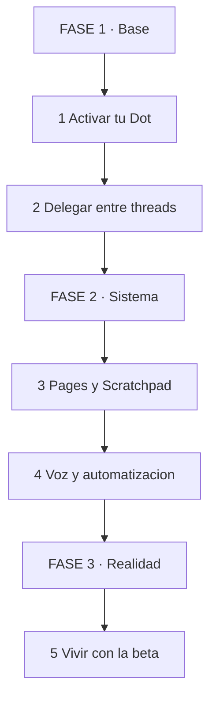
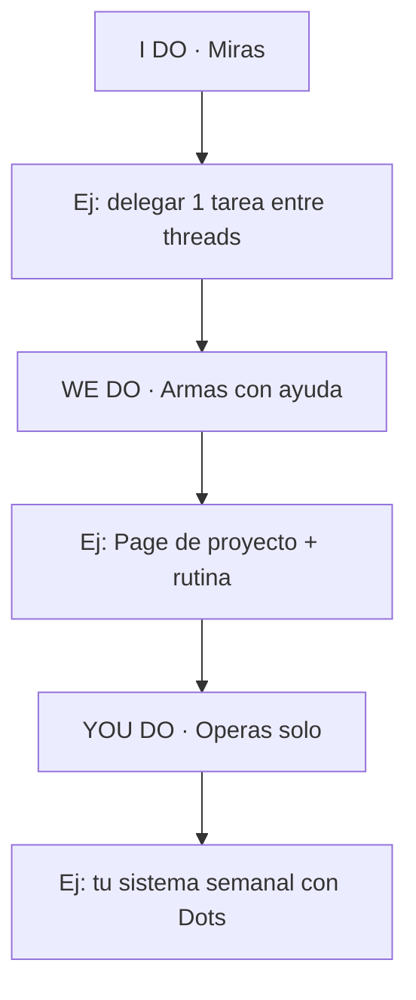

# 🟣 Dots en la Práctica — Tu Agente Always-On 🤖📱

## 🎯 INTRODUCCIÓN: POR QUÉ ESTA GUÍA ES DIFERENTE 💡

Los anuncios te dicen qué *promete* Dots. Esta guía te dice cómo *usarlo hoy*: dónde ahorra tiempo real, dónde todavía falla y qué no confiarle aún en beta.

Dots es un agente "always-on" y proactivo: un hub central de tus memorias, herramientas, tareas programadas y threads de código en ChatGPT.

> **🎯 Objetivo** — Al terminar tendrás tu Dot configurado, un sistema Pages/Scratchpad funcionando, una automatización recurrente y voz por teléfono probada.

> **⚠️ Nota** — Early access en planes Pro y Enterprise. Hay bugs intermitentes (cloud browser, interfaz de tareas). Incluyo workarounds.

---

## 🗺️ MAPA — LEE DE ARRIBA HACIA ABAJO 🗺️

Cómo leerlo: empiezas en FASE 1, bajas hasta FASE 3. Sin Dot activado, nada de lo demás aplica.

| Fase 🧩 | Qué logras 🎯 | Habilidad 🛠️ |
|------|---------------|--------------|
| **FASE 1 · Base** (1-2) | Dot activo delegando tareas | Delegar + Supervisar |
| **FASE 2 · Sistema** (3-4) | Conocimiento + voz + rutinas | Organizar + Automatizar |
| **FASE 3 · Realidad** (5) | Bugs conocidos y controlados | Verificar + Contingencia |

### Cómo aprenderla: I Do → We Do → You Do

---

## 🟢 1. ACTIVAR TU DOT

Disponible en ChatGPT Pro y Enterprise. Lo creas en la app de escritorio o web: nombre + personalización inicial.

| Paso 📋 | Acción 🎯 |
|---------|-----------|
| 1 | Crea tu dot primario y ponle nombre |
| 2 | Conecta tus apps (empieza con 2-3, no 20) |
| 3 | Dale 1 memoria semilla: quién eres y en qué trabajas |
| 4 | Pide 1 tarea pequeña de fondo y revisa el resultado |

> **📌 Idea clave** — Empieza con un Dot, no con un equipo. Los equipos de Dots llegan después; primero aprende a supervisar uno.

---

## 🔀 2. CONTINUIDAD Y ORQUESTACIÓN

El superpoder real: Dots tiende un puente entre threads y proyectos. Delegas tareas en varios frentes sin cambiar de contexto manualmente.

| Antes 📋 | Con Dots 🎯 |
|----------|-------------|
| Abres 5 chats y copias contexto entre ellos | Delegas y el Dot lleva el contexto |
| Pierdes el hilo en threads largos | El Dot retoma donde quedó cada proyecto |
| Tú orquestas todo | Tú supervisas, el Dot orquesta |

**Cuándo delegar:**

| Delega ✅ | Hazlo tú 🔴 |
|-----------|-------------|
| Research paralelo en varios temas | Decisiones con costo irreversible |
| Resúmenes y seguimiento de lanzamientos | Contenido sensible sin revisar |
| Borradores y comparaciones | Publicación final sin tu visto bueno |

> **📌 Idea clave** — Delega la recolección, nunca la decisión. El Dot trae resultados para tu revisión.

---

## 📝 3. PAGES Y SCRATCHPAD

Sistema tipo Notion para conocimiento de largo plazo: notas, contexto de proyecto e información que se perdería en threads largos.

| Herramienta 📋 | Uso 🎯 |
|----------------|--------|
| **Pages** | Documento vivo colaborativo (texto, imágenes, charts) |
| **Scratchpad** | Notas rápidas y contexto persistente del proyecto |

**Estructura mínima que funciona:**

1. Una Page por proyecto activo (objetivo + estado + decisiones).
2. Scratchpad para datos que se repiten (URLs, criterios, snippets).
3. Regla: si lo pegaste 2 veces en un chat, va a una Page.

> **📌 Idea clave** — Los threads son memoria de corto plazo. Pages es tu disco. Sin Pages, cada conversación larga empieza de cero.

---

## 📱 4. VOZ Y AUTOMATIZACIÓN

### Voz por teléfono

Habla con tu agente para research rápido o updates sin abrir la app. Ideal para: consultas caminando, briefing antes de una reunión, dictar una idea al Scratchpad.

### Tareas recurrentes, triggers y recordatorios

| Automatización 📋 | Ejemplo 🎯 |
|-------------------|-----------|
| Resumen recurrente | "Cada lunes, resume los lanzamientos de IA de la semana" |
| Revisión de eventos | "Avísame de eventos del sector la próxima semana" |
| Trigger de proyecto | "Cuando haya novedades de X, actualiza la Page" |

> **📌 Idea clave** — Una automatización que revisas = apalancamiento. Diez que no revisas = ruido. Empieza con una semanal.

---

## 🐞 5. VIVIR CON LA BETA

Es una herramienta nueva y en evolución. Fallos reportados:

| Bug 🚩 | Workaround 🟢 |
|--------|---------------|
| Cloud browser intermitente | Reintenta; ten la URL a mano por si debes abrirla tú |
| Interfaz de tareas programadas con hiccups | Verifica que la rutina se creó (pide confirmación explícita) |
| Respuesta inconsistente ocasional | Pide al Dot que cite fuente o thread de origen |

Regla de oro beta: **nada crítico sin tu revisión**. El Dot propone y ejecuta borradores; tú apruebas lo que sale al mundo.

> **📌 Idea clave** — Usa la beta para trabajo reversible (research, borradores, resúmenes). Lo irreversible espera a tu visto bueno.

---

## 🧩 I DO / WE DO / YOU DO

### I Do — Delega tu primera tarea

| Paso | Acción | Resultado |
|------|--------|-----------|
| 1 | Elige 1 research pequeño | Tarea delegada |
| 2 | Revisa el resultado | Aprobado o corregido |
| 3 | Guarda lo útil en una Page | Conocimiento persistido |

### We Do — Page + rutina

| Decisión | Opción | Por qué |
|----------|--------|---------|
| Page | 1 proyecto real | Contexto que hoy se pierde |
| Rutina | 1 resumen semanal | Hábito revisable |
| Voz | 1 prueba por teléfono | Canal alternativo |

### You Do — Tu sistema semanal

| Criterio | Peso |
|----------|------|
| Dot con memorias y 2+ apps | 25% |
| 1 Page viva por proyecto | 25% |
| 1 automatización revisada | 25% |
| Lista de límites beta propios | 25% |

---

## ✅ CHECKLIST

| Bloque 📦 | Check ✔️ |
|--------|-------|
| Dot | Creado, nombrado, con memoria semilla |
| Delegación | 1 tarea entre threads supervisada |
| Pages | 1 Page + Scratchpad en uso |
| Voz | Llamada de prueba hecha |
| Auto | 1 rutina semanal verificada |
| Beta | Bugs conocidos + regla de revisión |

---

## 📝 PREGUNTAS

1. ¿Qué tarea tuya de esta semana podrías haber delegado entre threads? Descríbela.
2. ¿Qué pondrías en tu primera Page para no perder contexto?
3. Diseña tu primera automatización semanal: trigger, salida esperada y cómo la verificarías.
4. ¿Qué trabajo mantendrías fuera de la beta y por qué?
5. ¿Cómo decidirías cuándo pasar de 1 Dot a un equipo de Dots?

---

## 📖 GLOSARIO

| Término | Definición |
|---------|------------|
| **Dots** | Agente always-on de OpenAI, hub de ChatGPT |
| **Always-on** | Trabaja en segundo plano sin chat abierto |
| **Orquestación** | Coordinar tareas entre threads y proyectos |
| **Pages** | Documento vivo humano + agente |
| **Scratchpad** | Notas rápidas y contexto persistente |
| **Trigger** | Condición que dispara una tarea automática |

*Basada en review early access + anuncios DevDay 29-sep-2026. Disponibilidad: Pro y Enterprise.*
