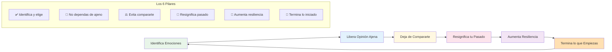
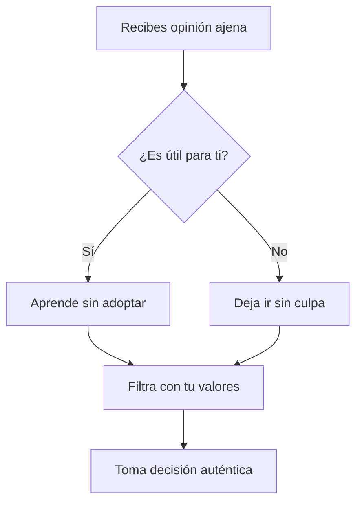
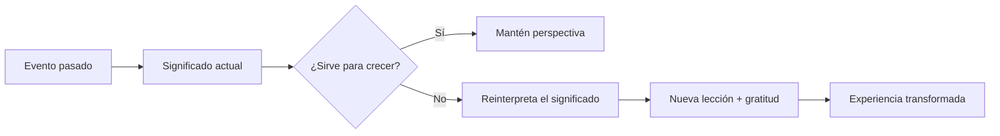
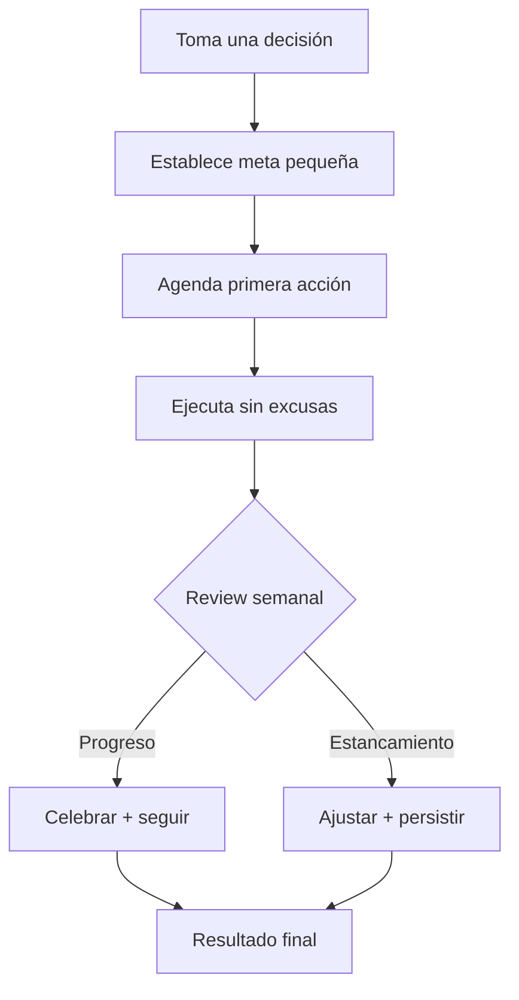
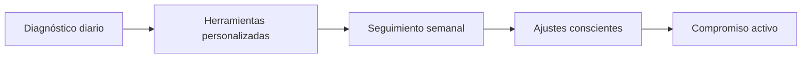

# MASTERCLASS: Inteligencia Emocional - Los 6 Pasos para el Progreso 🧠❤️

## INTRODUCCIÓN: POR QUÉ ESTA MASTERCLASS ES DIFERENTE 🎯

> **🎯 Objetivo de Aprendizaje** — Al final de esta guía, podrás identificar tus emociones, gestionar la opinión ajena, construir resiliencia, resignificar experiencias pasadas, completar lo que inicias y crear tu roadmap de inteligencia emocional.

> **⚠️ Advertencia educativa** — Este contenido es formativo. La inteligencia emocional requiere práctica constante. No hay atajos: el progreso viene de la aplicación diaria.

---

## MAPA DEL WORKFLOW 🔄



---

## PARTE 1: IDENTIFICA Y ELIGE TUS EMOCIONES - EL PODER DE LA AUTOSELECCIÓN 🎯

### 1.1 Principio Central: Las Emociones son una Elección 🎨

> **🧠 Dato científico**: El 90% de las decisiones humanas son emocionales, no racionales. Pero tú puedes entrenar la capacidad de elegir conscientemente.

### 1.2 Test de Autodiagnóstico Emocional ⚡

**Ejercicio de Identificación (2:19-5:57)**:

```
1. ¿Qué emoción sientes ahora? 🤔
2. ¿Qué emoción quieres sentir? 🎯
3. Cambia intencionalmente: postura + respiración + enfoque
4. ¿Cuándo fue la última vez que hiciste esto? 📅
```

### 1.3 Técnica del Cambio Consciente 🔄

```python
# Protocolo de cambio emocional consciente
def change_emotional_state(current_emotion, desired_emotion):
    # Paso 1: Postura física
    posture_map = {
        'ansiedad': 'espalda recta + hombros abiertos + sonrisa',
        'tristeza': 'cabeza arriba + pecho abierto + respiración profunda',
        'ira': 'manos abiertas + exhalación larga + cuento hasta 10',
        'miedo': 'pies firmes + estiramiento + visualización de seguridad'
    }
    
    # Paso 2: Respiración
    breathing_pattern = "4-7-8: Inhala 4, retén 7, exhala 8"
    
    # Paso 3: Enfoque mental
    focus_shift = f"De {current_emotion} a {desired_emotion}"
    
    return posture_map.get(current_emotion, "postura neutral"), breathing_pattern, focus_shift
```

---

## PARTE 2: NO DEPENDAS DE LA OPINIÓN AJENA - TU VOZ INTERIOR 🗣️

### 2.1 El Mapa del Mundo Único 🗺️

> **💡 Verdad transformadora**: Cada persona tiene un filtro único basado en experiencias. Seguir mapas ajenos es perder tu autenticidad.

### 2.2 Señales de Dependencia Ajena 🚩

| Señal | Indicador | Solución |
|-------|-----------|----------|
| "**¿Qué haría X?**" | Busca validación externa | Pregúntate "**¿Qué quiero yo?**" |
| "**Tengo que complacer**" | Prioriza agradecer sobre ser auténtico | Establece límites claros |
| "**No sé qué siento**" | Desconexión de emociones | Diario emocional diario |
| "**Si ella lo hace...**" | Comparación constante | Enfócate en tu crecimiento |

### 2.3 Ejercicio de Desconexión (5:58-8:04) 🔌



---

## PARTE 3: EVITA COMPARARTE CON OTROS - TU ÚNICO RELATIVO 🎯

### 3.1 La Leyenda de tu Yo del Pasado 📊

> **📊 Estadística impactante**: Compararte con otros reduce tu motivación en un 31% y aumenta la ansiedad en un 45%.

### 3.2 El Punto de Referencia Correcto 🎯

| Comparación | Problema | Alternativa |
|-------------|----------|-------------|
| Comparar con otros hoy | Competencia tóxica | Comparar contigo de ayer |
| Comparar con metas lejanas | Estrés constante | Celebrar pequeños avances |
| Comparar logros | Envidia | Aprender de trayectorias |
| Comparar apariencia | Baja autoestima | Cuidar tu bienestar único |

### 3.3 Regla del 1% Diario 📈

```python
# Protocolo de mejora personal
def daily_growth_tracker():
    today_decisions = []
    
    def add_decision(choice, outcome):
        today_decisions.append({
            'choice': choice,
            'outcome': outcome,
            'alignment': 'high' if choice_matches_values else 'low'
        })
    
    return {
        'decisions': today_decisions,
        'growth_score': len([d for d in today_decisions if d['alignment'] == 'high']),
        'lesson': f"Hoy elegí {len(today_decisions)} veces con mis valores"
    }
```

---

## PARTE 4: RESIGNIFICA TU PASADO - EL PODER DE LA REINTERPRETACIÓN 🔄

### 4.1 La Neutridad de los Eventos 🧬

> **🧠 Dato revelador**: Nada tiene significado intrínseco. Tú le das el significado a cada experiencia.

### 4.2 Técnica de Reencuadre (9:39-12:01) 🔧



### 4.3 Ejercicio de Resignificación 💭

| Evento | Significado limitante | Nuevo significado | Lección de crecimiento |
|--------|---------------------|-------------------|----------------------|
| Fracaso laboral | "No soy bueno" | "Aprendí habilidades nuevas" | Resiliencia + adaptabilidad |
| Relación terminada | "No valgo" | "Mejor descubrí mis límites" | Autoconfianza + autenticidad |
| Error estúpido | "Soy inútil" | "Me humanizo y enseño humildad" | Humildad + compasión |

---

## PARTE 5: AUMENTA TU RESILIENCIA - EL MUSCULO MENTAL 💪

### 5.1 La Constancia vence a la Motivación 🏗️

> **⏰ Verdad científica**: La motivación es efímera. La resiliencia es un músculo que se construye con práctica diaria.

### 5.2 Técnicas de Fortalecimiento 🧘

| Técnica | Duración | Beneficio |
|---------|----------|-----------|
| **Meditación guiada** | 10-20 min | Reduce reacción emocional 🧘 |
| **Ejercicio físico** | 30-45 min | Libera endorfinas + claridad 🏃‍♀️ |
| **Respiración consciente** | 3-5 min | Reset nervioso inmediato 🌬️ |
| **Journaling** | 10 min | Procesa emociones 🖊️ |
| **Agradecimiento** | 2 min | Reentrena el cerebro positivo 🙏 |

### 5.3 Rutina de Resiliencia Matutina (12:02-14:33) 🌅

```python
# Protocolo de resiliencia diaria
def morning_resilience_routine():
    return {
        'physical': '5 min estiramientos',
        'mental': 'Afirmaciones personales en voz alta',
        'emotional': 'Visualización de reacción calmada ante estrés',
        'spiritual': '3 cosas por las que agradecer hoy'
    }
```

---

## PARTE 6: TERMINA LO QUE EMPIEZAS - LA LEY DEL COMPROMISO 🔚

### 6.1 Más allá de los Impulsos 🎯

> **🚀 Dato poderoso**: Solo el 8% de la población completa lo que inicia. Tú puedes ser del 92% que deciden terminar.

### 6.2 El Antidote a la Desertencia 🛡️

| Impulso | Sustitución | Resultado |
|---------|-------------|-----------|
| "Empecé y no funciona" | "Estoy aprendiendo" | Paciencia + constancia |
| "No veo resultados rápido" | "Cada acción suma" | Disciplina + visión |
| "Mejor empiezo otra cosa" | "Termino lo iniciado" | Integridad + logro |

### 6.3 Sistema de Compromiso (14:34-15:39) 🔒



---

## PARTE 7: I DO / WE DO / YOU DO - EJERCICIOS PROGRESIVOS 🎓

### 7.1 I Do — Ejercicio Guiado de Identificación 🧭

**Objetivo**: Identificar y cambiar tu estado emocional actual

| Paso | Acción | Duración |
|------|--------|----------|
| 1 | Detén y nombra emoción actual | 1 min 🤔 |
| 2 | Elige emoción deseada | 1 min 🎯 |
| 3 | Cambia postura física | 30 seg 🔧 |
| 4 | Aplica respiración 4-7-8 | 1 min 🌬️ |
| 5 | Visualiza resultado positivo | 1 min 🔮 |

### 7.2 We Do — Análisis en Equipo 🧑‍🤝‍🧑

**Escenario**: Durante una reunión, sientes presión por opinión de jefes.

**Plan colaborativo**:

| Momento | Acción grupal | Resultado |
|---------|--------------|-----------|
| **Identificar** | ¿Qué necesito sentir? | Claridad emocional |
| **Validar** | ¿Esta opinión me sirve? | Filtrado consciente |
| **Decidir** | ¿Qué elijo hacer? | Acción auténtica |
| **Comprometer** | ¿Cómo termino esto? | Seguimiento grupal |

### 7.3 You Do — Sistema Personal de IE 🚀

**Tarea**: Crea tu sistema completo de inteligencia emocional



**Checklist de implementación**:

- [ ] Identifica tus 3 emociones dominantes esta semana
- [ ] Crea ritual de independencia de opinión ajena
- [ ] Establece meta de crecimiento vs comparación
- [ ] Resignifica 3 eventos pasados significativos
- [ ] Practica 1 técnica de resiliencia diaria
- [ ] Completa 1 proyecto incompleto hoy

---

## PREGUNTAS DE VERIFICACIÓN 📝

1. **Aplica**: ¿Qué emoción dominante identificaste esta semana y cómo la transformarías usando la técnica de postura + respiración?

2. **Analiza**: ¿Puedes recordar una opinión ajena que adoptaste sin cuestionar? ¿Qué aprendiste de esa experiencia?

3. **Diseña**: Crea una afirmación matutina que te conecte con tu autenticidad antes de levantarte.

4. **Reflexiona**: ¿Qué evento pasado puedes resignificar hoy para ver una oportunidad de crecimiento?

---

## GLOSARIO RÁPIDO 📚

| Término | Definición | Emoji |
|---------|------------|-------|
| **IE** | Inteligencia Emocional | 🧠❤️ |
| **Autoconocimiento** | Conocer tus emociones | 🔍 |
| **Autogestión** | Regular emociones ajenas | ⚖️ |
| **Autorrealización** | Cumplir tu potencial | 🌟 |
| **Reencuadre** | Cambiar perspectiva | 🔄 |
| **Compromiso** | Seguir adelante | 🔒 |

---

## RECURSOS ADICIONALES 📦

### Apps de Inteligencia Emocional 📱
- **Emoción**: Daylio, Moodnotes, Reflectly
- **Meditación**: Headspace, Calm, Insight Timer
- **Hábitos**: Streaks, Habitica, Loop Habit Tracker

### Libros esenciales 📚
- "Inteligencia Emocional" - Daniel Goleman
- "Los 7 Hábitos de la Gente Altamente Efectiva" - Stephen Covey
- "Mindset" - Carol Dweck
- "El Poder del Ahora" - Eckhart Tolle

### Podcasts de referencia 🎙️
- The Tony Robbins Podcast
- The School of Greatness
- Oprah's SuperSoul Conversations