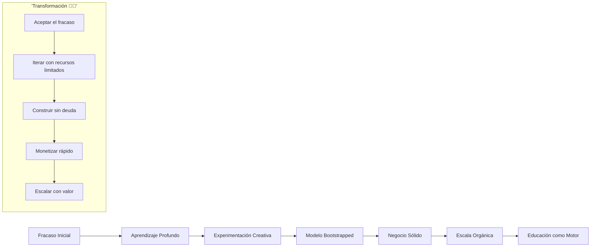
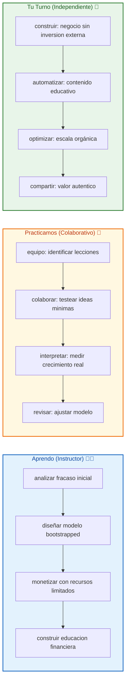

# 🚀 MASTERCLASS: De Fracaso a Referente — La Hoja de Ruta Emprendedora de Ariel Mamani 🔥🧠

## 🎯 INTRODUCCIÓN: POR QUÉ ESTE MASTERCLASS ES DIFERENTE 💡

La mayoría de las historias de éxito ocultan las caídas iniciales. Pero Ariel Mamani, fundador de Inverarg, nos muestra la verdad: **el emprendimiento es una acumulación de fracasos inteligentes**.

Este masterclass revela cómo transformar intentos fallidos en un imperio de educación financiera, usando un modelo bootstrapped que prioriza la sostenibilidad sobre la escalada agresiva.

> **🎯 Objetivo de Aprendizaje** — Al final de esta guía, entenderás el camino real del emprendedor, construirás tu modelo de negocio sin depender de inversores externos y tendrás un framework para escalar con educación y valor real.

> **⚠️ Advertencia** — Este contenido es formativo. El emprendimiento requiere acción constante. No hay atajos, solo sistemas probados y adaptados a la realidad local.

---

## 🗺️ MAPA DEL WORKFLOW DEL EMPRENDEDOR INTELIGENTE 🗺️🚀



| Fase 🌍 | Pregunta clave ❓ | Output principal 🎯 |
|--------|------------------|------------------|
| **Fracaso Inicial** 💥 | ¿Qué no funcionó y por qué? | Lecciones identificadas |
| **Aprendizaje Profundo** 📚 | ¿Qué descubrí en la caída? | Mentalidad regenerada |
| **Experimentación Creativa** 🎯 | ¿Cómo uso recursos existentes? | Solución innovadora |
| **Modelo Bootstrapped** 💪 | ¿Cómo crezco sin deuda? | Negocio autosuficiente |
| **Negocio Sólido** 🏗️ | ¿Qué es escalable hoy? | Fundamento estable |
| **Escala Orgánica** 📈 | ¿Cómo multiplicar sin apurar? | Crecimiento sostenible |
| **Educación como Motor** 🎓 | ¿Qué conozco que puedo enseñar? | Propuesta de valor única |

---



---

## 📚📖 PARTE 1: LOS FRACSOS QUE CONSTRUYERON EL ÉXITO 💥✨🔥📉

### 1.1 💥🔥 fijoplazo.com e Inverarg.com: lecciones de caída 📉📚⚠️

Ariel comenzó con proyectos web que fracasaron por:
- **Falta de tráfico orgánico**: sin estrategia de crecimiento
- **Rechazo de Google Ads**: contenido no alineado con políticas publicitarias
- **Ausencia de comunidad**: sin audiencia comprometida

Pero estos fracasos fueron la base para entender **qué necesita el mercado real**.

### 1.2 📊📋 Tabla de aprendizaje post-fracaso 📉➡️✅

| Error cometido 🚫 | Lección aprendida ✅ | Acción correctiva ⚡ |
|------------------|---------------------|-------------------|
| Crear sin audiencia | Construir comunidad primero | Validar demanda antes de invertir |
| Depender de ads | Generar tráfico orgánico | Diversificar canales de adquisición |
| Esperar herramientas perfectas | Usar lo disponible | Empezar con recursos mínimos |
| Enfocarse en tecnología | Resolver un problema real | Priorizar problema > solución |

### 1.3 🛠️ Framework: convertir fracaso en aprendizaje

```
💥 Diario post-fracaso:
1. ¿Qué intenté y no funcionó?
2. ¿Qué señales ignore en el camino?
3. ¿Qué recursos tuve disponibles?
4. ¿Qué haría diferente con lo que sé ahora?
5. ¿Qué próximo experimento hará mejor?
```

---

## 🎬 PARTE 2: EL SALTO A YOUTUBE CON RECURSOS ZERO 🎥✨🚀📱💰

### 2.1 🎥 Creatividad ante la escasez

Sin cámaras ni micrófonos profesionales, Ariel usó:
- Grabación de pantalla con audio de celular
- Computadoras del hospital donde trabajaba
- Estrategia de reproducción manual para visualizaciones
- Contenido auténtico sin producción impecable

La clave: **empezar antes de estar listo**.

### 2.2 📊 Estrategia de crecimiento orgánico

| Acción ⚡ | Recurso usado | Resultado 🎯 |
|----------|---------------|-------------|
| Grabación inicial | Celular + pantalla | Primer contenido publicado |
| Generar vistas | PCs del hospital | 100 visualizaciones base |
| Monetización | YouTube partner | Ingresos en 2 meses |
| Validar audiencia | Comentarios reales | Feedback inmediato |

### 2.3 🛠️ Ejercicio: bootstrap tu primer contenido

```
🎥 Plan de acción mínima:
1. Elige un problema que conozcas bien
2. Graba con el celular (sin editar)
3. Publica en 1 plataforma esta semana
4. Genera 5 visualizaciones manualmente
5. Registra feedback de 3 personas
```

---

## 💪🚀 PARTE 3: EL MODELO BOOTSTRAPPED SIN DEUDA 💪💰🏦📈

### 3.1 💪 Crecimiento orgánico sin deuda externa

El modelo bootstrapped se basa en:
- **Autofinanciación**: usando ingresos para crecer
- **Sin VC ni deuda**: control total del negocio
- **Enfoque en utilidad**: valor real sobre métricas vanidad
- **Escalabilidad natural**: crecimiento sostenible

### 3.2 📊 Ventajas del bootstrapped vs startup tradicional

| Startup Tradicional 🚫 | Bootstrapped ✅ |
|---------------------|----------------|
| Deuda externa | Sin obligaciones financieras |
| Presión por métricas | Enfoque en utilidad real |
| Pérdida de control | Control total |
| Riesgo elevado | Riesgo gestionado |
| Dependencia de inversores | Independencia operativa |

### 3.3 🛠️ Script para validar modelo bootstrapped

```
💪 Validación de modelo:
1. ¿Qué problema resuelves con recursos actuales?
2. ¿Cómo generarías primeros $100 sin inversión?
3. ¿Qué cliente pagaría por esto hoy?
4. ¿Qué escala sin gastar más dinero?
5. ¿Qué te da control total del negocio?
```

---

## 🏢⚡ PARTE 4: NEGOCIO SÓLIDO VS NEGOCIO RÁPIDO 🏗️✨🔨⚠️

### 4.1 🏗️ La diferencia entre ambos enfoques

| Negocio rápido 🚫 | Negocio sólido ✅ |
|------------------|------------------|
| Crecimiento artificial | Crecimiento orgánico |
| Sin fundamento real | Con propósito claro |
| Depende de favoritismos | Se sustenta en valor |
| Se derrumba con crisis | Se adapta a realidades |
| Quema para encender | Arde sin apagarse |

### 4.2 📊 Indicadores de negocio sólido

| Métrica clave 📊 | Pregunta de validación ❓ | Señal positiva ✅ |
|------------------|------------------------|------------------|
| Retención de clientes | ¿Regresan por más? | >70% mensual |
| Costo de adquisición | ¿Qué invertiste para vender? | Menos que el valor |
| Diversificación | ¿Dependes de un canal? | Al menos 3 fuentes |
| Rentabilidad real | ¿Cuánto ganaste hoy? | Positivo sin fintas |

### 4.3 🛠️ Framework: construir sin apurar

```
🏗️ Sistema de construcción:
1. Enfócate en el problema real del día 1
2. Genera ingresos antes de escalar
3. Reinvierte ganancias en mejora
4. Documenta cada paso para replicar
5. Mide utilidad, no vanidad
```

---

## 🎓📊 PARTE 5: EDUCACIÓN FINANCIERA COMO MOTOR 🎓✨🧠💡🚀

### 5.1 🎓 La educación como activo escalable

En Argentina, donde los recursos son limitados, la educación:
- **No requiere inventario físico**
- **Crece exponencialmente con contenido**
- **Se monetiza múltiples veces**
- **Genera comunidad fiel**

### 5.2 📊 Modelo Inverarg vs Finit

| Inverarg (marca personal) 📱 | Finit (empresa) 🏢 |
|---------------------------|-------------------|
| Contenido gratuito | Formación pagada |
| Financiado por marcas | Diplomaturas universitarias |
| Audiencia masiva | Clientes institucionales |
| Educación financiera | Capacitación bancaria |
| Validación social | Credencial académica |

### 5.3 🛠️ Estrategia: educar para escalar

```
🎓 Framework educativo:
1. Identifica lo que ya sabes (y otros no)
2. Enseña de forma simple y práctica
3. Usa ejemplos locales relevantes
4. Genera comunidad alrededor del tema
5. Monetiza con soluciones avanzadas
```

---

## 📈💰 PARTE 6: VISIÓN INVERSORÍA CONSERVADORA 📈✨📊🏛️⚖️

### 6.1 📈 Postura realista frente al especulador

Ariel prefiere el S&P 500 por su:
- **Historia de 100+ años**
- **Resiliencia ante crisis**
- **Diversificación natural**
- **Menor volatilidad extrema**

Frente a Bitcoin y activos nuevos:
- Mayor incertidumbre
- Menor historial comprobado
- Riesgo de pérdida total

### 6.2 📊 Tabla comparativa de inversiones

| Activo | Historia | Volatilidad | Diversificación | Recomendación Ariel |
|--------|----------|-------------|-----------------|-------------------|
| S&P 500 | 100+ años | Moderada | Alta | Base del portafolio |
| Bonos soberanos | 50+ años | Baja-Media | Variable | Estabilidad |
| Bitcoin | 15 años | Extrema | Nula | Riesgo especulativo |
| Acciones argentinas | 20+ años | Alta | Media | Conocimiento local |

### 6.3 🛠️ Principio: educación antes que especulación

```
📈 Enfoque inversor:
1. Domina lo básico antes de lo complejo
2. Prefiere lo comprobado sobre lo nuevo
3. Invierte tiempo en aprender, no en apostar
4. Diversifica antes de escalar posiciones
5. Piensa en décadas, no en días
```

---

## 🎓🚀 PARTE 7: I DO / WE DO / YOU DO — EJERCICIOS PRÁCTICOS 🎓✨🏫👥🎯

### 7.1 🏫 I Do — Analizar fracaso y lecciones

| Paso 🚶 | Acción ⚡ | Resultado esperado ✅ |
|------|--------|--------------------|
| 1️⃣ 💥 | Documentar intento fallido | Lista de errores identificados |
| 2️⃣ 📚 | Extraer 3 lecciones clave | Aprendizajes aplicables |
| 3️⃣ 🎯 | Diseñar experimento mínimo | Acción con recursos actuales |
| 4️⃣ 💡 | Validar hipótesis en 7 días | Feedback real obtenido |

### 7.2 👥 We Do — Testear ideas con comunidad

**Tarea colaborativa:** cada integrante comparte:

```
👥 Diario grupal:
1. Mi proyecto fallido fue...
2. Las lecciones aprendidas son...
3. El experimento con recursos mínimos...
4. El feedback recibido fue...
5. El siguiente paso es...
```

### 7.3 🎯 You Do — Construir negocio bootstrapped

**Tarea:** crea tu plan personal:

| Sistema 🛠️ | Acción ⚡ | Alerta 🔔 |
|------------|---------|----------|
| 💥 Análisis | Documentar fracaso útil | Sin lecciones en 7 días |
| 🎥 Contenido | Primer video publicado | Sin publicar en 14 días |
| 💰 Monetización | Primer $10 generado | Sin ingresos en 30 días |
| 🎓 Educación | Clase sobre tu expertise | Sin compartir en 21 días |
| 📈 Escalado | Mejora basada en feedback | Sin iterar en 15 días |

---

## ✅🏆 PARTE 8: CHECKLIST FINAL 🏁✨✔️🎯💪

| Bloque 🧩 | Check ✅ |
|--------|-------|
| **Fracaso analizado** | 🤔 Lecciones identificadas claramente |
| **Modelo bootstrap definido** | 💪 Sistema sin depender de externos |
| **Primer contenido publicado** | 🎥 Mínimo viable compartido |
| **Primeros ingresos generados** | 💰 Monetización validada |
| **Comunidad inicial formada** | 👥 Audiencia comprometida |
| **Educación como motor** | 🎓 Conocimiento compartido |
| **Conservadurismo aplicado** | 📈 Estrategia realista |

---

## 📝🔍 PARTE 9: PREGUNTAS DE VERIFICACIÓN 📝✨❓💭🎯

Responde cada pregunta basándote en los conceptos de esta master class. Escribe tus respuestas o compártelas para profundizar tu aprendizaje. 📝

### Preguntas sobre fracasos y aprendizaje

1. **💥 Aplica**: ¿Qué proyecto intentaste y no funcionó? ¿Qué 3 lecciones aprendiste que aplicarás al siguiente?

2. **🔍 Analiza**: ¿Has caído en la tentación de esperar "estar listo" antes de lanzar algo? ¿Qué recursos tienes disponibles ahora?

### Preguntas sobre modelo bootstrapped

3. **💪 Diseña**: ¿Qué problema podrías resolver sin necesidad de inversión externa? Diseña el experimento mínimo para validar.

4. **🎯 Evalúa**: ¿Qué te detiene de generar tus primeros $10 con lo que ya sabes? ¿Cuál es el primer paso concreto?

### Preguntas sobre educación financiera

5. **🎓 Reflexiona**: ¿Qué conocimiento tienes que podría ser útil para otros? ¿Cómo empezarías a enseñarlo esta semana?

6. **📈 Calcula**: Si dedicas 30 minutos diarios a crear contenido educativo, ¿qué impacto tendrías en 6 meses?

### Preguntas Integradoras

7. **🔗 Conecta**: ¿Cómo se relaciona el miedo al fracaso con la dependencia de inversión externa?

8. **💡 Propón un sistema**: Diseña un sistema de 30 días para validar un negocio bootstrapped que combine contenido y educación.

---

## 📚 GLOSARIO RÁPIDO 📖✨

| Término 📝 | Definición 📋 |
|---------|------------|
| **Bootstrapped** 💪 | Crecimiento sin deuda ni capital externo |
| **Negocio sólido** 🏗️ | Empresa que se sustenta en utilidad real |
| **Educación financiera** 🎓 | Conocimiento para tomar decisiones económicas |
| **Crecimiento orgánico** 📈 | Expansión natural sin adquisición forzada |
| **Monetización temprana** 💰 | Generar ingresos antes de escalar |
| **Contenido auténtico** 🎥 | Material real sin producción impecable |
| **Escalabilidad real** 📊 | Capacidad de multiplicar sin proporcional gastar |

---

## 📐 ANEXO: FORMATO IDEAL PARA MASTERCLASS EDUCATIVAS 📐✨

### 📏 Estructura visual recomendada 📏✨

El ancho óptimo 📏 para masterclasses educativas es **60–75 caracteres por línea** 📐.

```css
.article-content {
  🎨 font-size: 18px;
  📏 line-height: 1.75;
  📐 max-width: 65ch;
}
```

### 🎯 CIERRE PRÁCTICO 🎯✨

| Nivel 📊 | Debes poder hacer ✨ |
|-------|------------------|
| **🏫 I Do** | ✅ Transformar fracaso en aprendizaje aplicado |
| **👥 We Do** | 🤝 Validar ideas con comunidad real |
| **🎯 You Do** | 🚀 Construir negocio autosuficiente |

---

## 🎁 RECURSOS ADICIONALES 🎁✨

- 📖 [📚 Ariel Mamani - Inverarg](https://inverarg.com)
- 🎥 [🎬 Entrevista original: "De Fracaso a Referente"]
- 💻 [💻 Plataformas: YouTube, Substack, LinkedIn]
- 🛠️ [🛠️ Libros: "Financial Intelligence", "The E-Myth Revisited"]

---

**🎉 Felicitaciones! Has completado la masterclass del emprendedor bootstrapped. 🧠 Ahora tienes el mapa para transformar fracasos en negocios sólidos, usando educación como motor de crecimiento.**

> **💡 Próximo paso:** La próxima vez que tengas una idea, grábala con tu celular. Publica antes de editar. Genera tus primeros $10 con eso. El mundo premia la acción imperfecta sobre la perfección paralizada.