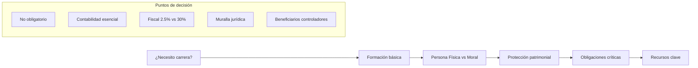
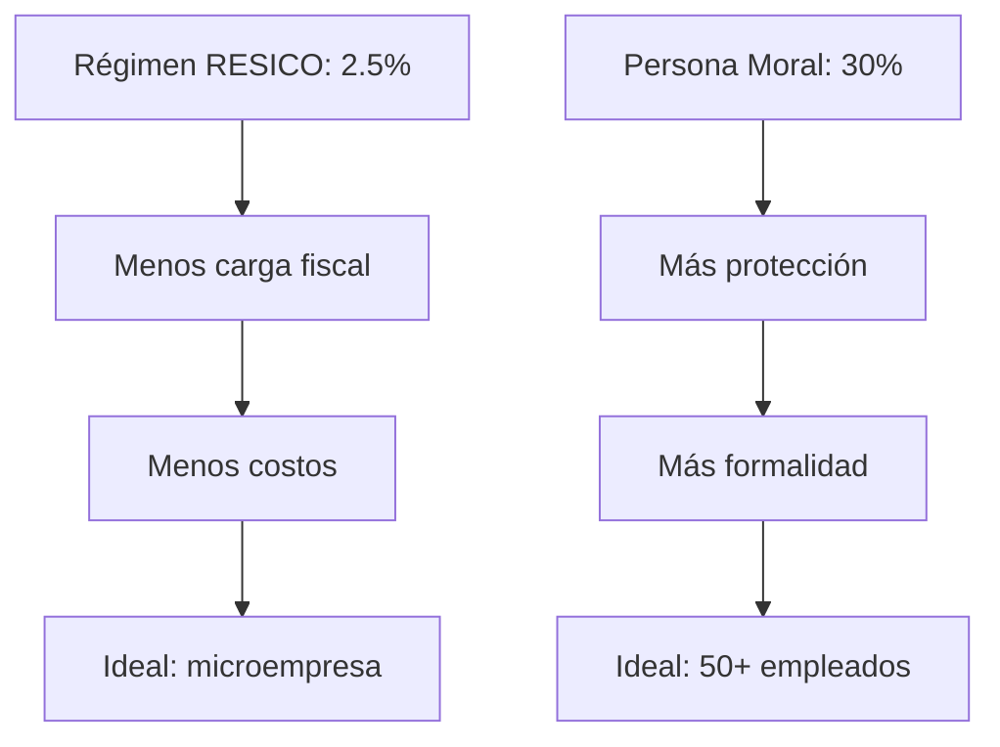
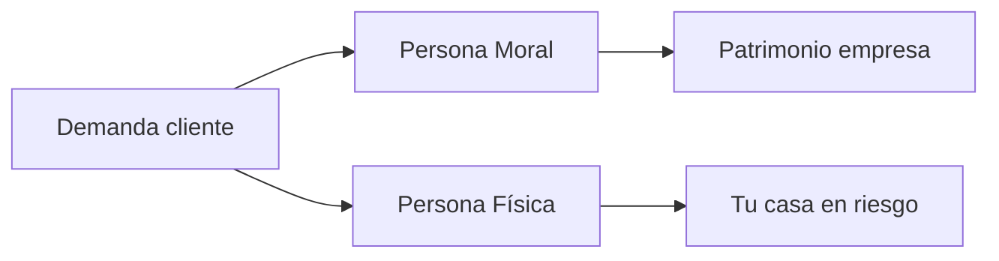
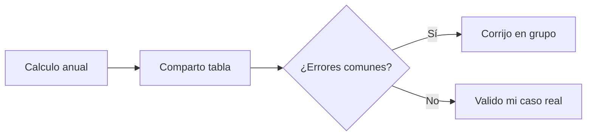
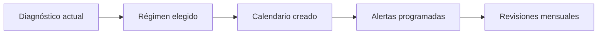

# MASTERCLASS: Guía Completa para Empezar tu Negocio - Sin Licenciatura Obligatoria 💼💰

## INTRODUCCIÓN: POR QUÉ ESTA MASTERCLASS ES DIFERENTE 🚀

> **🎯 Objetivo de Aprendizaje** — Al final de esta guía, podrás iniciar un negocio sin licenciatura, elegir entre persona física/moral según tu caso, cumplir obligaciones críticas y acceder a recursos especializados.

> **⚠️ Advertencia educativa** — Este contenido es formativo. La fiscalidad cambia según legislación y país. Consulta a un contador público certificado.

---

## MAPA DEL WORKFLOW 🔄



---

## PARTE 1: ¿QUIÉN PUEDE SER EMPRENDEDOR? - NO HAY LICENCIATURA OBLIGATORIA 🎯

### 1.1 Principio Central: El talento > el título 🎨

> **💡 Insight (0:12-2:20)**: No necesitas licenciatura. Necesitas: disciplina + talento + producto/servicio que resolver.

### 1.2 Los 3 elementos indispensables 🧩

| Elemento | Pregunta clave | Herramienta |
|----------|----------------|-------------|
| **Disciplina** | ¿Puedes operar sin supervisión? | Rutina + deadlines |
| **Talento** | ¿Qué haces mejor que otros? | Skill assessment |
| **Oferta** | ¿Qué problema resuelves? | Lean canvas |

---

## PARTE 2: FORMACIÓN BÁSICA RECOMENDADA - LO ESENCIAL PARA NO MORir de RUINA 📊

### 2.1 Conocimientos fundamentales (2:24-3:40) 📚

| Área | Por qué es crítico | Acción inmediata |
|------|-------------------|------------------|
| **Contabilidad** | Saber si ganas o pierdes | Curso básico 20h |
| **Legal** | Contratos + estructura | Constitución guía |
| **Laboral** | Nómina + IMSS | Registro patronal |
| **Fiscal** | Impuestos + declaraciones | SAT folletos |

### 2.2 Ruta de estudio acelerada 🚗

```python
# Plan de formación ejecutivo
def entrepreneur_basics():
    return {
        'semana_1': 'Contabilidad básica (YouTube: 2h/día)',
        'semana_2': 'Fiscalidad RESICO (SAT web)',
        'semana_3': 'Contratos simples (plantillas)',
        'semana_4': 'Impresos clave (acta constitutiva)'
    }

def monthly_review():
    return {
        'ingresos': '¿Cuánto entró?',
        'egresos': '¿Qué salió?',
        'utilidad': '¿Qué gané real?',
        'impuestos': '¿Cuánto pago real?'
    }
```

---

## PARTE 3: PERSONA FÍSICA VS PERSONA MORAL - LA DECISIÓN FISCAL ⚖️

### 3.1 Comparativa directa 💰



### 3.2 Tabla comparativa 📊

| Aspecto | Persona Física (RESICO) | Persona Moral |
|---------|-------------------------|---------------|
| **Impuesto máximo** | 2.5% sobre ingresos | 30% sobre utilidad |
| **ISR retén** | Sí (1.25%) | Sí (30%) |
| **IVA** | No genera | Sí genera |
| **Costos operativos** | Mínimos | Altos (contador + filing) |
| **Declaraciones** | Mensual + anual | Mensual + anual + IMSS |
| **Facturación** | Sí (hasta límites) | Sí (ilimitada) |

### 3.3 Código decisivo 🤖

```python
# Algoritmo para elegir régimen
def choose_regimen(mensual_bruto, empleados, riesgo):
    if mensual_bruto <= 250000 and empleados == 0 and riesgo == "bajo":
        return "Persona Física RESICO"
    if mensual_bruto > 250000 or empleados > 3 or riesgo == "alto":
        return "Persona Moral"
    return "Consulta contador"
```

---

## PARTE 4: PROTECCIÓN PATRIMONIAL - LA MURALLA JURÍDICA 🛡️

### 4.1 Separación de patrimonios (11:19-13:40) ⚡

> **🛡️ Concepto**: La persona moral = entidad separada. Te protege de demandas y deudas empresariales.

### 4.2 Escenarios protegidos 🛡️



### 4.3 Protocolo de protección 🏰

```python
# Checklist protección patrimonial
def protect_assets():
    return {
        'paso_1': 'Constituir persona moral',
        'paso_2': 'Acta + testimonio público',
        'paso_3': 'Separar cuentas bancarias',
        'paso_4': 'Contratos con empresa no persona',
        'paso_5': 'Seguro de responsabilidad civil'
    }
```

---

## PARTE 5: OBLIGACIONES CRÍTICAS - NO MORIRAS DE MULTA ⚠️

### 5.1 Beneficiarios controladores (9:00-9:10; 14:15-14:56) 🪪

> **🚨 Ley 2022**: Identificar a quien controla económicamente. Multa hasta $100,000 si no.

### 5.2 Obligaciones mensuales por régimen 📅

| Obligación | PF ISR | PF IVA | PM ISR | PM IVA |
|------------|--------|--------|--------|--------|
| Declaración | Mensual | No aplica | Mensual | Mensual |
| Pago | 17 | 17 | 17 | 17 |
| Nómina | No | No | Sí | Sí |
| Beneficiarios | Sí | Sí | Sí | Sí |

### 5.3 Calendario fiscal esencial 📆

```python
# Recordatorios automáticos
def fiscal_calendar():
    return {
        'dia_17': 'Declarar ISR',
        'dia_18': 'Pagar ISR',
        'entrega_5': 'Nómina mensual',
        'entrega_17': 'Beneficiarios actualizados',
        'anual_abril': 'Declaración anual'
    }
```

---

## PARTE 6: RECURSOS RECOMENDADOS - LOS LIBROS CLAVE 📚

### 6.1 Guía Fiscal para Empresarios - Marvin Alfredo Gómez Ruiz 📘

**Tesis principal**: Simplificar la fiscalidad para pymes sin complicaciones innecesarias.

| Capítulo | Tema | Acción |
|----------|------|--------|
| **1. RESICO** | Régimen simplificado | Verifica si calificas |
| **2. ISR/ISEM** | Retenciones y trámite | Calcula tu tasa real |
| **3. IVA** | Facturación y créditos | Optimiza gastos deducibles |
| **4. Nómina** | Contratación y obligaciones | Calcula costo total empleado |
| **5. Contratos** | Tipos y cláusulas | Usa plantillas validadas |

### 6.2 El Libro Negro del Emprendedor - Fernando Trías de Bes 📖

**Tesis principal**: Los errores fiscales matan empresas más que la falta de clientes.

| Error común | Costo real | Solución |
|-------------|------------|----------|
| **No separar patrimonio** | Pierdes casa | Persona moral urgente |
| **Facturar sin registrar** | Multa 100% | SAT al día siempre |
| **Pagar IVA por adelantado** | Efectivo estancado | Créditos + solicitud |
| **Contratos verbales** | Demandado sin prueba | Todo por escrito |
| **Egresos mal documentados** | No deducibles | Facturas + clasificación |

### 6.3 Framework de lectura acelerada ⚡

```python
# Sistema para procesar libros de negocios
def business_book_system():
    return {
        'día_1': 'Lee índice + 3 capítulos intro',
        'día_2': 'Subraya 5 ideas clave',
        'día_3': 'Resume en 1 página',
        'día_4': 'Aplica 1 técnica a tu negocio',
        'día_5': 'Comparte en LinkedIn'
    }
```

---

## PARTE 7: I DO / WE DO / YOU DO - EJERCICIOS PROGRESIVOS 🎓

### 7.1 I Do — Evaluación de tu caso real 📊

**Objetivo**: Decidir tu régimen en 15 minutos

| Paso | Acción | Resultado |
|------|--------|-----------|
| 1 | Ingresos mensuales estimados | $______ |
| 2 | Número de empleados esperados | ___ |
| 3 | Nivel de riesgo legal | Bajo/Medio/Alto |
| 4 | Aplica algoritmo | Persona _____ |
| 5 | Agenda primer paso | _____ |

### 7.2 We Do — Análisis grupal de obligaciones 🧑‍🤝‍🧑

**Ejercicio**: Compartir cálculo de impuestos real



### 7.3 You Do — Sistema personal de cumplimiento 🚀

**Tarea**: Diseña tu sistema fiscal para 6 meses



**Checklist de implementación**:

- [ ] Calculo tus ingresos mensuales proyectados
- [ ] Identifica beneficiarios controladores hoy
- [ ] Agenda cita con contador certificado
- [ ] Compra ambos libros recomendados
- [ ] Configura recordatorios fiscales
- [ ] Separa cuentas bancarias personales/empresa

---

## PREGUNTAS DE VERIFICACIÓN 📝

1. **Aplica**: ¿Cuál régimen elegirías con $150,000/mes y 2 empleados? ¿Por qué?

2. **Analiza**: ¿Qué obligación fiscal crees que es más peligrosa no cumplir? ¿Cómo la resolverías?

3. **Diseña**: Crea tu stack de aprendizaje fiscal. ¿Qué libro lees primero y por qué?

4. **Reflexiona**: Si pierdes tu patrimonio personal por error fiscal, ¿qué aprendizaje tomas para el futuro?

---

## GLOSARIO RÁPIDO 📚

| Término | Definición | Emoji |
|---------|------------|-------|
| **RESICO** | Régimen simplificado | 📉 |
| **Beneficiario controlador** | Dueño real económico | 🪪 |
| **Muralla jurídica** | Separación patrimonial | 🛡️ |
| **ISR** | Impuesto sobre la Renta | 💵 |
| **IVA** | Impuesto al Valor Agregado | 🧾 |
| **Nómina** | Pago a empleados | 👥 |

---

## RECURSOS ADICIONALES 📦

### Herramientas fiscales online 📱
- **SAT**: Portal único para declara
- **Contpaqi**: Software contable básico
- **Facturama**: Facturación electrónica

### Plantillas esenciales 📄
- Acta constitutiva (plantilla SAT)
- Contrato de prestación servicios
- Formato beneficiarios controladores
- Plantilla de flujo de efectivo

### Comunidades de apoyo 👥
- Foro de Emprendedores México
- Reddit: r/mexicoFinanzas
- Meetup: Negocios y emprendimiento