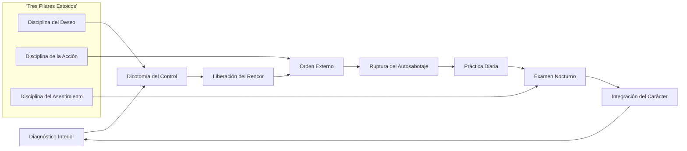
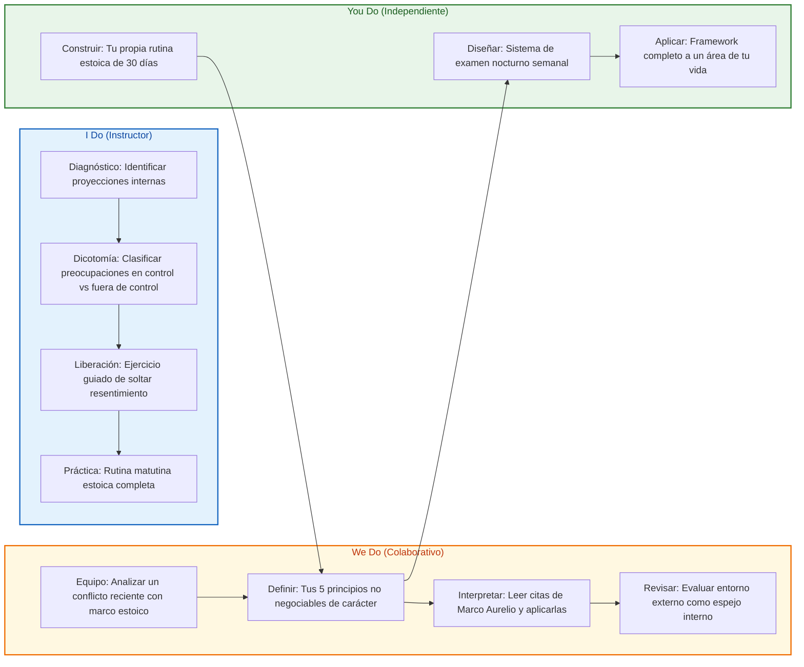
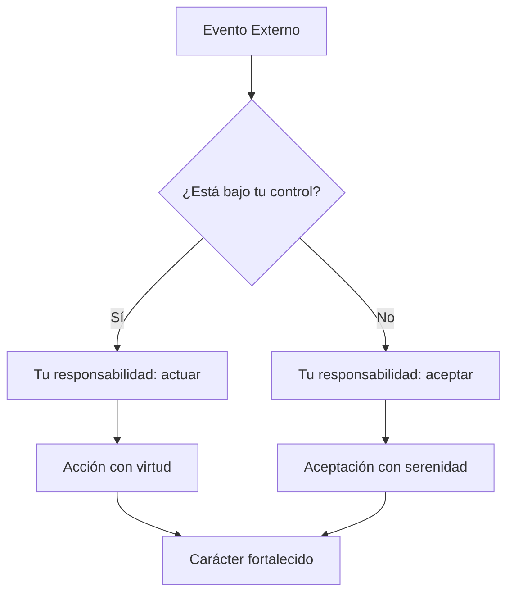
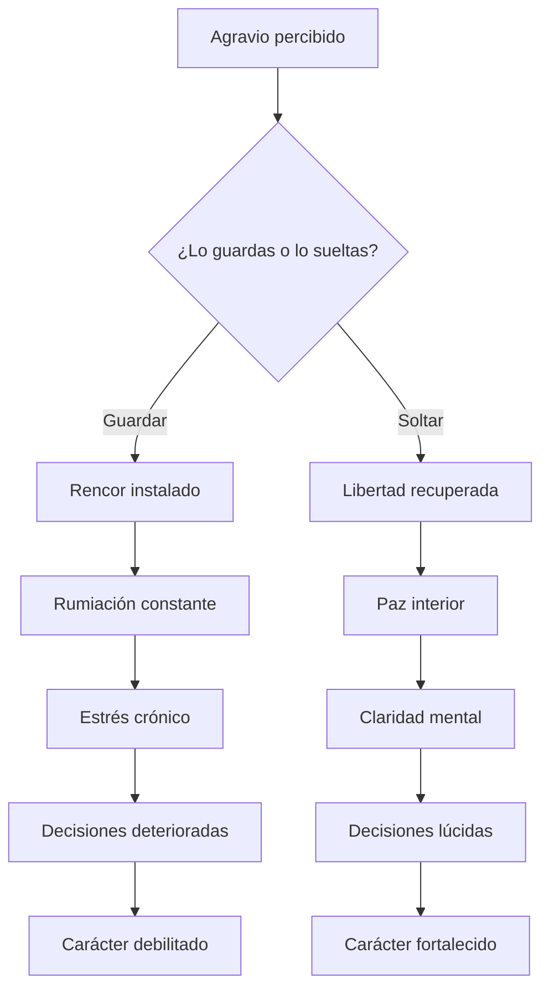
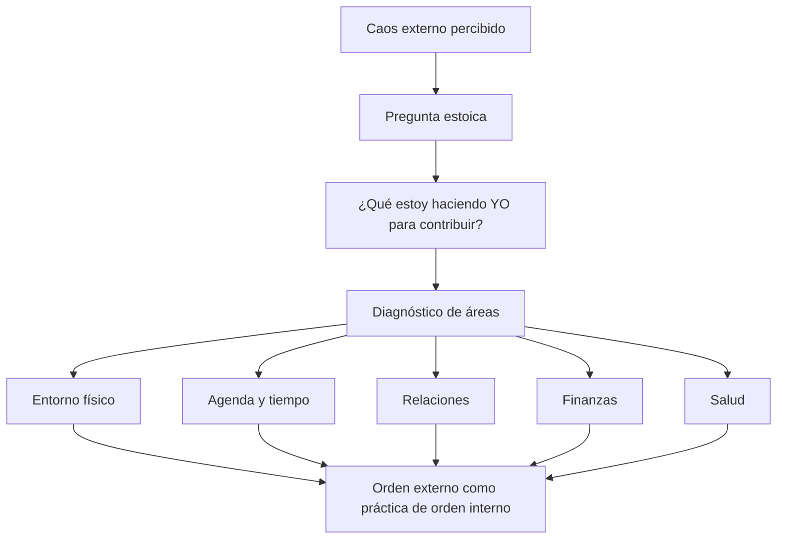
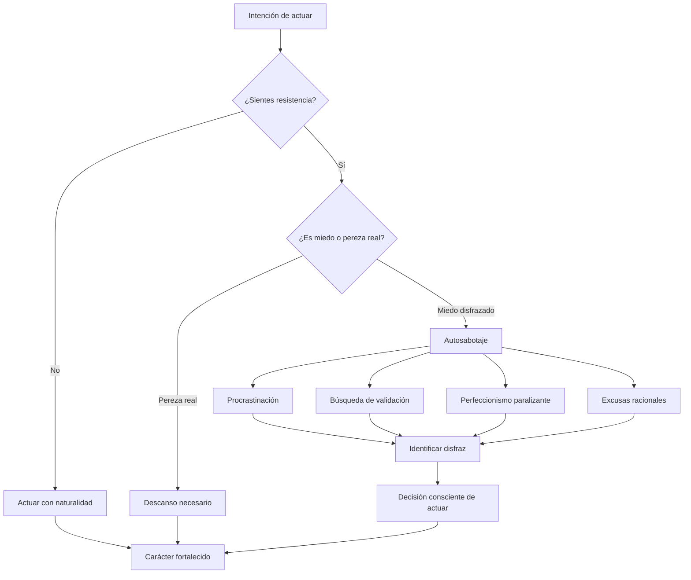
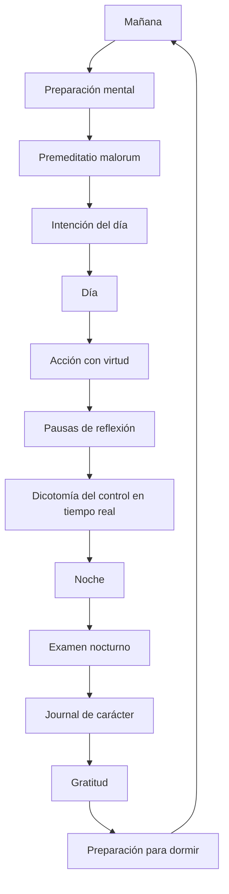

# MASTERCLASS: Arquitectura del Carácter — Estoicismo Aplicado para Tomar Responsabilidad Total

## INTRODUCCIÓN: POR QUÉ ESTA MASTERCLASS ES DIFERENTE

La mayoría de los contenidos de desarrollo personal te dicen qué hacer: levántate temprano, medita, lee más, ahorra. Pero casi nunca te dicen **dónde poner el foco**. El resultado es una acumulación de técnicas sin dirección, motivación sin fundamento y hábitos sin raíz.

Esta masterclass propone otro camino: un **sistema operativo mental** basado en más de 2.000 años de filosofía práctica. No se trata de acumular información, sino de **reestructurar la relación que tienes contigo mismo**.

El argumento central es directo: gran parte del caos externo que experimentas es un **reflejo de tu desorden interno**. El mundo no es tu problema. Tú eres el problema — y por lo tanto, tú eres la solución.

> **Objetivo de Aprendizaje** — Al final de esta guía, tendrás un marco práctico para diagnosticar tu estado interior, aplicar los principios estoicos fundamentales, construir prácticas diarias de autoconciencia y transformar tu carácter con disciplina filosófica.

> **Advertencia educativa** — Este contenido es formativo y filosófico. No sustituye atención psicológica o psiquiátrica profesional. Si experimentas crisis emocionales severas, busca ayuda especializada.

---

## MAPA DEL WORKFLOW INTERIOR



| Fase | Pregunta que responde | Output principal |
|------|-----------------------|------------------|
| **Diagnóstico Interior** | ¿Qué desorden interno estoy proyectando afuera? | Mapa de causas internas |
| **Dicotomía del Control** | ¿Qué depende de mí y qué no? | Lista de enfoque vs aceptación |
| **Liberación del Rencor** | ¿A quién le estoy dando poder sobre mi mente? | Carta de liberación interior |
| **Orden Externo** | ¿Qué puedo ordenar hoy que refleje mi estado interior? | Entorno alineado con carácter |
| **Ruptura del Autosabotaje** | ¿Cómo me estoy saboteando y por qué? | Patrón identificado y roto |
| **Práctica Diaria** | ¿Qué rituales sostienen mi transformación? | Rutina estoica integrada |
| **Examen Nocturno** | ¿Qué hice bien, qué falló, qué mejoraré? | Journal de carácter |
| **Integración del Carácter** | ¿Mi vida refleja mis valores o mis impulsos? | Coherencia entre ser y hacer |



---

## PARTE 1: DEJA DE MIRAR AFUERA — LA DICTOMÍA DEL CONTROL

### 1.1 Principio Central

Marco Aurelio escribió en *Meditaciones*:

> *"Si te afliges por algo externo, no es esa cosa la que te perturba, sino tu propio juicio sobre ella. Y está en tu poder borrar ese juicio ahora mismo."*

El primer paso de la arquitectura del carácter es entender una verdad incómoda: **el mundo no es tu problema**. Tu reacción al mundo lo es. La mayoría del sufrimiento humano no proviene de lo que sucede, sino de lo que pensamos sobre lo que sucede.



### 1.2 La Dicotomía del Control

Epicteto abrió su *Enquiridión* con esta distinción fundamental:

> *"Hay cosas que dependen de nosotros y cosas que no dependen de nosotros."*

| Depende de ti | No depende de ti |
|---------------|------------------|
| Tus pensamientos | El clima |
| Tus decisiones | La economía |
| Tus acciones | Lo que otros piensan de ti |
| Tus valores | El pasado |
| Tu carácter | La genética |
| Tu esfuerzo | Los resultados exactos |
| Tu respuesta emocional | Las acciones de otros |
| Tu atención | Las noticias |
| Tus hábitos | La muerte |
| Tu integridad | La opinión pública |

### 1.3 El costo de mirar afuera

| Síntoma de mirar afuera | Costo real | Raíz interna |
|--------------------------|------------|--------------|
| Quejarse del gobierno | Impotencia crónica | No votar, no participar, no informarse |
| Culpar a la pareja | Relaciones tóxicas | No comunicar necesidades, no poner límites |
| Odio al jefe | Estancamiento profesional | No desarrollar habilidades, no buscar alternativas |
| Frustración con el tráfico | Estrés diario | No planificar horarios, no aceptar lo incontrolable |
| Resentimiento por la economía | Parálisis financiera | No educarse, no invertir, no emprender |
| Culpar a los padres | Victimismo permanente | No hacer el trabajo interior de sanación |

### 1.4 Ejercicio: Clasificador de Preocupaciones

```python
class ClasificadorControl:
    def __init__(self):
        self.bajo_mi_control = []
        self.fuera_de_mi_control = []
        self.parcialmente_control = []

    def clasificar(self, preocupacion: str) -> str:
        preguntas_diagnostico = {
            "¿Puedo cambiar esto con una acción directa?": "bajo_mi_control",
            "¿Puedo influir pero no controlar completamente?": "parcialmente_control",
            "¿Esto sucede independientemente de lo que yo haga?": "fuera_de_mi_control",
        }
        return preguntas_diagnostico

    def transformar(self, preocupacion: str, categoria: str) -> dict:
        acciones = {
            "bajo_mi_control": {
                "accion": "Actuar con virtud y excelencia",
                "enfoque": "Máxima atención y esfuerzo",
                "mentalidad": "Responsabilidad total",
            },
            "parcialmente_control": {
                "accion": "Influir con lo que sí controlas",
                "enfoque": "Hacer tu parte, soltar el resultado",
                "mentalidad": "Participación sin apego",
            },
            "fuera_de_mi_control": {
                "accion": "Aceptar con serenidad",
                "enfoque": "No gastar energía en resistencia",
                "mentalidad": "Amor fati — amar lo que sucede",
            },
        }
        return {
            "preocupacion": preocupacion,
            "categoria": categoria,
            **acciones[categoria],
        }

    def revision_nocturna(self) -> dict:
        return {
            "total_clasificadas": len(self.bajo_mi_control) + len(self.fuera_de_mi_control) + len(self.parcialmente_control),
            "energia_mal_gastada": len(self.fuera_de_mi_control),
            "energia_bien_invertida": len(self.bajo_mi_control),
            "sabiduria_practicada": len(self.parcialmente_control),
        }
```

### 1.5 Marco Aurelio: El emperador que se recordaba a sí mismo

Marco Aurelio era el hombre más poderoso del mundo romano. Podía ordenar cualquier cosa. Sin embargo, sus *Meditaciones* no son un manual de poder, sino un diario de **autodominio**. Escribía para sí mismo, recordándose que:

- La fama es efímera
- El placer es temporal
- El dolor es tolerable
- La muerte es natural
- Solo el carácter es permanente

> *"Tienes poder sobre tu mente, no sobre los eventos externos. Date cuenta de esto y encontrarás tu fuerza."* — Marco Aurelio

### 1.6 Tabla de señales de que miras afuera

| Señal | Lo que dices | Lo que significa |
|-------|--------------|------------------|
| Culpa constante | "Es su culpa" | No asumes responsabilidad |
| Queja crónica | "Todo me pasa a mí" | Te ves como víctima |
| Impotencia aprendida | "No puedo hacer nada" | No exploras opciones |
| Comparación tóxica | "Él tiene más que yo" | Mides tu valor externamente |
| Resentimiento | "No merezco esto" | Crees que el mundo te debe |
| Procrastinación | "Cuando esté listo..." | Esperas condiciones perfectas |

---

## PARTE 2: EL RENCOR ES VENENO PROPIO — EPICTETO Y LA LIBERTAD INTERIOR

### 2.1 Principio Central

Epicteto nació esclavo. Vivió con una pierna rota. Fue exiliado. Y sin embargo, enseñó que **la verdadera libertad no es externa, sino interna**. Su enseñanza más radical:

> *"No son las cosas las que nos perturban, sino las opiniones que tenemos sobre ellas."*

Guardar rencor es beber veneno y esperar que el otro muera. Es regalarle a otra persona el control remoto de tu estado emocional. Cada minuto que pasas resentido es un minuto que no puedes recuperar.



### 2.2 Los costos reales del rencor

| Dimensión afectada | Costo del rencor | Alternativa estoica |
|--------------------|------------------|---------------------|
| **Salud física** | Cortisol elevado, inflamación, insomnio | Aceptación radical |
| **Salud mental** | Ansiedad, depresión, rumiación | Examen racional del juicio |
| **Tiempo** | Horas perdidas en pensamientos repetitivos | Redirección a lo productivo |
| **Relaciones** | Aislamiento, desconfianza, amargura | Perdón como liberación propia |
| **Decisiones** | Reacciones impulsivas, venganza | Respuestas deliberadas |
| **Energía** | Drenaje constante de vitalidad | Conservación para lo que importa |
| **Carácter** | Te conviertes en lo que odias | Virtud como antídoto |

### 2.3 Los tres niveles del resentimiento

| Nivel | Descripción | Ejemplo | Liberación |
|-------|-------------|---------|------------|
| **Superficial** | Molestia por ofensas menores | Alguien te corta en el tráfico | Recordar: no controlas a otros |
| **Profundo** | Heridas de relaciones significativas | Traición de un amigo cercano | Examinar el juicio, no el hecho |
| **Existencial** | Resentimiento contra la vida misma | "¿Por qué a mí?" | Amor fati: amar el destino |

### 2.4 Epicteto: El esclavo que era más libre que su amo

Epicteto enseñaba que hay una diferencia fundamental entre:

- **Esclavitud mental**: Creer que otros controlan tu felicidad
- **Libertad interior**: Decidir que solo tú determines tu estado

> *"No es suficiente ganar la libertad; hay que merecerla cada día."* — Epicteto (parafraseado)

Su vida demostró que la libertad no depende de las cadenas físicas, sino de las mentales. Un esclavo puede ser interiormente libre. Un emperador puede ser interiormente esclavo de sus pasiones.

### 2.5 Ejercicio: La Carta de Liberación

```python
class CartaLiberacion:
    def __init__(self, persona: str, agravio: str):
        self.persona = persona
        self.agravio = agravio
        self.juicios = []
        self.verdades = []
        self.liberaciones = []

    def examinar_juicio(self, juicio: str) -> dict:
        preguntas = [
            "¿Este juicio es un hecho o una interpretación?",
            "¿Puedo estar 100% seguro de que es verdad?",
            "¿Qué evidencia tengo en contra de este juicio?",
            "¿Qué pasaría si soltara este juicio?",
            "¿Este juicio me sirve o me daña?",
        ]
        return {
            "juicio": juicio,
            "examen": preguntas,
            "objetivo": "Separar hecho de interpretación",
        }

    def reconocer_dano_propio(self) -> list:
        return [
            f"Al guardar rencor hacia {self.persona}, yo pierdo...",
            "Horas de paz mental que no recuperaré",
            "Energía que podría usar para construir",
            "La capacidad de ver con claridad",
            "Mi salud física y emocional",
            "Mi tiempo finito en esta tierra",
        ]

    def decidir_liberar(self) -> str:
        return f"""
        Decido liberar a {self.persona} de la deuda que creo que tiene conmigo.
        No porque lo merezca, sino porque yo merezco paz.
        No porque lo que hizo estuvo bien, sino porque mi resentimiento no lo corrige.
        Suelto esto no por {self.persona}, sino por mí.
        """

    def transformar_en_ensenanza(self) -> dict:
        return {
            "pregunta": "¿Qué me enseñó esta experiencia?",
            "opciones": [
                "A poner mejores límites",
                "A no dar por sentado ciertas cosas",
                "A valorar mi propia paz sobre tener razón",
                "A practicar la compasión, incluso cuando es difícil",
                "A enfocarme en mi carácter, no en el de otros",
            ],
        }
```

### 2.6 Séneca: El poder de la perspectiva temporal

Séneca, consejero de Nerón y uno de los hombres más ricos de Roma, escribió:

> *"Nosotros sufrimos más en la imaginación que en la realidad."*

Su técnica favorita era la **vista desde arriba**: imaginar tu vida desde la perspectiva del cosmos. Desde esa altura, tus problemas se reducen a su tamaño real.

| Técnica de Séneca | Aplicación práctica |
|-------------------|---------------------|
| **Vista desde arriba** | Imagina tu problema desde el espacio |
| **Premeditatio malorum** | Visualiza lo peor antes de que suceda |
| **Memento mori** | Recuerda que morirás; esto aclara prioridades |
| **Tempus fugit** | El tiempo huye; no lo malgastes en resentimiento |

### 2.7 Tabla de señales de esclavitud emocional

| Señal | Lo que revelas | Camino a la libertad |
|-------|----------------|----------------------|
| Reaccionas con ira ante críticas | Tu valor depende de otros | Construye autoconocimiento |
| No puedes dejar de pensar en una ofensa | Le diste poder a otro | Examina el juicio, no el hecho |
| Buscas venganza o "justicia" | Confundes dolor con deuda | Perdona por ti, no por ellos |
| Sientes envidia constante | Mides tu vida contra otros | Define tu propio éxito |
| Te victimizas ante problemas | No asumes tu agencia | Pregúntate: ¿qué puedo hacer? |
| Rumias conversaciones pasadas | Vives en el pasado, no en el ahora | Practica atención plena |

---

## PARTE 3: TU ENTORNO REFLEJA TU MENTE — AUTOCONCIENCIA Y ORDEN EXTERIOR

### 3.1 Principio Central

Cuando sientes que la vida es caótica, pregúntate: **¿qué estás haciendo tú para contribuir a ese desorden?** El caos externo rara vez es completamente externo. Tu habitación, tu agenda, tus relaciones, tus finanzas — todo es un espejo de tu estado interior.



### 3.2 El entorno como espejo

| Área externa | Lo que refleja internamente | Pregunta de autoconciencia |
|--------------|----------------------------|----------------------------|
| **Habitación desordenada** | Mente dispersa, falta de disciplina | ¿Qué estoy evitando ordenar? |
| **Agenda sobrecargada** | Incapacidad de decir no, miedo a perderse algo | ¿Qué compromiso no debería haber aceptado? |
| **Relaciones tóxicas repetidas** | Patrones no examinados, baja autoestima | ¿Qué herida estoy repitiendo? |
| **Deudas acumuladas** | Gratificación instantánea, evasión | ¿Qué dolor estoy anestesiando con compras? |
| **Salud descuidada** | Falta de respeto propio, desconexión cuerpo-mente | ¿Por qué no me cuido? |
| **Proyectos abandonados** | Miedo al fracaso, perfeccionismo | ¿Qué excusa estoy usando para no terminar? |
| **Información sobrecargada** | Ansiedad, búsqueda externa de validación | ¿De qué verdad estoy huyendo? |
| **Procrastinación crónica** | Miedo, falta de claridad, desconexión de propósito | ¿Qué me está pidiendo hacer la vida? |

### 3.3 Zenón de Citio: El orden como virtud práctica

Zenón, fundador del estoicismo, enseñaba que la virtud no es abstracta. Se practica en lo cotidiano. El orden externo no es obsesión compulsiva; es **expresión visible de un interior en paz**.

> *"El hombre que pone su casa en orden, pone su alma en orden."* — Zenón (parafraseado)

### 3.4 Diagnóstico de desorden: del síntoma a la causa

```python
class DiagnosticoDesorden:
    def __init__(self):
        self.areas = {
            "entorno_fisico": [],
            "tiempo": [],
            "relaciones": [],
            "finanzas": [],
            "salud": [],
            "proyectos": [],
        }

    def sintoma_a_causa(self, sintoma: str) -> dict:
        mapeo = {
            "casa siempre desordenada": {
                "causa_interna": "Mente dispersa, falta de rituales de cierre",
                "practica": "10 minutos de orden cada noche",
                "principio": "El orden externo entrena el orden interno",
            },
            "agenda sin espacios vacíos": {
                "causa_interna": "Miedo al silencio, necesidad de validación",
                "practica": "Bloquear 1 hora diaria sin compromisos",
                "principio": "El ocio no es pereza; es espacio para pensar",
            },
            "deudas recurrentes": {
                "causa_interna": "Búsqueda de placer inmediato, evasión emocional",
                "practica": "Esperar 48 horas antes de cada compra no esencial",
                "principio": "La libertad financiera empieza por la libertad interior",
            },
            "relaciones tóxicas repetidas": {
                "causa_interna": "Heridas no sanadas, límites débiles",
                "practica": "Escribir los 5 patrones repetidos y su origen",
                "principio": "No puedes cambiar a otros, pero puedes cambiar a quién eliges",
            },
            "proyectos sin terminar": {
                "causa_interna": "Miedo al juicio, perfeccionismo, falta de claridad",
                "practica": "Terminar un proyecto pequeño esta semana",
                "principio": "Hecho es mejor que perfecto; la acción cura el miedo",
            },
            "salud descuidada": {
                "causa_interna": "Desconexión cuerpo-mente, falta de respeto propio",
                "practica": "Caminar 30 minutos diarios sin excusas",
                "principio": "Tu cuerpo es el templo de tu carácter",
            },
        }
        return mapeo.get(sintoma.lower(), {
            "causa_interna": "Examinar con honestidad qué estás evitando",
            "practica": "Journaling nocturno durante 7 días",
            "principio": "La autoconciencia precede al cambio",
        })

    def plan_orden_externo(self) -> list:
        return [
            {"dia": "Lunes", "area": "entorno_fisico", "accion": "Ordenar el escritorio completamente"},
            {"dia": "Martes", "area": "tiempo", "accion": "Revisar agenda y eliminar 1 compromiso innecesario"},
            {"dia": "Miércoles", "area": "finanzas", "accion": "Revisar gastos del mes y categorizar"},
            {"dia": "Jueves", "area": "relaciones", "accion": "Escribir a alguien con quien tienes tensión"},
            {"dia": "Viernes", "area": "salud", "accion": "Preparar comidas saludables para el fin de semana"},
            {"dia": "Sábado", "area": "proyectos", "accion": "Terminar un proyecto pendiente pequeño"},
            {"dia": "Domingo", "area": "todos", "accion": "Revisión semanal y planificación consciente"},
        ]
```

### 3.5 La regla del espejo

| Si ves esto afuera | Pregúntate esto adentro |
|--------------------|-------------------------|
| "Todo es un caos" | ¿Qué área de mi vida estoy neglectando? |
| "Nadie me ayuda" | ¿Estoy pidiendo ayuda claramente? |
| "Siempre me toca a mí" | ¿He establecido límites o asumo responsabilidades ajenas? |
| "No tengo tiempo" | ¿Qué estoy priorizando sobre lo que digo que importa? |
| "No puedo confiar en nadie" | ¿He sido confiable yo mismo? |
| "La vida es injusta" | ¿Estoy comparando mi interior con el exterior de otros? |

### 3.6 Ejercicio: La Auditoría del Entorno

```python
class AuditoriaEntorno:
    def __init__(self):
        self.areas_auditar = [
            "escritorio de trabajo",
            "dormitorio",
            "cocina",
            "baño",
            "espacio digital (emails, archivos)",
            "agenda y calendario",
            "cuentas bancarias y finanzas",
            "relaciones cercanas",
            "compromisos adquiridos",
            "hábitos de salud",
        ]

    def puntuar_area(self, area: str, puntuacion: int) -> dict:
        return {
            "area": area,
            "puntuacion": puntuacion,
            "escala": "1 (caos total) a 10 (orden completo)",
            "interpretacion": self._interpretar(puntuacion),
        }

    def _interpretar(self, puntuacion: int) -> str:
        if puntuacion <= 3:
            return "Desorden significativo. Reflejo de evitación o agotamiento."
        if puntuacion <= 6:
            return "Orden parcial. Hay áreas de negligencia consciente."
        if puntuacion <= 8:
            return "Buen orden. Mantenimiento necesario."
        return "Orden excelente. Posible rigidez; verificar flexibilidad."

    def identificar_patron(self, resultados: list) -> str:
        promedio = sum(r["puntuacion"] for r in resultados) / len(resultados)
        if promedio < 4:
            return "Patrón de evitación generalizada. El caos externo es síntoma de desorden interior profundo."
        if promedio < 7:
            return "Patrón selectivo. Ordenas lo que te importa, neglectas lo demás. Pregúntate: ¿qué no te importa y por qué?"
        return "Patrón de orden consistente. Tu entorno refleja tu interior."
```

---

## PARTE 4: ROMPER EL AUTOSABOTAJE — ZENÓN Y LA VIRTUD COMO DECISIÓN DIARIA

### 4.1 Principio Central

Zenón de Citio, fundador del estoicismo, enseñaba que **la virtud no es un talento innato, sino una decisión diaria**. El autosabotaje no es pereza; es miedo disfrazado. No es falta de capacidad; es falta de coraje para actuar cuando no tienes ganas.



### 4.2 Los disfraces del autosabotaje

| Disfraz | Lo que parece | Lo que es realmente | Antídoto estoico |
|---------|---------------|---------------------|------------------|
| **Procrastinación** | "Lo haré mañana" | Miedo al fracaso o al juicio | Actúa ahora, aunque sea imperfecto |
| **Perfeccionismo** | "Quiero hacerlo bien" | Miedo a ser visto como imperfecto | Hecho es mejor que perfecto |
| **Sobreanálisis** | "Necesito más información" | Miedo a decidir y equivocarte | Decide con el 70% de información |
| **Búsqueda de validación** | "Quiero que me aprueben" | Miedo a ser rechazado | Tu valor no depende de otros |
| **Excusas racionales** | "No es el momento adecuado" | Miedo a salir de la zona de confort | El momento perfecto no existe |
| **Comparación constante** | "Otros lo hacen mejor" | Miedo a no ser suficiente | Compite solo contigo mismo |
| **Victimismo** | "No tengo las oportunidades" | Miedo a tomar responsabilidad | ¿Qué puedes hacer con lo que tienes? |
| **Distracción crónica** | "Necesito entretenimiento" | Miedo al silencio y la introspección | 10 minutos de nada, sin pantallas |

### 4.3 La virtud como práctica, no como estado

Zenón enseñaba que la virtud (areté) no es algo que tienes, sino algo que **haces**. No es un título, sino una práctica. No es un destino, sino un camino.

| Virtud estoica | Significado | Práctica diaria |
|----------------|-------------|-----------------|
| **Sabiduría** | Distinguir lo que controlas de lo que no | Clasificar preocupaciones cada mañana |
| **Coraje** | Actuar a pesar del miedo | Hacer una cosa difícil cada día |
| **Justicia** | Tratar a otros con equidad | Practicar empatía activa |
| **Templanza** | Moderación en deseos y acciones | Decir no a una tentación diaria |

### 4.4 El ciclo del autosabotaje

```python
class CicloAutosabotaje:
    def __init__(self):
        self.fases = [
            "Intención",
            "Resistencia",
            "Disfraz racional",
            "Evitación",
            "Culpa",
            "Nueva intención",
        ]

    def identificar_fase(self, pensamiento: str) -> dict:
        patrones = {
            "mañana empiezo": {"fase": "Resistencia", "disfraz": "Procrastinación"},
            "necesito investigar más": {"fase": "Disfraz racional", "disfraz": "Sobreanálisis"},
            "no es el momento adecuado": {"fase": "Disfraz racional", "disfraz": "Excusa"},
            "mejor lo hago cuando me sienta listo": {"fase": "Disfraz racional", "disfraz": "Perfeccionismo"},
            "no es tan importante": {"fase": "Evitación", "disfraz": "Minimización"},
            "ya lo haré después": {"fase": "Evitación", "disfraz": "Postergación"},
            "no soy suficiente": {"fase": "Culpa", "disfraz": "Autocrítica destructiva"},
            "siempre fallo": {"fase": "Culpa", "disfraz": "Generalización"},
        }
        for patron, analisis in patrones.items():
            if patron in pensamiento.lower():
                return {
                    "pensamiento": pensamiento,
                    **analisis,
                    "intervencion": self._intervencion(analisis["disfraz"]),
                }
        return {
            "pensamiento": pensamiento,
            "fase": "Desconocida",
            "disfraz": "No identificado",
            "intervencion": "Examinar con honestidad: ¿qué estoy evitando?",
        }

    def _intervencion(self, disfraz: str) -> str:
        intervenciones = {
            "Procrastinación": "Regla de los 2 minutos: empieza ahora, solo 2 minutos",
            "Sobreanálisis": "Regla del 70%: decide con la información que tienes",
            "Perfeccionismo": "Regla del 'suficientemente bueno': publica, envía, comparte",
            "Excusa": "Regla del 'y si no': ¿y si no es el momento? Actúa igual",
            "Minimización": "Regla de la importancia: si lo pensaste, importa",
            "Postergación": "Regla del 'ahora o nunca': ¿cuándo es mejor momento que ahora?",
            "Autocrítica destructiva": "Regla del amigo: háblate como le hablarías a un amigo",
            "Generalización": "Regla de la evidencia: ¿es verdad SIEMPRE o solo ahora?",
        }
        return intervenciones.get(disfraz, "Examinar con honestidad: ¿qué estoy evitando?")

    def romper_ciclo(self) -> list:
        return [
            "1. Reconocer el patrón sin juzgarte",
            "2. Nombrar el disfraz específico",
            "3. Preguntar: ¿qué miedo hay debajo?",
            "4. Decidir: actuar a pesar del miedo",
            "5. Celebrar la acción, no el resultado",
            "6. Repetir hasta que sea hábito",
        ]
```

### 4.5 Marco Aurelio: La acción a pesar de todo

Marco Aurelio escribía en *Meditaciones*:

> *"Cuando te levantes por la mañana, piensa en el precioso privilegio de estar vivo: de respirar, pensar, disfrutar, amar."*

Pero también:

> *"Pierde la oportunidad de actuar y la oportunidad se pierde."*

El emperador no era perfecto. Luchaba cada día con la pereza, la ira, la duda. La diferencia es que **no esperaba a sentirse motivado**. Actuaba porque era lo correcto, no porque lo deseaba.

### 4.6 Tabla de preguntas para romper el autosabotaje

| Situación | Pregunta estoica | Acción resultante |
|-----------|------------------|-------------------|
| No quieres empezar | "¿Qué pasaría si empiezo solo 2 minutos?" | Empezar sin compromiso de terminar |
| Tienes miedo al fracaso | "¿Qué es lo peor que puede pasar? ¿Puedo sobrevivirlo?" | Actuar con plan B |
| Buscas validación | "¿Lo haría si nadie me viera?" | Actuar por integridad, no por aplausos |
| Esperas el momento perfecto | "¿Existe el momento perfecto o solo existe ahora?" | Actuar con lo que tienes |
| Te sientes abrumado | "¿Cuál es la siguiente acción más pequeña?" | Hacer solo eso |
| No sabes qué hacer | "¿Qué me diría mi yo más sabio?" | Consultar tu intuición informada |
| Tienes pereza | "¿Es pereza real o miedo disfrazado?" | Si es miedo, actuar; si es cansancio, descansar |
| Te comparas con otros | "¿Estoy compitiendo con ellos o con mi yo de ayer?" | Enfocarte en tu progreso |

---

## PARTE 5: PRÁCTICAS DIARIAS — EL GIMNASIO DEL CARÁCTER

### 5.1 Principio Central

La filosofía no se lee; se practica. Los estoicos no eran teóricos; eran atletas del carácter. Cada día era una oportunidad para entrenar la virtud, como un músculo que se fortalece con el uso.



### 5.2 La rutina estoica de tres tiempos

| Tiempo | Práctica | Duración | Propósito |
|--------|----------|----------|-----------|
| **Mañana** | Preparación mental | 10-15 min | Anticipar desafíos, establecer intención |
| **Día** | Acción consciente | Continuo | Practicar virtud en cada situación |
| **Noche** | Examen nocturno | 10-15 min | Revisar acciones, aprender, agradecer |

### 5.3 La mañana estoica: Preparación para la batalla

```python
class RutinaMatutina:
    def __init__(self):
        self.pasos = [
            "Despertar sin alarma (si es posible)",
            "No tocar el teléfono los primeros 30 minutos",
            "Premeditatio malorum: visualizar desafíos del día",
            "Establecer intención: ¿qué virtud practicaré hoy?",
            "Revisar dicotomía del control: ¿qué no depende de mí hoy?",
            "Lectura estoica (10 minutos)",
            "Movimiento físico (caminata, ejercicio)",
        ]

    def premeditatio_malorum(self, escenario_dia: str) -> dict:
        return {
            "escenario": escenario_dia,
            "visualizacion": [
                "¿Qué podría salir mal hoy?",
                "¿Cómo reaccionaría mi peor versión?",
                "¿Cómo reaccionaría mi mejor versión?",
                "¿Qué virtud necesito para responder bien?",
            ],
            "proposito": "Preparar la mente para que nada te tome por sorpresa",
        }

    def intencion_dia(self, virtud_enfoque: str) -> dict:
        virtudes = {
            "paciencia": "Hoy practicaré paciencia con las demoras y las personas difíciles",
            "coraje": "Hoy haré algo que me da miedo pero es correcto",
            "templanza": "Hoy diré no a una tentación que me distrae de lo importante",
            "justicia": "Hoy trataré a todos con equidad, incluso a quienes me irritan",
            "sabiduria": "Hoy distinguiré lo que controlo de lo que no",
            "gratitud": "Hoy encontraré tres cosas por las que estar agradecido",
        }
        return {
            "virtud": virtud_enfoque,
            "practica": virtudes.get(virtud_enfoque.lower(), "Define tu propia intención"),
            "recordatorio": "Repetir esta intención tres veces en voz alta",
        }

    def lectura_estoica(self) -> list:
        return [
            {"autor": "Marco Aurelio", "obra": "Meditaciones", "duracion": "5 minutos"},
            {"autor": "Epicteto", "obra": "Enquiridión", "duracion": "5 minutos"},
            {"autor": "Séneca", "obra": "Cartas a Lucilio", "duracion": "5 minutos"},
        ]
```

### 5.4 El día estoico: Acción consciente

| Momento del día | Práctica | Duración |
|-----------------|----------|----------|
| **Antes de cada reunión** | Respiración consciente + intención | 30 segundos |
| **Cuando surge un problema** | Pausa + dicotomía del control | 1 minuto |
| **Antes de comer** | Gratitud por los alimentos | 10 segundos |
| **Cuando sientes ira** | Contar hasta 10 + preguntar "¿esto importará en 5 años?" | 1 minuto |
| **Antes de dormir pantallas** | Apagar dispositivos 1 hora antes | 60 minutos |
| **Cuando te comparas** | Recordar: "Solo compito con mi yo de ayer" | Instantáneo |
| **Cuando procrastinas** | Regla de los 2 minutos: empezar ahora | 2 minutos |

### 5.5 La noche estoica: Examen y gratitud

```python
class ExamenNocturno:
    def __init__(self):
        self.preguntas = [
            "¿Qué hice bien hoy?",
            "¿Qué hice mal o podría mejorar?",
            "¿Qué dejé de hacer que debía hacer?",
            "¿Practiqué la virtud que me propuse?",
            "¿Gasté energía en lo que no controlo?",
            "¿Guardé rencor o solté?",
            "¿Fui amable con otros y conmigo mismo?",
            "¿Qué aprendí hoy?",
            "¿Por qué tres cosas estoy agradecido?",
            "¿Cómo quiero ser mañana?",
        ]

    def journal_nocturno(self, respuestas: list) -> dict:
        return {
            "fecha": "hoy",
            "respuestas": respuestas,
            "analisis": {
                "fortalezas": [r for r in respuestas if "bien" in r.lower() or "virtud" in r.lower()],
                "areas_mejora": [r for r in respuestas if "mal" in r.lower() or "mejorar" in r.lower()],
                "gratitud": [r for r in respuestas if "agradecido" in r.lower()],
            },
            "proposito": "No juzgarte, sino aprender y ajustar",
        }

    def gratitud_final(self) -> list:
        return [
            "Por la oportunidad de vivir un día más",
            "Por las lecciones aprendidas, incluso las dolorosas",
            "Por las personas que cruzaron mi camino",
            "Por mi capacidad de elegir mi respuesta",
            "Por el techo sobre mi cabeza",
            "Por el alimento en mi mesa",
            "Por mi salud, incluso si es imperfecta",
            "Por los libros y la sabiduría disponible",
            "Por los desafíos que me hacen más fuerte",
            "Por el mañana que aún no ha llegado",
        ]
```

### 5.6 Séneca: El examen de conciencia

Séneca practicaba cada noche un examen de conciencia. Se preguntaba:

> *"¿Qué curación has aplicado hoy a tu propio carácter? ¿Qué vicio has resistido? ¿En qué aspecto eres mejor?"*

Esta práctica no es para castigarte, sino para **conocerte**. Sin autoconocimiento, no hay cambio posible.

### 5.7 Tabla de prácticas semanales

| Día | Enfoque especial | Práctica específica |
|-----|------------------|---------------------|
| **Lunes** | Sabiduría | Clasificar 5 preocupaciones en la dicotomía del control |
| **Martes** | Coraje | Hacer algo que te da miedo pero es correcto |
| **Miércoles** | Templanza | Renunciar a una comodidad o placer innecesario |
| **Jueves** | Justicia | Hacer algo amable por alguien sin esperar nada |
| **Viernes** | Autoconocimiento | Journaling profundo: ¿qué patrón se repite? |
| **Sábado** | Conexión | Conversación significativa con alguien importante |
| **Domingo** | Integración | Revisión semanal: ¿mi semana refleja mis valores? |

---

## PARTE 6: I DO / WE DO / YOU DO — EJERCICIOS PROGRESIVOS

### 6.1 I Do — Diagnóstico de proyección guiado

**Objetivo:** identificar qué desorden interno estás proyectando al exterior.

| Paso | Acción | Resultado esperado |
|------|--------|--------------------|
| 1 | Elegir un área caótica de tu vida | Área identificada |
| 2 | Describir el caos externamente | Lista de síntomas |
| 3 | Preguntar: ¿qué estoy haciendo yo para contribuir? | Causas internas |
| 4 | Identificar el miedo o la evasión subyacente | Raíz emocional |
| 5 | Definir una acción concreta para ordenar | Primer paso |

```python
diagnostico = DiagnosticoDesorden()
sintoma = "mi casa siempre está desordenada"
analisis = diagnostico.sintoma_a_causa(sintoma)
print(analisis)
```

**Interpretación guiada:**

- Si la causa es "mente dispersa", practica rituales de cierre cada noche.
- Si la causa es "falta de disciplina", empieza con 5 minutos de orden diario.
- Si la causa es "evitación emocional", examina qué estás evitando sentir.

### 6.2 We Do — Analizar un conflicto con marco estoico

**Escenario:** tuviste una discusión con tu pareja por los platos sucios.

**Tarea colaborativa:** analizar el conflicto con herramientas estoicas.

| Pregunta estoica | Análisis |
|------------------|----------|
| ¿Qué está bajo tu control? | Tu reacción, tu comunicación, tu disposición a ayudar |
| ¿Qué está fuera de tu control? | El comportamiento de tu pareja, su estado de ánimo |
| ¿Qué juicio estás haciendo? | "No me respeta", "Siempre me toca a mí" |
| ¿Ese juicio es un hecho o interpretación? | Interpretación |
| ¿Qué virtud se necesita aquí? | Paciencia, comunicación, justicia |
| ¿Qué haría tu mejor versión? | Hablar con calma, escuchar, buscar solución conjunta |

### 6.3 You Do — Construir tu rutina estoica de 30 días

**Tarea:** diseña una rutina personalizada para los próximos 30 días.

Debes incluir:

- Práctica matutina (10-15 minutos)
- Intención diaria (una virtud por día)
- Práctica diurna (3 pausas de reflexión)
- Examen nocturno (10 preguntas)
- Lectura estoica (10 minutos)
- Día de revisión semanal

| Criterio | Peso |
|----------|------|
| Consistencia sobre intensidad | 30% |
| Adaptación a tu vida real | 25% |
| Inclusión de las 4 virtudes | 20% |
| Sistema de seguimiento | 15% |
| Flexibilidad para ajustar | 10% |

### 6.4 I Do — Ejercicio de liberación de rencor guiado

**Objetivo:** practicar la liberación de un resentimiento específico.

| Paso | Acción | Propósito |
|------|--------|-----------|
| 1 | Identificar a la persona y el agravio | Claridad |
| 2 | Escribir el juicio que tienes sobre esa persona | Externalizar |
| 3 | Examinar: ¿es hecho o interpretación? | Separar realidad de narrativa |
| 4 | Reconocer el daño que te haces al guardar rencor | Conciencia del costo |
| 5 | Escribir la carta de liberación | Acto simbólico de soltar |
| 6 | Transformar en enseñanza: ¿qué aprendiste? | Integración |

```python
carta = CartaLiberacion(persona="X", agravio="Y")
juicio = "Esta persona no me respeta"
examen = carta.examinar_juicio(juicio)
print(examen)
```

### 6.5 We Do — Interpretar citas estoicas

**Caso:** Marco Aurelio escribió: *"La mejor venganza es no parecerse al enemigo."*

| Pregunta | Respuesta esperada |
|----------|--------------------|
| ¿Qué significa "no parecerse"? | No reaccionar con la misma bajeza |
| ¿Qué es la "mejor venganza"? | Mantener tu carácter intacto |
| ¿Cómo se aplica hoy? | Cuando alguien te trata mal, no devuelvas el golpe |
| ¿Qué virtud se practica? | Templanza, sabiduría, justicia |
| ¿Qué ganamos? | Nuestra integridad, no su cambio |

### 6.6 You Do — Diseñar tu examen nocturno personalizado

**Tarea:** crea tu propio template de journal nocturno.

Debes incluir:

- 5 preguntas sobre tus acciones del día
- 3 preguntas sobre tu estado emocional
- 2 preguntas sobre tu carácter y valores
- 1 pregunta sobre gratitud
- Espacio para intención de mañana

| Criterio | Peso |
|----------|------|
| Profundidad sobre cantidad | 30% |
| Relevancia para tu vida | 25% |
| Tiempo realista (10-15 min) | 20% |
| Balance entre reflexión y acción | 15% |
| Adaptabilidad a diferentes días | 10% |

### 6.7 I Do — Premeditatio malorum guiado

**Objetivo:** practicar la visualización negativa para fortalecer la resiliencia.

| Paso | Acción | Resultado |
|------|--------|-----------|
| 1 | Identificar un evento ansiógeno próximo | Claridad del desafío |
| 2 | Visualizar lo peor que podría pasar | Reducción del miedo por exposición |
| 3 | Preguntar: ¿podría sobrevivirlo? | Conciencia de resiliencia |
| 4 | Planificar respuesta virtuosa | Preparación mental |
| 5 | Aceptar lo incontrolable | Serenidad |

```python
rutina = RutinaMatutina()
escenario = "presentación importante mañana"
visualizacion = rutina.premeditatio_malorum(escenario)
print(visualizacion)
```

### 6.8 We Do — Diseñar un sistema de recordatorios estoicos

**Escenario:** quieres integrar principios estoicos en tu día sin que sea abrumador.

| Momento | Recordatorio | Acción |
|---------|--------------|--------|
| Al despertar | "Hoy puedo enfrentar cualquier cosa" | Intención del día |
| Antes de cada comida | "Esto no es dado, es prestado" | Gratitud |
| Cuando surge un problema | "¿Esto está bajo mi control?" | Pausa y clasificación |
| Antes de dormir | "¿Fui mejor que ayer?" | Examen nocturno |
| Cada domingo | "¿Mi semana refleja mis valores?" | Revisión semanal |

### 6.9 You Do — Construir tu manifiesto de carácter

**Tarea:** escribe tu manifiesto personal de carácter.

Debe incluir:

- Tus 5 valores no negociables
- Cómo los practicas diariamente
- Qué harás cuando fallen (porque fallarán)
- Quién te rendirá cuentas
- Cómo medirás tu progreso

| Sección | Ejemplo |
|---------|---------|
| **Valor 1** | Integridad: hago lo correcto aunque nadie me vea |
| **Práctica** | Cada noche, reviso si mis acciones alinearon con mis valores |
| **Falla** | Si fallo, lo reconozco sin excusas y ajusto |
| **Rendición** | Comparto mi progreso con un amigo de confianza semanalmente |
| **Medición** | Journal nocturno + revisión semanal |

### 6.10 Cierre práctico

| Nivel | Debes poder hacer |
|-------|-------------------|
| **I Do** | Seguir un ejemplo completo de diagnóstico, liberación y práctica |
| **We Do** | Analizar conflictos, interpretar citas y diseñar prácticas en equipo |
| **You Do** | Construir tu propia rutina, manifiesto y sistema de seguimiento |

---

## CHECKLIST FINAL DE LA ARQUITECTURA DEL CARÁCTER

| Bloque | Check |
|--------|-------|
| **Dicotomía del control** | Clasifico mis preocupaciones en "bajo mi control" y "fuera de mi control" |
| **Liberación del rencor** | He identificado y soltado al menos un resentimiento significativo |
| **Orden externo** | Mi entorno físico refleja mi estado interior |
| **Autosabotaje** | Reconozco mis patrones de evitación y los enfrento |
| **Práctica matutina** | Tengo una rutina de preparación mental diaria |
| **Examen nocturno** | Practico journal nocturno al menos 5 días por semana |
| **Lectura estoica** | Leo a los estoicos al menos 10 minutos diarios |
| **Virtud en acción** | Identifico y practico las 4 virtudes cardinales |
| **Gratitud** | Encuentro al menos 3 cosas por las que estar agradecido cada día |
| **Integración** | Mi vida externa refleja mis valores internos |

---

## Preguntas de Verificación

Responde cada pregunta basándote en los conceptos de esta master class. Escribe tus respuestas o compártelas para profundizar tu aprendizaje.

### Preguntas sobre la Dicotomía del Control

1. **Aplica**: Elige una preocupación actual de tu vida. Clasifícala en la dicotomía del control. ¿Qué acción tomarás si está bajo tu control? ¿Qué aceptarás si está fuera?

2. **Analiza**: ¿Por qué es tan difícil para los humanos aceptar lo que no controlan? ¿Qué beneficio secundario obtenemos al quejarnos?

### Preguntas sobre la Liberación del Rencor

3. **Diseña**: Crea un ejercicio de liberación de rencor para alguien que te traicionó. Incluye examen del juicio, reconocimiento del costo y transformación en enseñanza.

4. **Reflexiona**: ¿Es el perdón siempre necesario? ¿Puedes soltar sin perdonar? ¿Cuál es la diferencia?

### Preguntas sobre el Entorno como Espejo

5. **Calcula**: Realiza la auditoría de tu entorno en las 10 áreas propuestas. ¿Cuál es tu puntuación promedio? ¿Qué patrón revela?

6. **Evalúa**: ¿Qué área de tu vida está más desordenada? ¿Qué estás evitando internamente que se manifiesta externamente?

### Preguntas sobre el Autosabotaje

7. **Conecta**: ¿Cómo se relaciona el autosabotaje con la dicotomía del control? ¿Qué miedo estás evitando al procrastinar?

8. **Propón un sistema**: Diseña un sistema de alertas tempranas para detectar cuando estás cayendo en autosabotaje. ¿Qué señales físicas, emocionales y mentales identificarías?

### Preguntas Integradoras

9. **Síntesis**: Toma un área de tu vida que esté en caos. Aplica el framework completo: dicotomía del control, liberación de resentimiento, orden externo, ruptura de autosabotaje y práctica diaria. ¿Qué transformación observas?

10. **Reflexión final**: De los 5 pilares de esta masterclass, ¿cuál te resulta más difícil de practicar? ¿Por qué? ¿Qué virtud necesitas desarrollar para integrarlo?

---

## GLOSARIO ESTOICO

| Término | Definición |
|---------|------------|
| **Areté** | Virtud, excelencia. La práctica de ser tu mejor versión en cada situación |
| **Amor Fati** | Amor al destino. Aceptar y amar todo lo que sucede, incluso lo doloroso |
| **Apatheia** | Ausencia de pasiones destructivas. No insensibilidad, sino libertad emocional |
| **Dicotomía del control** | Distinción entre lo que depende de ti y lo que no |
| **Memento Mori** | Recuerda que morirás. Perspectiva que aclara prioridades |
| **Premeditatio Malorum** | Premeditación de los males. Visualizar lo peor para reducir el miedo |
| **Prohairesis** | Voluntad moral, capacidad de elección. Tu verdadero yo |
| **Sympatheia** | Interconexión de todas las cosas. Todo está relacionado |
| **Virtudes cardinales** | Sabiduría, coraje, justicia, templanza |
| **Ataraxia** | Tranquilidad del alma. Paz interior inquebrantable |
