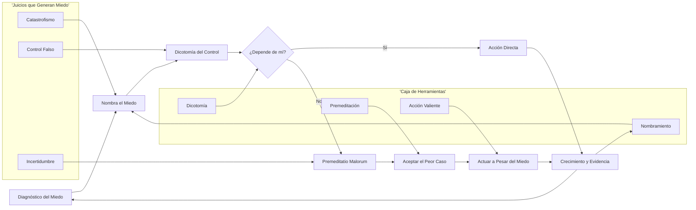
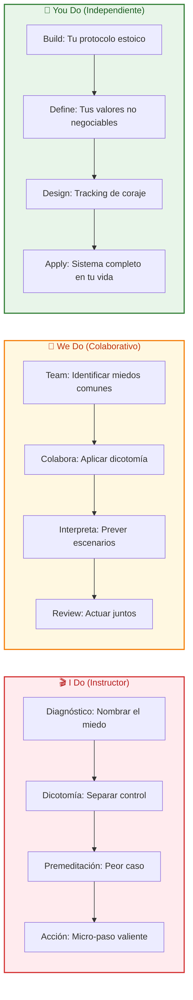

# Estoicismo contra el Miedo: La Masterclass para Recuperar el Control Mental 🛡️🧠

## INTRODUCCIÓN: POR QUÉ ESTA MASTERCLASS ES DIFERENTE

El miedo no desaparece cuando tienes más información. No se desvanece cuando planeas más. El miedo desaparece cuando cambias tu **forma de juzgar** lo que podría suceder.

Los estoicos, hace más de 2.000 años, descubrieron algo que la neurociencia moderna confirma: el sufrimiento y el miedo no provienen de los eventos externos, sino de nuestro **juicio** sobre esos eventos. Eso significa que tienes más poder del que crees.

Esta masterclass no te habla de frases motivacionales vacías. Te entrega un **sistema filosófico práctico** para recuperar el control mental, paso a paso, desde hoy.

> **🎯 Objetivo de Aprendizaje** — Al final de esta guía, entenderás por qué el miedo no es tu enemigo, dominarás 3 herramientas estoicas para desactivarlo y tendrás un protocolo práctico para aplicar cuando la ansiedad aparezca.

> **⚠️ Advertencia educativa** — Este contenido es formativo. El estoicismo es una filosofía, no un reemplazo de tratamiento psicológico o psiquiátrico. Si el miedo interrumpe tu funcionamiento diario, busca apoyo profesional.

---

## 🗺️ MAPA DEL WORKFLOW DE CONTROL MENTAL



| Fase | Pregunta que responde | Output principal |
|------|-----------------------|------------------|
| **Diagnóstico** | ¿Qué estoy sintiendo y por qué? | Mapa emocional del miedo |
| **Nombramiento** | ¿Qué riesgo específico estoy evitando? | Miedo explicitado |
| **Dicotomía** | ¿Qué depende de mí y qué no? | Filtro de control |
| **Evaluación** | ¿Puedo actuar sobre esto? | Decisión de foco |
| **Premeditación** | ¿Qué pasaría si el peor caso ocurre? | Escenario aceptado |
| **Acción** | ¿Qué paso doy hoy sin esperar? | Micro-acción valiente |
| **Evidencia** | ¿Qué prueba obtengo al actuar? | Consolidación neural |



---

## 🎭 PARTE 1: EL ORIGEN DEL MIEDO — NO ES LO QUE CREES

### 1.1 El Miedo No Viene del Evento, Viene de tu Juicio 😨

Los estoicos, y en especial Marco Aurelio, enseñaban una idea contraintuitiva: **no son los eventos externos los que nos lastiman, sino nuestra interpretación de ellos.**

```
Situación externa:
// Alguien te critica en público
// Una oportunidad laboral sale mal
// Un proyecto falla
// Un mensaje no recibe respuesta

Tu juicio:
// "Me humillaron" → Juicio sobre la intención ajena
// "Soy un fracaso" → Juicio sobre tu identidad
// "No valgo para esto" → Juicio sobre tu capacidad
// "No le importo" → Juicio sobre el significado

El evento real:
// Palabras dichas
// Resultado obtenido
// Proyecto cerrado
// Ausencia de respuesta

El espacio entre ambos:
// Ahí vive el miedo
// Ahí reside tu poder de elegir
// Ahí puedes cambiar la narrativa
```

> **💡 Concepto Clave**: Entre el estímulo y la respuesta hay un espacio. En ese espacio resides tú, y ahí reside tu libertad. — Viktor Frankl, inspirado en el estoicismo.

### 1.2 La Mecánica del Juicio Emocional ⚙️

```
Flujo del miedo:
// Evento externo → Juicio automático → Emoción → Acción

Ejemplo práctico:
// Evento: Tu jefe no responde tu mensaje
// Juicio automático: "Me va a despedir"
// Emoción: Miedo, ansiedad, angustia
// Acción: Evitar enviar otro mensaje, rumiar

Flujo estoico:
// Evento: Tu jefe no responde tu mensaje
// Juicio consciente: "No controlo su respuesta"
// Emoción: Curiosidad, calma
// Acción: Esperar un tiempo razonable, seguir trabajando
```

### 1.3 Tabla de Juicios vs Realidad

| Juicio Común | Evento Posible | Juicio Estoico Alternativo |
|--------------|---------------|----------------------------|
| "Me van a rechazar" | Voy a exponer una idea | "Puedo exponer con claridad; el resultado no depende solo de mí" |
| "No soy suficientemente bueno" | Voy a intentar algo nuevo | "Soy principiante y estoy en proceso" |
| "Voy a fracasar" | Voy a arriesgarme | "El fracaso es un dato, no una sentencia" |
| "No puedo soportarlo" | Voy a enfrentar una dificultad | "Puedo soportar más de lo que creo" |
| "Es demasiado tarde" | Plazo próximo | "Hoy es el primer día del resto" |

---

## ⚡ PARTE 2: LAS 3 HERRAMIENTAS ESTOICAS — TU KIT DE SUPERVIVENCIA MENTAL

### 2.1 Herramienta 1: Nombra el Miedo 🏷️

El simple acto de **nombrar explícitamente** lo que temes reduce drásticamente su intensidad. El miedo sin nombre crece en las sombras; el miedo nombrado empieza a perder poder.

```
Antes de nombrar:
// "Tengo una sensación rara"
// "No puedo concentrarme"
// "Me siento mal"
// ... y el miedo sigue creciendo

Después de nombrar:
// "Tengo miedo de [situación específica]"
// "Me preocupa que [resultado concreto]"
// "Mi juicio es que [pensamiento repetido]"
// ... ahora puedes trabajar con eso
```

> **🎯 Ejercicio**: Cuando notes ansiedad, detente y escribe: "Mi miedo específico es _______________". Completa la frase. Ya no es una niebla, es un enemigo con nombre.

### 2.2 Herramienta 2: Dicotomía del Control 🎯

Epicteto, el esclavo-filósofo, enseñó la distinción más poderosa del estoicismo: algunas cosas dependen de nosotros, otras no. La ansiedad desaparece cuando te enfocas solo en lo primero.

```
Lo que depende de ti:
// Tus esfuerzos
// Tus decisiones
// Tu actitud
// Tu disciplina
// Tu preparación
// Tu respuesta al evento

Lo que NO depende de ti:
// La opinión de los demás
// Los resultados exactos
// El futuro
// El pasado
// Las acciones ajenas
// La salud perfecta
// El clima
```

### 2.3 Tabla de Dicotomía del Control

| Situación | Creencia Falsa | Dicotomía Correcta | Tu Esfera de Acción |
|-----------|----------------|--------------------|--------------------|
| Entrevista laboral | "Tienen que contratarme" | "Puedo prepararme bien; la decisión final no es mía" | Preparación + actitud en entrevista |
| Lanzamiento de producto | "Tiene que ser un éxito" | "Puedo construir lo mejor posible; el mercado decide" | Calidad del producto + iteración |
| Conversación difícil | "Tienen que entenderme" | "Puedo hablar con claridad; la interpretación es de ellos" | Claridad + respeto |
| Examen | "Tengo que sacar 10" | "Puedo estudiar de forma consistente; el examen tiene azar" | Estudio + proceso |
| Relación | "Tienen que quedarse" | "Puedo ser la mejor versión de mí; la decisión es mutua" | Comportamiento + comunicación |

### 2.4 Herramienta 3: Premeditatio Malorum 🔮

Séneca, el hombre más poderoso de Roma, practicaba un ejercicio llamado **"premeditatio malorum"**, la meditación sobre el mal. Consiste en imaginar intencionalmente el peor escenario, evaluar su probabilidad y reconocer que puedes sobrevivir a él.

```
Ejercicio de premeditación:
// Paso 1: ¿Qué es lo peor que podría pasar?
// Paso 2: ¿Qué probabilidad tiene eso realmente?
// Paso 3: Si ocurriera, ¿podría sobrevivir?
// Paso 4: Si sobreviviera, ¿qué haría después?
// Paso 5: Ahora que hiciste las paces con el peor caso, actúa

Ejemplo práctico:
// Peor caso: Me despiden
// Probabilidad: Media
// ¿Puedo sobrevivir? Sí, tengo Red de contacto + habilidades
// ¿Qué haría después? Buscar otra oportunidad con calma
// Ahora: Actúo sin miedo paralizante
```

> **💡 Insight clave**: Cuando ya aceptaste el peor caso y sobreviviste mentalmente a él, el miedo pierde su poder de paralizarte.

---

## 🧠 PARTE 3: PASOS PRÁCTICOS PARA HOY — TU PROTOCOLO ESTOICO

### 3.1 Paso 1: Nombra el Miedo Explicitamente 📝

El miedo sin nombre gobierna desde las sombras. Al nombrarlo, reduces su intensidad y creas distancia.

```
Formato de nombramiento:
// "Mi miedo específico es [situación concreta]"
// "Lo que me preocupa es [resultado específico]"
// "Mi juicio sobre esto es [pensamiento repetitivo]"

Ejemplos:
// ❌ "Me siento mal" → ✅ "Tengo miedo de fallar en la presentación"
// ❌ "No puedo" → ✅ "Me preocupa que no esté suficientemente preparado"
// ❌ "No tiene sentido" → ✅ "Mi juicio es que no vale la pena intentarlo"
```

### 3.2 Paso 2: Evalúa el Control 🔍

Pregúntate: ¿qué parte de esta situación depende de mí? Lo que depende de ti es tu territorio de acción. Lo que no, debes soltarlo.

```
Formato de evaluación:
// ¿Lo que temo depende de mí? [Sí / No]
// Si depende de mí: ¿Qué acción concreta puedo tomar?
// Si no depende de mí: ¿Puedo aceptarlo como está?

Ejemplo:
// Miedo: Que no me contraten después de la entrevista
// ¿Depende de mí? Parcialmente
// Mi territorio: Preparar respuestas, investigar la empresa, ser puntual
// No depende de mí: La decisión final del entrevistador
// Acción: Prepararme y soltar el resultado
```

### 3.3 Paso 3: Usa la Técnica de Séneca 🔮

Imagina el peor caso. No para hundirte en él, sino para desactivar su poder de parálisis.

```
Premeditatio Malorum paso a paso:
// 1. ¿Qué es lo peor que podría pasar?
//    [Escribe el escenario más negativo posible]

// 2. ¿Qué probabilidad tiene realmente?
//    [Baja / Media / Alta]

// 3. Si ocurriera, ¿podría sobrevivir?
//    [Sí / No - y por qué]

// 4. ¿Qué haría en ese caso?
//    [Acción de recuperación]

// 5. Ahora que acepté el peor caso:
//    ¿Qué paso pequeño doy HOY?
//    [Micro-acción irreversible]
```

### 3.4 Protocolo de Coraje Express de 2 Minutos ⏱️

```
PROTOCOLO ESTOICO DE 2 MINUTOS:

CUANDO EL MIEDO APAREZCA:

1. NOMBRA (30 seg):
// "Mi miedo específico es _______________"
// "Mi juicio sobre esto es _______________"

2. DICOTOMÍA (30 seg):
// ¿Depende de mí?
// Si SÍ: ¿Qué acción concreta tomo HOY?
// Si NO: Suelto. No es mi territorio.

3. PREMEDITACIÓN (40 seg):
// ¿Qué pasaría si el peor caso ocurre?
// ¿Podría sobrevivir? Sí.
// Acepto el peor caso como posibilidad.

4. ACCIÓN (20 seg):
// Hago exactamente la micro-acción
// que mi yo valiente haría
// Sin esperar motivación
// Sin esperar certeza
```

> **🎯 Regla de Oro**: El coraje no es la ausencia de miedo. El coraje es la **decisión de actuar a pesar del miedo**.

---

## 🧩 PARTE 4: DISEÑO CONSCIENTE DE TU IDENTIDAD ESTOICA — EL FILÓSOFO PRÁCTICO

### 4.1 La Identidad Estoica: No es Abstracta, es Operativa 🏗️

El estoicismo no es una teoría para discutir en cafés. Es un sistema de vida. Tu identidad estoica no es "soy estoico", sino "soy el tipo de persona que [comportamiento observable ante el miedo]".

```
Identidad abstracta (inútil):
// "Soy estoico"
// "Me gusta la filosofía"
// "Leo sobre virtud"

Identidad operativa (poderosa):
// "Soy el tipo de persona que actúa sin esperar certeza"
// "Soy el tipo de persona que distingue lo controlable de lo que no"
// "Soy el tipo de persona que acepta el peor caso y sigue avanzando"
// "Soy el tipo de persona que nombra sus miedos sin avergonzarse"
```

### 4.2 Matriz de Diseño Estoico 🔧

| Componente | Pregunta Clave | Output |
|------------|---------------|---------|
| **Juicio** | ¿Qué historia me estoy contando sobre este miedo? | Juicio identificado |
| **Control** | ¿Qué depende de mí? | Esfera de acción clara |
| **Premeditación** | ¿Qué acepto como posible? | Peor caso aceptado |
| **Acción** | ¿Qué micro-paso doy hoy? | Acción irreversible |
| **Evidencia** | ¿Qué prueba obtengo al actuar? | Consolidación |

### 4.3 Prompt para Diseñar tu Protocolo Estoico 🤖

```text
Actúa como filósofo práctico especializado en estoicismo contemporáneo.
Objetivo: diseñar un protocolo personalizado para enfrentar el miedo del usuario.
Entradas:
- Miedo específico: [describe tu miedo concreto]
- Contexto: [situación personal o profesional]
- Juicio recurrente: [qué te dices a ti mismo cuando aparece]
- Recurso más escaso: [tiempo, energía, atención, dinero]
Entrega:
1. Reformulación del juicio desde la dicotomía del control
2. Premeditatio Malorum aplicada a tu caso
3. Micro-acción irreversible de 2 minutos para hoy
4. Identidad operativa que quieres construir
5. Protocolo de recuperación si vuelve el miedo
```

---

## 🔁 PARTE 5: CONSOLIDACIÓN DEL CORAJE — DE LA TEORÍA A LA IDENTIDAD

### 5.1 El Miedo es Como un Músculo: Se Entrena 🏋️

El coraje no es un rasgo innato. Es una **habilidad entrenable**. Cada vez que enfrentas un miedo pequeño, preparas tu mente para enfrentar miedores mayores.

```
Fases del desarrollo del coraje:
// 1. Reconocimiento (días 1-3) 🧠
//    - Nombro el miedo sin juzgarme
//    - Acepto que es humano

// 2. Evaluación (días 4-14) 🔍
//    - Aplico dicotomía del control
//    - Identifico mi esfera de acción

// 3. Premeditación (días 14-21) 🔮
//    - Visualizo el peor caso
//    - Acepto que puedo sobrevivir

// 4. Acción (semanas 3-6) ⚡
//    - Ejecuto micro-acciones valientes
//    - Sin esperar motivación

// 5. Identidad consolidada (mes 2-3) 🏆
//    - El coraje fluye naturalmente
//    - El miedo pierde su poder automático
```

### 5.2 Protocolo de Evidencias de Coraje 📸

Tu cerebro necesita **pruebas** de que puedes enfrentar el miedo. No confíes en la motivación; confía en el registro.

```
Registro diario MÍNIMO:

✅ Miedo del día: [qué situación específica]
✅ Juicio detectado: [qué me dije a mí mismo]
✅ Control evaluado: [qué depende de mí / qué no]
✅ Premeditación: [peor caso aceptado]
✅ Micro-acción valiente: [qué hice a pesar del miedo]
✅ Nivel de miedo antes: [1-10]
✅ Nivel de miedo después: [1-10]
✅ Evidencia # del día: [señal concreta de coraje]
```

### 5.3 Tabla de Consolidación

| Día | Acción Mínima | Evidencia Esperada | Nivel de Miedo Esperado |
|-----|---------------|-------------------|------------------------|
| **1-3** | Nombrar miedo + dicotomía | Claridad sobre la situación | Alto pero disminuyendo (7-9) |
| **4-10** | Premeditación + micro-acción | Primeras acciones valientes | Moderado-Alto (5-8) |
| **11-21** | Protocolo completo diario | Confianza acumulada | Moderado (4-6) |
| **22-42** | Acción casi automática | Miedo pierde intensidad | Bajo (2-4) |
| **43-90** | Coraje naturalizado | Identidad consolidada | Muy bajo (1-3) |

### 5.4 Código de Seguimiento de Coraje 📊

```python
import json
from datetime import date
from dataclasses import dataclass, field
from typing import Optional

@dataclass
class CourageEntry:
    date: str
    fear_name: str
    judgment: str
    control_assessment: str
    worst_case: str
    micro_action: str
    fear_before: int
    fear_after: int
    evidence: str
    completed: bool = False

class StoicCourageTracker:
    def __init__(self):
        self.entries: list[CourageEntry] = []
        self.streak: int = 0

    def log_day(self, fear_name: str, judgment: str, control: str,
                worst_case: str, action: str, before: int, after: int,
                evidence: str) -> dict:
        entry = CourageEntry(
            date=date.today().isoformat(),
            fear_name=fear_name,
            judgment=judgment,
            control_assessment=control,
            worst_case=worst_case,
            micro_action=action,
            fear_before=before,
            fear_after=after,
            evidence=evidence,
            completed=bool(action)
        )
        self.entries.append(entry)
        if entry.completed:
            self.streak += 1
        return self._daily_report(entry)

    def _daily_report(self, entry: CourageEntry) -> dict:
        return {
            "date": entry.date,
            "fear_faced": entry.fear_name,
            "judgment": entry.judgment,
            "control": entry.control_assessment,
            "worst_case_accepted": entry.worst_case,
            "action": entry.micro_action,
            "fear_before": entry.fear_before,
            "fear_after": entry.fear_after,
            "fear_reduction": entry.fear_before - entry.fear_after,
            "evidence": entry.evidence,
            "streak": self.streak
        }

    def weekly_report(self) -> dict:
        if not self.entries:
            return {"error": "No data yet"}
        recent = self.entries[-7:]
        completed = sum(1 for e in recent if e.completed)
        avg_before = sum(e.fear_before for e in recent) / len(recent)
        avg_after = sum(e.fear_after for e in recent) / len(recent)
        return {
            "week_completion": f"{completed}/{len(recent)}",
            "avg_fear_before": round(avg_before, 1),
            "avg_fear_after": round(avg_after, 1),
            "fear_reduction": round(avg_before - avg_after, 1),
            "current_streak": self.streak
        }

    def save(self, path: str):
        serializable = [
            {
                "date": e.date,
                "fear_name": e.fear_name,
                "judgment": e.judgment,
                "control_assessment": e.control_assessment,
                "worst_case": e.worst_case,
                "micro_action": e.micro_action,
                "fear_before": e.fear_before,
                "fear_after": e.fear_after,
                "evidence": e.evidence,
                "completed": e.completed
            }
            for e in self.entries
        ]
        with open(path, "w", encoding="utf-8") as f:
            json.dump(serializable, f, ensure_ascii=False, indent=2)
```

---

## 🎯 PARTE 6: LOS TRES MODOS DE APRENDIZAJE — I DO / WE DO / YOU DO

### 6.1 I Do — Protocolo Estoico Guiado 🎬

**Objetivo**: experimentar el proceso completo de desactivación del miedo con una herramienta estoica.

| Paso | Acción | Resultado esperado |
|------|--------|--------------------|
| 1 | Identificar el miedo específico | Externalizar el problema |
| 2 | Nombrar el juicio asociado | Distanciarse del pensamiento |
| 3 | Aplicar dicotomía del control | Claridad sobre la esfera de acción |
| 4 | Visualizar el peor caso | Aceptación del escenario |
| 5 | Ejecutar micro-acción valiente | Primera evidencia de coraje |

```python
# Ejecución del protocolo guiado
tracker = StoicCourageTracker()

tracker.log_day(
    fear_name="Miedo a hablar en público",
    judgment="Me van a juzgar y voy a fallar",
    control_assessment="Depende de mí: preparar discurso, practicar. No depende: reacción del público.",
    worst_case="Tropiezo con las palabras, se dan cuenta, sigo adelante y nadie recuerda el error.",
    micro_action="Grabarme leyendo el discurso una vez, sin juicio de calidad",
    before=8,
    after=6,
    evidence="Me grabé y el mundo no se acabó. Ahora puedo repetir."
)
```

> **🎥 Interpretación guiada**: ¿Notas cómo el simple hecho de nombrar el miedo y definir una acción reduce su intensidad? Ese es el poder de la filosofía en acción.

### 6.2 We Do — Aplicación de Dicotomía en Equipo 🤝

**Escenario**: un equipo tiene miedo de lanzar un proyecto porque creen que "tiene que ser perfecto".

**Ejercicio colaborativo**:

| Juicio del Equipo | Dicotomía Aplicada | Acción Resultante |
|-------------------|--------------------|--------------------|
| "Tiene que ser perfecto" | Perfección NO depende solo de mí | "Hacemos la mejor versión posible" |
| "Nos van a criticar" | Crítica externa NO depende de nosotros | "Lanzamos, recopilamos feedback, iteramos" |
| "No estamos listos" | Estar "listo" es subjetivo | "Definimos criterios mínimos y superamos ese umbral" |
| "Y si fracasa?" | Fracaso es un evento, no una identidad | "Aceptamos el peor caso y aprendemos" |

### 6.3 You Do — Construye tu Sistema Estoico Personal 🔨

**Tarea**: crea tu sistema completo.

| Fase | Acción | Entregable |
|------|--------|-----------|
| **Diagnóstico** | Lista 5 miedos recurrentes que te limitan | Mapa personal de miedos |
| **Nombramiento** | Para cada miedo, escribe el juicio exacto | Juicios externalizados |
| **Dicotomía** | Aplica la distinción control/no-control a cada uno | Filtro claro |
| **Premeditación** | Define el peor caso para cada miedo | Aceptación |
| **Protocolo** | Crea tu rutina de coraje diaria | Sistema operativo |
| **Tracking** | Implementa StoicCourageTracker por 30 días | Datos y tendencias |

| Criterio | Peso |
|----------|------|
| Claridad de juicios | 25% |
| Consistencia del protocolo | 30% |
| Reducción de miedo | 25% |
| Evidencias de acción | 15% |
| Sistema sostenible | 5% |

---

## 📓 PARTE 7: ANEXOS Y RECURSOS

### Anexo A: Plantilla de Protocolo Estoico 📝

```
MI PROTOCOLO ESTOICO

MIEDO ESPECÍFICO:
¿Qué situación temo?
[Detalla con precisión]

JUICIO ASOCIADO:
¿Qué me digo a mí mismo sobre este miedo?
[Escribe el pensamiento recurrente]

DICOTOMÍA DEL CONTROL:
¿Qué depende de mí?
1. [Acción concreta 1]
2. [Acción concreta 2]
3. [Acción concreta 3]

¿Qué NO depende de mí?
1. [Factor externo 1]
2. [Factor externo 2]

PREMEDITATIO MALORUM:
¿Qué pasaría si el peor caso ocurre?
[Describe el peor escenario]

¿Podría sobrevivir?
[Sí / No, y por qué]

¿Qué haría después?
[Plan de recuperación]

MICRO-ACCIÓN HOY:
¿Cuál es el paso más pequeño que mi yo valiente daría?
[Acción concreta, <2 minutos]

EVIDENCIA ESPERADA:
¿Qué prueba obtengo al ejecutar?
[Sea lo que sea]
```

### Anexo B: Checklist de Práctica Estoica Diaria ✅

| Item | Check | Frecuencia |
|------|-------|-----------|
| Nombramiento del miedo del día | ☐ | Diaria |
| Dicotomía del control aplicada | ☐ | Diaria |
| Premeditación del peor caso | ☐ | Diaria |
| Micro-acción valiente ejecutada | ☐ | Diaria |
| Registro de coraje completado | ☐ | Diaria |
| Revisión semanal de juicios | ☐ | Semanal |
| Actualización de identidad estoica | ☐ | Mensual |

### Anexo C: Preguntas de Activación Estoica ⚡

Cuando el miedo aparezca, responde:

1. ¿Qué estoy temiendo exactamente? (Nombra el miedo)
2. ¿Este miedo depende de mí o de factores externos?
3. ¿Qué haría una persona virtuosa en esta situación?
4. ¿Qué pasaría si el peor caso ocurre? ¿Podría sobrevivir?
5. ¿Qué haría el mejor yo posible en este momento?
6. ¿Cómo recordaré este miedo dentro de un año?

---

## 📚 GLOSARIO RÁPIDO

| Término | Definición |
|---------|------------|
| **Dicotomía del control** | Distinción estoica entre lo que depende de nosotros y lo que no |
| **Juicio** | Interpretación que hacemos de los eventos externos |
| **Premeditatio Malorum** | Ejercicio de visualizar el peor caso para desactivar el miedo |
| **Apatía (estoica)** | Ausencia de pasiones desordenadas, no indiferencia |
| **Virtud** | Sabiduría, coraje, justicia y templanza |
| **Asentimiento** | Aceptación voluntaria o rechazo de los juicios |
| **Amor fati** | Amar el destino, aceptar lo que sucede |
| **Coraje estoico** | Actuar virtuosamente a pesar del miedo |
| **Juicio automático** | Pensamiento instantáneo sin reflexión consciente |
| **Dicotomía aplicada** | Uso práctico de la distinción en una situación concreta |

---

## 📝 PREGUNTAS DE VERIFICACIÓN

Responde cada pregunta basándote en los conceptos de esta master class. Escribe tus respuestas o compártelas para profundizar tu aprendizaje.

### Preguntas sobre el Origen del Miedo

1. **Define**: ¿Por qué los estoicos dicen que el miedo no viene de los eventos externos? Explica con tus palabras.

2. **Analiza**: ¿Qué diferencia hay entre el evento "me despiden" y el juicio "no valgo para nada"? ¿Cuál de los dos depende de ti?

### Preguntas sobre las Herramientas Estoicas

3. **Explica**: ¿Cómo funciona la técnica de la Premeditatio Malorum? ¿Por qué imaginar el peor caso reduce el miedo?

4. **Aplica**: Toma un miedo recurrente tuyo. Aplica la dicotomía del control y separa en dos columnas qué depende de ti y qué no.

5. **Reflexiona**: ¿Por qué nombrar el miedo explícitamente reduce su intensidad? ¿Qué pasa cuando lo dejas sin nombre?

6. **Diseña**: Crea tu propio protocolo estoico de 2 minutos para un miedo específico.

### Preguntas sobre Practica Diaria

7. **Aplica**: Usando el código `StoicCourageTracker`, ¿qué métricas elegirías para medir tu progreso en 30 días?

8. **Analiza**: Describe una situación donde aplicar la dicotomía del control cambió completamente tu forma de enfrentar el problema.

### Preguntas Integradoras

9. **Conecta**: ¿Cómo se relaciona el nombramiento del miedo (Parte 3) con la consolidación del coraje (Parte 5)? ¿Qué pasaría si solo nombras pero no actúas?

10. **Síntesis**: Diseña un sistema completo para alguien que tiene ansiedad social. Incluye: identificación de miedos, dicotomía del control, premeditación y protocolo diario.

11. **Reflexión final**: De las 3 herramientas estoicas (nombramiento, dicotomía, premeditación), ¿cuál consideras más poderosa y por qué?

---

## 🌍 ANEXO: FORMATO IDEAL PARA ARTÍCULOS EDUCATIVOS

### Recomendaciones de ancho para lectura larga

El ancho óptimo para artículos educativos es **60–75 caracteres por línea** (incluyendo espacios). Equivale aproximadamente a:

- `max-width: 65ch` en CSS (una de las mejores opciones).
- 550–750 px de ancho de contenido.

```css
.article-content {
  max-width: 65ch;
}
```

Muchos estudios de legibilidad consideran que entre **50 y 75 caracteres por línea** es la zona óptima para lectura prolongada.

---

### Anchura recomendada para guías de aprendizaje

Las guías educativas tienen necesidades diferentes a las noticias o blogs normales.

**Ancho recomendado:**

```css
.article-content {
  max-width: 60ch;
}
```

o

```css
.article-content {
  max-width: 65ch;
}
```

Esto facilita:

- Mantener la atención
- Reducir la fatiga visual
- Mejorar la comprensión
- Facilitar el seguimiento de conceptos complejos

---

### Lo que hace agradable una guía al cerebro

- Jerarquía visual clara (títulos, subtítulos, listas)
- Pausas de descanso (más espacios entre bloques grandes)
- Variedad de formatos (texto, tablas, código, listas)
- Transiciones explícitas entre conceptos
- Ritmo de dificultad: fácil → medio → retador

---

*¿Qué miedo estás enfrentando hoy? Cuéntame en los comentarios.*
