# MASTERCLASS: Estrategia de 5 Pasos para Multipasionales — De la Sobrecarga a la Productividad Deliberada 🎯✨

## INTRODUCCIÓN: POR QUÉ TENER MUCHOS INTERESES NO ES UN DEFECTO, SINO UN ACTIVO 🧠💡

Vives con la cabeza llena de proyectos. Un día quieres aprender a programar, al siguiente diseñar, luego escribir, luego montar un podcast, luego cocinar, luego invertir. La sociedad te dice que debes **elegir uno** y especializarte. Pero tú no funcionas así. Tienes **demasiados intereses** y eso te genera culpa, dispersión y la sensación de que algo va mal. 🌀

Este video presenta una estrategia de 5 pasos para canalizar tu curiosidad múltiple sin perder la cabeza. La premisa central: **ser multipasional no es un defecto. Es un activo si lo organizas correctamente.** 🚀

> **🎯 Objetivo de Aprendizaje** — Al final de esta guía, tendrás un sistema para clasificar tus intereses, comprometerte con un proyecto prioritario, prevenir el burnout, revisar tu rumbo y pivotar sin culpa.

> **⚠️ Nota motivacional** — Este contenido es formativo. No se trata de elegir una sola pasión para siempre, sino de estructurar tus energías para avanzar sin quemarte.

---

## MAPA DEL FLUJO DE ESTRATEGIA 🗺️

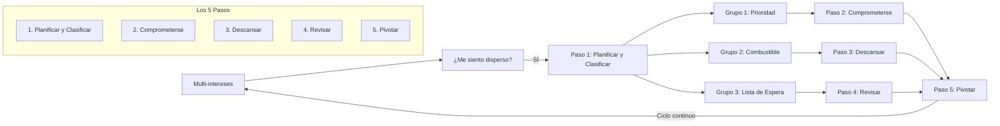

| Paso | Pregunta que responde | Output principal |
|------|------------------------|------------------|
| **1. Planificar y Clasificar** 📋 | ¿Cómo organizar mis múltiples intereses? | 3 grupos: prioridad, combustible, espera |
| **2. Comprometerse** 🤝 | ¿Cómo evitar la dispersión? | Horizonte temporal definido |
| **3. Descansar y Prevenir Burnout** 🛡️ | ¿Cómo sostenerme sin quemarme? | Actividades regenerativas sin presión |
| **4. Revisar y Adaptar** 🔄 | ¿Cómo saber si debo cambiar? | Métricas de progreso y bienestar |
| **5. Pivotar sin Culpa** 🔄 | ¿Cómo cambiar sin sentirme fracasado? | Transición estructurada entre proyectos |

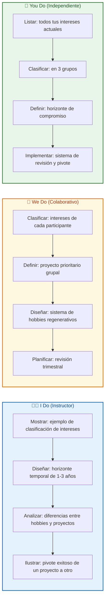

---

## PARTE 1: LA FILOSOFÍA MULTIPASIONAL — DE LA CULPA A LA ESTRATEGIA 🧠

### 1.1 Principio Central

La sociedad premia la especialización temprana: elige una carrera, síguela, conviértete en experto. Pero los seres humanos son **naturalmente multipasionales**. La curiosidad no es un defecto: es un **sistema de descubrimiento** que, si se canaliza correctamente, genera innovación, adaptabilidad y creatividad. 🌟

> **💡 Idea clave** — Tener muchos intereses no te hace disperso. Te hace **rico en posibilidades**. El problema no es la cantidad de intereses: es la falta de sistema para gestionarlos.

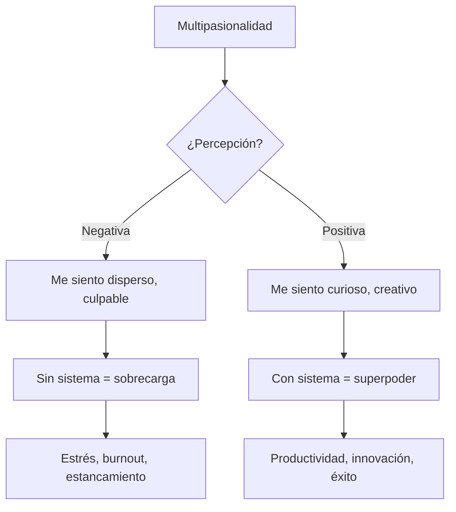

### 1.2 El Problema: La Estructura Social vs. La Naturaleza Humana ⚔️

| Presión Social 📢 | Realidad Humana 🧬 | Solución |
|-------------------|--------------------|----------|
| "Elige una carrera y síguela" 🎯 | La curiosidad cambia con el tiempo | Estrategia flexible de 5 pasos |
| "El especialista tiene más valor" 🏆 | Los multipasionales son más adaptables | Combinar especialización + amplitud |
| "Cambiar de rumbo es fracasar" ❌ | Pivotar es señal de inteligencia | Normalizar el pivote estructurado |
| "Debo monetizar todo lo que hago" 💸 | No todo necesita ser negocio | Grupo 2: combustible sin presión |
| "Si no lo hago ahora, nunca lo haré" ⏰ | La vida es larga, hay tiempo | Grupo 3: lista de espera sin culpa |

### 1.3 El Activo Oculto de la Multipasionalidad

| Ventaja Competitiva 🏅 | Ejemplo Histórico |
|------------------------|------------------|
| **Creatividad interdisciplinaria** 🎨 | Leonardo da Vinci: arte, ingeniería, anatomía |
| **Adaptabilidad a cambios** 🔄 | Coco Chanel: moda, perfumería, diseño |
| **Síntesis de conocimientos** 🧩 | Steve Jobs: caligrafía + tecnología = Mac |
| **Resiliencia multifacética** 🛡️ | Freddie Mercury: música, arte, performance |
| **Redes diversas** 🌐 | Personas que combinan círculos sociales diferentes |

> **📌 Idea clave** — Michelangelo pintó la Capilla Sixtina, pero también escribía poesía. Coco Chanel revolucionó la moda, pero también diseñó perfumes y joyas. Freddie Mercury hizo rock, ópera y teatro. **La genialidad no es monolítica: es multipasional.**

### 1.4 De la Sobrecarga a la Deliberación

| Estado 😰 | Característica | Resultado Típico |
|-----------|---------------|------------------|
| **Caos multipasional** 🌀 | Muchos intereses, sin sistema | Culpa, dispersión, burnout |
| **Especialización forzada** 🔒 | Un solo interés por presión | Aburrimiento, estancamiento, rencor |
| **Estrategia deliberada** 🎯 | Intereses clasificados, energía dirigida | Progreso, satisfacción, sostenibilidad |

---

## PARTE 2: PASO 1 — PLANIFICAR Y CLASIFICAR 📋

### 2.1 Principio Central

Antes de comprometerte con cualquier proyecto, necesitas **ver el mapa completo** de tus intereses. No se trata de descartar: se trata de **asignar cada interés a su categoría correcta**. 📊

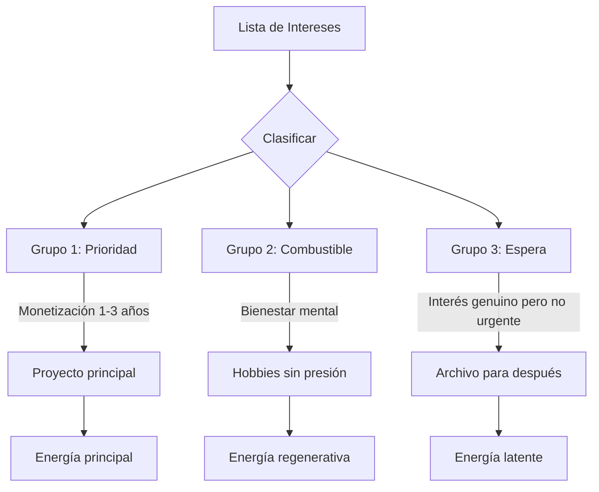

### 2.2 Los 3 Grupos de Intereses

| Grupo | Criterio | Ejemplos | Asignación de Energía |
|-------|----------|----------|-----------------------|
| **Grupo 1: Prioridad** 🎯 | Mejor oportunidad de monetización (1-3 años) | Negocio principal, carrera a construir | 60-70% de energía semanal |
| **Grupo 2: Combustible** ⛽ | Bienestar mental, sin presión de monetización | Deportes, lectura, arte, música | 20-25% de energía semanal |
| **Grupo 3: Lista de Espera** ⏳ | Interés genuino pero no urgente | Aprender idiomas, cultivar un hobby nuevo | 5-10% de energía semanal (máximo) |

> **📌 Idea clave** — La mayoría de las personas multipasionales cometen el error de tratar **todos** sus intereses como Grupo 1. Esto genera dispersión garantizada. La clave es **saber elegir uno solo como prioridad** y darle la energía principal.

### 2.3 Ejercicio de Clasificación

| Paso | Acción | Herramienta | Resultado Esperado |
|------|--------|-------------|--------------------|
| 1 | Listar TODOS tus intereses actuales | Papel, app o nota digital | Lista de 10-20 intereses |
| 2 | Evaluar cada uno según criterios | Tabla de evaluación | Puntuación por interés |
| 3 | Asignar a Grupo 1, 2 o 3 | Sistema de clasificación | 3 grupos definidos |
| 4 | Justificar cada asignación | Reflexión escrita | Claridad sobre tus razones |
| 5 | Definir energía a asignar a cada grupo | Porcentajes | Presupuesto energético |

**Criterios de evaluación:**

| Criterio 📊 | Peso | Pregunta |
|-------------|------|----------|
| **Potencial de monetización** 💰 | 30% | ¿Puedo generar ingresos sostenibles con esto en 1-3 años? |
| **Alineación con propósito** 🎯 | 25% | ¿Esto se conecta con mi misión de vida? |
| **Demanda del mercado** 📈 | 20% | ¿Hay personas dispuestas a pagar por esto? |
| **Bienestar personal** 🌱 | 15% | ¿Esto me hace crecer o me drena? |
| **Competencia única** 🏆 | 10% | ¿Tengo una ventaja sobre otros en esto? |

### 2.4 La Trampa de la Lista de Espera Infinita

| Síntoma 🚨 | Causa | Solución |
|------------|-------|----------|
| Tengo 15 intereses y avanzo en 0 📉 | Trato todos como prioridad | Elegir 1 solo Grupo 1 |
| Cada semana empiezo algo nuevo 🔄 | Sin compromiso temporal | Definir horizonte de 1-3 años |
| Me siento culpable por no hacer todo 😰 | Expectativa irreal | Aceptar que no se puede hacer todo |
| Invierto en cursos que no completo 💸 | Intereses como consumo, no construcción | Foco en 1 proyecto hasta terminarlo |

---

## PARTE 3: PASO 2 — COMPROMETERSE 🤝

### 3.1 Principio Central

Una vez clasificados los intereses, el paso más difícil es **elegir uno y comprometerse**. No para siempre, pero sí para un horizonte definido. La tentación de dispersarse es constante, pero el compromiso es lo que convierte la curiosidad en resultados tangibles. 🔒✨

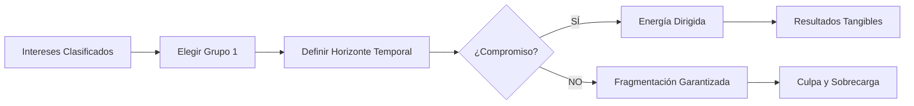

### 3.2 El Poder del Horizonte Temporal

| Horizonte | Ventaja | Desventaja | Mejor uso |
|-----------|---------|------------|-----------|
| **1 año** 📅 | Rápido feedback, motivación alta | Puede generar presión excesiva | Proyectos concretos, lanzamientos |
| **2 años** ⏱️ | Tiempo para aprender y construir | Riesgo de perder motivación | Negocios, carreras, skills complejos |
| **3 años** 🗓️ | Profundidad real, solidez | Puede sentirse muy largo | Transformaciones profundas |
| **5+ años** 🌅 | Visión de legado | Puede ser abrumador | Proyectos existenciales |

> **📌 Idea clave** — El horizonte no es una prisión: es un **marco de seguridad**. Saber que tu compromiso dura 1-3 años te libera de la presión de "elegir para siempre" y te da la disciplina para avanzar.

### 3.3 El Contrato de Compromiso Personal

```text
CONTRATO DE COMPROMISO MULTIPASIONAL
═══════════════════════════════════════

YO, [Nombre], me comprometo a:

1. PRIORIZAR [Proyecto del Grupo 1] durante los próximos [1-3 años]
2. Dedicar mínimo [X] horas semanales a este proyecto
3. Aceptar que NO debo avanzar en mis otros intereses (Grupos 2 y 3) durante este tiempo
4. Usar mis actividades del Grupo 2 como combustible, no como escape
5. Revisar mi progreso cada [mes/trimestre]
6. Permitirme pivotar después del horizonte temporal sin culpa

Firma: _______________ Fecha: _______________
```

### 3.4 Estrategia de Bloqueo de Tiempo para Multipasionales

| Bloque 🕐 | Actividad | Duración | Regla |
|-----------|-----------|----------|-------|
| **Bloque 1: Prioridad** 🎯 | Proyecto Grupo 1 | 3-4 horas diarias | No interrumpir, no multitasking |
| **Bloque 2: Combustible** ⛽ | Actividad Grupo 2 | 1-2 horas diarias | Sin métricas de rendimiento |
| **Bloque 3: Administrativo** 📋 | Email, reuniones, tareas | 1 hora diaria | Agrupadas, no dispersas |
| **Bloque 4: Lista de Espera** ⏳ | Exploración Grupo 3 | 30 min semanales (máximo) | Solo si el Grupo 1 está avanzando |
| **Bloque 5: Descanso** 😴 | Sueño, desconexión | 7-9 horas nocturnas | No negociable |

---

## PARTE 4: PASO 3 — DESCANSAR Y PREVENIR BURNOUT 🛡️

### 4.1 Principio Central

El mayor enemigo del multipasional no es la dispersión: es el **agotamiento**. Cuando tienes muchos intereses, es fácil llenar cada hueco con actividad. Pero el cerebro necesita **recuperación real** para funcionar creativamente. 🧠🔋

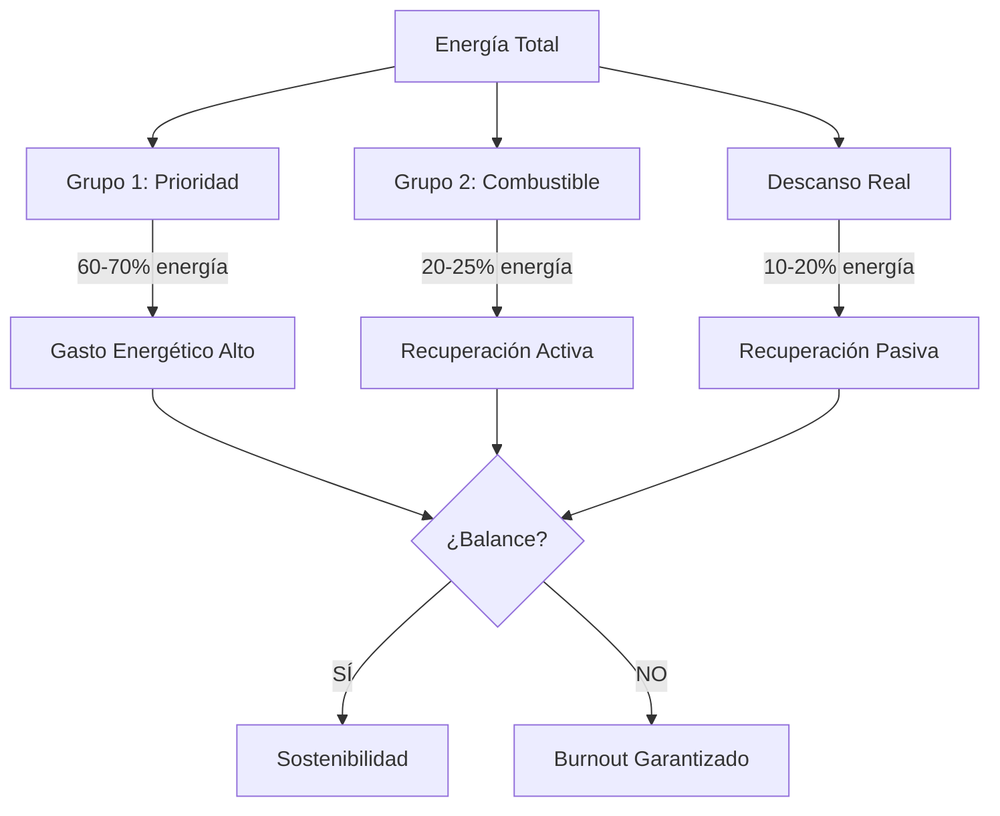

### 4.2 Los 3 Criterios de un Buen Hobby (Grupo 2)

**Del 17:01 al 21:27 del video**, el orador explica que no cualquier hobby sirve como recuperación. Un hobby regenerativo debe cumplir **3 criterios estrictos**:

| Criterio 📋 | Explicación | Ejemplo ✅ | Contraejemplo ❌ |
|-------------|-------------|------------|------------------|
| **1. Sensorial/físico** 🏃 | Debe involucrar el cuerpo, no solo la mente | Correr, nadar, bailar, cocinar | Leer más libros (todavía mental) |
| **2. Sin métricas de rendimiento** 🚫 | No debe medirse, competirse ni mejorarse | Pintar por placer, caminar sin GPS | Entrenar para maratón (tiene meta) |
| **3. Horario fijo** ⏰ | Debe tener un espacio definido, no ser infinito | 30 min de yoga a las 7 PM | "Juego videojuegos cuando termine todo" |

> **📌 Idea clave** — El hobby perfecto es aquel que **no te hace mejor en nada**, pero te hace **sentir vivo**. Si tu hobby tiene métricas, no es descanso: es otro proyecto.

### 4.3 Tabla de Actividades Regenerativas por Tipo

| Tipo 🏷️ | Actividad | ¿Cumple criterios? | Nota |
|---------|-----------|---------------------|------|
| **Deportiva** ⚽ | Nadar, caminar, bailar, escalar | ✅✅✅ | Ideal: física, sin métricas, programable |
| **Artística** 🎨 | Pintar, tocar instrumento, cantar | ✅✅❌ | Arte sin exposición = sin métricas |
| **Manual** 🛠️ | Jardinería, cocina, carpintería | ✅✅✅ | Perfecto: sensorial, proceso, horario |
| **Social** 🤝 | Juegos de mesa, conversaciones | ✅✅✅ | Conexión humana sin productividad |
| **Digital** 📱 | Videojuegos casuales, series | ❌❌❌ | Cuidado: puede ser escape, no recuperación |
| **Mental** 📚 | Leer ficción, estudiar idiomas | ❌✅✅ | No es física, pero puede ser regenerativa si es ficción |

### 4.4 El Síndrome del Hobby-Productividad

| Patrón 🚨 | Descripción | Solución |
|-----------|-------------|----------|
| **Hobby con métricas** 📊 | "Voy a correr para bajar 5 kg" | Correr para sentir el viento, no para perder peso |
| **Hobby como escape** 🏃 | "Hago deporte para no pensar en mi proyecto" | El deporte debe ser disfrute, no evasión |
| **Hobby infinito** ♾️ | "Juego videojuegos hasta que termine" | Horario fijo: 30 min, luego stop |
| **Hobby competitivo** ⚔️ | "Entreno para ganar la carrera" | Cambiar a actividad no competitiva |
| **Hobby como otro proyecto** 📋 | "Voy a aprender a pintar para vender cuadros" | Separar Grupo 2 (placer) de Grupo 1 (negocio) |

---

## PARTE 5: PASO 4 — REVISAR Y ADAPTAR 🔄

### 5.1 Principio Central

Tu proyecto prioritario no es una **sentencia de vida**. Es un **experimento temporal**. La revisión periódica te permite detectar si estás avanzando, estancado o en el camino equivocado, y ajustar sin culpa. 🔍📊

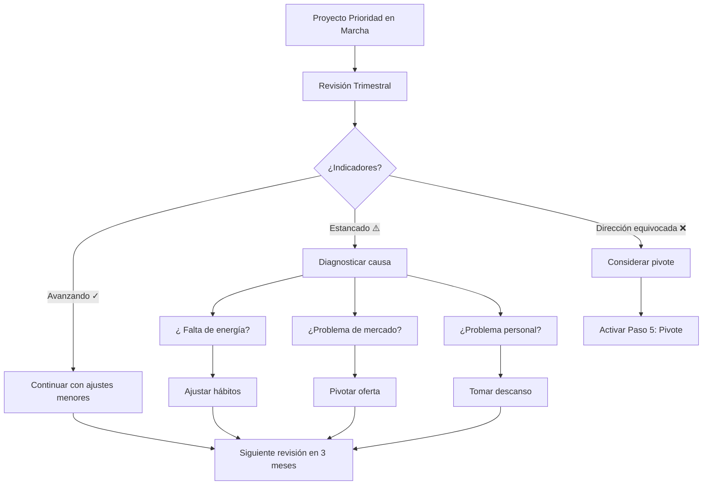

### 5.2 Métricas de Revisión (No solo métricas de negocio)

| Dimensión 📊 | Métrica | Frecuencia | ¿Qué mide? |
|--------------|---------|------------|------------|
| **Avance de proyecto** 📈 | % completado de milestones | Semanal | Progreso tangible |
| **Energía disponible** ⚡ | Nivel de energía (1-10) | Diaria | Sostenibilidad |
| **Nivel de culpa** 😰 | Pensamientos de "debería estar haciendo X" | Diaria | Dispersión interna |
| **Satisfacción** 😊 | Satisfacción con el camino (1-10) | Semanal | Alineación propósito |
| **Burnout signals** 🚨 | Horas de sueño, irritabilidad, desconexión | Semanal | Salud mental |
| **Progreso en Grupo 2** ⛽ | Consistencia en hobbies regenerativos | Semanal | Recuperación |
| **Apego a Grupo 3** ⏳ | Cuánto tiempo dedico a lista de espera | Semanal | Dispersión |

### 5.3 Tabla de Diagnóstico de Estancamiento

| Síntoma 🚨 | Diagnóstico | Acción |
|------------|-------------|--------|
| Avance < 10% en 3 meses 📉 | Falta de foco o prioridad mal definida | Redefinir milestones, reducir alcance |
| Energía consistently < 5/10 🔋 | Burnout incipiente | Aumentar Grupo 2, reducir presión |
| Culpa constante por Grupo 3 😰 | Definición de prioridad incorrecta | Revisar si el Grupo 1 es realmente el correcto |
| Evitación del trabajo 🏃 | Proyecto no alineado con propósito | Considerar pivote |
| Comparación constante con otros ⚖️ | Enfoque externo, no interno | Volver a métricas personales |
| Pérdida de sueño o apetito 😴 | Burnout avanzado | Pausa obligatoria, no opcional |

### 5.4 El Ritual de Revisión Trimestral

```text
RITUAL DE REVISIÓN TRIMESTRAL
═══════════════════════════════

DURACIÓN: 2 horas
CUÁNDO: Último viernes de cada trimestre

PARTE 1: Revisión de métricas (30 min)
├── Avance de proyecto: ¿llegué a mis milestones?
├── Energía: ¿Cómo fue mi nivel de energía este trimestre?
├── Satisfacción: ¿Disfruté el proceso?
└── Burnout: ¿Tuve señales de agotamiento?

PARTE 2: Evaluación de clasificación (30 min)
├── ¿Sigue siendo correcto mi Grupo 1?
├── ¿Necesito promover algo del Grupo 3?
├── ¿Mi Grupo 2 sigue siendo regenerativo?
└── ¿Hay algo que deba archivar definitivamente?

PARTE 3: Ajuste de rumbo (30 min)
├── ¿Mantengo el proyecto actual o pivoto?
├── ¿Cambio mi horizonte temporal?
├── ¿Ajusto mi presupuesto energético?
└── ¿Nuevos experimentos para el próximo trimestre?

PARTE 4: Celebración (30 min)
├── Celebrar logros (por pequeños que sean)
├── Reconectar con el propósito
└── Renovar el compromiso (o liberarlo sin culpa)
```

---

## PARTE 6: PASO 5 — PIVOTAR SIN CULPA 🔄

### 6.1 Principio Central

**Del 21:27 al 22:42 del video**, el orador enfatiza que tu proyecto prioritario **no es una sentencia de vida**. Una vez que construiste estabilidad (financiera, emocional, de skills), puedes:

1. **Pivotar** a un nuevo proyecto del Grupo 3
2. **Combinar** intereses en una propuesta única
3. **Promover** un interés del Grupo 3 a Grupo 1

El pivote no es fracaso: es **evolución deliberada**. 🌱

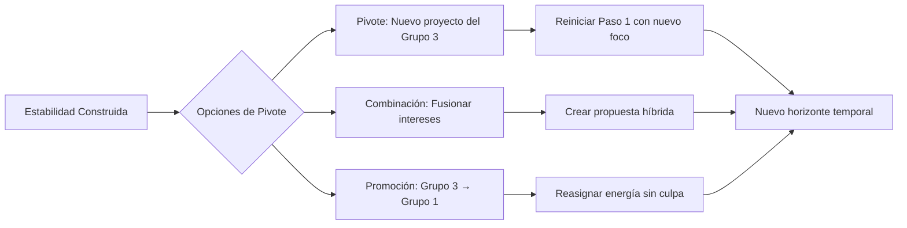

### 6.2 Tipos de Pivote

| Tipo 🔄 | Descripción | Ejemplo | Cuándo usarlo |
|---------|-------------|---------|---------------|
| **Pivote total** 🔄 | Dejar el Grupo 1 y empezar uno nuevo | Dejar diseño gráfico para empezar a escribir | Cuando el proyecto actual ya no te energiza |
| **Pivote parcial** 🔄 | Mantener el Grupo 1 pero cambiar el enfoque | Dejar de diseñar logos para diseñar UX | Cuando el mercado cambia o aprendes algo nuevo |
| **Combinación** 🧩 | Fusionar dos o más intereses | Diseño + escritura = diseñador de contenidos | Cuando tienes dos intereses igual de fuertes |
| **Promoción** ⬆️ | Subir un Grupo 3 a Grupo 1 | Empezar a cocinar como hobby, luego convertirlo en negocio | Cuando el interés se vuelve viable económicamente |
| **Expansión** 📈 | Ampliar el Grupo 1 a áreas relacionadas | Dejar diseño web a diseño de producto | Cuando dominas el área actual |

### 6.3 La Trampa del Pivote Prematuro

| Señal de Alerta 🚨 | Descripción | Acción |
|-------------------|-------------|--------|
| Pivote antes de 6 meses ⏱️ | Impaciencia, no fracaso | Esperar al menos 1 año antes de pivotar |
| Pivote por cada dificultad 😰 | Evitación del esfuerzo | Distinguir entre dificultad normal y señal de alarma |
| Pivote por comparación ⚖️ | "Otro ya tuvo éxito en X" | Volver a tu propio propósito, no al de otros |
| Pivote por aburrimiento 😴 | Falta de retos en el proyecto actual | Rediseñar el proyecto, no abandonarlo |
| Pivote por expectativas ajenas 👥 | "Mi familia quiere que haga Y" | Volver a tu propia clasificación de intereses |

> **📌 Idea clave** — Pivotar no es cambiar porque algo es difícil. Es cambiar porque **detectas una oportunidad mayor alineada con tu propósito**, y tienes la estabilidad para hacerlo sin morir en el intento.

### 6.4 Tabla de Decisión: ¿Pivoto o Persevero?

| Pregunta 🤔 | Señal de Pivote 🔄 | Señal de Perseverar ✅ |
|-------------|-------------------|----------------------|
| ¿Todavía me energiza este proyecto? | No, me drena incluso en días buenos | Sí, aunque sea difícil |
| ¿El mercado responde? | No hay demanda después de 1 año | Hay señales de interés genuino |
| ¿Estoy aprendiendo? | Estoy estancado, repito lo mismo | Cada mes sé algo nuevo |
| ¿Se alinea con mi propósito? | Se siente como "tengo que", no "quiero" | Se siente como expresión de mí |
| ¿Tengo estabilidad para cambiar? | No, pivotar sería irresponsable | Sí, tengo reserva y skills |
| ¿Qué diría mi yo de 3 años? | "Debería haber cambiado antes" | "Estoy construyendo algo que perdurará" |

---

## PARTE 7: ARQUITECTURA DE LA VIDA MULTIPASIONAL 🏗️

### 7.1 Los 5 Niveles de la Multipasionalidad Estratégica

La multipasionalidad no es solo "tener muchos hobbies". Es una **arquitectura de vida** donde cada nivel tiene un propósito específico.

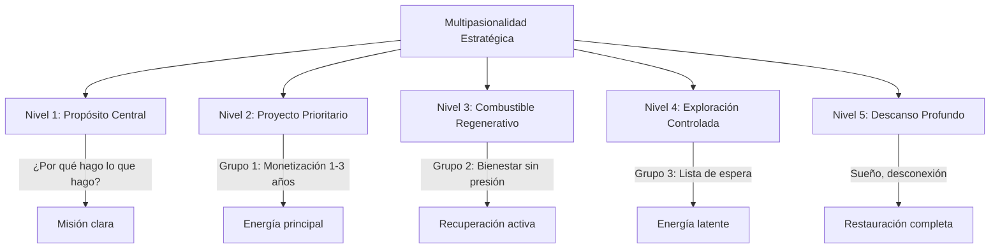

| Nivel 🎚️ | Función | Ejemplo | Tiempo Semanal |
|-----------|---------|---------|----------------|
| **1. Propósito Central** 🎯 | La razón de ser, la brújula | "Crear contenido que ayude a multipasionales" | Reflexión diaria (10 min) |
| **2. Proyecto Prioritario** 🚀 | Grupo 1: foco principal | Negocio de consultoría multipasional | 30-40 horas/semana |
| **3. Combustible Regenerativo** ⛽ | Grupo 2: hobbies sin presión | Deportes, lectura, arte | 5-10 horas/semana |
| **4. Exploración Controlada** 🔍 | Grupo 3: lista de espera | Aprender un idioma, cultivar huerto | 2-3 horas/semana (máximo) |
| **5. Descanso Profundo** 😴 | Recuperación total | Sueño, vacaciones, desconexión digital | 7-9 horas/día + 1 día/semana |

### 7.2 La Paradoja de la Multipasionalidad Exitosa

| Paradoja 🤔 | Explicación | Ejemplo |
|--------------|-------------|---------|
| **Menos es más** ➖ | Tener menos proyectos activos genera más resultados | 1 proyecto con foco > 5 proyectos dispersos |
| **Especialización temporal** 🎯 | Ser generalista en la vida, especialista en el proyecto | Multipasional en hobbies, especialista en negocio |
| **Libertad estructurada** 🔒➡️🔓 | Las reglas crean libertad real | Horario fijo para Grupo 2 permite disfrutarlo |
| **Compromiso para liberar** ⛓️➡️🕊️ | Comprometerse con 1 proyecto libera energía para los demás | 1 año de foco en X permite luego explorar Y |
| **El descanso productivo** 😴➡️⚡ | No hacer nada es necesario para hacer algo bien | Hobbies regenerativos mejoran la creatividad |

---

## PARTE 8: CASOS DE ESTUDIO — MULTIPASIONALES QUE TRIUNFARON 🌟

### 8.1 Leonardo da Vinci: El Genio Multipasional por Excelencia 🎨🔬

| Interés | Aplicación | Resultado |
|---------|-------------|-----------|
| **Arte** 🖼️ | Pintura, escultura | Mona Lisa, Última Cena |
| **Ingeniería** ⚙️ | Diseño de máquinas, puentes | Prototipos adelantados a su época |
| **Anatomía** 🧬 | Estudios del cuerpo humano | Dibujos anatómicos precisos |
| **Música** 🎵 | Instrumentos, composición | Innovación en instrumentos musicales |
| **Escritura** 📜 | Diarios, códices | Más de 7,000 páginas de notas |

> **📌 Idea clave** — Leonardo no era "distraído". Era **sistemáticamente multipasional**. Sus intereses no competían: se **combinaban** en su obra de manera única.

### 8.2 Coco Chanel: Moda, Perfumería y Diseño 👗💎

| Interés | Aplicación | Resultado |
|---------|-------------|-----------|
| **Moda** 👗 | Diseño de vestidos, sombreros | Revolución de la elegancia femenina |
| **Perfumería** 💎 | Creación de Chanel No. 5 | Perfume más vendido de la historia |
| **Diseño de interiores** 🏠 | Decoración de tiendas y hoteles | Experiencia de marca total |
| **Joyería** 💍 | Diseño de bijouterie | Democratización de la elegancia |

### 8.3 Freddie Mercury: Música, Teatro y Arte 🎤🎭

| Interés | Aplicación | Resultado |
|---------|-------------|-----------|
| **Rock** 🎸 | Queen, ópera rock | Leyenda musical |
| **Ópera** 🎭 | Influencia en Bohemian Rhapsody | Fusión de géneros sin precedentes |
| **Diseño gráfico** 🎨 | Logo de Queen, portadas | Identidad visual icónica |
| **Performance** 🌟 | Escenografía, vestuario | Shows memorables |

### 8.4 Steve Jobs: Caligrafía, Tecnología y Diseño 🖥️✒️

| Interés | Aplicación | Resultado |
|---------|-------------|-----------|
| **Caligrafía** ✒️ | Curso en Reed College | Tipografía en Macintosh |
| **Tecnología** 💻 | Apple, Pixar | Revolución digital |
| **Diseño industrial** 🎨 | Productos Apple | Estética y funcionalidad unidas |
| **Medicina alternativa** 🌿 | Influencia en diseño de productos | Enfoque holístico en tecnología |

> **🧠 Insight profundo** — Ninguno de estos multipasionales "elegía uno". **Combinaban** sus intereses de manera única. La estrategia de 5 pasos no te pide renunciar a tus intereses: te pide **clasificarlos** para avanzar en uno mientras alimentas los demás.

---

## PARTE 9: SISTEMA DE IMPLEMENTACIÓN — TU MULTIPASIONALIDAD ESTRATÉGICA 🛠️

### 9.1 Tu Plan Personal de 5 Pasos

```text
MI PLAN MULTIPASIONAL
═══════════════════════════════════════

PASO 1: CLASIFICACIÓN
─────────────────────
Grupo 1 (Prioridad): _______________________
Grupo 2 (Combustible): _____________________
Grupo 3 (Espera): __________________________

PASO 2: COMPROMISO
─────────────────────
Horizonte temporal: ___ años
Horas semanales Grupo 1: ___
Horas semanales Grupo 2: ___
Horas semanales Grupo 3: ___

PASO 3: HABITOS REGENERATIVOS
─────────────────────
Hobby 1: _________ (horario: _____)
Hobby 2: _________ (horario: _____)

PASO 4: REVISIÓN
─────────────────────
Próxima revisión: [Fecha]
Métricas a trackear: _______________________

PASO 5: PIVOTE
─────────────────────
Condición para pivote: _____________________
Fecha mínima para evaluar pivote: ___________
```

### 9.2 Mapa de Toma de Decisiones

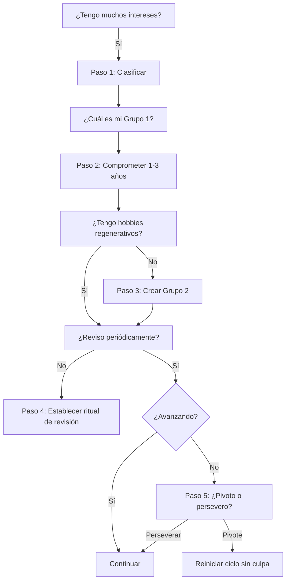

### 9.3 Sistema de Tracking Semanal

| Día 🌅 | Grupo 1 (Prioridad) | Grupo 2 (Combustible) | Grupo 3 (Espera) | Energía (1-10) | Culpa (1-10) |
|--------|---------------------|------------------------|------------------|----------------|--------------|
| Lunes | ___ horas | ___ horas | ___ horas | ___ | ___ |
| Martes | ___ horas | ___ horas | ___ horas | ___ | ___ |
| Miércoles | ___ horas | ___ horas | ___ horas | ___ | ___ |
| Jueves | ___ horas | ___ horas | ___ horas | ___ | ___ |
| Viernes | ___ horas | ___ horas | ___ horas | ___ | ___ |
| Sábado | ___ horas | ___ horas | ___ horas | ___ | ___ |
| Domingo | ___ horas | ___ horas | ___ horas | ___ | ___ |
| **Total** | **___** | **___** | **___** | **Prom: ___** | **Prom: ___** |

---

## PARTE 10: MATRIZ DE CREENCIAS LIMITANTES vs. POTENCIADORAS ⚖️

### 10.1 Identifica tus Creencias sobre la Multipasionalidad

| Creencia Limitante ❌ | ¿Dónde la aprendí? | Costo en mi vida | Creencia Potenciadora ✅ |
|----------------------|---------------------|------------------|-------------------------|
| "Debo elegir una sola cosa para ser exitoso" 🎯 | | | "Puedo ser multipasional y estratégico al mismo tiempo" |
| "Cambiar de rumbo es fracasar" ❌ | | | "Pivotar es señal de inteligencia y adaptabilidad" |
| "Si no lo monetizo, no vale la pena" 💸 | | | "El bienestar mental también es un resultado valioso" |
| "Tengo demasiados intereses, algo va mal" 🌀 | | | "Tener muchos intereses es un activo si los clasifico" |
| "Debo hacerlo todo yo mismo" 💪 | | | "Puedo delegar, colaborar y enfocarme en lo esencial" |
| "Si no avanzo rápido, estoy perdiendo tiempo" ⏰ | | | "El progreso sostenible es mejor que el sprint agotador" |
| "Los demás son más disciplinados que yo" 🏆 | | | "Mi sistema multipasional es único y válido" |

### 10.2 Transformación con la Estrategia de 5 Pasos

| Creenza Antigua | Paso que la Transforma | Resultado Esperado |
|-----------------|------------------------|-------------------|
| "Debo elegir una sola pasión" ❌ | Paso 1: Clasificar en 3 grupos | Libertad de tener muchos intereses organizados |
| "Cambiar es fracasar" ❌ | Paso 5: Pivotar sin culpa | Flexibilidad estratégica |
| "Todo debe ser productivo" ❌ | Paso 3: Hobbies sin métricas | Recuperación real y creatividad |
| "No tengo tiempo" ❌ | Paso 2: Compromiso con horizonte | Enfoque que libera tiempo |
| "Me siento culpable por dispersarme" 😰 | Paso 1: Asignar cada interés a su grupo | Claridad que elimina culpa |

---

## PARTE 11: DASHBOARD DE PRODUCTIVIDAD MULTIPASIONAL 📊

### 11.1 Métricas Integradas

Un dashboard multipasional mide tanto el progreso en el proyecto prioritario como la sostenibilidad del sistema general.

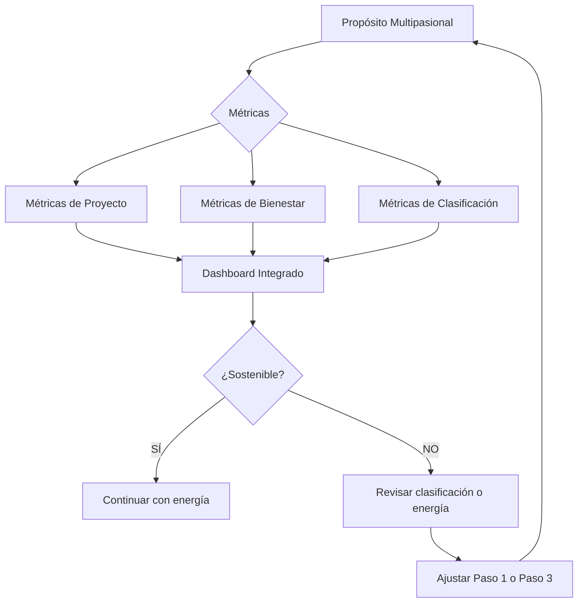

### 11.2 Tabla de Métricas

| Dominio 📊 | Métrica | Frecuencia | Meta | Alerta ⚠️ |
|------------|---------|------------|------|-----------|
| **Proyecto Prioridad** 🎯 | % de milestones completados | Semanal | > 20% mensual | < 10% mensual |
| **Energía personal** ⚡ | Nivel de energía promedio | Diaria | > 7/10 | < 5/10 por 3 días |
| **Culpa por dispersión** 😰 | Pensamientos de culpa/día | Diaria | < 1/día | > 5/día |
| **Hobby regenerativo** ⛽ | Horas de Grupo 2/semana | Semanal | > 5 horas | < 2 horas |
| **Burnout signals** 🚨 | Señales de agotamiento | Semanal | 0 | Cualquier señal |
| **Satisfacción** 😊 | Satisfacción con el sistema | Semanal | > 7/10 | < 5/10 |
| **Exploración controlada** 🔍 | Horas de Grupo 3/semana | Semanal | < 3 horas | > 5 horas |
| **Propósito alineado** 🎯 | Alineación con propósito | Mensual | > 8/10 | < 6/10 |

### 11.3 Sistema de Alertas y Acciones Correctivas

| Alerta 🚨 | Condición | Acción Inmediata |
|-----------|-----------|-----------------|
| Dispersión alta 📉 | Culpa > 5/día o Grupo 3 > 5 horas/semana | Revisar clasificación, volver a Paso 1 |
| Energía baja 🔋 | Energía < 5/10 por 3 días | Aumentar Grupo 2, revisar descanso |
| Burnout incipiente 😰 | Señales de agotamiento | Pausa obligatoria, reducir Grupo 1 temporalmente |
| Estancamiento 📊 | Progreso < 10% mensual | Diagnosticar: ¿es el proyecto o la energía? |
| Pérdida de propósito 🌫️ | Alineación < 6/10 | Revisar Paso 1: ¿es el Grupo 1 correcto? |
| Culpa por no hacer todo 😰 | Pensamientos de culpa constantes | Recordar: no se puede hacer todo, y está bien |

---

## PARTE 12: APLICACIÓN POR CONTEXTO 🏢

### 12.1 Emprendedores Multipasionales 🚀

| Principio | Implementación Práctica |
|-----------|-------------------------|
| **Un proyecto principal** 🎯 | Un negocio/core, otros como proyectos paralelos controlados |
| **Hobbies como incubadoras** ⛽ | Deporte, lectura como espacio de ideas |
| **Pivote estructurado** 🔄 | Si un proyecto no funciona en 1 año, pivotar sin culpa |
| **Combinación de intereses** 🧩 | Tecnología + arte = producto creativo |
| **Networking multipasional** 🤝 | Conectar con otros multipasionales, no solo especialistas |

### 12.2 Profesionales y Empleados 💼

| Principio | Implementación Práctica |
|-----------|-------------------------|
| **Carrera principal** 💼 | Un rol principal, side projects controlados |
| **Skill stacking** 📚 | Combinar habilidades de diferentes áreas |
| **Hobbies regenerativos** ⛽ | Deporte, arte fuera del trabajo |
| **Exploración controlada** 🔍 | Un curso/proyecto paralelo a la vez |
| **Brand personal multipasional** 🌟 | Mostrar todos tus intereses como ventaja, no dispersión |

### 12.3 Creadores y Artistas 🎨

| Principio | Implementación Práctica |
|-----------|-------------------------|
| **Proyecto central** 🎯 | Un formato principal (ej: podcast, canal) |
| **Formatos complementarios** ⛽ | Otros formatos como combustible creativo |
| **Combinación de mediums** 🧩 | Video + escritura + música = contenido único |
| **Iteración rápida** 🔄 | Probar formatos, descartar los que no funcionan |
| **Comunidad multipasional** 🤝 | Audiencia que valora la diversidad de tus intereses |

### 12.4 Estudiantes y Aprendices 📚

| Principio | Implementación Práctica |
|-----------|-------------------------|
| **Carrera principal** 🎓 | Una especialidad formal |
| **Minor o doble titulación** ⛽ | Segunda área como combustible intelectual |
| **Proyectos interdisciplinarios** 🧩 | Combinar carrera con otros intereses |
| **Clubes y comunidades** 🤝 | Grupos de otros multipasionales |
| **Experimentos controlados** 🔬 | Un proyecto extracurricular a la vez |

---

## PARTE 13: HERRAMIENTAS Y RECURSOS 🛠️

### 13.1 Stack de Herramientas para Multipasionales

| Necesidad 🛠️ | Herramienta Recomendada | Uso |
|--------------|------------------------|-----|
| **Clasificación de intereses** 📋 | Notion, Obsidian, o cuaderno físico | Lista y categorización de intereses |
| **Gestión de proyectos** 📊 | Notion, Asana, Trello | Seguimiento del Grupo 1 |
| **Block de tiempo** ⏰ | Google Calendar, Fantastical | Bloques fijos para cada grupo |
| **Tracking de hábitos** 📈 | Habitica, Streaks, o spreadsheet | Consistencia en Grupo 1 y Grupo 2 |
| **Gestión de energía** ⚡ | Energy Diary (app o journal) | Medir energía a lo largo del día |
| **Lista de espera** ⏳ | Notion "Someday/Maybe" list | Archivo de intereses sin presión |
| **Revisión trimestral** 🔄 | Notion template o Google Docs | Ritual de revisión estructurado |

### 13.2 Template de Notion para Multipasionales

```text
📋 MI SISTEMA MULTIPASIONAL (Notion Template)
═══════════════════════════════════════════════

[PÁGINA PRINCIPAL]
├── 🎯 Propósito Central
│   └── ¿Por qué hago lo que hago?
├── 📊 Dashboard
│   ├── Progreso Grupo 1 (esta semana)
│   ├── Energía promedio (esta semana)
│   ├── Culpa promedio (esta semana)
│   └── Próxima revisión (fecha)
├── 📋 Grupos de Intereses
│   ├── Grupo 1: Prioridad
│   │   ├── Proyecto: __________
│   │   ├── Horizonte: ___ años
│   │   ├── Horas esta semana: ___
│   │   └── Milestones: __________
│   ├── Grupo 2: Combustible
│   │   ├── Hobby 1: ___ (horario fijo: ___)
│   │   ├── Hobby 2: ___ (horario fijo: ___)
│   │   └── Hobby 3: ___ (horario fijo: ___)
│   └── Grupo 3: Espera
│       ├── Interés 1: ___ (energía asignada: ___%)
│       ├── Interés 2: ___ (energía asignada: ___%)
│       └── Interés 3: ___ (energía asignada: ___%)
├── 📅 Calendario
│   ├── Bloque 1: Prioridad (horas fijas)
│   ├── Bloque 2: Combustible (horas fijas)
│   ├── Bloque 3: Exploración (máximo 3h/sem)
│   └── Bloque 4: Descanso (no negociable)
└── 📈 Revisiones
    ├── Última revisión: [Fecha]
    ├── Próxima revisión: [Fecha]
    ├── Decisiones tomadas: __________
    └── Ajustes para próximo período: __________
```

---

## PARTE 14: GLOSARIO DE CONCEPTOS CLAVE 📚

| Término 📖 | Definición |
|------------|------------|
| **Multipasional** 🧬 | Persona con múltiples intereses genuinos y la tendencia a explorarlos todos |
| **Especialista** 🎯 | Persona que enfoca su carrera en un área específica |
| **Grupo 1 (Prioridad)** 🚀 | Proyecto principal con potencial de monetización en 1-3 años |
| **Grupo 2 (Combustible)** ⛽ | Actividades regenerativas sin presión de monetización |
| **Grupo 3 (Lista de Espera)** ⏳ | Intereses genuinos pero no urgentes, archivados para después |
| **Burnout** 🚨 | Agotamiento físico, emocional y mental por estrés sostenido |
| **Pivote** 🔄 | Cambio deliberado de dirección en un proyecto o carrera |
| **Horizonte temporal** ⏱️ | Período definido de compromiso con un proyecto (1-3 años) |
| **Hobby regenerativo** 🌱 | Actividad que recupera energía sin métricas de rendimiento |
| **Skill stacking** 📚 | Combinar habilidades de diferentes áreas para crear propuesta única |
| **Productividad deliberada** 🎯 | Enfoque intencional en lo que importa, eliminando lo superfluo |
| **Culpa del multipasional** 😰 | Sentimiento de culpa por no poder hacer todos los intereses simultáneamente |

---

## PARTE 15: CHECKLIST FINAL DE IMPLEMENTACIÓN ✅

### 15.1 Paso 1: Planificar y Clasificar

| Check ✅ | Estado |
|----------|--------|
| He listado TODOS mis intereses actuales | ☐ |
| He evaluado cada interés según los 5 criterios | ☐ |
| He asignado cada interés a Grupo 1, 2 o 3 | ☐ |
| Mi Grupo 1 tiene máximo 1-3 proyectos | ☐ |
| Mi Grupo 2 tiene al menos 2-3 actividades regenerativas | ☐ |
| Mi Grupo 3 está documentado sin presión | ☐ |

### 15.2 Paso 2: Comprometerse

| Check ✅ | Estado |
|----------|--------|
| He definido un horizonte temporal (1-3 años) | ☐ |
| He asignado horas semanales a cada grupo | ☐ |
| Tengo un "contrato de compromiso" firmado | ☐ |
| Mi bloque de prioridad está protegido en el calendario | ☐ |
| He comunicado mi compromiso a personas clave | ☐ |

### 15.3 Paso 3: Descansar y Prevenir Burnout

| Check ✅ | Estado |
|----------|--------|
| Mis hobbies del Grupo 2 cumplen los 3 criterios | ☐ |
| Tengo horarios fijos para Grupo 2 | ☐ |
| Duermo 7-9 horas por noche | ☐ |
| Tengo al menos 1 día completo de desconexión | ☐ |
| No uso hobbies como escape de problemas | ☐ |

### 15.4 Paso 4: Revisar y Adaptar

| Check ✅ | Estado |
|----------|--------|
| Tengo un ritual de revisión trimestral agendado | ☐ |
| Mido las 7 métricas de progreso semanalmente | ☐ |
| He detectado señales de estancamiento temprano | ☐ |
| Ajusto mi clasificación cuando es necesario | ☐ |
| Celebro logros pequeños cada semana | ☐ |

### 15.5 Paso 5: Pivotar sin Culpa

| Check ✅ | Estado |
|----------|--------|
| Tengo definida una condición para pivote | ☐ |
| No pivoto antes de 6 meses de compromiso | ☐ |
| He normalizado el pivote como parte del proceso | ☐ |
| Tengo un "plan de salida" para mi Grupo 1 actual | ☐ |
| Celebro los pivotes como aprendizaje, no fracaso | ☐ |

---

## PREGUNTAS DE VERIFICACIÓN 📝

Responde cada pregunta basándote en los conceptos de esta masterclass. Escribe tus respuestas o compártelas para profundizar tu aprendizaje.

### Preguntas sobre el Paso 1: Planificar y Clasificar

1. **Aplica**: Tienes 12 intereses actuales. Según los criterios de la masterclass, ¿cuántos deberían estar en Grupo 1? ¿Por qué?

2. **Analiza**: ¿Por qué es peligroso tener más de 3 proyectos en Grupo 1? ¿Qué sucede con la energía y el progreso?

3. **Compara**: ¿En qué se diferencia un hobby del Grupo 2 de un proyecto del Grupo 3? ¿Por qué esta distinción es crucial?

### Preguntas sobre el Paso 2: Comprometerse

4. **Reflexiona**: ¿Qué horizonte temporal (1, 2 o 3 años) elegirías para tu proyecto prioritario y por qué?

5. **Diseña**: Crea un bloque de tiempo semanal para tu Grupo 1, Grupo 2 y Grupo 3. ¿Cómo lo distribuirías?

6. **Evalúa**: ¿Qué harías si, a los 3 meses de compromiso, sientes la tentación de agregar un nuevo proyecto al Grupo 1?

### Preguntas sobre el Paso 3: Descansar y Prevenir Burnout

7. **Analiza**: Según los 3 criterios de un buen hobby, ¿tus actividades actuales del Grupo 2 son realmente regenerativas? ¿Por qué sí o por qué no?

8. **Propón**: Diseña 3 hobbies regenerativos para tu contexto (deportivo, artístico, manual) que cumplan los 3 criterios.

9. **Reflexiona**: ¿Has experimentado burnout por intentar hacer demasiado? ¿Qué señales tuviste y cómo lo resolviste?

### Preguntas sobre los Pasos 4 y 5: Revisar y Pivotar

10. **Sintetiza**: ¿Por qué es importante revisar trimestralmente tu clasificación de intereses? ¿Qué puede cambiar en 3 meses?

11. **Aplica**: ¿Qué condición pondrías para decidir pivotar? ¿Qué métricas o señales te harían decir "es momento de cambiar"?

12. **Reflexión final**: ¿Cómo te sientes respecto a la idea de "pivote sin culpa"? ¿Qué creencia limitante te impide normalizar el cambio de rumbo?

---

## GLOSARIO RÁPIDO 📚

| Término | Definición |
|---------|------------|
| **Multipasional** 🧬 | Persona con múltiples intereses genuinos y tendencia a explorarlos |
| **Especialista** 🎯 | Persona enfocada en un área específica de conocimiento o profesión |
| **Grupo 1 (Prioridad)** 🚀 | Proyecto principal con potencial de monetización en 1-3 años |
| **Grupo 2 (Combustible)** ⛽ | Actividades regenerativas sin presión de monetización ni métricas |
| **Grupo 3 (Lista de Espera)** ⏳ | Intereses genuinos archivados para el futuro |
| **Burnout** 🚨 | Agotamiento por estrés sostenido; señal de sistema desbalanceado |
| **Pivote** 🔄 | Cambio deliberado de dirección; no es fracaso, es evolución |
| **Horizonte temporal** ⏱️ | Período definido de compromiso (1-3 años) con un proyecto prioritario |
| **Hobby regenerativo** 🌱 | Actividad que recupera energía: sensorial, sin métricas, con horario fijo |
| **Skill stacking** 📚 | Combinar habilidades diversas para crear propuesta de valor única |
| **Productividad deliberada** 🎯 | Enfoque intencional en lo esencial, eliminando lo superfluo |
| **Culpa del multipasional** 😰 | Sentimiento de culpa por no poder atender todos los intereses simultáneamente |

---

## ANEXO: FORMATO IDEAL PARA CONTENIDO DE PRODUCTIVIDAD 📖

### Recomendaciones de legibilidad para guías de productividad

El ancho óptimo para artículos de productividad y estrategia es **60–75 caracteres por línea** (incluyendo espacios). Equivale aproximadamente a:

- `max-width: 65ch` en CSS.
- 550–750 px de ancho de contenido.

```css
.article-content {
  max-width: 65ch;
  font-size: 18px;
  line-height: 1.75;
}
```

Esto facilita:

- Escanear listas y tablas rápidamente
- Seguir pasos numerados sin perderse
- Reducir la fatiga en contenido accionable
- Mantener la atención en sistemas complejos

---

### Lo que hace efectiva una guía de productividad

#### 1. Pasos numerados claramente

Cada paso debe ser reconocible al escanear.

**Mejor:**

```
Paso 1: Clasificar
Paso 2: Comprometerse
Paso 3: Descansar
Paso 4: Revisar
Paso 5: Pivotar
```

**Peor:**

"Primero clasifica, luego comprométete, después descansa, después revisa y finalmente pivot..."

#### 2. Tablas como sistema de decisiones

Las tablas permiten comparar opciones rápidamente.

| Opción A | Opción B |
|----------|----------|
| Ventaja 1 | Ventaja 2 |
| Desventaja 1 | Desventaja 2 |

#### 3. Espacio para tomar notas

Después de cada sección, incluye un bloque vacío o pregunta para que el lector escriba.

> **📝 Tu turno:** ¿Cuál es tu Grupo 1 actual? Escríbelo aquí.

#### 4. Visualizaciones que expliquen flujos

Los diagramas Mermaid son ideales para mostrar sistemas de decisión.

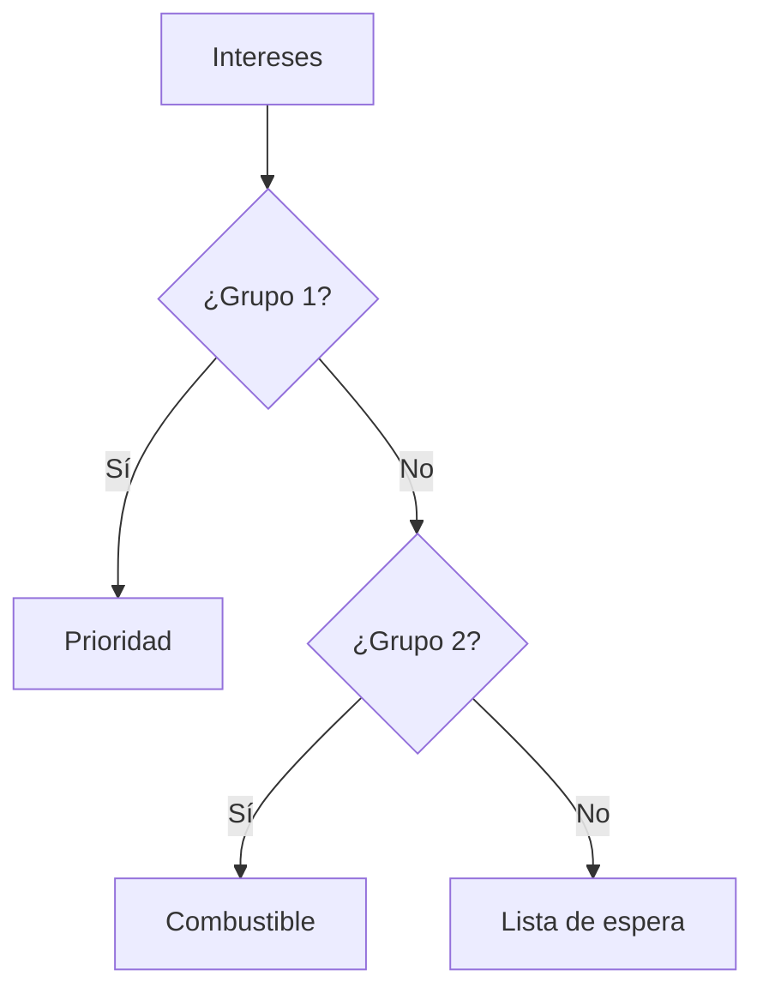

#### 5. Ejemplos concretos, no abstractos

**Mejor:**

> Coco Chanel combinó moda, perfumería y diseño en un imperio.

**Peor:**

> Las personas multipasionales pueden combinar sus intereses para crear valor.

#### 6. Cierres accionables

Cada sección debe terminar con una acción concreta.

> **✅ Acción:** Clasifica tus intereses en 3 grupos HOY. No mañana. Hoy.

---

## REFERENCIAS Y RECURSOS ADICIONALES 📚

### Videos y Conferencias 🎥

| Recurso | Descripción |
|---------|-------------|
| **Estrategia de 5 Pasos para Multipasionales** 🎬 | Video original que inspiró esta masterclass |
| **The Art of Doing Multiple Things** 🎓 | TED Talk sobre multipasionalidad productiva |
| **How to Focus When You Have Too Many Interests** 📹 | Estrategias de enfoque para mentes dispersas |

### Libros Recomendados 📖

| Título | Autor | Por qué leerlo |
|--------|-------|----------------|
| **"Range"** | David Epstein | Por qué los generalistas triunfan en un mundo de especialistas |
| **"The Polymath"** | Waqas Ahmed | La historia y ciencia de la multipasionalidad |
| **"Atomic Habits"** | James Clear | Cómo construir hábitos que sostengan cualquier proyecto |
| **"Deep Work"** | Cal Newport | Estrategias de enfoque profundo para proyectos prioritarios |
| **"The Creative Curve"** | Allen Gannett | Cómo la práctica deliberada genera genialidad |

### Citas Inspiradoras 💎

> "El especialista sabe cada vez más sobre cada vez menos, hasta que sabe todo sobre nada. El generalista sabe cada vez menos sobre cada vez más, hasta que no sabe nada de nada. El multipasional estratégico sabe lo suficiente de muchas cosas para conectarlas de maneras que el especialista no puede ver."
> — Adaptado de Nicholas Taleb

> "No tengo fracasos. Solo tengo experimentos que no funcionaron como esperaba. Cada uno me acerca a lo que sí funcionará."
> — Thomas Edison (actitud multipasional)

> "La dispersión no es un defecto de carácter. Es un síntoma de un sistema sin clasificación."
> — Estrategia de 5 pasos para multipasionales

> "Pivotar no es abandonar. Es redirigir con inteligencia."
> — Principio de adaptabilidad multipasional

---

## CIERRE: TU TURNO DE CONVERTIRTE EN UN MULTIPASIONAL ESTRATÉGICO 📝

Has recorrido los 5 pasos: clasificar, comprometer, descansar, revisar y pivotar. Ahora comprendes que tu multipasionalidad no es un problema: es **tu superpower**, siempre que lo estructures. 🚀

La sociedad premia la especialización, pero los grandes logros de la humanidad —desde la Capilla Sixtina hasta el iPhone— provienen de mentes que **combinaron** intereses aparentemente dispares. Tu curiosidad múltiple no es un defecto: es tu **ventaja competitiva**. 🏆

Ahora te toca actuar:

1. **HOY mismo:** clasifica tus intereses en Grupo 1, 2 y 3.
2. **Esta semana:** define tu horizonte temporal y bloquea tu tiempo de prioridad.
3. **Este mes:** establece tu ritual de revisión trimestral.
4. **Este año:** conviértete en un ejemplo de multipasionalidad estratégica.

> **🎓 Cierre final** — El éxito no es hacer una sola cosa perfectamente. Es **convertir el caos de tus intereses en un sistema deliberado de crecimiento**. Como dijo el video: el éxito viene de transformar patrones caóticos en trayectorias deliberadas y por fases. Tienes la curiosidad. Ahora tienes el sistema. Ahora solo falta comprometerte. 🎯

**Tu próximo paso:** Elige tu Grupo 1 HOY. Un solo proyecto. No 2. No 3. Uno. Y comprométete por un horizonte definido. El resto de tus intereses no desaparecen: se reorganizan para **servir** a tu foco, no para **competir** con él. ✨

---

## APPENDIX: PROMPTS PARA REFLEXIÓN GUIADA 🧠

### Prompt Diario (3 minutos)

> "¿Avancé hoy en mi Grupo 1? ¿Disfruté mi Grupo 2? ¿Me dejé llevar por el Grupo 3?"

### Prompt Semanal (10 minutos)

> "¿Mi clasificación de intereses sigue siendo correcta? ¿Qué ajuste necesito hacer para la próxima semana?"

### Prompt Mensual (20 minutos)

> "¿Estoy avanzando en mi proyecto prioritario? ¿Me siento energizado o agotado? ¿Necesito ajustar mi sistema?"

### Prompt Trimestral (1 hora)

> "Revisando los últimos 3 meses: ¿convertí mi multipasionalidad en productividad deliberada? ¿Qué pivotes necesito hacer? ¿Cómo celebro mis logros?"

---

**Fin de la Masterclass** 🎓✨

*Creada siguiendo los lineamientos de skill.md | Inspirada en el video de estrategia para multipasionales | Enfoque estratégico-práctico*
