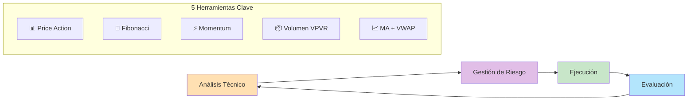
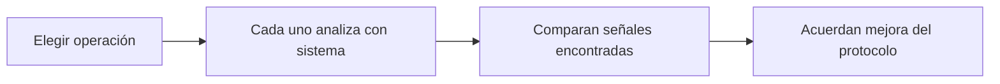
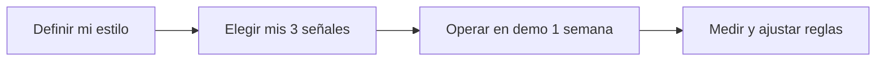

# MASTERCLASS: Estrategia de Trading 2026 - Enfoque Simplificado de Joven Inversor 📈

## INTRODUCCIÓN: POR QUÉ ESTA MASTERCLASS ES DIFERENTE 🎯

El trading suele asociarse a sistemas automáticos fríos y decenas de indicadores. Joven Inversor demuestra lo contrario: **menos herramientas, más interpretación**. Su estrategia combina análisis técnico concreto con gestión de riesgo activa, sin depender de señales automatizadas.

El objetivo no es copiar ciegamente sus herramientas, sino entender **cómo combinar indicadores simples** y **cómo gestionar el riesgo** para construir un sistema sostenible.

> **🎯 Objetivo de Aprendizaje** — Al final de esta guía, podrás explicar los 5 componentes de su estrategia, aplicar gestión de riesgo con porcentajes de cuenta, diseñar un protocolo de entrada/salida y evaluar si la automatización conviene a tu estilo.

> **⚠️ Advertencia educativa** — Este contenido es formativo. El trading conlleva riesgo financiero. Nunca operes con dinero que no estés dispuesto a perder. Practica primero en demo.

---

## 🗺️ MAPA DE LA MASTERCLASS 🧭

---

## 📊 PARTE 1: PRICE ACTION - LA BASE DE TODO 📊

### 1.1 🧪 PRETEST

¿Qué concepto describe mejor "leer el comportamiento del precio sin indicadores"?

> Respuesta esperada: Price Action.
> Si acertás: camino rápido → andá al punto 7.

### 1.2 🎯 POR QUÉ + LOGRO

Importa porque es el **idioma universal del mercado**. Vas a lograr **identificar tendencias y zonas clave** sin depender de indicadores retrasados.

### 1.3 ⚡ VICTORIA RÁPIDA (<5 min)

Dibuja en un papel 3 velas consecutivas: una verde grande, una roja pequeña, otra verde mediana. Sin indicadores, ¿qué historia te cuenta el precio?

### 1.4 💡 CONCEPTO

Analogía: Price Action es como **leer la cara de alguien** — no necesitas preguntarle, su expresión te dice si está tranquilo, ansioso o eufórico.

Definición: Analizar el movimiento del precio solo, enfocándose en soportes, resistencias y tendencias, sin indicadores adicionales.

### 1.5 📋 EJEMPLO RESUELTO

| 📌 Paso | 📝 Acción | 🎯 Resultado |
|------|--------|-----------|
| 1 | Identifica el último máximo relevante | Zona de resistencia |
| 2 | Identifica el último mínimo relevante | Zona de soporte |
| 3 | Observa el precio entre ambos | Tendencia lateral o direccional |

### 1.6 ⚠️ CONTRA-EJEMPLO / ERROR TÍPICO

Error: Usar muchos indicadores para "confirmar" lo que el precio ya muestra.

Corrección: El precio es el último indicador en actualizarse. Si el precio rompe una resistencia, los indicadores lo confirmarán después — ya es tarde.

### 1.7 🎯 PRÁCTICA

Abre cualquier gráfico y marca: soporte más cercano, resistencia más cercana, tendencia actual (alcista/bajista/lateral).

> Respuesta esperada / criterio: Soporte = mínimo donde el precio rebotó. Resistencia = máximo donde el precio fue rechazado. Tendencia = dirección general de máximos y mínimos.

### 1.8 🧠 RECALL — Nivel Bloom: Comprender

¿Por qué el Price Action es la base de la estrategia de Joven Inversor?

### 1.9 📌 IDEA CLAVE

Price Action es el lenguaje del mercado: si lo dominas, los indicadores son confirmadores, no necesarios.

### 1.10 ✅ AUTO-CHEQUEO + SIGUIENTE

- [ ] Identifiqué soportes y resistencias en un gráfico real
- [ ] Distinguí las 3 fases de tendencia
- [ ] Entiendo por qué los indicadores van retrasados

Siguiente: Fibonacci, la herramienta que mide retrocesos naturales.

---

## 📐 PARTE 2: FIBONACCI - ZONAS DE REACCIÓN PROBABLE 📐

### 2.1 🧪 PRETEST

¿Qué nivel de Fibonacci se usa habitualmente para buscar retrocesos de tendencia?

> Respuesta esperada: 61.8%.
> Si acertás: camino rápido → andá al punto 7.

### 2.2 🎯 POR QUÉ + LOGRO

Importa porque los retrocesos de Fibonacci coinciden con **zonas psicológicas de compra/venta**. Vas a lograr **ubicar entradas con mejor riesgo/beneficio**.

### 2.3 ⚡ VICTORIA RÁPIDA (<5 min)

En cualquier tendencia alcista, mide desde el mínimo hasta el máximo. Ahora dibuja la línea horizontal en el 38.2% y 61.8%. ¿Dónde comprarías?

### 2.4 💡 CONCEPTO

Analogía: Fibonacci es como **medir la elasticidad de una goma** — sabes hasta dónde se estira antes de volver.

Definición: Herramienta de análisis técnico que mide retrocesos (pullbacks) y extensiones (explosiones) basándose en proporciones matemáticas naturales.

### 2.5 📋 EJEMPLO RESUELTO

| 📌 Paso | 📝 Acción | 📐 Zona Fibonacci |
|------|--------|----------------|
| 1 | Tendencia alcista clara | Min 100 → Max 200 |
| 2 | Retroceso al 38.2% | Entrada conservadora |
| 3 | Retroceso al 50% | Entrada neutral |
| 4 | Retroceso al 61.8% | Entrada agresiva |

### 2.6 ⚠️ CONTRA-EJEMPLO / ERROR TÍPICO

Error: Usar Fibonacci en gráficos sin tendencia clara.

Corrección: Fibonacci funciona en tendencias, no en laterales. Si no hay dirección clara, no hay retroceso que medir.

### 2.7 🎯 PRÁCTICA

Toma una tendencia alcista de un gráfico real y marca: entrada en 38.2%, entrada en 61.8%, objetivo de extensión en 161.8%.

> Respuesta esperada / criterio: Las entradas se ubican en retrocesos, el objetivo en la extensión que supera el máximo anterior.

### 2.8 🧠 RECALL — Nivel Bloom: Aplicar

¿En qué timeframe usa Joven Inversor principalmente Fibonacci y por qué?

### 2.9 📌 IDEA CLAVE

Fibonacci mide el "retiro" natural del precio: en tendencias fuertes, el 61.8% es la zona donde muchos traders entran nuevamente.

### 2.10 ✅ AUTO-CHEQUEO + SIGUIENTE

- [ ] Miedí un retroceso de Fibonacci en un gráfico real
- [ ] Entiendo la diferencia entre retroceso y extensión
- [ ] Sé por qué el H4 es el timeframe preferido

Siguiente: Indicadores de momentum que detectan cambios de dirección.

---

## ⚡ PARTE 3: MOMENTUM - RSI Y ORACLE OSCILLATOR ⚡

### 3.1 🧪 PRETEST

¿Qué busca un indicador de momentum en el mercado?

> Respuesta esperada: Medir la fuerza de un movimiento.
> Si acertás: camino rápido → andá al punto 7.

### 3.2 🎯 POR QUÉ + LOGRO

Importa porque el precio puede estar quieto mientras la **fuerza interna cambia**. Vas a lograr **detectar divergencias antes de que el precio gire**.

### 3.3 ⚡ VICTORIA RÁPIDA (<5 min)

Compara: precio hace un máximo más alto, RSI hace un máximo más bajo. ¿Qué está pasando? → Respuesta: divergencia bajista oculta.

### 3.4 💡 CONCEPTO

Analogía: Momentum es como **ver la canica antes de que caiga por la pendiente** — la canica (precio) está arriba, pero ya perdió velocidad.

Definición: Indicadores que miden la velocidad y fuerza de un movimiento de precio. Cuando el precio y el indicador se separan (divergencia), el movimiento actual puede estar agotándose.

### 3.5 📋 EJEMPLO RESUELTO

| 📊 Señal | 💰 Precio | ⚡ RSI | 🧠 Interpretación |
|-------|--------|-----|----------------|
| Divergencia bajista | Máximo más alto | Máximo más bajo | Posible giro bajista |
| Divergencia alcista | Mínimo más bajo | Mínimo más alto | Posible rebote |

### 3.6 ⚠️ CONTRA-EJEMPLO / ERROR TÍPICO

Error: Comprar solo porque el RSI está en sobreventa (por debajo de 30).

Corrección: En tendencias bajistas fuertes, el RSI puede estar semanas en sobreventa sin rebotar. La divergencia es más confiable que el nivel absoluto.

### 3.7 🎯 PRÁCTICA

Encuentra una divergencia entre precio y RSI en un gráfico real. Marca el máximo del precio, el máximo del RSI y la línea que los une.

> Respuesta esperada / criterio: Las líneas deben ir en direcciones opuestas. Precio sube, RSI baja = divergencia bajista.

### 3.8 🧠 RECALL — Nivel Bloom: Analizar

¿Por qué Joven Inversor combina RSI con su Oracle Oscillator en vez de usar solo uno?

### 3.9 📌 IDEA CLAVE

Las divergencias entre precio y momentum son la señal de "alguien está comprando/vendiendo fuerte" antes de que el precio lo muestre.

### 3.10 ✅ AUTO-CHEQUEO + SIGUIENTE

- [ ] Identifiqué una divergencia en un gráfico real
- [ ] Entiendo la diferencia entre divergencia alcista y bajista
- [ ] Sé por qué el Oracle Oscillator es privado y qué función cumple

Siguiente: Cómo el volumen revela zonas de verdadero acuerdo o conflicto.

---

## 📦 PARTE 4: VOLUMEN - VPVR Y PUNTO DE CONTROL 📦

### 4.1 🧪 PRETEST

¿Qué representa el POC (Point of Control) en el perfil de volumen?

> Respuesta esperada: El precio con mayor volumen negociado.
> Si acertás: camino rápido → andá al punto 7.

### 4.2 🎯 POR QUÉ + LOGRO

Importa porque el volumen revela **dónde estuvo el verdadero acuerdo** entre compradores y vendedores. Vas a lograr **ubicar zonas de alto interés institucional**.

### 4.3 ⚡ VICTORIA RÁPIDA (<5 min)

Mira un gráfico con VPVR: el POC es la línea horizontal más ancha. Si el precio vuelve ahí, ¿qué esperas que pase? → Respuesta: Reacción (rebote o consolidación).

### 4.4 💡 CONCEPTO

Analogía: VPVR es como **ver la profundidad del océano** — no solo la superficie, sino dónde hay más agua (negociación) debajo.

Definición: El Volume Profile Visible Range (VPVR) muestra el volumen negociado en cada precio durante un período, revelando el Point of Control (POC) como la zona de mayor negociación.

### 4.5 📋 EJEMPLO RESUELTO

| 📦 Elemento | 💡 Significado | ✅ Acción |
|----------|-------------|--------|
| POC (línea más ancha) | Máximo acuerdo de precio | Zona de soporte/resistencia natural |
| Zona de valor | Donde se negoció el 70% del volumen | Rango donde el precio "pertenece" |
| Zonas de baja negociación | Pocas operaciones | Zonas frágiles, se rompen fácil |

### 4.6 ⚠️ CONTRA-EJEMPLO / ERROR TÍPICO

Error: Tratar el POC como una línea exacta de entrada.

Corrección: El POC es una **zona**, no un precio exacto. El precio puede oscilar alrededor de él. Úsalo como referencia, no como orden exacta.

### 4.7 🎯 PRÁCTICA

Abre un gráfico con VPVR. Marca el POC actual y explica por qué es una zona de negociación clave.

> Respuesta esperada / criterio: El POC concentra el mayor volumen, por lo tanto es donde más órdenes están acumuladas. Si el precio vuelve, hay alta probabilidad de reacción.

### 4.8 🧠 RECALL — Nivel Bloom: Aplicar

¿Cómo ayuda el VPVR a detectar zonas de conflicto entre compradores y vendedores?

### 4.9 📌 IDEA CLAVE

El VPVR te muestra dónde el mercado "descansó" más: donde hay más volumen, hay más interés y, por lo tanto, más probabilidad de reacción.

### 4.10 ✅ AUTO-CHEQUEO + SIGUIENTE

- [ ] Identifiqué el POC en un gráfico real
- [ ] Entiendo qué es una zona de valor
- [ ] Sé por qué las zonas de baja negociación son frágiles

Siguiente: Medias móviles y VWAP como filtros de dirección.

---

## 📈 PARTE 5: MEDIAS MÓVILES Y VWAP - FILTROS DE TENDENCIA 📈

### 5.1 🧪 PRETEST

¿Qué diferencia principal hay entre una media móvil simple y una exponencial?

> Respuesta esperada: La exponencial da más peso a los precios recientes.
> Si acertás: camino rápido → andá al punto 7.

### 5.2 🎯 POR QUÉ + LOGRO

Importa porque las medias y el VWAP actúan como **líneas dinámicas de soporte/resistencia**. Vas a lograr **filtrar operaciones a favor de la tendencia institucional**.

### 5.3 ⚡ VICTORIA RÁPIDA (<5 min)

En un gráfico, traza la EMA 20. Si el precio está por encima y la EMA sube, ¿estás en tendencia alcista o bajista? → Respuesta: Alcista.

### 5.4 💡 CONCEPTO

Analogía: La EMA 20 es como la **velocidad promedio de un coche** — no te dice hacia dónde va, pero sí si va acelerando o frenando.

Definición: La media móvil exponencial (EMA) de 20 períodos suaviza el precio para mostrar la dirección corto/mediano plazo. El VWAP (Volume Weighted Average Price) muestra el precio promedio ponderado por volumen del día.

### 5.5 📋 EJEMPLO RESUELTO

| 📈 Condición | 🧠 Interpretación | 🎯 Acción |
|-----------|----------------|--------|
| Precio > EMA 20 y EMA sube | Tendencia alcista institucional | Buscar compras en retrocesos |
| Precio < EMA 20 y EMA baja | Tendencia bajista institucional | Buscar ventas en rebotes |
| Precio > VWAP | El día está alcista | No tomar cortos contra tendencia del día |

### 5.6 ⚠️ CONTRA-EJEMPLO / ERROR TÍPICO

Error: Usar EMA 20 como único filtro para entrar.

Corrección: La EMA es un **filtro de tendencia**, no una señal de entrada. Úsala para decidir si operar a favor o en contra, no como gatillo exacto.

### 5.7 🎯 PRÁCTICA

En un gráfico diario, marca: EMA 20, VWAP del día, y responde: ¿El precio está por encima o debajo de ambas? ¿Qué lado tiene ventaja estadística?

> Respuesta esperada / criterio: Si precio > EMA 20 > VWAP, ventaja alcista. Si precio < EMA 20 < VWAP, ventaja bajista.

### 5.8 🧠 RECALL — Nivel Bloom: Analizar

¿Por qué Joven Inversor usa EMA 20 y VWAP juntos en vez de solo uno?

### 5.9 📌 IDEA CLAVE

EMA 20 y VWAP son filtros, no señales: te dicen si el viento sopla a favor o en contra antes de soltar la vela.

### 5.10 ✅ AUTO-CHEQUEO + SIGUIENTE

- [ ] Trazé EMA 20 y VWAP en un gráfico real
- [ ] Identifiqué 3 zonas donde precio y EMA cambiaron de relación
- [ ] Entiendo por qué VWAP se reinicia cada día

Siguiente: Cómo proteger tu cuenta antes de buscar ganancias.

---

## 🛡️ PARTE 6: GESTIÓN DE RIESGO - EL VERDADERO EDGE 🛡️

### 6.1 🧪 PRETEST

¿Qué porcentaje máximo de cuenta pierde Joven Inversor por operación?

> Respuesta esperada: 5%.
> Si acertás: camino rápido → andá al punto 7.

### 6.2 🎯 POR QUÉ + LOGRO

Importa porque el trading no se gana por acertar más, sino por **perder menos cuando te equivocas**. Vas a lograr **diseñar un sistema de riesgo que sobreviva meses de sequía**.

### 6.3 ⚡ VICTORIA RÁPIDA (<5 min)

Cuenta: cuenta de $10,000, riesgo 5% por operación, stop loss a 1%. ¿Cuánto dinero es tu riesgo máximo? → Respuesta: $500.

### 6.4 💡 CONCEPTO

Analogía: Gestión de riesgo es como **llevar un paracaídas** — no evita que te lances, pero define si sobrevives al aterrizaje.

Definición: Conjunto de reglas que determinan cuánto capital arriesgar por operación, dónde colocar el stop loss y cómo modificar posiciones sin exponer la cuenta a quiebras.

### 6.5 📋 EJEMPLO RESUELTO

| 🛡️ Regla | 📊 Valor | 💡 Explicación |
|-------|-------|-------------|
| Capital por operación | 15-25% del total | Diversificación, no todo en una posición |
| Pérdida máxima por operación | 5% de la cuenta | Límite de daño por error de análisis |
| Gestión activa | Sumar en niveles clave | Aumentar posición si la tesis sigue válida |
| Stop loss | No es el único límite | Se gestiona la posición, no solo el stop |

### 6.6 ⚠️ CONTRA-EJEMPLO / ERROR TÍPICO

Error: Calcular el riesgo en pips o dólares sin relación a tu cuenta.

Corrección: El riesgo siempre debe ser un **porcentaje de tu cuenta**. 5% de $1,000 no es lo mismo que 5% de $100,000. La regla protege tu cuenta, no tu ego.

### 6.7 🎯 PRÁCTICA

Diseña tu regla de riesgo: cuenta de $5,000, riesgo 5% por operación. Si tu stop loss está a 2% del precio de entrada, ¿qué tamaño de posición debes comprar?

> Respuesta esperada / criterio: Riesgo $250 / 2% stop = posición de $12,500. Nunca arriesgues más del 5% sin importar el tamaño de la cuenta.

### 6.8 🧠 RECALL — Nivel Bloom: Aplicar

¿Por qué Joven Inversor suma posiciones en niveles técnicos en vez de cerrar toda la posición ante el primer movimiento en contra?

### 6.9 📌 IDEA CLAVE

El riesgo no es solo el stop loss: es cuánto de tu cuenta estás dispuesto a perder si tu análisis falla. 5% es el número que te mantiene vivo.

### 6.10 ✅ AUTO-CHEQUEO + SIGUIENTE

- [ ] Calculé el tamaño de posición según % de riesgo
- [ ] Entiendo la diferencia entre riesgo por operación y capital por operación
- [ ] Diseñé mi regla de stop loss máximo

Siguiente: Cómo diseñar tu sistema completo y decidir si automatizarlo.

---

## 🎓 PARTE 7: I DO / WE DO / YOU DO - SISTEMA COMPLETO 🎓

### 7.1 🧭 I Do — Armado de un plan de trading simple

**🎯 Objetivo**: Combinar Price Action + Fibonacci + EMA 20 + VWAP + gestión de riesgo en un solo flujo.

| 📌 Paso | 📝 Acción | ⏱️ Tiempo |
|------|--------|--------|
| 1 | Identificar tendencia con EMA 20 + VWAP | 5 min |
| 2 | Marcar soportes y resistencias con Price Action | 5 min |
| 3 | Buscar retroceso a Fibonacci en tendencia | 3 min |
| 4 | Confirmar con divergencia en RSI | 3 min |

**📋 Ejemplo guiado**:
- Tendencia: alcista (precio > EMA 20 > VWAP)
- Retroceso: precio llega a 61.8% Fibonacci
- Confirmación: RSI muestra divergencia alcista
- Entrada: compra en zona de retroceso
- Riesgo: 5% de cuenta con stop bajo el soporte previo

### 7.2 🤝 We Do — Evaluación colaborativa de operaciones

**👥 Ejercicio grupal**: Analicen una operación real pasada con el sistema de 5 pasos.

**📜 Reglas del ejercicio**:
1. Sin justificar ganancias/perdidas con emociones
2. Cada uno identifica: tendencia, Fibonacci, RSI, VWAP, riesgo
3. Comparen: ¿todos entraron en la misma zona?
4. Identifiquen qué señal faltó o sobró
5. Cada persona propone 1 ajuste al protocolo

### 7.3 🚀 You Do — Tu sistema personal de trading

**📋 Tarea**: Diseña tu protocolo de trading con 5 reglas propias.

**✅ Checklist de implementación**:

- [ ] 📈 Definí mi timeframe principal (recomendado: H4 para swing)
- [ ] 📊 Elegí mis 3 herramientas del sistema (de las 5 posibles)
- [ ] 🎯 Escribí mi regla de entrada en 1 párrafo
- [ ] 🛡️ Establecí mi riesgo máximo por operación (máximo 5%)
- [ ] 🧮 Calculé el tamaño de posición para mi cuenta
- [ ] 📝 Creé un registro de operaciones (entrada, salida, resultado, lección)
- [ ] 🧪 Compromiso de 2 semanas en demo antes de real
- [ ] 🔄 Definí mi día de revisión semanal

---

## 🧩 PREGUNTAS DE VERIFICACIÓN 📝✅

1. **📊 Aplica**: Toma un gráfico real y marca: tendencia (EMA 20), retroceso Fibonacci, divergencia RSI y VWAP. ¿Dónde entrarías?

2. **🔍 Analiza**: ¿Por qué Joven Inversor prefiere Fibonacci en H4 en vez de M5? ¿Qué ventaja da un timeframe mayor?

3. **🛠️ Diseña**: Crea tu regla de stop loss y take profit usando POC como referencia. ¿Qué pasa si el precio llega al POC y rebota?

4. **💭 Reflexiona**: ¿Por qué la gestión de riesgo (5% máximo) es más importante que la señal de entrada?

5. **📅 Crea**: Diseña tu rutina semanal de trading: cuándo analizas, cuándo operas, cuándo revisas resultados.

---

## 📖 GLOSARIO RÁPIDO 📚

| Término | Definición |
|---------|------------|
| **Price Action** | Lectura del precio sin indicadores adicionales |
| **Soporte** | Zona donde el precio rebota hacia arriba |
| **Resistencia** | Zona donde el precio es rechazado hacia abajo |
| **Fibonacci** | Proporción matemática usada para medir retrocesos |

*Continúa la tabla (1/3) — partida en bloques de ≤4 para no saturar.*

| Término | Definición |
|---------|------------|
| **Retroceso** | Pullback parcial de una tendencia antes de continuar |
| **RSI** | Indicador de momentum que mide fuerza de movimiento |
| **Divergencia** | Precio e indicador se mueven en direcciones opuestas |
| **VPVR** | Perfil de volumen que muestra negociación por precio |

*Continúa la tabla (2/3) — partida en bloques de ≤4 para no saturar.*

| Término | Definición |
|---------|------------|
| **POC** | Precio con mayor volumen negociado |
| **EMA** | Media móvil exponencial, más peso a precios recientes |
| **VWAP** | Precio promedio ponderado por volumen del día |
| **Riesgo por operación** | Porcentaje de cuenta que estás dispuesto a perder |

---

## 🎓 NOTAS FINALES 🎓✨

La estrategia de Joven Inversor no es un conjunto de indicadores, es una **filosofía**: simplicidad + gestión de riesgo + interpretación subjetiva. Las herramientas son accesorias; tu disciplina para aplicar reglas es lo que define el resultado.

Recuerda:
1. **📊 Price Action primero** — el precio es la verdad
2. **📐 Fibonacci mide retrocesos naturales** — úsalo en tendencias
3. **⚡ El momentum anticipa giros** — las divergencias son clave
4. **📦 El volumen revela interés real** — el POC es tu mapa
5. **📈 EMA y VWAP son filtros** — no entres en contra de la tendencia institucional
6. **🛡️ El riesgo es tu edge** — 5% máximo preserva tu cuenta

> **🌟 Mensaje final**: El mejor sistema es el que entiendes, aplicas sin emociones y respetas con disciplina. Joven Inversor prueba automatizar su estrategia, pero su verdadero éxito viene de años de interpretación manual. Domina el análisis, domina el riesgo, domina tu psicología.

---

**Creado con propósito educativo. El trading requiere estudio, práctica en demo y gestión estricta de riesgo. Nunca operes con dinero que no estés dispuesto a perder.**

📈✨
