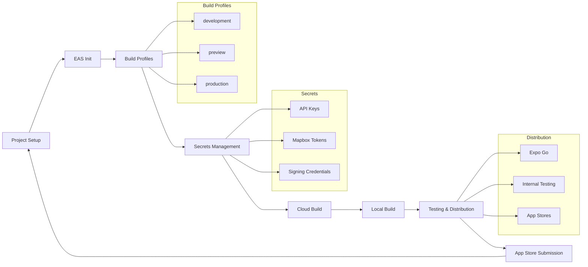
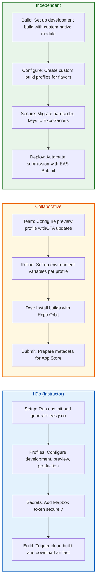
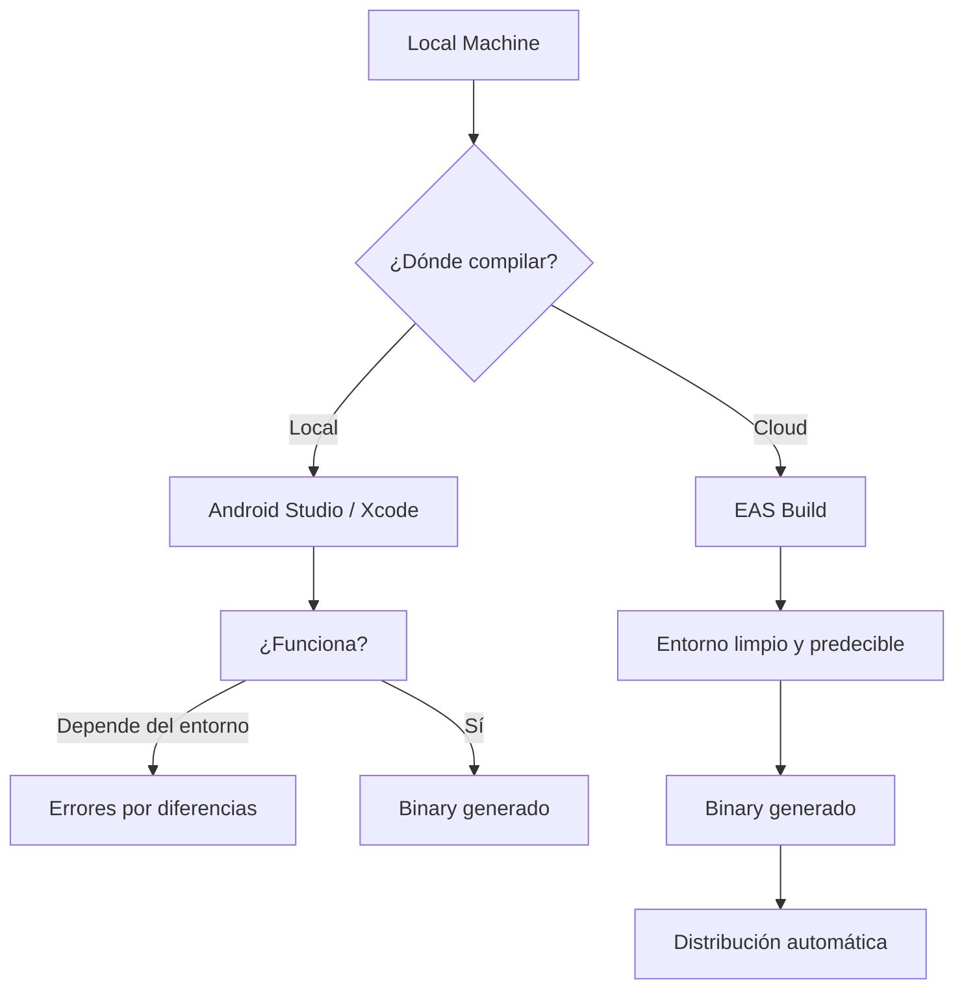
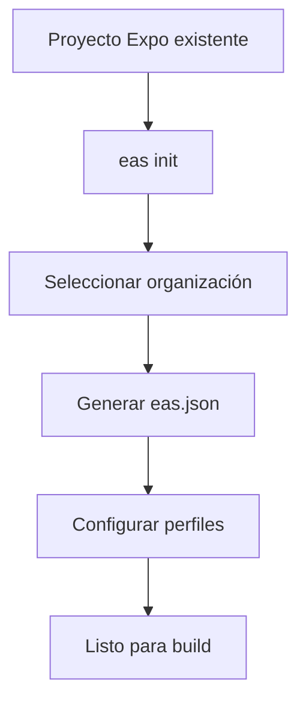
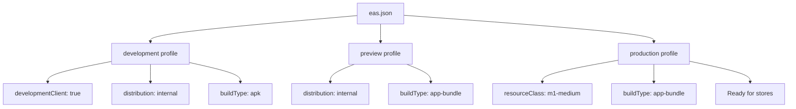
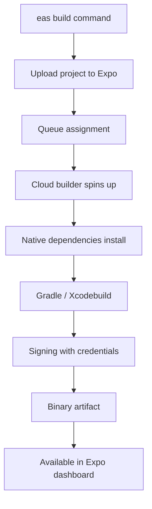
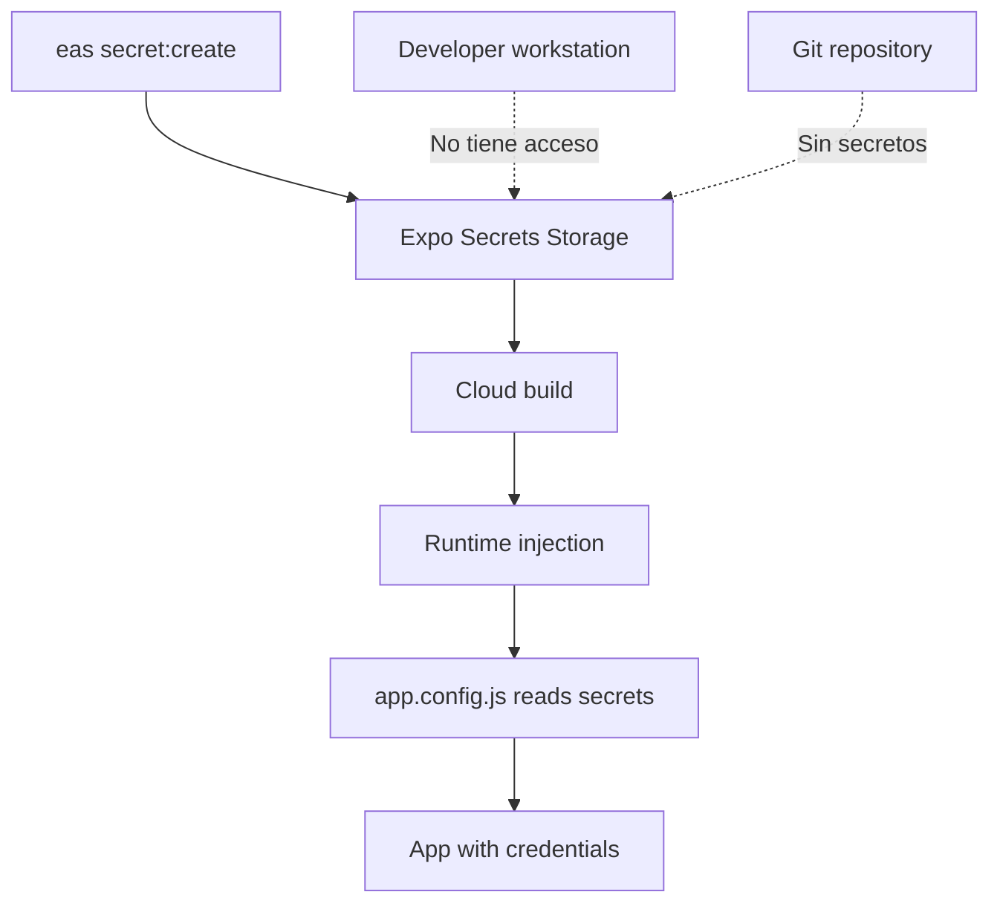
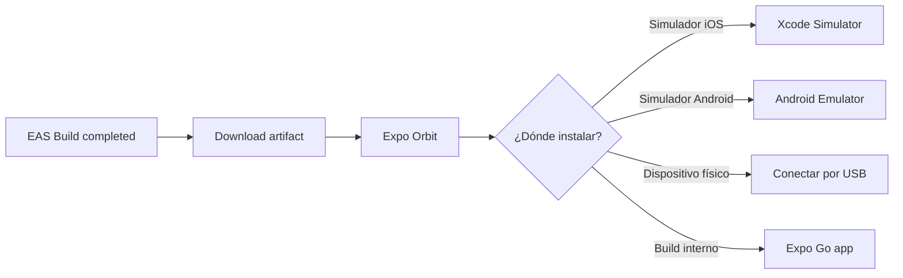
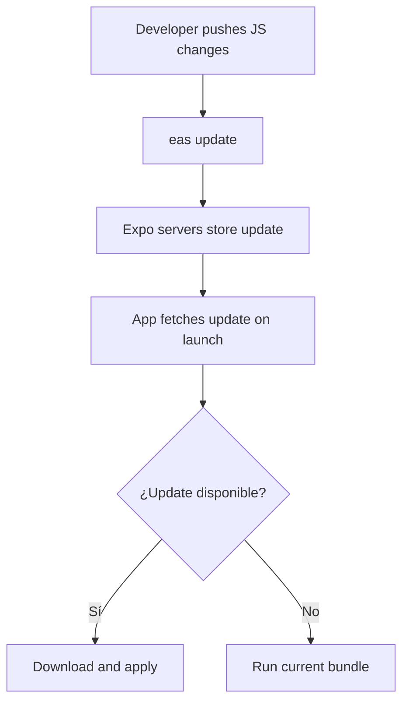

## ¿Qué vas a aprender

En este contenido dominarás los conceptos y herramientas del desarrollo frontend moderno:

- El funcionamiento del runtime JavaScript y el ecosistema de paquetes
- Patrones de componentes, estado y renderizado en tu framework de elección
- Optimización de rendimiento, carga y experiencia de usuario
- Pruebas, tipado, arquitectura y escalabilidad de proyectos frontend
- Integración con backends, APIs y despliegue en producción


# MASTERCLASS: Expo EAS Build - CI/CD para React Native

## INTRODUCCIÓN: POR QUÉ ESTE MASTERCLASS ES DIFERENTE

El desarrollo móvil tradicional arrastra una tax operaacional enorme: configurar Android Studio, mantener Xcode actualizado, gestionar certificados, provisioning profiles, keystores, variantes de build, probar en múltiples dispositivos y lidiar con diferencias entre ambientes de desarrollador. Cuando un equipo crece, estas diferencias se multiplican.

EAS Build elimina esa fricción. En lugar de construir localmente, el build se ejecuta en infraestructura de Expo en la nube, con un entorno reproducible y predecible. Esto significa que si a un desarrollador le funciona, al resto también le funcionará. No más "en mi máquina funciona".

Este masterclass cubre desde la configuración inicial hasta el submission en tiendas de aplicaciones, pasando por perfiles, secretos, builds locales y testing en dispositivos.

> **Objetivo de Aprendizaje** — Al final de esta guía, podrás configurar EAS Build, definir perfiles de build, manejar secretos de forma segura, ejecutar builds locales y cloud, y automatizar el deployment de tu app React Native.

> **Advertencia** — Este contenido es educativo. Las versiones de herramientas y APIs pueden variar; consulta la documentación oficial de Expo para información actualizada.

---

## MAPA DEL WORKFLOW DE EAS BUILD



| Fase | Pregunta que responde | Output principal |
|------|-----------------------|------------------|
| **Project Setup** | ¿Cómo inicializo EAS en mi proyecto? | carpetas `eas/`, `eas.json` generado |
| **Build Profiles** | ¿Qué perfiles necesito y cómo se configuran? | development, preview, production |
| **Secrets Management** | ¿Cómo almaceno credenciales sensibles? | Variables seguras en Expo |
| **Cloud Build** | ¿Como compilo en la nube? | Binarios `.apk`, `.aab`, `.ipa` |
| **Local Build** | ¿Cuándo y cómo compilo localmente? | Binarios generados en mi máquina |
| **Testing & Distribution** | ¿Cómo pruebo los builds? | Instalación vía Expo Orbit |
| **App Store Submission** | ¿Cómo publico en tiendas? | Apps disponibles para usuarios |



---

## PARTE 1: EAS BUILD FUNDAMENTALS — POR QUÉ LA NUBE CAMBIA TODO

### 1.1 El problema de los builds locales

En un equipo de desarrollo móvil, cada miembro tiene un entorno diferente: versiones de Xcode, SDKs de Android, keystores locales, certificados. Esto genera la clásica frase: "en mi máquina funciona".

EAS Build resuelve esto proporcionando un entorno de build limpio y predecible en la nube, gestionado por Expo.



### 1.2 Ventajas de EAS Build

| Ventaja | Impacto |
|---------|---------|
| **Entorno consistente** | Mismo resultado para todo el equipo |
| **Sin mantenimiento de CI local** | Expo gestiona la infraestructura |
| **Compilación nativa** | Acceso a código nativo (Android/iOS) |
| **Distribución integrada** | Over-the-air updates y app stores |
| **Testeo en dispositivos** | Expo Orbit para instalar builds |
| **White-labeling** | Múltiples variantes desde un solo proyecto |

### 1.3 Cuándo NO usar EAS Build

| Escenario | Razón | Alternativa |
|-----------|-------|-------------|
| Necesitas un builder totalmente custom | EAS tiene limitaciones en imagen base | Build local con config custom |
| Compilaciones ultra-rápidas necesarias | Latencia de subida/bajada | Local build para prototipos |
| Presupuesto muy ajustado | EAS tiene costo en planes pagos | GitHub Actions local |

---

## PARTE 2: PROJECT SETUP & CONFIGURATION — INICIALIZACIÓN

### 2.1 Inicialización del proyecto

El flujo de configuración es un proceso estructurado que prepara el proyecto para builds automatizados.



**Comandos esenciales:**

```bash
# Instalar CLI de EAS
npm install -g eas-cli

# Inicializar EAS en el proyecto
eas init

# Verificar configuración
eas config

# Autenticación
eas login
```

### 2.2 Estructura del proyecto

```
mi-app/
├── .eas.json              # Configuración de EAS
├── eas.json               # Perfiles de build
├── app.json / app.config.js  # Configuración de Expo
├── .env                   # Variables locales (no commitear)
├── .env.example           # Variables de ejemplo
├── src/
│   └── ...
└── package.json
```

### 2.3 El archivo eas.json

`eas.json` es el archivo de configuración principal que define los perfiles de build.

```json
{
  "cli": {
    "version": ">= 3.0.0",
    "appVersionSource": "remote"
  },
  "build": {
    "development": {
      "developmentClient": true,
      "distribution": "internal",
      "ios": {
        "resourceClass": "m1-medium"
      },
      "android": {
        "buildType": "apk"
      }
    },
    "preview": {
      "distribution": "internal",
      "ios": {
        "simulator": false
      },
      "android": {
        "buildType": "app-bundle"
      }
    },
    "production": {
      "ios": {
        "resourceClass": "m1-medium"
      },
      "android": {
        "buildType": "app-bundle"
      }
    }
  },
  "submit": {
    "production": {}
  }
}
```

### 2.4 Perfiles de build explicados

| Perfil | Uso | distribución | Características |
|--------|-----|--------------|-----------------|
| **development** | Desarrollo, testing interno | internal | Incluye Expo Go compatibilidad, hot reload |
| **preview** | Testing con QA, stakeholders | internal | `.ipa` y `.apk` para distribución interna |
| **production** | App stores | external | Binarios optimizados, signed |



---

## PARTE 3: CLOUD VS. LOCAL BUILDS

### 3.1 La elección de dónde compilar

Los builds no siempre deben ejecutarse en la nube. Hay escenarios donde local o cloud tienen sentido distinto.

| Aspecto | Cloud Build | Local Build |
|---------|-------------|--------------|
| **Reproducibilidad** | Máxima (entorno limpio Expo) | Depende de tu máquina |
| **Velocidad primera vez** | Lenta (subir código) | Rápida (ya tienes código) |
| **Velocidad iterativa** | Lenta (cada build tarda minutos) | Rápida (recompilación incremental) |
| **Recursos nativos** | Limitado a lo que Expo soporta | Acceso total al sistema |
| **Distribución** | Integrada (Expo, stores) | Manual |
| **Costo** | Planes pagos para uso intensivo | Gratis (solo tu hardware) |

### 3.2 Cloud Build en profundidad

Los cloud builds usan servidores de Expo que ejecutan el build desde cero:

```bash
# Build de desarrollo en la nube
eas build --profile development --platform ios

# Build de preview
eas build --profile preview --platform android

# Build de producción
eas build --profile production --platform all
```

**Flujo de un cloud build:**



### 3.3 Local Build en profundidad

Los builds locales ejecutan el proceso de compilación en tu máquina, útil para prototipos rápidos o debugging de problemas de native.

```bash
# Build local de desarrollo para iOS
eas build --profile development --platform ios --local

# Build local para Android
eas build --profile preview --platform android --local
```

**Cuándo elegir local:**

| Escenario | Razón |
|-----------|-------|
| Prototipado rápido | No quieres esperar cola de cloud |
| Debug de native modules | Necesitas ver logs del compilador en tu máquina |
| Credenciales locales | Keystores que no quieres subir a Expo |

---

## PARTE 4: SECURE ENVIRONMENT VARIABLES — SECRETOS QUE NO SE FILTRAN

### 4.1 El problema de las credenciales hardcodeadas

El desarrollador junior guarda API keys directamente en el código:

```javascript
// MALO: nunca hagas esto
const MAPBOX_TOKEN = "pk.eyJ1IjoibWFwYm94IiwiYSI6ImNpe..."

function App() {
  return <MapView accessToken={MAPBOX_TOKEN} />
}
```

El problema: esa clave queda expuesta en el repositorio, en los binarios compilados y en cualquier lugar donde el código sea visible.

### 4.2 Expo Secrets: la solución

Expo provee un sistema de gestión de secretos que separa credenciales del código fuente.



### 4.3 Comandos de gestión de secretos

```bash
# Crear un secreto
eas secret:create --scope project --name MAPBOX_TOKEN --value "pk.eyJ1..."

# Listar secretos (solo nombres, no valores)
eas secret:list

# Eliminar un secreto
eas secret:remove MAPBOX_TOKEN

# Crear secreto para una variable dinámica
eas secret:create --name API_URL --value "https://api.staging.midominio.com"
```

### 4.4 Accediendo a secretos en app.config.js

```javascript
// app.config.js
export default ({ config }) => ({
  ...config,
  extra: {
    mapboxToken: process.env.MAPBOX_TOKEN,
    apiUrl: process.env.API_URL,
  },
});
```

```javascript
// En tu código React Native
import Constants from 'expo-constants';

function getEnvVar(name) {
  return Constants.expoConfig?.extra?.[name];
}

const MAPBOX_TOKEN = getEnvVar('mapboxToken');
```

### 4.5 Tabla de secretos comunes

| Secreto | Origen | Scope |
|---------|--------|-------|
| `MAPBOX_TOKEN` | Mapbox account | project |
| `GOOGLE_MAPS_API_KEY` | Google Cloud Console | project |
| `SENTRY_DSN` | Sentry dashboard | project |
| `FIREBASE_CONFIG` | Firebase console | project |
| `STRIPE_PUBLISHABLE_KEY` | Stripe dashboard | project |
| `APPLE_SIGN_IN_KEY` | Apple Developer | project |

---

## PARTE 5: TESTING & DEPLOYMENT — DISTRIBUCIÓN Y TESTEO

### 5.1 Expo Orbit: instalación de builds

Expo Orbit es una herramienta de escritorio que simplifica la instalación de builds en simuladores y dispositivos físicos.



### 5.2 Flujo de testing completo

| Paso | Acción | Herramienta |
|------|--------|-------------|
| 1 | Desarrollar en Expo Go | App expo go en dispositivo |
| 2 | Compilar development build | `eas build --profile development` |
| 3 | Instalar en dispositivo | Expo Orbit |
| 4 | Testing QA | Dispositivo real / simuladores |
| 5 | Ajustes y nuevo build | Iterar |
| 6 | Build preview para stakeholders | `eas build --profile preview` |
| 7 | Build production | `eas build --profile production` |

### 5.3 EAS Submit: despliegue en tiendas

EAS Submit automatiza el envío de binarios a App Store Connect y Google Play Console.

```bash
# Submit a TestFlight (iOS)
eas submit --platform ios --profile production

# Submit a Google Play (Android)
eas submit --platform android --profile production
```

**Requisitos previos para submit:**

| Plataforma | Requisito |
|------------|-----------|
| **iOS** | Cuenta Apple Developer, App ID, certificados |
| **Android** | Cuenta Google Play, servicio de firma, clave de upload |

### 5.4 OTA Updates con EAS Update

Una de las características más potentes de EAS es la actualización over-the-air (OTA), que permite enviar actualizaciones de JavaScript sin pasar por las tiendas.

```bash
# Publicar actualización OTA
eas update --branch production --message "Fix login issue"

# Publicar a canal específico
eas update --branch staging --message "QA testing build"
```



---

## PARTE 6: ADVANCED CONFIGURATION

### 6.1 Variantes de build (Flavors / Schemes)

Para proyectos con múltiples variantes (white-labeling, staging, production):

```json
{
  "build": {
    "client-a-production": {
      "extends": "production",
      "env": {
        "APP_VARIANT": "client-a",
        "API_URL": "https://api.client-a.com"
      }
    },
    "client-b-production": {
      "extends": "production",
      "env": {
        "APP_VARIANT": "client-b",
        "API_URL": "https://api.client-b.com"
      }
    }
  }
}
```

### 6.2 Configuración de app.json para múltiples targets

```json
{
  "expo": {
    "name": "Mi App",
    "slug": "mi-app",
    "ios": {
      "bundleIdentifier": "com.midominio.client-a",
      "buildNumber": "1.0.0"
    },
    "android": {
      "package": "com.midominio.client_a",
      "versionCode": 1
    }
  }
}
```

### 6.3 Plugins nativos en EAS

Los plugins permiten modificar la configuración nativa durante el build:

```json
{
  "expo": {
    "plugins": [
      "expo-secure-store",
      [
        "expo-build-properties",
        {
          "android": {
            "compileSdkVersion": 34,
            "targetSdkVersion": 34,
            "minSdkVersion": 23
          },
          "ios": {
            "deploymentTarget": "13.4"
          }
        }
      ]
    ]
  }
}
```

### 6.4 Cache y optimización de builds

| Técnica | Efecto |
|---------|--------|
| `expo prebuild --clean` | Limpia cache antes de build |
| Incremental builds | Solo recompila lo cambiado |
| `resourceClass` más alto | Builds más rápidos (costo mayor) |
| Dependencias en package-lock.json | Builds reproducibles |
| `expo-updates` habilitado | OTA rápido, menos builds |

---

## APPENDIX A — WORKFLOW COMPLETO PARA AGENCIAS

```
Nuevo cliente white-label
    │
    ▼
eas init --template blank-typescript
    │
    ▼
Configurar secrets por cliente
    │
    ▼
eas build --profile client-a-production --platform all
eas build --profile client-b-production --platform all
    │
    ▼
eas submit --platform ios --profile client-a-production
eas submit --platform android --profile client-a-production
    │
    ▼
OTA updates cuando sea necesario
    │
    ▼
Monitorear con Expo dashboard
```

---

## APPENDIX B — CHECKLIST DE CONFIGURACIÓN EAS

| Bloque | Check |
|--------|-------|
| **CLI** | `eas-cli` instalado y actualizado |
| **Autenticación** | `eas login` exitoso |
| **eas.json** | Creado con perfiles development, preview, production |
| **Proyecto** | `expo prebuild` genera carpetas `/ios` y `/android` |
| **Credentials** | Keystores y certificados gestionados por Expo |
| **Secrets** | API keys y tokens creados con `eas secret:create` |
| **Variables** | `app.config.js` lee secrets correctamente |
| **Builds cloud** | Al menos un build de prueba exitoso |
| **Local builds** | Opcional pero configurado |
| **Testing** | Expo Orbit funcional |
| **Submit** | Cuentas de App Store / Play conectadas |
| **Updates** | `expo-updates` configurado para OTA |
| **CI/CD** | GitHub Actions u otro CI integrado con EAS |

---

## PARTE 7: TROUBLESHOOTING COMÚN

### 7.1 Errores frecuentes de build

| Error | Causa probable | Solución |
|-------|----------------|----------|
| `Credentials issue` | Keystore/certificado expirado o faltante | `eas credentials` para gestionar |
| `Pod install failed` | Dependencia nativa conflictiva | Limpiar `node_modules`, lockfile |
| `Build timed out` | Compilación muy pesada | `resourceClass` más alto |
| `Missing API key` | Secreto no configurado | `eas secret:list` y `eas secret:create` |
| `Code signing error` | Perfil de provisioning incorrecto | Revisar Bundle ID |
| `Network timeout` | Subida muy grande | Red estable o comprimir assets |

### 7.2 Debugging de builds

```bash
# Ver logs de build en tiempo real
eas build --profile development --platform ios --wait

# Limpiar y reintentar
eas build --profile development --platform ios --clear-cache

# Ver estado de credenciales
eas credentials
```

---

## PARTE 8: I DO / WE DO / YOU DO — EJERCICIOS PROGRESIVOS

### 8.1 I Do — Configuración inicial de EAS

**Objetivo:** inicializar EAS en un proyecto Expo existente y generar el `eas.json`.

| Paso | Acción | Resultado esperado |
|------|--------|--------------------|
| 1 | Instalar `eas-cli` globalmente | `eas --version` muestra la versión |
| 2 | Ejecutar `eas login` | Autenticación exitosa con cuenta Expo |
| 3 | Ejecutar `eas init` | Genera `eas.json` y carpeta `.eas/` |
| 4 | Revisar `eas.json` generado | Contiene perfiles por defecto |
| 5 | Ejecutar `eas build:list` | Lista vacía de builds |

### 8.2 We Do — Configurar perfiles de build

**Escenario:** necesitas tres perfiles: desarrollo para testeo interno, preview para QA, y producción para stores.

| Perfil | Plataforma | Build Type | Destino |
|--------|-----------|------------|---------|
| development | iOS + Android | apk | Dispositivos internos |
| preview | iOS + Android | app-bundle | TestFlight / Internal Track |
| production | iOS + Android | app-bundle | App Stores |

**Tarea colaborativa:** editar `eas.json` aplicando las configuraciones anteriores.

### 8.3 You Do — Migración de secretos hardcodeados

**Tarea:** tomar un proyecto con API keys hardcodeadas y migrar todo al sistema de secrets de Expo.

| Paso | Acción |
|------|--------|
| 1 | Identificar todas las credenciales en el código |
| 2 | Crear secreto en Expo para cada una |
| 3 | Modificar `app.config.js` para leer `process.env` |
| 4 | Actualizar código para usar `Constants.expoConfig.extra` |
| 5 | Eliminar valores hardcodeados del repo |
| 6 | Verificar build en cloud funciona |

### 8.4 I Do — Ejecutar primer cloud build

**Objetivo:** lanzar un build de desarrollo en la nube y descargar el resultado.

```bash
# Comando para build de desarrollo iOS
eas build --profile development --platform ios

# Esperar notificación de build completado
# Descargar desde Expo dashboard
# Instalar con Expo Orbit
```

### 8.5 We Do — Configurar submit automático

**Escenario:** configurar EAS Submit para publicar automáticamente en TestFlight.

| Requisito | Valor |
|-----------|-------|
| Cuenta Apple Developer | Conectada en Expo dashboard |
| App ID | `com.midominio.miapp` |
| Perfil | `production` |

**Tarea:** ejecutar `eas submit --platform ios --profile production` y verificar que aparece en App Store Connect.

### 8.6 You Do — Pipeline CI/CD con GitHub Actions

**Tarea:** crear un workflow que ejecute build y submit automáticamente al hacer push a `main`.

```yaml
# .github/workflows/eas.yml
name: EAS Build and Submit
on:
  push:
    branches: [main]
jobs:
  build:
    runs-on: ubuntu-latest
    steps:
      - uses: actions/checkout@v4
      - uses: expo/expo-github-action@v8
        with:
          eas-version: latest
          token: ${{ secrets.EXPO_TOKEN }}
      - run: eas build --profile production --platform all --non-interactive
      - run: eas submit --platform all --profile production --non-interactive
```

---

## PARTE 9: CASOS DE USO Y PATRONES

### 9.1 White-labeling con EAS

Una agencia puede mantener un solo código base y generar múltiples apps para diferentes clientes:

```
/app
  ├── app.json (config base)
  ├── eas.json (perfiles por cliente)
  └── source/
      ├── screens/
      └── components/
```

Perfiles en `eas.json`:

```json
{
  "build": {
    "client-a": {
      "extends": "production",
      "env": {
        "CLIENT_ID": "a",
        "BRAND_COLOR": "#FF5722"
      }
    },
    "client-b": {
      "extends": "production",
      "env": {
        "CLIENT_ID": "b",
        "BRAND_COLOR": "#2196F3"
      }
    }
  }
}
```

### 9.2 EAS Update para hotfixes

| Escenario | Acción |
|-----------|--------|
| Bug crítico en producción | `eas update --branch production --message "Hotfix login crash"` |
| Feature flag rollout | Publicar update a canal especifico |
| Rollback | Publicar versión anterior como update |

### 9.3 EAS Insights: monitoreo de builds

| Métrica | Dónde ver |
|---------|-----------|
| Tiempo de build | Expo dashboard |
| Tasa de éxito | Expo dashboard |
| Credenciales usadas | `eas credentials` |
| Últimos builds | `eas build:list` |

---

## APPENDIX C — GLOSARIO RÁPIDO

| Término | Definición |
|---------|------------|
| **EAS Build** | Servicio de compilación en la nube de Expo |
| **Build profile** | Configuración predefinida para compilar (development, preview, production) |
| **eas.json** | Archivo de configuración de perfiles de EAS |
| **Expo Go** | App para testing rápido durante desarrollo |
| **OTA Update** | Actualización over-the-air sin pasar por tiendas |
| **Keystore** | Archivo de clave para firmar apps Android |
| **Provisioning Profile** | Perfil de aprovisionamiento para apps iOS |
| **App Bundle (AAB)** | Formato de publicación para Google Play |
| **Simulator** | Emulador de iOS/Android para testing |
| **Resource Class** | Capacidad de cómputo asignada al builder |
| **Submit** | Proceso de envío de binarios a App Stores |
| **Secret** | Variable sensible gestionada por Expo |
| **CLI** | Interfaz de línea de comandos (`eas-cli`) |
| **Self-hosted builder** | Opción para correr builders en tu propia infraestructura |

---

## PARTE 10: PREGUNTAS DE VERIFICACIÓN

### Preguntas sobre Fundamentals

1. **Analiza**: ¿Por qué los builds en la nube son preferibles en equipos grandes? ¿Qué problema específico resuelven?

2. **Compara**: En un proyecto con 3 desarrolladores, ¿cuántos entornos de build locales inconsistentes podrías tener? ¿Cómo impacta eso en la entrega?

### Preguntas sobre Configuración

3. **Diseña**: Crea un `eas.json` para una app con variantes `staging` y `production`, donde staging usa `developmentClient=true` y `apk`, y production usa `app-bundle`.

4. **Evalúa**: ¿Qué sucede si cambias `app.json` pero no corres `eas update`? ¿Cómo se refleja eso en el build?

### Preguntas sobre Secrets

5. **Implementa**: Tu equipo necesita agregar una clave de Google Maps para producción. Describe el flujo completo: quién crea el secreto, cómo se usa en `app.config.js`, y cómo se valida que no quedó hardcodeada.

6. **Evalúa**: ¿Por qué almacenar secretos en `.env` no es suficiente para producción? ¿Qué riesgos existen?

### Preguntas sobre Distribución

7. **Diagnostica**: Tu `eas build --profile preview --platform ios` falla con error de code signing. ¿Cuáles son las tres causas más probables y cómo las resolverías?

8. **Compara**: ¿Cuándo preferirías un build `apk` sobre `app-bundle` en Android? ¿Qué implica enviar `app-bundle` a Google Play?

### Preguntas Integradoras

9. **Conecta**: ¿Cómo interactúan `eas.json`, `app.json` y los secrets durante un build de producción? Mapea el flujo de datos completo.

10. **Diseña un pipeline**: Arquitectura completa de CI/CD para una app que se despliega en TestFlight y Google Play, con staging, preview y producción, usando GitHub Actions y EAS.

---

## CHECKLIST FINAL: EAS BUILD EN PRODUCCIÓN

| Bloque | Check |
|--------|-------|
| **CLI** | `eas-cli` instalado, actualizado, autenticado |
| **eas.json** | Perfiles development, preview, production definidos |
| **app.json** | Nombres, Bundle IDs, versiones correctos por perfil |
| **Credentials** | Keystores y certificados en Expo |
| **Secrets** | API keys y tokens en Expo Secrets |
| **Builds cloud** | Al menos un build exitoso por perfil |
| **Builds locales** | Configurado opcionalmente |
| **Testing** | Expo Orbit funciona en tu equipo |
| **Submit** | Cuentas de tiendas conectadas |
| **OTA** | `expo-updates` configurado y probado |
| **CI/CD** | Pipeline automatizado funcional |
| **Monitoreo** | Dashboards de Expo Insights activos |
