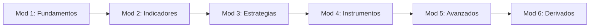
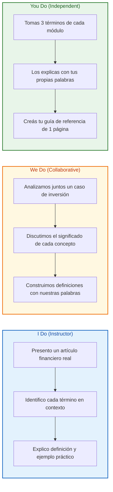
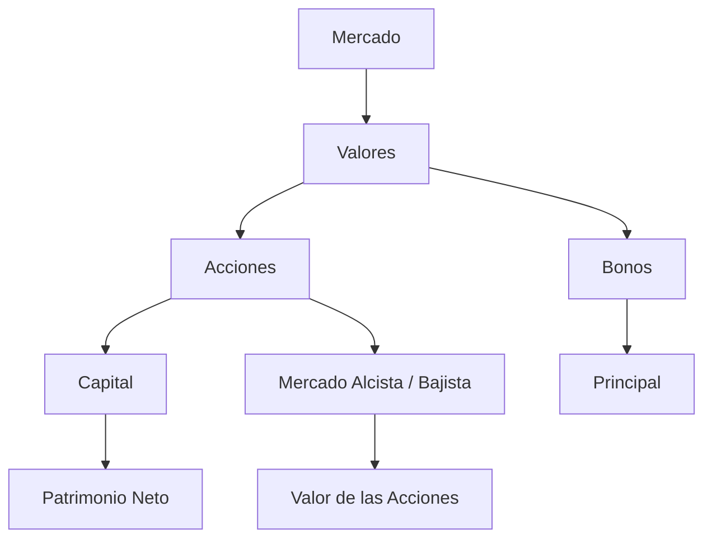
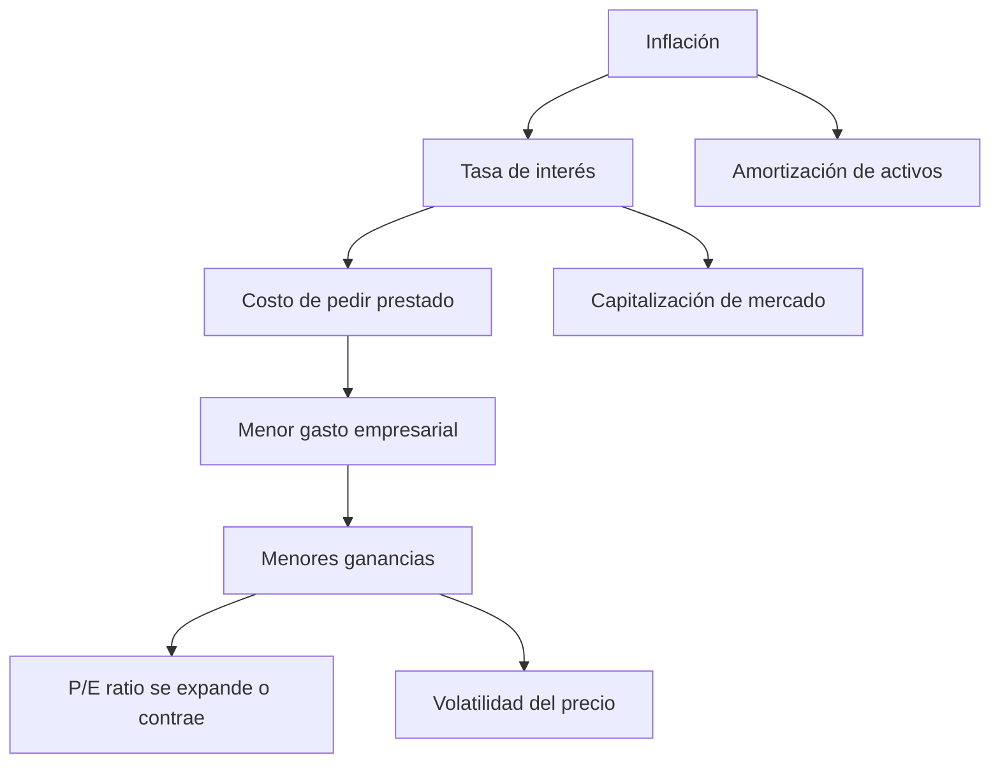
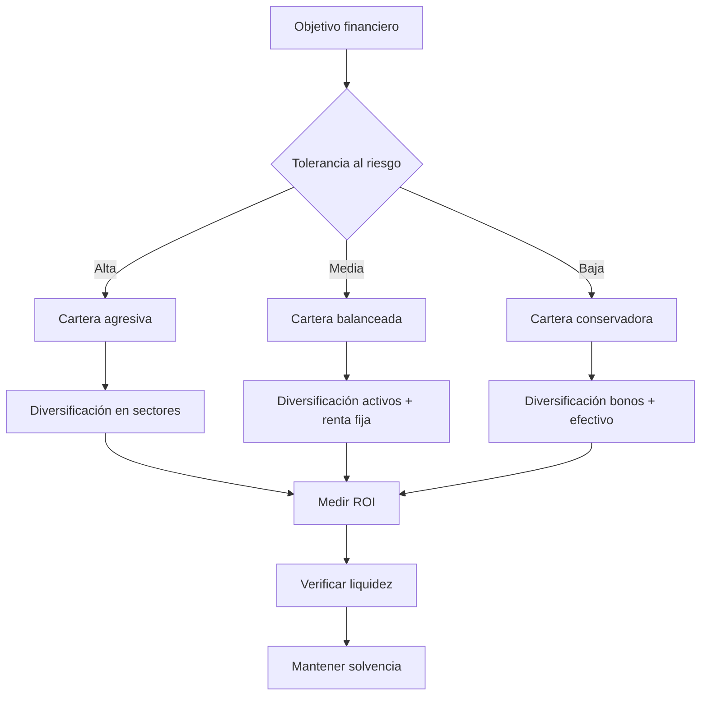
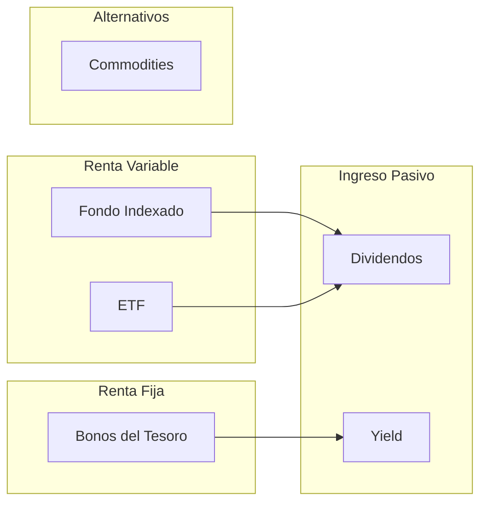
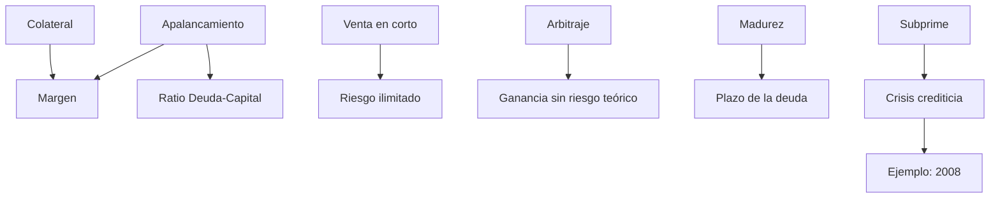
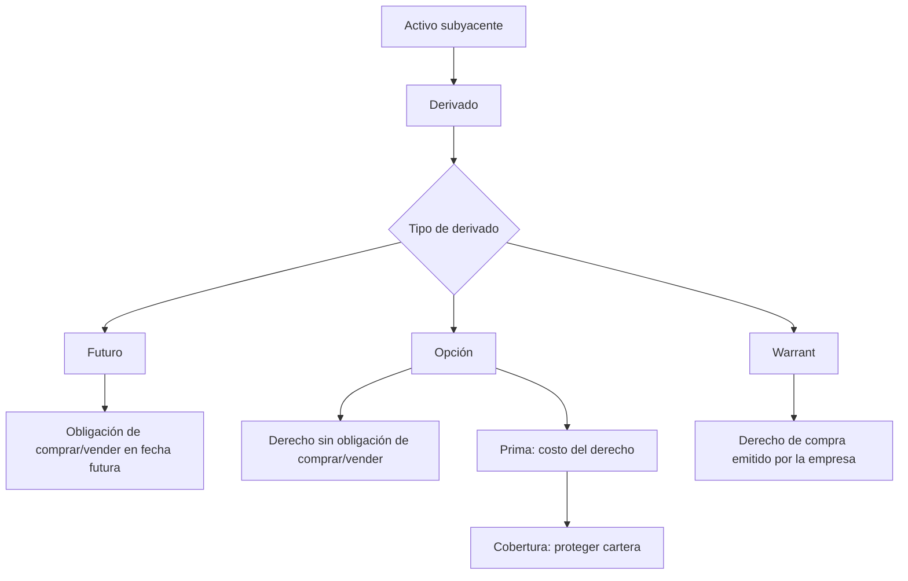

# MASTERCLASS: 40 Términos Financieros Esenciales — El Vocabulario del Inversor

## INTRODUCCIÓN: POR QUÉ ESTA MASTERCLASS ES DIFERENTE

Las finanzas tienen su propio idioma. Sin él, un inversor lee noticias, prospectos y análisis sin entender realmente lo que dicen. "El mercado está alcista", "la volatilidad aumentó", "el ratio P/E se expandió": frases cotidianas que esconden conceptos precisos.

Esta masterclass no es un diccionario para consultar de vez en cuando. Es una **ruta de aprendizaje secuencial** donde cada término se apoya en los anteriores. Los 40 conceptos están organizados en 6 módulos que construyen comprensión de forma progresiva: desde los fundamentos del mercado hasta los derivados financieros más complejos.

> **Objetivo de Aprendizaje** — Al final de esta guía, podrás leer un artículo financiero, entender un prospecto de inversión y participar en una conversación sobre mercados con el vocabulario adecuado.

> **Advertencia educativa** — Este contenido es formativo. Ninguna definición, ejemplo o estrategia debe interpretarse como recomendación financiera. Invertir conlleva riesgos reales que debes evaluar con asesoramiento profesional.

---

## MAPA DEL APRENDIZAJE



| Módulo | Pregunta que responde | Output principal |
|--------|-----------------------|------------------|
| **1. Fundamentos** | ¿Qué es el mercado y cómo funciona? | Vocabulario base del inversor |
| **2. Indicadores** | ¿Cómo se mide la salud de una empresa y la economía? | Herramientas de análisis |
| **3. Estrategias** | ¿Cómo se gestiona el riesgo y se construye una cartera? | Marco de decisión |
| **4. Instrumentos** | ¿Qué productos financieros existen para invertir? | Catálogo de vehículos de inversión |
| **5. Avanzados** | ¿Qué técnicas usan los inversores profesionales? | Operaciones y apalancamiento |
| **6. Derivados** | ¿Cómo se protegen y especulan los grandes actores? | Cobertura y contratos derivados |



---

## PARTE 1: FUNDAMENTOS DEL MERCADO Y CONCEPTOS BÁSICOS

### 1.1 Principio Central

Antes de invertir, hay que entender qué es el mercado y cuáles son las piezas elementales. Un mercado no es un lugar físico: es el conjunto de compradores y vendedores intercambiando activos. Las **acciones** representan propiedad, los **valores** son los instrumentos que se negocian, y los ciclos de **mercado alcista y bajista** describen la dirección general de los precios.

Sin estos 7 conceptos, ningún otro término financiero tiene contexto.

### 1.2 Los 7 conceptos fundamentales

| Término | Definición exacta | Ejemplo |
|---------|-------------------|---------|
| **Mercado alcista** | Un período de aumento de los precios de las acciones | De 2009 a 2020, el S&P 500 vivió uno de los mercados alcistas más largos de la historia |
| **Mercado bajista** | Un período de caída de los precios de las acciones | En 2008, el mercado global entró en mercado bajista con caídas superiores al 20% |
| **Acción** | Una parte de propiedad en una empresa | Comprar 1 acción de Apple te convierte en propietario de una fracción minúscula de Apple Inc. |
| **Capital** | Interés de propiedad en una empresa | Cuando una empresa emite acciones, está vendiendo capital a cambio de financiación |
| **Patrimonio neto** | Activo total - pasivo total | Si tu casa vale $300,000 y debes $200,000 de hipoteca, tu patrimonio neto es $100,000 |
| **Principal** | La suma original de dinero prestado o invertido | Si inviertes $10,000 en un bono, esos $10,000 son el principal |
| **Valores** | Instrumentos financieros como acciones y bonos | Un fondo de inversión puede contener valores de docenas de empresas distintas |

### 1.3 Cómo se relacionan estos conceptos



### 1.4 Ejemplo integrador

Imagina que una empresa llamada "TechCo" sale a bolsa. Emite **acciones** (vende **capital**) por un **principal** total de $100 millones. Los inversores compran esos **valores**. Si la economía va bien, las acciones suben (**mercado alcista**). El **patrimonio neto** de los accionistas crece. Si la economía se contrae, las acciones caen (**mercado bajista**) y el patrimonio neto se reduce.

> **Idea clave** — Los 7 conceptos de este módulo son el vocabulario mínimo para operar en cualquier mercado financiero. Sin dominio de estos términos, los siguientes módulos carecen de base.

---

## PARTE 2: INDICADORES ECONÓMICOS Y ANÁLISIS

### 2.1 Principio Central

Los mercados no se mueven al azar. La **inflación**, las **tasas de interés** y la **volatilidad** son fuerzas macro que determinan el comportamiento de los precios. A nivel de empresa, la **capitalización de mercado** y el **ratio precio-beneficio** permiten comparar unas compañías con otras. La **amortización** refleja cómo los activos intangibles pierden valor con el tiempo.

Un inversor informado no solo sabe qué pasó, sino que entiende los indicadores que explican por qué pasó.

### 2.2 Los 6 indicadores clave

| Término | Definición exacta | Fórmula conceptual | Ejemplo |
|---------|-------------------|--------------------|---------|
| **Inflación** | Aumento de los precios y disminución del poder adquisitivo del dinero | % de cambio del IPC | Si la inflación es 5%, algo que costaba $100 hoy cuesta $105 |
| **Tasa de interés** | El costo de pedir dinero prestado | Porcentaje anual sobre el principal | Un préstamo de $10,000 al 8% genera $800 de interés anual |
| **Capitalización de mercado** | Valor total de las acciones en circulación de una empresa | Precio por acción × acciones en circulación | Si Tesla tiene 3,000 M de acciones a $250 cada una, su market cap es $750,000 M |
| **Ratio precio-beneficio (P/E)** | Precio actual de las acciones comparado con las ganancias por acción | Precio de la acción / ganancia por acción | Una acción a $100 con ganancias de $5 por acción tiene un P/E de 20 |
| **Volatilidad** | Grado de variación en los precios | Desviación estándar de los retornos | Una acción que oscila entre $50 y $100 en un mes es más volátil que una que se mueve entre $74 y $76 |
| **Amortización** | Reducción gradual del valor de un activo intangible | Costo del activo / vida útil estimada | Una patente adquirida por $1 M con 10 años de vida se amortiza $100,000 por año |

### 2.3 Conexión entre indicadores



> **Idea clave** — Los indicadores no viven aislados. La inflación alta suele llevar a tasas de interés más altas, lo que reduce el crecimiento económico y aumenta la volatilidad. Entender estas relaciones es más valioso que memorizar definiciones.

---

## PARTE 3: ESTRATEGIAS DE INVERSIÓN Y GESTIÓN DE RIESGO

### 3.1 Principio Central

Conocer los instrumentos no basta. Hay que saber cómo combinarlos, cuánto arriesgar y cómo medir si una inversión fue exitosa. La **diversificación** es la única comida gratis en finanzas. El **ROI** mide si ganaste o perdiste. La **tolerancia al riesgo** define qué tipo de inversor eres. La **cartera** es tu conjunto de decisiones. La **liquidez** determina qué tan rápido puedes salir. Y ser **solvente** es la diferencia entre una turbulencia y la quiebra.

### 3.2 Los 6 conceptos de estrategia

| Término | Definición exacta | Pregunta que responde | Aplicación práctica |
|---------|-------------------|----------------------|---------------------|
| **Diversificación** | Distribuir las inversiones para reducir el riesgo | ¿Cómo evito poner todos los huevos en la misma canasta? | Invertir en 5 sectores distintos en lugar de solo tecnología |
| **ROI** | Medida de la rentabilidad de una inversión | ¿Cuánto gané o perdí en proporción a lo invertido? | Inviertes $1,000, recibes $1,200 → ROI = 20% |
| **Tolerancia al riesgo** | Capacidad del inversor para soportar la volatilidad del mercado | ¿Qué tanto puedo ver caer mi inversión sin vender por pánico? | Un inversor joven suele tener más tolerancia que uno próximo a jubilarse |
| **Cartera** | Conjunto de inversiones propiedad de un individuo o institución | ¿Qué tengo y en qué proporción? | 60% acciones, 30% bonos, 10% efectivo |
| **Liquidez** | Facilidad de convertir activos en efectivo sin pérdidas | ¿Qué tan rápido puedo recuperar mi dinero? | El efectivo es 100% líquido; un inmueble puede tardar meses en venderse |
| **Solvente** | Capacidad para cumplir con compromisos financieros a largo plazo | ¿Puedo pagar mis deudas cuando vencen? | Una empresa con más activos que deudas es solvente aunque no tenga efectivo hoy |

### 3.3 Árbol de decisiones del inversor



### 3.4 Fórmula del ROI

```
ROI = (Valor final - Valor inicial) / Valor inicial × 100
```

Si compras una **cartera** de acciones por $10,000 y un año después vale $12,000:
- ROI = ($12,000 - $10,000) / $10,000 × 100 = **20%**

Si la **inflación** fue del 5% ese año, tu ROI real (ajustado por inflación) es aproximadamente 15%.

> **Idea clave** — La diversificación no elimina el riesgo, pero reduce el impacto de cualquier evento individual. El ROI sin contexto (tiempo, inflación, riesgo asumido) es una métrica incompleta.

---

## PARTE 4: INSTRUMENTOS DE INVERSIÓN — FONDOS Y RENTA FIJA

### 4.1 Principio Central

Una vez que entiendes el mercado, los indicadores y la estrategia, toca elegir el vehículo. No es lo mismo comprar una **acción** individual que un **fondo indexado** que sigue al mercado completo. Los **ETF** ofrecen flexibilidad de trading intradía. Los **bonos del Tesoro** son el activo refugio por excelencia. Los **commodities** diversifican fuera del mundo corporativo. Los **dividendos** y el **yield** generan ingreso pasivo.

### 4.2 Los 6 instrumentos clave

| Término | Definición exacta | Característica principal | Cuándo usarlo |
|---------|-------------------|-------------------------|---------------|
| **Fondo Indexado** | Fondo mutuo diseñado para rastrear los componentes de un índice de mercado | Bajo costo, sigue al S&P 500 o similar | Inversión pasiva a largo plazo |
| **ETF** | Fondos negociados en bolsas de valores similares a las acciones | Se compra y vende como una acción durante el día | Exposición diversificada con liquidez intradía |
| **Bonos del Tesoro** | Títulos gubernamentales a largo plazo con tasas de interés fijos | Respaldados por el gobierno, bajo riesgo crediticio | Preservación de capital, ingreso fijo predecible |
| **Commodities** | Bienes básicos utilizados en el comercio intercambiables con otros bienes | Oro, petróleo, trigo, cobre — todos iguales sin importar el productor | Cobertura contra inflación, diversificación |
| **Dividendos** | Las ganancias de la empresa se distribuyen entre los accionistas | Pago periódico por acción | Ingreso pasivo, señal de salud financiera |
| **Yield** | Ingreso generado por una inversión | Porcentaje del precio que se paga como dividendo o interés | Comparar rendimiento entre activos |

### 4.3 Comparativa visual



### 4.4 Ejemplo de cálculo de Yield

```
Yield = Dividendo anual por acción / Precio de la acción × 100
```

Una acción que paga $4 al año en **dividendos** y cotiza a $80 tiene un **yield** del 5%.

Un **bono del Tesoro** que paga $30 al año sobre un **principal** de $1,000 tiene un yield del 3%.

> **Idea clave** — Los fondos indexados y ETFs democratizan la inversión: permiten diversificar con montos pequeños y costos bajos. El yield es la métrica clave para comparar ingresos entre distintos instrumentos.

---

## PARTE 5: OPERACIONES AVANZADAS, APALANCAMIENTO Y CRÉDITO

### 5.1 Principio Central

Los inversores profesionales no solo compran y esperan. Usan **apalancamiento** para multiplicar su exposición, **margen** para pedir prestado contra sus activos, y **venta en corto** para ganar cuando los precios caen. El **arbitraje** busca ganancias sin riesgo aprovechando diferencias de precio. El **ratio deuda-capital** mide cuánto apalancamiento usa una empresa. El **colateral** es la garantía que respalda un préstamo. La **madurez** es el plazo de una deuda. Y **subprime** recuerda lo que pasa cuando el crédito se concede sin control.

### 5.2 Los 8 conceptos avanzados

| Término | Definición exacta | Riesgo asociado | Ejemplo |
|---------|-------------------|-----------------|---------|
| **Apalancamiento** | Utilizar fondos prestados para aumentar el potencial de inversión | Multiplica ganancias... y también pérdidas | Comprar $100,000 en acciones con $20,000 propios = apalancamiento 5:1 |
| **Colateral** | Activos pignorados como garantía de un préstamo | Puedes perder el activo si no pagas | Una hipoteca usa la casa como colateral |
| **Margen** | Pedir dinero prestado para comprar valores | Margin call: el broker exige más capital si el precio cae | Compras $10,000 en acciones con $5,000 propios + $5,000 prestados por el broker |
| **Ratio deuda-capital** | Medida del apalancamiento financiero de una empresa | Cuanto más alto, más riesgosa ante subidas de tasas | Una empresa con $200 M de deuda y $100 M de capital tiene D/E = 2.0 |
| **Arbitraje** | Aprovechar las diferencias de precios en distintos mercados | Requiere velocidad y bajo costo de transacción | Una acción cotiza a $100 en NYSE y a $100.05 en LSE — compras en una, vendes en otra |
| **Venta en corto** | Venta de acciones prestadas con la esperanza de recomprarlas más baratas | Pérdida potencial ilimitada si el precio sube | Pides prestadas 100 acciones a $50, las vendes por $5,000, las recompras a $30 — ganancia $2,000 |
| **Madurez** | Fecha en la que debe pagarse una deuda | Riesgo de refinanciación si las tasas cambiaron | Un bono a 10 años emitido en 2024 madura en 2034 |
| **Subprime** | Relativo a contratos de crédito o préstamo para prestatarios con bajas calificaciones crediticias | Alto riesgo de default — crisis de 2008 | Hipotecas otorgadas a personas sin historial crediticio sólido, con tasas más altas |

### 5.3 Mapa de conexiones



### 5.4 Alerta: el peligro del apalancamiento

El apalancamiento parece una herramienta mágica, pero tiene un costo severo:

| Escenario | Sin apalancamiento | Con apalancamiento 5:1 |
|-----------|-------------------|----------------------|
| Inversión inicial | $10,000 | $10,000 propios + $40,000 prestados |
| Activo sube 10% | Ganancia $1,000 (ROI 10%) | Ganancia $5,000 (ROI 50%) |
| Activo baja 10% | Pérdida $1,000 (ROI -10%) | Pérdida $5,000 (ROI -50%) |
| Activo baja 20% | Pérdida $2,000 (ROI -20%) | Pérdida $10,000 (ROI -100% — pérdida total) |

> **Idea clave** — El apalancamiento y la venta en corto son herramientas de inversores experimentados. Un principiante que las usa sin comprender los riesgos puede perder más de lo que invirtió.

---

## PARTE 6: DERIVADOS Y COBERTURAS

### 6.1 Principio Central

Los **derivados** son contratos cuyo valor depende de otro activo (una acción, un commodity, una divisa). Permiten tanto especular como proteger. Un agricultor usa **futuros** para fijar el precio de su cosecha. Un inversor compra una **opción** para limitar su pérdida máxima. Un **warrant** da derecho a comprar acciones a futuro. Una **cobertura** es un seguro financiero. Y la **prima** es el costo de ese seguro.

### 6.2 Los 6 términos de derivados

| Término | Definición exacta | Activo subyacente típico | Para qué sirve |
|---------|-------------------|--------------------------|----------------|
| **Derivados** | Contratos financieros cuyo valor se deriva de un activo subyacente | Acciones, bonos, commodities, divisas, tasas de interés | Especular o cubrir riesgo sin poseer el activo |
| **Contrato de futuros** | Acuerdo para comprar/vender un activo en una fecha futura | Petróleo, trigo, oro, índices | Fijar precio hoy para entrega futura |
| **Opción** | Contrato para comprar o vender un activo a un precio específico | Acciones, índices, ETFs | Derecho (no obligación) de comprar/vender a un precio fijo |
| **Warrant** | Derecho a comprar acciones de la empresa a un precio específico | Acciones de la empresa emisora | Similar a una opción, pero emitido por la propia empresa |
| **Cobertura** | Inversión para reducir el riesgo de movimientos adversos de precios | Cualquier activo con riesgo de precio | Proteger una cartera contra caídas |
| **Prima** | Cantidad pagada por una póliza de seguro | Aplica a opciones y seguros financieros | Costo de la protección |

### 6.3 Cómo funciona un derivado



### 6.4 Ejemplo práctico: cobertura con opciones

Un inversor tiene 100 acciones de una empresa a $50 cada una (cartera de $5,000). Le preocupa una posible caída en los próximos 3 meses.

Compra una **opción** de venta (put) con precio de ejercicio $48, pagando una **prima** de $2 por acción ($200 total).

**Escenario 1 — El precio cae a $40:**
- Las acciones pierden $1,000 ($50 → $40 × 100)
- La opción le permite vender a $48: gana $800 ($48 - $40 = $8 × 100, menos $200 de prima)
- Pérdida neta: solo $200 (la prima)

**Escenario 2 — El precio sube a $60:**
- Las acciones ganan $1,000
- La opción expira sin valor (pierde la prima de $200)
- Ganancia neta: $800

La **prima** de $200 funcionó como un seguro: limitó la pérdida máxima a $200.

> **Idea clave** — Los derivados son herramientas, no juguetes. Un agricultor que cubre el precio del trigo con futuros está gestionando riesgo. Un inversor que compra opciones sin entender la prima y la fecha de vencimiento está especulando, no invirtiendo.

---

## PARTE 7: I DO / WE DO / YOU DO — EJERCICIOS PROGRESIVOS

### 7.1 I Do — Análisis guiado de un artículo financiero

**Objetivo:** identificar los 40 términos en un texto financiero real.

**Texto de ejemplo:**

> "El mercado alcista de 2023 impulsó la capitalización de mercado de las grandes tecnológicas. Sin embargo, la inflación persistente llevó a la Fed a subir las tasas de interés, aumentando la volatilidad. Los inversores buscaron cobertura en bonos del Tesoro y commodities como el oro. El ratio P/E de muchas empresas se contrajo. Quienes usaron apalancamiento con margen sufrieron pérdidas significativas durante las correcciones. Los dividendos y el yield de las carteras diversificadas ayudaron a mitigar el impacto. Los derivados como opciones y futuros se utilizaron como cobertura. La prima de las opciones put subió ante el temor a un mercado bajista."

| Paso | Acción | Resultado esperado |
|------|--------|--------------------|
| 1 | Leer el párrafo en voz alta | Familiarizarse con el texto |
| 2 | Subrayar cada término conocido | Identificar merc. alcista, capitalización, inflación, etc. |
| 3 | Clasificar por módulo | Agrupar: Mod 1, Mod 2, Mod 3... |
| 4 | Explicar cada término en contexto | "capitalización de mercado = valor total de las acciones" |
| 5 | Identificar relaciones entre términos | "inflación → tasas de interés → volatilidad" |

### 7.2 We Do — Construir definiciones colaborativas

**Escenario:** tienen que explicarle los 40 términos a un amigo que no sabe nada de finanzas.

**Tarea colaborativa:**

| Decisión | Método | Resultado esperado |
|----------|--------|--------------------|
| Elegir el orden | De lo simple a lo complejo (Mod 1 → Mod 6) | Secuencia lógica |
| Definir cada término | Con una analogía del mundo real | "Acción es como ser socio de una pizzería" |
| Validar en equipo | Cada miembro explica un término y los otros corrigen | Precisión colectiva |
| Identificar lagunas | ¿Hay términos que nadie puede explicar sin mirar? | Prioridad de repaso |
| Producir un resumen | Una frase por término | Guía de 40 frases |

```python
# Pseudocódigo del ejercicio colaborativo
terminos = ["Acción", "Bono", "ETF", ...]
for termino in terminos:
    explicacion = equipo.explicar(termino)
    if equipo.validar(explicacion):
        equipo.aprobar(termino)
    else:
        equipo.revisar(termino)
```

### 7.3 You Do — Tu guía de 1 página con los 40 términos

**Tarea:** crea un documento de referencia de una sola página con los 40 términos.

Debe incluir:

| Elemento | Descripción |
|----------|-------------|
| Título | "Los 40 términos financieros que todo inversor debe conocer" |
| Estructura | 6 secciones (una por módulo) |
| Formato | Tabla de 3 columnas: Término | Módulo | Definición breve |
| Extensión | Máximo 1 página (cara y contracara) |
| Restricción | Sin ejemplos largos, sin explicaciones — solo definiciones |

| Criterio de evaluación | Peso |
|------------------------|------|
| Precisión de las definiciones | 40% |
| Claridad y brevedad | 30% |
| Organización visual | 20% |
| Sin errores conceptuales | 10% |

### 7.4 I Do — Ejercicio de relación entre términos

**Objetivo:** conectar términos de diferentes módulos.

| Término A | Término B | Relación |
|-----------|-----------|----------|
| Inflación | Tasa de interés | La inflación alta suele provocar subidas de tasas |
| Apalancamiento | Margen | El margen es un tipo de apalancamiento |
| Colateral | Subprime | Las hipotecas subprime tenían colateral de baja calidad |
| Derivados | Cobertura | Los derivados son el instrumento; la cobertura es el objetivo |
| Cartera | Diversificación | La cartera se diversifica para reducir riesgo |
| Yield | Dividendo | El yield mide el dividendo como porcentaje del precio |

### 7.5 We Do — Mapa conceptual gigante

**Caso:** conecta los 40 términos en un mapa visual.

| Conexión | Explicación |
|----------|-------------|
| Mercado alcista → Capitalización de mercado → P/E | En mercados alcistas la capitalización sube, y el P/E suele expandirse |
| Inflación → Tasa de interés → Bono del Tesoro → Yield | La inflación dicta las tasas, y las tasas determinan el yield de los bonos |
| Apalancamiento → Margen → Venta en corto → Riesgo | El apalancamiento permite el margen, el margen permite shorts, todo multiplica riesgo |
| Cartera → Diversificación → Liquidez → Solvente | Una cartera bien construida es diversificada, líquida y mantiene solvencia |

### 7.6 You Do — Explicación Feynman

**Tarea:** elige 5 términos al azar y explícalos como si se lo contaras a un niño de 10 años.

| Término | Explicación para niño |
|---------|----------------------|
| Acción | Es como tener un cachorrito de una empresa. Si la empresa crece, tu cachorrito vale más. |
| Inflación | Es cuando todo cuesta más y tu mesada rinde menos. Antes comprabas 10 caramelos, ahora solo 8. |
| Diversificación | Es no poner todos tus juguetes en una sola caja. Si una caja se pierde, aún tienes los otros. |
| Apalancamiento | Es pedirle una escalera a tu vecino para alcanzar una rama más alta. Si la rama se rompe, también pierdes la escalera. |
| Cobertura | Es llevar paraguas aunque el cielo esté despejado. Si llueve, no te mojas. |

### 7.7 You Do — Quiz de autoevaluación

**Tarea:** responde sin mirar las definiciones. Luego verifica.

| Pregunta | Respuesta |
|----------|-----------|
| ¿Qué mide el ratio P/E? | |
| ¿Cuál es la diferencia entre un ETF y un Fondo Indexado? | |
| ¿Qué significa que un activo tenga alta liquidez? | |
| ¿Cuál es el riesgo principal de la venta en corto? | |
| ¿Qué protege una cobertura? | |

### 7.8 Cierre práctico

| Nivel | Debes poder hacer |
|-------|-------------------|
| **I Do** | Seguir un texto financiero identificando los 40 términos |
| **We Do** | Explicar cada término con tus palabras y validar definiciones en equipo |
| **You Do** | Crear tu propia guía de referencia y enseñársela a alguien más |

---

## CHECKLIST FINAL DE LOS 40 TÉRMINOS

| Módulo | Check |
|--------|-------|
| **1. Fundamentos** | Puedo definir y explicar mercado alcista, bajista, acción, capital, patrimonio neto, principal y valores |
| **2. Indicadores** | Puedo definir y explicar inflación, tasa de interés, capitalización de mercado, P/E, volatilidad y amortización |
| **3. Estrategias** | Puedo definir y explicar diversificación, ROI, tolerancia al riesgo, cartera, liquidez y solvente |
| **4. Instrumentos** | Puedo definir y explicar fondo indexado, ETF, bonos del Tesoro, commodities, dividendos y yield |
| **5. Avanzados** | Puedo definir y explicar apalancamiento, colateral, margen, ratio deuda-capital, arbitraje, venta en corto, madurez y subprime |
| **6. Derivados** | Puedo definir y explicar derivados, futuros, opción, warrant, cobertura y prima |

---

## Preguntas de Verificación

Responde cada pregunta basándote en los conceptos de esta master class.

### Preguntas sobre Fundamentos

1. **Aplica**: Si lees en una noticia que "el S&P 500 entró en mercado bajista", ¿qué significa exactamente y qué implicaciones tiene para un inversor con acciones?

2. **Analiza**: Una empresa tiene activos por $500M y pasivos por $300M. ¿Cuál es su patrimonio neto? Si emite acciones por $100M, ¿cómo cambia su capital?

### Preguntas sobre Indicadores

3. **Calcula**: Una acción cotiza a $150 y su ganancia por acción es de $5. ¿Cuál es su ratio P/E? ¿Se considera caro o barato comparado con un promedio histórico de 18?

4. **Reflexiona**: ¿Por qué la inflación alta es peligrosa para un inversor que solo tiene bonos del Tesoro con yield fijo del 3%?

### Preguntas sobre Estrategias

5. **Diseña**: Un inversor de 30 años quiere armar una cartera. ¿Cómo aplicarías los conceptos de diversificación, tolerancia al riesgo y ROI para diseñarla?

6. **Evalúa**: ¿Es posible que un activo sea rentable (alto ROI) pero ilíquido? ¿Qué implicaciones tiene para el inversor?

### Preguntas sobre Instrumentos

7. **Compara**: ¿Cuál es la diferencia práctica entre comprar un ETF del S&P 500 y comprar acciones individuales de las 500 empresas que lo componen?

8. **Propón**: Un inversor quiere generar ingreso pasivo mensual. ¿Qué combinación de instrumentos (dividendos, bonos, yield) le recomendarías?

### Preguntas sobre Avanzados y Derivados

9. **Síntesis**: Explica cómo el apalancamiento, el margen y la venta en corto pueden combinarse para multiplicar tanto ganancias como pérdidas.

10. **Reflexión final**: De los 6 módulos, ¿cuál consideras el más importante para evitar pérdidas catastróficas? ¿Por qué?

---

## GLOSARIO RÁPIDO

| Término | Definición breve |
|---------|-----------------|
| **Acción** | Parte de propiedad en una empresa |
| **Amortización** | Reducción gradual del valor de un activo intangible |
| **Apalancamiento** | Usar fondos prestados para aumentar el potencial de inversión |
| **Arbitraje** | Aprovechar diferencias de precios en distintos mercados |
| **Bonos del Tesoro** | Títulos gubernamentales a largo plazo con tasas de interés fijos |
| **Capital** | Interés de propiedad en una empresa |
| **Capitalización de mercado** | Valor total de las acciones en circulación de una empresa |
| **Cartera** | Conjunto de inversiones propiedad de un individuo o institución |
| **Cobertura** | Inversión para reducir el riesgo de movimientos adversos de precios |
| **Colateral** | Activos pignorados como garantía de un préstamo |
| **Commodities** | Bienes básicos intercambiables utilizados en el comercio |
| **Contrato de futuros** | Acuerdo para comprar/vender un activo en una fecha futura |
| **Derivados** | Contratos financieros cuyo valor se deriva de un activo subyacente |
| **Diversificación** | Distribuir las inversiones para reducir el riesgo |
| **Dividendos** | Ganancias de la empresa distribuidas entre los accionistas |
| **ETF** | Fondo cotizado en bolsa negociado como una acción |
| **Fondo Indexado** | Fondo mutuo que rastrea un índice de mercado |
| **Inflación** | Aumento de precios y disminución del poder adquisitivo |
| **Liquidez** | Facilidad de convertir activos en efectivo sin pérdidas |
| **Madurez** | Fecha en la que debe pagarse una deuda |
| **Margen** | Pedir dinero prestado para comprar valores |
| **Mercado alcista** | Período de aumento de los precios de las acciones |
| **Mercado bajista** | Período de caída de los precios de las acciones |
| **Opción** | Contrato para comprar o vender un activo a un precio específico |
| **Patrimonio neto** | Activo total - pasivo total |
| **Prima** | Cantidad pagada por una póliza de seguro |
| **Principal** | Suma original de dinero prestado o invertido |
| **ROI** | Medida de la rentabilidad de una inversión |
| **Ratio deuda-capital** | Medida del apalancamiento financiero de una empresa |
| **Ratio precio-beneficio** | Precio de la acción comparado con su ganancia por acción |
| **Solvente** | Capacidad para cumplir compromisos financieros a largo plazo |
| **Subprime** | Crédito para prestatarios con bajas calificaciones crediticias |
| **Tasa de interés** | Costo de pedir dinero prestado |
| **Tolerancia al riesgo** | Capacidad del inversor para soportar volatilidad del mercado |
| **Valores** | Instrumentos financieros como acciones y bonos |
| **Venta en corto** | Venta de acciones prestadas esperando recomprarlas más baratas |
| **Volatilidad** | Grado de variación en los precios |
| **Warrant** | Derecho a comprar acciones de la empresa a un precio específico |
| **Yield** | Ingreso generado por una inversión |

---

## ANEXO A: FORMATO IDEAL PARA ARTÍCULOS EDUCATIVOS

### Recomendaciones de ancho para lectura larga

El ancho óptimo para artículos educativos es **60–75 caracteres por línea** (incluyendo espacios). Equivale aproximadamente a:

- `max-width: 65ch` en CSS (una de las mejores opciones).
- 550–750 px de ancho de contenido.

```css
.article-content {
  max-width: 65ch;
}
```

Muchos estudios de legibilidad consideran que entre **50 y 75 caracteres por línea** es la zona óptima para lectura prolongada.

---

### Anchura recomendada para guías de aprendizaje

Las guías educativas tienen necesidades diferentes a las noticias o blogs normales.

**Ancho recomendado:**

```css
.article-content {
  max-width: 60ch;
}
```

o

```css
.article-content {
  max-width: 65ch;
}
```

Esto facilita:

- Mantener la atención
- Reducir la fatiga visual
- Mejorar la comprensión
- Facilitar el seguimiento de conceptos complejos

---

### Lo que hace agradable una guía al cerebro

#### 1. Jerarquía visual muy clara

El usuario debería poder "escanear" el contenido sin leerlo.

**Ejemplo:**

```text
H1: Guía de 40 Términos Financieros
Introducción
H2: Parte 1: Fundamentos
Texto...
H2: Parte 2: Indicadores
Texto...
H3: Inflación
Texto...
```

**Regla práctica:**

| Elemento | Tamaño recomendado |
|----------|------------------|
| H1 | 40–56 px |
| H2 | 28–36 px |
| H3 | 22–28 px |
| Párrafos | 18–20 px |

#### 2. Párrafos cortos

El cerebro percibe los bloques grandes como "trabajo".

**Mejor:**

El mercado alcista es un período de aumento de precios.

El mercado bajista es lo opuesto.

Uno no es mejor que el otro: son ciclos naturales.

**Peor:**

El mercado alcista es un período de aumento de los precios de las acciones, mientras que el mercado bajista es un período de caída, y uno no es mejor que el otro porque ambos son ciclos naturales del mercado financiero...

#### 3. Espacio en blanco abundante

Para aprendizaje profundo:

```css
.article-content {
  line-height: 1.75;
  /* Separación entre párrafos: 1–1.5 líneas */
  /* Mucho espacio antes de cada sección */
}
```

#### 4. Secciones cortas

Una buena regla: **200–400 palabras por sección** y luego un nuevo subtítulo.

La sensación psicológica es:

- "Estoy avanzando"

En lugar de:

- "Esto nunca termina"

#### 5. Alternar patrones visuales

Cada pocas pantallas, alterna entre:

- Lista
- Diagrama
- Tabla
- Ejemplo práctico
- Resumen

**Ejemplo de patrón:**

```text
Concepto
↓
Explicación
↓
Ejemplo
↓
Resumen
```

Esto reduce la carga cognitiva.

#### 6. Resúmenes frecuentes

Después de cada tema, agrega un cierre visual:

> **Idea clave** — La diversificación no elimina el riesgo, pero reduce el impacto de cualquier evento individual.

El cerebro recuerda mejor cuando recibe cierres frecuentes.

#### 7. Combinación recomendada de anchura y tamaño de fuente

Una combinación muy utilizada en documentación técnica moderna:

```css
.article-content {
  font-size: 18px;
  line-height: 1.75;
  max-width: 65ch;
}
```

Esto crea una experiencia similar a la de documentación de alta calidad como la de empresas tecnológicas modernas.

---

### Evaluación de legibilidad

Una guía educativa bien estructurada debería aspirar a:

- **Diseño visual:** 9/10
- **Tipografía:** 8.5/10
- **Jerarquía de títulos:** 9/10
- **Legibilidad para lectura larga:** 7.5/10+

Las mejoras más importantes a aplicar:

- Reducir el ancho del texto principal a 60–65ch
- Aumentar ligeramente el interlineado
- Dividir algunos párrafos en bloques más pequeños
- Añadir cajas de "Idea clave", diagramas y resúmenes cada pocas secciones

Con esos ajustes, una guía técnica de **5.000–15.000 palabras** se sentiría mucho más cómoda y menos agotadora de leer.

---

## ANEXO B: CÓMO USAR CLAUDE COMO MAPA PARA CREAR GUÍAS Y BLOGS

### Estructura Visual del Framework

Estilo limpio que simula anotación "handwritten" sobre fondo claro, con tipografías sans-serif redondeadas y amigables.

**Código de Colores Estratégico:**

| Color | Uso |
|-------|-----|
| **Negro** | Texto base, títulos secundarios, cuerpo de prompts |
| **Naranja/Rojo** | Captar atención — palabra clave principal, números de lista, asteriscos, conceptos críticos |
| **Verde** (subrayados) | Resaltar métricas clave (20%, 80%, 10 dos horas, 15 minutos, 5 minutos) |

### Los 6 Consejos de Aprendizaje Acelerado

Cada punto sigue la misma lógica: **título en mayúsculas** (acción clara) + **prompt** con variable `[tema]`.

#### 1. Aprende cualquier cosa en 20 horas
**Concepto:** Regla de Pareto (80/20) combinada con las 20 horas de práctica inteligente de Josh Kaufman.

> "Necesito aprender [tema] rápido. Crea un plan de 20 horas enfocado en el 20% que genera el 80% de los resultados. Divide en sesiones de 10 dos horas con los mejores recursos y una mini revisión de 15 minutos al final de cada una."

#### 2. Crea una miniguía de una página
**Concepto:** Síntesis extrema y formato escaneable para repasos rápidos de 5 minutos.

> "Resume los conceptos clave de [tema] en una sola página. Usa viñetas, diagramas y ejemplos para que pueda revisarlo en 5 minutos."

#### 3. Hazme un quiz antes de tomar un descanso
**Concepto:** Evocación activa (active recall) con retroalimentación inmediata antes de consolidar el aprendizaje.

> "Ya estudié [tema]. Hazme 10 preguntas progresivamente más difíciles para probar mi comprensión. Después de cada respuesta, corrígeme y explica lo que erré."

#### 4. Construye una escalera de aprendizaje
**Concepto:** Gamificación y progresión por niveles con hitos claros (ruta de aprendizaje estructurada).

> "Divide [tema] en 5 niveles de dificultad. Muéstrame cómo avanzar del Nivel 1 (principiante) al Nivel 5 (avanzado) con un hito claro en cada paso."

#### 5. Encuentra los mejores recursos para aprender
**Concepto:** Curación de contenido y filtrado de paja para ir directo a lo valioso.

> "Lista los 5 mejores recursos (libros, videos, cursos o personas) para aprender [tema] rápido, y explica por qué cada uno vale mi tiempo."

#### 6. Usa la técnica de Feynman
**Concepto:** Explicar conceptos complejos en términos tan simples que un niño los entienda, detectando baches de conocimiento.

> "Explica [tema] para mí en los términos más simples posibles. Luego, hazme preguntas para detectar vacíos, vuelve a enseñarme lo que fallé y repite hasta que pueda explicarlo claramente como si fuera mío."

### Fórmula para tus propias guías

Esta estructura es replicable para cualquier tema o nicho:

1. **Fórmula del título:** "Cómo usar [Herramienta/Filosofía] para [Resultado deseado] más rápido"
2. **Formato de entrega:** Carruseles para redes o PDFs de una página con sistema de variables `[variable]`
3. **Estructura ganadora:** Título en acción + Plantilla directa (copiar y pegar)

La combinación de **título en acción** + **plantilla directa** es lo que mejor convierte y se comparte en internet.
