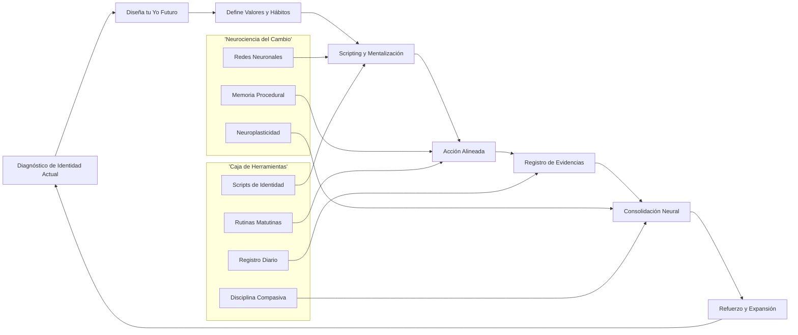
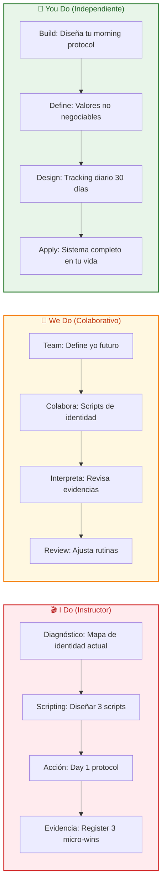
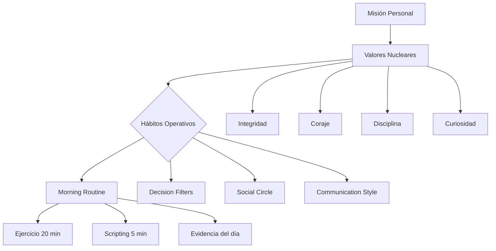

# Fingir con Intención: La Masterclass de Reprogramación Mental 🧠✨

## INTRODUCCIÓN: POR QUÉ ESTA MASTERCLASS ES DIFERENTE

La mayoría de las personas cree que la transformación personal comienza cuando se siente lista. Que primero llega la confianza, luego la motivación, y recién después la acción. Este enfoque es el culpable silencioso de millones de abandonos.

Este masterclass propone un camino contraintuitivo pero científicamente respaldado: **actuar "como si" ya fueras la persona que deseas ser**. No como un juego superficial, sino como un sistema deliberado de ingeniería de identidad que usa la neuroplasticidad a tu favor.

La meta no es engañarte a ti mismo. La meta es construir un puente entre tu versión actual y tu versión futura, repetición tras repetición.

> **🎯 Objetivo de Aprendizaje** — Al final de esta guía, tendrás un sistema paso a paso para rediseñar tu identidad usando el "actuar como si", entenderás la neurociencia que lo respalda, y podrás aplicar rutinas diarias que consoliden el cambio sin depender de la motivación.

> **⚠️ Advertencia educativa** — Este contenido es formativo. La reprogramación mental requiere constancia, autoconocimiento y, en algunos casos, apoyo profesional. No sustituye terapia o asesoramiento clínico.

---

## 🗺️ MAPA DEL WORKFLOW DE IDENTIDAD



| Fase | Pregunta que responde | Output principal |
|------|-----------------------|------------------|
| **Diagnóstico** | ¿Quién soy hoy realmente? | Mapa de creencias limitantes |
| **Diseño Futuro** | ¿Quién quiero ser? | Yo futuro con valores claros |
| **Definición** | ¿Qué hábitos y reglas definen a ese yo? | Protocolos de comportamiento |
| **Scripting** | ¿Qué me digo para activar ese rol? | Scripts mentales precisos |
| **Acción** | ¿Qué hago HOY como esa persona? | Micro-acciones alineadas |
| **Evidencias** | ¿Cómo sé que cambié? | Registro tangible del progreso |
| **Consolidación** | ¿La nueva identidad sobrevivirá al estrés? | Patrones neuronales estables |



---

## 🎭 PARTE 1: FINGIR COMO ESTRATEGIA — DE LA MÁSCARA A LA PIEL

### 1.1 El Mito de la Autenticidad Estática 🔄

La "autenticidad" que invoca la sociedad es, en muchos casos, lealtad a tus limitaciones actuales. Ser "auténtico" suele significar repetir patrones automáticos y justificar conductas pasadas.

```
Autenticidad estática:
// "Así soy yo"
// "No puedo cambiar"
// "No es mi personalidad"
// "Siempre he sido así"

Autenticidad dinámica:
// "Estoy en construcción"
// "Elijo quién ser"
// "Mi identidad es un proyecto"
// "Hoy es diferente"
```

> **💡 Concepto Clave**: Fingir no es mentir. Es construir un puente entre tu versión actual y la versión que pide permiso para existir.

### 1.2 ¿Qué Significa Activar un Rol? 🎬

Actuar "como si" no es interpretar un personaje de teatro. Es adoptar prematuramente las conductas, el lenguaje y la postura de tu yo futuro, con la intención clara de asimilar esa identidad.

| Nivel | Ejemplo | Resultado |
|-------|---------|-----------|
| **Mentira superficial** | Decir "soy seguro" mientras evitas contacto visual | Inconsistencia, culpa |
| **Fingir con intención** | Adoptar postura expansiva, voz firme, gestos decididos | Señales congruentes para el cerebro |
| **Ser genuino** | La identidad se consolidó y el comportamiento fluye natural | Transformación real |

### 1.3 El Puente, No la Mascara 🌉

El cambio real ocurre cuando:

1. 🎯 Defines con precisión quién quieres ser.
2. 🔁 Actúas como esa persona incluso cuando no te sientes como ella.
3. 📸 Tu cerebro registra la evidencia de la discrepancia emocional.
4. 🔩 Con el tiempo, la emoción alcanza la conducta.

---

## 🧠 PARTE 2: LA NEUROCIENCIA DETRÁS DEL CAMBIO — TU CEREBRO NO SABE LA DIFERENCIA

### 2.1 El Cerebro no Discrimina Entre Realidad y Repetición 🪞

Estudios de neurociencia muestran que el cerebro no distingue con precisión entre una experiencia real y una experiencia vivida con intensidad emocional y repetición.

```
Lo que dice la neurociencia:
// Visualizar + actuar = activa las mismas redes neuronales
// Imaginar con detalle el miedo = dispara respuesta de ansiedad
// Imaginar con detalle el éxito = genera dopamina y confianza
// Repetir una conducta nueva = refuerza sinapsis (Hebbian Learning)
```

> **🔬 Hallazgo clave**: Cuando repites comportamientos alineados con tu versión futura, el cerebro crea nuevas redes neuronales como si ya hubieras vivido esa experiencia muchas veces.

### 2.2 Neuroplasticidad en Acción ⚙️

La neuroplasticidad es la capacidad del cerebro para reorganizarse físicamente. Cada nuevo pensamiento o conducta potencia conexiones existentes y crea nuevas.

| Concepto | Implicación Práctica |
|----------|---------------------|
| **Hebbian Learning** | Las neuronas que se activan juntas, se conectan |
| **Desaferenciación** | Lo que no usas se debilita |
| **Consolidación** | El sueño y la repetición solidifican cambios |
| **Emoción como pegamento** | Una emoción intensa acelera el aprendizaje |

### 2.3 Código Mental de Reprogramación 🖥️

```python
import random
from dataclasses import dataclass
from datetime import date

@dataclass
class IdentityScript:
    role: str
    belief: str
    micro_actions: list[str]
    evidence_count: int = 0

class NeuroReprogrammer:
    def __init__(self):
        self.scripts: list[IdentityScript] = []
        self.daily_log: list[dict] = []

    def add_identity(self, role: str, belief: str, micro_actions: list[str]):
        script = IdentityScript(
            role=role,
            belief=belief,
            micro_actions=micro_actions
        )
        self.scripts.append(script)

    def simulate_day(self, stress_level: str = "normal") -> dict:
        performed = []
        for script in self.scripts:
            if random.random() > 0.2:  # 80% compliance rate
                action = random.choice(script.micro_actions)
                performed.append({
                    "role": script.role,
                    "action": action,
                    "aligned": True
                })
                script.evidence_count += 1
            else:
                performed.append({
                    "role": script.role,
                    "action": None,
                    "aligned": False
                })
        return {
            "date": date.today(),
            "stress": stress_level,
            "actions": performed,
            "total_evidence": sum(s.evidence_count for s in self.scripts)
        }

    def predict_shift(self, days: int = 30) -> float:
        base_rate = 0.6
        improvement = 0.08
        projected = base_rate + (improvement * min(days, 90) / 30)
        return min(projected, 0.95)
```

### 2.4 Errores Comunes de Reprogramación 🚫

| Error | Síntoma | Corrección |
|-------|---------|-----------|
| **Depender de la emoción** | No actúas si no te sientes motivado | La emoción sigue a la acción |
| **Demasiados roles** | Dispersión, cansancio | MÁXIMO 3 identidades simultáneas |
| **Inconsistencia** | Un día sí, tres no | Sistema mínimo, no perfecto |
| **Evidencia emocional solo** | "No me sentí bien" | Registra conductas, no sentimientos |
| **Cambio radical sin base** | Estrés excesivo | Capas graduales, no saltos |

---

## ⚡ PARTE 3: LA ACCIÓN PRECEDE A LA EMOCIÓN — EL MOTOR DEL CAMBIO

### 3.1 El Error Numero Uno: Esperar Sentirse Como el Yo Futuro 🛑

La gente cree que debe sentirse confiada para actuar con confianza. La evidencia muestra exactamente lo contrario.

```
Secuencia correcta:
// 1. Adopto la postura (brazos abiertos, espalda recta)
// 2. Hablo con voz firme (aunque mi voz tiemble)
// 3. Tomo una decisión alineada al rol
// 4. Mi cerebro registra la evidencia: "estoy actuando como X"
// 5. La emoción de ser X aparece DESPUÉS de la acción
// 6. La confianza se convierte en un subproducto
```

> **⚡ Insight clave**: La confianza no es un requisito para actuar. La confianza es el **resultado** de haber actuado repetidamente como la persona que aspiras a ser.

### 3.2 La Espiral de Retroalimentación 🔄

| Ciclo | Acción | Resultado |
|-------|--------|-----------|
| **Vuelta 1** | Actúo como X sin sentirlo | Resultado ambiguo |
| **Vuelta 2** | Actúo como X de nuevo | Resultado más congruente |
| **Vuelta 3** | Actúo como X + registro evidencia | Cerebro actualiza prob. |
| **Vuelta 4** | Siento un poco más como X | Emoción alineada |
| **Vuelta N** | Soy X sin esfuerzo | Identidad consolidada |

### 3.3 Rutina de Activación Express ⏱️

Protocolo de 60 segundos para activar cualquier identidad:

POSTURA (10 seg):
// Adopta postura expansiva
// Espalda recta
// Pies firmes en el suelo
// Eleva la barbilla

RESPIRACIÓN (20 seg):
// Inhala 4 seg
// Mantén 4 seg
// Exhala 6 seg
// Repite 3 ciclos

ANCLAJE VERBAL (20 seg):
// "Soy el tipo de persona que..."
// [tu identidad aquí]
// Repite con tono firme

MICRO ACCIÓN (10 seg):
// Haz exactamente la pequeña acción
// que haría tu yo futuro
// Ej: enviar el mensaje / abrir el archivo / hacer el llamado

> **🎯 Regla de Oro**: No esperes motivación. Ejecuta el protocolo y la motivación llegará como consecuencia, no como causa.

---

## 🧩 PARTE 4: DISEÑO CONSCIENTE DE LA IDENTIDAD — TÚ ERES EL ARQUITECTO

### 4.1 La Identidad No Se Descubre, Se Decide 🏗️

Muchos buscan "descubrir quiénes son" como si la identidad fuera un tesoro escondido. La verdad más incómoda: la identidad es una **decisión arquitectónica**, no un hallazgo arqueológico.

```
Identidad como descubrimiento (mito):
// Espero una revelación
// Confío en tests y personalidades
// Justifico mi pasado como "mi esencia"

Identidad como decisión (realidad):
// Elijo quién quiero ser
// Defino valores operativos
// Diseño comportamientos diarios
// Construyo facto a hecho, no a sentimiento
```

### 4.2 Matriz de Diseño de Identidad 🔧

| Componente | Pregunta Clave | Output |
|------------|---------------|---------|
| **Rol** | ¿Qué título quiero tener? | "Soy un [X]" |
| **Valores** | ¿Qué principios guían mis decisiones? | 3-5 valores no negociables |
| **Hábitos** | ¿Qué rutinas matutinas/vespertinas me definen? | Protocolo diario |
| **Lenguaje** | ¿Qué palabras uso? ¿Qué digo cuando estoy estresado? | Scripts verbales |
| **Relaciones** | ¿Con quién paso mi tiempo? | Filtro de círculo social |
| **Criterios de rechazo** | ¿Qué NO haría esta versión de mí? | Líneas rojas claras |

### 4.3 Arquitectura de Valores 🏛️



### 4.4 Prompt para Diseñar tu Yo Futuro 🤖

```text
Actúa como arquitecto de identidad senior.
Objetivo: diseñar la versión futura del usuario en 90 días.
Entradas:
- Rol deseado: [tu respuesta]
- Valores no negociables: [lista de 3-5]
- Conductas actuales que bloquean: [lista honesta]
- Recurso más escaso: [tiempo, energía, atención, dinero]
Entrega:
1. Definición operativa del rol (qué hace, cómo habla, qué viste)
2. 3 micro-acciones diarias irrebatibles
3. 2 frases ancla que usar en momentos de estrés
4. Criterios de medición semanales
5. Una consecuencia clara si se incumple
```

---

## 🔁 PARTE 5: CONSOLIDACIÓN DEL CAMBIO — LA REPETICIÓN COMO ARQUITECTURA

### 5.1 El Umbral de la Incomodidad Temporal 🥶

El cambio genera incomodidad porque tu cerebro está rompiendo un patrón automático para crear uno nuevo. Esta incomodidad no es señal de error; es señal de que la neuroplasticidad está ocurriendo.

```
Fases del cambio:
// 1. Entusiasmo inicial (días 1-3) 🚀
// 2. Resistencia neural (días 4-14) 🧱
// 3. Punto de quiebre (día 14-21) ⚡
// 4. Consenso interno (semanas 3-6) 🌱
// 5. Automatización (mes 2-3) 🏆
```

> **💡 Concepto Clave**: La incomodidad inicial es el precio de entrada. Si el cambio no te genera resistencia, probablemente no estás cambiando nada.

### 5.2 Protocolo de Evidencias Diarias 📸

Tu cerebro necesita pruebas repetidas de que el cambio es real. No confíes en la motivación; confía en el registro.

```
Formato de registro diario MÍNIMO:

✅ Identidad del día: [Soy el tipo de persona que...]
✅ Micro-acción 1: [qué hice alineado a ese rol]
✅ Micro-acción 2: [qué hice alineado a ese rol]
✅ Micro-acción 3: [qué hice alineado a ese rol]
✅ Nivel de incomodidad: [1-10]
✅ Evidencia # del día: [señal concreta de que cambié]
```

### 5.3 Tabla de Consolidación

| Día | Acción Mínima | Evidencia Esperada | Incomodidad Esperada |
|-----|---------------|-------------------|---------------------|
| **1-3** | Protocolo completo | Sentirás extraño | Alta (7-9/10) |
| **4-10** | Protocolo completo | Algunos días olvidas | Moderada-Alta (5-8) |
| **11-21** | Protocolo completo | Aparecen micro-ganancias | Moderada (4-6) |
| **22-42** | Protocolo flexible | La conducta se vuelve automática | Baja (2-4) |
| **43-90** | Mantenimiento | La identidad fluye naturalmente | Muy baja (1-3) |

### 5.4 Código de Seguimiento de Identidad 📊

```python
import json
from datetime import date

class IdentityTracker:
    def __init__(self, identity_name: str):
        self.identity_name = identity_name
        self.entries: list[dict] = []
        self.streak = 0

    def log_day(self, actions: list[str], evidence: str, discomfort: int):
        entry = {
            "date": date.today().isoformat(),
            "identity": self.identity_name,
            "actions": actions,
            "evidence": evidence,
            "discomfort": discomfort,
            "completed": len(actions) >= 3
        }
        self.entries.append(entry)
        if entry["completed"]:
            self.streak += 1
        return entry

    def weekly_report(self) -> dict:
        if not self.entries:
            return {"error": "No data yet"}
        last_7 = [e for e in self.entries[-7:]]
        completed = sum(1 for e in last_7 if e["completed"])
        avg_discomfort = sum(e["discomfort"] for e in last_7) / len(last_7)
        return {
            "week_completion": f"{completed}/7",
            "avg_discomfort": round(avg_discomfort, 1),
            "current_streak": self.streak,
            "last_evidence": last_7[-1]["evidence"] if last_7 else None
        }

    def save(self, path: str):
        with open(path, "w", encoding="utf-8") as f:
            json.dump(self.entries, f, ensure_ascii=False, indent=2)
```

---

## 🎯 PARTE 6: LOS TRES MODOS DE APRENDIZAJE — I DO / WE DO / YOU DO

### 6.1 I Do — Activación de Identidad Guiada 🎬

**Objetivo**: experimentar el cambio de estado a través de conductas antes que emociones.

| Paso | Acción | Resultado esperado |
|------|--------|--------------------|
| 1 | Levantarse, adoptar postura "segura" | Inmediato: cambio fisiológico |
| 2 | Caminar por la habitación como el nuevo rol | Cambio en la percepción |
| 3 | Hablar en voz alta 3 afirmaciones del rol | Activación verbal |
| 4 | Ejecutar una micro-acción real | Primera evidencia tangible |
| 5 | Registrar incomodidad en escala 1-10 | Datos para mirror |

```python
# Ejecución del I Do por 60 segundos
import time

def activate_identity(role: str, script: str):
    print(f"Activando identidad: {role}")
    print(f"Script: {script}")
    
    for segment in ["posture", "breathing", "verbal", "action"]:
        input(f"Presiona Enter para continuar con {segment}...")
        print(f"Realizando {segment}...")
        time.sleep(3)
    
    print("Identidad activada. Registra la evidencia.")
```

> **🎥 Interpretación guiada**: Si te cuesta aceptar que actuar genera emoción, obsérvate: después del ejercicio, ¿tu estado de ánimo es el mismo? Apunta la diferencia.

### 6.2 We Do — Construir el Yo Futuro en Equipo 🤝

**Escenario**: una persona quiere pasar de "estudiante pasivo" a "estudiante estratégico".

**Tarea en equipo**: diseño colectivo de la identidad académica.

| Decisión | Opción Recomendada | Justificación |
|----------|-------------------|---------------|
| **Rol** | "Soy un estratega de aprendizaje" | Define comportamiento operativo |
| **Valor núcleo** | Profundidad > Cantidad | Filtro de decisiones diarias |
| **Micro-acción 1** | Empezar con la tarea más difícil primero | Estados de alta energía |
| **Micro-acción 2** | Apuntar 3 ideas clave por sesión | Claridad de foco |
| **Micro-acción 3** | Enseñar lo aprendido en 1 minuto | Consolidación neural |
| **Evidencia** | Sesiones completadas sin procrastinación | Métrica observable |

### 6.3 You Do — Construye tu Sistema de Identidad 🔨

**Tarea**: crea tu sistema completo.

| Fase | Acción | Entregable |
|------|--------|-----------|
| **Diagnóstico** | Lista 5 comportamientos que traicionan tu identidad ideal | Lista honesta |
| **Diseño** | Define 1 rol principal + 3 micro-acciones diarias | Protocolo escrito |
| **Scripting** | Escribe 3 afirmaciones como tu yo futuro | Scripts listos |
| **Tracking** | Implementa IdentityTracker por 30 días | Datos y tendencias |
| **Revisión** | Analiza tu incomodidad promedio y tasa de completitud | Ajustes al sistema |

| Criterio | Peso |
|----------|------|
| Claridad del rol | 20% |
| Consistencia del registro | 30% |
| Reducción de incomodidad | 20% |
| Evidencias tangibles | 20% |
| Sistema sostenible a largo plazo | 10% |

### 6.4 I Do — Anatomy de una Rutina Matutina de Identidad ☀️

**Objetivo**: instalar el estado mental óptimo antes de cualquier decisión.

| Tiempo | Acción | Propósito |
|--------|--------|-----------|
| 0:00 - 0:30 | Postura & Respiración | Cambiar estado fisiológico |
| 0:30 - 1:00 | Scripting verbal | Reprogramar creencias |
| 1:00 - 1:30 | Visualización del día | Pre-activar conductas |
| 1:30 - 2:00 | Micro-acción #1 | Primera evidencia del día |

> **📝 Teoría**: La mañana define el tono neural del día. Si tu primera acción no es alineada, pasas el día reaccionando en lugar de actuar.

### 6.5 We Do — Detectar creencias limitantes en tiempo real 🔍

**Escenario**: un estudiante quiere dejar de decir "no soy bueno para las matemáticas".

**Ejercicio colaborativo**: cuando aparece la frase limitante, reestructúrala en tiempo real.

| Frase Limitante | Reestructuración como Identidad |
|-----------------|--------------------------------|
| "No soy bueno para esto" | "Soy alguien que aprende cualquier cosa" |
| "No tengo talento" | "Mi talento es la consistencia" |
| "Es muy difícil" | "Soy el tipo de persona que resuelve problemas difíciles" |
| "No vale la pena" | "Invierto en mi desarrollo sin negociar" |

### 6.6 You Do — Diseña tu propio tracking mensual 📈

**Tarea**: crea tu dashboard de identidad.

| Widget | Métrica | Frecuencia |
|--------|---------|-----------|
| Consistencia | Días completados / días totales | Diaria |
| Incomodidad promedio | 1-10 escala | Diaria |
| Evidencias recolectadas | # total | Semanal |
| Discrepancias | Días donde el rol fue abandonado | Semanal |
| Progreso subjetivo | "Me siento más el rol esta semana" | Semanal |

---

## 📓 PARTE 7: ANEXOS Y RECURSOS

### Anexo A: Plantilla de Scripts por Identidad 📝

```
IDENTIDAD: [Nombre del rol]

AFIRMACIÓN ANCLA:
"Soy el tipo de persona que [comportamiento observable]."

MICRO-ACCIONES IRREBATIBLES:
1. [Acción física específica, <2 minutos]
2. [Acción de comunicación específica]
3. [Acción cognitiva específica]

SEÑALES DE ALINEACIÓN:
✅ [Indicador observable 1]
✅ [Indicador observable 2]
✅ [Indicador observable 3]

SEÑALES DE DESVIACIÓN:
❌ [Indicador observable 1]
❌ [Indicador observable 2]

PROTOCOLO DE RECUPERACIÓN:
Si me desvío: [reacción inmediata específica]
Si fallo 2 días seguidos: [consecuencia definida]
```

### Anexo B: Checklist de Reprogramación ✅

| Item | Check | Frecuencia |
|------|-------|-----------|
| Diseño de identidad definido | ☐ | Mensual |
| 3 micro-acciones diarias | ☐ | Diaria |
| 3 evidencias registradas | ☐ | Diaria |
| Incomodidad medida | ☐ | Diaria |
| Scripts rehechos/actualizados | ☐ | Semanal |
| Revisión de círculo social | ☐ | Mensual |
| Protocolo de recuperación activado | ☐ | Cuando aplique |

### Anexo C: Preguntas de Activación Rápida ⚡

Cuando no sabes qué hacer o cómo actuar, responde:

1. ¿Qué haría la mejor versión de mí aquí?
2. ¿Qué diría mi yo futuro con 10 años de disciplina?
3. Si nadie me juzgara, ¿cuál es el movimiento obvio?
4. Si este fuera mi último día en este rol, ¿cómo quiero actuar?
5. ¿Qué tan incómodo estoy dispuesto a estar para merecer esta identidad?

---

## 📚 GLOSARIO RÁPIDO

| Término | Definición |
|---------|------------|
| **Reprogramación mental** | Proceso deliberado de cambiar patrones de pensamiento y conducta |
| **Acting as if** | Técnica de adoptar conductas de la identidad deseada |
| **Neuroplasticidad** | Capacidad del cerebro para reorganizarse físicamente |
| **Hebbian Learning** | Las neuronas que se activan juntas, refuerzan su conexión |
| **Evidencia conductual** | Registro observable y medible de acciones alineadas |
| **Scripting** | Diseño deliberado de frases y patrones verbales |
| **Micro-acción** | Comportamiento pequeño, específico, irreversible |
| **Disciplina compasiva** | Volver a empezar sin castigo tras un fallo |
| **Identidad dinámica** | La identidad como proyecto en evolución, no como rasgo fijo |
| **Incomodidad de cambio** | Señal neurofisiológica de plasticidad en acción |

---

## 📝 PREGUNTAS DE VERIFICACIÓN

Responde cada pregunta basándote en los conceptos de esta master class. Escribe tus respuestas o compártelas para profundizar tu aprendizaje.

### Preguntas sobre Fingir como Estrategia

1. **Define**: ¿Por qué el "fingir" es diferente a mentir en el contexto de reprogramación mental? Da un ejemplo concreto.

2. **Analiza**: ¿Qué es la "autenticidad estática" según esta guía? ¿Por qué puede ser una trampa?

### Preguntas sobre Neurociencia del Cambio

3. **Explica**: ¿Por qué el cerebro no distingue bien entre realidad y lo que imaginas? Menciona 3 implicaciones prácticas.

4. **Diseña**: Usando el código `IdentityTraker`, ¿qué métricas elegirías para medir tu progreso en 30 días?

### Preguntas sobre Acción y Emoción

5. **Aplica**: Describe tu rutina de activación express de 60 segundos para la identidad que deseas.

6. **Reflexiona**: ¿Por qué esperar sentirse motivado es el error que más retrasa el cambio? Explica con el ciclo retroalimentación.

### Preguntas sobre Diseño de Identidad

7. **Propón**: Define tu propio rol, 3 valores y 3 micro-acciones diarias para un cambio que quieras implementar.

8. **Critica**: ¿Qué es más efectivo: un cambio grande radical o un cambio pequeño sostenido? ¿Por qué?

### Preguntas Integradoras

9. **Conecta**: Explica cómo el diseño consciente de identidad (Parte 4) se relaciona con la consolidación neural (Parte 5). ¿Qué pasaría si diseñas sin consolidar?

10. **Síntesis**: Diseña un sistema de tracking completo para alguien que quiere pasar de "empleado reactivo" a "líder proactivo" en 90 días. Incluye: rol, valores, protocolo diario, métricas y protocolo de recuperación.

11. **Reflexión final**: De los 5 bloques de la masterclass, ¿cuál consideras más crítico para transformar la identidad y por qué? Justifica con tu experiencia o razonamiento.

---

## 🌍 ANEXO: FORMATO IDEAL PARA ARTÍCULOS EDUCATIVOS

### Recomendaciones de ancho para lectura larga

El ancho óptimo para artículos educativos es **60–75 caracteres por línea** (incluyendo espacios). Equivale aproximadamente a:

- `max-width: 65ch` en CSS (una de las mejores opciones).
- 550–750 px de ancho de contenido.

```css
.article-content {
  max-width: 65ch;
}
```

Muchos estudios de legibilidad consideran que entre **50 y 75 caracteres por línea** es la zona óptima para lectura prolongada.

---

### Anchura recomendada para guías de aprendizaje

Las guías educativas tienen necesidades diferentes a las noticias o blogs normales.

**Ancho recomendado:**

```css
.article-content {
  max-width: 60ch;
}
```

o

```css
.article-content {
  max-width: 65ch;
}
```

Esto facilita:

- Mantener la atención
- Reducir la fatiga visual
- Mejorar la comprensión
- Facilitar el seguimiento de conceptos complejos

---

### Lo que hace agradable una guía al cerebro

- Jerarquía visual clara (títulos, subtítulos, listas)
- Pausas de descanso (más espacios entre bloques grandes)
- Variedad de formatos (texto, tablas, código, listas)
- Transiciones explícitas entre conceptos
- Ritmo de dificultad: fácil → medio → retador

--- 

*¿Qué identidad estás construyendo? Cuéntame en los comentarios.*
