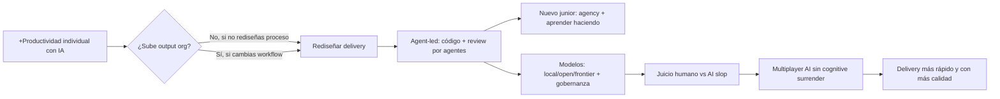
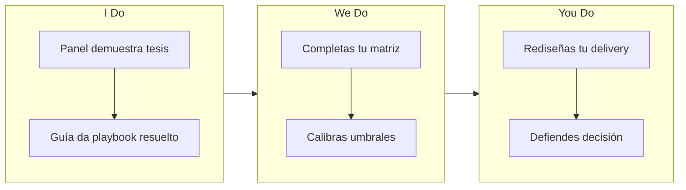
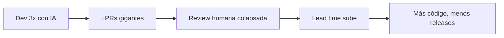
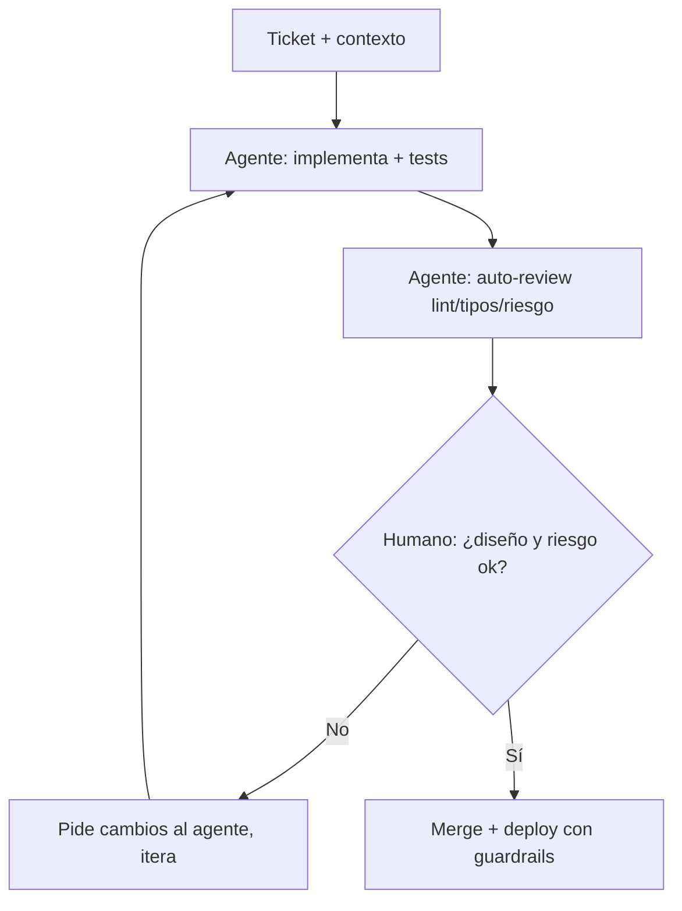
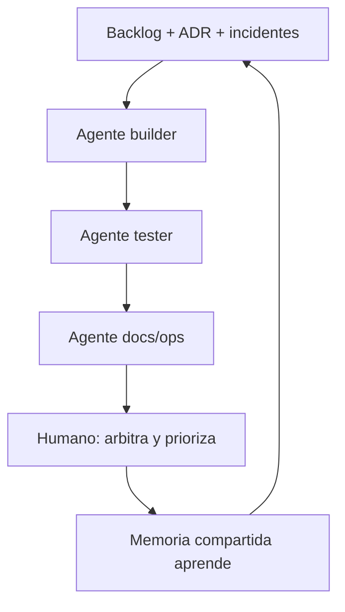

# MASTERCLASS: Future of Software Development — Panel Agent Conf 2026

## 0. CÓMO ESTUDIAR ESTA GUÍA (5 MINUTOS QUE MULTIPLICAN TU RETENCIÓN)

Misma metodología con evidencia que el resto de masterclasses del blog. No la leas de corrido.

### 0.1 Los 7 principios aplicados aquí

| Principio | Qué dice la evidencia | Cómo lo aplicamos aquí |
|-----------|----------------------|------------------------|
| **1. Objetivos + diseño inverso (Wiggins & McTighe, Bloom)** | Aprendes más si sabes qué serás capaz de *hacer* | Cada parte empieza con 🎯 Objetivo medible |
| **2. Carga cognitiva (Sweller)** | Memoria de trabajo: 4±1 ideas nuevas | Chunks, una idea por tabla/diagrama |
| **3. Organizador previo (Ausubel) + doble código (Paivio/Mayer)** | Mapa + palabra + imagen retiene más | Mapa del panel + tabla + diagrama por tema |
| **4. Ejemplo trabajado → desvanecimiento** | Ver resuelto → completar huecos → crear | Playbooks completos → plantillas con huecos → diseñar tu proceso |
| **5. Recuperación activa (Roediger & Karpicke)** | Recordar retiene ~2x más que releer | 🧠 Auto-test tras cada parte, tapa la respuesta |
| **6. Dificultad deseable + intercalado (Bjork, Rohrer)** | Mezclar casos parecidos discrimina mejor | Casos "¿agente o humano?" intercalados, no por bloques |
| **7. Feedback + metacognición** | Calibrar tu juicio evita rendición cognitiva | ❌ Misconcepción, rúbricas, checklist, plan 1-7-30 |

### 0.2 Protocolo (4 pasadas)

1. **Diagnóstico (5 min):** haz el Pre-test 0.3 sin mirar.
2. **Lectura (25 min):** mapa + Partes 1-3 con auto-tests tapados.
3. **Práctica (30 min):** Partes 4-7. Copia un playbook, complétalo, adaptalo a tu equipo.
4. **Consolidación (1-7-30):** plan final. Si no explicas cada parte en 2 min (Feynman), vuelve a ese chunk.

> **Regla de oro del panel:** la IA multiplica la productividad *individual*, pero la productividad *organizacional* solo sube si rediseñas el proceso de delivery. Comprar licencias no basta.

### 0.3 Pre-test diagnóstico (3 min, sin mirar)

1. ¿Por qué más productividad individual con IA no implica más output organizacional?
2. ¿Qué cambia en coding y PR review con workflows agent-led?
3. ¿Está muerto el camino del junior? ¿Qué es "agency" en este contexto?
4. ¿Cuándo elegirías modelo local/open vs frontier? ¿Y on-premise?
5. ¿Qué es "AI slop" y cuál es el antídoto según el panel?
6. ¿Qué es "multiplayer AI" y qué es "cognitive surrender"?

Guarda tus respuestas. Al final las comparas.

> **Prerrequisitos:** git/PRs básicos, noción de LLM/agente, haber trabajado en un equipo de software. Sin esto, lee primero 1.1 y 2.1.

### 0.4 Objetivos (verbos Bloom)

Al terminar podrás:

- **Recordar:** las 6 tesis del panel con su timestamp.
- **Comprender:** explicar la paradoja productividad individual vs organizacional.
- **Aplicar:** montar un loop agent-led de código + review con Definition of Done.
- **Analizar:** elegir modelo (local/open/frontier/on-prem) según costo, privacidad y regulación.
- **Evaluar:** detectar AI slop y decidir cuándo aceptar, reescribir o rechazar.
- **Crear:** rediseñar tu proceso de delivery para multiplayer AI sin cognitive surrender.

---

## MAPA DEL PANEL (organizador previo)



| Bloque | Timestamp | Tesis en 1 frase |
|--------|-----------|------------------|
| Productividad y roles | 04:05, 05:50 | Individuo más rápido ≠ org más rápida; el cuello es el proceso |
| Coding + review agent-led | 08:00, 09:40, 10:45 | El agente codifica y pre-revisa; el humano decide y diseña |
| Aprendices / juniors | 10:45, 11:39, 18:10 | El sendero cambia: menos mentoría pasiva, más agency activa |
| Modelos y gobernanza | 20:04, 23:23, 25:02 | Startup = costo; regulada = privacidad/gobernanza/on-prem |
| AI slop | 27:22, 29:14, 34:32 | El slop es glitch temporal; gusto + escritura original = ventaja |
| Consejo práctico | 37:57, 47:16 | Multiplayer AI + nuevo delivery + no rendir tu criterio |



---

## PARTE 1: LA PARADOJA — INDIVIDUO RÁPIDO, ORG LENTA

> 🎯 **Objetivo** — Podrás *explicar* sin mirar por qué comprar licencias no sube el throughput y qué debe cambiar un líder.

### 1.1 Qué observó el panel (04:05, 05:50)

Productividad individual disparada (autocompletado, scaffolding, tests, docs en minutos). Pero el output organizacional —features shipeadas con calidad— no escala igual. ¿Por qué? El resto del sistema sigue igual: colas de PR, revisiones lentas, QA manual, deploy frágil, decisiones centralizadas.

| Nivel | Qué mejora con IA | Qué lo frena |
|-------|-------------------|--------------|
| **Individual** | Escribir código, tests, docs | — |
| **Equipo** | Drafts más rápidos | PRs gigantes, review superficial, reuniones |
| **Organización** | Más intentos | Proceso waterfall disfrazado, sin WIP limits, sin ownership |

> **Frase ancla:** "No transformas output comprando licencias. Transformas output rediseñando operaciones."

### 1.2 Ejemplo trabajado: el embudo

Dev genera 3x más código con IA → abre 3x más PRs → 2 revisores humanos colapsan → lead time sube → se acumula merge hell → calidad baja. Resultado: más LOC, menos valor.



❌ **Misconcepción:** "Si cada dev es 2x, el equipo es 2x."
✅ **Corrección:** el throughput lo define el cuello de botella (review, QA, deploy, decisión). Sin tocar el cuello, más input = más cola.

> 🧠 **Auto-test 1 (60 seg, tapa la tabla):**
> 1. Da 2 cuellos que impiden que productividad individual se vuelva organizacional.
> 2. ¿Qué debe hacer un líder en vez de solo comprar licencias?
>
> *Respuestas: (1) review/colas PR, QA/deploy, decisiones centralizadas — dos valen; (2) rediseñar proceso operativo: WIP limits, ownership, delivery continuo, nuevas reglas de review.*

---

## PARTE 2: CODING Y REVIEW AGENT-LED

> 🎯 **Objetivo** — Podrás *describir* el loop agent-led y *aplicar* una Definition of Done para PRs con agentes.

### 2.1 El giro (08:00, 09:40, 10:45)

Panelistas como Carl Ross (OpenAI) y Margaret Pieczkowski (okthink.ai) cuentan que ya no codifican a mano ni hacen PR review tradicional humano-primero. El flujo se invierte:

| Antes (humano-led) | Ahora (agent-led) |
|--------------------|-------------------|
| Humano escribe todo, IA sugiere | Agente genera draft + tests + docs |
| Humano revisa todo línea a línea | Agente pre-revisa (lint, tipos, tests, riesgo), humano decide |
| PR gigante al final | PRs pequeños, frecuentes, con contexto del agente |
| Review = cazar typos | Review = juzgar diseño, riesgo y producto |



### 2.2 Ejemplo trabajado: Definition of Done agent-led (cópiala)

```markdown
## DoD para PR con agentes
- [ ] PR < 400 líneas o dividido por stack
- [ ] Agente corrió: lint, typecheck, tests afectados, SAST básico
- [ ] Resumen del agente: qué cambió, por qué, riesgos, cómo revertir
- [ ] Tests nuevos para el bug/feature (no solo snapshots)
- [ ] Humano marcó: diseño aprobado / riesgo aceptado / producto ok
- [ ] Métricas: lead time, nº iteraciones agente, defectos post-merge
```

💡 **Pregunta elaborativa:** ¿qué parte *nunca* delegas al agente? Diseño de API, decisiones de producto, trade-offs de seguridad/privacidad y la palabra final en riesgo alto.

> 🧠 **Auto-test 2:**
> 1. ¿Qué hace el agente y qué reserva el humano en review agent-led?
> 2. Nombra 3 ítems de la DoD que impidan PRs gigantes inrevisables.
>
> *Respuestas: (1) agente: implementa, testea, pre-revisa; humano: diseño, riesgo, producto, decisión final; (2) <400 líneas, resumen con riesgos/rollback, tests reales, aprobación explícita diseño/riesgo.*

❌ **Misconcepción:** "Agent-led = sin humanos."
✅ Realidad: *human-on-the-loop* en lo rutinario, *human-in-the-loop* en riesgo alto. Menos ojos en sintaxis, más juicio en diseño.

---

## PARTE 3: ¿SE ACABÓ EL CAMINO DEL JUNIOR?

> 🎯 **Objetivo** — Podrás *argumentar* qué cambia para juniors y *diseñar* un plan de 30 días basado en agency.

### 3.1 El debate (10:45, 11:39, 18:10)

Temor: si el agente hace el trabajo "fácil", el junior no aprende. Tesis del panel: el sendero no muere, muta. Antes: mentor te daba tareas cerradas y corregía sintaxis. Ahora: el agente corrige sintaxis; el junior debe aportar **agency** — iniciativa, ownership, capacidad de llevar algo de 0 a merged con IA.

| Junior pasivo (en riesgo) | Junior con agency (prospera) |
|---------------------------|------------------------------|
| Pega output sin entender, no cuestiona | Interroga al agente, pide alternativas, verifica |
| Espera tareas micro-cortadas | Toma un problema pequeño end-to-end |
| Evita leer código ajeno | Lee PRs del agente como antes leía PRs senior |
| "La IA lo hizo" | "Yo decidí esto por X, la IA ejecutó" |

### 3.2 Plan trabajado 30-60-90 (adáptalo)

- **Días 1-30 — Aprender haciendo:** 1 bug pequeño/semana end-to-end con agente; diario de decisiones (qué pediste, qué aceptaste, por qué); 2 PRs leídos/día con notas.
- **Días 31-60 — Ownership:** 1 feature pequeña con tests; presenta trade-offs a senior; mide tus iteraciones con agente (bajar de 8 a 3 es progreso).
- **Días 61-90 — Juicio:** revisa PRs de agentes de otros; detecta 1 slop/semana y documenta por qué lo rechazaste.

> 🧠 **Auto-test 3:** define *agency* en 1 frase y da 2 conductas observables en un junior.
> *Respuesta: capacidad de llevar trabajo a done con iniciativa y criterio usando IA; ej. cuestiona output, verifica con tests, documenta decisiones, pide alternativas.*

❌ **Misconcepción:** "El junior ya no necesita fundamentos."
✅ Realidad: los necesita *más*, pero los aprende al revés: primero ve solución del agente, luego la deconstruye (fading invertido). Sin fundamentos no detecta slop.

---

## PARTE 4: MODELOS Y GOBERNANZA — LOCAL, OPEN, FRONTIER

> 🎯 **Objetivo** — *Elegirás* el tipo de modelo correcto según costo, privacidad y regulación, y lo justificarás.

### 4.1 Mapa del panel (20:04, 23:23, 25:02)

| Opción | Gana en | Pierde en | Típico en |
|--------|---------|-----------|-----------|
| **Open weights local** | Privacidad, costo inferencia, offline | Capacidad frontier, ops propia | Prototipos, datos sensibles, edge |
| **Open vía API barata** | Costo, velocidad | Gobernanza, dependencia | Startups, alto volumen, tareas rutinarias |
| **Frontier cerrado** | Razonamiento, código complejo | Costo, data sharing | Problemas difíciles, bajo volumen |
| **On-prem / VPC dedicada** | Control, compliance | Costo, velocidad de adopción | Banca, salud, gobierno |

Regla práctica del panel: **enruta por riesgo y dificultad**, no por moda.

```text
¿Dato regulado / no puede salir?
├── SÍ → local / on-prem / VPC + DLP + audit
└── NO → ¿Tarea difícil (diseño, bug sutil)?
          ├── SÍ → frontier (poco volumen)
          └── NO → open barato (alto volumen, agent-led)
```

### 4.2 Ejemplo trabajado: matriz de decisión

| Caso | Decisión | Por qué |
|------|----------|---------|
| Autocompletar interno bancario | Local / on-prem | Secreto, audit, no exfiltración |
| Triage de 10k tickets/día startup | Open barato vía API | Volumen, costo manda |
| Debug de race condition crítica | Frontier | Capacidad > costo, poco volumen |
| Gobierno con residencia de datos | On-prem + gateway | Ley exige control |

Incluye siempre: dónde vive el dato, quién lo loggea, retención, y quién aprueba excepciones.

> 🧠 **Auto-test 4 (intercalado):** clasifica:
> a) Generar embeddings de historiales médicos. b) Resumir 50k reviews públicas. c) Diseñar migración de monolito.
>
> *Respuestas: a) on-prem/local (privacidad); b) open barato (volumen, dato público); c) frontier + humano senior (dificultad).*

❌ **Misconcepción:** "Open = siempre más barato y seguro."
✅ Realidad: open local exige ops/GPU; open vía API sigue compartiendo datos. Calcula TCO + riesgo, no solo $/token.

---

## PARTE 5: AI SLOP — EL GLITCH Y EL ANTÍDOTO

> 🎯 **Objetivo** — *Detectarás* slop en código y texto y *decidirás* aceptar / reescribir / rechazar con rúbrica.

### 5.1 Qué dice el panel (27:22, 29:14, 34:32)

"AI slop" = contenido generado mediocre: código verboso que "parece" correcto, docs genéricas, posts clónicos. Tesis: es un **glitch temporal** (herramientas nuevas + incentivos de volumen). La ventaja duradera es **juicio, gusto y escritura original**.

| Slop típico | Señal | Antídoto |
|-------------|-------|----------|
| Código que pasa lint pero huele | Nombres genéricos, abstracciones prematuras, tests tautológicos | Leer + ejecutar + mutar: ¿el test falla si rompo el código? |
| Doc/post genérico | Frases vacías, sin números, sin trade-off | Exige: dato, decisión y disenso (qué NO elegiste y por qué) |
| PR enorme "verde" | CI pasa, nadie entiende el diseño | Vuelve a Parte 2: divide, pide resumen de riesgos, humano juzga diseño |

### 5.2 Rúbrica trabajada (úsala en cada review)

```markdown
## Anti-slop (2 min por PR)
- [ ] ¿Puedo explicar el cambio en 30 seg sin leer el diff?
- [ ] ¿Hay al menos 1 decisión no obvia documentada?
- [ ] ¿Los tests fallarían si el fix fuera wrong? (mutation mental)
- [ ] ¿Se eliminó código o solo se añadió?
- [ ] ¿Tiene números (latencia, costo, %)? Si no, es humo.
Veredicto: Aceptar / Reescribir con agente / Rechazar + re-diseñar
```

💡 **Elabora:** el gusto no es innato, se entrena leyendo buen código y escribiendo tú. Quien deja de escribir, deja de juzgar (puente a Parte 6).

> 🧠 **Auto-test 5:** da 3 señales de slop y qué harías en cada caso.
> *Respuesta: ej. tests tautológicos → pedir tests que fallen sin fix; doc sin números → exigir métricas; PR gigante verde → dividir y pedir análisis de riesgos.*

---

## PARTE 6: MULTIPLAYER AI Y RENDICIÓN COGNITIVA

> 🎯 **Objetivo** — *Rediseñarás* tu delivery para IA multi-agente sin rendir tu criterio.

### 6.1 De single-player a multiplayer (37:57)

Single-player = cada dev con su copiloto aislado. Multiplayer AI = agentes + humanos compartiendo contexto: memoria del repo, decisiones, backlog, incidentes. Gana quien diseña **procesos de entrega para enjambres**, no quien suma copilotos sueltos.

| Single-player | Multiplayer AI |
|---------------|----------------|
| Prompts privados, historiales perdidos | Playground compartido: prompts, evaluaciones, lecciones |
| Cada uno re-descubre el bug | Agentes que leen postmortems + ADR + runbooks |
| Review 1:1 | Review en enjambre: agente implementa, otro testea, otro documenta, humano arbitra |



### 6.2 Cognitive surrender (47:16) — el riesgo real

Rendirse cognitivamente = aceptar output porque "suena bien" y dejar de pensar. Abundancia de output + prisa = atrofia del juicio. Antídotos del panel:

1. **Fricción diseñada:** exige al agente 2 alternativas + trade-offs antes de aceptar.
2. **Escritura original semanal:** 1 ADR, postmortem o diseño escrito por ti sin IA (luego la usas para pulir).
3. **Pre-mortem:** antes del merge, 5 min: "si esto rompe prod, ¿por qué sería?".
4. **Métricas de juicio:** % PRs reescritos, defectos post-merge, tiempo a rollback — no solo velocidad.

> 🧠 **Auto-test 6:** explica multiplayer AI y da 2 prácticas anti-surrender para tu equipo mañana.
> *Respuesta: IA compartiendo contexto y roles entre humanos+agentes; ej. pedir 2 alternativas, pre-mortem, escritura propia semanal, rúbrica anti-slop.*

❌ **Misconcepción:** "Más agentes = automáticamente mejor."
✅ Realidad: sin memoria compartida y árbitro humano, más agentes = más slop coordinado.

---

## PARTE 7: PLAYBOOKS LISTOS (copia → adapta → crea)

> 🎯 **Objetivo** — Saldrás con 2 artefactos: uno para líderes, uno para ingenieros.

### 7.1 Para líderes: rediseño operativo en 4 semanas

```markdown
Semana 1 — Medir cuello: lead time, tamaño PR, tiempo review, defectos, deploy freq.
Semana 2 — WIP + DoD agent-led: PR <400 líneas, pre-review agente obligatorio, owners claros.
Semana 3 — Memoria compartida: ADRs, runbooks y postmortems legibles por agentes.
Semana 4 — Gobernanza modelos: matriz Parte 4 + DLP + audit. Revisa métricas, no vanity (LOC).
No-go: prohibir IA o solo comprar licencias sin cambiar proceso.
```

### 7.2 Para ingenieros: loop diario anti-slop

```markdown
Mañana: pull de contexto (memoria, tickets) → agente builder en rama pequeña
Mediodía: auto-review agente → tú juzgas diseño/riesgo → iteras (máx 3 vueltas)
Tarde: PR pequeño + rúbrica Parte 5 + pre-mortem 5 min
Viernes: 1h escritura original + lectura de 2 PRs ajenos con notas
```

### 7.3 Template: enrutador de modelos (pégalo en tu repo)

```yaml
# model-router.yaml
default: open-cheap-high-volume
rules:
  - if: data_class == "regulated" or pii == true
    use: on-prem-local
    require: [dlp, audit_log, human_approval]
  - if: difficulty == "hard" and volume == "low"
    use: frontier
    require: [cost_tag, human_review]
  - else: open-cheap
    require: [eval_suite, slop_rubric]
```

> 🧠 **Auto-test 7:** ¿qué métricas mirarías en 30 días para saber si el rediseño funcionó?
> *Respuesta: lead time, deploy frequency, change failure rate, defectos post-merge, % PRs reescritos, tiempo review — no LOC ni nº PRs.*

---

## PARTE 8: REFERENCIA RÁPIDA (consulta, no memorices)

| Tema | Regla en 1 línea |
|------|------------------|
| Productividad | Individuo 3x ≠ org 3x; ataca el cuello (review/QA/deploy) |
| Agent-led | Agente implementa + pre-revisa; humano diseña + decide riesgo |
| Junior | Agency > sintaxis: ownership end-to-end + diario decisiones |
| Modelos | Regulado → on-prem; difícil-poco-volumen → frontier; resto → open barato |
| Slop | Si no explica decisión + números + tests que muerden, es slop |
| Multiplayer | Contexto compartido + roles + árbitro humano |
| Surrender | 2 alternativas + pre-mortem + escritura propia semanal |

---

## PARTE 9: PRÁCTICA — I DO / WE DO / YOU DO + BLOOM

### 9.1 We Do (fading, completa huecos)

```markdown
Nuestro cuello es ___ (lead time / review / QA).
DoD agente exige: PR < ___ líneas + ___ + ___.
Enrutamos: dato regulado → ___ ; bug difícil → ___ ; volumen → ___.
Anti-slop: si el test no ___ al romper el código, se ___.
Anti-surrender: pedimos ___ alternativas + ___ de 5 min.
```

Discute con tu equipo: ¿qué umbral de tamaño PR es realista? ¿Quién arbitra riesgo alto?

### 9.2 You Do (desde cero, con rúbrica)

**Misión:** rediseña tu delivery en 1 página: mapa actual con cuello marcado, nuevo loop agent-led, matriz de modelos, DoD + rúbrica anti-slop, 3 métricas de 30 días y 1 riesgo de surrender con su antídoto.

| Criterio | Peso |
|----------|------|
| Cuello identificado con datos | 20% |
| Loop agent-led con roles claros | 25% |
| Matriz modelos + gobernanza | 20% |
| Anti-slop + anti-surrender operativos | 20% |
| Métricas de outcome (no vanity) | 15% |

<80% → vuelve solo al chunk fallado.

### 9.3 Ejercicios Bloom

- **Nivel 1:** resume las 6 tesis con timestamp sin mirar; define agency, slop, multiplayer, surrender.
- **Nivel 2:** aplica DoD a tu último PR; clasifica 3 tareas tuyas por matriz de modelos.
- **Nivel 3:** corre pre-mortem a tu próximo merge; escribe 1 ADR sin IA y luego pule con IA; mide lead time 2 semanas.

> Feynman: explícalo en 2 min a un junior. Lo que no salga simple, repásalo.

---

## PARTE 10: FAQ

**¿Los agentes reemplazan devs?** No según el panel: reemplazan *tareas*, cambian *roles*. Más juicio, menos tipeo.
**¿Se acaba el junior?** No, cambia el camino: menos corrección de sintaxis, más ownership y agency.
**¿Review humana muere?** Muere la review tipográfica; nace la review de diseño/riesgo/producto.
**¿Qué modelo elijo?** Por riesgo+dificultad, no por hype. Ver Parte 4.
**¿Open es gratis?** No: TCO incluye GPU/ops + riesgo. Calcula.
**¿Slop se queda?** El panel lo ve temporal; el gusto humano se vuelve *más* valioso.
**¿Por dónde empiezo mañana?** WIP + PRs pequeños + DoD agent-led + 1 rúbrica anti-slop.
**¿Cómo evito surrender?** Escribe tú semanalmente, pide alternativas, haz pre-mortem.

---

## CIERRE + PLAN 1-7-30

El futuro que describe el panel no es "IA escribe todo". Es: **enjambres humano+agente con memoria compartida, delivery rediseñado, modelos enrutados por riesgo y juicio humano como activo escaso.**

> Frase para recordar: *"La ventaja no es generar más. Es juzgar mejor."*

### Vuelve a tu Pre-test (5 min)

Re-responde las 6 preguntas sin mirar. Puntúa tu confianza 1-5. Lo ≤3 va a tu próxima sesión.

### Plan espaciado

- **Día 1 (10 min):** mapa + referencia rápida + auto-tests 1-3.
- **Día 7 (15 min):** rehaz We Do 9.1 + aplica rúbrica anti-slop a 2 PRs reales.
- **Día 30 (20 min):** You Do en tu equipo + revisa lead time y defectos.

### Checklist prod

- [ ] Cuello medido, no adivinado
- [ ] DoD agent-led activa y cumplida
- [ ] Matriz de modelos + DLP/audit donde toca
- [ ] Rúbrica anti-slop en cada PR
- [ ] Práctica anti-surrender semanal
- [ ] Métricas outcome, no LOC
- [ ] Juniors con plan agency 30-60-90

---

*Guía educativa basada en el panel de cierre "Future of Software Development", Agent Conf 2026. Timestamps citados del resumen del panel. Mejorada con Bloom, Sweller, Roediger/Karpicke, Cepeda, Rohrer, Mayer/Paivio y Bjork. Si el video se republica con cortes distintos, valida timestamps contra la fuente original.*
