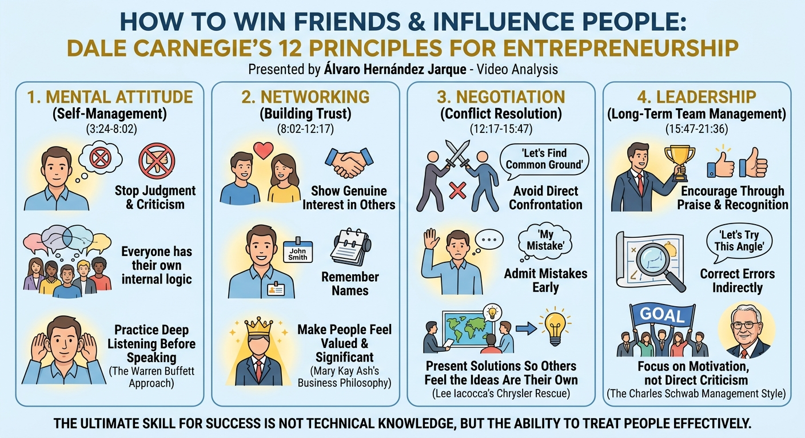
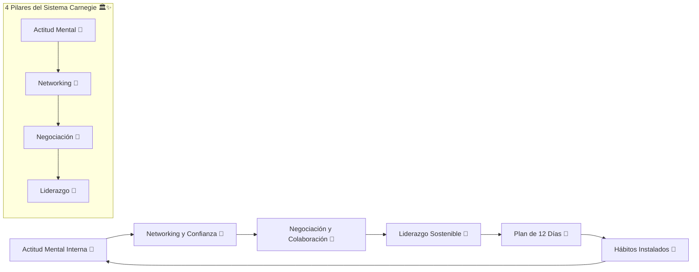
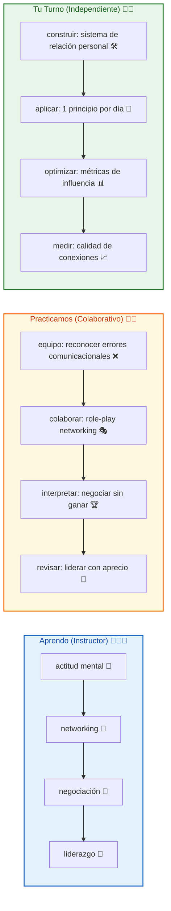

# 🤝🔥 MASTERCLASS: Cómo Ganar Amigos e Influir Sobre las Personas — Los 12 Principios de Dale Carnegie Aplicados al Emprendimiento ✨🚀



## 🎯 INTRODUCCIÓN: POR QUÉ ESTE MASTERCLASS ES DIFERENTE 💡🌟

🚫 La procrastinación NO es un problema de gestión del tiempo ⏰. No es vagancia 💤. No es falta de voluntad 🧱. Muchos emprendedores creen que el éxito depende del conocimiento técnico, las métricas o el producto. Pero Dale Carnegie descubrió algo contra-intuitivo: **la habilidad más determinante para el éxito es la capacidad de tratar bien a las personas**.
Este masterclass propone un camino distinto: **entender los 12 principios como un sistema operativo social** que se puede aprender, practicar y automatizar en tu día a día. No se trata de manipulación — se trata de construir relaciones genuinas donde todas las partes ganan. 🔄✨

> **🎯 Objetivo de Aprendizaje** — Al final de esta guía, podrás: (1) explicar los 4 pilares del sistema Carnegie, (2) aplicar los 12 principios en conversaciones reales, (3) diseñar un plan de 12 días para instalar estos hábitos, y (4) medir tu progreso en relaciones humanas y liderazgo.

> **⚠️ Advertencia formativa** — Este contenido es educativo. La influencia genuina requiere autenticidad y consistencia. Ningún principio reemplaza la intención honesta de ayudar a otros. 🧘‍♂️🤝

---

## 🗺️ MAPA DEL WORKFLOW DE INFLUENCIA GENUINA 🗺️🚀



| Fase 🎯 | Pregunta que responde ❓ | Output principal 🎯 |
|---------|------------------------|---------------------|
| **Actitud Mental** 🧠 | ¿Cómo debo pensar para influir bien? | Mentalidad de servicio y apertura 💡 |
| **Networking** 🤝 | ¿Cómo genero confianza inmediata? | Conexiones genuinas y memorables ✨ |
| **Negociación** 🎯 | ¿Cómo resuelvo conflictos sin confrontación? | Acuerdos colaborativos 🤝 |
| **Liderazgo** 🦸 | ¿Cómo inspiro compromiso genuino? | Equipos motivados y autónomos 🚀 |
| **Plan 12 días** 📅 | ¿Cómo practico cada principio? | Hábitos instalados 🔄 |
| **Hábitos** 🔄 | ¿Cómo mantengo el sistema? | Relaciones duraderas y productivas 🌳 |



---

## 🔹 PARTE 1: ACTITUD MENTAL — EL TRABAJO INTERNO PRIMERO (3:24 – 8:02) 🧠✨

Antes de influir en otros, Carnegie insiste en algo incómodo: **el primer cambio ocurre dentro de ti**. Si tu actitud es crítica o defensiva, ninguna técnica funcionará. 🔄

### Principio 1 — Deja de criticar y juzgar 🚫😤

La crítica directa rara vez cambia el comportamiento; en cambio, activa el mecanismo de defensa del otro. La persona se enfoca en justificarse, no en mejorar. 🛡️

> 🧩 **Ejemplo del instructor:** Cuando le dices a un empleado "esto está mal hecho", su cerebro no procesa el error — procesa el ataque. La energía se va a defenderse, no a corregir. ⚡

### Principio 2 — Todos tienen su propia lógica interna 🧠🔍

Nadie se considera a sí mismo "el villano" de su historia. Cada persona actúa según su propia versión de la razón, moldeada por su contexto, miedos e información disponible. 🌍

> 🧩 **Aplicación:** Antes de juzgar una decisión ajena, pregúntate: *"¿Qué tendría que ser cierto para que esta decisión tenga sentido desde su perspectiva?"* 🤔

### Principio 3 — Escucha profunda antes de hablar (el enfoque Warren Buffett) 🎧🤔

Buffett es conocido por escuchar mucho más de lo que habla en las reuniones. La escucha genuina no es esperar tu turno para responder — es intentar comprender completamente antes de opinar. 👂

> 🧩 **Caso real:** Se dice que Buffett dedica gran parte de sus reuniones a hacer preguntas y escuchar, reservando su opinión para el final, cuando ya tiene el panorama completo. 📊

### ✅ Ejercicio práctico 1 🎯✨

Durante las próximas 24 horas, en cada conversación de trabajo:
- 🚫 No interrumpas.
- 🧠 Antes de responder, resume mentalmente lo que la otra persona dijo.
- 📊 Cuenta cuántas veces sentiste el impulso de corregir o juzgar y no lo hiciste.

| Señal de crítica 🚫 | Alternativa genuina ✅ |
|---------------------|----------------------|
| "Esto está mal" 😤 | "¿Qué hubiera pasado si...?" 🤔 |
| "No entiendo por qué hiciste eso" 😕 | "¿Cómo llegaste a esa conclusión?" 🔍 |
| "Deberías haber..." 😠 | "La próxima vez, ¿qué harías diferente?" 💡 |
| "Eso no funciona" ❌ | "¿Qué resultados esperabas ver?" 📊 |

> 💡 **Punto clave:** No puedes influir en quien te percibe como una amenaza. La actitud mental correcta es el permiso de entrada a cualquier relación de confianza. 🚪✅

---

## 🔹 PARTE 2: NETWORKING — CONSTRUIR CONFIANZA INMEDIATA (8:02 – 12:17) 🤝🔥

### Principio 4 — Interés genuino en los demás ❤️👥

Carnegie sostiene que **puedes hacer más amigos en dos meses interesándote genuinamente en otros que en dos años tratando de que otros se interesen en ti**. 🎯

### Principio 5 — Recuerda los nombres 🏷️🧑

El nombre de una persona es, para ella, el sonido más importante y agradable en cualquier idioma. Recordarlo comunica: *"Me importas lo suficiente como para recordarte"*. 💬

> 🧩 **Ejemplo práctico:** Al conocer a alguien, repite su nombre en la conversación ("Un gusto, María... y María, ¿a qué te dedicas?"). Esto ancla el nombre en tu memoria y hace sentir valorada a la otra persona. 🧠

### Principio 6 — Haz que las personas se sientan importantes (filosofía de Mary Kay Ash) 🌟👑

Mary Kay Ash construyó su imperio empresarial bajo una regla simple: tratar a cada persona como si llevara un cartel invisible que dice *"Hazme sentir importante"*. 📢

> 🧩 **Caso real:** Ash entrenaba a su equipo de ventas para practicar el reconocimiento genuino y público del logro ajeno, generando lealtad y motivación mucho más fuertes que cualquier incentivo económico aislado. 💼

### ✅ Ejercicio práctico 2 🎯✨

En tu próxima reunión o evento de networking:
1. 🎤 Haz al menos 2 preguntas genuinas sobre la otra persona antes de hablar de ti.
2. 🏷️ Usa su nombre 3 veces durante la conversación.
3. 🌟 Encuentra algo específico y sincero que reconocer sobre lo que hace.

| Técnica 🤝 | Acción concreta ⚡ | Resultado esperado ✅ |
|-----------|------------------|---------------------|
| Repetición de nombre 🔁 | Decir el nombre 3 veces en la conversación | Retención mayor en memoria 🧠 |
| Preguntas abiertas 💬 | "¿Cómo empezaste en...?" | La otra persona habla 80% del tiempo 🗣️ |
| Reconocimiento específico 🌟 | "Me impresionó cómo manejaste..." | Conexión emocional auténtica ❤️ |
| Seguimiento posterior 📱 | Enviar mensaje al día siguiente | Relación perdura en el tiempo 📅 |

> 💡 **Punto clave:** La confianza no se construye impresionando a los demás — se construye haciéndolos sentir vistos. 👀✅

---

## 🔹 PARTE 3: NEGOCIACIÓN — RESOLVER CONFLICTOS SIN CONFRONTACIÓN (12:17 – 15:47) 🎯✨

### Principio 7 — Evita la confrontación directa 🛡️✋

Ganar una discusión casi nunca significa ganar a la persona. Aunque tengas razón, si la otra persona siente que "perdió", la relación queda dañada y la resistencia futura aumenta. 📉

### Principio 8 — Admite tus errores rápido y con firmeza 🙋‍♂️✅

Reconocer un error propio **antes** de que otro lo señale desarma la tensión y transforma el conflicto en colaboración. 🤝

> 🧩 **Caso real — Lee Iacocca y el rescate de Chrysler:** Al asumir el liderazgo de una Chrysler al borde de la quiebra, Iacocca fue transparente sobre los errores de la compañía y se acercó a sindicatos, proveedores y al propio gobierno estadounidense no desde la confrontación, sino desde la honestidad y la búsqueda de soluciones compartidas — un enfoque clave en el histórico rescate de la empresa. 🏭

### Principio 9 — Deja que la otra persona sienta que la idea es suya 💡🎭

Las personas defienden con más pasión las ideas que sienten como propias. Guiar la conversación con preguntas, en vez de imponer conclusiones, multiplica la aceptación. 🔄

> 🧩 **Técnica práctica:** En vez de decir *"Deberíamos hacer X"*, pregunta *"¿Qué pensarías si probáramos X?"* — el resultado final puede ser el mismo, pero la persona co-crea la decisión. 💬

### ✅ Ejercicio práctico 3 🎯✨

Piensa en un conflicto reciente. Reescribe cómo lo abordaste usando:
- 🙋‍♂️ Una admisión temprana de tu parte del error (aunque sea parcial).
- ❓ Una pregunta que invite a la otra persona a proponer la solución, en vez de imponerla tú.

| Enfoque confrontacional ❌ | Enfoque colaborativo ✅ |
|---------------------------|------------------------|
| "Tú tienes la culpa" 😠 | "Yo también tuve parte en esto" 🤝 |
| "Esto es lo que hay que hacer" 📢 | "¿Qué crees que funcionaría mejor?" 💬 |
| "No es mi problema" 🚫 | "¿Cómo podemos resolverlo juntos?" 🤝 |
| "Esto es inaceptable" ❌ | "¿Qué necesitas para que esto funcione?" 📋 |

> 💡 **Punto clave:** Negociar bien no es ganar el argumento — es lograr el resultado deseado preservando la relación. 🏆❤️

---

## 🔹 PARTE 4: LIDERAZGO — GESTIÓN DE EQUIPOS A LARGO PLAZO (15:47 – 21:36) 🦸✨

### Principio 10 — El reconocimiento supera a la crítica 🌟👏

Los equipos no rinden más por miedo — rinden más cuando sienten que su esfuerzo es visto y valorado. 💪

### Principio 11 — El estilo de gestión de Charles Schwab 💼🏆

Schwab, uno de los primeros ejecutivos millonarios en la industria del acero de EE.UU., atribuía gran parte de su éxito no a su conocimiento técnico, sino a su capacidad de **generar entusiasmo en las personas** mediante el aprecio sincero y el estímulo constante, en lugar de la crítica destructiva. 🏭

> 🧩 **Principio de Schwab:** Elogiar de forma específica y pública, y corregir de forma privada y constructiva. 🎤

### Principio 12 — Estimular en lugar de ordenar 🚀💬

Un líder que solo da órdenes genera cumplimiento mínimo. Un líder que estimula genera compromiso genuino, porque la persona conecta la tarea con su propio sentido de capacidad y propósito. 🔗

> 🧩 **Ejemplo práctico:** En lugar de "Tienes que mejorar tus reportes", prueba: "He notado que cuando profundizas en el análisis, el equipo confía mucho más en tus reportes — sigamos por ahí". 📈

### ✅ Ejercicio práctico 4 🎯✨

Piensa en una persona de tu equipo (o en ti mismo, si lideras un proyecto propio). Escribe:
1. 🌟 Un reconocimiento específico y sincero que podrías dar hoy.
2. 💬 Una corrección pendiente — reescríbela en tono de estímulo, no de orden.

| Estilo autoritario ❌ | Estilo estimulante ✅ |
|----------------------|----------------------|
| "Tienes que..." 📢 | "Podrías..." 💬 |
| "No hagas esto" 🚫 | "Te sugiero probar..." 💡 |
| "Está mal, hazlo de nuevo" ❌ | "Veo potencial, vamos a pulir esto juntos" 🤝 |
| "Es tu responsabilidad" 📋 | "Tu aporte es clave para..." 🌟 |

> 💡 **Punto clave:** El liderazgo sostenible no se construye con autoridad, sino con la capacidad de hacer que las personas quieran dar lo mejor de sí. 🦸✨

---

## 📅 PARTE 5: PLAN DE APLICACIÓN DE 12 DÍAS (UNO POR PRINCIPIO) 📆🔥

| Día 📅 | Principio ⚖️ | Acción concreta ⚡ |
|--------|-------------|-------------------|
| 1 | 🚫 No critiques ni juzgues | Detecta un impulso de crítica y sustitúyelo por una pregunta 🤔 |
| 2 | 🧠 Lógica interna ajena | Analiza una decisión que no entiendes desde la perspectiva del otro 🔍 |
| 3 | 🎧 Escucha profunda | Aplica la "regla Buffett": escucha más de lo que hablas en una reunión 👂 |
| 4 | ❤️ Interés genuino | Haz 3 preguntas genuinas a alguien nuevo 💬 |
| 5 | 🏷️ Recuerda nombres | Practica el método de repetición de nombres en 3 conversaciones 🔁 |
| 6 | 🌟 Haz sentir importante | Da un reconocimiento específico y público 👏 |
| 7 | 🛡️ Evita confrontación | Identifica una discusión que puedas resolver sin "ganar" 🤝 |
| 8 | 🙋‍♂️ Admite errores | Reconoce un error propio antes de que te lo señalen ✅ |
| 9 | 💡 Ideas del otro | Convierte una instrucción en una pregunta que invite a co-crear ❓ |
| 10 | 🌟 Reconocimiento sobre crítica | Reemplaza una crítica pendiente por un elogio específico 💬 |
| 11 | 💼 Estilo Schwab | Elogia en público, corrige en privado, hoy mismo 🎤 |
| 12 | 🚀 Estimular, no ordenar | Reformula una orden pendiente en un mensaje de estímulo 💪 |

> 🧩 **Nota del instructor:** No se trata de memorizar frases — se trata de instalar un nuevo reflejo social. Cada día practicado es una repetición que reduce la fricción de aplicarlo automáticamente en el futuro. 🔄✨

---

## 🎓✨ PARTE 6: I DO / WE DO / YOU DO — EJERCICIOS PRÁCTICOS 🎓🌟

### 6.1 🏫 I Do — Actitud Mental en vivo 🧠🎯

**Objetivo:** experimentar el cambio interno antes de influir externamente. 🔄

| Paso 🚶 | Acción ⚡ | Resultado esperado ✅ |
|---------|---------|----------------------|
| 1️⃣ 🎯 | Selecciona una conversación difícil próxima | "Reunión con socio tensionado" 💬 |
| 2️⃣ 🚫 | Identifica impulso crítico previo | "Quiero decirle que está equivocado" 😤 |
| 3️⃣ 🧠 | Reformula a pregunta abierta | "¿Cómo ves la situación desde tu lado?" 🤔 |
| 4️⃣ 👂 | Practica escucha activa 80/20 | Él habla 80%, tú 20% 🎧 |
| 5️⃣ 📊 | Registra diferencia en tono y resultado | Antes vs después 📈 |

### 6.2 👥 We Do — Networking simulado en equipo 👥🤝

**Escenario:** feria de emprendedores. Cada integrante debe generar una conexión genuina en 3 minutos.

```
🎭 Role-play networking:

1. Entrante A (emprendedor): comparte tu proyecto SIN vender.
2. Entrante B (inversor): haz 3 preguntas genuinas antes de opinar.
3. Entrante C (cliente): identifica 1 valor específico del proyecto.
4. Todos: repite el nombre del otro al menos 2 veces. 🏷️
5. Todos: da 1 reconocimiento sincero antes de despedirte. 🌟
```

### 6.3 🎯 You Do — Sistema de relaciones personales 🛠️🚀

**Tarea:** diseña tu sistema de influencia genuina con 4 componentes:

| Componente 🧩 | Acción ⚡ | Alerta de fallo 🔔 |
|---------------|---------|-------------------|
| 🧠 Actitud Mental | Diario de 1 línea: "Hoy elegí escuchar en lugar de criticar" | Sin entrada 3 días 📅 |
| 🤝 Networking | Lista de 5 contactos para follow-up semanal | Sin follow-up 7 días 📅 |
| 🎯 Negociación | 1 conflicto reformulado en tono colaborativo | Sin práctica 10 días 📅 |
| 🦸 Liderazgo | 1 reconocimiento público por semana | Sin reconocimiento 7 días 📅 |

---

## ✅✨ PARTE 7: CHECKLIST FINAL DEL SISTEMA 🏁📋

| Bloque 🧩 | Check ✅ | Evidencia 📸 |
|------------|---------|--------------|
| **🧠 Actitud Mental** | Criticó 0 veces hoy, preguntó 3 veces | Journal de conversaciones |
| **🤝 Networking** | Hizo 5 preguntas genuinas en 1 evento | Notas de follow-up |
| **🎯 Negociación** | Reformuló 1 conflicto sin confrontación | Acuerdo escrito |
| **🦸 Liderazgo** | Dio 1 reconocimiento público | Testimonio del equipo |
| **📅 Plan 12 días** | Completó 7 días de práctica | Bitácora firmada |
| **📊 Métricas** | Mide calidad de conexiones semanalmente | Dashboard simple |

---

## 📝✨ PARTE 8: PREGUNTAS DE VERIFICACIÓN 📝🌟

Responde cada pregunta basándote en los conceptos de esta masterclass. Escribe tus respuestas o compártelas para profundizar tu aprendizaje. 📝💡

### Preguntas sobre los 4 Pilares 🏛️🔍

1. **🎯 Aplica**: ¿Qué crítica puedes transformar en pregunta abierta HOY? Escríbela antes y después. ⚡

2. **🔍 Analiza**: En tu última reunión, ¿qué porcentaje del tiempo hablaste vs escuchaste? ¿Cómo cambiaría el resultado si hubieras aplicado la regla 80/20 de Buffett? 📊

### Preguntas sobre los 12 Principios ⚖️✨

3. **🤝 Identifica**: ¿Cuál de los 12 principios te cuesta más aplicar? ¿Por qué? (Sé honesto contigo mismo). 🪞

4. **✅ Evalúa**: Piensa en un líder que admiras. ¿Cuáles 3 principios de Carnegie aplica de forma natural? ¿Cómo lo notas? 📋

### Preguntas sobre el Plan de 12 Días 📅🔥

5. **📆 Diseña**: Toma el principio que menos aplicas y diseña un ritual de 2 minutos para recordarlo cada mañana. ⏱️

6. **📈 Calcula**: Si aplicas 1 principio por día durante 12 días, ¿cuántas repeticiones totales habrás hecho? ¿Cómo afecta la repetición a la formación de hábitos? 🔄

### Preguntas Integradoras 🔗🌟

7. **🔗 Conecta**: ¿Cómo se relacionan el "interés genuino" (Principio 4) con el "reconocimiento específico" (Principio 10)? ¿Son la misma habilidad en diferentes momentos? 🧠

8. **💡 Propón un sistema**: Diseña un protocolo de 5 minutos para usar ANTES de cualquier reunión importante. Incluye: (1) actitud mental, (2) objetivo de networking, (3) postura de negociación. 📋

9. **🧪 Evalúa**: Si tuvieras que explicarle Carnegie a un emprendedor que dice "yo no tengo tiempo para estas cosas blandas", ¿qué 3 argumentos usarías basados en resultados medibles? 📊

10. **🏆 Síntesis final**: De los 4 pilares, ¿cuál consideras tu mayor debilidad? ¿Qué cambio pequeño podrías hacer mañana para fortalecerlo? 📈

---

## 📚✨ GLOSARIO RÁPIDO 📖🔬

| Término 📝 | Definición 📋 | Aplicación emprendedora 💼 |
|-----------|---------------|----------------------------|
| **Influencia genuina** 🤝 | Capacidad de guiar a otros sin coerción | Cierre de ventas, negociaciones, liderazgo |
| **Lógica interna** 🧠 | La versión de la realidad de cada persona | Entender objeciones, resolver conflictos |
| **Escucha activa** 🎧 | Escuchar para comprender, no para responder | Reuniones, ventas, feedback |
| **Reconocimiento específico** 🌟 | Elogio concreto sobre un comportamiento | Motivación de equipo, cultura empresarial |
| **Confrontación directa** ❌ | Imponer sin considerar la perspectiva ajena | Daña relaciones y contratos a largo plazo |
| **Co-creación** 💡 | La otra persona siente que la idea es suya | Aumenta compromiso y ejecución |
| **Estilo Schwab** 💼 | Elogiar público, corregir privado | Gestión de equipos de alto rendimiento |
| **Estímulo vs orden** 🚀 | Motivar vs mandar | Liderazgo sostenible vs compliance temporal |
| **Red de confianza** 🕸️ | Conexiones basadas en interés genuino | Referidos, partnerships, crecimiento orgánico |
| **Permiso de entrada** 🚪 | La otra persona se siente segura contigo | Base de toda relación comercial |

---

## 📐✨ ANEXO: FORMATO IDEAL PARA MASTERCLASS EDUCATIVAS 📐📏

### 📏 Estructura visual recomendada para lectura larga 📏✨

El ancho óptimo para artículos educativos es **60–75 caracteres por línea** (incluyendo espacios). Equivale aproximadamente a: 📐

```css
.article-content {
  font-size: 18px;
  line-height: 1.75;
  max-width: 65ch;
}
```

Esto facilita: ✅
- Mantener la atención 👀
- Reducir la fatiga visual 😌
- Mejorar la comprensión de conceptos complejos 🧠
- Facilitar el seguimiento de protocolos paso a paso 📋

---

### 🎯 CIERRE PRÁCTICO — NIVELES DE DOMINIO 🎯✅

| Nivel 📊 | Debes poder hacer ✨ | Evidencia 📸 |
|---------|---------------------|-------------|
| **🏫 I Do** | ✅ Aplicar los 3 primeros principios en una conversación real | Grabación o registro de práctica |
| **👥 We Do** | 🤝 Role-play networking y negociación en equipo | Sesión completada con feedback |
| **🎯 You Do** | 🚀 Implementar plan de 12 días y medir resultados | Sistema documentado y seguimiento 12 días |

---

## 🎁✨ RECURSOS ADICIONALES 🎁📚

- 📖 **📚 Dale Carnegie** — "Cómo Ganar Amigos e Influir Sobre las Personas" 📖
- 🎥 **🎬 Video:** Álvaro H. Jarque — Los 12 principios aplicados al emprendimiento ⏱️
- 🧠 **💡 Warren Buffett** — Estilo de escucha profunda 🎧
- 🛠️ **📱 Apps recomendadas:** Notion para seguimiento, Timer para ejercicios de escucha ✅
- 📖 **📚 Libros clave:** "El Arte de Conversar" (M. P. Fernández), "Influencia" (Robert Cialdini), "Liderazgo" (James MacGregor Burns) 📚
- 🧠 **⚕️ Psicología social:** Principios de persuasión ética 🧠
- 📝 **📓 Bullet Journal** — Método de Ryder Carroll para registro diario 📒

---

**🎉 Felicitaciones! Has completado la masterclass de los 12 principios de Dale Carnegie aplicados al emprendimiento. 🤝 Ahora comprendes que influir no es manipular — es crear espacios donde las personas se sientan escuchadas, valoradas y capaces. ✨ Tu próximo paso: elige 1 principio, aplícalo HOY en una conversación real, y observa cómo cambia la dinámica. La repetición convierte la técnica en naturaleza. 🚀🧠 Tu nueva identidad: "Soy alguien que hace que los demás se sientan importantes sin pedir nada a cambio". 🌟✨**
